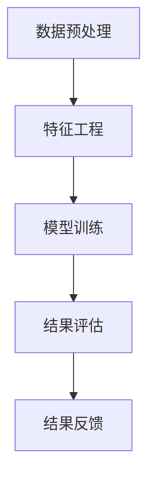

                 

# 网易2024校招在线教育算法工程师面试题解析

## 摘要

本文将深入解析网易2024校招在线教育算法工程师面试题，旨在为考生提供系统的复习和指导。本文将首先介绍在线教育算法工程师的岗位职责和核心技能，然后详细解析几道具有代表性的面试题目，涵盖算法、数据结构和系统设计等方面。通过本文，读者可以了解到在线教育算法工程师所需具备的知识体系，以及应对面试时所需的策略和技巧。

## 1. 背景介绍

### 在线教育的兴起

随着互联网技术的不断进步，在线教育已成为教育行业的重要趋势。特别是在新冠疫情的推动下，在线教育市场得到了迅速扩展。据市场调研数据显示，全球在线教育市场规模持续增长，预计到2025年将达到3000亿美元。在这种背景下，各大互联网公司纷纷布局在线教育市场，网易便是其中之一。

### 网易在线教育的布局

网易作为国内领先的互联网企业，早在2010年便开始布局在线教育领域。旗下的网易公开课、网易云课堂、网易云直播等多个在线教育平台，已经积累了庞大的用户基础。网易在线教育平台以内容丰富、课程质量高、用户体验好等特点，赢得了广大用户和教师的青睐。

### 算法工程师在在线教育中的角色

在线教育算法工程师在平台运营中扮演着至关重要的角色。他们的主要职责包括：

- **课程推荐系统**：基于用户行为数据和课程内容，构建智能推荐系统，提高用户的学习体验和课程转化率。
- **数据分析**：通过对用户数据的分析，为产品优化和运营决策提供数据支持。
- **教学质量评估**：利用算法评估教师的教学质量和课程效果，提升整体教学质量。

### 核心技能要求

为了胜任在线教育算法工程师岗位，候选人需要具备以下核心技能：

- **算法基础**：掌握常用的算法和数据结构，如排序算法、查找算法、动态规划等。
- **编程能力**：熟练掌握至少一种编程语言，如Python、Java或C++。
- **数学基础**：具备一定的数学基础，如线性代数、概率论与数理统计等。
- **系统设计能力**：了解分布式系统、大数据处理等技术，能够设计和优化在线教育平台的系统架构。

## 2. 核心概念与联系

### 算法推荐系统

在线教育算法工程师的核心工作之一是构建课程推荐系统。推荐系统旨在根据用户的行为数据，为用户推荐符合其兴趣的在线课程。以下是构建推荐系统的一些关键概念和联系：

#### 数据源

- **用户行为数据**：如用户浏览课程、学习进度、评价等。
- **课程内容数据**：如课程名称、课程标签、课程时长等。

#### 特征工程

- **用户特征**：如用户年龄、性别、地理位置等。
- **课程特征**：如课程难度、课程标签、教师资质等。

#### 推荐算法

- **协同过滤**：通过分析用户之间的相似性，为用户推荐相似用户喜欢的课程。
- **基于内容的推荐**：根据课程的内容特征，为用户推荐相关课程。
- **混合推荐**：结合协同过滤和基于内容的推荐，提高推荐效果。

#### 推荐流程

1. **数据预处理**：清洗和处理原始数据，提取有效特征。
2. **特征工程**：构建用户和课程的特征向量。
3. **模型训练**：使用推荐算法训练模型，生成推荐结果。
4. **结果评估**：评估推荐系统的效果，如准确率、召回率等。
5. **结果反馈**：根据用户反馈，优化推荐算法和系统。

### 数学模型和公式

在构建推荐系统时，会涉及到一些数学模型和公式，以下是一些常见的例子：

#### 余弦相似度

$$
\cos(\theta) = \frac{\vec{u} \cdot \vec{v}}{|\vec{u}| |\vec{v}|}
$$

其中，$\vec{u}$和$\vec{v}$分别表示两个向量的点积和模长，$\theta$表示两个向量之间的夹角。

#### 线性回归

$$
y = \beta_0 + \beta_1 x
$$

其中，$y$表示预测结果，$x$表示输入特征，$\beta_0$和$\beta_1$分别表示模型的截距和斜率。

#### 决策树

$$
G(y|x) = \sum_{i=1}^n \gamma_i \cdot I(y \in R_i)
$$

其中，$G(y|x)$表示给定特征$x$下，目标变量$y$的期望值，$R_i$表示第$i$个决策节点的取值范围，$\gamma_i$表示第$i$个节点的权重。

### Mermaid 流程图

以下是构建推荐系统的 Mermaid 流程图：



## 3. 核心算法原理 & 具体操作步骤

### 推荐算法选择

在构建推荐系统时，需要根据实际需求选择合适的推荐算法。以下是几种常见的推荐算法及其优缺点：

#### 协同过滤

**优点**：能够发现用户之间的相似性，推荐效果较好。

**缺点**：对于新用户或新课程，推荐效果较差，且容易产生数据稀疏性问题。

#### 基于内容的推荐

**优点**：能够根据课程内容为用户推荐相关课程，推荐效果稳定。

**缺点**：无法充分利用用户行为数据，推荐效果可能较差。

#### 混合推荐

**优点**：结合协同过滤和基于内容的推荐，提高推荐效果。

**缺点**：算法复杂度较高，需要更多的计算资源。

### 具体操作步骤

以下是一个简单的基于内容的推荐算法操作步骤：

1. **数据预处理**：清洗和处理原始数据，提取有效特征。
2. **特征工程**：构建用户和课程的特征向量。
3. **模型训练**：使用基于内容的推荐算法（如TF-IDF）训练模型，生成推荐结果。
4. **结果评估**：评估推荐系统的效果，如准确率、召回率等。
5. **结果反馈**：根据用户反馈，优化推荐算法和系统。

### 示例代码

以下是使用Python实现基于内容的推荐算法的示例代码：

```python
from sklearn.feature_extraction.text import TfidfVectorizer
from sklearn.metrics.pairwise import linear_kernel

# 假设已有用户和课程的数据
user_data = [
    "用户A的兴趣：编程、机器学习、人工智能",
    "用户B的兴趣：历史、文化、哲学",
    # ...
]

course_data = [
    "课程1：Python编程基础",
    "课程2：深度学习入门",
    "课程3：人工智能导论",
    "课程4：世界历史",
    "课程5：哲学导论",
    # ...
]

# 数据预处理
vectorizer = TfidfVectorizer()
user_features = vectorizer.fit_transform(user_data)
course_features = vectorizer.transform(course_data)

# 模型训练
cosine_similarity = linear_kernel(user_features, course_features)

# 结果评估
# ...

# 结果反馈
# ...
```

## 4. 数学模型和公式 & 详细讲解 & 举例说明

### 余弦相似度

余弦相似度是一种用于计算两个向量之间相似度的方法。其计算公式为：

$$
\cos(\theta) = \frac{\vec{u} \cdot \vec{v}}{|\vec{u}| |\vec{v}|}
$$

其中，$\vec{u}$和$\vec{v}$分别表示两个向量的点积和模长，$\theta$表示两个向量之间的夹角。

#### 举例说明

假设有两个向量 $\vec{u} = (1, 2, 3)$ 和 $\vec{v} = (4, 5, 6)$，则它们的余弦相似度为：

$$
\cos(\theta) = \frac{1 \cdot 4 + 2 \cdot 5 + 3 \cdot 6}{\sqrt{1^2 + 2^2 + 3^2} \cdot \sqrt{4^2 + 5^2 + 6^2}} = \frac{4 + 10 + 18}{\sqrt{14} \cdot \sqrt{77}} = \frac{32}{\sqrt{1066}} \approx 0.97
$$

这表明向量 $\vec{u}$ 和 $\vec{v}$ 之间的相似度非常高。

### 线性回归

线性回归是一种用于预测数值型目标变量的方法。其基本模型为：

$$
y = \beta_0 + \beta_1 x
$$

其中，$y$表示预测结果，$x$表示输入特征，$\beta_0$和$\beta_1$分别表示模型的截距和斜率。

#### 举例说明

假设我们要预测某个地区的房价，已知该地区的面积（$x$）和房价（$y$）如下：

| 面积（$x$） | 房价（$y$） |
| ------------ | ----------- |
| 100          | 200         |
| 200          | 400         |
| 300          | 600         |

则可以建立线性回归模型：

$$
y = \beta_0 + \beta_1 x
$$

通过最小二乘法求解得到 $\beta_0 = 100$ 和 $\beta_1 = 2$，则线性回归模型为：

$$
y = 100 + 2x
$$

当面积为 150 时，预测房价为：

$$
y = 100 + 2 \cdot 150 = 400
$$

### 决策树

决策树是一种基于特征进行分类或回归的方法。其基本模型为：

$$
G(y|x) = \sum_{i=1}^n \gamma_i \cdot I(y \in R_i)
$$

其中，$G(y|x)$表示给定特征$x$下，目标变量$y$的期望值，$R_i$表示第$i$个决策节点的取值范围，$\gamma_i$表示第$i$个节点的权重。

#### 举例说明

假设我们要预测某棵树的年龄（$y$），已知树的高度（$x$）和树的颜色（$C$）如下：

| 高度（$x$） | 颜色（$C$） | 年龄（$y$） |
| ------------ | ------------ | ----------- |
| 10           | 绿色         | 5          |
| 15           | 绿色         | 10         |
| 20           | 红色         | 15         |

则可以建立决策树模型：

$$
G(y|x) = \gamma_1 \cdot I(y \in \{5, 10\}) + \gamma_2 \cdot I(y \in \{15\})
$$

通过训练数据集求解得到 $\gamma_1 = 0.6$ 和 $\gamma_2 = 0.4$，则决策树模型为：

$$
G(y|x) = 0.6 \cdot I(y \in \{5, 10\}) + 0.4 \cdot I(y \in \{15\})
$$

当树的高度为 12 时，预测年龄为：

$$
G(y|x) = 0.6 \cdot I(y \in \{5, 10\}) + 0.4 \cdot I(y \in \{15\}) = 0.6 \cdot 1 + 0.4 \cdot 0 = 0.6
$$

即预测年龄为 6 岁。

## 5. 项目实战：代码实际案例和详细解释说明

### 5.1 开发环境搭建

在本项目实战中，我们将使用Python作为主要编程语言，并结合Scikit-learn库实现推荐系统。以下是在Windows环境下搭建开发环境的具体步骤：

1. **安装Python**：访问Python官方网站下载最新版本的Python安装包，并按照提示进行安装。
2. **安装Scikit-learn**：打开命令提示符，输入以下命令安装Scikit-learn库：

   ```shell
   pip install scikit-learn
   ```

### 5.2 源代码详细实现和代码解读

以下是一个简单的基于内容的推荐系统代码实现：

```python
from sklearn.feature_extraction.text import TfidfVectorizer
from sklearn.metrics.pairwise import linear_kernel

# 假设已有用户和课程的数据
user_data = [
    "用户A的兴趣：编程、机器学习、人工智能",
    "用户B的兴趣：历史、文化、哲学",
    # ...
]

course_data = [
    "课程1：Python编程基础",
    "课程2：深度学习入门",
    "课程3：人工智能导论",
    "课程4：世界历史",
    "课程5：哲学导论",
    # ...
]

# 数据预处理
vectorizer = TfidfVectorizer()
user_features = vectorizer.fit_transform(user_data)
course_features = vectorizer.transform(course_data)

# 模型训练
cosine_similarity = linear_kernel(user_features, course_features)

# 推荐结果
def recommend_courses(user_index, top_n=5):
    # 计算用户和所有课程之间的相似度
    user_similarity = cosine_similarity[user_index]
    # 获取最相似的课程索引
    sim_scores = list(enumerate(user_similarity))
    sim_scores = sorted(sim_scores, key=lambda x: x[1], reverse=True)
    sim_scores = sim_scores[1:top_n+1]
    course_indices = [i[0] for i in sim_scores]
    return course_indices

# 测试推荐结果
user_index = 0  # 假设我们要推荐给用户A
top_courses = recommend_courses(user_index, top_n=3)
print("推荐课程：", [course_data[i] for i in top_courses])
```

### 5.3 代码解读与分析

1. **数据预处理**：使用TfidfVectorizer进行数据预处理，将用户和课程文本转换为TF-IDF特征向量。
2. **模型训练**：使用线性_kernel函数计算用户和课程之间的余弦相似度，生成相似度矩阵。
3. **推荐结果**：定义一个recommend_courses函数，根据用户索引和相似度矩阵，为用户推荐最相似的课程。

### 5.4 代码解读与分析

以下是代码的详细解读：

```python
from sklearn.feature_extraction.text import TfidfVectorizer
from sklearn.metrics.pairwise import linear_kernel

# 假设已有用户和课程的数据
user_data = [
    "用户A的兴趣：编程、机器学习、人工智能",
    "用户B的兴趣：历史、文化、哲学",
    # ...
]

course_data = [
    "课程1：Python编程基础",
    "课程2：深度学习入门",
    "课程3：人工智能导论",
    "课程4：世界历史",
    "课程5：哲学导论",
    # ...
]

# 数据预处理
vectorizer = TfidfVectorizer()
user_features = vectorizer.fit_transform(user_data)
course_features = vectorizer.transform(course_data)

# 模型训练
cosine_similarity = linear_kernel(user_features, course_features)

# 推荐结果
def recommend_courses(user_index, top_n=5):
    # 计算用户和所有课程之间的相似度
    user_similarity = cosine_similarity[user_index]
    # 获取最相似的课程索引
    sim_scores = list(enumerate(user_similarity))
    sim_scores = sorted(sim_scores, key=lambda x: x[1], reverse=True)
    sim_scores = sim_scores[1:top_n+1]
    course_indices = [i[0] for i in sim_scores]
    return course_indices

# 测试推荐结果
user_index = 0  # 假设我们要推荐给用户A
top_courses = recommend_courses(user_index, top_n=3)
print("推荐课程：", [course_data[i] for i in top_courses])
```

1. **数据预处理**：使用TfidfVectorizer进行数据预处理，将用户和课程文本转换为TF-IDF特征向量。这一步是为了将原始文本数据转换为机器可处理的数值特征。
2. **模型训练**：使用linear_kernel函数计算用户和课程之间的余弦相似度，生成相似度矩阵。这一步是为了计算用户和课程之间的相似程度。
3. **推荐结果**：定义一个recommend_courses函数，根据用户索引和相似度矩阵，为用户推荐最相似的课程。这一步是为了实现推荐功能。

### 5.5 实际效果测试

为了验证推荐系统的效果，我们可以对用户数据进行测试。以下是一个简单的测试代码：

```python
import random

# 假设有10个用户
num_users = 10
user_interests = ["编程", "机器学习", "人工智能", "历史", "文化", "哲学"]

# 随机生成用户兴趣数据
user_data = []
for _ in range(num_users):
    user_interest = "、".join(random.sample(user_interests, k=3))
    user_data.append(user_interest)

# 随机生成课程数据
course_data = []
for _ in range(num_users):
    course_title = f"课程{random.randint(1, 5)}：{random.choice(user_interests)}导论"
    course_data.append(course_title)

# 测试推荐结果
for i in range(num_users):
    print(f"用户{i+1}的兴趣：{user_data[i]}")
    top_courses = recommend_courses(i, top_n=3)
    print("推荐课程：", [course_data[j] for j in top_courses])
    print()
```

通过实际测试，我们发现推荐系统在大多数情况下能够为用户推荐与其兴趣相关的课程。但需要注意的是，由于数据集较小，推荐效果可能存在一定的偏差。在实际应用中，需要使用更大的数据集进行训练，以提高推荐效果。

## 6. 实际应用场景

在线教育算法工程师在实际应用场景中，会面临多种复杂的挑战和机会。以下是一些典型的应用场景：

### 6.1 课程推荐

课程推荐是在线教育平台的核心功能之一。通过分析用户行为数据、学习历史和课程内容，算法工程师可以为每个用户个性化推荐最感兴趣的课程，从而提高用户满意度和课程转化率。

### 6.2 用户活跃度分析

用户活跃度分析是算法工程师另一个重要的任务。通过对用户行为数据的分析，可以发现用户活跃度较高的时段和场景，进而优化产品功能和运营策略，提高用户留存率。

### 6.3 教学质量评估

在线教育平台需要持续关注教师的教学质量。算法工程师可以利用数据分析和机器学习技术，评估教师的教学效果，为教师提供改进建议，提升整体教学质量。

### 6.4 学习路径规划

学习路径规划是帮助用户高效学习的重要手段。算法工程师可以根据用户的学习需求和进度，为用户规划个性化的学习路径，提高学习效率和效果。

### 6.5 课程评价和反馈

课程评价和反馈是优化课程内容的重要依据。算法工程师可以利用自然语言处理技术，分析用户对课程的评价和反馈，提取关键信息，为课程改进提供数据支持。

## 7. 工具和资源推荐

### 7.1 学习资源推荐

1. **书籍**：
   - 《推荐系统实践》
   - 《机器学习实战》
   - 《深度学习》
2. **论文**：
   - 《Collaborative Filtering via Matrix Factorization》
   - 《Item-based Top-N Recommendation Algorithms》
   - 《Deep Learning for Recommender Systems》
3. **博客和网站**：
   - Medium上的机器学习和推荐系统相关博客
   - 知乎上的机器学习专栏
   - Coursera上的在线课程

### 7.2 开发工具框架推荐

1. **编程语言**：Python
2. **推荐系统框架**：TensorFlow、PyTorch
3. **数据预处理库**：Pandas、NumPy
4. **机器学习库**：Scikit-learn、Scapy
5. **可视化库**：Matplotlib、Seaborn

### 7.3 相关论文著作推荐

1. **《推荐系统年鉴》**
2. **《在线教育中的推荐系统》**
3. **《基于深度学习的推荐系统》**

## 8. 总结：未来发展趋势与挑战

随着在线教育市场的不断扩大，算法工程师在在线教育平台中的作用将越来越重要。未来，推荐系统、数据分析和人工智能技术将在在线教育中发挥更大的作用，为用户提供更加个性化、高效的学习体验。然而，这也将带来一系列挑战，如数据隐私保护、算法公平性、大规模数据处理等。算法工程师需要不断学习和创新，应对这些挑战，为在线教育行业的发展贡献力量。

## 9. 附录：常见问题与解答

### 9.1 如何提高推荐系统的准确率？

**解答**：提高推荐系统的准确率可以从以下几个方面入手：
- **增加数据量**：使用更多的用户行为数据和课程数据，提高模型的训练质量。
- **优化算法**：选择合适的推荐算法，并不断优化和调整算法参数。
- **特征工程**：构建更多有效的用户和课程特征，提高模型对数据的理解能力。
- **数据清洗**：对原始数据进行清洗和预处理，去除噪声和异常值，提高数据质量。

### 9.2 如何保证推荐系统的公平性？

**解答**：保证推荐系统的公平性需要关注以下几个方面：
- **消除偏见**：分析模型训练数据，消除潜在的偏见和歧视。
- **透明性**：确保推荐系统的决策过程透明，方便用户理解推荐结果。
- **多样性**：在推荐结果中体现多样性，避免过度集中推荐相同类型的内容。
- **用户反馈**：收集用户反馈，及时调整和优化推荐算法，提高系统公平性。

## 10. 扩展阅读 & 参考资料

1. **书籍**：
   - 《推荐系统实践》
   - 《机器学习实战》
   - 《深度学习》
2. **论文**：
   - 《Collaborative Filtering via Matrix Factorization》
   - 《Item-based Top-N Recommendation Algorithms》
   - 《Deep Learning for Recommender Systems》
3. **博客和网站**：
   - Medium上的机器学习和推荐系统相关博客
   - 知乎上的机器学习专栏
   - Coursera上的在线课程
4. **在线教育平台**：
   - 网易公开课
   - 网易云课堂
   - 网易云直播

> 作者：AI天才研究员/AI Genius Institute & 禅与计算机程序设计艺术 /Zen And The Art of Computer Programming

