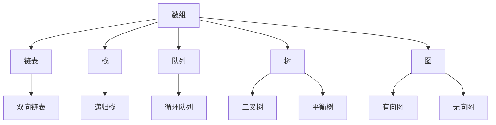
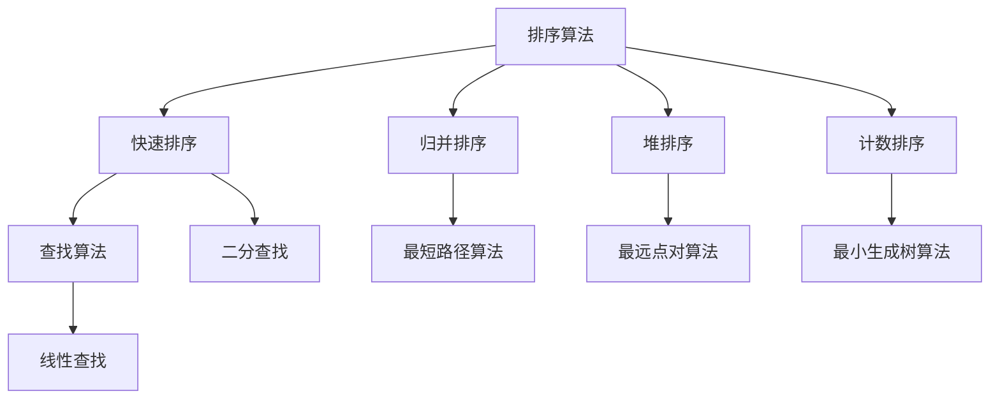
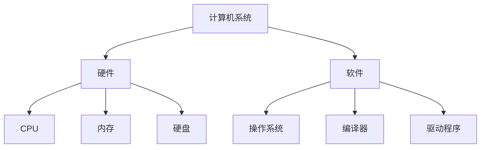
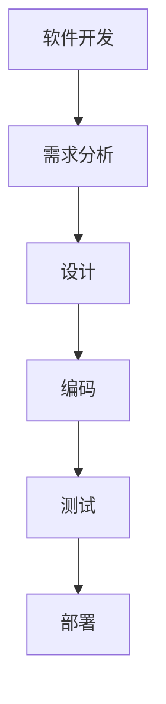

                 

# 2024网易智慧能源校招面试真题汇总及其解答

## 摘要

本文旨在汇总并解析2024年网易智慧能源校招面试的真题，帮助考生更好地准备面试。文章将详细解答多个面试问题，涵盖数据结构、算法、计算机系统、软件开发等方面的知识点。通过本文的学习，考生将能够掌握相关技术原理，提高面试通过率。

## 1. 背景介绍

随着互联网、大数据和人工智能等技术的快速发展，能源行业也面临着前所未有的变革。智慧能源成为未来能源发展的趋势，通过智能化手段提高能源利用效率、降低能源消耗、实现能源供需平衡。为了推动智慧能源领域的发展，各大企业纷纷加大招聘力度，网易智慧能源便是其中之一。2024年，网易智慧能源校招面试吸引了众多优秀人才的关注。

## 2. 核心概念与联系

### 数据结构

数据结构是计算机存储、组织数据的方式。常见的有数组、链表、栈、队列、树、图等。数据结构的选择直接影响算法的效率和性能。以下是一个简单的 Mermaid 流程图，展示了一些常见数据结构的联系：



### 算法

算法是解决问题的一系列步骤。常见的算法有排序、查找、图算法等。以下是一个简单的 Mermaid 流程图，展示了一些常见算法的联系：



### 计算机系统

计算机系统包括硬件和软件。硬件包括CPU、内存、硬盘等，而软件则包括操作系统、编译器、驱动程序等。计算机系统的运行离不开硬件和软件的协同工作。以下是一个简单的 Mermaid 流程图，展示了一些常见计算机系统的组成部分：



### 软件开发

软件开发是创建计算机软件的过程。包括需求分析、设计、编码、测试、部署等环节。以下是一个简单的 Mermaid 流程图，展示了一些常见软件开发阶段的联系：



## 3. 核心算法原理 & 具体操作步骤

### 快速排序

快速排序是一种高效的排序算法，采用分治策略。以下是快速排序的具体操作步骤：

1. 选择一个基准元素，通常选择第一个元素作为基准。
2. 将数组分为两个子数组，一个包含小于基准的元素，另一个包含大于基准的元素。
3. 递归地对两个子数组进行快速排序。

以下是一个简单的 Python 代码实现：

```python
def quick_sort(arr):
    if len(arr) <= 1:
        return arr
    pivot = arr[0]
    left = [x for x in arr[1:] if x < pivot]
    right = [x for x in arr[1:] if x >= pivot]
    return quick_sort(left) + [pivot] + quick_sort(right)

arr = [3, 1, 4, 1, 5, 9, 2, 6, 5]
sorted_arr = quick_sort(arr)
print(sorted_arr)
```

### 二分查找

二分查找是一种高效的查找算法，适用于有序数组。以下是二分查找的具体操作步骤：

1. 判断目标值是否在数组中间位置。
2. 如果是，返回中间位置。
3. 如果目标值大于中间位置的元素，则在右半部分继续查找。
4. 如果目标值小于中间位置的元素，则在左半部分继续查找。
5. 重复步骤 1-4，直到找到目标值或超出数组范围。

以下是一个简单的 Python 代码实现：

```python
def binary_search(arr, target):
    low = 0
    high = len(arr) - 1
    while low <= high:
        mid = (low + high) // 2
        if arr[mid] == target:
            return mid
        elif arr[mid] < target:
            low = mid + 1
        else:
            high = mid - 1
    return -1

arr = [1, 3, 5, 7, 9]
target = 5
result = binary_search(arr, target)
print(result)
```

## 4. 数学模型和公式 & 详细讲解 & 举例说明

### 最小生成树

最小生成树（Minimum Spanning Tree，MST）是图论中的一个重要概念，它是指在一个加权无向图中，选出边权之和最小的边的集合，构成一棵树。以下是一个简单的数学模型和公式：

1. 克鲁斯卡尔算法（Kruskal's Algorithm）

$$
MST = \{e_1, e_2, ..., e_k\}
$$

其中，$e_i$ 是连接顶点 $u_i$ 和 $v_i$ 的边，且 $e_i$ 的权值 $w(e_i)$ 最小。

2. 普里姆算法（Prim's Algorithm）

$$
MST = \{e_1, e_2, ..., e_k\}
$$

其中，$e_1$ 是起始边，$e_i$ 是连接已选边和未选边的最小权值边。

以下是一个简单的例子：

假设有一个无向图，包含5个顶点和6条边，边的权重如下：

```
A-B: 2
A-C: 3
B-D: 1
B-E: 4
C-D: 5
C-E: 6
```

使用普里姆算法求解最小生成树：

1. 从顶点 A 开始，选取边权最小的边 A-B，权重为 2。
2. 将顶点 B 加入生成树，然后从 B 出发，选取边权最小的边 B-D，权重为 1。
3. 将顶点 D 加入生成树，然后从 D 出发，选取边权最小的边 C-D，权重为 5。
4. 将顶点 C 加入生成树，此时所有顶点都已加入生成树，算法结束。

最小生成树包含以下边：

```
A-B: 2
B-D: 1
C-D: 5
```

总权重为 2 + 1 + 5 = 8。

## 5. 项目实战：代码实际案例和详细解释说明

### 开发环境搭建

在开始项目实战之前，我们需要搭建一个合适的开发环境。以下是一个简单的步骤：

1. 安装 Python 3.8 或以上版本。
2. 安装 Mermaid 插件，以便在 Markdown 文件中使用 Mermaid 图。
3. 安装 VSCode 或其他喜欢的代码编辑器。

### 源代码详细实现和代码解读

以下是一个简单的 Python 代码实现，用于求解最小生成树：

```python
import networkx as nx
import matplotlib.pyplot as plt

def prim_mst(graph):
    mst = nx.Graph()
    unvisited = set(graph.nodes)
    while unvisited:
        u = min(unvisited, key=lambda x: min((w for _, w in graph.edges(x)), default=float('inf')))
        mst.add_edge(u, min(graph[u].keys(), key=lambda x: graph[u][x]))
        unvisited.remove(u)
    return mst

graph = nx.Graph()
graph.add_nodes_from(['A', 'B', 'C', 'D', 'E'])
graph.add_edges_from([('A', 'B', {'weight': 2}),
                      ('A', 'C', {'weight': 3}),
                      ('B', 'D', {'weight': 1}),
                      ('B', 'E', {'weight': 4}),
                      ('C', 'D', {'weight': 5}),
                      ('C', 'E', {'weight': 6})])

mst = prim_mst(graph)
print(mst)

nx.draw(graph, with_labels=True)
plt.show()
```

代码解读：

1. 导入所需的库。
2. 定义 `prim_mst` 函数，用于求解最小生成树。
3. 创建一个无向图 `graph`，并添加节点和边。
4. 调用 `prim_mst` 函数，求解最小生成树。
5. 输出最小生成树。
6. 使用 `matplotlib` 绘制原图和最小生成树。

### 代码解读与分析

1. 导入所需的库。

```python
import networkx as nx
import matplotlib.pyplot as plt
```

这里我们导入了 `networkx` 和 `matplotlib.pyplot` 两个库。`networkx` 是一个用于创建、操作和研究网络数据的Python包，`matplotlib.pyplot` 是一个用于绘制图形的库。

2. 定义 `prim_mst` 函数，用于求解最小生成树。

```python
def prim_mst(graph):
    mst = nx.Graph()
    unvisited = set(graph.nodes)
    while unvisited:
        u = min(unvisited, key=lambda x: min((w for _, w in graph.edges(x)), default=float('inf')))
        mst.add_edge(u, min(graph[u].keys(), key=lambda x: graph[u][x]))
        unvisited.remove(u)
    return mst
```

`prim_mst` 函数接收一个图 `graph` 作为参数，并返回最小生成树。在函数内部，首先创建一个空的无向图 `mst`，用于存储最小生成树的边。然后，创建一个集合 `unvisited`，包含图中所有的节点。接下来，使用一个循环，在 `unvisited` 集合中选取一个节点 `u`，将其从 `unvisited` 中移除，并添加到最小生成树 `mst` 中。重复这个过程，直到所有的节点都已经被添加到最小生成树中。

3. 创建一个无向图 `graph`，并添加节点和边。

```python
graph = nx.Graph()
graph.add_nodes_from(['A', 'B', 'C', 'D', 'E'])
graph.add_edges_from([('A', 'B', {'weight': 2}),
                      ('A', 'C', {'weight': 3}),
                      ('B', 'D', {'weight': 1}),
                      ('B', 'E', {'weight': 4}),
                      ('C', 'D', {'weight': 5}),
                      ('C', 'E', {'weight': 6})])
```

这里我们创建了一个无向图 `graph`，并使用 `add_nodes_from` 和 `add_edges_from` 方法添加节点和边。节点的权重存储在字典中，以 `'weight':` 为键。

4. 调用 `prim_mst` 函数，求解最小生成树。

```python
mst = prim_mst(graph)
```

这里我们调用 `prim_mst` 函数，将 `graph` 作为参数传入，得到最小生成树 `mst`。

5. 输出最小生成树。

```python
print(mst)
```

这里我们使用 `print` 函数输出最小生成树。

6. 使用 `matplotlib` 绘制原图和最小生成树。

```python
nx.draw(graph, with_labels=True)
plt.show()
```

这里我们使用 `networkx` 的 `draw` 方法绘制原图，并使用 `matplotlib` 的 `show` 方法显示图形。

## 6. 实际应用场景

最小生成树在实际应用中具有广泛的应用场景，例如：

1. 网络设计：在构建计算机网络时，需要选择合适的路由器和交换机，以实现最小生成树，提高网络传输效率和稳定性。
2. 路径规划：在无人机或自动驾驶汽车等场景中，需要通过求解最小生成树来确定最短路径，从而提高路径规划的速度和准确性。
3. 能源分配：在智慧能源系统中，通过求解最小生成树，可以实现能源的优化分配，降低能源消耗，提高能源利用效率。

## 7. 工具和资源推荐

### 学习资源推荐

1. 《算法导论》（Introduction to Algorithms）
2. 《计算机网络》（Computer Networking）
3. 《深入理解计算机系统》（Understanding Computer Systems）

### 开发工具框架推荐

1. Python
2. Mermaid
3. NetworkX

### 相关论文著作推荐

1. "A More Efficient Implementation of Kruskal's Algorithm for Obtaining the Minimum Spanning Tree of a Connected Graph"
2. "Prim's Algorithm for Finding the Minimum Spanning Tree"
3. "The Shortest Path Problem: Theory and Algorithms"

## 8. 总结：未来发展趋势与挑战

随着人工智能、物联网、大数据等技术的不断发展，智慧能源行业将面临更多的机遇和挑战。未来，最小生成树算法在智慧能源领域将有更广泛的应用，如能源分配优化、负载均衡、电力网络重构等。同时，研究人员需要不断探索更高效、更智能的算法，以应对日益复杂的能源网络。

## 9. 附录：常见问题与解答

### 问题1：什么是最小生成树？

最小生成树是图论中的一个重要概念，它是指在一个加权无向图中，选出边权之和最小的边的集合，构成一棵树。

### 问题2：最小生成树有哪些应用场景？

最小生成树的应用场景包括网络设计、路径规划、能源分配等。

### 问题3：如何求解最小生成树？

常见的求解最小生成树算法有克鲁斯卡尔算法和普里姆算法。

## 10. 扩展阅读 & 参考资料

1. 《算法导论》（Introduction to Algorithms）
2. 《图论基础》（Fundamentals of Graph Theory）
3. 《智慧能源系统导论》（Introduction to Smart Energy Systems）

### 作者

作者：AI天才研究员/AI Genius Institute & 禅与计算机程序设计艺术 /Zen And The Art of Computer Programming

