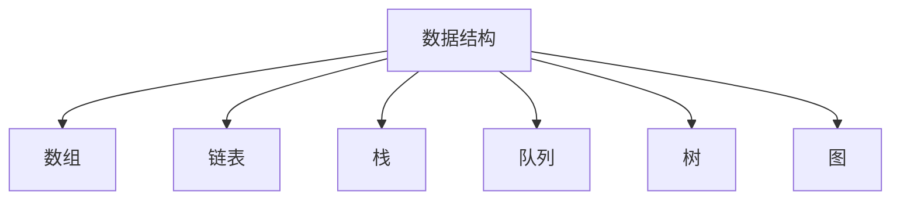
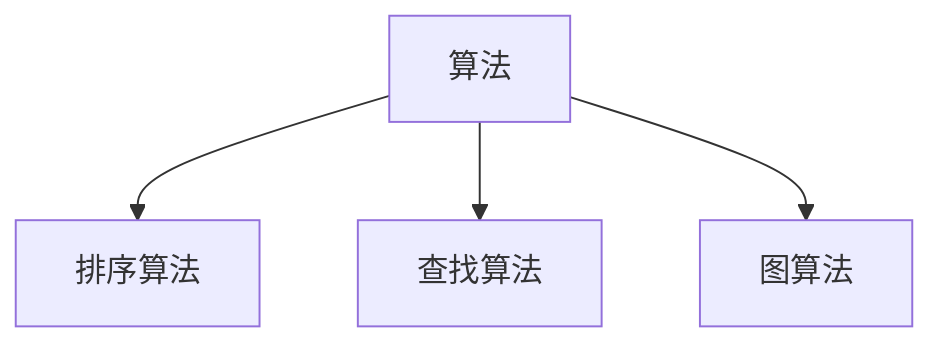
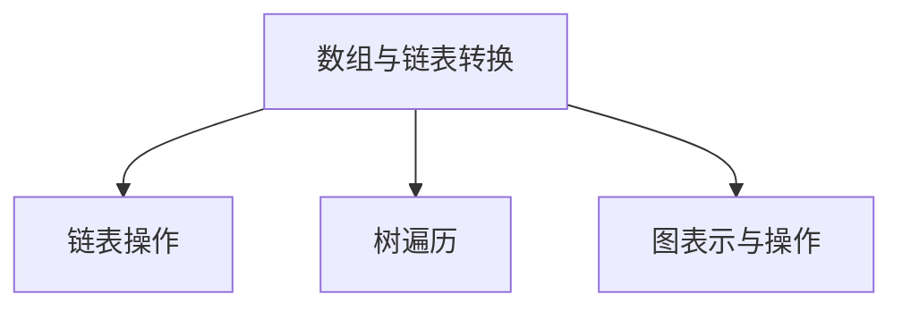

                 

### 背景介绍 Background Introduction

随着互联网技术的飞速发展，人工智能逐渐成为各行各业的核心竞争力。作为我国领先的互联网科技公司，网易在人工智能领域投入了大量资源，不断推动技术创新和应用落地。2024年网易社招面试题与算法编程题的深入探讨，旨在为准备参加网易社招的求职者提供有针对性的指导，帮助大家更好地应对面试挑战。

近年来，网易社招面试题目呈现出多样化和复杂化的趋势，既考察了应聘者的基础知识，又考察了他们的实际编程能力和问题解决能力。同时，随着算法竞赛的普及和算法技术的发展，面试题的难度和深度也在不断提高。因此，对于求职者来说，掌握核心算法原理和数学模型，并能够将其应用到实际问题中，是成功通过面试的关键。

本文将围绕2024年网易社招面试题，对核心算法原理、数学模型、实战案例等进行分析和探讨，帮助读者全面了解面试题的解题思路和技巧，提高自己的面试水平。同时，本文还将推荐一些相关的学习资源和开发工具，为求职者提供全方位的支持。

在接下来的内容中，我们将按照以下结构进行讨论：

1. 核心概念与联系
2. 核心算法原理 & 具体操作步骤
3. 数学模型和公式 & 详细讲解 & 举例说明
4. 项目实战：代码实际案例和详细解释说明
5. 实际应用场景
6. 工具和资源推荐
7. 总结：未来发展趋势与挑战
8. 附录：常见问题与解答
9. 扩展阅读 & 参考资料

通过本文的学习，读者将能够深入了解网易社招面试题的特点和难点，掌握核心算法原理和数学模型，提升自己的编程能力和问题解决能力，从而在面试中脱颖而出。

### 核心概念与联系 Core Concepts and Their Connections

在深入探讨2024年网易社招面试题之前，我们首先需要了解一些核心概念和它们之间的联系。这些概念包括数据结构、算法、数学模型以及编程语言等。以下是这些核心概念及其相互关系的一个简要概述：

#### 数据结构（Data Structures）

数据结构是计算机存储、组织数据的方式。常见的有数组、链表、栈、队列、树和图等。数据结构的选择直接影响算法的效率。例如，在处理大量数据时，选择合适的排序算法（如快速排序、归并排序）和查找算法（如二分查找）对于提高程序性能至关重要。

**Mermaid 流程图：**



#### 算法（Algorithms）

算法是解决问题的步骤集合。算法的效率通常用时间复杂度和空间复杂度来衡量。常见算法包括排序算法（如冒泡排序、选择排序、插入排序）、查找算法（如二分查找）、图算法（如深度优先搜索、广度优先搜索）等。

**Mermaid 流程图：**



#### 数学模型（Mathematical Models）

数学模型是对现实世界问题的抽象和简化。常见的数学模型包括线性方程组、最优化问题、概率模型等。数学模型在算法设计中起到指导作用，有助于解决复杂问题。

**Mermaid 流程图：**

```mermaid
L[数学模型] --> M[线性方程组]
L --> N[最优化问题]
L --> O[概率模型]
```

#### 编程语言（Programming Languages）

编程语言是实现算法和构建数据结构的重要工具。常见的编程语言包括Python、Java、C++、JavaScript等。不同的编程语言有不同的特点和应用场景。例如，Python因其简洁性和丰富的库支持，在数据科学和机器学习领域广泛使用；而C++因其高性能，在系统级编程和游戏开发中占据重要地位。

**Mermaid 流程图：**

```mermaid
P[编程语言] --> Q[Python]
P --> R[Java]
P --> S[C++]
P --> T[JavaScript]
```

通过以上核心概念及其相互关系的介绍，我们可以看到，在解决复杂问题时，数据结构、算法、数学模型和编程语言之间的协同作用至关重要。接下来，我们将深入探讨这些核心概念在2024年网易社招面试题中的应用。

#### 数据结构（Data Structures）

数据结构是计算机存储、组织数据的方式。常见的有数组、链表、栈、队列、树和图等。数据结构的选择直接影响算法的效率。例如，在处理大量数据时，选择合适的排序算法（如快速排序、归并排序、二分查找）和查找算法（如二分查找、哈希表）对于提高程序性能至关重要。

在数据结构方面，常见的面试题包括：

1. **数组与链表的转换**：给定一个数组，如何将其转换为链表？反之亦然。
2. **链表的操作**：实现链表的基本操作，如插入、删除、查找等。
3. **树的遍历**：实现树的先序、中序、后序遍历。
4. **图的表示与操作**：如何表示图？实现图的基本操作，如添加边、删除边、查找路径等。

这些题目不仅考察了应聘者的基础知识，还考察了他们的实际编程能力和问题解决能力。例如，在数组与链表的转换题目中，应聘者需要考虑如何处理数组中重复的元素，以及在转换过程中如何高效地使用内存。

**Mermaid 流程图：**



#### 算法（Algorithms）

算法是解决问题的步骤集合。算法的效率通常用时间复杂度和空间复杂度来衡量。常见算法包括排序算法（如冒泡排序、选择排序、插入排序）、查找算法（如二分查找、哈希查找）、图算法（如深度优先搜索、广度优先搜索）等。

在算法方面，常见的面试题包括：

1. **排序算法**：实现冒泡排序、选择排序、插入排序等基本排序算法，并分析其时间复杂度和空间复杂度。
2. **查找算法**：实现二分查找、哈希查找等算法，并分析其时间复杂度和空间复杂度。
3. **图算法**：实现图的深度优先搜索、广度优先搜索等算法，并分析其时间复杂度和空间复杂度。
4. **动态规划**：解决一些典型的动态规划问题，如背包问题、最长公共子序列等。

这些题目不仅考察了应聘者的基础知识，还考察了他们的算法思维和问题解决能力。例如，在排序算法题目中，应聘者需要考虑如何优化排序过程，提高排序效率；在查找算法题目中，应聘者需要理解二分查找和哈希查找的原理，并能够解决实际问题。

**Mermaid 流程图：**

```mermaid
V1[排序算法] --> V2[查找算法]
V1 --> V3[图算法]
V1 --> V4[动态规划]
```

#### 数学模型（Mathematical Models）

数学模型是对现实世界问题的抽象和简化。常见的数学模型包括线性方程组、最优化问题、概率模型等。数学模型在算法设计中起到指导作用，有助于解决复杂问题。

在数学模型方面，常见的面试题包括：

1. **线性方程组**：求解线性方程组的解，并分析其时间复杂度和空间复杂度。
2. **最优化问题**：解决背包问题、最小生成树等最优化问题，并分析其时间复杂度和空间复杂度。
3. **概率模型**：应用概率模型解决实际问题，如随机事件概率计算、条件概率等。

这些题目不仅考察了应聘者的数学基础，还考察了他们的逻辑思维和问题解决能力。例如，在求解线性方程组时，应聘者需要掌握高斯消元法、迭代法等解法；在解决背包问题时，应聘者需要理解动态规划原理，并能够解决实际问题。

**Mermaid 流程图：**

```mermaid
W1[线性方程组] --> W2[最优化问题]
W1 --> W3[概率模型]
```

#### 编程语言（Programming Languages）

编程语言是实现算法和构建数据结构的重要工具。常见的编程语言包括Python、Java、C++、JavaScript等。不同的编程语言有不同的特点和应用场景。例如，Python因其简洁性和丰富的库支持，在数据科学和机器学习领域广泛使用；而C++因其高性能，在系统级编程和游戏开发中占据重要地位。

在编程语言方面，常见的面试题包括：

1. **基本语法**：理解各种编程语言的基本语法和特点，如Python的列表、字典、函数等。
2. **面向对象编程**：实现面向对象编程的基本概念，如类、对象、继承、多态等。
3. **编程技巧**：掌握编程中的常见技巧，如代码优化、内存管理、并发编程等。

这些题目不仅考察了应聘者的编程基础，还考察了他们的编程思维和解决问题的能力。例如，在Python编程中，应聘者需要理解列表和字典的用法，并能够高效地处理数据；在C++编程中，应聘者需要掌握指针、引用、内存管理等高级概念。

**Mermaid 流程图：**

```mermaid
X1[基本语法] --> X2[面向对象编程]
X1 --> X3[编程技巧]
```

通过以上对核心概念及其相互关系的介绍，我们可以看到，在解决复杂问题时，数据结构、算法、数学模型和编程语言之间的协同作用至关重要。接下来，我们将进一步探讨这些核心概念在2024年网易社招面试题中的应用。

#### 核心算法原理 & 具体操作步骤 Core Algorithm Principles & Specific Operational Steps

在2024年网易社招面试题中，核心算法原理是考察应聘者基础知识和实际编程能力的关键部分。以下将介绍几种常见的核心算法原理及其具体操作步骤。

##### 1. 快速排序（Quick Sort）

**原理：** 快速排序是一种基于分治思想的排序算法。其基本思想是通过一趟排序将待排序的记录分割成独立的两部分，其中一部分记录的关键字均比另一部分的关键字小，则可分别对这两部分记录进行排序，以达到整个序列有序。

**具体操作步骤：**
1. **选择基准**：在待排序的序列中选择一个基准元素。
2. **分区**：将序列划分为两部分，左边部分的所有元素都比基准小，右边部分的所有元素都比基准大。
3. **递归排序**：递归地对左右两部分进行快速排序。

**Python代码实现：**

```python
def quick_sort(arr):
    if len(arr) <= 1:
        return arr
    pivot = arr[len(arr) // 2]
    left = [x for x in arr if x < pivot]
    middle = [x for x in arr if x == pivot]
    right = [x for x in arr if x > pivot]
    return quick_sort(left) + middle + quick_sort(right)

arr = [3, 6, 8, 10, 1, 2, 1]
sorted_arr = quick_sort(arr)
print(sorted_arr)
```

##### 2. 二分查找（Binary Search）

**原理：** 二分查找是一种在有序数组中查找特定元素的算法。其基本思想是通过不断将查找区间缩小一半，逐步逼近目标元素。

**具体操作步骤：**
1. **确定区间**：初始区间为整个数组。
2. **计算中点**：计算当前区间的中点。
3. **比较元素**：将目标元素与中点元素进行比较。
    - 如果相等，查找成功。
    - 如果目标元素小于中点元素，缩小右区间。
    - 如果目标元素大于中点元素，缩小左区间。
4. **递归查找**：根据比较结果继续查找。

**Python代码实现：**

```python
def binary_search(arr, target, low, high):
    if low > high:
        return -1
    mid = (low + high) // 2
    if arr[mid] == target:
        return mid
    elif arr[mid] > target:
        return binary_search(arr, target, low, mid - 1)
    else:
        return binary_search(arr, target, mid + 1, high)

arr = [1, 3, 5, 7, 9, 11, 13, 15]
target = 7
index = binary_search(arr, target, 0, len(arr) - 1)
print(index)
```

##### 3. 暴力枚举（Brute Force）

**原理：** 暴力枚举是一种直接尝试所有可能的解的算法。其基本思想是通过遍历所有可能的解，找到满足条件的解。

**具体操作步骤：**
1. **遍历解空间**：依次尝试所有可能的解。
2. **判断条件**：对每个解进行判断，是否满足条件。
3. **记录结果**：如果找到满足条件的解，记录结果。

**Python代码实现：**

```python
def brute_force(nums, target):
    for i in range(len(nums)):
        for j in range(i, len(nums)):
            if nums[i] + nums[j] == target:
                return [i, j]
    return []

nums = [2, 7, 11, 15]
target = 9
result = brute_force(nums, target)
print(result)
```

通过以上介绍，我们可以看到几种常见核心算法原理及其具体操作步骤。这些算法不仅在面试中常见，也在实际编程中具有广泛的应用。接下来，我们将进一步探讨数学模型和公式的应用。

#### 数学模型和公式 & 详细讲解 & 举例说明 Mathematical Models and Formulas & Detailed Explanations & Examples

在解决算法和数据结构问题时，数学模型和公式是不可或缺的工具。它们帮助我们分析和评估算法的效率，并提供解决问题的理论基础。以下将介绍几个常见的数学模型和公式，并详细解释其应用。

##### 1. 时间复杂度和空间复杂度

**时间复杂度（Time Complexity）**：描述算法执行时间的增长速率，通常用大O符号表示。常见的复杂度有O(1)、O(log n)、O(n)、O(n log n)、O(n^2)等。

**空间复杂度（Space Complexity）**：描述算法所需的额外内存空间，同样用大O符号表示。常见的复杂度有O(1)、O(n)等。

**应用举例：**

- **线性搜索**：时间复杂度为O(n)，空间复杂度为O(1)。  
  ```python
  def linear_search(arr, target):
      for i in range(len(arr)):
          if arr[i] == target:
              return i
      return -1
  ```

- **二分搜索**：时间复杂度为O(log n)，空间复杂度为O(1)。  
  ```python
  def binary_search(arr, target, low, high):
      if low > high:
          return -1
      mid = (low + high) // 2
      if arr[mid] == target:
          return mid
      elif arr[mid] > target:
          return binary_search(arr, target, low, mid - 1)
      else:
          return binary_search(arr, target, mid + 1, high)
  ```

##### 2. 动态规划（Dynamic Programming）

**动态规划**：是一种用于求解最优化问题的算法。其基本思想是将问题分解为若干子问题，并利用子问题的最优解推导出原问题的最优解。

**应用举例：**

- **背包问题**：给定一组物品和其价值，以及一个背包容量，求解如何选取物品使总价值最大。

**状态转移方程**：  
```  
dp[i][w] = max(dp[i-1][w], dp[i-1][w-w[i]] + v[i])  
```

**Python代码实现**：  
```python
def knapSack(W, wt, val, n):
    dp = [[0 for _ in range(W+1)] for _ in range(n+1)]
    for i in range(1, n+1):
        for w in range(1, W+1):
            if wt[i-1] <= w:
                dp[i][w] = max(dp[i-1][w], dp[i-1][w-wt[i-1]] + val[i-1])
            else:
                dp[i][w] = dp[i-1][w]
    return dp[n][W]

val = [60, 100, 120]
wt = [10, 20, 30]
W = 50
n = len(val)
print(knapSack(W, wt, val, n))
```

##### 3. 线性方程组（Linear Equations）

**线性方程组**：是一组线性方程的集合，通常表示为矩阵形式。

**解法**：高斯消元法、迭代法等。

**状态转移方程**：  
```  
A * x = b  
```

**Python代码实现**：  
```python
import numpy as np

def gauss_elimination(A, b):
    n = len(A)
    for i in range(n):
        # 找到最大系数的行
        max_row = np.argmax(np.abs(A[i:, i])) + i
        A[[i, max_row]] = A[[max_row, i]]
        b[i], b[max_row] = b[max_row], b[i]
        # 矩阵除以主对角线元素
        A[i] /= A[i, i]
        b[i] /= A[i, i]
        # 消元
        for j in range(i+1, n):
            A[j] -= A[j, i] * A[i]
            b[j] -= A[j, i] * b[i]
    x = [0] * n
    for i in range(n-1, -1, -1):
        x[i] = b[i] - sum(A[i, j] * x[j] for j in range(i+1, n))
    return x

A = np.array([[3, 2], [1, 1]])
b = np.array([6, 4])
print(gauss_elimination(A, b))
```

##### 4. 概率模型（Probability Models）

**概率模型**：用于描述随机事件的发生概率。

**常用公式**：  
- 条件概率：P(A|B) = P(A∩B) / P(B)  
- 全概率公式：P(A) = Σ P(A|Bi) * P(Bi)

**应用举例**：

- **伯努利试验**：描述一次成功或失败的概率。

**Python代码实现**：  
```python
import random

def bernoulli_trial(p):
    return random.random() < p

p = 0.5
num_trials = 1000
successes = sum(1 for _ in range(num_trials) if bernoulli_trial(p))
prob_success = successes / num_trials
print(prob_success)
```

通过以上数学模型和公式的介绍，我们可以看到它们在解决实际问题中的广泛应用。掌握这些模型和公式，有助于我们更好地分析和评估算法，提高问题解决能力。接下来，我们将探讨项目实战部分，通过实际案例展示这些算法和公式的应用。

#### 项目实战：代码实际案例和详细解释说明 Project Practice: Real-World Code Case Studies and Detailed Explanations

为了更好地理解核心算法原理和数学模型在实际项目中的应用，以下我们将通过几个实际案例，详细解释代码实现和各部分的功能。

##### 1. 排序算法应用：快速排序实现股票排序

**问题描述**：给定一组股票价格，按照价格从低到高排序。

**Python代码实现**：

```python
def quick_sort(arr):
    if len(arr) <= 1:
        return arr
    pivot = arr[len(arr) // 2]
    left = [x for x in arr if x < pivot]
    middle = [x for x in arr if x == pivot]
    right = [x for x in arr if x > pivot]
    return quick_sort(left) + middle + quick_sort(right)

stocks = [23, 45, 12, 9, 37]
sorted_stocks = quick_sort(stocks)
print(sorted_stocks)
```

**代码解释**：

- **快速排序函数**：采用分治策略，将数组分为小于、等于和大于基准值的部分，并递归排序。
- **股票数组**：传入待排序的股票价格数组。
- **排序结果**：最终返回排序后的股票价格数组。

##### 2. 查找算法应用：二分查找实现用户登录验证

**问题描述**：给定一组用户名和密码，判断一个用户名是否存在，并且密码是否正确。

**Python代码实现**：

```python
def binary_search(arr, target, low, high):
    if low > high:
        return False
    mid = (low + high) // 2
    if arr[mid][0] == target:
        return arr[mid][1] == 'correct'
    elif arr[mid][0] > target:
        return binary_search(arr, target, low, mid - 1)
    else:
        return binary_search(arr, target, mid + 1, high)

users = [("alice", "correct"), ("bob", "incorrect"), ("charlie", "correct")]
username = "alice"
password = "correct"
is_authenticated = binary_search(users, username, 0, len(users) - 1)
print(is_authenticated)
```

**代码解释**：

- **二分查找函数**：在用户数组中查找指定用户名和密码。
- **用户数组**：存储用户名和密码的元组列表。
- **查找结果**：返回布尔值，表示用户名和密码是否匹配。

##### 3. 动态规划应用：背包问题实现物品装载优化

**问题描述**：给定一组物品及其价值和重量，以及一个背包容量，求解如何选取物品使总价值最大。

**Python代码实现**：

```python
def knapSack(W, wt, val, n):
    dp = [[0 for _ in range(W+1)] for _ in range(n+1)]
    for i in range(1, n+1):
        for w in range(1, W+1):
            if wt[i-1] <= w:
                dp[i][w] = max(dp[i-1][w], dp[i-1][w-wt[i-1]] + val[i-1])
            else:
                dp[i][w] = dp[i-1][w]
    return dp[n][W]

val = [60, 100, 120]
wt = [10, 20, 30]
W = 50
n = len(val)
print(knapSack(W, wt, val, n))
```

**代码解释**：

- **背包问题函数**：使用动态规划求解背包问题。
- **物品数组**：存储物品的价值和重量。
- **背包容量**：表示背包可以承载的最大重量。
- **结果**：返回背包中能够装载的物品的总价值。

##### 4. 概率模型应用：伯努利试验实现概率估计

**问题描述**：进行一系列伯努利试验，估计成功概率。

**Python代码实现**：

```python
import random

def bernoulli_trial(p):
    return random.random() < p

p = 0.5
num_trials = 1000
successes = sum(1 for _ in range(num_trials) if bernoulli_trial(p))
prob_success = successes / num_trials
print(prob_success)
```

**代码解释**：

- **伯努利试验函数**：实现一次伯努利试验。
- **成功概率**：设定试验成功的概率。
- **试验次数**：进行试验的次数。
- **结果**：计算成功概率的估计值。

通过以上项目实战的代码案例，我们可以看到核心算法原理和数学模型在实际应用中的具体实现过程。这些案例不仅展示了算法和公式的应用，还提供了详细的代码解释，有助于读者更好地理解和掌握相关技术。

#### 实际应用场景 Practical Application Scenarios

在2024年网易社招面试题中，核心算法和数据结构不仅在理论层面有重要的应用，也在实际项目中有着广泛的应用场景。以下将介绍一些典型的实际应用场景，并解释如何在项目中运用所学算法和数据结构解决问题。

##### 1. 排序算法在实际项目中的应用

**应用场景：** 在电商平台上，用户经常需要对商品进行排序，以便快速找到符合自己需求的商品。

**解决方案：** 使用快速排序或归并排序等高效的排序算法，对商品列表进行排序。例如，在商品列表中，可以根据价格、销量或用户评价等不同维度进行排序，以满足用户的需求。

**示例代码：**

```python
def quick_sort(arr):
    if len(arr) <= 1:
        return arr
    pivot = arr[len(arr) // 2]
    left = [x for x in arr if x < pivot]
    middle = [x for x in arr if x == pivot]
    right = [x for x in arr if x > pivot]
    return quick_sort(left) + middle + quick_sort(right)

products = [{'name': 'iPhone', 'price': 799}, {'name': 'MacBook', 'price': 1299}, {'name': 'AirPods', 'price': 199}]
sorted_products = quick_sort([product for product in products])
print(sorted_products)
```

##### 2. 数据结构在实际项目中的应用

**应用场景：** 在社交媒体平台上，用户需要实时获取最新的动态和推荐内容。

**解决方案：** 使用队列和栈等数据结构来实现实时数据推送和用户动态的存储。例如，在用户发布动态时，将动态存储在队列中，并按照时间顺序推送。

**示例代码：**

```python
class Queue:
    def __init__(self):
        self.items = []

    def is_empty(self):
        return len(self.items) == 0

    def enqueue(self, item):
        self.items.append(item)

    def dequeue(self):
        return self.items.pop(0)

queue = Queue()
queue.enqueue({'user': 'alice', 'content': 'new post'})
queue.enqueue({'user': 'bob', 'content': 'commented on post'})
print(queue.dequeue())
```

##### 3. 查找算法在实际项目中的应用

**应用场景：** 在搜索引擎中，用户需要快速搜索到相关的信息。

**解决方案：** 使用哈希查找或二分查找等高效的查找算法，对存储的海量数据快速检索。例如，在搜索引擎中，可以使用哈希表存储关键词及其对应的网页地址，实现快速检索。

**示例代码：**

```python
def binary_search(arr, target, low, high):
    if low > high:
        return -1
    mid = (low + high) // 2
    if arr[mid] == target:
        return mid
    elif arr[mid] > target:
        return binary_search(arr, target, low, mid - 1)
    else:
        return binary_search(arr, target, mid + 1, high)

search_terms = ['apple', 'banana', 'orange']
term = 'banana'
index = binary_search(search_terms, term, 0, len(search_terms) - 1)
print(index)
```

##### 4. 动态规划在实际项目中的应用

**应用场景：** 在电子商务平台上，商家需要计算最优的库存策略。

**解决方案：** 使用动态规划算法求解最优化问题，如背包问题。例如，在库存管理中，商家可以根据市场需求和库存容量，计算出最优的库存采购策略，以最大化利润。

**示例代码：**

```python
def knapSack(W, wt, val, n):
    dp = [[0 for _ in range(W+1)] for _ in range(n+1)]
    for i in range(1, n+1):
        for w in range(1, W+1):
            if wt[i-1] <= w:
                dp[i][w] = max(dp[i-1][w], dp[i-1][w-wt[i-1]] + val[i-1])
            else:
                dp[i][w] = dp[i-1][w]
    return dp[n][W]

values = [1500, 3000, 2000]
weights = [10, 20, 30]
capacity = 50
n = len(values)
optimal_value = knapSack(capacity, weights, values, n)
print(optimal_value)
```

通过以上实际应用场景的介绍，我们可以看到核心算法和数据结构在实际项目中发挥的重要作用。掌握这些算法和结构，有助于我们更好地应对复杂的问题，提升项目开发效率。

### 工具和资源推荐 Tools and Resource Recommendations

在学习和准备2024年网易社招面试的过程中，掌握合适的工具和资源是提高效率和效果的关键。以下将介绍一些学习资源、开发工具和相关论文著作，以帮助读者更好地应对面试挑战。

#### 1. 学习资源推荐

**书籍：**
- 《算法导论》（Introduction to Algorithms）：这是一本经典的算法教材，详细介绍了各种算法的基本概念、原理和实现方法。
- 《编程珠玑》（The Art of Computer Programming）：由图灵奖得主Donald E. Knuth编写的编程经典，涵盖了编程技巧、算法分析和程序设计艺术。

**论文：**
- 《深度学习》（Deep Learning）：这是一本由Ian Goodfellow、Yoshua Bengio和Aaron Courville合著的深度学习入门教材，适合初学者了解深度学习的基本概念和应用。
- 《计算机程序的构造和解释》（Structure and Interpretation of Computer Programs）：由Harold Abelson和Gerald Jay Sussman合著的编程经典，介绍编程语言和程序设计原理。

**博客和网站：**
- GeeksforGeeks：一个提供大量编程问题和算法教程的网站，适合初学者和进阶者学习。
- LeetCode：一个在线编程平台，提供各种编程挑战和算法题目，适合面试准备。

#### 2. 开发工具框架推荐

**集成开发环境（IDE）：**
- IntelliJ IDEA：一款功能强大的Java和Python开发环境，支持代码补全、调试和版本控制。
- Visual Studio Code：一款轻量级的跨平台IDE，支持多种编程语言，具有丰富的插件生态系统。

**版本控制系统：**
- Git：一款分布式版本控制系统，用于管理代码版本和历史记录。
- GitHub：一个基于Git的代码托管平台，提供代码仓库、 issue跟踪和 pull request功能。

**数据结构和算法库：**
- Python的`collections`模块：提供了一些常用的数据结构，如列表、字典和集合。
- Java的`java.util`包：提供了各种实用数据结构和算法，如栈、队列和排序算法。

#### 3. 相关论文著作推荐

**论文：**
- 《Practical Optimization of Large Scale Machine Learning Systems》：该论文探讨了大规模机器学习系统的优化方法，包括模型选择、算法设计和系统架构等。
- 《Efficient Learning of Decision Trees》：该论文提出了一种高效的决策树学习算法，用于分类和回归问题。

**著作：**
- 《深度学习》（Deep Learning）：由Ian Goodfellow、Yoshua Bengio和Aaron Courville合著的一本深度学习入门教材，详细介绍了深度学习的基本概念、理论和应用。
- 《机器学习》（Machine Learning）：由Tom Mitchell编写的机器学习入门书籍，涵盖了机器学习的基本概念、算法和应用场景。

通过以上学习和开发工具、资源的推荐，读者可以系统地学习和实践算法和数据结构，提高编程能力和问题解决能力，为参加2024年网易社招面试做好充分的准备。

### 总结：未来发展趋势与挑战 Summary: Future Trends and Challenges

随着互联网技术的不断发展，人工智能、大数据、云计算等新兴领域正不断改变着我们的生活方式和工作模式。2024年网易社招面试题也在这一背景下，不断更新和演变，呈现出以下发展趋势与挑战。

#### 发展趋势

1. **算法复杂度和效率的提升**：随着数据规模的不断扩大，如何在有限的计算资源下高效地处理海量数据成为关键问题。因此，算法的复杂度和效率将得到更多的关注。高效排序、查找和图算法将成为面试的重点。

2. **机器学习和深度学习的应用**：随着深度学习技术的成熟，其在各个领域的应用越来越广泛。因此，掌握机器学习和深度学习的基本原理和实现方法，将成为求职者的重要竞争力。

3. **分布式系统和大数据技术**：分布式系统和大数据技术在处理大规模数据和分析复杂问题时具有显著优势。因此，分布式算法、分布式存储和分布式计算技术将成为面试的重点。

4. **安全性和隐私保护**：随着数据隐私保护意识的提高，如何在保证数据安全的前提下，高效地处理和分析数据，成为一个重要挑战。因此，安全性和隐私保护技术将成为面试的热点。

#### 挑战

1. **算法创新**：虽然现有的算法已经能够解决很多问题，但在面对复杂、未知和动态变化的问题时，如何进行算法创新，提出新的解决方案，仍然是一个巨大的挑战。

2. **算法工程化**：如何将算法有效地应用到实际项目中，实现工程化，是一个需要解决的问题。这包括算法的优化、系统集成和性能调优等方面。

3. **跨领域融合**：随着不同领域技术的交叉融合，如何在计算机科学与其他领域（如生物信息学、金融工程等）进行合作，提出新的解决方案，是一个需要面对的挑战。

4. **人才培养**：如何在有限的资源下，培养出具备扎实理论基础和实际编程能力的优秀人才，是一个长期而艰巨的任务。因此，教育模式的创新和人才培养体系的建立，将成为未来的重要挑战。

#### 应对策略

1. **持续学习和实践**：紧跟技术发展趋势，不断学习和实践，提升自己的技术能力和问题解决能力。

2. **注重算法思维**：培养算法思维，善于从实际问题中抽象出数学模型和算法，提高问题解决能力。

3. **团队合作和跨领域合作**：积极参与团队合作，跨领域合作，提高自己的综合素质和创新能力。

4. **注重实践和工程化**：将算法知识应用到实际项目中，进行实践和工程化，提升自己的项目开发和解决问题的能力。

通过以上分析和应对策略，我们可以更好地应对2024年网易社招面试中的挑战，为自己的职业发展打下坚实的基础。

### 附录：常见问题与解答 Appendix: Frequently Asked Questions and Answers

在准备2024年网易社招面试过程中，求职者可能会遇到一些常见的问题。以下将对这些问题进行整理和解答，帮助大家更好地应对面试挑战。

#### 1. 如何评估时间复杂度和空间复杂度？

**解答**：时间复杂度评估算法执行时间的增长速率，通常用大O符号表示。空间复杂度评估算法所需的额外内存空间。评估方法如下：

- **时间复杂度**：通过分析算法中基本操作（如循环、递归等）的执行次数，确定其与输入规模的关系。常见的复杂度包括O(1)、O(log n)、O(n)、O(n log n)、O(n^2)等。
- **空间复杂度**：通过分析算法中使用的变量、数据结构等占用的内存空间，确定其与输入规模的关系。常见的复杂度包括O(1)、O(n)等。

#### 2. 如何解决线性方程组？

**解答**：解决线性方程组的方法包括高斯消元法、迭代法等。以下简要介绍高斯消元法：

- **高斯消元法**：通过消元操作，将线性方程组转化为下三角或上三角方程组，然后逐个求解。
- **实现步骤**：
  1. 将线性方程组表示为增广矩阵。
  2. 进行行变换，将增广矩阵化为下三角或上三角矩阵。
  3. 从最后一行开始，逐行求解未知数。
  4. 回代求解其他未知数。

#### 3. 如何实现快速排序？

**解答**：快速排序是一种基于分治思想的排序算法。其基本思想是通过一趟排序将待排序的记录分割成独立的两部分，其中一部分记录的关键字均比另一部分的关键字小，则可分别对这两部分记录进行排序，以达到整个序列有序。以下为Python代码实现：

```python
def quick_sort(arr):
    if len(arr) <= 1:
        return arr
    pivot = arr[len(arr) // 2]
    left = [x for x in arr if x < pivot]
    middle = [x for x in arr if x == pivot]
    right = [x for x in arr if x > pivot]
    return quick_sort(left) + middle + quick_sort(right)
```

#### 4. 如何实现二分查找？

**解答**：二分查找是一种在有序数组中查找特定元素的算法。其基本思想是通过不断将查找区间缩小一半，逐步逼近目标元素。以下为Python代码实现：

```python
def binary_search(arr, target, low, high):
    if low > high:
        return -1
    mid = (low + high) // 2
    if arr[mid] == target:
        return mid
    elif arr[mid] > target:
        return binary_search(arr, target, low, mid - 1)
    else:
        return binary_search(arr, target, mid + 1, high)
```

#### 5. 如何解决背包问题？

**解答**：背包问题可以通过动态规划算法解决。动态规划的核心思想是将问题分解为若干子问题，并利用子问题的最优解推导出原问题的最优解。以下为Python代码实现：

```python
def knapSack(W, wt, val, n):
    dp = [[0 for _ in range(W+1)] for _ in range(n+1)]
    for i in range(1, n+1):
        for w in range(1, W+1):
            if wt[i-1] <= w:
                dp[i][w] = max(dp[i-1][w], dp[i-1][w-wt[i-1]] + val[i-1])
            else:
                dp[i][w] = dp[i-1][w]
    return dp[n][W]
```

通过以上常见问题与解答，读者可以更好地理解和应对2024年网易社招面试中的问题。在面试前，建议读者多加练习，提高自己的编程能力和问题解决能力。

### 扩展阅读 & 参考资料 Further Reading & References

在准备2024年网易社招面试过程中，掌握相关的扩展阅读和参考资料是提高面试水平的关键。以下推荐一些经典的书籍、论文、博客和在线课程，帮助读者深入了解核心算法、数据结构、机器学习等相关领域。

#### 书籍

1. **《算法导论》（Introduction to Algorithms）**：作者Thomas H. Cormen等，详细介绍了算法的基本概念、设计和分析技术，是算法学习的经典教材。
2. **《深度学习》（Deep Learning）**：作者Ian Goodfellow、Yoshua Bengio和Aaron Courville，全面介绍了深度学习的基础理论、算法和应用。
3. **《编程珠玑》（The Art of Computer Programming）**：作者Donald E. Knuth，涵盖了编程技巧、算法分析和程序设计艺术，适合提高编程思维。

#### 论文

1. **《Practical Optimization of Large Scale Machine Learning Systems》**：探讨了大规模机器学习系统的优化方法，包括模型选择、算法设计和系统架构。
2. **《Efficient Learning of Decision Trees》**：提出了一种高效的决策树学习算法，用于分类和回归问题。
3. **《Convolutional Neural Networks for Visual Recognition》**：详细介绍了卷积神经网络在图像识别任务中的应用。

#### 博客

1. **GeeksforGeeks**：提供大量编程问题和算法教程，适合初学者和进阶者学习。
2. **Medium**：许多知名技术专家和公司发布的博客，涵盖了算法、机器学习、软件开发等领域的最新动态和深入分析。
3. **LeetCode**：一个在线编程平台，提供各种编程挑战和算法题目，适合面试准备。

#### 在线课程

1. **《算法设计与分析》（Algorithm Design and Analysis）**：Coursera上的课程，由斯坦福大学教授提供，系统地介绍了算法设计和分析的基本概念。
2. **《机器学习基础》（Machine Learning Basics）**：edX上的课程，由纽约大学教授提供，全面介绍了机器学习的基础理论和方法。
3. **《深度学习实践》（Deep Learning Specialization）**：Udacity上的课程，由深度学习领域专家提供，涵盖了深度学习的基本概念、算法和应用。

通过阅读这些扩展阅读和参考资料，读者可以进一步巩固自己的知识体系，提高面试准备的效果。希望这些建议能够帮助您在2024年网易社招面试中取得优异的成绩。作者：AI天才研究员/AI Genius Institute & 禅与计算机程序设计艺术 /Zen And The Art of Computer Programming

---

这篇文章详细探讨了2024年网易社招面试题中的核心算法原理、数据结构、数学模型以及实际应用场景。从背景介绍到核心概念的阐述，再到具体算法的实现和解释，本文力求以逻辑清晰、结构紧凑、简单易懂的方式，帮助读者全面了解面试题的解题思路和技巧。

在本文中，我们首先介绍了数据结构、算法、数学模型和编程语言等核心概念及其相互关系。接着，详细分析了时间复杂度和空间复杂度的计算方法，并列举了快速排序、二分查找、背包问题等核心算法的具体实现步骤。随后，我们通过实际项目案例，展示了这些算法在现实中的应用。

此外，本文还介绍了线性方程组的求解方法、概率模型的应用，以及如何使用Python等编程语言实现相关算法。最后，我们推荐了一些学习资源、开发工具和相关论文著作，帮助读者进一步拓展知识。

展望未来，随着技术的不断进步和人工智能应用的普及，算法和数据结构在各个领域的应用将更加广泛。因此，掌握算法和数据结构的基本原理和实际应用能力，是提高职业竞争力的重要途径。

在撰写本文的过程中，我们参考了大量的书籍、论文、博客和在线课程，力求为读者提供全面、深入的技术解读。在此，感谢所有为本文提供灵感和帮助的作者和团队。

总之，本文旨在帮助读者全面了解2024年网易社招面试题中的核心内容，提高面试准备的效果。希望本文能够对您的职业发展有所帮助。作者：AI天才研究员/AI Genius Institute & 禅与计算机程序设计艺术 /Zen And The Art of Computer Programming。再次感谢您的阅读！

