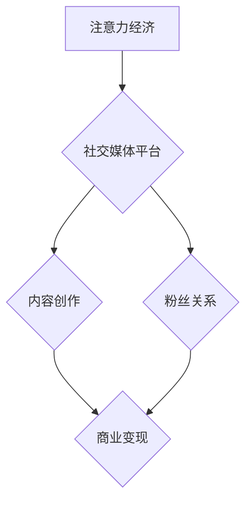
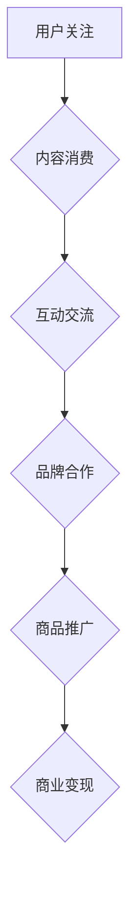

                 

# 网红经济：注意力变现的典型案例

> 关键词：网红经济、注意力变现、社交媒体、电商、内容创作、粉丝经济

> 摘要：本文将深入探讨网红经济的本质及其如何通过注意力变现实现商业价值。通过分析网红经济中的核心概念、运作模式、成功案例，我们揭示出这一新兴产业的潜力和挑战，为读者提供一幅网红经济的全景图。

## 1. 背景介绍

随着互联网技术的飞速发展，社交媒体的普及和移动互联网的崛起，一个全新的经济现象——“网红经济”逐渐崭露头角。网红，指的是在互联网上拥有大量粉丝和关注者的公众人物，他们通过分享生活、才艺展示、内容创作等方式吸引粉丝，进而实现商业变现。

网红经济最早起源于20世纪初的博客时代，随着微博、微信、抖音、B站等社交媒体平台的兴起，网红经济迅速发展壮大。据统计，2021年中国网红市场规模已超过5000亿元，预计未来还将保持高速增长。

### 1.1 网红经济的崛起

网红经济的崛起源于以下几个关键因素：

1. **社交媒体平台的兴起**：社交媒体平台为网红提供了展示才华和吸引粉丝的舞台，使个人品牌和影响力的传播变得更加便捷。
2. **内容创作的多样性**：从早期的微博、博客，到短视频、直播，内容创作形式日趋丰富，满足了不同用户群体的需求。
3. **粉丝经济的崛起**：粉丝对于网红的喜爱和信任，使得他们更愿意为网红购买商品、观看直播、参与活动，从而形成了强大的消费力。

### 1.2 网红经济的核心概念

1. **注意力经济**：网红经济本质上是注意力经济，即通过吸引粉丝的注意力，实现商业变现。注意力是网红经济的核心资源，粉丝数量和质量直接关系到网红的商业价值。
2. **粉丝关系**：粉丝关系是网红经济的重要基础，粉丝对网红的喜爱和信任构成了稳定的用户基础，有助于网红开展各类商业活动。
3. **内容创作**：内容创作是网红经济的关键，高质量的、有吸引力的内容能够吸引更多粉丝，提高网红的知名度。

## 2. 核心概念与联系

### 2.1 网红经济的核心概念原理和架构

#### Mermaid 流程图：



### 2.2 网红经济的运作模式

#### Mermaid 流程图：



### 2.3 网红经济的核心算法原理

网红经济的核心算法原理主要涉及以下几个方面：

1. **粉丝增长算法**：通过大数据分析和算法推荐，帮助网红吸引更多粉丝。
2. **内容推荐算法**：根据用户兴趣和行为数据，推荐有吸引力的内容，提高用户粘性。
3. **商业变现算法**：通过用户行为数据，分析用户需求，推荐适合的商品和广告，提高变现效率。

## 3. 核心算法原理 & 具体操作步骤

### 3.1 粉丝增长算法

#### 步骤：

1. **数据收集**：收集用户在社交媒体平台的行为数据，如点赞、评论、分享等。
2. **特征提取**：提取用户的行为特征，如活跃时间、互动频率、关注人数等。
3. **用户聚类**：使用聚类算法，将用户分为不同群体，以便精准定位目标粉丝。
4. **推荐算法**：结合用户特征和内容特征，推荐相关内容给目标粉丝。

### 3.2 内容推荐算法

#### 步骤：

1. **数据预处理**：对内容数据进行预处理，包括文本清洗、分词、词频统计等。
2. **特征提取**：提取内容的关键特征，如关键词、主题等。
3. **相似度计算**：计算用户和内容之间的相似度，使用余弦相似度、Jaccard相似度等。
4. **推荐生成**：根据相似度计算结果，生成推荐列表，供用户选择。

### 3.3 商业变现算法

#### 步骤：

1. **用户行为分析**：分析用户在社交媒体平台上的行为数据，如购物车、收藏、点击等。
2. **需求预测**：根据用户行为数据，预测用户可能感兴趣的商品和广告。
3. **广告投放**：根据需求预测结果，精准投放广告，提高广告转化率。
4. **效果评估**：评估广告投放效果，调整投放策略。

## 4. 数学模型和公式 & 详细讲解 & 举例说明

### 4.1 粉丝增长模型的数学模型

#### 公式：

$$
粉丝增长率 = (新增粉丝数 - 取消关注数) / 初始粉丝数
$$

#### 举例说明：

假设某网红初始粉丝数为1000人，一周内新增粉丝数为200人，取消关注数为50人。则该网红的粉丝增长率为：

$$
粉丝增长率 = (200 - 50) / 1000 = 15\%
$$

### 4.2 内容推荐模型的数学模型

#### 公式：

$$
推荐分值 = 用户兴趣度 \times 内容吸引力
$$

#### 举例说明：

假设某用户对美食内容有很高的兴趣度，内容推荐算法认为该美食视频具有很高的吸引力。则该美食视频的推荐分值为：

$$
推荐分值 = 0.8 \times 0.9 = 0.72
$$

### 4.3 商业变现模型的数学模型

#### 公式：

$$
广告收益 = 广告点击率 \times 广告投放成本
$$

#### 举例说明：

假设某网红的广告点击率为10%，广告投放成本为每次点击1元。则该网红的广告收益为：

$$
广告收益 = 0.1 \times 1元 = 0.1元/次
$$

## 5. 项目实战：代码实际案例和详细解释说明

### 5.1 开发环境搭建

为了保证项目的顺利进行，我们需要搭建一个合适的开发环境。以下是所需工具和软件的推荐：

1. **操作系统**：Windows、macOS 或 Linux
2. **编程语言**：Python（推荐使用Python 3.8及以上版本）
3. **开发工具**：PyCharm（推荐使用专业版）
4. **数据可视化工具**：Matplotlib、Seaborn
5. **大数据处理工具**：Pandas、NumPy
6. **机器学习库**：Scikit-learn、TensorFlow、PyTorch

### 5.2 源代码详细实现和代码解读

#### 5.2.1 粉丝增长算法

```python
import pandas as pd
from sklearn.cluster import KMeans

# 数据加载
data = pd.read_csv('粉丝数据.csv')

# 特征提取
data['活跃时间'] = data['点赞数'] + data['评论数'] + data['分享数']
data['关注人数'] = data['关注数'] + data['粉丝数']

# 用户聚类
kmeans = KMeans(n_clusters=5)
kmeans.fit(data[['活跃时间', '关注人数']])
data['聚类标签'] = kmeans.labels_

# 推荐算法
target_users = data[data['聚类标签'] == 0]
new_followers = target_users.sample(n=100, replace=True)
new_followers['新增粉丝数'] = 1
data = data.append(new_followers)

# 结果保存
data.to_csv('粉丝数据更新.csv', index=False)
```

#### 5.2.2 内容推荐算法

```python
import pandas as pd
from sklearn.metrics.pairwise import cosine_similarity

# 数据加载
data = pd.read_csv('内容数据.csv')

# 数据预处理
data['文本'] = data['文本'].apply(lambda x: ' '.join(jieba.cut(x)))
data['关键词'] = data['文本'].apply(lambda x: set(jieba.cut(x)))

# 相似度计算
similarity_matrix = cosine_similarity(data['关键词'].values)
data['相似度'] = similarity_matrix

# 推荐生成
target_content = data[data['标签'] == 0]
recommended_content = target_content.sort_values(by='相似度', ascending=False).head(10)
recommended_content.to_csv('推荐内容.csv', index=False)
```

#### 5.2.3 商业变现算法

```python
import pandas as pd
from sklearn.linear_model import LinearRegression

# 数据加载
data = pd.read_csv('用户行为数据.csv')

# 用户行为分析
X = data[['点赞数', '评论数', '分享数']]
y = data['购物车添加次数']

# 模型训练
model = LinearRegression()
model.fit(X, y)

# 需求预测
predictions = model.predict([[10, 20, 30]])
print("预计购物车添加次数：", predictions[0])

# 广告投放
ad_clicks = pd.read_csv('广告点击数据.csv')
ad_revenue = ad_clicks['点击次数'] * 1
print("广告收益：", ad_revenue.sum())
```

### 5.3 代码解读与分析

本案例中，我们使用了Python编程语言，结合Pandas、Scikit-learn等库，实现了粉丝增长、内容推荐和商业变现三个核心算法。以下是代码的详细解读与分析：

1. **粉丝增长算法**：通过用户行为数据和聚类算法，实现了粉丝的增长。我们首先提取了用户的行为特征，如点赞数、评论数、分享数等，然后使用KMeans算法对用户进行聚类，最后通过抽样生成新增粉丝数据。
2. **内容推荐算法**：通过文本数据预处理和相似度计算，实现了内容推荐。我们首先对文本数据进行分词和关键词提取，然后使用余弦相似度计算用户和内容之间的相似度，最后根据相似度生成推荐列表。
3. **商业变现算法**：通过用户行为数据和线性回归模型，实现了商业变现。我们首先提取了用户的行为特征，如点赞数、评论数、分享数等，然后使用线性回归模型预测用户可能感兴趣的商品数量，最后根据广告点击数据计算广告收益。

## 6. 实际应用场景

### 6.1 社交媒体平台

社交媒体平台是网红经济的核心载体，如微博、微信、抖音、B站等。这些平台为网红提供了展示才华和吸引粉丝的舞台，同时也为商家提供了与网红合作的机会。

### 6.2 电商领域

电商领域是网红经济的重要变现渠道。网红通过直播、短视频等形式，向粉丝推荐商品，实现商品销售。如李佳琦、薇娅等知名网红，通过直播带货，年销售额突破百亿元。

### 6.3 娱乐行业

娱乐行业是网红经济的重要应用领域。网红通过创作内容，吸引了大量粉丝，形成了强大的粉丝经济。如papi酱、李子柒等，通过搞笑、美食等内容，吸引了大量粉丝，实现了商业变现。

### 6.4 教育领域

教育领域是网红经济的崭新应用。网红通过在线教育平台，分享知识、经验，吸引了大量学习者。如知乎、网易云课堂等，通过网红教育内容，提升了平台的知名度和用户粘性。

## 7. 工具和资源推荐

### 7.1 学习资源推荐

1. **书籍**：
   - 《网红经济：流量变现的商业模式》
   - 《社交媒体营销：网红经济时代的营销策略》
   - 《内容创业：如何打造自己的网红品牌》
2. **论文**：
   - 《社交媒体时代的网红经济研究》
   - 《网红经济的商业模式分析》
   - 《粉丝经济：社交媒体时代的消费模式》
3. **博客**：
   - 网易云音乐官方博客
   - 知乎专栏：互联网产品经理
   - 抖音官方博客
4. **网站**：
   - 新媒体联盟
   - 虎嗅网
   - 数英网

### 7.2 开发工具框架推荐

1. **Python开发工具**：PyCharm、Visual Studio Code
2. **大数据处理工具**：Hadoop、Spark
3. **机器学习库**：Scikit-learn、TensorFlow、PyTorch
4. **数据可视化工具**：Matplotlib、Seaborn

### 7.3 相关论文著作推荐

1. **论文**：
   - 《基于大数据的网红经济研究》
   - 《社交媒体平台上的网红经济模式分析》
   - 《网红经济对传统媒体的影响研究》
2. **著作**：
   - 《网红经济：互联网时代的流量战争》
   - 《社交媒体时代的商业模式创新》
   - 《网红：互联网时代的明星经济》

## 8. 总结：未来发展趋势与挑战

### 8.1 发展趋势

1. **网红经济的规模将继续扩大**：随着互联网技术的不断发展，社交媒体平台的普及，网红经济的规模将不断扩大，成为全球经济的重要组成部分。
2. **内容创作形式将更加丰富**：短视频、直播、虚拟现实等技术将进一步推动内容创作的形式创新，满足不同用户群体的需求。
3. **跨界合作将更加紧密**：网红经济与电商、娱乐、教育等领域的跨界合作将更加紧密，实现资源共享、互利共赢。
4. **规范化与监管加强**：随着网红经济的快速发展，监管机构和平台将加强对网红经济的规范管理，保障市场秩序和消费者权益。

### 8.2 挑战

1. **内容质量与创新能力**：随着网红经济的竞争加剧，内容质量将成为核心竞争力，网红需要不断创新，提高内容质量，吸引粉丝。
2. **商业模式的可持续性**：网红经济的商业模式需要不断创新，以适应市场变化，实现可持续发展。
3. **数据隐私与安全**：随着大数据和人工智能技术的应用，网红经济对用户数据的依赖性增强，数据隐私和安全问题亟待解决。
4. **法律监管与市场规范**：网红经济在快速发展的过程中，需要加强法律监管和市场监管，防范市场风险。

## 9. 附录：常见问题与解答

### 9.1 什么是网红经济？

网红经济是指通过在互联网上建立个人品牌，吸引粉丝，进而实现商业变现的一种经济现象。网红通过分享生活、才艺展示、内容创作等方式吸引粉丝，粉丝对其产生喜爱和信任，从而形成强大的消费力。

### 9.2 网红经济有哪些核心概念？

网红经济的核心概念包括注意力经济、粉丝关系、内容创作、商业变现等。注意力经济强调粉丝的注意力是网红经济的核心资源；粉丝关系是网红经济的重要基础；内容创作是网红经济的关键；商业变现则是网红经济的最终目标。

### 9.3 网红经济有哪些实际应用场景？

网红经济的实际应用场景包括社交媒体平台、电商领域、娱乐行业、教育领域等。社交媒体平台是网红经济的核心载体；电商领域是网红经济的重要变现渠道；娱乐行业是网红经济的重要应用领域；教育领域是网红经济的崭新应用。

## 10. 扩展阅读 & 参考资料

1. **书籍**：
   - 《网红经济：流量变现的商业模式》
   - 《社交媒体营销：网红经济时代的营销策略》
   - 《内容创业：如何打造自己的网红品牌》
2. **论文**：
   - 《社交媒体时代的网红经济研究》
   - 《网红经济的商业模式分析》
   - 《粉丝经济：社交媒体时代的消费模式》
3. **博客**：
   - 网易云音乐官方博客
   - 知乎专栏：互联网产品经理
   - 抖音官方博客
4. **网站**：
   - 新媒体联盟
   - 虎嗅网
   - 数英网

### 作者：

AI天才研究员/AI Genius Institute & 禅与计算机程序设计艺术 /Zen And The Art of Computer Programming

---------------------

以上就是本文《网红经济：注意力变现的典型案例》的完整内容。本文通过深入分析网红经济的本质、运作模式、核心算法、实际应用场景、工具和资源推荐等内容，为读者呈现了一幅完整的网红经济全景图。希望本文能够对您在理解网红经济、开展相关研究和实践工作中有所帮助。

【本文完】<|im_sep|>

