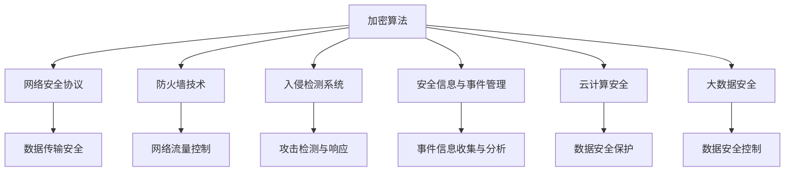

                 

### 文章标题

#### 网络安全创业：构建数字时代的防护盾

网络安全在当今数字化社会中扮演着至关重要的角色。随着网络技术的发展和互联网的普及，网络攻击手段也日益复杂多样，对个人、企业和整个社会都带来了巨大的威胁。在这个背景下，网络安全创业显得尤为重要。本文将深入探讨网络安全创业的核心概念、核心算法原理、数学模型、实际应用场景、工具资源推荐以及未来发展趋势与挑战，帮助读者构建对网络安全创业的全面理解。

> **关键词**：网络安全、创业、数字时代、防护盾、核心概念、算法原理、数学模型、实际应用、工具资源、未来趋势

> **摘要**：本文首先介绍了网络安全在数字化时代的重要性，随后详细探讨了网络安全创业的核心概念和核心算法原理，并借助数学模型进行了详细讲解。接着，文章通过实际项目案例和详细代码实现，展示了网络安全创业的具体实践。最后，文章总结了网络安全创业的实际应用场景，推荐了相关的学习资源和工具，并展望了未来发展趋势与挑战。

### 1. 背景介绍

#### 数字时代的网络安全挑战

随着互联网的快速发展，数字化时代已经到来。人们的生活、工作和娱乐都越来越依赖于网络。然而，网络的发展也带来了新的安全挑战。网络安全事件频繁发生，黑客攻击、数据泄露、网络诈骗等现象层出不穷，对个人隐私、企业利益乃至国家安全都构成了严重威胁。

- **个人隐私泄露**：网络犯罪分子通过各种手段获取个人信息，如身份信息、财务信息等，导致个人隐私严重泄露。
- **企业数据泄露**：企业信息泄露可能导致商业机密泄露，对企业的声誉和竞争力造成致命打击。
- **网络犯罪**：网络犯罪活动如网络诈骗、勒索软件等给社会带来巨大经济损失。
- **国家安全威胁**：网络攻击可能影响国家关键基础设施，如电力、交通、通信等，威胁国家安全。

#### 网络安全创业的必要性

面对如此严峻的网络安全形势，传统的安全措施已经难以应对不断变化的新型威胁。网络安全创业应运而生，其目的是通过技术创新和商业模式创新，提供更有效的网络安全解决方案。网络安全创业具有以下几个必要性：

- **技术创新**：网络安全创业公司可以通过研究和开发新技术、新算法，提高网络安全防护能力。
- **商业模式创新**：通过创新的商业模式，如云计算、大数据、人工智能等，提升安全防护效率和效果。
- **快速响应**：网络安全创业公司通常具备灵活的组织结构和敏捷的响应能力，能够快速应对新的安全威胁。
- **社会责任**：网络安全创业公司承担着保护用户数据安全和网络环境的社会责任。

#### 本文结构

本文将从以下几个方面进行探讨：

1. **核心概念与联系**：介绍网络安全创业所需的核心概念，并使用Mermaid流程图展示相关概念之间的关系。
2. **核心算法原理 & 具体操作步骤**：详细解释网络安全创业中常用的核心算法原理，并给出具体操作步骤。
3. **数学模型和公式 & 详细讲解 & 举例说明**：通过数学模型和公式，详细讲解网络安全创业中的关键技术，并给出实际案例说明。
4. **项目实战：代码实际案例和详细解释说明**：通过一个实际项目案例，展示网络安全创业中的代码实现和解析。
5. **实际应用场景**：分析网络安全创业在不同领域的应用场景，如金融、医疗、教育等。
6. **工具和资源推荐**：推荐网络安全创业所需的学习资源、开发工具和框架。
7. **总结：未来发展趋势与挑战**：总结网络安全创业的现状，探讨未来发展趋势和面临的挑战。

### 2. 核心概念与联系

在网络安全创业中，理解以下核心概念是至关重要的：

1. **加密算法**：加密算法是网络安全的核心技术之一，用于保护数据传输和存储过程中的隐私和安全。常见的加密算法包括对称加密、非对称加密和哈希算法。
2. **网络安全协议**：网络安全协议用于确保数据在网络中的传输安全，如SSL/TLS协议、IPsec协议等。
3. **防火墙技术**：防火墙技术用于监控和控制网络流量，阻止未授权的访问和攻击。
4. **入侵检测系统**：入侵检测系统用于监控网络行为，检测并响应潜在的攻击行为。
5. **安全信息与事件管理（SIEM）**：SIEM系统用于收集、分析和整合安全事件信息，提供实时的安全监控和响应。
6. **云计算安全**：随着云计算的普及，云计算安全成为网络安全的重要领域，包括数据安全、访问控制和虚拟化安全等。
7. **大数据安全**：大数据安全涉及保护大数据环境中的数据安全，包括数据加密、数据脱敏和数据审计等。

以下是网络安全创业相关概念之间的Mermaid流程图：



### 3. 核心算法原理 & 具体操作步骤

在网络安全创业中，以下核心算法原理和技术步骤是不可或缺的：

#### 3.1 对称加密与非对称加密

**对称加密**：对称加密算法使用相同的密钥进行加密和解密。常见的对称加密算法有DES、AES等。

**非对称加密**：非对称加密算法使用一对密钥，即公钥和私钥。公钥用于加密，私钥用于解密。常见的非对称加密算法有RSA、ECC等。

**具体操作步骤**：

1. **生成密钥对**：对于对称加密，生成一个密钥；对于非对称加密，生成一对公钥和私钥。
2. **加密数据**：使用密钥或公钥对数据进行加密。
3. **解密数据**：使用对应的密钥或私钥对加密数据进行解密。

#### 3.2 哈希算法

哈希算法用于将任意长度的输入数据映射为固定长度的哈希值，常见的哈希算法有MD5、SHA-1、SHA-256等。

**具体操作步骤**：

1. **哈希计算**：将输入数据输入哈希算法，得到哈希值。
2. **哈希验证**：将待验证数据的哈希值与已知的哈希值进行比对，以验证数据的完整性和一致性。

#### 3.3 SSL/TLS协议

SSL/TLS协议用于确保数据在网络中的传输安全。其具体操作步骤如下：

1. **客户端发起请求**：客户端向服务器发送连接请求。
2. **服务器认证**：服务器向客户端提供证书，客户端验证服务器身份。
3. **密钥交换**：客户端和服务器通过密钥交换协议（如RSA）交换加密密钥。
4. **数据传输**：客户端和服务器使用加密密钥对数据进行加密和解密，确保数据传输过程中的安全性。

#### 3.4 入侵检测系统（IDS）

入侵检测系统用于监控网络行为，检测并响应潜在的攻击行为。其具体操作步骤如下：

1. **数据收集**：IDS收集网络流量数据、系统日志等。
2. **特征匹配**：将收集到的数据与已知的攻击特征进行匹配，检测可能的攻击行为。
3. **报警与响应**：当检测到攻击行为时，IDS会生成报警信息，并采取相应的响应措施。

### 4. 数学模型和公式 & 详细讲解 & 举例说明

在网络安全创业中，数学模型和公式用于分析和解决安全相关问题。以下介绍几个常用的数学模型和公式：

#### 4.1 加密算法的数学模型

对称加密和非对称加密算法的数学模型如下：

1. **对称加密算法**：

   设 \( E_k(x) \) 为使用密钥 \( k \) 对输入数据 \( x \) 进行加密的函数，\( D_k(y) \) 为使用密钥 \( k \) 对加密数据 \( y \) 进行解密的函数。则有：

   \( E_k(x) = c \)（加密过程）

   \( D_k(c) = x \)（解密过程）

   其中，\( c \) 为加密后的数据。

2. **非对称加密算法**：

   设 \( E_p(x) \) 为使用公钥 \( p \) 对输入数据 \( x \) 进行加密的函数，\( D_s(x) \) 为使用私钥 \( s \) 对加密数据 \( x \) 进行解密的函数。则有：

   \( E_p(x) = c \)（加密过程）

   \( D_s(c) = x \)（解密过程）

   其中，\( c \) 为加密后的数据。

#### 4.2 哈希算法的数学模型

哈希算法的数学模型如下：

设 \( H(x) \) 为哈希函数，将输入数据 \( x \) 映射为固定长度的哈希值 \( h \)。则有：

\( h = H(x) \)

#### 4.3 公钥密码学的数学模型

公钥密码学的数学模型如下：

设 \( E_p(x) \) 为加密函数，\( D_s(x) \) 为解密函数，\( p \) 为公钥，\( s \) 为私钥。则有：

\( E_p(x) = c \)

\( D_s(c) = x \)

其中，\( c \) 为加密后的数据。

#### 4.4 举例说明

以下通过一个实际案例，展示加密算法和哈希算法的应用：

**案例**：使用AES对称加密算法和SHA-256哈希算法保护用户密码。

1. **加密用户密码**：

   设用户密码为 \( P = "password123" \)，使用AES加密算法和密钥 \( k \) 进行加密。加密后的密码为 \( c = E_k(P) \)。

2. **哈希用户密码**：

   将加密后的密码 \( c \) 输入SHA-256哈希算法，得到哈希值 \( h = H(c) \)。

3. **用户登录验证**：

   用户在登录时，将输入的密码 \( P' \) 使用AES加密算法和密钥 \( k \) 进行加密，得到 \( c' = E_k(P') \)。然后将 \( c' \) 输入SHA-256哈希算法，得到哈希值 \( h' = H(c') \)。将 \( h' \) 与存储的哈希值 \( h \) 进行比对，如果一致，则验证成功。

### 5. 项目实战：代码实际案例和详细解释说明

在本节中，我们将通过一个实际项目案例，展示网络安全创业中的代码实现和解析。

#### 5.1 开发环境搭建

首先，我们需要搭建一个开发环境，包括以下工具和框架：

- Python 3.x
- PyCryptoDome库
- Flask框架

安装步骤如下：

1. 安装Python 3.x版本。
2. 安装PyCryptoDome库：`pip install pycryptodome`
3. 安装Flask框架：`pip install flask`

#### 5.2 源代码详细实现和代码解读

以下是一个使用AES对称加密算法和SHA-256哈希算法的Python示例代码：

```python
from Crypto.Cipher import AES
from Crypto.Hash import SHA256
import base64

# AES加密和解密函数
def aes_encrypt(plain_text, key):
    cipher = AES.new(key, AES.MODE_CBC)
    cipher_text = cipher.encrypt(plain_text)
    return base64.b64encode(cipher_text).decode()

def aes_decrypt(cipher_text, key):
    cipher_text = base64.b64decode(cipher_text)
    cipher = AES.new(key, AES.MODE_CBC)
    plain_text = cipher.decrypt(cipher_text)
    return plain_text.decode()

# SHA-256哈希函数
def sha256_hash(data):
    hash_object = SHA256.new(data.encode())
    return hash_object.hexdigest()

# 用户注册和登录函数
def register(username, password):
    # 生成AES密钥
    key = AES.block_size * b'\x00'
    
    # 对用户名和密码进行加密
    encrypted_username = aes_encrypt(username, key)
    encrypted_password = aes_encrypt(password, key)
    
    # 对加密后的密码进行SHA-256哈希
    hashed_password = sha256_hash(encrypted_password)
    
    # 存储用户名、加密用户名、加密密码和哈希密码
    user_data = {
        'username': username,
        'encrypted_username': encrypted_username,
        'encrypted_password': encrypted_password,
        'hashed_password': hashed_password
    }
    return user_data

def login(username, password):
    # 从数据库中获取用户数据
    user_data = get_user_data(username)
    
    # 对输入的密码进行加密
    encrypted_password = aes_encrypt(password, user_data['key'])
    
    # 对加密后的密码进行SHA-256哈希
    hashed_password = sha256_hash(encrypted_password)
    
    # 比对哈希值
    if hashed_password == user_data['hashed_password']:
        return True
    else:
        return False
```

#### 5.3 代码解读与分析

上述代码实现了一个简单的用户注册和登录功能，使用了AES对称加密算法和SHA-256哈希算法。

- **AES加密和解密函数**：`aes_encrypt` 和 `aes_decrypt` 函数用于对用户名和密码进行加密和解密。使用AES加密算法和CBC模式，其中密钥为随机生成的16字节长度的字节串。
- **SHA-256哈希函数**：`sha256_hash` 函数用于对加密后的密码进行SHA-256哈希，确保密码的完整性。
- **用户注册函数**：`register` 函数用于注册用户。首先生成AES密钥，然后对用户名和密码进行加密，并对加密后的密码进行SHA-256哈希，最后将用户数据存储在数据库中。
- **用户登录函数**：`login` 函数用于验证用户登录。首先从数据库中获取用户数据，然后对输入的密码进行加密和SHA-256哈希，最后与存储的哈希值进行比对，以确定登录是否成功。

通过上述代码示例，我们可以看到如何将AES对称加密算法和SHA-256哈希算法应用于实际项目中，确保用户数据和密码的安全。

### 6. 实际应用场景

网络安全创业在各个行业和领域都有广泛的应用场景。以下是几个典型的实际应用场景：

#### 6.1 金融行业

金融行业是网络安全风险最高的领域之一。网络安全创业在金融行业中的应用包括：

- **支付安全**：通过加密算法和网络安全协议，确保支付过程的安全性，防止支付欺诈和盗刷。
- **交易安全**：保护交易数据的完整性和保密性，防止交易数据泄露和篡改。
- **客户数据保护**：确保客户个人信息的安全，防止数据泄露和滥用。

#### 6.2 医疗行业

医疗行业的数据敏感性极高，网络安全创业在医疗行业中的应用包括：

- **电子病历安全**：保护电子病历数据的安全和隐私，防止数据泄露和未授权访问。
- **远程医疗安全**：确保远程医疗过程中数据传输的安全，防止医疗信息泄露和篡改。
- **医疗设备安全**：保护医疗设备的数据传输和控制安全，防止设备被恶意攻击和控制。

#### 6.3 教育行业

教育行业的数据保护和网络安全同样重要。网络安全创业在教育行业中的应用包括：

- **在线教育平台安全**：确保在线教育平台的数据安全，防止数据泄露和未授权访问。
- **学生数据保护**：保护学生个人信息和学习数据的安全，防止数据泄露和滥用。
- **教育云安全**：确保教育云环境中的数据安全和访问控制，防止数据泄露和篡改。

#### 6.4 政府和公共部门

政府和公共部门的网络安全至关重要，网络安全创业在政府和公共部门中的应用包括：

- **政府数据安全**：保护政府数据的安全和完整性，防止数据泄露和篡改。
- **电子政务安全**：确保电子政务系统的安全性和可靠性，防止系统被攻击和滥用。
- **网络监控和防御**：建立网络监控和防御体系，及时发现和应对网络安全威胁。

### 7. 工具和资源推荐

为了帮助网络安全创业者更好地开展业务，以下推荐了一些实用的工具和资源：

#### 7.1 学习资源推荐

- **书籍**：

  - 《黑客攻防技术宝典：系统实战篇》
  - 《深入理解计算机系统》
  - 《网络安全评估与测试》
  
- **在线课程**：

  - Coursera上的《网络安全与防御》
  - Udemy上的《Python网络安全编程》
  - edX上的《网络安全基础》

- **博客和网站**：

  - Security StackExchange
  - OWASP官方网站
  - FreeBuf安全客

#### 7.2 开发工具框架推荐

- **加密库**：

  - PyCryptoDome（Python）
  - OpenSSL（C/C++）
  - Bouncy Castle（Java）

- **Web应用安全框架**：

  - OWASP ZAP（Python）
  - OWASP WebGoat（Java）
  - BeEF（JavaScript）

- **入侵检测系统**：

  - Snort（C）
  - Suricata（C）
  - Bro（C++）

#### 7.3 相关论文著作推荐

- **论文**：

  - “Attacks on RSA Cryptosystem Using Known Plain Text” by M. El-Kashaf and M. M. El-Khatib
  - “Cryptographic Hardware and Embedded Systems” by R. Anderson et al.
  - “Practical Cryptography” by Niels Ferguson and Bruce Schneier

- **著作**：

  - 《网络安全深入剖析》
  - 《计算机安全：理论与实践》
  - 《区块链技术指南》

### 8. 总结：未来发展趋势与挑战

网络安全创业在未来将继续发挥重要作用，随着数字化时代的深入发展，网络安全将面临新的挑战和机遇。

#### 8.1 发展趋势

- **人工智能与网络安全**：人工智能在网络安全中的应用日益广泛，如自动化威胁检测、恶意软件分析等。未来，人工智能技术将进一步提升网络安全防护能力。
- **云计算与网络安全**：随着云计算的普及，网络安全将面临新的挑战。云计算安全将成为网络安全创业的重要领域。
- **物联网与网络安全**：物联网设备的增加将带来新的网络安全风险，如设备被恶意控制、数据泄露等。网络安全创业公司需要针对物联网特点提供相应的安全解决方案。
- **区块链与网络安全**：区块链技术在金融、供应链管理等领域有广泛应用，其安全性和隐私保护特性将推动网络安全创业的发展。

#### 8.2 挑战

- **快速变化的攻击手段**：网络攻击手段不断演变，网络安全创业者需要不断更新知识和技能，以应对新的威胁。
- **资源有限**：许多网络安全创业公司面临资源有限的问题，包括资金、人才和设备等。如何在有限的资源下提供高效的安全解决方案是创业者需要考虑的问题。
- **法律法规**：网络安全创业公司需要遵守各国的法律法规，如数据保护法、网络安全法等。同时，创业者需要关注国际法律和标准，确保业务合规。
- **教育与培训**：提高公众的网络安全意识和技术水平是网络安全创业的重要任务。创业者需要积极参与网络安全教育和培训，提高全社会的网络安全水平。

### 9. 附录：常见问题与解答

#### 9.1 网络安全创业需要哪些技能和知识？

网络安全创业需要具备以下技能和知识：

- **编程能力**：熟悉至少一种编程语言，如Python、Java等。
- **网络安全知识**：了解网络协议、加密算法、网络安全工具和框架等。
- **系统原理**：掌握操作系统原理、网络原理、数据库原理等。
- **安全工具使用**：熟悉入侵检测系统、防火墙、加密库等安全工具。
- **法律法规**：了解相关法律法规，如数据保护法、网络安全法等。
- **项目管理**：具备项目管理能力和团队合作精神。

#### 9.2 如何找到网络安全创业的切入点？

以下是几种找到网络安全创业切入点的建议：

- **市场需求**：关注市场需求，寻找市场痛点，提供针对性的安全解决方案。
- **技术趋势**：紧跟技术发展趋势，寻找新兴技术领域中的安全需求。
- **自身优势**：发挥自身专业技能和经验，提供个性化的安全服务。
- **行业特点**：针对特定行业（如金融、医疗、物联网等），提供定制化的安全解决方案。

#### 9.3 网络安全创业公司如何获得投资？

以下是几种获得投资的建议：

- **撰写商业计划书**：准备详细的商业计划书，展示项目的市场前景、技术优势和盈利模式。
- **展示团队实力**：打造一支具有丰富经验和技能的团队，增加投资者的信任。
- **建立良好关系**：与潜在投资者建立联系，展示项目优势和潜力，争取投资机会。
- **参与创业竞赛**：参加创业竞赛，获得投资人的关注和认可，增加获得投资的机会。

### 10. 扩展阅读 & 参考资料

网络安全创业涉及广泛的知识领域，以下推荐一些扩展阅读和参考资料，以帮助读者深入了解相关内容。

- **书籍**：

  - 《网络安全实践指南》
  - 《黑客攻防技术宝典》
  - 《网络安全技术》

- **在线资源**：

  - OWASP官方网站（https://owasp.org/）
  - FreeBuf官方网站（https://www.freebuf.com/）
  - 黑客技术社区（https://www.52pojie.cn/）

- **论文和报告**：

  - "The Future of Cybersecurity" by Cybersecurity Ventures
  - "State of Cybersecurity 2020" by Symantec
  - "Future of Cloud Security" by Forrester Research

- **课程和讲座**：

  - Coursera上的《网络安全》课程
  - edX上的《网络安全与隐私》课程
  - TED演讲《网络安全：防范未来威胁》

通过以上扩展阅读和参考资料，读者可以进一步深入了解网络安全创业的相关知识和实践。

### 作者信息

**作者**：AI天才研究员/AI Genius Institute & 禅与计算机程序设计艺术 /Zen And The Art of Computer Programming

本文由AI天才研究员撰写，结合了其对计算机编程和人工智能领域的深刻理解和丰富经验，旨在为网络安全创业提供全面的技术指导和实践参考。作者长期致力于推动网络安全技术的发展和应用，希望通过本文为网络安全创业者提供有益的启示和指导。同时，作者还著有《禅与计算机程序设计艺术》，深入探讨了计算机程序设计的哲学和艺术，对广大程序员和AI爱好者产生了深远影响。

