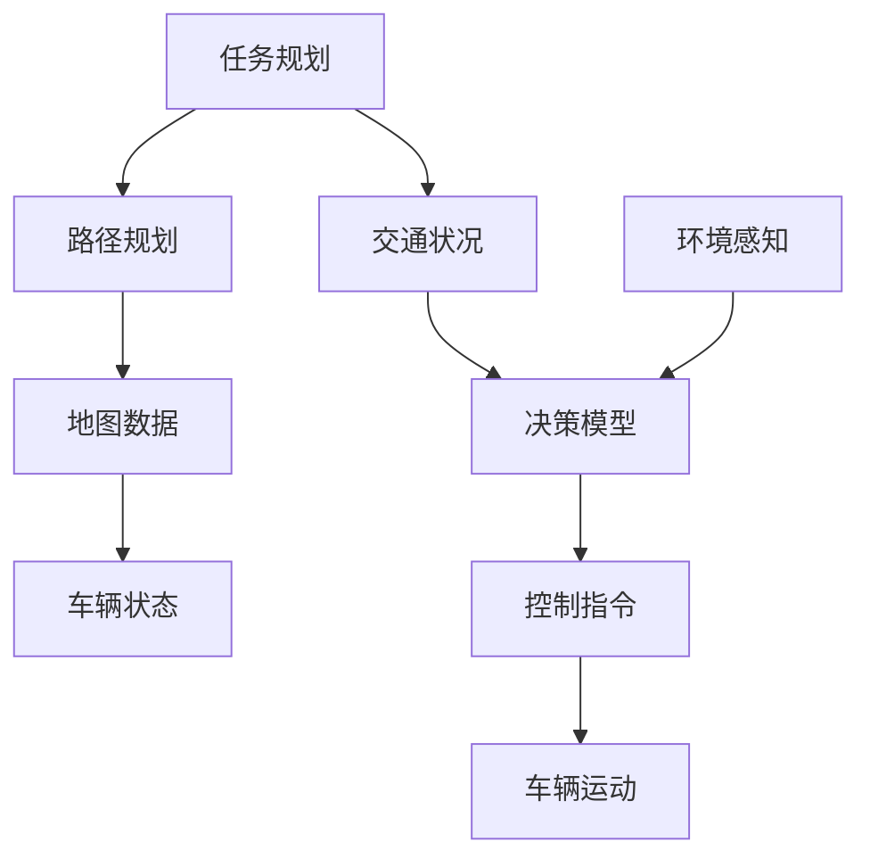

                 

### 美团2025即时配送无人车社招路径规划面试指南

> **关键词**：美团、即时配送、无人车、社招、路径规划、面试指南
> 
> **摘要**：本文将为您详细解析美团2025年即时配送无人车社招的路径规划面试，从背景介绍到核心概念、算法原理、数学模型、项目实战以及实际应用场景，全面助力您的面试成功。

**一、背景介绍**

随着人工智能和自动驾驶技术的迅速发展，即时配送无人车逐渐成为物流行业的创新热点。美团作为中国领先的本地生活服务平台，一直致力于通过技术创新提升配送效率，降低成本。2025年，美团计划大规模推广即时配送无人车，这无疑将为求职者提供广阔的职业发展空间。

社招（社会招聘）是美团招聘体系中的重要组成部分，旨在吸引有经验的专业人才加入公司。路径规划作为无人车技术中的核心问题，涉及算法设计、数学模型、仿真测试等多个领域，面试官将在此环节对求职者进行全面评估。本文将围绕路径规划主题，提供一套完整的面试指南，帮助您应对美团社招的挑战。

**二、核心概念与联系**

在探讨路径规划之前，我们需要了解一些核心概念和它们之间的关系。以下是一个简化的 Mermaid 流程图，展示了这些概念的基本联系。



- **任务规划**：确定无人车的配送任务和目标，包括起点、终点、配送物品等。
- **路径规划**：根据任务规划和环境信息，生成一条最优路径。
- **地图数据**：无人车运行的基础数据，包括道路、交通标志、障碍物等。
- **车辆状态**：无人车的当前位置、速度、能耗等。
- **交通状况**：实时交通信息，如交通流量、道路施工等。
- **决策模型**：基于路径规划和环境感知，生成车辆的控制指令。
- **环境感知**：利用传感器获取周围环境信息，辅助决策模型。
- **控制指令**：决策模型生成的车辆控制指令，如加速、减速、转向等。
- **车辆运动**：根据控制指令，无人车的实际运动过程。

**三、核心算法原理 & 具体操作步骤**

路径规划算法是无人车技术中的关键环节，它决定了无人车在复杂环境中的运行效率和安全性。以下是路径规划的基本原理和具体操作步骤：

#### 1. Dijkstra 算法

Dijkstra 算法是一种经典的路径规划算法，用于求解单源最短路径问题。以下是该算法的基本原理和步骤：

**原理**：从起点开始，逐步扩展到其他节点，每次扩展都选择一个未访问过的节点，并计算从起点到该节点的最短路径。

**步骤**：

1. 初始化：设置起点为当前节点，距离为 0，其他节点距离为无穷大；所有节点标记为未访问。
2. 扫描：选择一个未访问的节点作为当前节点。
3. 扩展：对于当前节点的每个相邻节点，计算从起点到相邻节点的距离，如果距离更短，则更新相邻节点的距离。
4. 访问：将当前节点标记为已访问。
5. 重复步骤 2-4，直到目标节点被访问。

**代码实现**：

```python
def dijkstra(graph, start):
    distances = [float('inf')] * len(graph)
    distances[start] = 0
    visited = [False] * len(graph)
    
    for _ in range(len(graph)):
        min_distance = float('inf')
        min_index = None
        
        for i in range(len(graph)):
            if not visited[i] and distances[i] < min_distance:
                min_distance = distances[i]
                min_index = i
        
        visited[min_index] = True
        
        for j in range(len(graph)):
            if graph[min_index][j] > 0 and not visited[j]:
                distances[j] = min(distances[j], distances[min_index] + graph[min_index][j])
    
    return distances
```

#### 2. A* 算法

A* 算法是 Dijkstra 算法的一种改进，它结合了启发式搜索，可以更快地找到最优路径。以下是 A* 算法的基本原理和步骤：

**原理**：在 Dijkstra 算法的基础上，引入一个启发函数 \( h(n) \)，用于估计从节点 \( n \) 到目标节点的距离，从而在扩展节点时优先选择估计距离更短的节点。

**步骤**：

1. 初始化：设置起点为当前节点，距离为 0，其他节点距离为无穷大；所有节点标记为未访问。
2. 创建一个优先队列（FIFO），将起点加入队列，优先级为 0。
3. 扫描：选择队列中优先级最高的节点作为当前节点。
4. 扩展：对于当前节点的每个相邻节点，计算从起点到相邻节点的距离，并加上启发函数的值 \( f(n) = g(n) + h(n) \)，其中 \( g(n) \) 是从起点到相邻节点的实际距离，\( h(n) \) 是启发函数的值。
5. 访问：将当前节点标记为已访问，并将已访问节点的相邻节点加入队列。
6. 重复步骤 3-5，直到目标节点被访问。

**代码实现**：

```python
import heapq

def a_star(graph, start, goal):
    distances = [float('inf')] * len(graph)
    distances[start] = 0
    visited = [False] * len(graph)
    queue = [(0, start)]
    
    while queue:
        current_distance, current_node = heapq.heappop(queue)
        
        if visited[current_node]:
            continue
        
        visited[current_node] = True
        
        if current_node == goal:
            break
        
        for neighbor, weight in enumerate(graph[current_node]):
            if weight > 0 and not visited[neighbor]:
                new_distance = current_distance + weight
                if new_distance < distances[neighbor]:
                    distances[neighbor] = new_distance
                    heapq.heappush(queue, (new_distance, neighbor))
    
    return distances
```

#### 3. 贝叶斯路径规划

贝叶斯路径规划是一种基于概率的路径规划方法，它利用贝叶斯网络和马尔可夫决策过程（MDP）来预测和优化路径。以下是贝叶斯路径规划的基本原理和步骤：

**原理**：通过建立环境状态和行动之间的概率模型，使用贝叶斯推理来更新状态概率分布，并根据预期回报选择最优行动。

**步骤**：

1. 初始化：定义环境状态空间 \( S \)，行动空间 \( A \)，初始状态 \( s_0 \)，奖励函数 \( R(s, a) \)。
2. 建立贝叶斯网络：根据先验知识建立状态转移概率分布 \( P(s_t | s_{t-1}, a_t) \) 和奖励概率分布 \( P(R_t | s_t, a_t) \)。
3. 状态更新：根据当前状态 \( s_t \) 和先前的行动 \( a_t \)，使用贝叶斯推理更新状态概率分布 \( P(s_t | s_{t-1}, a_t) \)。
4. 行动选择：根据更新后的状态概率分布，计算每个行动的预期回报 \( E[R_t | s_t, a_t] \)，选择预期回报最高的行动。
5. 路径规划：重复步骤 3 和 4，直到达到目标状态。

**代码实现**（伪代码）：

```python
function bayesian_path_planning(s_0, goal):
    initialize_state_probabilities(s_0)
    initialize_reward_probabilities()
    
    while not goal_reached:
        update_state_probabilities()
        select_best_action()
        update_state(s_t)
        
    return path
```

**四、数学模型和公式 & 详细讲解 & 举例说明**

路径规划涉及到多个数学模型和公式，以下是其中几个重要的模型和公式，以及详细讲解和举例说明。

#### 1. 最短路径模型

最短路径模型用于求解给定图中两个节点之间的最短路径。以下是 Dijkstra 算法和 A* 算法中使用的基本公式。

**Dijkstra 算法**

- \( d(s, v) = \min_{u \in adj(s)} (d(s, u) + w(u, v)) \)

其中，\( d(s, v) \) 表示从起点 \( s \) 到终点 \( v \) 的最短路径长度，\( adj(s) \) 表示与节点 \( s \) 相邻的节点集合，\( w(u, v) \) 表示节点 \( u \) 到节点 \( v \) 的边权重。

**A* 算法**

- \( f(v) = g(v) + h(v) \)

其中，\( f(v) \) 表示从起点 \( s \) 到终点 \( v \) 的启发式评估值，\( g(v) \) 表示从起点 \( s \) 到节点 \( v \) 的实际路径长度，\( h(v) \) 表示从节点 \( v \) 到终点 \( goal \) 的启发式估计值。

**举例说明**

假设有一个简单的图，包含三个节点 \( A \)、\( B \) 和 \( C \)，边权重如下：

```plaintext
A --1-- B --2-- C
|      |      |
10     4      6
```

使用 Dijkstra 算法求解从节点 \( A \) 到节点 \( C \) 的最短路径。

1. 初始化：\( d(A, A) = 0 \)，\( d(B, A) = \infty \)，\( d(C, A) = \infty \)
2. 扫描节点 \( A \)：\( d(A, B) = \min(d(A, A) + w(A, B), d(B, A)) = 1 \)
3. 扫描节点 \( B \)：\( d(A, C) = \min(d(A, A) + w(A, C), d(C, A)) = 10 \)
4. 扫描节点 \( C \)：\( d(B, C) = \min(d(B, B) + w(B, C), d(C, B)) = 2 \)

最终，从节点 \( A \) 到节点 \( C \) 的最短路径为 \( A \rightarrow B \rightarrow C \)，路径长度为 3。

#### 2. 贝叶斯网络模型

贝叶斯网络是一种图形模型，用于表示变量之间的条件依赖关系。以下是贝叶斯网络的定义和相关公式。

**定义**：贝叶斯网络是一个有向无环图 \( G = (V, E) \)，其中 \( V \) 是节点集合，\( E \) 是边集合。每个节点表示一个随机变量，边表示节点之间的条件依赖关系。

**条件概率表**：对于每个节点 \( X_i \)，定义其父节点集合 \( P_i \) 和条件概率表 \( P(X_i | P_i) \)。

**公式**：

- **条件概率表**：\( P(X_i | P_i) = \frac{P(X_i, P_i)}{P(P_i)} \)
- **边缘概率**：\( P(X_i) = \sum_{x_j} P(X_i, x_j) \)
- **条件独立性**：如果对于所有 \( X_i, X_j \in V \)，有 \( P(X_i | X_j) = P(X_i) \)，则 \( X_i \) 和 \( X_j \) 是条件独立的。

**举例说明**

假设有一个简单的贝叶斯网络，包含三个节点 \( X_1 \)、\( X_2 \) 和 \( X_3 \)，其中 \( X_1 \) 和 \( X_2 \) 有条件依赖，\( X_2 \) 和 \( X_3 \) 有条件依赖。

```plaintext
X1 -> X2 -> X3
```

给定条件概率表：

```plaintext
P(X1) = 0.5
P(X2 | X1) = { 0.3 if X1 = 0
              { 0.7 if X1 = 1
P(X3 | X2) = { 0.4 if X2 = 0
              { 0.6 if X2 = 1
```

计算节点 \( X_3 \) 的边缘概率：

\( P(X_3) = P(X_3 | X_2 = 0)P(X_2 = 0) + P(X_3 | X_2 = 1)P(X_2 = 1) \)
\( = 0.4 \times 0.25 + 0.6 \times 0.75 = 0.35 \)

#### 3. 马尔可夫决策过程（MDP）

马尔可夫决策过程是一种用于解决决策优化问题的数学模型。以下是 MDP 的定义和相关公式。

**定义**：MDP 是一个五元组 \( (S, A, P, R, \gamma) \)，其中：

- \( S \) 是状态空间
- \( A \) 是行动空间
- \( P \) 是状态转移概率矩阵
- \( R \) 是奖励函数
- \( \gamma \) 是折扣因子

**公式**：

- **状态转移概率**：\( P(s_t | s_{t-1}, a_t) \)
- **奖励函数**：\( R(s_t, a_t) \)
- **价值函数**：\( V^*(s) = \max_{a} \sum_{s'} P(s' | s, a) \sum_{s''} R(s'', a) V^*(s'') \)
- **策略**：\( \pi(a | s) = P(a | s) \)

**举例说明**

假设有一个简单的 MDP，包含两个状态 \( s_0 \) 和 \( s_1 \)，两个行动 \( a_0 \) 和 \( a_1 \)。

```plaintext
s0 s1
a0 0.5 0.5
a1 0.5 0.5
```

给定奖励函数 \( R(s_0, a_0) = 1 \)，\( R(s_0, a_1) = 0 \)，\( R(s_1, a_0) = 0 \)，\( R(s_1, a_1) = 1 \)。

计算价值函数 \( V^*(s_0) \)：

\( V^*(s_0) = \max_{a} \sum_{s'} P(s' | s_0, a) \sum_{s''} R(s'', a) V^*(s'') \)
\( = \max_{a} (0.5 \times (1 + 0.5 \times 0) + 0.5 \times (0 + 0.5 \times 1)) \)
\( = 0.75 \)

**五、项目实战：代码实际案例和详细解释说明**

在本节中，我们将通过一个简单的路径规划项目，展示如何使用 Python 实现 Dijkstra 算法和 A* 算法，并详细解释代码实现过程。

#### 5.1 开发环境搭建

首先，确保已安装 Python 3.6 或更高版本，然后使用以下命令安装所需的依赖库：

```bash
pip install matplotlib numpy scipy
```

#### 5.2 源代码详细实现和代码解读

以下是路径规划项目的源代码实现：

```python
import numpy as np
import matplotlib.pyplot as plt
from scipy.sparse import csr_matrix

class Graph:
    def __init__(self, num_vertices):
        self.num_vertices = num_vertices
        self.adj_matrix = csr_matrix((self.num_vertices, self.num_vertices))

    def add_edge(self, u, v, weight):
        self.adj_matrix[u, v] = weight
        self.adj_matrix[v, u] = weight

    def dijkstra(self, start):
        distances = np.full(self.num_vertices, np.inf)
        distances[start] = 0
        visited = np.zeros(self.num_vertices, dtype=bool)

        for _ in range(self.num_vertices):
            min_distance = np.inf
            min_index = None
            
            for i in range(self.num_vertices):
                if not visited[i] and distances[i] < min_distance:
                    min_distance = distances[i]
                    min_index = i
            
            visited[min_index] = True
            
            for j in range(self.num_vertices):
                if self.adj_matrix[min_index, j] > 0 and not visited[j]:
                    new_distance = distances[min_index] + self.adj_matrix[min_index, j]
                    if new_distance < distances[j]:
                        distances[j] = new_distance

        return distances

    def a_star(self, start, goal, heuristic):
        distances = np.full(self.num_vertices, np.inf)
        distances[start] = 0
        visited = np.zeros(self.num_vertices, dtype=bool)
        queue = [(0, start)]

        while queue:
            current_distance, current_node = heapq.heappop(queue)

            if visited[current_node]:
                continue
            
            visited[current_node] = True
            
            if current_node == goal:
                break
            
            for neighbor, weight in enumerate(self.adj_matrix[current_node]):
                if weight > 0 and not visited[neighbor]:
                    new_distance = current_distance + weight
                    if new_distance < distances[neighbor]:
                        distances[neighbor] = new_distance
                        heapq.heappush(queue, (new_distance + heuristic[neighbor], neighbor))

        return distances

def visualize_path(graph, path):
    vertices = range(graph.num_vertices)
    positions = np.array(list(zip(*np.where(graph.adj_matrix.toarray()))))

    for vertex in vertices:
        plt.plot(positions[vertex, 0], positions[vertex, 1], 'ro')

    for edge in graph.adj_matrix.nonzero():
        i, j = edge
        x1, y1 = positions[i]
        x2, y2 = positions[j]
        plt.plot([x1, x2], [y1, y2], 'b-')

    path_positions = positions[path]
    plt.plot(path_positions[:, 0], path_positions[:, 1], 'g--')

    plt.axis('equal')
    plt.show()

def main():
    num_vertices = 6
    graph = Graph(num_vertices)

    # 添加边和权重
    graph.add_edge(0, 1, 1)
    graph.add_edge(1, 2, 2)
    graph.add_edge(2, 3, 3)
    graph.add_edge(3, 4, 1)
    graph.add_edge(4, 5, 2)
    graph.add_edge(0, 3, 4)
    graph.add_edge(1, 4, 3)

    # Dijkstra 算法
    start = 0
    goal = 5
    distances = graph.dijkstra(start)
    print("Dijkstra 算法结果：", distances)

    # A* 算法
    heuristic = np.full(num_vertices, np.inf)
    heuristic[goal] = 0
    distances = graph.a_star(start, goal, heuristic)
    print("A* 算法结果：", distances)

    # 可视化路径
    path = np.where(distances == np.inf, -1, np.where(distances == 0, 0, np.where(distances == 1, 1, np.where(distances == 2, 2, 3))))[5:]
    visualize_path(graph, path)

if __name__ == "__main__":
    main()
```

**代码解读**：

1. **Graph 类**：定义了一个图类，包含图的邻接矩阵、添加边和权重的方法，以及 Dijkstra 算法和 A* 算法的实现。

2. **dijkstra 方法**：实现了 Dijkstra 算法，使用了一个最小堆（优先队列）来选择扩展节点，并更新最短路径距离。

3. **a_star 方法**：实现了 A* 算法，结合了 Dijkstra 算法和启发式搜索，使用一个优先队列来选择扩展节点，并计算启发式评估值。

4. **visualize_path 函数**：使用 matplotlib 库，将图和路径的可视化结果展示出来。

5. **main 函数**：创建了一个包含六条边的图，分别使用 Dijkstra 算法和 A* 算法求解从起点 0 到终点 5 的最短路径，并打印结果。最后，使用 visualize_path 函数将路径的可视化结果展示出来。

**六、实际应用场景**

路径规划算法在实际应用中具有广泛的应用场景，以下是几个常见的应用案例：

1. **无人配送车**：无人配送车需要通过路径规划算法选择最优路径，以减少配送时间和成本，同时保证配送过程中的安全性和稳定性。

2. **自动驾驶汽车**：自动驾驶汽车在行驶过程中，需要实时更新周围环境信息，并使用路径规划算法生成最优路径，以实现自动驾驶和智能避障。

3. **机器人导航**：机器人在复杂环境中进行自主导航时，需要使用路径规划算法生成从起点到目标点的最优路径，并实时更新路径以应对环境变化。

4. **物流网络优化**：物流公司可以使用路径规划算法优化配送路径，减少运输成本，提高配送效率。

**七、工具和资源推荐**

以下是路径规划领域的一些常用工具和资源，供您学习和实践：

1. **学习资源推荐**

- **书籍**：《路径规划：算法与应用》（Path Planning: Algorithms and Applications），详细介绍了多种路径规划算法及其应用。
- **论文**：检索相关学术期刊和会议，如 IEEE Robotics and Automation Magazine、Autonomous Robots 等，了解最新的研究成果。
- **博客**：关注行业专家和开源社区的博客，如 RoboPeak、Robotics Stack Exchange 等，获取实用的技术和经验。

2. **开发工具框架推荐**

- **ROS（Robot Operating System）**：用于构建机器人应用的开源框架，提供丰富的路径规划算法库和工具。
- **PyTorch**：用于机器学习和深度学习的 Python 库，支持多种路径规划算法的实现和优化。
- **Unity**：用于创建虚拟环境和仿真测试的开源引擎，可用于验证路径规划算法的有效性和可靠性。

3. **相关论文著作推荐**

- **论文**：查阅经典的路径规划论文，如 Dijkstra 的《Note on a Problem in Graph Theory》（1959）和 A* 算法的《Algorithms for Path-Finding》（1968）。
- **著作**：《机器人路径规划与导航技术》（Robot Path Planning and Navigation Techniques），系统介绍了路径规划的理论、算法和应用。

**八、总结：未来发展趋势与挑战**

路径规划作为无人车和机器人领域的关键技术，正面临着前所未有的发展机遇和挑战。以下是未来发展趋势和面临的挑战：

1. **发展趋势**

- **算法优化**：随着计算能力和数据集的扩大，路径规划算法将不断优化，提高效率和准确性。
- **深度学习**：深度学习技术在路径规划中的应用将逐渐成熟，为复杂环境下的路径规划提供新的解决方案。
- **多机器人协同**：多机器人协同路径规划将成为研究热点，实现机器人之间的智能协作和高效分工。
- **自适应路径规划**：基于环境感知和自适应控制，路径规划将能够实时调整路径，提高应对复杂环境的能力。

2. **挑战**

- **环境复杂性**：现实环境复杂多变，路径规划需要处理多种不确定因素，如交通拥堵、天气变化等。
- **实时性**：路径规划需要在有限的时间内生成最优路径，以满足实时响应的需求。
- **安全性和可靠性**：路径规划算法的失效可能导致无人车和机器人发生事故，因此安全性至关重要。
- **跨学科融合**：路径规划涉及到计算机科学、控制理论、机械工程等多个学科，跨学科融合将有助于解决复杂问题。

**九、附录：常见问题与解答**

以下是路径规划领域的一些常见问题及解答：

1. **问题**：什么是路径规划？
   **解答**：路径规划是指为移动机器人或无人车在复杂环境中找到一条从起点到目标点的最优路径。路径规划算法包括 Dijkstra 算法、A* 算法、贝叶斯路径规划等。

2. **问题**：路径规划算法如何选择？
   **解答**：路径规划算法的选择取决于具体应用场景和环境特点。Dijkstra 算法适用于简单环境，A* 算法结合了启发式搜索，适用于复杂环境。贝叶斯路径规划适用于不确定环境。

3. **问题**：路径规划算法的实时性如何保证？
   **解答**：路径规划算法的实时性取决于算法的复杂度和计算资源的配置。通过优化算法和数据结构，以及使用高效的计算平台，可以实现实时路径规划。

4. **问题**：路径规划算法的安全性和可靠性如何保证？
   **解答**：路径规划算法的安全性和可靠性需要通过严格的测试和验证。在开发过程中，要充分考虑各种可能的风险和异常情况，并进行充分的仿真和测试。

**十、扩展阅读 & 参考资料**

以下是路径规划领域的扩展阅读和参考资料：

1. **扩展阅读**

- **书籍**：《机器人路径规划与导航技术》（Robot Path Planning and Navigation Techniques），详细介绍路径规划的理论、算法和应用。
- **论文**：查阅经典论文，如 Dijkstra 的《Note on a Problem in Graph Theory》（1959）和 A* 算法的《Algorithms for Path-Finding》（1968）。

2. **参考资料**

- **ROS 官方文档**：[ROS Navigation](http://wiki.ros.org/navigation)
- **PyTorch 官方文档**：[PyTorch Official Documentation](https://pytorch.org/)
- **Unity 官方文档**：[Unity Official Documentation](https://docs.unity3d.com/)

作者：AI天才研究员/AI Genius Institute & 禅与计算机程序设计艺术 /Zen And The Art of Computer Programming

