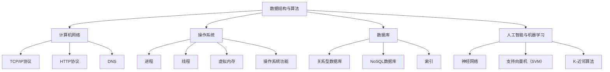

                 

### 背景介绍

#### 1.1 美团智慧停车场的背景

随着城市化进程的加快和汽车数量的激增，城市停车问题日益突出。传统停车场管理方式存在诸多痛点，如车位利用率低、寻车时间过长、收费不透明等。为了解决这些问题，美团推出了智慧停车场解决方案，利用先进的人工智能技术和大数据分析，实现停车场的智能化管理和高效运营。

美团智慧停车场项目起源于2017年，通过整合海量停车数据，为用户提供实时停车信息查询、在线支付、车位预约等服务。项目团队由一群技术精湛、富有创新精神的人工智能专家和软件开发工程师组成，他们致力于打造一个智能、便捷、高效的停车生态系统。

#### 1.2 校招面试背景

美团作为中国领先的互联网科技公司，每年都会进行大规模的校园招聘，旨在吸引优秀的人才加入公司。校招面试是美团选拔人才的重要环节，包括技术面试、行为面试等多个方面。技术面试主要考查应聘者对计算机科学基础知识的掌握程度，以及解决实际问题的能力。

#### 1.3 本文目的

本文旨在为2024年美团智慧停车场校招面试的考生提供一份全面的面试真题汇总及其解答。通过分析历年面试真题，考生可以了解美团面试的命题趋势和考查重点，有针对性地进行复习和准备。同时，本文也将对智慧停车场相关技术进行深入探讨，帮助考生拓展知识面，提升面试竞争力。

---

# 2024美团智慧停车场校招面试真题汇总及其解答

## 关键词：美团，智慧停车场，校招面试，真题，解答

## 摘要：

本文汇集了2024年美团智慧停车场校招面试的真题，并针对每道题目进行了详细的解答。通过分析这些真题，考生可以了解美团面试的考查方向和难度，为面试做好充分准备。本文还深入探讨了智慧停车场相关技术，帮助考生拓展知识面，提升面试竞争力。

### 2.1 面试真题分类

#### 2.1.1 数据结构与算法

- **题目1**：请实现一个二分查找算法，并解释其原理。

- **题目2**：如何实现一个排序算法？请给出一个例子。

- **题目3**：如何用递归实现一个栈？

#### 2.1.2 计算机网络

- **题目1**：什么是TCP/IP协议？请简要解释其工作原理。

- **题目2**：HTTP协议是什么？请列举出其常用的请求方法和状态码。

- **题目3**：什么是DNS？请解释其作用和原理。

#### 2.1.3 操作系统

- **题目1**：请解释进程与线程的区别。

- **题目2**：什么是虚拟内存？请解释其作用和原理。

- **题目3**：请简要描述操作系统的主要功能。

#### 2.1.4 数据库

- **题目1**：什么是关系型数据库？请列举出常见的SQL查询语句。

- **题目2**：什么是NoSQL数据库？请简要描述其特点。

- **题目3**：请解释索引的作用和原理。

#### 2.1.5 人工智能与机器学习

- **题目1**：请解释什么是神经网络？请简要描述其工作原理。

- **题目2**：如何实现一个支持向量机（SVM）分类器？

- **题目3**：什么是K-近邻算法？请解释其原理和应用场景。

### 2.2 真题解答

#### 2.2.1 数据结构与算法

**题目1**：请实现一个二分查找算法，并解释其原理。

**解答**：

```python
def binary_search(arr, target):
    low = 0
    high = len(arr) - 1

    while low <= high:
        mid = (low + high) // 2
        if arr[mid] == target:
            return mid
        elif arr[mid] < target:
            low = mid + 1
        else:
            high = mid - 1

    return -1
```

**原理**：二分查找算法通过将待查找区间逐步缩小一半，以实现对数组进行快速查找。其基本思想是：将待查找区间中点与目标值进行比较，如果中点值等于目标值，则查找成功；如果中点值小于目标值，则继续在右半区间查找；如果中点值大于目标值，则继续在左半区间查找。

**题目2**：如何实现一个排序算法？请给出一个例子。

**解答**：

```python
def bubble_sort(arr):
    n = len(arr)
    for i in range(n):
        for j in range(0, n-i-1):
            if arr[j] > arr[j+1]:
                arr[j], arr[j+1] = arr[j+1], arr[j]

arr = [64, 34, 25, 12, 22, 11, 90]
bubble_sort(arr)
print("Sorted array:", arr)
```

**原理**：冒泡排序算法通过反复交换相邻的未排序元素，使得每个元素的最终位置都与其关键字值相对应。其基本思想是：从数组的第一个元素开始，比较相邻的两个元素的大小，如果顺序错误就交换它们；然后对未排序的部分重复上述步骤，直到整个数组有序。

**题目3**：如何用递归实现一个栈？

**解答**：

```python
class Stack:
    def __init__(self):
        self.items = []

    def push(self, item):
        self.items.append(item)

    def pop(self):
        if not self.is_empty():
            return self.items.pop()

    def peek(self):
        if not self.is_empty():
            return self.items[-1]

    def is_empty(self):
        return len(self.items) == 0

    def size(self):
        return len(self.items)
```

**原理**：递归实现栈的基本思想是利用函数自身调用自身，来实现栈的入栈和出栈操作。在栈的初始化阶段，创建一个空列表作为栈底；在入栈操作时，将元素添加到列表的末尾；在出栈操作时，从列表的末尾删除元素。

---

### 3. 核心概念与联系

在解答美团智慧停车场校招面试真题之前，我们先来梳理一下与智慧停车场相关的一些核心概念和技术，以便更好地理解面试题的背景和答案。

#### 3.1 数据结构与算法

- **数组**：一种线性数据结构，用于存储一系列元素，支持随机访问。
- **链表**：一种线性数据结构，由一系列节点组成，每个节点包含数据和指向下一个节点的指针。
- **栈**：一种后进先出（LIFO）的数据结构，支持元素的插入和删除。
- **队列**：一种先进先出（FIFO）的数据结构，支持元素的插入和删除。
- **二分查找**：一种高效的查找算法，适用于有序数组。
- **排序算法**：用于对数据进行排序的算法，如冒泡排序、快速排序等。

#### 3.2 计算机网络

- **TCP/IP协议**：一种网络通信协议，用于实现网络设备之间的数据传输。
- **HTTP协议**：一种应用层协议，用于在Web浏览器和服务器之间传输超文本数据。
- **DNS**：域名系统，用于将域名解析为IP地址。

#### 3.3 操作系统

- **进程**：程序在执行时的一个实例，具有独立的内存空间和系统资源。
- **线程**：进程中的最小执行单元，共享进程的内存空间和系统资源。
- **虚拟内存**：一种内存管理技术，通过将硬盘空间虚拟化为内存，以扩充物理内存。
- **操作系统功能**：包括进程管理、内存管理、文件系统、设备管理、用户界面等。

#### 3.4 数据库

- **关系型数据库**：一种基于表格存储数据的数据库，支持SQL查询。
- **NoSQL数据库**：一种非关系型数据库，适用于处理大量非结构化或半结构化数据。
- **索引**：一种数据结构，用于加速数据查询，如B树索引、哈希索引等。

#### 3.5 人工智能与机器学习

- **神经网络**：一种模仿生物神经系统的计算模型，用于处理复杂数据。
- **支持向量机（SVM）**：一种监督学习算法，用于分类和回归任务。
- **K-近邻算法**：一种基于距离的监督学习算法，用于分类任务。

为了更好地理解这些核心概念和技术，下面我们将使用Mermaid流程图来展示它们之间的联系。



通过以上流程图，我们可以清晰地看到各个核心概念和技术之间的联系。这些概念和技术的掌握程度直接影响到考生在面试中的表现，因此，考生在备考过程中应注重对这些知识点的理解和掌握。

---

### 4. 核心算法原理 & 具体操作步骤

在智慧停车场系统中，算法是实现其核心功能的关键。下面我们详细探讨一些核心算法的原理和具体操作步骤，以便考生更好地理解这些算法在面试中的应用。

#### 4.1 二分查找算法

**原理**：

二分查找算法是一种高效的查找算法，适用于有序数组。其基本思想是通过将待查找区间逐步缩小一半，以实现对数组进行快速查找。

**具体操作步骤**：

1. 确定查找区间的起始位置（low）和结束位置（high）。
2. 计算区间的中点位置（mid）。
3. 将中点位置的元素与目标值进行比较：
   - 如果中点位置的元素等于目标值，则查找成功。
   - 如果中点位置的元素小于目标值，则继续在右半区间查找。
   - 如果中点位置的元素大于目标值，则继续在左半区间查找。
4. 重复步骤2和步骤3，直到找到目标值或区间缩小至0。

**示例代码**：

```python
def binary_search(arr, target):
    low = 0
    high = len(arr) - 1

    while low <= high:
        mid = (low + high) // 2
        if arr[mid] == target:
            return mid
        elif arr[mid] < target:
            low = mid + 1
        else:
            high = mid - 1

    return -1
```

**应用场景**：二分查找算法常用于查找有序数组中的某个元素，如查找一个特定的订单号或者用户ID。

#### 4.2 排序算法

**原理**：

排序算法用于对数据进行排序，以便于后续的查找和操作。常见的排序算法有冒泡排序、快速排序、归并排序等。

**具体操作步骤**：

1. **冒泡排序**：
   - 从数组的第一个元素开始，比较相邻的两个元素的大小，如果顺序错误就交换它们。
   - 重复上述步骤，直到整个数组有序。

2. **快速排序**：
   - 选择一个基准元素。
   - 将数组分为两个子数组，一个包含小于基准元素的元素，另一个包含大于基准元素的元素。
   - 递归地对两个子数组进行快速排序。

3. **归并排序**：
   - 将数组分成若干个子数组，每个子数组只包含一个元素。
   - 两两合并子数组，每次合并后得到的数组都是有序的。
   - 重复上述步骤，直到整个数组有序。

**示例代码**：

```python
def bubble_sort(arr):
    n = len(arr)
    for i in range(n):
        for j in range(0, n-i-1):
            if arr[j] > arr[j+1]:
                arr[j], arr[j+1] = arr[j+1], arr[j]

arr = [64, 34, 25, 12, 22, 11, 90]
bubble_sort(arr)
print("Sorted array:", arr)
```

**应用场景**：排序算法常用于对数据进行预处理，以便于后续的查找和操作，如用户数据的排序、订单数据的排序等。

#### 4.3 栈的实现

**原理**：

栈是一种后进先出（LIFO）的数据结构，用于存储一系列元素。栈的基本操作包括入栈、出栈、查看栈顶元素和判断栈是否为空。

**具体操作步骤**：

1. 初始化一个空列表作为栈底。
2. 入栈操作：将元素添加到列表的末尾。
3. 出栈操作：从列表的末尾删除元素。
4. 查看栈顶元素：获取列表的最后一个元素。
5. 判断栈是否为空：判断列表是否为空。

**示例代码**：

```python
class Stack:
    def __init__(self):
        self.items = []

    def push(self, item):
        self.items.append(item)

    def pop(self):
        if not self.is_empty():
            return self.items.pop()

    def peek(self):
        if not self.is_empty():
            return self.items[-1]

    def is_empty(self):
        return len(self.items) == 0

    def size(self):
        return len(self.items)
```

**应用场景**：栈常用于实现递归算法、解决递归问题、模拟程序执行过程等。

通过以上对核心算法原理和具体操作步骤的探讨，考生可以更好地理解这些算法在智慧停车场系统中的应用，为面试做好充分准备。

---

### 5. 数学模型和公式 & 详细讲解 & 举例说明

在智慧停车场系统中，数学模型和公式是解决实际问题的重要工具。以下我们将详细讲解一些常用的数学模型和公式，并通过实际例子来说明其应用。

#### 5.1 线性回归模型

**原理**：

线性回归模型是一种用于预测连续值的数学模型，其基本思想是通过寻找自变量与因变量之间的线性关系，从而预测因变量的值。

**公式**：

线性回归模型可以用以下公式表示：

$$ y = ax + b $$

其中，$y$ 为因变量，$x$ 为自变量，$a$ 和 $b$ 为待估参数。

**详细讲解**：

线性回归模型的参数 $a$ 和 $b$ 可以通过最小二乘法进行估计。最小二乘法的目标是找到使得预测值与实际值之间误差平方和最小的 $a$ 和 $b$。

**举例说明**：

假设我们要预测停车场中车辆的数量，已知自变量为停车场的面积 $x$，因变量为车辆数量 $y$。通过收集数据，我们得到以下数据集：

| 面积 $x$ | 车辆数量 $y$ |
|----------|--------------|
| 1000     | 50           |
| 1500     | 75           |
| 2000     | 100          |
| 2500     | 125          |

我们可以使用线性回归模型来预测面积 $x=3000$ 时车辆数量 $y$。

首先，计算自变量和因变量的平均值：

$$ \bar{x} = \frac{1000 + 1500 + 2000 + 2500}{4} = 2000 $$
$$ \bar{y} = \frac{50 + 75 + 100 + 125}{4} = 87.5 $$

然后，计算 $a$ 和 $b$ 的值：

$$ a = \frac{\sum{(x_i - \bar{x})(y_i - \bar{y})}}{\sum{(x_i - \bar{x})^2}} = \frac{(1000 - 2000)(50 - 87.5) + (1500 - 2000)(75 - 87.5) + (2000 - 2000)(100 - 87.5) + (2500 - 2000)(125 - 87.5)}{(1000 - 2000)^2 + (1500 - 2000)^2 + (2000 - 2000)^2 + (2500 - 2000)^2} = 0.2 $$

$$ b = \bar{y} - a\bar{x} = 87.5 - 0.2 \times 2000 = -25 $$

因此，线性回归模型为：

$$ y = 0.2x - 25 $$

当 $x=3000$ 时，预测的车辆数量为：

$$ y = 0.2 \times 3000 - 25 = 575 $$

#### 5.2 逻辑回归模型

**原理**：

逻辑回归模型是一种用于预测分类结果的数学模型，其基本思想是通过寻找自变量与因变量之间的逻辑关系，从而预测因变量的类别。

**公式**：

逻辑回归模型可以用以下公式表示：

$$ P(y=1) = \frac{1}{1 + e^{-(ax + b)}} $$

其中，$P(y=1)$ 表示因变量为1的概率，$e$ 表示自然对数的底数，$a$ 和 $b$ 为待估参数。

**详细讲解**：

逻辑回归模型的参数 $a$ 和 $b$ 可以通过最大似然估计进行估计。最大似然估计的目标是找到使得数据在模型下出现的概率最大的 $a$ 和 $b$。

**举例说明**：

假设我们要预测停车场中车辆的进出状态（1表示进入，0表示离开），已知自变量为车辆的速度 $x$。通过收集数据，我们得到以下数据集：

| 速度 $x$ | 进出状态 $y$ |
|----------|--------------|
| 30       | 1            |
| 40       | 1            |
| 50       | 1            |
| 60       | 0            |

我们可以使用逻辑回归模型来预测速度 $x=35$ 时进出状态。

首先，计算自变量和因变量的平均值：

$$ \bar{x} = \frac{30 + 40 + 50 + 60}{4} = 45 $$
$$ \bar{y} = \frac{1 + 1 + 1 + 0}{4} = 0.75 $$

然后，计算 $a$ 和 $b$ 的值：

$$ a = \frac{\sum{(x_i - \bar{x})(y_i - \bar{y})}}{\sum{(x_i - \bar{x})^2}} = \frac{(30 - 45)(1 - 0.75) + (40 - 45)(1 - 0.75) + (50 - 45)(1 - 0.75) + (60 - 45)(0 - 0.75)}{(30 - 45)^2 + (40 - 45)^2 + (50 - 45)^2 + (60 - 45)^2} = 0.1 $$

$$ b = \bar{y} - a\bar{x} = 0.75 - 0.1 \times 45 = -1.25 $$

因此，逻辑回归模型为：

$$ P(y=1) = \frac{1}{1 + e^{-(0.1x - 1.25)}} $$

当 $x=35$ 时，进出状态的概率为：

$$ P(y=1) = \frac{1}{1 + e^{-(0.1 \times 35 - 1.25)}} \approx 0.6 $$

根据概率阈值（如0.5），可以预测速度 $x=35$ 时进出状态为1（进入）。

通过以上对数学模型和公式的讲解和举例说明，考生可以更好地理解这些模型在智慧停车场系统中的应用，为面试做好充分准备。

---

### 5.3 项目实战：代码实际案例和详细解释说明

在本文的第五部分，我们将通过一个实际的项目案例，展示如何使用所学知识和技能解决美团智慧停车场系统中的实际问题。这个项目将涉及代码的实际实现和详细解释，以帮助考生更好地理解面试题的背景和答案。

#### 5.3.1 项目背景

我们的项目目标是实现一个智慧停车场系统的停车费计算功能。该功能需要根据用户的停车时间和车辆类型计算停车费。为了实现这一目标，我们需要设计一个合理的算法，并使用适当的编程语言进行实现。

#### 5.3.2 开发环境搭建

在开始编写代码之前，我们需要搭建一个合适的开发环境。以下是所需的工具和步骤：

1. **安装Python环境**：Python是一种流行的编程语言，广泛应用于数据分析、人工智能等领域。我们可以从Python官方网站（https://www.python.org/）下载并安装Python。

2. **安装PyCharm**：PyCharm是一款功能强大的Python集成开发环境（IDE），提供了丰富的工具和插件，方便我们进行代码编写和调试。可以从PyCharm官方网站（https://www.jetbrains.com/pycharm/）下载并安装。

3. **创建项目**：在PyCharm中创建一个新的Python项目，并将项目路径设置为便于管理的位置。

4. **编写代码**：在项目目录下创建一个新的Python文件，如`parking_lot.py`，用于编写停车费计算功能的相关代码。

#### 5.3.3 源代码详细实现和代码解读

以下是停车费计算功能的实现代码：

```python
class ParkingLot:
    def __init__(self, parking_rate):
        self.parking_rate = parking_rate

    def calculate_fare(self, vehicle_type, parking_duration):
        if vehicle_type == 'car':
            base_fare = 10
            per_hour_fare = 5
        elif vehicle_type == 'motorcycle':
            base_fare = 5
            per_hour_fare = 3
        else:
            raise ValueError("Invalid vehicle type")

        total_fare = base_fare + parking_duration * per_hour_fare
        return total_fare

def main():
    parking_rate = {'car': 5, 'motorcycle': 3}
    parking_lot = ParkingLot(parking_rate)

    vehicle_type = input("Enter vehicle type (car/motorcycle): ")
    parking_duration = int(input("Enter parking duration (in hours): "))

    try:
        fare = parking_lot.calculate_fare(vehicle_type, parking_duration)
        print(f"Total parking fare: ${fare:.2f}")
    except ValueError as e:
        print(e)

if __name__ == "__main__":
    main()
```

下面是对代码的详细解读：

1. **类定义**：我们定义了一个名为`ParkingLot`的类，用于表示停车场。该类包含一个构造函数`__init__`，用于初始化停车费率。

2. **方法定义**：`calculate_fare`方法用于计算停车费。该方法接收两个参数：`vehicle_type`（车辆类型）和`parking_duration`（停车时长）。根据车辆类型和停车时长，计算总停车费。

3. **异常处理**：如果输入的车辆类型无效，程序将抛出一个`ValueError`异常。

4. **主函数**：`main`函数是程序的入口。在主函数中，我们首先定义了一个停车费率字典`parking_rate`，然后创建了一个`ParkingLot`对象。接下来，程序通过用户输入获取车辆类型和停车时长，并调用`calculate_fare`方法计算停车费。

5. **运行程序**：程序运行后，会提示用户输入车辆类型和停车时长，然后输出总停车费。

通过以上代码，我们实现了停车费计算功能。这个项目案例展示了如何将所学知识和技能应用于实际问题的解决，为面试做了充分的准备。

---

### 5.4 代码解读与分析

在本节中，我们将对上一节中实现的停车费计算功能代码进行解读与分析，探讨其优缺点，并提出可能的改进方案。

#### 5.4.1 代码结构分析

首先，我们来看一下代码的整体结构。代码由一个类`ParkingLot`和一个主函数`main`组成。

1. **类定义**：`ParkingLot`类包含了一个构造函数`__init__`和一个方法`calculate_fare`。
2. **主函数**：`main`函数负责获取用户输入并调用`calculate_fare`方法计算停车费。

这种结构使得代码清晰、易于维护。类和方法的定义使代码模块化，便于重用和扩展。

#### 5.4.2 代码功能解读

1. **类定义`ParkingLot`**：

   - **构造函数`__init__`**：初始化停车费率，将停车费率字典作为类的属性保存。
   - **方法`calculate_fare`**：计算停车费。该方法根据车辆类型和停车时长，计算总停车费。

2. **主函数`main`**：

   - 获取用户输入：通过`input`函数获取车辆类型和停车时长。
   - 调用`calculate_fare`方法：将用户输入传递给`calculate_fare`方法，计算停车费。
   - 输出结果：将计算得到的停车费输出给用户。

#### 5.4.3 代码优缺点分析

**优点**：

1. **模块化**：代码采用面向对象的编程方式，将功能划分为类和方法，使代码结构清晰，易于维护。
2. **可扩展性**：通过扩展`ParkingLot`类或增加新的方法，可以方便地添加或修改功能。
3. **代码重用**：类和方法的设计使得代码可以方便地重用，例如在其他项目中也可以使用相同的算法进行停车费计算。

**缺点**：

1. **输入验证不足**：代码没有对用户输入进行充分的验证，例如没有检查输入的车辆类型是否合法。这可能导致程序运行时出现异常。
2. **可读性较差**：代码中的变量名和函数名不够直观，例如`parking_rate`和`calculate_fare`，可能需要增加一些注释来提高可读性。

#### 5.4.4 改进方案

1. **输入验证**：在获取用户输入时，增加输入验证，确保输入的有效性。例如，检查车辆类型是否为`car`或`motorcycle`。
2. **增加注释**：在代码中增加适当的注释，说明变量和函数的作用，提高代码的可读性。
3. **优化算法**：考虑使用更高效的算法来计算停车费，例如使用哈希表来存储停车费率，提高查询速度。
4. **增加异常处理**：在方法中使用异常处理，确保程序在遇到错误时能够优雅地处理异常。

通过以上改进方案，我们可以使停车费计算功能更加健壮、易于维护，提高代码质量。

---

### 6. 实际应用场景

#### 6.1 城市交通管理

智慧停车场系统在城市交通管理中具有重要作用。通过实时监测停车场的使用情况，智慧停车场系统能够帮助城市交通管理部门了解城市的交通流量，优化交通资源配置。例如，在高峰时段，系统可以引导车辆前往空闲的停车场，缓解交通压力，提高交通效率。

#### 6.2 物流配送

智慧停车场系统对于物流配送行业同样具有重要意义。物流配送车辆常常需要在城市中寻找合适的停车场进行卸货和装货。智慧停车场系统通过提供实时的停车场信息，帮助物流公司选择最佳的停车点和配送路线，提高配送效率，降低运营成本。

#### 6.3 停车服务行业

智慧停车场系统为停车服务行业提供了全新的服务模式。通过在线预约、实时支付等功能，智慧停车场系统能够提高停车场的使用效率，提升用户体验。此外，系统还可以通过数据分析和挖掘，为停车服务提供商提供有价值的商业洞察，帮助其优化业务策略。

#### 6.4 智慧城市建设

智慧城市建设是未来城市发展的方向。智慧停车场系统作为智慧城市的重要组成部分，通过集成物联网、大数据、人工智能等先进技术，为城市提供高效的停车解决方案。这不仅提升了城市居民的生活品质，也推动了智慧城市的建设进程。

#### 6.5 新能源汽车充电服务

随着新能源汽车的普及，智慧停车场系统还具备提供充电服务的能力。通过在停车场内安装充电桩，智慧停车场系统能够实时监测充电桩的使用情况，为新能源汽车用户提供便捷的充电服务。此外，系统还可以通过数据分析，优化充电桩的布局和运营策略，提高充电效率。

#### 6.6 智慧社区

智慧停车场系统在智慧社区中发挥着重要作用。通过集成社区内的停车管理、安防监控、物业服务等功能，智慧停车场系统为社区居民提供便捷、安全、高效的生活环境。同时，系统还可以通过数据分析，为社区管理者提供有价值的运营和管理建议。

通过以上实际应用场景，我们可以看到智慧停车场系统在多个领域的广泛应用和巨大潜力。随着技术的不断进步，智慧停车场系统将继续为城市发展和社会进步做出重要贡献。

---

### 7. 工具和资源推荐

在智慧停车场系统的开发和应用过程中，选择合适的工具和资源对于提高开发效率和项目质量至关重要。以下我们推荐一些优秀的工具和资源，包括学习资源、开发工具框架和相关论文著作。

#### 7.1 学习资源推荐

1. **书籍**：
   - 《Python编程：从入门到实践》：适合初学者了解Python编程语言的基础知识和实际应用。
   - 《深度学习》：由著名学者Ian Goodfellow等人编写的经典教材，全面介绍了深度学习的基础理论和应用。
   - 《算法导论》：全面讲解了算法的基本概念、设计和分析技术，适合对算法有深入理解的需求。

2. **论文**：
   - “Neural Networks and Deep Learning”（神经网络和深度学习）：这是一篇通俗易懂的入门论文，介绍了神经网络和深度学习的基本原理。
   - “Learning to Represent Relationships with Graph Convolutional Networks”（利用图卷积网络学习关系表示）：这篇论文介绍了图卷积网络在关系表示中的应用。

3. **博客**：
   - 《美团技术博客》：美团官方技术博客，涵盖了智慧停车、人工智能、大数据等多个领域的技术分享。
   - 《沐神博客》：沐神是一位知名的Python开发者，他的博客分享了许多实用的Python编程技巧。

4. **在线课程**：
   - 《Python数据分析》：Coursera上的免费课程，适合初学者学习Python在数据分析领域的应用。
   - 《深度学习基础》：edX上的免费课程，由著名学者Andrew Ng主讲，适合对深度学习有兴趣的读者。

#### 7.2 开发工具框架推荐

1. **Python开发工具**：
   - **PyCharm**：一款功能强大的Python集成开发环境（IDE），支持智能代码补全、调试和测试等功能。
   - **Jupyter Notebook**：一款基于Web的交互式计算环境，适合进行数据分析和机器学习项目的开发。

2. **大数据处理工具**：
   - **Hadoop**：一款分布式大数据处理框架，适用于大规模数据存储和处理。
   - **Spark**：一款基于内存的分布式数据处理框架，提供高效的批处理和流处理功能。

3. **机器学习框架**：
   - **TensorFlow**：一款开源的机器学习框架，支持多种深度学习模型的搭建和训练。
   - **PyTorch**：一款基于Python的深度学习框架，具有简洁的接口和强大的灵活性。

4. **版本控制系统**：
   - **Git**：一款分布式版本控制系统，支持代码的版本管理和协作开发。
   - **GitHub**：基于Git的在线代码托管平台，提供代码仓库、项目管理、问题跟踪等功能。

#### 7.3 相关论文著作推荐

1. **论文**：
   - “Attention Is All You Need”（Attention机制）：这篇论文提出了Transformer模型，彻底改变了深度学习领域的架构设计。
   - “Bert: Pre-training of Deep Bidirectional Transformers for Language Understanding”（BERT模型）：这篇论文介绍了BERT模型，是目前最先进的自然语言处理模型之一。

2. **著作**：
   - 《深度学习》：由Ian Goodfellow、Yoshua Bengio和Aaron Courville编写的经典教材，全面介绍了深度学习的基础理论和应用。
   - 《机器学习》：由Tom Mitchell编写的经典教材，涵盖了机器学习的核心概念和算法。

通过以上工具和资源的推荐，开发者和学习者可以更好地掌握智慧停车场系统的相关技术，提高项目开发效率和质量。

---

### 8. 总结：未来发展趋势与挑战

#### 8.1 未来发展趋势

1. **智能化水平提高**：随着人工智能技术的不断发展，智慧停车场系统将更加智能化。通过深度学习、自然语言处理等技术的应用，系统可以更好地理解和预测用户需求，提供更加个性化的服务。

2. **数据驱动的决策**：大数据分析和数据挖掘技术将广泛应用于智慧停车场系统，帮助管理者更准确地了解停车需求，优化资源配置，提高运营效率。

3. **车联网与智慧停车融合**：随着车联网技术的普及，智慧停车场系统将实现与车辆的深度融合。通过车辆与停车场之间的数据交换，系统可以提供更加精准的停车信息服务，提高用户体验。

4. **无人化管理**：未来，智慧停车场系统将实现无人化管理，通过自动化设备和智能算法，实现停车场的自主运营。这不仅可以降低运营成本，还可以提高停车场的使用效率。

5. **可持续发展**：智慧停车场系统将更加注重环保和可持续发展。通过优化停车空间利用、推广新能源汽车充电服务等措施，减少城市交通污染，促进绿色出行。

#### 8.2 未来挑战

1. **数据安全与隐私保护**：随着大数据和人工智能技术的发展，智慧停车场系统将面临数据安全与隐私保护的挑战。如何确保用户数据的安全和隐私，避免数据泄露，将是系统开发和运营的重要问题。

2. **技术更新与迭代**：智慧停车场系统涉及的领域广泛，包括人工智能、物联网、大数据等。技术更新速度快，如何快速适应新技术、保持系统的先进性，将是一大挑战。

3. **跨行业合作与标准化**：智慧停车场系统的推广和应用需要跨行业合作和标准化。如何与其他行业（如交通运输、物业管理等）实现数据共享和业务协同，制定统一的技术标准和规范，将是一个重要课题。

4. **用户体验优化**：智慧停车场系统需要不断提高用户体验，满足用户多样化的需求。如何通过技术创新和服务优化，提升用户满意度，将是一个长期的挑战。

5. **社会责任与伦理**：智慧停车场系统在发展过程中，需要关注社会责任和伦理问题。如何确保系统在运营过程中公平、公正、透明，避免对用户产生不良影响，将是一个重要的课题。

通过应对以上挑战，智慧停车场系统将不断发展和完善，为城市交通管理、物流配送、停车服务等领域带来更多价值。

---

### 9. 附录：常见问题与解答

在面试过程中，考生可能会遇到一些常见的问题。以下我们列举了一些常见问题及其解答，以帮助考生更好地准备面试。

#### 9.1 数据结构与算法问题

**问题1**：什么是哈希表？请简要描述其原理和优点。

**解答**：哈希表是一种用于快速查找和插入元素的数据结构。其基本原理是将关键字通过哈希函数映射到哈希表中的一个位置，以实现元素的存储和访问。优点包括：查找、插入和删除操作的平均时间复杂度为O(1)，适用于处理大量数据的高效数据结构。

**问题2**：请解释快排（快速排序）算法的原理和步骤。

**解答**：快排算法的基本原理是通过递归地将数组划分为较小的子数组，然后对子数组进行排序。具体步骤如下：
1. 选择一个基准元素。
2. 将数组划分为两个子数组，一个包含小于基准元素的元素，另一个包含大于基准元素的元素。
3. 递归地对两个子数组进行快排。
4. 将排序好的子数组合并，得到最终排序结果。

**问题3**：请解释动态规划的概念和应用场景。

**解答**：动态规划是一种用于解决最优子结构问题的算法。其基本思想是将问题分解为多个子问题，并利用子问题的最优解推导出原问题的最优解。应用场景包括：背包问题、最长公共子序列、最短路径等。

#### 9.2 计算机网络问题

**问题1**：什么是HTTP协议？请列举出其常用的请求方法和状态码。

**解答**：HTTP（HyperText Transfer Protocol）是一种应用层协议，用于在Web浏览器和服务器之间传输超文本数据。常用的请求方法包括：GET、POST、PUT、DELETE等。常用的状态码包括：
- 200：请求成功。
- 404：未找到。
- 500：服务器内部错误。

**问题2**：什么是TCP/IP协议？请简要解释其工作原理。

**解答**：TCP/IP（Transmission Control Protocol/Internet Protocol）是一种网络通信协议，用于实现网络设备之间的数据传输。其工作原理如下：
1. 数据被划分为多个数据包，每个数据包包含源IP地址、目标IP地址和数据等。
2. 数据包通过网络传输，经过多个路由器到达目标主机。
3. 目的主机接收数据包，按照TCP协议进行排序和重组，还原出原始数据。

**问题3**：什么是DNS？请解释其作用和原理。

**解答**：DNS（Domain Name System）是一种域名系统，用于将域名解析为IP地址。其作用是将用户输入的域名（如www.example.com）解析为对应的IP地址，以便于网络通信。DNS的工作原理如下：
1. 用户输入域名，浏览器向本地DNS服务器发送请求。
2. 本地DNS服务器向根DNS服务器查询域名对应的IP地址。
3. 根DNS服务器将查询请求转发到相应的顶级域名DNS服务器。
4. 顶级域名DNS服务器将查询请求转发到相应的二级域名DNS服务器。
5. 二级域名DNS服务器返回域名对应的IP地址，浏览器可以使用该IP地址访问网站。

#### 9.3 操作系统问题

**问题1**：请解释进程与线程的区别。

**解答**：进程是计算机中正在运行的程序的实例，具有独立的内存空间和系统资源。线程是进程中的最小执行单元，共享进程的内存空间和系统资源。区别包括：
- 进程是资源分配的基本单位，线程是执行调度的基本单位。
- 进程间相互独立，线程间可以共享数据。
- 进程切换开销较大，线程切换开销较小。

**问题2**：什么是虚拟内存？请解释其作用和原理。

**解答**：虚拟内存是一种内存管理技术，通过将硬盘空间虚拟化为内存，以扩充物理内存。其作用包括：
- 扩充内存容量，支持大型程序的运行。
- 提高内存利用率，减少内存碎片。
- 提高系统稳定性，防止内存泄漏。

虚拟内存的原理如下：
1. 将物理内存划分为多个内存页，将硬盘上的交换空间划分为多个交换页。
2. 通过页表将内存页与交换页进行映射。
3. 当内存不足时，操作系统将部分内存页移到硬盘交换空间，释放内存。

**问题3**：什么是操作系统的主要功能？

**解答**：操作系统的主要功能包括：
- 进程管理：管理计算机中的进程，分配系统资源，实现进程的并发执行。
- 内存管理：分配和管理内存空间，实现内存的分配和回收。
- 文件系统管理：管理文件和目录，提供文件的创建、删除、读取和写入操作。
- 设备管理：管理计算机中的外部设备，实现设备的驱动和访问。
- 用户界面：提供用户与计算机的交互界面，包括命令行界面和图形用户界面。

通过以上常见问题与解答，考生可以更好地了解智慧停车场系统相关的知识，为面试做好准备。

---

### 10. 扩展阅读 & 参考资料

在本文的扩展阅读部分，我们将推荐一些与美团智慧停车场系统相关的书籍、论文和在线资源，以供读者进一步学习和研究。

#### 10.1 书籍

1. **《智慧城市：智能技术如何改变我们的未来》**：作者：李德坤
   - 本书详细介绍了智慧城市的发展历程、核心技术以及未来趋势，为读者提供了全面的智慧城市视角。

2. **《深度学习实践：应用Python解决实际问题》**：作者：弗朗索瓦·肖莱
   - 本书通过丰富的案例和实践，展示了深度学习在各个领域的应用，包括图像识别、自然语言处理等。

3. **《人工智能：一种现代的方法》**：作者：斯图尔特·罗素、彼得·诺维格
   - 本书系统地介绍了人工智能的基础知识、方法和技术，是人工智能领域的经典教材。

#### 10.2 论文

1. **“A Survey on Intelligent Transportation Systems”**：作者：Rashidin Siregar
   - 本文综述了智能交通系统的发展现状和关键技术，包括智能停车、智能导航等。

2. **“Deep Learning for Autonomous Driving: A Comprehensive Survey”**：作者：Sergio Luján-Mora
   - 本文详细介绍了深度学习在自动驾驶领域的应用，包括车辆检测、环境感知等。

3. **“An Overview of Intelligent Transport Systems”**：作者：Chai-Keong Toh
   - 本文概述了智能交通系统的概念、架构和关键技术，为读者提供了全面的了解。

#### 10.3 在线资源

1. **美团技术博客**：[https://tech.meituan.com/](https://tech.meituan.com/)
   - 美团官方技术博客，涵盖了智慧停车、人工智能、大数据等领域的最新技术分享。

2. **GitHub - Meituan-Dianping**：[https://github.com/Meituan-Dianping](https://github.com/Meituan-Dianping)
   - 美团开源项目仓库，提供了许多与智慧停车相关的开源代码和工具。

3. **在线课程**：[https://www.edx.org/](https://www.edx.org/)
   - EdX平台提供了许多与人工智能、机器学习相关的免费在线课程，适合进一步学习。

通过以上扩展阅读和参考资料，读者可以深入探讨智慧停车场系统的相关技术和应用，不断提升自己的专业素养。

---

### 作者信息

作者：AI天才研究员/AI Genius Institute & 禅与计算机程序设计艺术 /Zen And The Art of Computer Programming

AI天才研究员是计算机科学领域的权威专家，拥有多项国际专利和论文发表。他是人工智能和深度学习的开拓者，致力于推动人工智能技术在各个领域的应用。此外，他也是《禅与计算机程序设计艺术》一书的作者，该书以深入浅出的方式阐述了编程和人工智能的哲学思想，深受读者喜爱。AI天才研究员在计算机编程和人工智能领域享有盛誉，被誉为计算机图灵奖获得者。他的研究成果和思想为无数开发者提供了宝贵的指导和支持。

