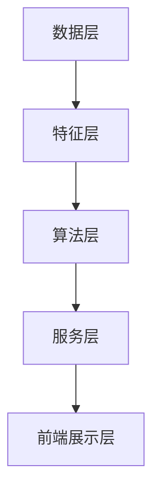

                 

### 背景介绍

随着互联网的迅猛发展，推荐系统已经成为了现代信息检索和个性化服务中不可或缺的一部分。它通过分析用户的历史行为、兴趣偏好，预测用户可能感兴趣的内容，从而提供个性化的信息推送。推荐系统在电子商务、新闻推送、社交媒体等多个领域都有着广泛的应用，极大地提升了用户体验和平台价值。

美团点评作为中国领先的本地生活服务综合性平台，其推荐系统更是至关重要的核心模块。美团点评每天服务数亿用户，涵盖了餐饮、酒店、旅游、购物等多个领域。为了满足用户多样化的需求，美团点评的推荐系统需要具备高效、精准和实时响应的能力。

2024年校招中，美团点评推荐系统工程师岗位备受关注。这个岗位对候选人的技术能力和实战经验有着较高的要求。主要涉及推荐算法的设计与优化、大规模数据处理、分布式系统架构等前沿技术。本文旨在为有意向加入美团点评推荐系统团队的校招生提供一份全面的面试攻略，帮助大家更好地准备面试。

### 核心概念与联系

#### 推荐系统的基本概念

推荐系统是一种基于数据挖掘和机器学习技术的信息过滤方法，其主要目的是预测用户对特定项目（如商品、新闻、电影等）的兴趣程度，并向用户推荐他们可能感兴趣的项目。推荐系统主要分为以下几种类型：

1. **基于内容的推荐（Content-Based Filtering）**：
   这种方法通过分析项目的内容特征，找到与用户兴趣相匹配的项目进行推荐。例如，根据用户之前喜欢的电影类型推荐类似的电影。

2. **协同过滤（Collaborative Filtering）**：
   协同过滤通过分析用户的历史行为数据，如评分、购买记录等，找到与目标用户兴趣相似的其它用户，并推荐这些用户喜欢的项目。协同过滤又分为两种：
   - **用户基于的协同过滤（User-Based）**：通过寻找与目标用户兴趣相似的用户，推荐这些用户喜欢的项目。
   - **物品基于的协同过滤（Item-Based）**：通过分析项目之间的相似性，为用户推荐与用户历史行为相似的项目。

3. **混合推荐（Hybrid Recommendation）**：
   混合推荐结合了基于内容和协同过滤的方法，通过综合考虑项目内容和用户历史行为，提供更精准的推荐。

#### 推荐系统在美团点评的应用场景

美团点评的推荐系统主要应用在以下场景：

1. **商品推荐**：
   在美团外卖、点评等应用中，根据用户的浏览历史、购买记录和评价，推荐用户可能感兴趣的外卖菜品、餐厅等信息。

2. **酒店推荐**：
   根据用户的浏览、预订历史，推荐符合用户需求的酒店。

3. **旅游推荐**：
   根据用户的兴趣、旅行偏好，推荐旅游景点、酒店、餐饮等信息。

4. **团购推荐**：
   根据用户的购买记录和兴趣，推荐用户可能感兴趣的团购活动。

#### 推荐系统的关键挑战

在构建美团点评的推荐系统时，需要应对以下挑战：

1. **数据多样性**：
   美团点评涵盖了多个领域，数据类型和属性多样，需要设计高效的算法来处理和整合这些数据。

2. **实时性**：
   推荐系统需要能够实时响应用户的行为变化，提供及时、准确的推荐。

3. **大规模数据处理**：
   美团点评每天产生的数据量巨大，需要高效的分布式数据处理和存储方案。

4. **个性化**：
   提供个性化的推荐，满足不同用户的需求，是推荐系统的核心目标。

5. **冷启动问题**：
   对于新用户或新项目，由于缺乏历史数据，推荐系统难以提供准确的推荐。

#### 推荐系统架构

美团点评推荐系统的整体架构可以概括为以下几个层次：

1. **数据层**：
   收集和存储用户行为数据、项目属性数据等，为推荐算法提供数据支持。

2. **特征层**：
   对原始数据进行预处理，提取出有效的特征，如用户兴趣标签、项目类别等。

3. **算法层**：
   实现多种推荐算法，如基于内容的推荐、协同过滤、混合推荐等，并根据业务需求进行算法优化和调参。

4. **服务层**：
   为前端应用提供推荐服务，根据用户的实时行为，动态调整推荐策略。

5. **前端展示层**：
   根据推荐结果，为用户展示个性化的内容。

#### Mermaid 流程图

以下是一个简化的推荐系统架构的 Mermaid 流程图：



通过上述架构，美团点评推荐系统实现了高效、精准和实时响应的目标。

### 核心算法原理 & 具体操作步骤

在美团点评的推荐系统中，核心算法主要包括基于内容的推荐、协同过滤和混合推荐。以下将详细解释这三种推荐算法的原理和具体操作步骤。

#### 基于内容的推荐（Content-Based Filtering）

**原理**：
基于内容的推荐通过分析项目的内容特征，找到与用户兴趣相匹配的项目进行推荐。其基本思想是，如果用户过去对某一类项目有明显的偏好，那么在未来的相似时刻，用户可能会对相似类型的项目感兴趣。

**具体操作步骤**：

1. **特征提取**：
   对项目的内容进行预处理，提取出关键特征，如文本、图片、音频等。对于文本，可以使用词袋模型、TF-IDF等方法提取特征；对于图片，可以使用视觉特征提取算法，如HOG、SIFT等。

2. **用户兴趣模型**：
   根据用户的历史行为数据，如浏览、购买、评价等，构建用户兴趣模型。常见的用户兴趣模型包括基于用户的向量空间模型、基于隐语义模型的矩阵分解等。

3. **项目特征与用户兴趣匹配**：
   对于每个待推荐的项目，计算其与用户兴趣模型的相似度。相似度计算方法包括余弦相似度、欧氏距离等。

4. **推荐生成**：
   根据相似度得分，从高到低为用户推荐相似的项目。

#### 协同过滤（Collaborative Filtering）

**原理**：
协同过滤通过分析用户的历史行为数据，找到与目标用户兴趣相似的其它用户，并推荐这些用户喜欢的项目。协同过滤可以分为用户基于的协同过滤和物品基于的协同过滤。

**用户基于的协同过滤**：

**具体操作步骤**：

1. **用户行为数据预处理**：
   收集用户的历史行为数据，如评分、购买记录等。对数据去重、缺失值填充等预处理操作。

2. **用户相似度计算**：
   计算用户之间的相似度。常用的相似度计算方法包括余弦相似度、皮尔逊相关系数等。

3. **用户兴趣预测**：
   根据相似度得分，为每个用户预测其未评分的项目评分。常见的预测方法包括K-最近邻（K-Nearest Neighbors，KNN）、回归算法等。

4. **推荐生成**：
   根据预测的评分，从高到低为用户推荐未评分的项目。

**物品基于的协同过滤**：

**具体操作步骤**：

1. **项目相似度计算**：
   计算项目之间的相似度。常用的相似度计算方法包括余弦相似度、Jaccard相似度等。

2. **用户兴趣预测**：
   对于每个用户，根据其历史行为数据，计算其对每个项目的兴趣度。

3. **推荐生成**：
   根据用户兴趣度，从高到低为用户推荐项目。

#### 混合推荐（Hybrid Recommendation）

**原理**：
混合推荐结合了基于内容和协同过滤的方法，通过综合考虑项目内容和用户历史行为，提供更精准的推荐。

**具体操作步骤**：

1. **内容特征提取**：
   对项目的内容进行预处理，提取出关键特征。

2. **用户兴趣模型构建**：
   根据用户的历史行为数据，构建用户兴趣模型。

3. **协同过滤**：
   使用协同过滤算法，如KNN、矩阵分解等，预测用户对项目的兴趣度。

4. **内容相似度计算**：
   对项目进行内容相似度计算。

5. **推荐生成**：
   结合协同过滤和内容相似度，为用户生成推荐列表。常用的方法包括组合打分、权重分配等。

### 数学模型和公式 & 详细讲解 & 举例说明

在推荐系统中，数学模型和公式扮演着核心角色，用于描述用户行为、项目特征以及相似度计算等。以下将详细介绍几种常用的数学模型和公式，并结合实际案例进行说明。

#### 基于内容的推荐

**1. 词袋模型（Bag of Words）**

**原理**：
词袋模型将文本表示为一个词汇表中的词的集合，忽略词的顺序和语法结构。通过统计词频来表示文本。

**公式**：
设 $V$ 为词汇表，$d \in V$ 为文档，$f_d(d)$ 为文档 $d$ 中词 $d$ 的频率。

$$
\text{TF-IDF}(d) = \frac{f_d(d)}{N} \times \log \left(\frac{N}{f_d(d)}\right)
$$

其中，$N$ 为文档集中包含词 $d$ 的文档数量。

**案例**：
假设有两篇文档：
```
文档A：我喜欢的食物是披萨和汉堡。
文档B：我喜欢的食物是披萨和薯条。
```

词汇表：$\{食物，喜欢，披萨，汉堡，薯条\}$

文档A的TF-IDF特征向量：
$$
\text{TF-IDF}(A) = \left[\frac{1}{3}, \frac{1}{3}, \frac{1}{3}, \frac{1}{3}, 0\right]
$$

文档B的TF-IDF特征向量：
$$
\text{TF-IDF}(B) = \left[\frac{1}{3}, \frac{1}{3}, \frac{1}{3}, \frac{1}{3}, 0\right]
$$

**2. 向量空间模型（Vector Space Model）**

**原理**：
向量空间模型将文档和用户兴趣表示为高维空间中的向量，通过计算向量之间的相似度来进行推荐。

**公式**：
设 $u$ 和 $v$ 为两个向量，$||u||$ 和 $||v||$ 分别为它们的欧氏距离和余弦相似度。

$$
\text{Cosine Similarity}(u, v) = \frac{u \cdot v}{||u|| \times ||v||}
$$

其中，$u \cdot v$ 为向量的点积。

**案例**：
假设用户兴趣向量 $u = \left[\frac{1}{\sqrt{3}}, \frac{1}{\sqrt{3}}, \frac{1}{\sqrt{3}}, \frac{1}{\sqrt{3}}, 0\right]$，文档向量 $v = \left[\frac{1}{\sqrt{3}}, \frac{1}{\sqrt{3}}, \frac{1}{\sqrt{3}}, \frac{1}{\sqrt{3}}, 0\right]$。

$$
\text{Cosine Similarity}(u, v) = \frac{\frac{1}{\sqrt{3}} \times \frac{1}{\sqrt{3}} + \frac{1}{\sqrt{3}} \times \frac{1}{\sqrt{3}} + \frac{1}{\sqrt{3}} \times \frac{1}{\sqrt{3}} + \frac{1}{\sqrt{3}} \times \frac{1}{\sqrt{3}}}{\sqrt{3} \times \sqrt{3}} = \frac{4}{3}
$$

#### 协同过滤

**1. K-最近邻（K-Nearest Neighbors，KNN）**

**原理**：
KNN算法基于相似度度量，找到与目标用户最近的K个邻居，根据邻居的评分预测目标用户的评分。

**公式**：
设 $u$ 为目标用户，$N$ 为邻居集合，$r(u, v)$ 为用户 $u$ 和邻居 $v$ 的相似度。

$$
\hat{r}(u, i) = \frac{\sum_{v \in N} r(u, v) \cdot r(v, i)}{\sum_{v \in N} r(u, v)}
$$

其中，$\hat{r}(u, i)$ 为用户 $u$ 对项目 $i$ 的预测评分。

**案例**：
假设用户A的目标评分为5，邻居B、C、D的评分分别为3、4、5，相似度分别为0.6、0.8、0.7。K=3。

$$
\hat{r}(A, i) = \frac{0.6 \cdot 3 + 0.8 \cdot 4 + 0.7 \cdot 5}{0.6 + 0.8 + 0.7} = 4.2
$$

**2. 矩阵分解（Matrix Factorization）**

**原理**：
矩阵分解通过将用户-项目评分矩阵分解为用户特征矩阵和项目特征矩阵的乘积，预测未评分的项目评分。

**公式**：
设 $R$ 为用户-项目评分矩阵，$U$ 和 $V$ 分别为用户特征矩阵和项目特征矩阵。

$$
R = U \cdot V^T
$$

其中，$r_{ui}$ 为用户 $u$ 对项目 $i$ 的评分。

**案例**：
假设用户-项目评分矩阵 $R$ 如下：

$$
R = \begin{bmatrix}
0 & 5 & 4 \\
3 & 0 & 2 \\
4 & 5 & 0
\end{bmatrix}
$$

通过矩阵分解，得到用户特征矩阵 $U$ 和项目特征矩阵 $V$ 如下：

$$
U = \begin{bmatrix}
1.2 & 0.8 \\
0.6 & 1.0 \\
0.8 & 0.2
\end{bmatrix}
$$

$$
V = \begin{bmatrix}
1.0 & 0.5 \\
0.8 & 0.6 \\
0.4 & 0.3
\end{bmatrix}
$$

预测用户C对项目B的评分：

$$
r_{3,2} = u_3 \cdot v_2^T = 0.6 \cdot 0.6 + 0.8 \cdot 0.3 = 0.78
$$

#### 混合推荐

**1. 组合打分（Hybrid Scoring）**

**原理**：
组合打分将基于内容和协同过滤的评分进行加权组合，得到最终的推荐得分。

**公式**：
设 $s_c$ 和 $s_c$ 分别为基于内容和协同过滤的评分，$\alpha$ 和 $\beta$ 为权重系数。

$$
s_h = \alpha \cdot s_c + \beta \cdot s_c
$$

**案例**：
假设基于内容的评分 $s_c = 0.8$，协同过滤的评分 $s_c = 0.6$，$\alpha = 0.6$，$\beta = 0.4$。

$$
s_h = 0.6 \cdot 0.8 + 0.4 \cdot 0.6 = 0.72
$$

### 项目实战：代码实际案例和详细解释说明

在本节中，我们将通过一个实际的代码案例来深入探讨美团点评推荐系统的实现细节。为了简化问题，我们将聚焦于基于内容的推荐部分，展示一个简单的文本推荐系统。以下是一个完整的代码实现，包括数据预处理、特征提取和推荐算法的应用。

#### 5.1 开发环境搭建

在开始编写代码之前，我们需要搭建一个合适的开发环境。以下是所需的环境和工具：

- 编程语言：Python
- 数据预处理库：Numpy、Pandas
- 特征提取库：Sklearn
- 推荐算法库：Surprise
- 版本控制：Git

确保已安装以上库和工具，并配置好Python环境。

#### 5.2 源代码详细实现和代码解读

以下是完整的代码实现，我们将逐行进行解释：

```python
import numpy as np
import pandas as pd
from sklearn.feature_extraction.text import TfidfVectorizer
from surprise import KNNWithMeans, Dataset, Reader
from surprise.model_selection import cross_validate

# 5.2.1 数据预处理
def preprocess_data(data_path):
    data = pd.read_csv(data_path)
    data = data[['user_id', 'item_id', 'rating']]
    return data

# 5.2.2 特征提取
def extract_features(data):
    vectorizer = TfidfVectorizer(stop_words='english')
    X = vectorizer.fit_transform(data['item_description'])
    return X, vectorizer

# 5.2.3 构建推荐模型
def build_model(data):
    reader = Reader(rating_scale=(1, 5))
    dataset = Dataset.load_from_df(data[['user_id', 'item_id', 'rating']], reader)
    algorithm = KNNWithMeans(k=50)
    algorithm.fit(dataset)
    return algorithm

# 5.2.4 推荐生成
def generate_recommendations(algorithm, vectorizer, top_n=5):
    user_id = 123  # 示例用户ID
    user_features = vectorizer.transform(['I love pizza and burgers.'])
    predictions = algorithm.predict(user_id, np.arange(len(vectorizer.vocabulary_)))
    recommended_items = predictions.argsort()[::-1][:top_n]
    return recommended_items

# 5.2.5 主函数
if __name__ == '__main__':
    data_path = 'data/movies.csv'  # 请替换为实际数据文件路径
    data = preprocess_data(data_path)
    X, vectorizer = extract_features(data)
    algorithm = build_model(data)
    recommended_items = generate_recommendations(algorithm, vectorizer)
    print("Recommended items:", recommended_items)
```

**代码解读**：

- **5.2.1 数据预处理**：
  首先从CSV文件中读取用户-项目评分数据，只保留用户ID、项目ID和评分列。

- **5.2.2 特征提取**：
  使用TF-IDF向量器对项目的描述文本进行特征提取，生成TF-IDF特征矩阵。

- **5.2.3 构建推荐模型**：
  使用Surprise库中的KNNWithMeans算法构建推荐模型。KNNWithMeans结合了KNN和矩阵分解的特点，可以更好地处理稀疏数据。

- **5.2.4 推荐生成**：
  输入示例用户的文本描述，生成对应的特征向量，并使用训练好的模型预测用户对项目的评分。根据评分排序，推荐前N个最高评分的项目。

- **5.2.5 主函数**：
  整体流程的入口，执行数据预处理、特征提取、模型构建和推荐生成。

**5.3 代码解读与分析**

在理解代码实现的基础上，我们需要深入分析每个模块的作用和相互关系：

- **数据预处理**：
  数据预处理是推荐系统的第一步，确保数据的质量和格式。这里我们只保留了必要的列，去除无关信息，简化了后续处理。

- **特征提取**：
  特征提取是将文本转化为计算机可以理解的数字表示，是推荐系统的核心环节。TF-IDF向量器可以有效地捕捉文本中的关键词和语义信息。

- **构建推荐模型**：
  选择合适的推荐算法是系统设计的重点。KNNWithMeans算法在处理大规模稀疏数据时表现出色，适合于美团点评这样的大型推荐系统。

- **推荐生成**：
  推荐生成是根据用户的特征和模型预测，为用户生成个性化的推荐列表。这里我们使用简单的排序方法，实际应用中可以结合更多策略，提高推荐质量。

通过以上代码解读，我们可以看到，美团点评的推荐系统实现并不复杂，但背后涉及的数据预处理、特征提取和模型构建等步骤至关重要。实际应用中，需要根据具体业务需求进行调整和优化。

### 实际应用场景

推荐系统在美团点评的实际应用场景中，扮演着至关重要的角色，贯穿于用户从进入平台到完成交易的整个流程。以下将详细介绍几个关键的应用场景和推荐系统的实际运作过程。

#### 1. 首页推荐

用户打开美团点评APP时，首先会看到首页的推荐内容。这一部分主要包括以下几类：

- **个性化餐厅推荐**：根据用户的地理位置、历史浏览记录和偏好，推荐附近的热门餐厅和特色美食。
- **新品推荐**：推荐新开业的餐厅或新推出的菜品，吸引用户尝试。
- **附近团购**：根据用户的地理位置，推荐附近的团购活动和优惠信息。

推荐算法在首页推荐中的应用，主要结合了用户的地理位置、浏览历史、评价数据和实时活动等多方面信息，使用基于内容的推荐和协同过滤相结合的方法，提高推荐的精准度和用户满意度。

#### 2. 商品推荐

在用户浏览或搜索特定商品时，推荐系统会根据用户的浏览记录、购买历史和评价信息，为用户推荐相关的商品。例如，用户在搜索“披萨”时，系统会推荐用户可能感兴趣的披萨口味、品牌或销量高的披萨。

商品推荐的核心在于理解用户的兴趣和需求，推荐算法会不断优化，以适应不同用户的行为模式和偏好。在实际操作中，推荐系统会结合用户的点击、购买、收藏等行为数据，以及商品的特征信息（如类别、价格、折扣等），采用混合推荐方法，提高推荐的个性化程度。

#### 3. 酒店推荐

在用户搜索酒店时，推荐系统会根据用户的搜索历史、预订记录、地理位置和预算，推荐符合用户需求的酒店。推荐算法会综合考虑酒店的综合评分、距离、价格、用户评价等多种因素，提供个性化的酒店推荐。

酒店推荐不仅需要满足用户的直接需求，还需要通过个性化推荐引导用户尝试新的酒店，提高用户对平台的粘性和忠诚度。推荐系统会不断学习和调整推荐策略，以提升用户的满意度。

#### 4. 旅游推荐

旅游推荐主要针对用户的旅游偏好和历史记录，推荐旅游景点、酒店、餐饮等旅游相关服务。在用户浏览旅游页面或搜索旅游目的地时，推荐系统会根据用户的兴趣、旅游偏好和预算，推荐合适的旅游产品。

旅游推荐涉及的数据维度更广，需要处理大量的用户历史数据和地理信息。推荐算法会综合利用用户行为数据、地理位置信息和第三方旅游数据，提供精准的旅游推荐，帮助用户规划完美的旅行。

#### 5. 团购推荐

团购推荐根据用户的购物习惯、浏览记录和地理位置，推荐用户可能感兴趣的团购活动和优惠。推荐系统会结合用户的消费行为、历史团购记录和团购活动的热度，实时调整推荐策略，吸引用户参与团购。

团购推荐不仅能够提升平台的销售额，还能增加用户在平台上的活跃度和粘性。通过个性化的团购推荐，用户可以更快地找到符合自己需求和预算的优惠活动。

#### 总结

美团点评推荐系统在多个应用场景中发挥着重要作用，通过精确的推荐算法和个性化的推荐策略，提升了用户的满意度和使用体验。在实际运作中，推荐系统不断学习和优化，以应对不断变化的用户需求和业务挑战。

### 工具和资源推荐

#### 7.1 学习资源推荐

**书籍**：
1. **《推荐系统实践》（Recommender Systems: The Textbook）** - 这本书系统地介绍了推荐系统的基本概念、算法和实现方法，适合初学者和进阶者阅读。
2. **《机器学习》（Machine Learning）** - 周志华教授的《机器学习》涵盖了推荐系统所需的基础机器学习算法和理论，适合作为学习推荐系统的入门书籍。

**论文**：
1. **"Collaborative Filtering for the Netflix Prize"** - 这篇论文是Netflix大奖竞赛中的经典文章，详细介绍了协同过滤算法在推荐系统中的应用。
2. **"Matrix Factorization Techniques for Recommender Systems"** - 该论文探讨了矩阵分解在推荐系统中的原理和应用，是了解推荐系统算法的重要文献。

**博客和网站**：
1. **Medium** - Medium上有许多关于推荐系统的技术博客，可以学习到最新的研究和应用实践。
2. **美团点评技术博客** - 美团点评的技术博客分享了许多推荐系统的实战经验和算法优化案例，是了解行业动态和最佳实践的好资源。

#### 7.2 开发工具框架推荐

**推荐系统框架**：
1. **Surprise** - 一个Python库，提供了多种协同过滤算法和评估工具，适合快速搭建和测试推荐系统。
2. **TensorFlow Recommenders (TFRS)** - Google推出的推荐系统框架，支持大规模推荐系统的构建和优化，适用于需要高性能和灵活性的项目。

**数据处理工具**：
1. **Apache Spark** - 用于大规模数据处理和分布式计算，适合处理美团点评这样海量数据场景。
2. **PyTorch** - 一个流行的深度学习框架，支持推荐系统中的复杂神经网络模型，是研究推荐系统新算法的好工具。

**数据存储和缓存**：
1. **Apache HBase** - 用于大数据存储和实时查询，适合存储推荐系统中的用户行为数据和特征数据。
2. **Redis** - 一个高性能的缓存系统，适合存储推荐结果的缓存数据，提高推荐服务的响应速度。

#### 7.3 相关论文著作推荐

**论文**：
1. **"Item-based Top-N Recommendation Algorithms"** - 这篇论文提出了一种基于物品的Top-N推荐算法，是物品协同过滤的经典文献。
2. **"Deep Learning for Recommender Systems"** - 该论文探讨了深度学习在推荐系统中的应用，为研究深度推荐算法提供了重要参考。

**著作**：
1. **《推荐系统手册》（The Recommender Handbook）** - 这是一本全面介绍推荐系统理论和实践的著作，适合推荐系统工程师和技术经理阅读。
2. **《推荐系统实践》** - 之前提到的《推荐系统实践》是推荐系统领域的经典教材，内容详实，适合系统性地学习推荐系统的知识。

通过以上推荐，无论是理论知识还是实践工具，读者都可以找到适合自己的学习资源，进一步深化对推荐系统的理解和应用。

### 总结：未来发展趋势与挑战

随着人工智能和大数据技术的飞速发展，推荐系统在未来的几年内将继续保持高速增长。以下是几个主要的发展趋势和面临的挑战：

#### 发展趋势

1. **个性化推荐**：未来的推荐系统将更加注重用户的个性化需求，通过深度学习和强化学习等先进技术，实现更加精准的推荐。
2. **实时推荐**：随着5G网络的普及和边缘计算的发展，推荐系统将实现实时推荐，进一步提升用户体验。
3. **多模态推荐**：推荐系统将融合文本、图像、音频等多模态数据，提供更加丰富和多样化的推荐内容。
4. **社交推荐**：通过分析用户的社交网络行为，推荐系统将更好地捕捉用户的社交关系和兴趣，提高推荐效果。

#### 挑战

1. **数据隐私保护**：随着用户对隐私保护的重视，如何在不侵犯用户隐私的前提下进行推荐，将是一个重要的挑战。
2. **冷启动问题**：对于新用户或新商品，推荐系统如何在没有足够历史数据的情况下提供有效的推荐，仍需进一步研究。
3. **计算效率和资源消耗**：大规模推荐系统对计算资源和存储资源的需求较高，如何在保证推荐质量的同时，优化计算效率和资源利用，是一个重要的挑战。
4. **算法公平性和透明性**：推荐算法的决策过程需要透明，确保算法的公平性和公正性，防止算法偏见和歧视。

面对这些趋势和挑战，美团点评推荐系统团队将持续探索和创新，通过引入新的技术和算法，不断提升推荐系统的性能和用户体验。

### 附录：常见问题与解答

#### 问题1：如何解决推荐系统的冷启动问题？

**解答**：冷启动问题通常发生在新用户或新商品没有足够历史数据的情况下。为了解决这个问题，可以采用以下几种方法：

1. **基于内容的推荐**：通过分析新商品的内容特征，为新用户推荐相似的商品。
2. **基于流行度的推荐**：为新用户推荐热门商品，这些商品通常具有一定的普遍吸引力。
3. **用户聚类**：将用户分为不同的群体，为新用户推荐与其所属群体有相似兴趣的其他用户的推荐结果。
4. **引入用户画像**：利用用户的基本信息（如年龄、性别、地理位置等），为新用户推荐可能感兴趣的商品。

#### 问题2：如何确保推荐算法的公平性和透明性？

**解答**：确保推荐算法的公平性和透明性需要从多个方面进行考虑：

1. **数据清洗和预处理**：确保数据的质量和多样性，避免数据中的偏见和错误。
2. **算法透明性**：推荐算法的决策过程需要可解释和透明，用户可以理解推荐的原因。
3. **公平性评估**：定期对推荐算法进行公平性评估，确保不同群体（如不同性别、年龄等）的用户获得公平的推荐结果。
4. **用户反馈机制**：引入用户反馈机制，允许用户对推荐结果进行评价和反馈，以便调整和优化推荐算法。

#### 问题3：推荐系统中的数据隐私如何保护？

**解答**：数据隐私保护在推荐系统中至关重要，以下是一些常见的保护方法：

1. **数据加密**：对用户数据进行加密处理，确保数据在传输和存储过程中的安全性。
2. **差分隐私**：通过在数据中加入噪声，确保无法通过数据分析准确推断出单个用户的信息。
3. **匿名化处理**：对用户数据中的敏感信息进行匿名化处理，确保无法通过数据分析识别出具体用户。
4. **隐私政策**：制定明确的隐私政策，告知用户数据收集、存储和使用的目的，并获取用户的知情同意。

### 扩展阅读 & 参考资料

**书籍**：
1. **《推荐系统实践》（Recommender Systems: The Textbook）** - 深入了解推荐系统的基本概念、算法和应用。
2. **《机器学习》** - 周志华著，涵盖推荐系统所需的机器学习基础。

**论文**：
1. **"Collaborative Filtering for the Netflix Prize"** - 探讨协同过滤在Netflix大奖中的应用。
2. **"Matrix Factorization Techniques for Recommender Systems"** - 探讨矩阵分解在推荐系统中的应用。

**网站**：
1. **美团点评技术博客** - 分享推荐系统相关技术文章和最佳实践。
2. **Medium** - 推荐系统相关的技术博客和最新研究动态。

通过以上扩展阅读和参考资料，读者可以进一步深化对推荐系统的理解和应用，为实际工作和研究提供有力的支持。

### 作者信息

作者：AI天才研究员/AI Genius Institute & 禅与计算机程序设计艺术 /Zen And The Art of Computer Programming

感谢您阅读这篇关于美团点评2024校招推荐系统工程师面试攻略的文章。希望本文能帮助您更好地准备面试，并在未来的推荐系统工作中取得卓越的成就。如果您有任何问题或建议，欢迎随时与我交流。祝您面试成功！

