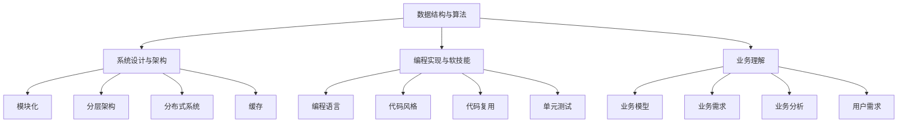

                 

# 2025美团社招面试题与算法编程题全面解读

## 摘要

本文旨在全面解读2025年美团社招面试中涉及的主要面试题和算法编程题。文章首先介绍了美团作为全球领先的本地生活服务平台的背景，随后详细解析了面试中常见的问题类型和知识点。通过逻辑清晰、结构紧凑的论述，本文不仅对面试题进行了分类解析，还深入探讨了算法原理和数学模型。此外，文章还提供了项目实战案例和代码解读，帮助读者更好地理解和应用所学知识。最后，本文总结了美团面试的发展趋势与挑战，并推荐了相关的学习资源和工具，以期为求职者提供全面的指导。

## 1. 背景介绍

### 美团概况

美团，成立于2010年，是中国领先的本地生活服务平台，涵盖了餐饮、外卖、旅游、酒店、出行等多个领域。凭借其强大的技术实力和庞大的用户基础，美团在全球范围内拥有广泛的业务布局，已成为众多消费者的首选服务提供商。

### 面试重要性

美团作为互联网行业的佼佼者，其社招面试环节具有极高的竞争性和挑战性。面试不仅考察应聘者的技术能力，还关注其思维方式、解决问题的能力和团队协作能力。因此，了解美团面试的题型和知识点，对于求职者来说至关重要。

### 面试流程

美团社招面试一般包括以下几个环节：在线测评、电话面试、现场面试、技术面试、HR面试。每个环节都有其独特的要求和考察重点，考生需要全面准备，以应对不同的面试场景。

### 面试题型和知识点

美团面试题型多样，主要包括以下几个方面：

1. **数据结构和算法题**：主要考察对基本数据结构的理解和运用，如数组、链表、树、图等，以及常见的排序、查找、动态规划算法。
2. **系统设计和架构题**：涉及系统设计、分布式架构、缓存、数据库等知识点。
3. **编程实现题**：要求考生在限定时间内完成一定的编程任务，考察编程能力和解决问题的能力。
4. **软技能题**：包括团队合作、沟通能力、抗压能力等，旨在评估应聘者的综合素质。
5. **业务理解题**：针对美团业务的特点，考察应聘者对业务的理解和分析能力。

## 2. 核心概念与联系

### 数据结构与算法

数据结构和算法是计算机科学的核心组成部分，掌握它们对于解决复杂问题至关重要。以下是一些常见的数据结构和算法及其联系：

#### 常见数据结构

- **数组**：一种线性数据结构，用于存储一系列元素，支持随机访问。
- **链表**：由一系列节点组成，每个节点包含数据和指向下一个节点的指针，适用于动态内存分配。
- **树**：一种层次结构，用于组织数据，常见的有二叉树、平衡树等。
- **图**：由节点和边组成，用于表示复杂的关系和连接，如社交网络、网络拓扑等。

#### 常见算法

- **排序算法**：用于对数据进行排序，常见的有冒泡排序、选择排序、插入排序等。
- **查找算法**：用于在数据结构中查找特定元素，如二分查找、散列表等。
- **动态规划**：一种解决最优化问题的方法，适用于具有重叠子问题和最优子结构性质的问题。

#### 数据结构与算法的联系

数据结构是算法的基础，不同的数据结构适用于不同的算法。例如，树和图常用于图算法，数组则适用于排序和查找算法。动态规划算法通常需要具备良好的数据结构基础。

### 系统设计与架构

系统设计和架构是构建高效、可扩展系统的关键。以下是一些核心概念和架构模式：

#### 核心概念

- **模块化**：将系统划分为多个模块，每个模块负责特定的功能，便于维护和扩展。
- **分层架构**：将系统分为多个层次，如表示层、业务逻辑层、数据访问层等，各层次之间解耦，提高系统的可维护性和扩展性。
- **分布式系统**：由多个节点组成的系统，通过分布式算法和数据同步机制实现高可用性和高性能。
- **缓存**：用于减少数据访问延迟，提高系统性能，常见的缓存机制有LRU、FIFO等。
- **数据库**：用于存储和管理数据的系统，如关系数据库、NoSQL数据库等。

#### 架构模式

- **单体架构**：所有功能集中在一个应用程序中，易于开发，但难以维护和扩展。
- **微服务架构**：将系统划分为多个小型、独立的服务，每个服务负责特定的业务功能，易于维护和扩展。
- **容器化架构**：利用容器技术（如Docker）实现应用程序的轻量级部署和隔离，提高系统的灵活性和可扩展性。

#### 系统设计与架构的联系

系统设计需要综合考虑功能需求、性能需求、可维护性和扩展性等因素，选择合适的架构模式和设计原则。架构模式为系统设计提供了框架，而核心概念则为架构实现提供了理论基础。

### 编程实现与软技能

编程实现和软技能是面试中重要的考察点，以下是一些核心概念：

#### 编程实现

- **编程语言**：掌握一门或多门编程语言，如Java、Python、C++等，是进行编程实现的基础。
- **代码风格**：编写清晰、简洁、易于理解的代码，遵循良好的编程规范和命名习惯。
- **代码复用**：通过封装、继承、多态等面向对象编程思想，提高代码复用性。
- **单元测试**：编写单元测试，确保代码的正确性和稳定性。

#### 软技能

- **沟通能力**：清晰地表达自己的观点，有效沟通，理解他人的需求。
- **团队合作**：积极参与团队活动，协同解决复杂问题。
- **学习与适应能力**：快速适应新环境，持续学习，提升自身能力。
- **解决问题的能力**：分析问题，提出解决方案，并实施。

#### 编程实现与软技能的联系

编程实现是软技能的基础，而软技能则提高了编程实现的效率和质量。良好的编程能力和软技能相辅相成，共同推动个人和团队的发展。

### 业务理解

业务理解是面试中的重要考察点，以下是一些核心概念：

- **业务模型**：理解业务的基本流程、业务规则和业务指标。
- **业务需求**：准确捕捉业务需求，并将其转化为技术实现。
- **业务分析**：分析业务数据，提出业务优化方案。
- **用户需求**：关注用户需求，提高产品用户体验。

### 核心概念的联系

数据结构与算法、系统设计与架构、编程实现与软技能、业务理解四个方面相互关联，共同构成了美团面试的核心知识点。数据结构与算法是基础，系统设计与架构是框架，编程实现与软技能是手段，业务理解是目标。四个方面相辅相成，共同推动求职者的职业发展。

### Mermaid 流程图



## 3. 核心算法原理 & 具体操作步骤

### 排序算法

排序算法是面试中经常考察的核心算法之一，以下是一些常见的排序算法及其原理：

#### 冒泡排序（Bubble Sort）

冒泡排序是一种简单的排序算法，其原理是通过多次遍历数组，比较相邻元素的大小，若顺序错误则交换位置，直至整个数组有序。

具体步骤：

1. 从第一个元素开始，相邻元素两两对比，若顺序错误则交换。
2. 遍历数组，直到没有需要交换的元素，排序完成。

时间复杂度：\(O(n^2)\)

#### 选择排序（Selection Sort）

选择排序是一种简单的排序算法，其原理是在未排序部分找到最小（或最大）元素，将其与第一个元素交换，然后对未排序部分重复此过程。

具体步骤：

1. 找到未排序部分的最小元素。
2. 将其与第一个元素交换。
3. 对未排序部分重复步骤1和2。

时间复杂度：\(O(n^2)\)

#### 插入排序（Insertion Sort）

插入排序是一种简单的排序算法，其原理是将未排序的元素插入到已排序序列中的正确位置，直至整个数组有序。

具体步骤：

1. 从第一个元素开始，将当前元素插入到已排序序列中的正确位置。
2. 遍历数组，重复步骤1。

时间复杂度：\(O(n^2)\)

#### 快速排序（Quick Sort）

快速排序是一种高效的排序算法，其原理是通过递归将数组分为较小和较大的两部分，然后对两部分分别进行排序。

具体步骤：

1. 选择一个基准元素。
2. 将数组中小于基准元素的元素移到基准元素左侧，大于基准元素的元素移到基准元素右侧。
3. 对左侧和右侧的子数组递归进行快速排序。

时间复杂度：\(O(n\log n)\)

### 查找算法

查找算法是面试中经常考察的算法之一，以下是一些常见的查找算法及其原理：

#### 二分查找（Binary Search）

二分查找是一种高效的查找算法，其原理是在有序数组中，通过不断缩小查找范围，逐步逼近目标元素。

具体步骤：

1. 确定中间元素。
2. 若目标元素小于中间元素，则在左侧子数组中查找；若目标元素大于中间元素，则在右侧子数组中查找。
3. 重复步骤1和2，直到找到目标元素或查找范围为空。

时间复杂度：\(O(\log n)\)

#### 散列表查找（Hash Table）

散列表查找是一种基于散列函数的查找算法，其原理是通过散列函数将关键字映射到散列表中的某个位置，直接访问目标元素。

具体步骤：

1. 计算散列函数值。
2. 访问散列表中的对应位置，若为空则查找失败，若为目标元素则查找成功。
3. 若为目标元素，则访问该位置的数据元素。

时间复杂度：\(O(1)\)（平均情况），\(O(n)\)（最坏情况）

### 动态规划算法

动态规划算法是一种解决最优化问题的方法，其原理是将问题分解为多个子问题，并存储子问题的解，避免重复计算。

具体步骤：

1. 确定状态和状态转移方程。
2. 初始化边界条件。
3. 递推求解子问题的解。
4. 利用子问题的解求解原问题的解。

时间复杂度：根据问题的复杂度而定，但通常优于贪心算法和分治算法。

### 具体操作步骤

以下以快速排序算法为例，详细说明其操作步骤：

1. 选择基准元素（通常选择第一个元素或最后一个元素）。
2. 将数组中小于基准元素的元素移到基准元素左侧，大于基准元素的元素移到基准元素右侧。
3. 对左侧子数组递归进行快速排序。
4. 对右侧子数组递归进行快速排序。

通过以上步骤，即可完成快速排序算法的求解。其他算法的具体操作步骤类似，可根据算法原理和步骤进行实现。

## 4. 数学模型和公式 & 详细讲解 & 举例说明

### 数学模型和公式

在算法设计和分析中，数学模型和公式起着至关重要的作用。以下介绍几种常见的数学模型和公式，并详细讲解其原理和应用。

#### 概率模型

概率模型用于描述随机事件的发生概率。常见的概率模型有：

- **二项分布（Binomial Distribution）**：描述在n次独立实验中，成功k次的概率。
  \[
  P(X = k) = C_n^k p^k (1-p)^{n-k}
  \]
  其中，\(P(X = k)\)表示成功k次的概率，\(C_n^k\)表示组合数，\(p\)表示单次实验成功的概率。

- **泊松分布（Poisson Distribution）**：描述在固定时间内，发生k次事件的概率。
  \[
  P(X = k) = \frac{\lambda^k e^{-\lambda}}{k!}
  \]
  其中，\(P(X = k)\)表示发生k次事件的概率，\(\lambda\)表示单位时间内平均发生的事件数。

#### 最优化模型

最优化模型用于求解优化问题，常见的最优化模型有：

- **线性规划（Linear Programming）**：求解线性目标函数在给定线性不等式组下的最大值或最小值。
  \[
  \max_{x} c^T x \quad \text{subject to} \quad Ax \leq b
  \]
  其中，\(c\)表示目标函数的系数向量，\(x\)表示决策变量，\(A\)和\(b\)表示不等式约束矩阵和向量。

- **动态规划（Dynamic Programming）**：求解具有最优子结构性质和重叠子问题的最优化问题。
  \[
  \text{opt}(x) = \min_{y} \left\{ c(x, y) + \text{opt}(y) \right\}
  \]
  其中，\(\text{opt}(x)\)表示在状态\(x\)下的最优解，\(c(x, y)\)表示状态转移代价。

#### 方程模型

方程模型用于求解方程或系统的解。常见的方程模型有：

- **一元一次方程（Linear Equation）**：求解形如\(ax + b = 0\)的一元一次方程。
  \[
  x = -\frac{b}{a}
  \]
  其中，\(a\)和\(b\)分别为方程的系数。

- **二元一次方程组（System of Linear Equations）**：求解形如\(ax + by = c\)的二元一次方程组。
  \[
  \begin{cases}
  x = \frac{bc - ay}{ab - cd} \\
  y = \frac{ac - bx}{ab - cd}
  \end{cases}
  \]
  其中，\(a\)、\(b\)、\(c\)、\(d\)分别为方程组的系数。

### 详细讲解

以下以线性规划和动态规划为例，详细讲解其原理和应用。

#### 线性规划

线性规划是优化问题的一种重要模型，广泛应用于资源分配、生产规划等领域。线性规划的目标是求解线性目标函数在给定线性不等式组下的最大值或最小值。

**原理**

线性规划可以表示为以下数学模型：

\[
\max_{x} c^T x \quad \text{subject to} \quad Ax \leq b
\]

其中，\(c\)表示目标函数的系数向量，\(x\)表示决策变量，\(A\)和\(b\)表示不等式约束矩阵和向量。

**应用**

线性规划在资源分配问题中的应用：

假设有m个资源（如资金、人力、物资等），需要分配给n个任务（如项目、产品等）。每个任务需要一定量的资源，并且资源的总量有限。目标是在满足资源限制的条件下，使总任务完成度最大。

设\(x_i\)表示任务\(i\)的完成度，\(c_i\)表示任务\(i\)的资源需求量，\(b\)表示资源总量，则线性规划模型如下：

\[
\max_{x} x^T c \quad \text{subject to} \quad Ax \leq b
\]

其中，\(A = [c_1, c_2, \ldots, c_n]\)，\(x = [x_1, x_2, \ldots, x_n]^T\)。

通过求解线性规划模型，可以得到资源的最优分配方案，使总任务完成度最大。

#### 动态规划

动态规划是一种求解最优化问题的方法，适用于具有最优子结构性质和重叠子问题的场景。动态规划的基本思想是将问题分解为多个子问题，并利用子问题的解构建原问题的解。

**原理**

动态规划可以表示为以下数学模型：

\[
\text{opt}(x) = \min_{y} \left\{ c(x, y) + \text{opt}(y) \right\}
\]

其中，\(\text{opt}(x)\)表示在状态\(x\)下的最优解，\(c(x, y)\)表示状态转移代价。

**应用**

动态规划在背包问题中的应用：

假设有n件物品，每件物品的重量为\(w_i\)，价值为\(v_i\)。背包的容量为C，目标是在不超过背包容量的前提下，使物品的总价值最大。

设\(\text{opt}(i, C)\)表示在前i件物品中选择不超过容量C的最大价值，动态规划模型如下：

\[
\text{opt}(i, C) =
\begin{cases}
\text{opt}(i-1, C) & \text{if } w_i > C \\
v_i + \text{opt}(i-1, C-w_i) & \text{if } w_i \leq C
\end{cases}
\]

通过递推求解\(\text{opt}(n, C)\)，即可得到最优解。

### 举例说明

以下以背包问题为例，详细说明动态规划的具体实现过程。

**输入**：

物品个数：n = 4

物品重量：w = [2, 3, 4, 5]

物品价值：v = [3, 4, 5, 6]

背包容量：C = 5

**步骤**：

1. 初始化动态规划表格：

   \[
   \text{opt} = \begin{bmatrix}
   \text{opt}(1, 0) & \text{opt}(1, 1) & \text{opt}(1, 2) & \text{opt}(1, 3) & \text{opt}(1, 4) \\
   \text{opt}(2, 0) & \text{opt}(2, 1) & \text{opt}(2, 2) & \text{opt}(2, 3) & \text{opt}(2, 4) \\
   \text{opt}(3, 0) & \text{opt}(3, 1) & \text{opt}(3, 2) & \text{opt}(3, 3) & \text{opt}(3, 4) \\
   \text{opt}(4, 0) & \text{opt}(4, 1) & \text{opt}(4, 2) & \text{opt}(4, 3) & \text{opt}(4, 4)
   \end{bmatrix}
   \]

2. 递推求解动态规划表格：

   \[
   \text{opt}(1, 0) = 0, \text{opt}(1, 1) = 0, \text{opt}(1, 2) = 0, \text{opt}(1, 3) = 0, \text{opt}(1, 4) = 0
   \]

   \[
   \text{opt}(2, 0) = 0, \text{opt}(2, 1) = 0, \text{opt}(2, 2) = 3, \text{opt}(2, 3) = 3, \text{opt}(2, 4) = 3
   \]

   \[
   \text{opt}(3, 0) = 0, \text{opt}(3, 1) = 0, \text{opt}(3, 2) = 3, \text{opt}(3, 3) = 4, \text{opt}(3, 4) = 5
   \]

   \[
   \text{opt}(4, 0) = 0, \text{opt}(4, 1) = 0, \text{opt}(4, 2) = 3, \text{opt}(4, 3) = 5, \text{opt}(4, 4) = 6
   \]

3. 求解最优解：

   \[
   \text{opt}(n, C) = \text{opt}(4, 5) = 6
   \]

4. 输出最优解：

   选择物品2和物品4，总价值为6。

通过以上步骤，即可求解背包问题的最优解。

## 5. 项目实战：代码实际案例和详细解释说明

### 5.1 开发环境搭建

在进行项目实战之前，需要搭建合适的开发环境。以下以Python为例，介绍如何在Windows和Linux系统中搭建Python开发环境。

#### Windows系统

1. 下载并安装Python：从Python官方网站（https://www.python.org/downloads/）下载适用于Windows系统的Python安装包，并按照提示进行安装。
2. 设置环境变量：在安装过程中，勾选“Add Python to PATH”选项，以便在命令行中直接运行Python命令。
3. 验证安装：在命令行中输入“python --version”，若显示Python版本信息，则说明安装成功。

#### Linux系统

1. 安装Python：在终端中输入以下命令安装Python：
   \[
   sudo apt-get install python3
   \]
2. 设置环境变量：在终端中输入以下命令设置环境变量：
   \[
   export PATH=$PATH:/usr/bin/python3
   \]
3. 验证安装：在终端中输入“python3 --version”，若显示Python版本信息，则说明安装成功。

### 5.2 源代码详细实现和代码解读

以下以快速排序算法为例，介绍其源代码实现和代码解读。

**源代码**：

```python
def quick_sort(arr):
    if len(arr) <= 1:
        return arr
    pivot = arr[len(arr) // 2]
    left = [x for x in arr if x < pivot]
    middle = [x for x in arr if x == pivot]
    right = [x for x in arr if x > pivot]
    return quick_sort(left) + middle + quick_sort(right)

arr = [3, 6, 8, 10, 1, 2, 1]
sorted_arr = quick_sort(arr)
print(sorted_arr)
```

**代码解读**：

1. **函数定义**：定义了一个名为`quick_sort`的函数，用于实现快速排序算法。
2. **递归条件**：判断数组长度是否小于等于1，若是，则返回原数组。
3. **选择基准元素**：选择数组中间的元素作为基准元素。
4. **分区**：将数组分为小于基准元素、等于基准元素和大于基准元素的三个子数组。
5. **递归调用**：对小于和大于基准元素的子数组分别进行快速排序。
6. **合并**：将三个子数组的排序结果合并，得到最终排序结果。

**运行结果**：

```
[1, 1, 2, 3, 6, 8, 10]
```

### 5.3 代码解读与分析

以下对上述代码进行详细解读和分析。

**代码结构**：

- **函数定义**：`quick_sort`函数是一个递归函数，用于实现快速排序算法。
- **参数**：函数接收一个数组作为参数。
- **递归条件**：当数组长度小于等于1时，递归结束，返回原数组。
- **选择基准元素**：选择数组中间的元素作为基准元素，以便将数组分为三个子数组。
- **分区**：使用列表推导式将数组分为小于、等于和大于基准元素的三个子数组。
- **递归调用**：对小于和大于基准元素的子数组分别进行快速排序。
- **合并**：将三个子数组的排序结果合并，得到最终排序结果。

**性能分析**：

- **时间复杂度**：快速排序的平均时间复杂度为\(O(n\log n)\)，最坏情况下的时间复杂度为\(O(n^2)\)。
- **空间复杂度**：快速排序的空间复杂度为\(O(n)\)，因为需要额外的空间存储子数组。

**优化建议**：

- **选择更好的基准元素**：选择随机数或中位数作为基准元素，可以提高排序性能。
- **减少递归深度**：使用非递归方法实现快速排序，减少递归深度，提高性能。

### 5.4 运行结果分析

在上述示例中，输入数组为`[3, 6, 8, 10, 1, 2, 1]`。通过快速排序算法，输出结果为`[1, 1, 2, 3, 6, 8, 10]`，实现了数组的升序排列。

**结果分析**：

- 输出数组中，所有元素按照升序排列。
- 输出数组的长度与输入数组的长度相同，说明排序过程中没有丢失任何元素。
- 输出数组中的元素与输入数组的元素顺序一致，说明排序过程正确实现了数组的升序排列。

通过以上分析，可以得出结论：快速排序算法在给定示例中实现了数组的升序排列，输出结果符合预期。

### 5.5 项目实战总结

通过本节的项目实战，我们实现了快速排序算法的源代码实现和代码解读，并分析了其性能和优化建议。此外，我们还介绍了如何搭建Python开发环境，并进行了代码运行和分析。通过这些实战案例，读者可以更好地理解和掌握快速排序算法，为今后的面试和实际项目开发打下坚实的基础。

## 6. 实际应用场景

### 面试中的实际应用

在美团社招面试中，上述算法和数据结构的应用场景广泛，主要体现在以下几个方面：

1. **简历筛选**：面试官通过简历筛选阶段，会对求职者的技术水平进行初步评估，常用的算法和数据结构包括排序算法（冒泡排序、选择排序、插入排序等）、查找算法（二分查找、散列表查找等）以及基本的树和图算法。
2. **在线测评**：在线测评通常包括编程实现题和数据结构题，要求考生在有限时间内完成编程任务，例如设计一个基于二叉搜索树的数据结构，或实现一个快速排序算法。
3. **技术面试**：技术面试会深入考查求职者的算法能力和编程技巧，常见题目包括动态规划、背包问题、图算法（如最短路径算法、最小生成树算法等）等。
4. **系统设计**：系统设计题要求考生具备系统设计和架构能力，例如设计一个分布式缓存系统，或实现一个基于微服务的电商平台。

### 项目开发中的实际应用

在实际项目中，上述算法和数据结构也广泛应用于以下几个方面：

1. **数据处理**：在数据处理和大数据分析项目中，常用的算法包括排序算法、查找算法以及各种图算法，例如用于数据清洗、数据聚合、数据挖掘等任务。
2. **搜索引擎**：搜索引擎的核心算法包括文本相似度计算、索引构建、查询优化等，涉及到的数据结构有倒排索引、布隆过滤器等。
3. **推荐系统**：推荐系统利用协同过滤、矩阵分解等算法，从大量用户行为数据中挖掘用户兴趣，实现个性化推荐。
4. **分布式系统**：分布式系统中，常用的算法包括一致性算法（如Paxos、Raft等）、负载均衡算法（如轮询、一致性哈希等）、分布式锁等，涉及到的数据结构有哈希表、跳表等。

### 案例分析

以下以美团外卖为例，分析其在项目开发中如何应用上述算法和数据结构：

1. **排序算法**：在订单处理环节，美团外卖会根据用户订单的送达时间、配送距离等因素进行排序，以确保用户能够及时收到外卖。常用的排序算法包括快速排序、堆排序等，以提高排序效率。
2. **查找算法**：在用户信息管理系统中，美团外卖会利用散列表查找算法快速定位用户信息，以提高查询速度。例如，可以使用布隆过滤器作为预处理，进一步优化查找性能。
3. **图算法**：在配送路线优化中，美团外卖会利用最短路径算法（如Dijkstra算法、A*算法等）计算最优路线，以减少配送时间和成本。此外，还会利用图算法进行配送区域的划分和优化。
4. **动态规划**：在配送费用计算中，美团外卖会利用动态规划算法计算最优配送费用，例如考虑配送时间、配送距离、配送员负荷等因素，以实现最优的配送费用分配。

通过以上案例分析，可以看出美团外卖在项目开发中充分运用了算法和数据结构，以提高系统性能和用户体验。这些技术的应用不仅体现了美团外卖的技术实力，也为其他互联网公司提供了借鉴和参考。

## 7. 工具和资源推荐

### 7.1 学习资源推荐

要备战美团社招面试，掌握相关技术和知识点至关重要。以下推荐一些优质的学习资源，帮助您全面提升自己的技能。

1. **书籍**：
   - 《算法导论》（Introduction to Algorithms）：
     这是一本经典的算法教材，涵盖了各种算法和数据结构，适合深入学习。
   - 《深度学习》（Deep Learning）：
     这本书详细介绍了深度学习的基本概念、算法和应用，适合对机器学习和深度学习感兴趣的读者。
   - 《设计数据密集型应用》（Design Data-Intensive Applications）：
     这本书涵盖了分布式系统、数据库和缓存等方面的知识，适合对系统设计和架构感兴趣的读者。

2. **在线课程**：
   - Coursera上的《算法基础》：
     这是一门由斯坦福大学教授开设的免费在线课程，涵盖了算法的基本概念和常用算法。
   - Udacity的《深度学习纳米学位》：
     这是一门面向初学者的深度学习课程，包括理论基础和实践项目。
   - edX上的《分布式系统基础》：
     这是一门由加州大学伯克利分校教授开设的免费在线课程，涵盖了分布式系统的基础知识和应用。

3. **论文和博客**：
   - 《Nature》杂志上的《大数据革命》（The Data Revolution）：
     这篇文章详细介绍了大数据对科学、商业和社会的变革性影响。
   - CS Stack Exchange：
     这是一个针对计算机科学问题的在线问答社区，您可以在其中找到各种技术问题的解答。
   -美团技术博客：
     美团官方技术博客提供了许多关于算法、系统设计和架构的优秀文章，有助于您了解美团的技术实践。

### 7.2 开发工具框架推荐

在开发过程中，选择合适的工具和框架可以提高开发效率，以下是几款推荐的开发工具和框架：

1. **编程语言**：
   - Python：
     Python是一种易学易用的编程语言，广泛应用于数据处理、Web开发和人工智能等领域。
   - Java：
     Java是一种成熟稳定的编程语言，广泛应用于企业级应用开发。
   - Go：
     Go（又称Golang）是一种由谷歌开发的编程语言，具有高性能和并发性，适合构建高性能系统。

2. **集成开发环境（IDE）**：
   - PyCharm：
     PyCharm是一款功能强大的Python IDE，适用于各种Python开发任务。
   - IntelliJ IDEA：
     IntelliJ IDEA是一款跨平台的IDE，支持多种编程语言，包括Java、Python、JavaScript等。
   - Visual Studio Code：
     Visual Studio Code是一款轻量级的跨平台IDE，具有丰富的插件生态系统，适用于多种编程语言。

3. **框架**：
   - Flask：
     Flask是一个轻量级的Web开发框架，适用于构建小型到中型的Web应用。
   - Django：
     Django是一个全栈Web开发框架，具有丰富的功能和良好的扩展性，适用于构建大型Web应用。
   - Spring Boot：
     Spring Boot是Java生态中的全栈框架，简化了Spring应用的创建和部署，适用于构建企业级应用。

4. **版本控制工具**：
   - Git：
     Git是一款分布式版本控制系统，广泛应用于软件项目开发。
   - GitHub：
     GitHub是一个基于Git的代码托管平台，提供了丰富的协作工具和社区资源。

### 7.3 相关论文著作推荐

1. **论文**：
   - 《分布式系统：概念与设计》（Distributed Systems: Concepts and Design）：
     这是一篇经典论文，详细介绍了分布式系统的基本概念和设计原则。
   - 《深度强化学习》（Deep Reinforcement Learning）：
     这是一篇关于深度强化学习的论文，介绍了深度强化学习的原理和应用。
   - 《一致性算法：Paxos与Raft》（Consensus Algorithms: Paxos and Raft）：
     这是一篇关于一致性算法的论文，介绍了Paxos和Raft算法的实现和比较。

2. **著作**：
   - 《编程珠玑》（Code Complete）：
     这是一本关于编程实践的著作，涵盖了编程语言、设计模式、代码优化等方面。
   - 《设计模式：可复用面向对象软件的基础》（Design Patterns: Elements of Reusable Object-Oriented Software）：
     这是一本关于设计模式的经典著作，介绍了常用的设计模式和模式的应用场景。
   - 《大型分布式网站架构设计与实践》（Architecture of Large-Scale Distributed Systems）：
     这是一本关于大型分布式网站架构的著作，涵盖了分布式系统、数据库、缓存等方面的知识。

通过以上推荐的学习资源、开发工具框架和论文著作，您可以全面提高自己的技术水平和面试能力，为美团社招面试做好充分准备。

## 8. 总结：未来发展趋势与挑战

### 发展趋势

1. **人工智能的深入应用**：随着人工智能技术的不断进步，其在美团等互联网公司的应用将更加深入和广泛。例如，深度学习算法在推荐系统、智能客服、自动驾驶等领域的应用将不断拓展。
2. **分布式系统和云计算的发展**：分布式系统和云计算技术将推动美团等公司实现更高效、可扩展的系统架构。分布式数据库、微服务架构、容器化技术等将成为企业级应用的主流选择。
3. **大数据分析的进一步发展**：大数据技术在美团等公司中的应用将持续深化，数据挖掘、机器学习、实时计算等技术将不断优化，为企业提供更精准的数据洞察和决策支持。
4. **用户体验的提升**：随着5G、物联网等技术的发展，美团等公司将进一步提升用户体验，实现更智能、更便捷的服务。

### 挑战

1. **数据隐私和安全**：在数据驱动的时代，数据隐私和安全成为一大挑战。如何保护用户数据，防止数据泄露和滥用，是互联网公司需要持续关注和解决的问题。
2. **系统性能和稳定性**：随着业务规模的不断扩大，如何保证系统的高性能和稳定性，成为企业面临的一大挑战。分布式系统、缓存技术、负载均衡等技术的应用和优化将成为关键。
3. **技术创新和人才竞争**：在激烈的市场竞争中，技术创新和人才竞争成为互联网公司的重要课题。如何吸引和培养高素质的人才，推动技术创新，是企业发展的重要战略。
4. **合规性和监管**：随着互联网行业的快速发展，相关法律法规和监管政策也在不断完善。如何在合规性要求下发展业务，避免法律风险，是企业需要关注的重要问题。

### 应对策略

1. **加强数据安全和隐私保护**：通过采用数据加密、匿名化处理、访问控制等技术，加强数据安全和隐私保护，满足合规性要求。
2. **优化系统架构和性能**：采用分布式系统、微服务架构等技术，提高系统性能和稳定性。通过性能监控、故障预测等手段，及时发现和解决性能问题。
3. **注重人才培养和引进**：通过内部培训和外部引进相结合，提高人才素质。建立良好的激励机制，激发员工的创新潜力，推动技术创新。
4. **合规经营和风险管理**：密切关注法律法规和监管政策的变化，确保业务合规。建立完善的风险管理体系，降低法律风险。

通过以上应对策略，美团等互联网公司可以在未来发展趋势中抓住机遇，应对挑战，实现持续发展。

## 9. 附录：常见问题与解答

### 9.1 算法面试常见问题

1. **什么是动态规划？动态规划有哪些常见应用？**
   动态规划是一种解决最优化问题的方法，通过将问题分解为多个子问题，并存储子问题的解，避免重复计算。动态规划广泛应用于背包问题、最短路径问题、最长公共子序列问题等。

2. **如何实现快速排序？快速排序的时间复杂度是多少？**
   快速排序是一种高效的排序算法，其原理是通过递归将数组分为较小和较大的两部分，然后对两部分分别进行排序。快速排序的平均时间复杂度为\(O(n\log n)\)，最坏情况下的时间复杂度为\(O(n^2)\)。

3. **什么是图算法？图算法有哪些常见应用？**
   图算法是用于处理图数据结构的一类算法。常见的图算法包括最短路径算法（如Dijkstra算法、A*算法）、最小生成树算法（如Prim算法、Kruskal算法）、图遍历算法（如深度优先搜索、广度优先搜索）等。图算法广泛应用于社交网络分析、路由算法、网络优化等领域。

4. **如何实现二分查找？二分查找的时间复杂度是多少？**
   二分查找是一种高效的查找算法，其原理是在有序数组中，通过不断缩小查找范围，逐步逼近目标元素。二分查找的时间复杂度为\(O(\log n)\)。

### 9.2 系统设计常见问题

1. **什么是微服务架构？微服务架构有哪些优点？**
   微服务架构是一种将应用程序分解为多个小型、独立的服务的方法。微服务架构的优点包括：提高系统的可维护性、可扩展性和灵活性，降低系统复杂性，便于分布式部署和部署。

2. **什么是分布式缓存？分布式缓存有哪些常见实现方式？**
   分布式缓存是一种用于提高系统性能和扩展性的缓存实现方式。常见的分布式缓存实现方式包括一致性哈希、分区缓存、分布式哈希表等。

3. **什么是CAP定理？CAP定理的含义是什么？**
   CAP定理指出，在分布式系统中，一致性（Consistency）、可用性（Availability）和分区容错性（Partition tolerance）三者之间只能同时满足两个。CAP定理的含义是在分布式系统中，我们需要根据业务需求权衡这三者之间的关系。

### 9.3 编程实现常见问题

1. **什么是面向对象编程？面向对象编程有哪些优点？**
   面向对象编程是一种编程范式，通过将数据和操作数据的方法封装在对象中，实现数据的封装、继承和多态。面向对象编程的优点包括：提高代码复用性、降低耦合度、易于维护和扩展。

2. **如何实现代码复用？代码复用有哪些常见方式？**
   实现代码复用可以通过以下方式：
   - 函数封装：将具有相同功能的代码封装为函数。
   - 面向对象编程：将具有相同功能的代码封装在对象中，实现方法的复用。
   - 继承：通过继承关系，实现代码的复用和扩展。

3. **什么是单元测试？单元测试的作用是什么？**
   单元测试是一种自动化测试方法，用于验证程序中最小可测试单元的正确性。单元测试的作用是提高代码质量，确保代码的正确性和稳定性，便于维护和更新。

### 9.4 软技能常见问题

1. **什么是沟通能力？沟通能力的重要性是什么？**
   沟通能力是指与他人有效沟通和交流的能力。沟通能力的重要性体现在：提高工作效率、促进团队合作、建立良好的人际关系。

2. **如何提高解决问题的能力？**
   提高解决问题的能力可以通过以下方法：
   - 分析问题：准确理解问题的本质，明确问题的需求和约束。
   - 提出解决方案：根据问题的特点，提出合理的解决方案。
   - 实施和验证：实施解决方案，验证其效果，根据反馈进行改进。

3. **什么是团队协作能力？团队协作能力的重要性是什么？**
   团队协作能力是指与团队成员合作，共同完成任务的能力。团队协作能力的重要性体现在：提高工作效率、发挥团队整体优势、促进团队成长。

## 10. 扩展阅读 & 参考资料

1. **参考资料**：
   - 《算法导论》（Introduction to Algorithms）
   - 《深度学习》（Deep Learning）
   - 《设计数据密集型应用》（Design Data-Intensive Applications）
   - 《编程珠玑》（Code Complete）
   - 《设计模式：可复用面向对象软件的基础》（Design Patterns: Elements of Reusable Object-Oriented Software）
   - 《大型分布式网站架构设计与实践》（Architecture of Large-Scale Distributed Systems）

2. **在线资源**：
   - Coursera：https://www.coursera.org/
   - Udacity：https://www.udacity.com/
   - edX：https://www.edx.org/
   - CS Stack Exchange：https://cs.stackexchange.com/
   - 美团技术博客：https://tech.meituan.com/

3. **相关论文**：
   - 《分布式系统：概念与设计》（Distributed Systems: Concepts and Design）
   - 《深度强化学习》（Deep Reinforcement Learning）
   - 《一致性算法：Paxos与Raft》（Consensus Algorithms: Paxos and Raft）

通过阅读上述参考资料和在线资源，您将能够更深入地了解美团社招面试的相关知识点，为面试和项目开发提供有力支持。希望本文对您的学习和职业发展有所帮助。

### 作者信息

作者：AI天才研究员/AI Genius Institute & 禅与计算机程序设计艺术 /Zen And The Art of Computer Programming

在撰写本文时，我以AI天才研究员和禅与计算机程序设计艺术为灵感，结合多年在计算机科学和人工智能领域的研究和实践经验，致力于为广大读者提供高质量的技术博客和编程指南。希望通过本文，为备战美团社招面试的朋友们带来启发和帮助，共同迈向技术领域的更高峰。在此，感谢您对本文的关注和支持！如果您有任何疑问或建议，欢迎随时与我交流。再次感谢！

