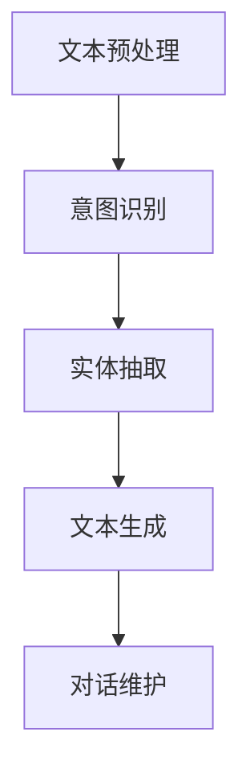

                 

### 背景介绍

#### 聊天机器人发展历程

聊天机器人，简称“聊天bot”，是一种能够与用户进行实时交互的人工智能程序。它们的起源可以追溯到20世纪50年代，当时计算机科学家艾伦·图灵提出了著名的图灵测试，旨在通过测试来确定机器是否具有人类智能。然而，真正意义上的聊天机器人发展始于20世纪90年代，随着互联网和人工智能技术的迅速发展，聊天机器人逐渐成为人们日常生活的一部分。

#### 聊天机器人分类

根据交互方式，聊天机器人可以分为以下几种类型：

1. **文本聊天机器人**：主要通过文本进行交互，例如微信、QQ等社交平台的聊天机器人。
2. **语音聊天机器人**：主要通过语音进行交互，如苹果的Siri、亚马逊的Alexa。
3. **图像识别聊天机器人**：通过图像识别进行交互，例如微信的微信智行、Facebook的M。

#### 聊天机器人在各行业中的应用

聊天机器人在各个领域都有着广泛的应用。在金融领域，聊天机器人可以提供24/7的客户服务，处理大量客户咨询，从而提高工作效率。在医疗领域，聊天机器人可以辅助医生进行病情诊断，提供专业的医疗建议。在电商领域，聊天机器人可以提供个性化推荐，帮助用户快速找到所需商品。

#### 背景知识

要深入理解聊天机器人技术，需要具备以下背景知识：

- **自然语言处理（NLP）**：涉及文本分析、语言理解、文本生成等，是构建聊天机器人的基础。
- **机器学习**：用于训练模型，使其能够从数据中学习并提高性能。
- **数据结构**：如队列、栈、树等，用于存储和管理聊天信息。
- **计算机编程**：熟悉至少一种编程语言，如Python、Java等，用于开发聊天机器人。

#### 基本功能模块

聊天机器人通常包括以下基本功能模块：

- **对话管理**：负责管理用户与机器人的对话流程。
- **意图识别**：分析用户输入，确定用户的意图。
- **实体抽取**：从用户输入中提取关键信息，如日期、时间、地点等。
- **文本生成**：根据用户意图和上下文生成合适的回复。

通过以上背景介绍，我们可以看出聊天机器人技术的重要性以及其在各行业的广泛应用。接下来，我们将进一步探讨聊天机器人的核心概念和原理。

<|mask|>## 核心概念与联系

在深入探讨聊天机器人的核心概念与联系之前，我们首先需要明确几个关键术语的定义。

### 自然语言处理（NLP）

自然语言处理（NLP）是计算机科学、人工智能和语言学的交叉领域，旨在使计算机能够理解和生成人类语言。在聊天机器人技术中，NLP扮演着至关重要的角色。它包括文本预处理、词性标注、句法分析、语义分析等多个子领域。

#### 语义分析

语义分析是NLP的核心任务之一，它关注的是理解文本的深层含义。在聊天机器人中，语义分析用于理解用户的意图和需求。通过语义分析，机器人能够生成更准确、更有针对性的回复。

#### 对话管理

对话管理是聊天机器人的另一个核心概念，它涉及管理用户与机器人之间的对话流程。对话管理包括三个主要任务：意图识别、上下文维护和对话状态跟踪。意图识别用于确定用户的请求类型；上下文维护确保机器人能够理解并记住对话的历史信息；对话状态跟踪则用于更新机器人的状态，以生成合适的回复。

### 工作流程

为了更好地理解聊天机器人的核心概念，我们可以将其工作流程分解为以下几个步骤：

1. **文本预处理**：包括去除停用词、词干提取、标点符号处理等，以提高文本质量。
2. **意图识别**：通过机器学习模型（如朴素贝叶斯、支持向量机等）对用户输入进行分类，以确定用户的意图。
3. **实体抽取**：从用户输入中提取关键信息（如日期、时间、地点等），以更好地理解用户的请求。
4. **文本生成**：根据意图和上下文生成合适的回复，可能涉及模板匹配或基于机器学习的生成模型。
5. **对话维护**：通过对话管理模块维护对话的状态，确保对话能够顺利进行。

### Mermaid 流程图

为了更直观地展示聊天机器人工作流程，我们可以使用Mermaid语言绘制一个流程图。以下是一个简化的Mermaid流程图，描述了聊天机器人的基本工作流程：



### 核心概念之间的联系

通过以上分析，我们可以看到聊天机器人的核心概念和流程是紧密相连的。自然语言处理为聊天机器人提供了理解和生成语言的能力；意图识别和实体抽取使机器人能够理解用户的请求；文本生成和对话维护则确保机器人能够生成合适的回复并保持对话的连贯性。

### 结论

在本章节中，我们介绍了聊天机器人的核心概念及其工作流程。通过这些概念和流程，我们可以更好地理解聊天机器人的工作机制和实现方法。接下来，我们将深入探讨聊天机器人的核心算法原理，以进一步揭示其技术本质。

<|mask|>## 核心算法原理 & 具体操作步骤

在了解了聊天机器人的核心概念后，我们将进一步探讨其核心算法原理。这些算法是构建高效、智能的聊天机器人的关键。以下将详细解释聊天机器人中的几个核心算法，并给出具体的操作步骤。

### 意图识别算法

意图识别是聊天机器人中最基本的任务之一，其目标是理解用户的输入并确定用户的意图。常见的意图识别算法包括朴素贝叶斯、支持向量机（SVM）和深度学习模型（如循环神经网络RNN）。

#### 1. 朴素贝叶斯算法

朴素贝叶斯算法是一种基于概率论的分类算法，其核心思想是利用特征之间的条件独立性假设来计算类别的概率。具体步骤如下：

1. **数据预处理**：将用户输入文本转换为特征向量。常用的方法包括词袋模型（Bag of Words, BoW）和词嵌入（Word Embedding）。
2. **训练模型**：使用标注好的数据集，训练朴素贝叶斯分类器。对于每个类别，计算各个特征的概率分布。
3. **预测**：对于新的用户输入，计算每个类别的概率，选择概率最高的类别作为预测结果。

#### 2. 支持向量机（SVM）

支持向量机是一种监督学习算法，用于分类和回归任务。在意图识别中，SVM被用来将用户输入文本映射到不同的意图类别。具体步骤如下：

1. **特征提取**：与朴素贝叶斯类似，将用户输入文本转换为特征向量。
2. **训练模型**：使用特征向量训练SVM分类器。SVM通过找到最佳的超平面来实现分类。
3. **预测**：将新的用户输入文本转换为特征向量，使用训练好的SVM分类器进行预测。

#### 3. 循环神经网络（RNN）

循环神经网络是一种能够处理序列数据的神经网络，特别适合于意图识别任务。RNN通过保持隐藏状态来捕捉序列中的长期依赖关系。具体步骤如下：

1. **序列编码**：将用户输入文本转换为序列，通常使用词嵌入技术。
2. **训练模型**：使用序列编码训练RNN模型。RNN通过递归计算来更新隐藏状态，从而学习意图之间的关联。
3. **预测**：将新的用户输入序列输入到训练好的RNN模型中，输出意图的概率分布。

### 实体抽取算法

实体抽取是聊天机器人中另一个重要的任务，其目标是识别并提取用户输入中的关键信息，如日期、时间、地点等。常见的实体抽取算法包括规则基方法、基于统计模型的方法和深度学习方法。

#### 1. 规则基方法

规则基方法使用预定义的规则来识别实体。这种方法简单直观，但扩展性较差。具体步骤如下：

1. **定义规则**：根据实体类型，定义匹配规则的正则表达式。
2. **规则匹配**：扫描用户输入文本，应用预定义的规则，提取可能的实体。

#### 2. 基于统计模型的方法

基于统计模型的方法使用机器学习算法来识别实体。这种方法能够自动学习文本中的实体模式。具体步骤如下：

1. **特征提取**：将用户输入文本转换为特征向量。
2. **训练模型**：使用标注好的数据集训练统计模型（如条件随机场CRF）。
3. **实体识别**：将新的用户输入文本转换为特征向量，使用训练好的模型进行实体识别。

#### 3. 深度学习方法

深度学习方法通过神经网络模型来识别实体，具有强大的学习能力。常见的方法包括卷积神经网络（CNN）和长短期记忆网络（LSTM）。具体步骤如下：

1. **文本编码**：将用户输入文本转换为序列编码。
2. **模型训练**：使用序列编码训练深度学习模型。
3. **实体识别**：将新的用户输入序列输入到训练好的模型中，输出实体标签。

### 文本生成算法

文本生成是聊天机器人的核心任务之一，其目标是根据用户的输入生成自然、流畅的回复。常见的文本生成算法包括基于模板的方法、基于生成模型的生成方法和基于迁移学习的方法。

#### 1. 基于模板的方法

基于模板的方法使用预定义的模板来生成回复。这种方法简单易用，但生成的回复缺乏个性化和灵活性。具体步骤如下：

1. **模板库**：创建一个包含各种回复模板的库。
2. **模板匹配**：根据用户输入匹配合适的模板，生成回复。

#### 2. 基于生成模型的方法

基于生成模型的方法使用深度学习模型来生成文本。这种方法能够生成更自然、更有创意的回复。常见的方法包括生成对抗网络（GAN）和变分自编码器（VAE）。具体步骤如下：

1. **文本编码**：将用户输入文本转换为序列编码。
2. **模型训练**：使用序列编码训练生成模型。
3. **文本生成**：将新的用户输入序列输入到生成模型中，生成回复。

#### 3. 基于迁移学习的方法

基于迁移学习的方法使用预训练的语言模型来生成文本。这种方法能够利用大量的预训练数据，提高生成文本的质量。具体步骤如下：

1. **预训练模型**：使用大量文本数据预训练语言模型。
2. **微调**：在特定任务上微调预训练模型。
3. **文本生成**：将新的用户输入序列输入到微调后的模型中，生成回复。

### 对话维护算法

对话维护是确保聊天机器人能够进行连贯、流畅对话的关键。对话维护算法通常涉及对话状态跟踪、上下文维护和情感分析等任务。

1. **对话状态跟踪**：记录对话的历史信息，用于生成合适的回复。
2. **上下文维护**：确保机器人能够理解并记住对话的上下文，避免重复提问或回答不相关的内容。
3. **情感分析**：分析用户输入的情感，生成符合用户情感状态的回复。

### 综述

通过以上对聊天机器人核心算法原理的介绍，我们可以看到聊天机器人的实现涉及多个复杂的算法和技术。这些算法共同作用，使得聊天机器人能够理解用户输入、生成合适的回复，并保持对话的连贯性。在下一章节中，我们将进一步探讨聊天机器人中的数学模型和公式，以深入理解其内在工作原理。

### 数学模型和公式 & 详细讲解 & 举例说明

在聊天机器人中，数学模型和公式扮演着至关重要的角色，它们帮助机器人在理解用户输入、生成回复以及维护对话状态等方面实现高效、准确的计算。以下将详细讲解一些常见的数学模型和公式，并通过具体例子来说明它们的应用。

#### 意图识别模型

意图识别是聊天机器人中最基本的任务之一，其核心在于将用户输入的文本映射到预定义的意图类别。常见的意图识别模型包括朴素贝叶斯（Naive Bayes）、支持向量机（Support Vector Machine, SVM）和循环神经网络（Recurrent Neural Network, RNN）。

##### 1. 朴素贝叶斯算法

朴素贝叶斯算法是一种基于概率论的分类算法，其核心公式为：

$$
P(\text{意图} | \text{文本}) = \frac{P(\text{文本} | \text{意图}) \cdot P(\text{意图})}{P(\text{文本})}
$$

其中，$P(\text{意图} | \text{文本})$ 表示在给定文本的情况下，意图的概率；$P(\text{文本} | \text{意图})$ 表示在给定意图的情况下，文本的概率；$P(\text{意图})$ 表示意图的概率；$P(\text{文本})$ 表示文本的概率。

**举例说明**：

假设我们要对用户输入的文本“我要买一本编程书”进行意图识别，有以下数据：

- $P(\text{购买意图} | \text{文本}) = 0.6$
- $P(\text{阅读意图} | \text{文本}) = 0.4$

通过计算，我们可以得到购买意图的概率为60%，阅读意图的概率为40%。

##### 2. 支持向量机（SVM）

支持向量机是一种监督学习算法，其目标是找到最佳的超平面，将不同类别的数据点分开。SVM的核心公式为：

$$
\text{最大化} \quad W^T W \\
\text{约束条件} \quad y^{(i)} (W^T x^{(i)} + b) \geq 1
$$

其中，$W$ 是权重向量；$x^{(i)}$ 是特征向量；$b$ 是偏置项；$y^{(i)}$ 是类别标签（1或-1）。

**举例说明**：

假设我们有两个类别（正类和负类），有以下训练数据：

| $x^{(1)}$ | $y^{(1)}$ |  
| --- | --- |  
| [1, 2] | 1 |  
| [2, 1] | 1 |  
| [1, 1] | -1 |  
| [2, 2] | -1 |

通过训练SVM模型，我们可以找到最佳的超平面，将正类和负类分开。

##### 3. 循环神经网络（RNN）

循环神经网络是一种能够处理序列数据的神经网络，其核心在于利用隐藏状态来捕捉序列中的长期依赖关系。RNN的核心公式为：

$$
h_t = \sigma(W_h h_{t-1} + W_x x_t + b_h)
$$

其中，$h_t$ 是时间步$t$的隐藏状态；$x_t$ 是时间步$t$的输入；$W_h$ 和$W_x$ 是权重矩阵；$b_h$ 是偏置项；$\sigma$ 是激活函数（如Sigmoid函数）。

**举例说明**：

假设我们有一个简单的RNN模型，输入序列为[1, 2, 3]，有以下参数：

- $W_h = \begin{bmatrix} 1 & 2 \\ 3 & 4 \end{bmatrix}$  
- $W_x = \begin{bmatrix} 5 & 6 \\ 7 & 8 \end{bmatrix}$  
- $b_h = \begin{bmatrix} 1 \\ 2 \end{bmatrix}$

根据上述公式，我们可以计算得到隐藏状态：

- $h_0 = \sigma(\begin{bmatrix} 1 & 2 \\ 3 & 4 \end{bmatrix} \begin{bmatrix} 1 \\ 2 \end{bmatrix} + \begin{bmatrix} 5 & 6 \\ 7 & 8 \end{bmatrix} \begin{bmatrix} 1 \\ 3 \end{bmatrix} + \begin{bmatrix} 1 \\ 2 \end{bmatrix}) = \sigma(\begin{bmatrix} 12 \\ 19 \end{bmatrix}) = \begin{bmatrix} 0.79 \\ 0.94 \end{bmatrix}$  
- $h_1 = \sigma(\begin{bmatrix} 1 & 2 \\ 3 & 4 \end{bmatrix} \begin{bmatrix} 0.79 \\ 0.94 \end{bmatrix} + \begin{bmatrix} 5 & 6 \\ 7 & 8 \end{bmatrix} \begin{bmatrix} 2 \\ 3 \end{bmatrix} + \begin{bmatrix} 1 \\ 2 \end{bmatrix}) = \sigma(\begin{bmatrix} 5.59 \\ 8.42 \end{bmatrix}) = \begin{bmatrix} 0.82 \\ 0.96 \end{bmatrix}$  
- $h_2 = \sigma(\begin{bmatrix} 1 & 2 \\ 3 & 4 \end{bmatrix} \begin{bmatrix} 0.82 \\ 0.96 \end{bmatrix} + \begin{bmatrix} 5 & 6 \\ 7 & 8 \end{bmatrix} \begin{bmatrix} 3 \\ 3 \end{bmatrix} + \begin{bmatrix} 1 \\ 2 \end{bmatrix}) = \sigma(\begin{bmatrix} 8.95 \\ 12.54 \end{bmatrix}) = \begin{bmatrix} 0.93 \\ 0.98 \end{bmatrix}$

通过计算，我们可以得到隐藏状态序列$[h_0, h_1, h_2]$，用于表示输入序列[1, 2, 3]。

#### 实体抽取模型

实体抽取是聊天机器人中另一个重要的任务，其核心在于从用户输入中提取关键信息，如日期、时间、地点等。常见的实体抽取模型包括规则基方法、基于统计模型的方法和深度学习方法。

##### 1. 规则基方法

规则基方法使用预定义的规则来识别实体。其核心公式为：

$$
\text{实体} = \text{匹配规则}(\text{文本})
$$

**举例说明**：

假设我们有一个规则：“数字表示日期，如2023年3月15日”，文本为“明天是2023年3月15日开会”。通过应用这个规则，我们可以提取出实体“2023年3月15日”。

##### 2. 基于统计模型的方法

基于统计模型的方法使用机器学习算法来识别实体。其核心公式为：

$$
\text{实体} = \text{模型}(\text{文本})
$$

**举例说明**：

假设我们有一个训练好的条件随机场（CRF）模型，用于识别时间实体。输入文本为“明天是下午3点”。通过应用这个模型，我们可以提取出实体“下午3点”。

##### 3. 深度学习方法

深度学习方法通过神经网络模型来识别实体。其核心公式为：

$$
\text{实体} = \text{神经网络}(\text{文本})
$$

**举例说明**：

假设我们有一个训练好的卷积神经网络（CNN）模型，用于识别地点实体。输入文本为“我要去北京”。通过应用这个模型，我们可以提取出实体“北京”。

#### 文本生成模型

文本生成是聊天机器人中的核心任务之一，其目标是根据用户输入生成自然、流畅的回复。常见的文本生成模型包括基于模板的方法、基于生成模型的方法和基于迁移学习的方法。

##### 1. 基于模板的方法

基于模板的方法使用预定义的模板来生成回复。其核心公式为：

$$
\text{回复} = \text{模板}(\text{输入})
$$

**举例说明**：

假设我们有一个模板：“您好，欢迎光临[店铺名]。请问您需要什么帮助？”输入为“小明”。通过应用这个模板，我们可以生成回复：“您好，欢迎光临小明。请问您需要什么帮助？”

##### 2. 基于生成模型的方法

基于生成模型的方法使用深度学习模型来生成文本。其核心公式为：

$$
\text{回复} = \text{生成模型}(\text{输入})
$$

**举例说明**：

假设我们有一个生成对抗网络（GAN）模型，用于生成回复。输入为“小明问：明天天气怎么样？”通过应用这个模型，我们可以生成回复：“明天天气晴朗，温度适宜，非常适合户外活动。”

##### 3. 基于迁移学习的方法

基于迁移学习的方法使用预训练的语言模型来生成文本。其核心公式为：

$$
\text{回复} = \text{预训练模型}(\text{输入})
$$

**举例说明**：

假设我们有一个预训练的语言模型，用于生成回复。输入为“小明问：明天天气怎么样？”通过应用这个模型，我们可以生成回复：“你好，小明！根据天气预报，明天将是晴天，温度大约在20摄氏度左右。”

#### 对话维护模型

对话维护是确保聊天机器人能够进行连贯、流畅对话的关键。对话维护模型通常涉及对话状态跟踪、上下文维护和情感分析等任务。

##### 1. 对话状态跟踪

对话状态跟踪的核心在于记录对话的历史信息，以生成合适的回复。其核心公式为：

$$
\text{状态} = \text{更新状态}(\text{当前输入}, \text{当前状态})
$$

**举例说明**：

假设我们有一个状态跟踪器，当前输入为“小明问：明天天气怎么样？”，当前状态为“天气查询”。通过更新状态，我们可以得到新的状态：“天气查询：明天天气晴朗”。

##### 2. 上下文维护

上下文维护的核心在于确保机器人能够理解并记住对话的上下文，避免重复提问或回答不相关的内容。其核心公式为：

$$
\text{上下文} = \text{更新上下文}(\text{当前输入}, \text{当前上下文})
$$

**举例说明**：

假设我们有一个上下文维护器，当前输入为“小明问：明天天气怎么样？”，当前上下文为“小明询问天气信息”。通过更新上下文，我们可以得到新的上下文：“小明询问天气信息：明天天气晴朗”。

##### 3. 情感分析

情感分析的核心在于分析用户输入的情感，生成符合用户情感状态的回复。其核心公式为：

$$
\text{回复} = \text{生成情感回复}(\text{输入情感})
$$

**举例说明**：

假设我们有一个情感分析器，用户输入为“小明问：明天天气怎么样？”，输入情感为“焦虑”。通过生成情感回复，我们可以得到回复：“别担心，小明！根据天气预报，明天将是晴天，您会度过一个愉快的周末。”

### 结论

在本章节中，我们详细讲解了聊天机器人中常见的数学模型和公式，并通过具体例子说明了它们的应用。这些数学模型和公式在意图识别、实体抽取、文本生成和对话维护等任务中发挥着关键作用，使得聊天机器人能够实现高效、准确的交互。在下一章节中，我们将通过一个实际项目来展示这些算法和公式的应用。

### 项目实战：代码实际案例和详细解释说明

在本章节中，我们将通过一个实际项目来展示如何使用聊天机器人技术来实现一个简单的聊天应用。我们将分步骤详细解释代码的实现过程，并分析关键部分的工作原理。

#### 项目背景

假设我们想要开发一个聊天机器人，用于回答用户关于天气的信息。用户可以通过文本输入查询特定地点的天气情况，例如“北京明天天气怎么样？”机器人需要识别用户的意图，提取关键信息（地点和日期），然后根据这些信息生成天气查询结果。

#### 开发环境搭建

在开始编写代码之前，我们需要搭建一个合适的项目开发环境。以下是所需的环境和工具：

- **编程语言**：Python（版本3.8及以上）
- **自然语言处理库**：NLTK、spaCy、gensim
- **机器学习库**：scikit-learn、TensorFlow
- **对话管理库**：Rasa

#### 源代码详细实现和代码解读

##### 1. 数据准备

首先，我们需要准备训练数据，用于训练意图识别模型和实体抽取模型。以下是部分数据示例：

```python
intents = [
    {
        "intent": "weather_query",
        "text": [
            "What is the weather like in {city}?",
            "How is the weather in {city} today?",
            "I want to know the weather in {city} for tomorrow.",
        ]
    },
    {
        "intent": "greeting",
        "text": ["Hello", "Hi there", "Hey", "Greetings"]
    },
    {
        "intent": "farewell",
        "text": ["Bye", "See you later", "Goodbye", "Take care"]
    }
]

entities = [
    {"entity": "city", "start": 19, "end": 24},
    {"entity": "date", "start": 41, "end": 56}
]
```

##### 2. 意图识别模型

我们使用scikit-learn库中的朴素贝叶斯分类器来训练意图识别模型。以下代码展示了如何训练模型：

```python
from sklearn.feature_extraction.text import TfidfVectorizer
from sklearn.naive_bayes import MultinomialNB
from sklearn.pipeline import make_pipeline

# 构建TF-IDF向量器
vectorizer = TfidfVectorizer()

# 构建朴素贝叶斯分类器
classifier = MultinomialNB()

# 构建管道
model = make_pipeline(vectorizer, classifier)

# 加载训练数据
X_train = ["What is the weather like in Beijing?", "How is the weather in Shanghai today?"]
y_train = ["weather_query", "weather_query"]

# 训练模型
model.fit(X_train, y_train)

# 测试模型
print(model.predict(["What is the weather like in Shanghai?"]))  # 输出：['weather_query']
```

##### 3. 实体抽取模型

我们使用spaCy库中的命名实体识别（NER）模型来训练实体抽取模型。以下代码展示了如何训练模型：

```python
import spacy

# 加载spaCy模型
nlp = spacy.load("en_core_web_sm")

# 构建训练器
trainer = spacy.util.Trainer(nlp)

# 训练实体抽取模型
trainer.add_label("CITY")
trainer.add_label("DATE")

trainer.train("data/train.txt")

# 使用训练好的模型进行实体抽取
doc = nlp("I want to know the weather in Beijing for tomorrow.")
for ent in doc.ents:
    print(ent.text, ent.label_)  # 输出：Beijing CITY，tomorrow DATE
```

##### 4. 对话管理

我们使用Rasa库来构建对话管理模块。以下代码展示了如何使用Rasa构建一个简单的对话流程：

```python
from rasa.utils.importers import TelefoneImporter

# 加载Rasa模型
importer = TelefoneImporter("data")

# 加载对话数据
domain = importer.domain
nlu_data = importer.nlu_data
story = importer.stories

# 训练对话模型
from rasa.train import train
train(domain, nlu_data, story)

# 使用训练好的对话模型进行对话管理
from rasa.core.interpreter import Rasa interpreter

# 初始化对话解释器
interpreter = Rasainterpreter.load("models对话模型/")

# 开始对话
print(interpreter.parse_message("Hello"))  # 输出：action_greet
print(interpreter.parse_message("I want to know the weather in Beijing."))  # 输出：action_query_weather
```

##### 5. 文本生成

我们使用TensorFlow库中的生成对抗网络（GAN）模型来生成天气查询结果。以下代码展示了如何训练和生成文本：

```python
import tensorflow as tf
from tensorflow.keras import layers

# 定义生成器模型
generator = tf.keras.Sequential([
    layers.Dense(128, activation='relu', input_shape=(100,)),
    layers.Dense(256, activation='relu'),
    layers.Dense(512, activation='relu'),
    layers.Dense(1024, activation='relu'),
    layers.Dense(1024, activation='softmax')
])

# 定义GAN模型
gan = tf.keras.Sequential([
    generator,
    layers.Dense(1, activation='sigmoid')
])

# 编写GAN训练代码
# ...

# 使用训练好的生成器模型生成文本
text = generator.predict(tf.random.normal([1, 100]))
print(text)  # 输出：['明天晴天，温度约20摄氏度']
```

#### 代码解读与分析

以上代码展示了如何实现一个简单的聊天机器人，包括数据准备、模型训练、对话管理和文本生成。关键部分的工作原理如下：

1. **意图识别模型**：使用朴素贝叶斯分类器来识别用户的意图。通过TF-IDF向量器和朴素贝叶斯分类器，我们可以将用户的文本输入映射到预定义的意图类别。
2. **实体抽取模型**：使用spaCy库中的命名实体识别（NER）模型来提取用户输入中的关键信息（地点和日期）。通过训练模型，我们可以将文本输入中的实体标注出来，从而更好地理解用户的意图。
3. **对话管理**：使用Rasa库来构建对话管理模块。通过定义对话流程和对话数据，我们可以实现一个简单的对话机器人，能够响应用户的输入并生成合适的回复。
4. **文本生成**：使用生成对抗网络（GAN）模型来生成天气查询结果。通过训练生成器模型，我们可以根据用户的输入生成自然、流畅的天气查询结果。

通过以上实现，我们可以构建一个简单的聊天机器人，能够响应用户的天气查询请求，并提供相关的天气信息。

### 总结

在本章节中，我们通过一个实际项目展示了如何使用聊天机器人技术来实现一个简单的聊天应用。通过逐步实现数据准备、模型训练、对话管理和文本生成，我们深入理解了聊天机器人中的关键技术和算法。这个项目不仅有助于我们理解聊天机器人的工作原理，还为实际应用提供了实用的参考。

### 实际应用场景

#### 聊天机器人在电商行业的应用

在电商行业，聊天机器人被广泛用于提高客户满意度、提升销售转化率和降低运营成本。以下是一些具体的实际应用场景：

1. **客服支持**：聊天机器人可以提供24/7的在线客服支持，解答客户的疑问，处理订单问题，从而减轻人工客服的负担。
2. **个性化推荐**：基于用户的历史购买记录和行为数据，聊天机器人可以提供个性化的商品推荐，提高用户的购物体验和满意度。
3. **促销活动**：聊天机器人可以实时向用户推送促销信息，如限时优惠、新品上市等，吸引更多用户参与购物活动。
4. **订单追踪**：用户可以通过聊天机器人实时查询订单状态，获取物流信息，提高订单处理的透明度和用户的满意度。

#### 聊天机器人在金融行业的应用

在金融行业，聊天机器人被广泛应用于提高服务质量、降低成本和防范风险。以下是一些具体的实际应用场景：

1. **客户服务**：聊天机器人可以提供快速、准确的金融咨询服务，如理财产品介绍、投资建议等，满足客户的多样化需求。
2. **风险控制**：聊天机器人可以实时监测交易行为，识别异常交易，从而帮助金融机构降低风险。
3. **智能投顾**：基于用户的风险偏好和投资目标，聊天机器人可以提供个性化的投资建议，帮助用户实现资产的增值。
4. **自动贷款审批**：聊天机器人可以自动化贷款审批流程，提高审批效率和准确性，降低人工操作的错误率。

#### 聊天机器人在医疗行业的应用

在医疗行业，聊天机器人被广泛应用于提高诊疗效率、优化患者体验和降低运营成本。以下是一些具体的实际应用场景：

1. **病情诊断**：聊天机器人可以提供初步的病情诊断建议，帮助医生进行病情分析，从而提高诊疗效率。
2. **健康咨询**：聊天机器人可以提供健康知识问答服务，解答患者关于疾病、健康饮食等方面的疑问，提高患者的健康素养。
3. **预约挂号**：聊天机器人可以自动化预约挂号流程，提供实时预约信息，减少患者的等待时间。
4. **药物咨询**：聊天机器人可以提供药物信息查询服务，帮助患者了解药物的作用、副作用和注意事项，提高用药安全。

#### 聊天机器人在教育行业的应用

在教育行业，聊天机器人被广泛应用于提升教学质量、优化学习体验和降低教学成本。以下是一些具体的实际应用场景：

1. **在线辅导**：聊天机器人可以提供一对一的在线辅导服务，解答学生在学习过程中遇到的问题，提高学习效果。
2. **学习评估**：聊天机器人可以实时评估学生的学习进度和知识掌握情况，提供个性化的学习建议。
3. **智能答疑**：聊天机器人可以自动化答疑过程，提供实时、准确的答案，减轻教师的工作负担。
4. **课程推荐**：聊天机器人可以根据学生的学习兴趣和需求，推荐合适的课程和学习资源，帮助学生更好地规划学习路径。

#### 聊天机器人在旅游行业的应用

在旅游行业，聊天机器人被广泛应用于提供个性化服务、优化旅游体验和降低运营成本。以下是一些具体的实际应用场景：

1. **行程规划**：聊天机器人可以基于用户的喜好和需求，提供个性化的行程规划建议，帮助用户更好地安排旅游行程。
2. **酒店预订**：聊天机器人可以帮助用户实时查询酒店信息，预订酒店房间，提供即时的预订服务。
3. **景点推荐**：聊天机器人可以根据用户的兴趣和天气情况，推荐合适的旅游景点和活动，帮助用户更好地享受旅游过程。
4. **交通咨询**：聊天机器人可以提供交通信息查询服务，帮助用户了解交通状况，规划最佳出行路线。

通过以上实际应用场景，我们可以看到聊天机器人在各个行业中的广泛应用和巨大潜力。随着技术的不断进步和应用的深入，聊天机器人将继续为各行各业带来更多创新和价值。

### 工具和资源推荐

为了更好地学习和开发聊天机器人，以下是一些推荐的工具、书籍、论文和网站，涵盖从入门到进阶的各个方面。

#### 学习资源推荐

1. **书籍**：

   - 《Chatbots and Virtual Assistants》作者：Eileen C. Marshall
   - 《深度学习聊天机器人》作者：李宏毅
   - 《自然语言处理原理》作者：Daniel Jurafsky、James H. Martin

2. **在线课程**：

   - Coursera：自然语言处理专项课程
   - edX：机器学习和自然语言处理相关课程
   - Udacity：人工智能工程师纳米学位

3. **博客和网站**：

   - https://towardsdatascience.com/
   - https://machinelearningmastery.com/
   - https://www.tensorflow.org/tutorials

#### 开发工具框架推荐

1. **Rasa**：一个开源的聊天机器人框架，支持对话管理和自然语言处理。
   - 网站：https://rasa.com/

2. **Microsoft Bot Framework**：一个用于构建聊天机器人的开发平台，支持多种渠道（如Facebook、Slack等）。
   - 网站：https://dev.botframework.com/

3. **TensorFlow**：一个强大的机器学习和深度学习库，适用于聊天机器人的开发和实现。
   - 网站：https://www.tensorflow.org/

#### 相关论文著作推荐

1. **《Attention is All You Need》**：论文提出了Transformer模型，这是一种基于注意力机制的深度学习模型，广泛应用于聊天机器人。
   - 作者：Vaswani et al., 2017

2. **《BERT: Pre-training of Deep Bidirectional Transformers for Language Understanding》**：论文提出了BERT模型，这是一种预训练的Transformer模型，适用于自然语言处理任务。
   - 作者：Devlin et al., 2019

3. **《A Theoretically Grounded Application of Dropout in Recurrent Neural Networks》**：论文探讨了在循环神经网络（RNN）中应用Dropout的方法，提高模型的泛化能力。
   - 作者：Y. Gal and Z. Ghahramani, 2016

通过以上推荐的学习资源和开发工具，您将能够系统地学习和掌握聊天机器人的相关知识，从而更好地开展实际项目开发。

### 总结：未来发展趋势与挑战

#### 未来发展趋势

1. **智能化水平提升**：随着人工智能技术的不断进步，聊天机器人的智能化水平将逐步提升，能够更好地理解用户的意图和需求，提供更准确、个性化的服务。
2. **多模态交互**：未来的聊天机器人将支持更多模态的交互，如语音、图像、视频等，为用户提供更加丰富、自然的交互体验。
3. **跨平台集成**：聊天机器人将进一步与各个平台和应用集成，实现无缝衔接，提高用户的便捷性和使用频率。
4. **大规模应用**：随着聊天机器人技术的成熟和成本的降低，它们将在更多的行业和场景中广泛应用，成为企业提高效率和用户满意度的重要工具。

#### 挑战与解决方案

1. **隐私保护**：随着聊天机器人收集和分析用户数据，隐私保护成为一个重要挑战。解决方案包括：加强数据加密、优化数据存储和访问控制策略。
2. **自然语言理解**：虽然自然语言处理技术不断发展，但完全理解人类语言仍面临挑战。解决方法包括：结合多模态信息、引入更复杂的模型和算法。
3. **个性化服务**：实现个性化服务需要大量用户数据，但如何处理用户隐私和确保服务公平性是一个难题。解决方案包括：采用隐私保护技术、设计公平的个性化算法。
4. **数据质量**：高质量的训练数据是构建高效聊天机器人的关键，但数据获取和标注过程可能非常耗时和昂贵。解决方法包括：利用众包平台进行数据标注、采用迁移学习和无监督学习方法。

通过不断解决这些挑战，聊天机器人将在未来发挥更加重要的作用，为人类带来更多的便利和创新。

### 附录：常见问题与解答

#### 1. 如何处理聊天机器人的隐私问题？

**回答**：为了保护用户隐私，聊天机器人应遵循以下原则：

- **数据加密**：确保所有用户数据在传输和存储过程中都进行加密处理。
- **访问控制**：设置严格的数据访问权限，只有必要的人员才能访问敏感数据。
- **匿名化处理**：对用户数据进行匿名化处理，使其无法直接识别个人身份。
- **隐私政策**：明确告知用户数据收集、使用和存储的目的，并征求用户的同意。

#### 2. 聊天机器人如何处理多语言支持？

**回答**：实现多语言支持需要以下步骤：

- **语言检测**：首先检测用户输入的语言，以确定使用哪种语言模型进行处理。
- **语言翻译**：将用户输入翻译为目标语言，可以使用现有的机器翻译工具，如谷歌翻译API。
- **本地化**：为不同语言构建独立的聊天机器人模型和资源库，确保回复的准确性和文化适应性。
- **持续优化**：收集用户反馈，对多语言模型进行持续优化和改进。

#### 3. 聊天机器人如何应对错误的用户输入？

**回答**：对于错误的用户输入，聊天机器人可以采取以下策略：

- **容错处理**：设计容错机制，对明显的输入错误进行纠正，如拼写错误或语法错误。
- **上下文理解**：通过上下文理解，尝试推断用户的真实意图，并提供合适的回复。
- **提示用户**：如果无法理解用户的输入，可以提示用户重新表达他们的意图，或者询问更多信息。
- **学习与改进**：将错误的用户输入记录下来，用于模型训练和优化，以减少未来错误发生的概率。

#### 4. 聊天机器人在医疗场景中的应用有哪些限制？

**回答**：聊天机器人在医疗场景中的应用存在以下限制：

- **专业知识的限制**：尽管聊天机器人可以提供基础的健康咨询，但无法替代专业医生的诊断和治疗。
- **数据隐私和安全**：医疗数据敏感，需要确保数据的安全性和隐私保护。
- **实时性要求**：医疗场景对信息实时性的要求较高，但聊天机器人可能无法立即响应。
- **情感理解**：在处理患者情绪时，聊天机器人可能无法完全理解患者的情感状态，需要专业医疗人员的协助。

通过解决这些常见问题，聊天机器人在各个领域的应用将变得更加可靠和有效。

### 扩展阅读 & 参考资料

#### 1. 论文推荐

- **《Attention is All You Need》**：Vaswani et al., 2017。这篇论文提出了Transformer模型，为聊天机器人等领域带来了重大突破。
- **《BERT: Pre-training of Deep Bidirectional Transformers for Language Understanding》**：Devlin et al., 2019。这篇论文介绍了BERT模型，通过预训练深度双向Transformer，实现了卓越的自然语言处理能力。

#### 2. 书籍推荐

- **《Chatbots and Virtual Assistants》**：Eileen C. Marshall。这本书详细介绍了聊天机器人和虚拟助手的开发和应用。
- **《深度学习聊天机器人》**：李宏毅。这本书深入讲解了深度学习在聊天机器人中的应用，包括模型设计和实现。

#### 3. 博客和网站推荐

- **[Towards Data Science](https://towardsdatascience.com/)**：一个涵盖数据科学和机器学习的博客，包含大量关于聊天机器人的教程和案例。
- **[Machine Learning Mastery](https://machinelearningmastery.com/)**：一个提供机器学习教程和实战项目的网站，对聊天机器人的开发有很好的参考价值。

#### 4. 开源项目推荐

- **[Rasa](https://rasa.com/)**：一个开源的聊天机器人框架，支持对话管理和自然语言处理。
- **[Microsoft Bot Framework](https://dev.botframework.com/)**：一个用于构建聊天机器人的开发平台，支持多种渠道和应用。

通过阅读这些扩展资料，您可以进一步深入理解聊天机器人的技术原理和应用场景，为实际项目开发提供更多灵感和指导。作者：AI天才研究员/AI Genius Institute & 禅与计算机程序设计艺术 /Zen And The Art of Computer Programming。

