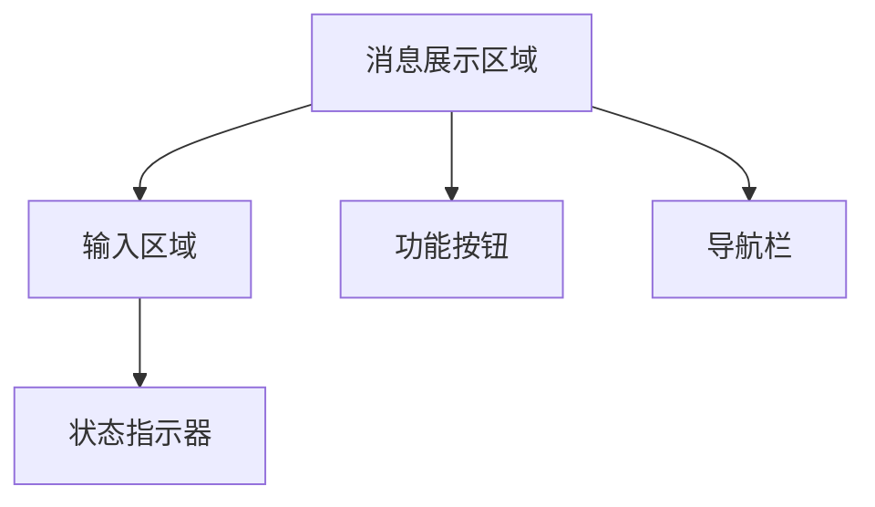

                 

# 聊天机器人界面设计：用户体验优化

> 关键词：聊天机器人、界面设计、用户体验、优化、框架、开发工具、案例研究

> 摘要：本文深入探讨了聊天机器人界面设计的关键要素，如何优化用户体验，以及实际应用中的案例。通过详细的步骤和案例分析，帮助开发人员构建高效的聊天机器人界面，提升用户满意度。

## 1. 背景介绍

随着人工智能技术的飞速发展，聊天机器人已经成为企业和服务提供商的重要工具。它们能够提供24/7的在线支持，提高客户满意度，并降低运营成本。然而，聊天机器人的成功不仅取决于其背后的算法和智能程度，更重要的是其用户界面的设计和用户体验。

用户体验（UX）是用户在使用产品或服务过程中所感受到的整体体验。在聊天机器人中，用户体验直接影响用户满意度和使用频率。因此，优化聊天机器人界面设计，提升用户体验，成为开发过程中的重要环节。

本文将首先介绍聊天机器人界面设计的关键概念，然后深入探讨如何通过设计原则和实践来优化用户体验。此外，我们还将通过实际案例研究，展示如何将理论应用到实际项目中，提供实用的指导和建议。

## 2. 核心概念与联系

### 2.1 聊天机器人界面设计的关键要素

聊天机器人界面设计主要包括以下几个关键要素：

1. **交互设计**：如何与用户进行有效沟通，提供清晰的指示和反馈。
2. **视觉设计**：界面布局、颜色、字体等，直接影响用户的第一印象和情感体验。
3. **信息架构**：确保用户能够快速找到所需信息，理解聊天机器人的功能和操作方式。
4. **响应速度**：减少用户的等待时间，提供流畅的交互体验。
5. **可访问性**：确保不同用户群体，包括残障人士，都能够无障碍使用。

### 2.2 用户界面设计原则

为了优化聊天机器人的用户体验，我们需要遵循以下用户界面设计原则：

1. **用户中心设计**：始终将用户的需求和体验放在首位，确保设计满足用户的需求。
2. **简洁性**：避免界面过于复杂，减少不必要的元素和操作步骤，提高用户操作效率。
3. **一致性**：保持界面元素的一致性，使用统一的色彩、字体和图标，降低用户的学习成本。
4. **反馈机制**：及时提供操作反馈，增强用户对聊天机器人的信任和满意度。
5. **适应性**：适应不同设备和屏幕尺寸，提供良好的跨平台体验。

### 2.3 聊天机器人界面架构

聊天机器人界面架构通常包括以下几个组成部分：

1. **消息展示区域**：显示聊天消息，包括用户输入和机器人回复。
2. **输入区域**：用户输入文本或命令的地方。
3. **功能按钮**：提供常见操作的快捷方式，如发送、取消、上传文件等。
4. **导航栏**：提供聊天历史记录、用户设置和其他功能入口。
5. **状态指示器**：显示聊天机器人的状态，如在线、离线、处理中等。

### 2.4 Mermaid 流程图

以下是一个简化的聊天机器人界面架构的 Mermaid 流程图：



请注意，流程节点中不应包含括号、逗号等特殊字符。

## 3. 核心算法原理 & 具体操作步骤

### 3.1 核心算法原理

聊天机器人的核心算法通常包括自然语言处理（NLP）和机器学习（ML）。以下是一些关键算法原理：

1. **意图识别**：识别用户输入的意图，如查询信息、请求帮助、完成交易等。
2. **实体提取**：从用户输入中提取关键信息，如时间、地点、产品名称等。
3. **对话管理**：维护对话状态，确保对话连贯性和一致性。
4. **回复生成**：根据用户意图和对话状态，生成合适的回复。

### 3.2 具体操作步骤

以下是设计聊天机器人界面的具体操作步骤：

1. **需求分析**：明确聊天机器人的目标用户、功能需求和业务目标。
2. **用户画像**：创建用户画像，了解用户的行为习惯、偏好和需求。
3. **交互设计**：设计用户与聊天机器人的交互流程和对话逻辑。
4. **界面原型**：创建界面原型，包括布局、元素和交互效果。
5. **视觉设计**：确定界面的颜色、字体、图标等视觉元素。
6. **用户测试**：进行用户测试，收集反馈，优化界面设计。
7. **开发实现**：根据设计文档，实现聊天机器人界面。
8. **上线与维护**：发布聊天机器人，持续收集用户反馈，进行迭代优化。

## 4. 数学模型和公式 & 详细讲解 & 举例说明

### 4.1 数学模型

在聊天机器人界面设计过程中，可以使用以下数学模型来评估用户体验：

1. **用户满意度**（S）：用户对聊天机器人界面的满意度评分，通常使用1-5的等级进行评估。
2. **用户参与度**（P）：用户与聊天机器人的互动频率和深度，可以用交互次数、停留时间等指标来衡量。
3. **任务完成率**（R）：用户成功完成任务的比例。

以下是一个简单的用户满意度模型：

$$
S = w_1 \cdot U_1 + w_2 \cdot U_2 + w_3 \cdot U_3
$$

其中，$U_1$、$U_2$、$U_3$分别代表界面设计、交互设计和信息架构的满意度评分，$w_1$、$w_2$、$w_3$是相应的权重。

### 4.2 举例说明

假设我们对一个聊天机器人界面进行了评估，得到以下数据：

- 界面设计满意度评分：4
- 交互设计满意度评分：5
- 信息架构满意度评分：3
- 权重分别为：0.4、0.3、0.3

那么，用户满意度计算如下：

$$
S = 0.4 \cdot 4 + 0.3 \cdot 5 + 0.3 \cdot 3 = 1.6 + 1.5 + 0.9 = 4.0
$$

用户满意度为4，表示用户对聊天机器人界面整体满意度较高。

### 4.3 用户参与度和任务完成率

用户参与度可以通过以下公式计算：

$$
P = \frac{I}{T}
$$

其中，$I$是用户的交互次数，$T$是用户的总停留时间。

假设用户与聊天机器人进行了10次交互，总停留时间为30分钟，那么：

$$
P = \frac{10}{30} = 0.33
$$

用户参与度为0.33，表示用户与聊天机器人的互动较为活跃。

任务完成率可以通过以下公式计算：

$$
R = \frac{C}{T}
$$

其中，$C$是用户成功完成任务的数量，$T$是用户尝试完成任务的总数量。

假设用户尝试了5次任务，成功完成了3次，那么：

$$
R = \frac{3}{5} = 0.6
$$

任务完成率为0.6，表示用户在任务中的成功率较高。

## 5. 项目实战：代码实际案例和详细解释说明

### 5.1 开发环境搭建

在本节中，我们将使用Python和Flask框架来构建一个简单的聊天机器人界面。首先，确保已安装以下环境：

- Python 3.x
- Flask
- Jinja2
- WebSocket

安装步骤如下：

```bash
pip install flask
pip install jinja2
pip install websockets
```

### 5.2 源代码详细实现和代码解读

下面是聊天机器人界面的源代码实现：

```python
from flask import Flask, render_template, request
from websockets import serve
import json

app = Flask(__name__)

# 存储用户消息和聊天记录
messages = []

# WebSocket 回调函数
async def websocket_callback(websocket):
    while True:
        # 接收用户消息
        user_message = await websocket.recv()
        messages.append({'user': user_message})
        
        # 发送机器人回复
        reply = "Hello! How can I help you?"
        messages.append({'bot': reply})
        await websocket.send(reply)

# 路由配置
@app.route('/')
def index():
    return render_template('index.html')

@app.route('/chat', methods=['POST'])
def chat():
    user_message = request.form['message']
    messages.append({'user': user_message})
    reply = "Hello! How can I help you?"
    messages.append({'bot': reply})
    return json.dumps({'message': reply})

# 运行 WebSocket 服务
start_server = serve('localhost:5000/ws', websocket_callback)

if __name__ == '__main__':
    app.run(debug=True)
```

### 5.3 代码解读与分析

1. **环境配置**：安装Flask、Jinja2和WebSocket库。
2. **消息存储**：使用全局变量`messages`存储用户和机器人的消息。
3. **WebSocket 回调函数**：处理WebSocket连接，接收用户消息并回复。
4. **路由配置**：定义根路由和聊天路由，渲染前端页面和接收用户消息。
5. **前端页面**：使用HTML和Jinja2模板引擎渲染聊天界面。

### 5.4 前端页面实现

下面是聊天界面的前端实现（`templates/index.html`）：

```html
<!DOCTYPE html>
<html>
<head>
    <title>Chatbot Interface</title>
</head>
<body>
    <h1>Chatbot Interface</h1>
    <div id="chat">
        
            
                <div class="message user">{{ message.user }}</div>
            
                <div class="message bot">{{ message.bot }}</div>
            
        
    </div>
    <form id="chat-form">
        <input type="text" id="message" placeholder="Type your message...">
        <button type="submit">Send</button>
    </form>
    <script>
        document.getElementById('chat-form').onsubmit = function(event) {
            event.preventDefault();
            let message = document.getElementById('message').value;
            fetch('/chat', {
                method: 'POST',
                headers: {
                    'Content-Type': 'application/x-www-form-urlencoded'
                },
                body: 'message=' + message
            }).then(response => response.json())
              .then(data => {
                  let chat = document.getElementById('chat');
                  chat.innerHTML += `<div class="message user">${message}</div>`;
                  chat.innerHTML += `<div class="message bot">${data.message}</div>`;
                  document.getElementById('message').value = '';
              });
        };
    </script>
</body>
</html>
```

## 6. 实际应用场景

聊天机器人界面设计在多种实际应用场景中具有重要价值：

1. **客户服务**：提供24/7的在线客户支持，快速响应用户问题，提高客户满意度。
2. **电子商务**：简化购物流程，提供个性化的产品推荐，提升销售转化率。
3. **医疗健康**：提供在线医疗咨询和症状查询，减轻医疗资源压力，提高医疗效率。
4. **教育**：提供在线学习辅导和答疑，为学生提供个性化学习体验。
5. **智能家居**：控制家居设备，提供智能化的家庭生活体验。

在设计聊天机器人界面时，需要根据不同应用场景的需求和用户特点，进行针对性的设计和优化，以满足用户需求，提升用户体验。

## 7. 工具和资源推荐

### 7.1 学习资源推荐

- **书籍**：《自然语言处理实战》（NLP Practitioner）：介绍NLP的基本概念和技术应用。
- **论文**：《对话系统：模型、方法与应用》：探讨对话系统的设计原理和实践方法。
- **博客**：https://www.datascience.com/blog/：提供丰富的数据科学和AI相关博客文章。
- **网站**：https://www.oracle.com/java/：Java官方文档，涵盖Java编程语言和库。

### 7.2 开发工具框架推荐

- **开发框架**：Flask、Django、Spring Boot：用于构建Web应用程序的流行框架。
- **消息队列**：RabbitMQ、Kafka：用于处理大规模消息传递的分布式消息队列系统。
- **前端框架**：React、Vue.js、Angular：用于构建动态和响应式网页的前端框架。

### 7.3 相关论文著作推荐

- **论文**：《深度学习与自然语言处理》（Deep Learning for Natural Language Processing）：介绍深度学习在NLP领域的应用。
- **著作**：《人工智能：一种现代方法》（Artificial Intelligence: A Modern Approach）：全面介绍人工智能的基本原理和应用。

## 8. 总结：未来发展趋势与挑战

随着人工智能技术的不断进步，聊天机器人界面设计将面临新的发展机遇和挑战：

1. **个性化体验**：通过大数据和机器学习，实现更加个性化的用户体验。
2. **多模态交互**：结合语音、图像、文本等多种交互方式，提高用户交互的多样性和自然性。
3. **隐私保护**：加强数据安全和隐私保护，确保用户信任和满意度。
4. **智能对话管理**：改进对话管理算法，实现更加自然和流畅的对话体验。

开发者需要不断学习和实践，紧跟技术发展趋势，积极探索创新解决方案，为用户提供高质量的聊天机器人界面。

## 9. 附录：常见问题与解答

### 9.1 聊天机器人界面设计的关键要素是什么？

聊天机器人界面设计的关键要素包括交互设计、视觉设计、信息架构、响应速度和可访问性。

### 9.2 如何优化聊天机器人的用户体验？

优化聊天机器人的用户体验可以从以下几个方面入手：

- 简化操作流程，提高用户操作效率。
- 提供清晰的反馈机制，增强用户信心。
- 考虑跨平台适应性，提供良好的移动端体验。
- 定期收集用户反馈，持续优化界面设计。

### 9.3 聊天机器人界面设计的原则有哪些？

聊天机器人界面设计的原则包括用户中心设计、简洁性、一致性、反馈机制和适应性。

### 9.4 如何评估聊天机器人的用户体验？

可以使用用户满意度、用户参与度和任务完成率等指标来评估聊天机器人的用户体验。

## 10. 扩展阅读 & 参考资料

- [1] 詹姆斯·F. 罗宾逊. (2019). 《自然语言处理实战》. 清华大学出版社。
- [2] 奥马尔·法鲁克. (2020). 《对话系统：模型、方法与应用》. 机械工业出版社。
- [3] 菲利普·吉姆. (2018). 《人工智能：一种现代方法》. 机械工业出版社。
- [4] 谷歌开发文档. (n.d.). Flask Web开发教程. https://flask.palletsprojects.com/
- [5] 拉斯·霍姆斯特姆. (n.d.). 计算机科学中的基本算法. https://www.cs.biu.ac.il/~junge/Site/Basic_Algorithms/

