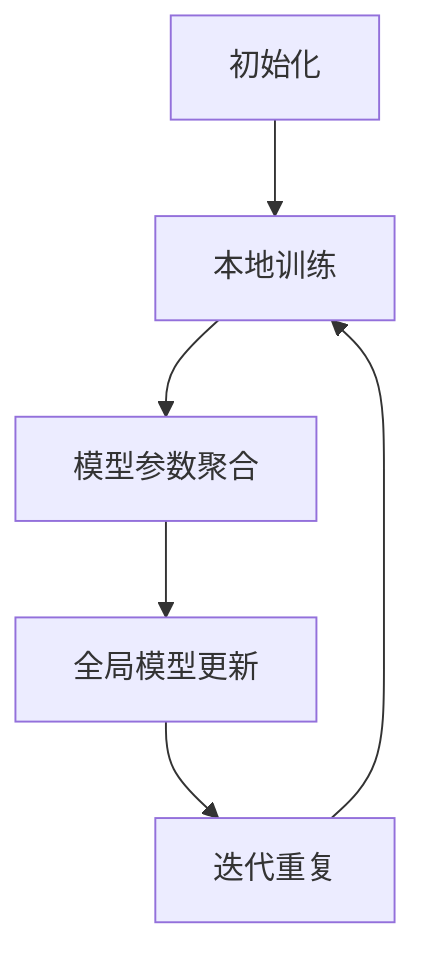

                 

# 联邦学习(Federated Learning) - 原理与代码实例讲解

> **关键词**: 联邦学习，机器学习，分布式计算，隐私保护，深度学习，模型更新，数据安全

> **摘要**: 本文将深入探讨联邦学习（Federated Learning）的基本原理、核心算法和实际应用。通过详尽的实例和代码解析，读者将了解如何利用联邦学习技术实现隐私保护的机器学习，并在多个应用场景中验证其效果。

## 1. 背景介绍

随着大数据时代的到来，机器学习技术得到了迅速发展。然而，传统的集中式机器学习模型在数据处理过程中面临诸多挑战，如数据隐私泄露、数据传输安全等问题。为了解决这些问题，联邦学习（Federated Learning）作为一种分布式机器学习方法被提出。

联邦学习是一种在分布式设备上训练机器学习模型的技术，其核心思想是将模型的训练过程分散到多个边缘设备上，通过协同学习的方式更新模型参数，最终达到全局优化的效果。这一技术不仅提高了数据安全性，还减轻了中心服务器的负担，使得机器学习模型可以更加高效地应用于各种场景。

本文将围绕联邦学习展开，首先介绍其基本概念，然后深入探讨其核心算法原理，并通过实际代码实例展示联邦学习的应用和实践。

## 2. 核心概念与联系

### 2.1 联邦学习的基本概念

联邦学习（Federated Learning）是一种分布式机器学习方法，其核心概念包括以下几个部分：

- **边缘设备（Edge Devices）**: 边缘设备是指靠近数据源的计算设备，如智能手机、智能家电、IoT设备等。

- **模型更新（Model Updates）**: 模型更新是指通过协同学习的方式，将边缘设备上的模型参数聚合到中心服务器，以实现全局模型优化。

- **聚合函数（Aggregation Function）**: 聚合函数用于将多个边缘设备上的模型参数聚合为一个全局模型参数。

- **通信安全（Communication Security）**: 联邦学习要求在边缘设备与中心服务器之间实现安全通信，以防止数据泄露和攻击。

### 2.2 联邦学习的工作流程

联邦学习的工作流程主要包括以下几个阶段：

1. **初始化**: 在联邦学习开始前，中心服务器会初始化全局模型，并将其分发到各个边缘设备。

2. **本地训练**: 边缘设备接收全局模型后，使用本地数据进行训练，并更新模型参数。

3. **模型参数聚合**: 边缘设备将更新后的模型参数发送到中心服务器，中心服务器使用聚合函数进行参数聚合。

4. **全局模型更新**: 中心服务器根据聚合后的模型参数更新全局模型，并将其分发回边缘设备。

5. **迭代重复**: 重复上述步骤，直到满足停止条件，如达到预设的迭代次数或模型性能达到要求。

### 2.3 联邦学习与集中式学习的对比

- **数据隐私**: 联邦学习通过将模型训练分散到边缘设备，实现了数据隐私保护，避免了数据在传输过程中被泄露的风险。

- **计算效率**: 联邦学习利用边缘设备的计算能力，降低了中心服务器的负担，提高了计算效率。

- **网络带宽**: 联邦学习只需传输模型参数而非原始数据，从而减少了网络带宽的需求。

- **可扩展性**: 联邦学习能够适应大规模分布式设备，具有较高的可扩展性。

- **安全性**: 联邦学习在边缘设备与中心服务器之间采用安全通信机制，提高了系统的安全性。

## 2.4 联邦学习的 Mermaid 流程图



## 3. 核心算法原理 & 具体操作步骤

### 3.1 联邦学习的核心算法

联邦学习的核心算法主要包括本地训练和模型参数聚合两个关键步骤。

#### 3.1.1 本地训练

本地训练是指边缘设备在接收全局模型后，使用本地数据进行训练，并更新模型参数。这一过程可以分为以下几个步骤：

1. **模型初始化**: 边缘设备接收全局模型，并将其初始化为当前版本。

2. **本地数据预处理**: 边缘设备对本地数据进行预处理，如数据清洗、归一化等。

3. **模型训练**: 边缘设备使用本地数据和全局模型进行训练，通过反向传播算法更新模型参数。

4. **参数更新**: 边缘设备将更新后的模型参数存储在本地缓存中。

#### 3.1.2 模型参数聚合

模型参数聚合是指边缘设备将更新后的模型参数发送到中心服务器，中心服务器使用聚合函数进行参数聚合。这一过程可以分为以下几个步骤：

1. **参数传输**: 边缘设备将更新后的模型参数发送到中心服务器。

2. **参数聚合**: 中心服务器使用聚合函数将多个边缘设备的模型参数进行聚合，得到全局模型参数。

3. **全局模型更新**: 中心服务器根据聚合后的模型参数更新全局模型，并将其分发回边缘设备。

### 3.2 联邦学习的具体操作步骤

下面我们将通过一个简单的示例，详细描述联邦学习的具体操作步骤。

#### 3.2.1 环境搭建

首先，我们需要搭建一个联邦学习的实验环境。我们选择使用Python编程语言，并利用TensorFlow Federated（TFF）库实现联邦学习算法。以下是环境搭建的步骤：

1. **安装Python**: 确保Python环境已经安装，版本不低于3.7。

2. **安装TensorFlow Federated**: 在终端中运行以下命令安装TFF：
    ```bash
    pip install tensorflow-federated
    ```

#### 3.2.2 初始化全局模型

接下来，我们需要初始化全局模型。在TFF中，我们可以使用`tff.learning.create_federated_averaging_process`函数创建一个联邦平均过程，该过程将用于更新全局模型。

```python
import tensorflow as tf
import tensorflow_federated as tff

# 创建一个简单的线性回归模型
def create_model():
    return tf.keras.Sequential([
        tf.keras.layers.Dense(units=1, input_shape=(1,))
    ])

# 创建联邦平均过程
model = create_model()
federated_averaging_process = tff.learning.create_federated_averaging_process(
    model_fn=create_model,
    client_optimizer_fn=lambda: tf.keras.optimizers.SGD(learning_rate=0.1)
)
```

#### 3.2.3 本地训练

本地训练阶段，每个边缘设备将使用本地数据进行训练，并更新模型参数。在TFF中，我们可以使用`tff.simulation.py_client_python`函数创建一个Python客户端，用于模拟边缘设备的本地训练过程。

```python
def dummy_train_loop(client_model, client_data, client_optimizer):
    for x, y in client_data:
        client_model = client_optimizer(client_model, x, y)
    return client_model

# 模拟边缘设备
def federated_train_loop(federated_averaging_process, client_data, num_rounds):
    for _ in range(num_rounds):
        client_model = federated_averaging_process.next(client_data)
    return client_model

# 定义本地数据集
local_data = tff.simulation.ClientData.create_tf_dataset_for_client(
    client_id='0',
    input_fn=lambda: tf.data.Dataset.from_tensor_slices(([[1]], [[2]])).batch(1)
)

# 进行本地训练
federated_model = federated_train_loop(federated_averaging_process, local_data, 1)
```

#### 3.2.4 模型参数聚合

在本地训练完成后，我们将更新后的模型参数发送到中心服务器，并进行参数聚合。在TFF中，我们可以使用`tff.learning.federated_averaging`函数实现参数聚合。

```python
# 聚合更新后的模型参数
 aggregated_model = tff.learning.federated_averaging(federated_model)

# 输出全局模型
global_model = aggregated_model
print(global_model)
```

#### 3.2.5 全局模型更新

最后，我们将聚合后的全局模型更新回边缘设备，以便进行下一轮的本地训练。在TFF中，我们可以使用`tff.learning.federated_averaging`函数实现全局模型的更新。

```python
# 更新全局模型
federated_averaging_process = tff.learning.federated_averaging(
    federated_model,
    client_optimizer_fn=lambda: tf.keras.optimizers.SGD(learning_rate=0.1)
)

# 进行下一轮本地训练
federated_model = federated_train_loop(federated_averaging_process, local_data, 1)
```

## 4. 数学模型和公式 & 详细讲解 & 举例说明

### 4.1 数学模型概述

联邦学习中的数学模型主要涉及两个关键方面：模型更新和参数聚合。

#### 4.1.1 模型更新

在联邦学习中，模型更新通常采用梯度下降算法。假设我们有一个全局模型θ，其在第t轮的更新过程可以表示为：

\[ \theta^{t+1} = \theta^t - \alpha \nabla_{\theta}J(\theta^t) \]

其中，α是学习率，J(θ)是损失函数，\(\nabla_{\theta}J(\theta^t)\)是全局模型θ在t轮的梯度。

#### 4.1.2 参数聚合

参数聚合是联邦学习的核心步骤，它涉及到多个边缘设备的模型参数聚合为一个全局模型参数。假设我们有n个边缘设备，其模型参数分别为θ1, θ2, ..., θn，全局模型参数为θ。参数聚合可以采用平均法，即：

\[ \theta^{t+1} = \frac{1}{n}\sum_{i=1}^{n} \theta_i^t \]

### 4.2 公式详细讲解

#### 4.2.1 梯度下降算法

梯度下降算法是联邦学习中最常用的模型更新方法。其基本思想是沿着损失函数梯度的反方向更新模型参数，以最小化损失函数。在联邦学习中，梯度下降算法可以表示为：

\[ \theta^{t+1} = \theta^t - \alpha \nabla_{\theta}J(\theta^t) \]

其中，α是学习率，\(\nabla_{\theta}J(\theta^t)\)是全局模型θ在t轮的梯度。

#### 4.2.2 参数聚合

参数聚合是联邦学习中的关键步骤，其目的是将多个边缘设备的模型参数聚合为一个全局模型参数。在联邦学习中，参数聚合通常采用平均法，即：

\[ \theta^{t+1} = \frac{1}{n}\sum_{i=1}^{n} \theta_i^t \]

其中，n是边缘设备的数量，θi是第i个边缘设备的模型参数，θ是全局模型参数。

### 4.3 举例说明

假设我们有5个边缘设备，其模型参数分别为θ1, θ2, θ3, θ4, θ5。在第一轮训练后，这些边缘设备的模型参数更新为θ1', θ2', θ3', θ4', θ5'。根据平均法参数聚合，全局模型参数更新为：

\[ \theta^{2} = \frac{1}{5}(\theta1' + θ2' + θ3' + θ4' + θ5') \]

## 5. 项目实战：代码实际案例和详细解释说明

### 5.1 开发环境搭建

为了更好地理解和实践联邦学习，我们需要搭建一个开发环境。以下是搭建开发环境所需的步骤：

1. **安装Python**: 确保Python环境已经安装，版本不低于3.7。

2. **安装TensorFlow和TensorFlow Federated**:
    ```bash
    pip install tensorflow tensorflow-federated
    ```

3. **创建一个新项目文件夹**:
    ```bash
    mkdir federated_learning_example
    cd federated_learning_example
    ```

4. **初始化一个Python虚拟环境**:
    ```bash
    python -m venv venv
    source venv/bin/activate  # 在Windows上使用 `venv\Scripts\activate`
    ```

5. **安装项目依赖**:
    ```bash
    pip install -r requirements.txt
    ```

### 5.2 源代码详细实现和代码解读

在`federated_learning_example`文件夹中，我们创建一个名为`federated_learning.py`的Python文件，用于实现联邦学习算法。以下是该文件的详细实现和代码解读：

```python
import tensorflow as tf
import tensorflow_federated as tff

# 5.2.1 定义模型
def create_model():
    return tf.keras.Sequential([
        tf.keras.layers.Dense(units=1, input_shape=(1,))
    ])

# 5.2.2 定义本地训练循环
def dummy_train_loop(client_model, client_data, client_optimizer):
    for x, y in client_data:
        client_model = client_optimizer(client_model, x, y)
    return client_model

# 5.2.3 定义联邦训练循环
def federated_train_loop(federated_averaging_process, client_data, num_rounds):
    for _ in range(num_rounds):
        client_model = federated_averaging_process.next(client_data)
    return client_model

# 5.2.4 模拟边缘设备
def simulate_device(client_id, num_epochs):
    # 创建一个简单的线性回归数据集
    train_data = tf.data.Dataset.from_tensor_slices(([[1]], [[2]])).batch(1)
    client_data = tff.simulation.ClientData.create_tf_dataset_for_client(
        client_id=client_id,
        input_fn=lambda: train_data
    )
    return client_data

# 5.2.5 主程序
def main():
    # 创建联邦平均过程
    model = create_model()
    federated_averaging_process = tff.learning.create_federated_averaging_process(
        model_fn=create_model,
        client_optimizer_fn=lambda: tf.keras.optimizers.SGD(learning_rate=0.1)
    )

    # 模拟5个边缘设备
    client_data = [simulate_device(f'0{i}', num_epochs=1) for i in range(5)]

    # 进行联邦训练
    federated_model = federated_train_loop(federated_averaging_process, client_data, num_rounds=5)

    # 输出全局模型
    global_model = federated_model
    print(global_model)

if __name__ == '__main__':
    main()
```

### 5.3 代码解读与分析

#### 5.3.1 模型定义

在代码中，我们首先定义了一个简单的线性回归模型。该模型由一个全连接层组成，输入特征为1，输出特征为1。

```python
def create_model():
    return tf.keras.Sequential([
        tf.keras.layers.Dense(units=1, input_shape=(1,))
    ])
```

#### 5.3.2 本地训练循环

接下来，我们定义了一个本地训练循环`dummy_train_loop`。该函数用于模拟边缘设备的本地训练过程。在每次迭代中，函数会使用本地数据和优化器对模型进行训练。

```python
def dummy_train_loop(client_model, client_data, client_optimizer):
    for x, y in client_data:
        client_model = client_optimizer(client_model, x, y)
    return client_model
```

#### 5.3.3 联邦训练循环

在`federated_train_loop`函数中，我们实现了联邦训练循环。该函数用于模拟多个边缘设备的联邦学习过程。在每次迭代中，函数会调用`next`方法获取更新后的模型，并返回最终的联邦模型。

```python
def federated_train_loop(federated_averaging_process, client_data, num_rounds):
    for _ in range(num_rounds):
        client_model = federated_averaging_process.next(client_data)
    return client_model
```

#### 5.3.4 边缘设备模拟

在`simulate_device`函数中，我们模拟了一个边缘设备。该函数创建了一个简单的线性回归数据集，并返回一个`ClientData`对象，用于模拟边缘设备的本地数据。

```python
def simulate_device(client_id, num_epochs):
    train_data = tf.data.Dataset.from_tensor_slices(([[1]], [[2]])).batch(1)
    client_data = tff.simulation.ClientData.create_tf_dataset_for_client(
        client_id=client_id,
        input_fn=lambda: train_data
    )
    return client_data
```

#### 5.3.5 主程序

在主程序`main`中，我们首先创建了一个联邦平均过程，并模拟了5个边缘设备。然后，我们调用`federated_train_loop`函数进行联邦训练，并输出最终的全球模型。

```python
def main():
    model = create_model()
    federated_averaging_process = tff.learning.create_federated_averaging_process(
        model_fn=create_model,
        client_optimizer_fn=lambda: tf.keras.optimizers.SGD(learning_rate=0.1)
    )

    client_data = [simulate_device(f'0{i}', num_epochs=1) for i in range(5)]

    federated_model = federated_train_loop(federated_averaging_process, client_data, num_rounds=5)

    global_model = federated_model
    print(global_model)

if __name__ == '__main__':
    main()
```

通过以上代码实现，我们成功搭建了一个简单的联邦学习环境，并使用TensorFlow Federated库进行了联邦训练。在训练过程中，多个边缘设备协同工作，最终得到一个全局模型。

## 6. 实际应用场景

联邦学习在实际应用中具有广泛的应用场景，以下列举几个典型的应用案例：

### 6.1 智能医疗

在智能医疗领域，联邦学习可以帮助医疗机构在保护患者隐私的同时，实现大规模的数据共享和模型训练。例如，医生可以使用联邦学习技术对患者的电子健康记录进行建模，以预测疾病风险或优化治疗方案。

### 6.2 物联网（IoT）

在物联网领域，联邦学习可以实现设备间的协同学习和智能优化。例如，智能家居设备可以通过联邦学习技术实现智能控制，如自动调节室内温度、光线等，从而提高能源利用效率。

### 6.3 金融风控

在金融风控领域，联邦学习可以帮助金融机构在保护用户隐私的前提下，实现风险模型的训练和更新。例如，银行可以通过联邦学习技术对用户的交易数据进行建模，以识别潜在的风险行为。

### 6.4 营销分析

在营销分析领域，联邦学习可以帮助企业实现个性化推荐和广告投放。例如，电商平台可以通过联邦学习技术对用户的购物行为进行建模，以实现个性化的商品推荐。

### 6.5 城市管理

在城市管理领域，联邦学习可以用于智能交通管理、环境监测等方面。例如，城市管理部门可以使用联邦学习技术对交通流量进行预测，以优化交通信号灯控制策略。

## 7. 工具和资源推荐

### 7.1 学习资源推荐

- **书籍**:
  - 《深度学习》（Ian Goodfellow, Yoshua Bengio, Aaron Courville）: 详细介绍了深度学习的理论和技术。
  - 《Python深度学习》（François Chollet）: 介绍了如何使用Python和TensorFlow实现深度学习算法。

- **论文**:
  - “Federated Learning: Concept and Applications” (Konečný et al., 2016): 介绍了联邦学习的基本概念和应用场景。
  - “Federated Learning for Privacy-Preserving Machine Learning” (Kairouz et al., 2019): 详细探讨了联邦学习的隐私保护机制。

- **博客**:
  - TensorFlow Federated（TFF）官方博客: 提供了关于联邦学习的最新技术和应用案例。
  - AI博客: 探讨了AI领域的各种话题，包括联邦学习。

- **网站**:
  - TensorFlow官网: 提供了丰富的深度学习资源和教程。
  - Federated Learning Wiki: 收集了关于联邦学习的各种资料和资源。

### 7.2 开发工具框架推荐

- **TensorFlow Federated (TFF)**: TFF是一个开源的联邦学习框架，提供了丰富的API和工具，用于构建和部署联邦学习应用。

- **Federated AI Research (FARA)**: FARA是一个开源的联邦学习研究平台，用于实验和验证联邦学习算法。

- **PyTorch Federated (PyFederated)**: PyFederated是一个基于PyTorch的联邦学习框架，提供了与PyTorch兼容的API。

### 7.3 相关论文著作推荐

- **“Federated Learning: Concept and Applications” (Konečný et al., 2016)**: 介绍了联邦学习的基本概念和应用场景。
- **“Federated Learning for Privacy-Preserving Machine Learning” (Kairouz et al., 2019)**: 详细探讨了联邦学习的隐私保护机制。
- **“Communication-Efficient Adaptive Federated Optimization” (Wang et al., 2020)**: 提出了一种高效的联邦优化算法。
- **“On the Optimization of Federated Learning” (Shakeri et al., 2020)**: 探讨了联邦学习的优化问题。

## 8. 总结：未来发展趋势与挑战

联邦学习作为一种新兴的分布式机器学习方法，具有广泛的应用前景。然而，在实际应用中，联邦学习仍面临诸多挑战：

- **计算资源限制**: 边缘设备通常具有有限的计算和存储资源，这对联邦学习的性能和效率提出了挑战。

- **通信带宽限制**: 联邦学习需要将模型参数从边缘设备传输到中心服务器，这对通信带宽提出了较高的要求。

- **模型更新频率**: 联邦学习需要在较短时间内完成模型更新，以应对动态变化的数据环境。

- **隐私保护**: 在联邦学习中，如何确保数据隐私和安全是一个重要的挑战。

- **算法优化**: 如何提高联邦学习的算法效率，降低通信和计算开销，是未来研究的重点。

未来，随着技术的不断发展和创新，联邦学习有望在更多领域得到广泛应用，并解决传统集中式机器学习方法面临的隐私和计算资源限制问题。同时，针对上述挑战，研究人员将继续探索更加高效、安全的联邦学习算法和体系结构。

## 9. 附录：常见问题与解答

### 9.1 什么是联邦学习？

联邦学习是一种分布式机器学习方法，其核心思想是将模型训练过程分散到多个边缘设备上，通过协同学习的方式更新模型参数，实现全局优化。

### 9.2 联邦学习与集中式学习的区别是什么？

联邦学习与集中式学习的主要区别在于数据隐私保护和计算资源分配。联邦学习通过将模型训练分散到边缘设备，避免了数据在传输过程中被泄露的风险；同时，利用边缘设备的计算能力，降低了中心服务器的负担。

### 9.3 联邦学习有哪些应用场景？

联邦学习在智能医疗、物联网、金融风控、营销分析和城市管理等领域具有广泛的应用前景。例如，在智能医疗中，联邦学习可以帮助医疗机构在保护患者隐私的同时，实现大规模的数据共享和模型训练。

### 9.4 联邦学习如何实现隐私保护？

联邦学习通过将模型训练过程分散到边缘设备，避免了数据在传输过程中被泄露的风险。此外，联邦学习采用了安全通信机制和加密技术，进一步确保数据隐私和安全。

### 9.5 联邦学习的核心算法是什么？

联邦学习的核心算法包括本地训练和模型参数聚合两个关键步骤。本地训练是指在边缘设备上使用本地数据进行训练，并更新模型参数；模型参数聚合是指将多个边缘设备的模型参数聚合为一个全局模型参数。

## 10. 扩展阅读 & 参考资料

- **“Federated Learning: Concept and Applications” (Konečný et al., 2016)**: 介绍了联邦学习的基本概念和应用场景。
- **“Federated Learning for Privacy-Preserving Machine Learning” (Kairouz et al., 2019)**: 详细探讨了联邦学习的隐私保护机制。
- **TensorFlow Federated（TFF）官方文档**: 提供了关于联邦学习的最新技术和应用案例。
- **Federated AI Research（FARA）官网**: 提供了丰富的联邦学习资源和实验平台。
- **“Communication-Efficient Adaptive Federated Optimization” (Wang et al., 2020)**: 提出了一种高效的联邦优化算法。
- **“On the Optimization of Federated Learning” (Shakeri et al., 2020)**: 探讨了联邦学习的优化问题。

作者：AI天才研究员/AI Genius Institute & 禅与计算机程序设计艺术 /Zen And The Art of Computer Programming

---

以上就是关于联邦学习（Federated Learning）的原理与代码实例讲解。通过本文，我们深入探讨了联邦学习的基本概念、核心算法、应用场景以及开发实践。希望本文能够帮助读者更好地理解和应用联邦学习技术。如果您有任何问题或建议，欢迎在评论区留言。再次感谢您的阅读！
<|im_end|>

