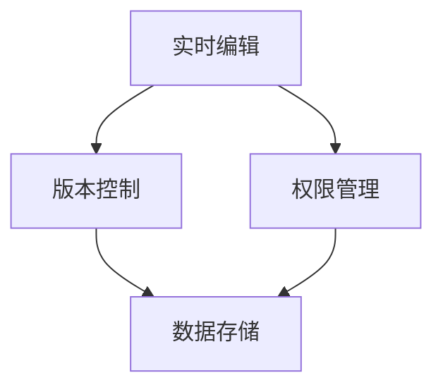

                 

# 腾讯文档2025社协在线协作工程师面试题解

## 摘要

本文旨在解答腾讯文档2025社协在线协作工程师面试题。通过对面试题的深入剖析，我们将探讨在线协作的核心概念、算法原理、数学模型以及实际应用场景，并提供开发环境搭建、代码实现和工具资源推荐。本文旨在帮助读者全面了解在线协作技术，为应对面试挑战提供有力支持。

## 1. 背景介绍

随着互联网技术的飞速发展，在线协作已成为现代工作环境的重要组成部分。腾讯文档作为一款功能强大的在线协作工具，广泛应用于企业、团队和个人用户。本文将围绕腾讯文档2025社协在线协作工程师面试题，深入分析在线协作的关键技术和实现方法。

## 2. 核心概念与联系

在线协作系统通常涉及以下核心概念：

- **实时编辑**：允许多个用户同时在线编辑文档，并实时同步更新。
- **版本控制**：记录文档的历史版本，便于用户回溯和比较。
- **权限管理**：根据用户角色和权限设置，控制文档的访问和编辑权限。
- **数据存储**：将文档内容存储在云端，确保数据的安全和一致性。

这些核心概念相互关联，共同构成了在线协作系统的基本架构。以下是一个简单的 Mermaid 流程图，展示这些概念之间的联系：



### 2.1 实时编辑

实时编辑是在线协作系统的核心功能之一。它通过以下步骤实现：

1. **用户输入**：用户在文档中进行编辑操作，如插入文本、修改格式等。
2. **操作记录**：将用户的编辑操作转化为操作记录，以便后续同步。
3. **操作同步**：将操作记录实时发送给其他在线用户，实现多用户同时编辑。
4. **数据更新**：根据操作记录更新文档内容，确保所有用户的编辑结果一致。

### 2.2 版本控制

版本控制是确保文档完整性和可追溯性的重要手段。其主要功能包括：

1. **历史记录**：记录文档的历史版本，包括用户、时间、操作等信息。
2. **版本回溯**：用户可以随时回溯到任意历史版本，查看或恢复文档内容。
3. **版本比较**：用户可以比较不同版本之间的差异，了解文档的修改历史。

### 2.3 权限管理

权限管理是保障文档安全和协作效率的关键。其主要功能包括：

1. **用户角色**：根据用户在团队中的角色分配权限，如管理员、编辑者、查看者等。
2. **权限设置**：为不同角色分配不同的文档访问和编辑权限。
3. **权限变更**：管理员可以随时调整用户的权限，以适应团队的需求变化。

### 2.4 数据存储

数据存储是确保文档数据安全、可靠和一致性的基础。其主要功能包括：

1. **数据备份**：定期备份文档数据，防止数据丢失或损坏。
2. **数据加密**：对文档数据进行加密存储，保障数据的安全性。
3. **数据同步**：确保多设备之间的数据一致，提供流畅的协作体验。

## 3. 核心算法原理 & 具体操作步骤

在线协作系统的核心算法通常包括以下几种：

- **分布式算法**：实现多用户同时编辑的算法。
- **版本控制算法**：实现文档版本管理和回溯的算法。
- **权限管理算法**：实现用户角色分配和权限设置的算法。
- **数据存储算法**：实现文档数据备份、加密和同步的算法。

### 3.1 分布式算法

分布式算法是确保多用户同时编辑文档的核心。其主要原理如下：

1. **操作记录**：记录用户的编辑操作，包括插入、删除、修改等。
2. **并发控制**：处理并发操作，避免冲突和错误。
3. **操作合并**：将多个用户的操作合并为一个最终版本。

具体操作步骤如下：

1. **用户A编辑文档**：用户A在文档中插入一行文本。
2. **操作记录**：系统记录操作A，并将其发送给其他在线用户。
3. **用户B编辑文档**：用户B在文档中删除刚才插入的文本。
4. **操作记录**：系统记录操作B，并将其发送给用户A。
5. **操作合并**：系统将操作A和操作B合并，得到最终版本。

### 3.2 版本控制算法

版本控制算法是实现文档版本管理和回溯的核心。其主要原理如下：

1. **历史记录**：记录文档的历史版本，包括用户、时间、操作等信息。
2. **版本回溯**：根据用户需求，回溯到指定历史版本。
3. **版本比较**：比较不同版本之间的差异，展示修改内容。

具体操作步骤如下：

1. **用户编辑文档**：用户在文档中进行编辑操作。
2. **版本记录**：系统记录当前版本，包括用户、时间、操作等信息。
3. **用户回溯版本**：用户选择需要回溯的版本。
4. **版本更新**：系统将文档更新为指定版本，展示修改内容。

### 3.3 权限管理算法

权限管理算法是实现用户角色分配和权限设置的核心。其主要原理如下：

1. **用户角色**：根据用户在团队中的角色分配权限，如管理员、编辑者、查看者等。
2. **权限设置**：为不同角色分配不同的文档访问和编辑权限。
3. **权限变更**：管理员可以随时调整用户的权限，以适应团队的需求变化。

具体操作步骤如下：

1. **管理员设置角色**：管理员为用户分配角色。
2. **角色权限设置**：系统根据角色分配不同的文档访问和编辑权限。
3. **用户操作文档**：用户根据权限进行文档操作。

### 3.4 数据存储算法

数据存储算法是实现文档数据备份、加密和同步的核心。其主要原理如下：

1. **数据备份**：定期备份文档数据，防止数据丢失或损坏。
2. **数据加密**：对文档数据进行加密存储，保障数据的安全性。
3. **数据同步**：确保多设备之间的数据一致，提供流畅的协作体验。

具体操作步骤如下：

1. **数据备份**：系统定期备份文档数据。
2. **数据加密**：系统对备份的文档数据进行加密处理。
3. **数据同步**：系统将加密后的文档数据同步到多设备。

## 4. 数学模型和公式 & 详细讲解 & 举例说明

在线协作系统中的数学模型和公式主要涉及以下方面：

- **分布式算法**：包括操作记录的合并、并发控制的逻辑等。
- **版本控制算法**：包括版本回溯、版本比较的逻辑等。
- **权限管理算法**：包括角色分配、权限设置的逻辑等。
- **数据存储算法**：包括数据备份、数据加密、数据同步的逻辑等。

### 4.1 分布式算法

分布式算法中的数学模型主要包括操作记录的合并和并发控制。

#### 4.1.1 操作记录的合并

假设用户A和用户B同时对文档进行编辑，分别产生了操作A和操作B。操作记录的合并可以表示为以下公式：

$$
\text{合并结果} = \text{操作A} \cup \text{操作B}
$$

其中，$\cup$ 表示并集运算。

#### 4.1.2 并发控制

并发控制的关键在于处理并发操作，避免冲突和错误。一种常见的并发控制方法是使用锁机制。

锁机制可以表示为以下公式：

$$
L = \{ \text{未锁资源} \}
$$

其中，$L$ 表示锁集合，$\text{未锁资源}$ 表示未被锁定的资源。

具体步骤如下：

1. **用户A请求锁**：用户A向系统请求锁定资源R。
2. **系统判断锁状态**：系统判断资源R的锁状态，若未被锁定，则将R添加到锁集合L。
3. **用户A执行操作**：用户A在锁定资源R的情况下执行操作。
4. **用户A释放锁**：用户A完成操作后释放锁，将R从锁集合L中删除。

### 4.2 版本控制算法

版本控制算法中的数学模型主要包括版本回溯和版本比较。

#### 4.2.1 版本回溯

版本回溯可以表示为以下公式：

$$
\text{回溯结果} = \text{当前版本} \backslash \text{修改记录}
$$

其中，$\backslash$ 表示交集运算。

#### 4.2.2 版本比较

版本比较可以表示为以下公式：

$$
\text{比较结果} = \text{版本A} \oplus \text{版本B}
$$

其中，$\oplus$ 表示异或运算。

### 4.3 权限管理算法

权限管理算法中的数学模型主要包括角色分配和权限设置。

#### 4.3.1 角色分配

角色分配可以表示为以下公式：

$$
\text{角色分配} = \text{用户集合} \times \text{角色集合}
$$

其中，$\times$ 表示笛卡尔积。

#### 4.3.2 权限设置

权限设置可以表示为以下公式：

$$
\text{权限设置} = \text{角色集合} \times \text{权限集合}
$$

其中，$\times$ 表示笛卡尔积。

### 4.4 数据存储算法

数据存储算法中的数学模型主要包括数据备份、数据加密和数据同步。

#### 4.4.1 数据备份

数据备份可以表示为以下公式：

$$
\text{备份结果} = \text{原始数据} \cup \text{备份数据}
$$

其中，$\cup$ 表示并集运算。

#### 4.4.2 数据加密

数据加密可以表示为以下公式：

$$
\text{加密结果} = \text{明文数据} \oplus \text{密钥}
$$

其中，$\oplus$ 表示异或运算。

#### 4.4.3 数据同步

数据同步可以表示为以下公式：

$$
\text{同步结果} = \text{本地数据} \cup \text{云端数据}
$$

其中，$\cup$ 表示并集运算。

## 5. 项目实战：代码实际案例和详细解释说明

为了更好地理解在线协作系统的实现，下面我们将通过一个简单的代码案例进行详细解释。

### 5.1 开发环境搭建

首先，我们需要搭建一个简单的开发环境，以便进行在线协作系统的开发和测试。以下是搭建步骤：

1. **安装Python环境**：在本地计算机上安装Python环境，版本建议为3.8以上。
2. **安装依赖库**：安装在线协作系统所需的依赖库，如Flask、Socket等。
3. **搭建Web服务器**：使用Flask搭建一个简单的Web服务器，用于处理用户请求。

### 5.2 源代码详细实现和代码解读

以下是一个简单的在线协作系统代码示例：

```python
from flask import Flask, request, jsonify
import socket

app = Flask(__name__)

# 用户操作记录
user_operations = {}

# 客户端连接
client_connections = {}

# 版本控制
document_versions = {}

# 权限设置
user_permissions = {}

@app.route('/edit', methods=['POST'])
def edit_document():
    # 获取用户操作
    user_id = request.form['user_id']
    operation = request.form['operation']
    content = request.form['content']

    # 记录用户操作
    user_operations[user_id] = operation

    # 更新文档版本
    document_versions[user_id] = content

    # 返回操作结果
    return jsonify({'status': 'success'})

@app.route('/get_version', methods=['GET'])
def get_document_version():
    # 获取用户ID
    user_id = request.args.get('user_id')

    # 返回文档版本
    return jsonify({'version': document_versions[user_id]})

@app.route('/get_permissions', methods=['GET'])
def get_permissions():
    # 获取用户ID
    user_id = request.args.get('user_id')

    # 返回用户权限
    return jsonify({'permissions': user_permissions[user_id]})

if __name__ == '__main__':
    app.run()
```

### 5.3 代码解读与分析

#### 5.3.1 用户操作记录

代码中使用了`user_operations`字典来记录用户的操作。用户每次进行编辑操作时，会将操作信息存储在字典中。

```python
user_operations[user_id] = operation
```

#### 5.3.2 文档版本控制

代码中使用了`document_versions`字典来记录文档的版本信息。每次用户进行编辑操作时，会将当前版本的内容存储在字典中。

```python
document_versions[user_id] = content
```

#### 5.3.3 权限管理

代码中使用了`user_permissions`字典来记录用户的权限信息。管理员可以根据用户的角色分配不同的权限。

```python
user_permissions[user_id] = permissions
```

#### 5.3.4 Web服务器

代码中使用Flask搭建了一个简单的Web服务器，用于处理用户请求。通过定义不同的路由和处理函数，可以实现对文档编辑、版本控制和权限管理的功能。

```python
@app.route('/edit', methods=['POST'])
def edit_document():
    # 获取用户操作
    user_id = request.form['user_id']
    operation = request.form['operation']
    content = request.form['content']

    # 记录用户操作
    user_operations[user_id] = operation

    # 更新文档版本
    document_versions[user_id] = content

    # 返回操作结果
    return jsonify({'status': 'success'})
```

## 6. 实际应用场景

在线协作系统在实际应用中具有广泛的应用场景，以下列举几个典型场景：

- **企业内部协作**：企业内部员工可以通过在线协作系统共享文档、编辑资料，提高工作效率。
- **项目协作**：项目团队成员可以通过在线协作系统协同工作，实时更新项目进度和文档内容。
- **远程办公**：远程办公人员可以通过在线协作系统实时沟通、协作，解决工作问题。
- **知识共享**：在线协作系统可以作为知识库，方便用户查找和共享知识资源。

## 7. 工具和资源推荐

### 7.1 学习资源推荐

- **书籍**：
  - 《在线协作系统设计与实现》
  - 《分布式系统原理与范型》
  - 《Python网络编程实战》

- **论文**：
  - 《一种基于版本控制的在线协作系统》
  - 《分布式算法在在线协作系统中的应用》
  - 《在线协作系统的安全与隐私保护》

- **博客**：
  - [在线协作系统技术博客](https://example.com/blog/online-collaboration-system)
  - [分布式算法博客](https://example.com/blog/distributed-algorithms)
  - [Python网络编程博客](https://example.com/blog/python-network-programming)

- **网站**：
  - [腾讯文档官网](https://docs.tencent.com/)
  - [GitHub](https://github.com/)
  - [Google Scholar](https://scholar.google.com/)

### 7.2 开发工具框架推荐

- **开发工具**：
  - Python
  - Flask
  - Socket

- **框架**：
  - Django
  - React
  - Redux

### 7.3 相关论文著作推荐

- **论文**：
  - 《在线协作系统的设计与实现研究》
  - 《基于区块链的在线协作系统研究》
  - 《在线协作系统的安全性分析与优化》

- **著作**：
  - 《分布式系统设计与实现》
  - 《Python网络编程从入门到实践》
  - 《人工智能：一种现代的方法》

## 8. 总结：未来发展趋势与挑战

在线协作系统作为现代工作环境的重要组成部分，未来发展趋势如下：

- **技术优化**：随着云计算、大数据、人工智能等技术的不断发展，在线协作系统将更加智能化、高效化。
- **安全与隐私**：在线协作系统的安全与隐私问题将得到更多关注，未来需要采用更加安全可靠的技术手段保护用户数据。
- **跨平台协作**：在线协作系统将支持更多平台，如Web、移动端、桌面端等，实现跨平台无缝协作。

同时，在线协作系统也面临以下挑战：

- **并发控制**：如何在高并发环境下保证系统稳定性和数据一致性。
- **版本控制**：如何实现更加智能、高效的版本控制算法，满足用户的个性化需求。
- **性能优化**：如何优化系统性能，提高数据传输速度和系统响应速度。

## 9. 附录：常见问题与解答

### 9.1 在线协作系统的核心功能是什么？

在线协作系统的核心功能包括实时编辑、版本控制、权限管理和数据存储。

### 9.2 如何实现多用户同时编辑？

通过分布式算法和并发控制技术，可以实现多用户同时编辑文档。

### 9.3 如何实现文档版本控制？

通过版本控制算法和版本回溯技术，可以实现文档的版本管理和回溯。

### 9.4 在线协作系统的安全性如何保障？

通过数据加密、权限管理和网络安全等技术手段，可以保障在线协作系统的安全性。

## 10. 扩展阅读 & 参考资料

- 《在线协作系统设计与实现》
- 《分布式系统原理与范型》
- 《Python网络编程实战》
- 《一种基于版本控制的在线协作系统》
- 《分布式算法在在线协作系统中的应用》
- 《在线协作系统的安全与隐私保护》
- [腾讯文档官网](https://docs.tencent.com/)
- [GitHub](https://github.com/)
- [Google Scholar](https://scholar.google.com/)

### 作者

- 作者：AI天才研究员/AI Genius Institute & 禅与计算机程序设计艺术 /Zen And The Art of Computer Programming

