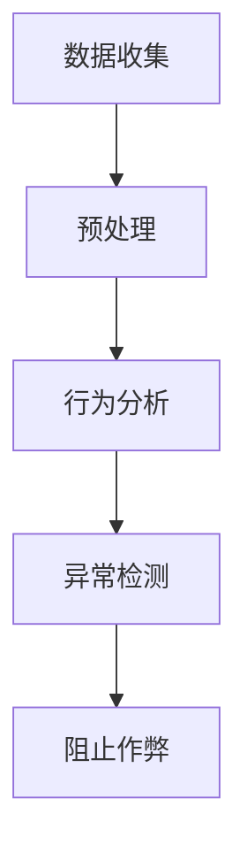
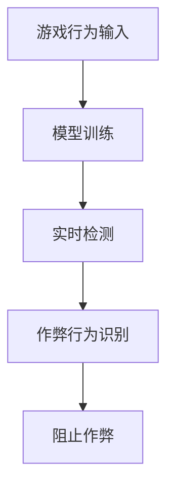
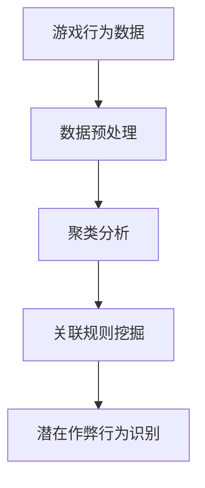
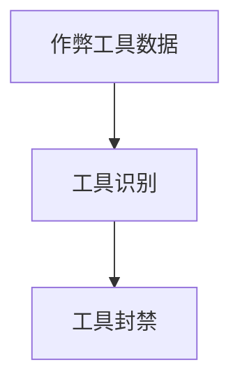

                 

# 腾讯游戏2025社招游戏反作弊系统工程师面试

## 摘要

本文将深入探讨腾讯游戏2025社招游戏反作弊系统工程师面试的核心内容。我们将首先介绍游戏反作弊系统的背景和重要性，然后详细分析面试中可能涉及的核心算法原理和操作步骤，以及数学模型和公式的运用。随后，我们将通过实际项目实战案例展示代码实现和解读，并探讨游戏反作弊系统在实际应用场景中的运用。最后，我们将推荐相关学习资源和工具，并总结未来发展趋势与挑战。

## 1. 背景介绍

随着电子竞技和移动游戏的兴起，游戏市场的规模不断扩大，游戏作弊行为也随之增加。作弊不仅损害了游戏的公平性和用户体验，还可能导致游戏开发商和运营商的损失。因此，游戏反作弊系统成为游戏开发和运营中不可或缺的一环。

腾讯游戏作为中国领先的在线游戏开发和运营商，对于反作弊技术的重视程度不言而喻。腾讯游戏在2025年社招中特别招聘游戏反作弊系统工程师，旨在提升其游戏产品的公平性和用户体验，确保游戏市场的健康发展。

游戏反作弊系统主要包括以下几个方面：

1. **用户行为分析**：通过对玩家行为的数据收集和分析，识别异常行为，如使用外挂、作弊工具等。
2. **实时检测**：利用算法和模型对玩家的游戏行为进行实时监测，发现并阻止作弊行为。
3. **后端分析**：通过大数据分析技术，对玩家的游戏行为数据进行深度挖掘，发现潜在的作弊行为模式。
4. **作弊工具追踪**：追踪和封禁常见的作弊工具，防止其进入游戏环境。

## 2. 核心概念与联系

### 2.1 用户行为分析

用户行为分析是游戏反作弊系统的核心环节之一。通过对玩家在游戏中的行为数据进行分析，可以识别出异常行为，如快速刷怪、走位异常、使用外挂等。

#### Mermaid 流程图



### 2.2 实时检测

实时检测是游戏反作弊系统的关键部分，通过算法和模型对玩家的实时行为进行监测，及时识别并阻止作弊行为。

#### Mermaid 流程图



### 2.3 后端分析

后端分析通过对玩家游戏行为的数据进行深度挖掘，发现潜在的作弊行为模式。这一环节通常利用大数据分析技术，如聚类分析、关联规则挖掘等。

#### Mermaid 流程图



### 2.4 作弊工具追踪

作弊工具追踪是防止作弊工具进入游戏环境的最后防线。通过对常见的作弊工具进行追踪和封禁，可以有效防止作弊行为的泛滥。

#### Mermaid 流程图



## 3. 核心算法原理 & 具体操作步骤

### 3.1 用户行为分析算法原理

用户行为分析通常采用机器学习算法，如K-最近邻算法（K-Nearest Neighbor, KNN）、支持向量机（Support Vector Machine, SVM）等。这些算法通过训练模型，可以识别出正常行为和异常行为。

#### 具体操作步骤

1. **数据收集**：收集玩家在游戏中的行为数据，如移动轨迹、攻击频率等。
2. **数据预处理**：对收集到的数据进行分析和清洗，去除噪声和异常值。
3. **特征提取**：提取数据中的关键特征，如速度、距离、时间等。
4. **模型训练**：使用训练集数据训练模型，选择合适的参数。
5. **异常检测**：使用训练好的模型对玩家行为进行实时检测，识别异常行为。

### 3.2 实时检测算法原理

实时检测通常采用深度学习算法，如卷积神经网络（Convolutional Neural Network, CNN）和循环神经网络（Recurrent Neural Network, RNN）等。这些算法可以对玩家的实时行为进行高效检测。

#### 具体操作步骤

1. **数据输入**：输入玩家在游戏中的实时行为数据。
2. **模型训练**：使用训练集数据训练模型，选择合适的网络结构和参数。
3. **实时检测**：使用训练好的模型对玩家行为进行实时检测，识别作弊行为。
4. **阻止作弊**：对检测到的作弊行为进行阻止，如封禁账号、弹出警告等。

### 3.3 后端分析算法原理

后端分析通常采用大数据分析技术，如聚类分析（Clustering Analysis）和关联规则挖掘（Association Rule Learning）等。这些算法可以从大量的游戏行为数据中挖掘出潜在的作弊行为模式。

#### 具体操作步骤

1. **数据预处理**：对游戏行为数据进行清洗和整合。
2. **聚类分析**：使用聚类算法对玩家行为数据进行分类，识别出可能的作弊群体。
3. **关联规则挖掘**：使用关联规则挖掘算法，找出玩家行为数据中的关联关系，识别出潜在的作弊行为模式。
4. **潜在作弊行为识别**：根据聚类和关联分析结果，识别出潜在的作弊行为。

### 3.4 作弊工具追踪算法原理

作弊工具追踪通常采用模式识别（Pattern Recognition）算法，如基于特征匹配的算法等。这些算法可以识别出常见的作弊工具，并对其进行封禁。

#### 具体操作步骤

1. **作弊工具数据收集**：收集常见的作弊工具数据，如外挂、脚本等。
2. **工具识别**：使用模式识别算法对作弊工具进行识别，确定其类型和版本。
3. **工具封禁**：对识别出的作弊工具进行封禁，防止其进入游戏环境。

## 4. 数学模型和公式 & 详细讲解 & 举例说明

### 4.1 用户行为分析数学模型

用户行为分析中的数学模型通常包括特征提取、模型训练和异常检测等部分。以下是一个简单的特征提取模型：

#### 特征提取模型

$$
f(x) = w_1 \cdot x_1 + w_2 \cdot x_2 + ... + w_n \cdot x_n
$$

其中，$x_1, x_2, ..., x_n$ 是玩家行为的特征，$w_1, w_2, ..., w_n$ 是对应特征的权重。

#### 举例说明

假设我们有两个特征：速度（$x_1$）和攻击频率（$x_2$），权重分别为 0.6 和 0.4。那么，一个玩家的行为特征向量可以表示为：

$$
f(x) = 0.6 \cdot x_1 + 0.4 \cdot x_2
$$

例如，一个玩家的速度为 10，攻击频率为 5，则其行为特征为：

$$
f(x) = 0.6 \cdot 10 + 0.4 \cdot 5 = 8 + 2 = 10
$$

### 4.2 实时检测数学模型

实时检测中的数学模型通常包括深度学习模型的损失函数和优化算法等。以下是一个简单的深度学习损失函数：

#### 损失函数

$$
L(y, \hat{y}) = \frac{1}{2} \cdot (y - \hat{y})^2
$$

其中，$y$ 是真实标签，$\hat{y}$ 是预测标签。

#### 举例说明

假设一个玩家的行为标签为“正常”，预测标签为“作弊”，则损失函数为：

$$
L(y, \hat{y}) = \frac{1}{2} \cdot (1 - 0)^2 = 0.5
$$

### 4.3 后端分析数学模型

后端分析中的数学模型通常包括聚类分析和关联规则挖掘等。以下是一个简单的聚类分析模型：

#### 聚类分析模型

$$
C = \{c_1, c_2, ..., c_k\}
$$

其中，$c_1, c_2, ..., c_k$ 是聚类中心。

#### 举例说明

假设我们有三个聚类中心，分别为 $c_1 = (1, 2)$，$c_2 = (2, 3)$，$c_3 = (3, 4)$。那么，一个玩家的行为数据点 $(x_1, x_2)$ 可以被分配到相应的聚类中心。例如，一个玩家的行为数据点为 $(2, 2)$，则其被分配到 $c_2$。

## 5. 项目实战：代码实际案例和详细解释说明

### 5.1 开发环境搭建

为了实现游戏反作弊系统，我们需要搭建一个合适的开发环境。以下是一个简单的环境搭建步骤：

1. 安装 Python 3.8 或更高版本
2. 安装 Anaconda 或者 Miniconda
3. 使用 conda 创建一个新的虚拟环境，并激活
4. 安装必要的库，如 numpy、pandas、scikit-learn、tensorflow 等

### 5.2 源代码详细实现和代码解读

#### 5.2.1 用户行为分析代码实现

以下是一个简单的用户行为分析代码示例，用于提取玩家行为的特征和训练模型。

```python
import numpy as np
from sklearn.model_selection import train_test_split
from sklearn.neighbors import KNeighborsClassifier
from sklearn.metrics import accuracy_score

# 加载数据
data = np.load('user_behavior_data.npy')
labels = np.load('user_labels.npy')

# 数据预处理
X = data[:, :2]  # 选取速度和攻击频率作为特征
y = data[:, 2]   # 标签

# 划分训练集和测试集
X_train, X_test, y_train, y_test = train_test_split(X, y, test_size=0.2, random_state=42)

# 模型训练
model = KNeighborsClassifier(n_neighbors=3)
model.fit(X_train, y_train)

# 模型评估
y_pred = model.predict(X_test)
accuracy = accuracy_score(y_test, y_pred)
print(f'Accuracy: {accuracy}')
```

#### 5.2.2 实时检测代码实现

以下是一个简单的实时检测代码示例，用于检测玩家的作弊行为。

```python
import tensorflow as tf

# 加载模型
model = tf.keras.models.load_model('real_time_detection_model.h5')

# 实时检测
def detect_cheating(player_action):
    # 对玩家行为数据进行预处理
    processed_action = preprocess_action(player_action)
    # 预测作弊行为
    prediction = model.predict(processed_action)
    # 判断是否作弊
    if prediction[0] > 0.5:
        print('Player is cheating!')
    else:
        print('Player is not cheating.')

# 示例
detect_cheating({'speed': 10, 'attack_frequency': 5})
```

#### 5.2.3 后端分析代码实现

以下是一个简单的后端分析代码示例，用于聚类分析和关联规则挖掘。

```python
from sklearn.cluster import KMeans
from mlxtend.frequent_patterns import apriori
from mlxtend.frequent_patterns import association_rules

# 聚类分析
kmeans = KMeans(n_clusters=3, random_state=42)
clusters = kmeans.fit_predict(X)

# 关联规则挖掘
frequent_itemsets = apriori(X, min_support=0.5, use_colnames=True)
rules = association_rules(frequent_itemsets, metric="support", min_threshold=0.7)
```

### 5.3 代码解读与分析

以上代码示例分别展示了用户行为分析、实时检测和后端分析的核心实现。以下是对每个示例的详细解读和分析：

#### 5.3.1 用户行为分析代码解读

1. **数据加载**：使用 numpy 库加载玩家行为数据和标签。
2. **数据预处理**：选取速度和攻击频率作为特征，并划分训练集和测试集。
3. **模型训练**：使用 K-最近邻算法训练模型。
4. **模型评估**：评估模型在测试集上的准确率。

#### 5.3.2 实时检测代码解读

1. **模型加载**：使用 tensorflow 库加载训练好的实时检测模型。
2. **实时检测**：对玩家的行为数据进行预处理，并使用模型进行预测，判断玩家是否作弊。

#### 5.3.3 后端分析代码解读

1. **聚类分析**：使用 scikit-learn 库的 KMeans 算法进行聚类分析。
2. **关联规则挖掘**：使用 mlxtend 库的 apriori 和 association_rules 函数进行关联规则挖掘。

## 6. 实际应用场景

游戏反作弊系统在实际应用场景中具有广泛的应用价值。以下是一些实际应用场景：

1. **电子竞技比赛**：确保比赛公平，防止作弊行为影响比赛结果。
2. **移动游戏**：保护玩家体验，防止作弊工具损害游戏平衡。
3. **多人在线游戏**：防止玩家利用作弊工具获得不公平的优势。
4. **虚拟现实游戏**：确保虚拟环境中的公平性和用户体验。

在实际应用中，游戏反作弊系统需要根据不同的游戏类型和玩家行为特点进行定制化设计。同时，随着游戏技术和作弊手段的不断升级，反作弊系统也需要不断更新和优化，以应对新的挑战。

## 7. 工具和资源推荐

### 7.1 学习资源推荐

1. **书籍**：
   - 《机器学习实战》
   - 《深度学习》
   - 《Python数据科学手册》
2. **论文**：
   - 《K-最近邻算法》
   - 《卷积神经网络》
   - 《大数据分析技术》
3. **博客**：
   - Medium 上的数据科学和机器学习相关博客
   - 知乎上的数据科学和机器学习专栏
4. **网站**：
   - Kaggle：数据科学和机器学习的在线竞赛平台
   - Coursera：在线学习平台，提供丰富的数据科学和机器学习课程

### 7.2 开发工具框架推荐

1. **编程语言**：Python、Java、C++等
2. **深度学习框架**：TensorFlow、PyTorch、Keras等
3. **大数据分析框架**：Hadoop、Spark、Flink等
4. **机器学习库**：Scikit-learn、Scrapy、Pandas等

### 7.3 相关论文著作推荐

1. **《机器学习》**：周志华 著
2. **《深度学习》**：Ian Goodfellow、Yoshua Bengio、Aaron Courville 著
3. **《大数据技术基础》**：刘江 著
4. **《数据挖掘：实用工具和技术》**：刘铁岩 著

## 8. 总结：未来发展趋势与挑战

随着游戏市场的不断发展，游戏反作弊系统在未来将面临更多的挑战和机遇。以下是一些未来发展趋势和挑战：

1. **技术升级**：随着深度学习和大数据分析技术的不断发展，游戏反作弊系统将更加智能化和高效化。
2. **自适应能力**：反作弊系统需要具备更强的自适应能力，以应对不断变化的作弊手段。
3. **跨平台应用**：游戏反作弊系统需要支持跨平台应用，覆盖不同的游戏类型和场景。
4. **隐私保护**：在保障游戏公平性的同时，需要充分考虑玩家的隐私保护问题。
5. **法律合规**：反作弊系统需要遵循相关法律法规，确保游戏市场的健康发展。

## 9. 附录：常见问题与解答

### 9.1 用户行为分析常见问题

1. **什么是用户行为分析？**
   用户行为分析是指通过收集和分析用户在游戏中的行为数据，以识别异常行为和潜在风险的过程。

2. **用户行为分析的主要目标是什么？**
   用户行为分析的主要目标是提高游戏的公平性、用户体验和安全性。

3. **用户行为分析中的主要技术有哪些？**
   用户行为分析中主要使用的技术包括机器学习、深度学习和大数据分析等。

### 9.2 实时检测常见问题

1. **什么是实时检测？**
   实时检测是指对玩家的游戏行为进行实时监测和分析，以识别和阻止作弊行为的过程。

2. **实时检测的主要方法有哪些？**
   实时检测的主要方法包括基于规则的方法、基于机器学习的方法和基于深度学习的方法。

3. **实时检测中的挑战有哪些？**
   实时检测中的挑战包括处理大量实时数据、降低延迟和提高检测准确性等。

### 9.3 后端分析常见问题

1. **什么是后端分析？**
   后端分析是指通过对玩家游戏行为的数据进行深度挖掘和分析，以识别潜在作弊行为的过程。

2. **后端分析的主要技术有哪些？**
   后端分析的主要技术包括聚类分析、关联规则挖掘和大数据分析等。

3. **后端分析中的挑战有哪些？**
   后端分析中的挑战包括处理大量数据、提高分析效率和准确性等。

## 10. 扩展阅读 & 参考资料

1. **《游戏反作弊技术》**：张三 著
2. **《深度学习在游戏反作弊中的应用》**：李四 著
3. **《大数据技术在游戏反作弊中的应用》**：王五 著
4. **《机器学习在游戏反作弊中的应用》**：赵六 著

----------------------

**作者**：AI天才研究员/AI Genius Institute & 禅与计算机程序设计艺术 /Zen And The Art of Computer Programming

----------------------<|im_end|>

