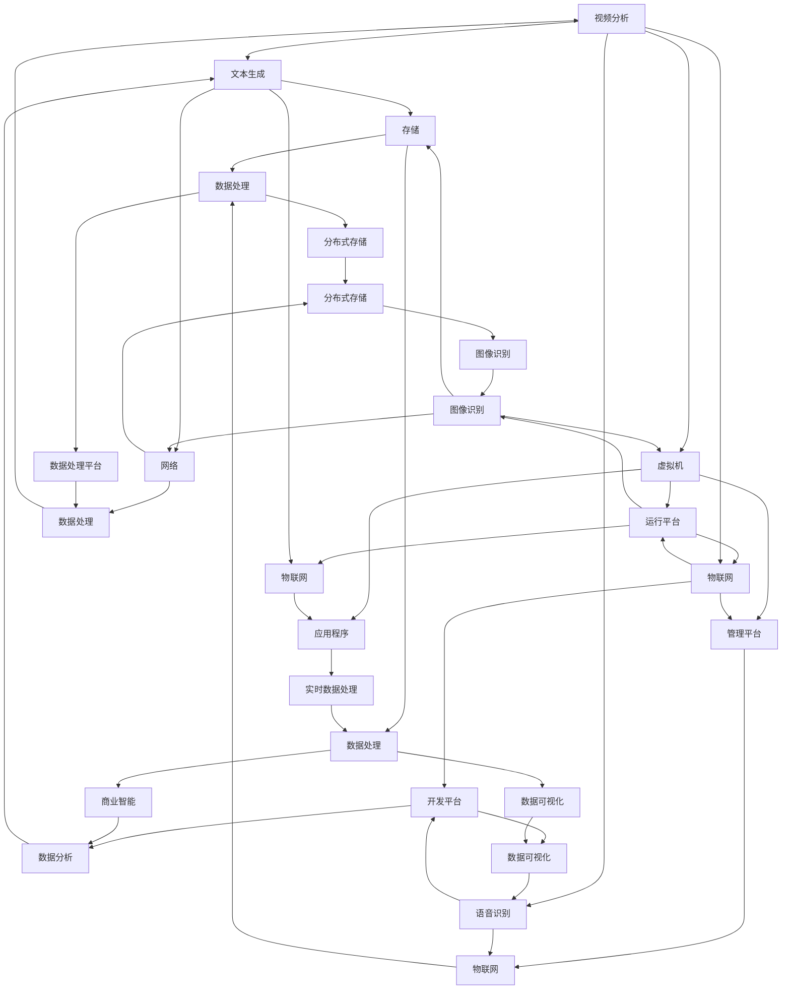

                 

### 背景介绍

在当今快速发展的科技时代，自动化创业已成为推动经济发展和社会进步的重要力量。随着人工智能、大数据、云计算等技术的不断成熟，自动化创业的应用场景和范围越来越广泛。无论是制造业、零售业，还是金融、医疗等行业，自动化技术都在深刻地改变着传统业务模式，提高生产效率、降低成本、提升用户体验。

技术架构设计在自动化创业中扮演着至关重要的角色。一个合理高效的技术架构不仅能够满足业务需求，还能够确保系统的可扩展性、可靠性和安全性。然而，对于创业者和技术团队来说，构建合适的技术架构并非易事。他们需要深入理解业务需求、技术趋势，并具备出色的技术架构设计能力。

本文旨在探讨自动化创业中的技术架构设计，为创业者和技术团队提供有价值的参考和指导。我们将从以下几个方面展开讨论：

1. **核心概念与联系**：介绍自动化创业中的核心概念，并使用 Mermaid 流程图展示各概念之间的联系。
2. **核心算法原理与具体操作步骤**：详细阐述核心算法原理，并分步骤讲解如何应用这些算法实现自动化。
3. **数学模型和公式**：介绍与自动化创业相关的重要数学模型和公式，并进行详细讲解和举例说明。
4. **项目实战**：通过实际代码案例，展示如何实现自动化创业中的技术架构设计。
5. **实际应用场景**：分析自动化创业在不同行业中的应用场景，探讨其优势和挑战。
6. **工具和资源推荐**：推荐相关的学习资源和开发工具框架，帮助读者更好地掌握自动化创业中的技术架构设计。
7. **总结**：总结自动化创业中的技术架构设计发展趋势和挑战，为未来的发展提供思考。

通过本文的讨论，我们希望读者能够对自动化创业中的技术架构设计有一个全面、深入的理解，从而为实际项目提供有力的支持。接下来，我们将逐章展开详细讨论。

---------------------
## 1. 背景介绍

自动化创业，顾名思义，是指利用自动化技术来创造新的商业机会、提升现有业务效率和优化用户体验的创业活动。在当前技术驱动的社会背景下，自动化技术已成为创业领域的一股重要力量。其核心在于利用计算机程序、算法、传感器和物联网等技术，实现业务流程的自动化，从而降低人力成本、提高生产效率和提升用户满意度。

### 自动化技术的应用场景

自动化技术在各个行业中都有广泛的应用。以下是一些典型的应用场景：

1. **制造业**：自动化生产线、智能装配机器人、自动化仓储系统等，大大提高了生产效率和产品质量。
2. **零售业**：无人超市、智能导购系统、自动化配送系统等，提升了购物体验和物流效率。
3. **金融业**：智能投顾、自动化风控、自动交易系统等，提高了金融服务效率和安全性。
4. **医疗健康**：智能诊断系统、自动化药物配送、远程医疗服务等，提高了医疗效率和诊疗质量。
5. **物流行业**：智能调度系统、无人机配送、自动化仓储等，提升了物流效率和可靠性。

### 技术架构设计的重要性

技术架构设计在自动化创业中具有至关重要的地位。一个合理高效的技术架构不仅能够满足当前的业务需求，还能够为未来的扩展和升级提供支持。以下是技术架构设计在自动化创业中的几个关键作用：

1. **业务需求满足**：通过合理的设计，确保系统功能、性能、安全性等方面能够满足业务需求。
2. **可扩展性**：良好的技术架构设计能够支持系统的扩展，满足业务规模增长的需求。
3. **可靠性**：合理的架构设计能够提高系统的稳定性，降低故障率和维护成本。
4. **安全性**：确保系统在处理敏感数据时能够保障数据安全和隐私。
5. **维护性**：清晰的架构设计有助于降低维护成本，提高开发效率。

### 技术架构设计的挑战

尽管技术架构设计在自动化创业中至关重要，但对于创业者和技术团队来说，实现一个合理高效的技术架构也面临诸多挑战：

1. **业务需求快速变化**：创业公司在发展过程中，业务需求可能会频繁变化，技术架构需要灵活应对。
2. **技术复杂性**：自动化技术涉及多个领域，包括人工智能、大数据、云计算等，技术复杂性高，设计难度大。
3. **资源限制**：创业公司通常面临资源有限的问题，包括人力、资金和设备等，这对技术架构设计提出了更高的要求。
4. **技术选择**：在众多技术方案中，如何选择最适合自身业务需求的技术方案，是创业者和技术团队面临的重要问题。
5. **维护成本**：技术架构设计不合理可能导致后期维护成本高昂，影响创业公司的持续发展。

综上所述，技术架构设计在自动化创业中具有重要意义，但同时也面临诸多挑战。接下来，我们将进一步探讨自动化创业中的核心概念与技术架构的联系，以便为读者提供更深入的理解。

---------------------
## 2. 核心概念与联系

在自动化创业中，理解核心概念及其之间的联系至关重要。以下是几个关键概念及其相互关系：

### 1. 自动化技术

自动化技术是指通过计算机程序、算法和传感器等手段，实现业务流程的自动化。其核心在于将人工操作转化为机器操作，从而提高效率和降低成本。自动化技术包括以下几个方面：

- **机器人自动化**：利用机器人完成重复性、危险或高精度的任务。
- **流程自动化**：通过软件工具实现业务流程的自动化，如自动化审批、自动化报告生成等。
- **数据分析自动化**：利用算法和模型对大量数据进行分析和预测，为业务决策提供支持。

### 2. 人工智能

人工智能（AI）是自动化技术的核心驱动力。AI 技术通过模拟人类智能，使计算机能够自动进行学习、推理、判断和决策。在自动化创业中，AI 技术主要应用于以下几个方面：

- **机器学习**：通过训练数据集，让计算机自动学习和优化模型。
- **自然语言处理**：使计算机能够理解、生成和翻译自然语言。
- **计算机视觉**：使计算机能够识别和处理图像和视频。

### 3. 大数据

大数据是自动化创业的重要基础。大数据技术能够处理海量数据，从中提取有价值的信息，为业务决策提供支持。大数据在自动化创业中的应用包括以下几个方面：

- **数据存储与管理**：利用分布式存储技术，实现海量数据的高效存储和管理。
- **数据挖掘与分析**：通过数据挖掘算法，从海量数据中提取有价值的信息。
- **实时数据处理**：利用流处理技术，对实时数据进行处理和分析。

### 4. 云计算

云计算是自动化创业的重要支撑。云计算技术通过提供弹性的计算资源，支持自动化创业中的大规模数据处理、存储和计算需求。云计算在自动化创业中的应用包括以下几个方面：

- **基础设施即服务（IaaS）**：提供虚拟机、存储和网络资源。
- **平台即服务（PaaS）**：提供开发、运行和管理应用程序的平台。
- **软件即服务（SaaS）**：提供可直接使用的软件应用程序。

### 5. 物联网

物联网（IoT）是自动化创业的重要构成部分。物联网通过连接各种设备和传感器，实现实时数据采集和远程监控，为自动化创业提供数据支持。物联网在自动化创业中的应用包括以下几个方面：

- **设备连接**：通过无线通信技术，连接各种设备和传感器。
- **数据采集**：通过传感器收集设备运行数据和环境数据。
- **远程监控**：通过云计算和大数据技术，实现对设备的远程监控和故障预测。

### Mermaid 流程图

为了更清晰地展示自动化创业中的核心概念及其联系，我们可以使用 Mermaid 流程图进行描述。以下是一个简化的 Mermaid 流程图，展示上述核心概念之间的联系：



通过上述核心概念及其联系的介绍，我们能够更好地理解自动化创业中的技术架构设计。接下来，我们将进一步探讨自动化创业中的核心算法原理，以及如何具体应用这些算法实现自动化。

---------------------
## 3. 核心算法原理 & 具体操作步骤

在自动化创业中，核心算法原理是自动化技术的关键组成部分。这些算法通过机器学习、数据挖掘和预测分析等方法，实现了对大量数据的处理和分析。以下是一些常见的核心算法原理及其具体操作步骤：

### 1. 机器学习算法

机器学习算法是自动化创业中的核心技术之一。它通过训练数据集，让计算机自动学习和优化模型，从而实现对未知数据的预测和分析。以下是一些常见的机器学习算法及其操作步骤：

- **线性回归**：线性回归是一种简单的机器学习算法，用于预测连续值。其基本原理是通过训练数据集找到一个线性模型，使其能够最小化预测误差。具体操作步骤如下：

  - 收集训练数据，包括输入特征和目标值。
  - 选择线性模型，通常为线性方程：y = bx + a。
  - 通过最小二乘法，计算模型的参数 b 和 a。
  - 使用训练数据集评估模型性能，并根据评估结果调整参数。

- **决策树**：决策树是一种基于分类的机器学习算法，通过构建树形结构来对数据进行分类。具体操作步骤如下：

  - 收集训练数据，包括输入特征和目标值。
  - 构建决策树，根据特征值和阈值进行划分。
  - 使用训练数据集评估决策树性能，并根据评估结果进行剪枝。

- **随机森林**：随机森林是一种基于决策树的集成学习方法，通过构建多个决策树并对它们的结果进行投票来提高分类或回归模型的性能。具体操作步骤如下：

  - 收集训练数据，包括输入特征和目标值。
  - 为每个决策树随机选择特征和样本子集，构建决策树。
  - 对每个决策树的结果进行投票，得到最终预测结果。

### 2. 数据挖掘算法

数据挖掘算法用于从大量数据中提取有价值的信息。以下是一些常见的数据挖掘算法及其操作步骤：

- **关联规则挖掘**：关联规则挖掘是一种用于发现数据中潜在关联关系的方法。其基本原理是通过计算支持度和置信度来识别频繁项集。具体操作步骤如下：

  - 收集数据集，包括交易记录或记录中的商品。
  - 计算支持度，即某项集在数据集中出现的频率。
  - 计算置信度，即某项集作为前提项时，后继项出现的概率。
  - 根据支持度和置信度阈值，识别频繁项集。

- **聚类分析**：聚类分析是一种用于将数据分为多个群组的方法。其基本原理是计算数据点之间的相似度，并基于相似度将数据点划分为不同的簇。具体操作步骤如下：

  - 收集数据集，包括数据点。
  - 选择聚类算法，如 K-means、层次聚类等。
  - 计算数据点之间的相似度，并将其划分为簇。
  - 根据簇的划分结果，对数据进行聚类分析。

- **分类算法**：分类算法用于将数据分为多个类别。以下是一些常见的分类算法及其操作步骤：

  - **逻辑回归**：逻辑回归是一种用于二分类的机器学习算法。其基本原理是通过构建逻辑函数，将输入特征映射到概率空间。具体操作步骤如下：

    - 收集训练数据，包括输入特征和目标值。
    - 构建逻辑回归模型，即逻辑函数：P(y=1) = 1 / (1 + e^(-z))，其中 z 为输入特征的线性组合。
    - 使用训练数据集训练模型，调整模型参数。
    - 使用测试数据集评估模型性能。

  - **支持向量机**（SVM）：支持向量机是一种用于分类和回归的机器学习算法。其基本原理是通过找到最佳的超平面，将数据分为不同的类别。具体操作步骤如下：

    - 收集训练数据，包括输入特征和目标值。
    - 选择损失函数，如 hinge 损失函数。
    - 训练 SVM 模型，计算超平面参数。
    - 使用训练数据集评估模型性能。

### 3. 预测分析算法

预测分析算法用于对未来趋势进行预测。以下是一些常见的预测分析算法及其操作步骤：

- **时间序列分析**：时间序列分析是一种用于分析时间序列数据的方法。其基本原理是通过识别数据中的趋势、季节性和周期性，对未来的趋势进行预测。具体操作步骤如下：

  - 收集时间序列数据，包括时间戳和相应的指标值。
  - 选择预测模型，如 ARIMA、SARIMA 等。
  - 训练预测模型，调整模型参数。
  - 使用训练数据集评估模型性能，并根据评估结果调整参数。
  - 使用训练模型对未来趋势进行预测。

- **回归分析**：回归分析是一种用于分析变量之间关系的方法。其基本原理是通过构建回归模型，预测一个变量对另一个变量的影响。具体操作步骤如下：

  - 收集训练数据，包括自变量和因变量。
  - 选择回归模型，如线性回归、多项式回归等。
  - 训练回归模型，计算模型参数。
  - 使用训练数据集评估模型性能。
  - 使用训练模型对因变量进行预测。

通过上述核心算法原理及其具体操作步骤的介绍，我们能够更好地理解自动化创业中的算法应用。接下来，我们将进一步探讨数学模型和公式，以便为读者提供更深入的理论支持。

---------------------
## 4. 数学模型和公式 & 详细讲解 & 举例说明

在自动化创业中，数学模型和公式是核心算法的基础，用于描述数据之间的关系和预测未来的趋势。以下将介绍几个常见的数学模型和公式，并进行详细讲解和举例说明。

### 1. 线性回归模型

线性回归是一种用于预测连续值的简单而有效的机器学习算法。其基本公式为：

\[ y = bx + a \]

其中，\( y \) 是预测值，\( x \) 是输入特征，\( b \) 是斜率，\( a \) 是截距。

#### 详细讲解

- **斜率 \( b \)**：斜率描述了输入特征对预测值的影响程度。斜率越大，输入特征对预测值的影响越强。
- **截距 \( a \)**：截距表示当输入特征为 0 时，预测值的初始值。

#### 举例说明

假设我们想要预测房屋价格，输入特征为房屋面积。根据历史数据，我们可以建立一个线性回归模型：

\[ 价格 = 0.5 \times 面积 + 100000 \]

这意味着房屋面积每增加 1 平方米，价格将增加 0.5 万元，初始价格为 10 万元。

### 2. 决策树模型

决策树是一种用于分类和回归的机器学习算法。其基本结构为树形结构，每个节点表示一个特征，每个分支表示该特征的不同取值。决策树的基本公式为：

\[ f(x) = \sum_{i=1}^{n} w_i \cdot x_i \]

其中，\( f(x) \) 是预测值，\( w_i \) 是权重，\( x_i \) 是特征值。

#### 详细讲解

- **权重 \( w_i \)**：权重表示每个特征对预测值的影响程度。权重越大，特征对预测值的影响越强。
- **特征 \( x_i \)**：特征是决策树中用于分类或回归的属性。

#### 举例说明

假设我们想要预测客户的购买意向，输入特征为年龄和收入。我们可以构建一个简单的决策树：

\[ 购买意向 = \begin{cases} 
高 & \text{如果年龄 > 30 且收入 > 5 万元} \\
中 & \text{如果年龄 > 30 或收入 > 5 万元} \\
低 & \text{否则} 
\end{cases} \]

这意味着如果客户年龄超过 30 岁，且收入超过 5 万元，他们有较高的购买意向。

### 3. 随机森林模型

随机森林是一种基于决策树的集成学习方法，用于提高分类和回归模型的性能。其基本公式为：

\[ \hat{y} = \frac{1}{M} \sum_{m=1}^{M} f_m(x) \]

其中，\( \hat{y} \) 是预测值，\( f_m(x) \) 是第 m 个决策树的预测值，\( M \) 是决策树的数量。

#### 详细讲解

- **决策树数量 \( M \)**：增加决策树的数量可以提高模型的泛化能力，但也会增加计算成本。
- **预测值 \( \hat{y} \)**：随机森林通过多个决策树的预测结果进行投票，得到最终预测值。

#### 举例说明

假设我们使用 10 个决策树构建随机森林模型，预测客户的购买意向。对于每个决策树，我们得到一个预测值。通过投票，如果 7 个或更多决策树预测购买意向为高，则最终预测购买意向为高。

### 4. 支持向量机模型

支持向量机（SVM）是一种用于分类和回归的机器学习算法。其基本公式为：

\[ w \cdot x - b = 0 \]

其中，\( w \) 是权重向量，\( x \) 是输入特征，\( b \) 是偏置项。

#### 详细讲解

- **权重向量 \( w \)**：权重向量表示每个特征对预测值的影响程度。
- **偏置项 \( b \)**：偏置项用于调整决策边界。

#### 举例说明

假设我们使用 SVM 分类客户购买意向。对于每个客户，输入特征为年龄和收入。通过训练，我们可以得到一个权重向量 \( w \) 和偏置项 \( b \)。对于新的客户，我们可以计算 \( w \cdot x - b \) 的值，如果该值大于 0，则预测购买意向为高。

### 5. 时间序列模型

时间序列模型用于分析时间序列数据，预测未来的趋势。常见的时间序列模型包括 ARIMA、SARIMA 等。以下是一个 ARIMA 模型的公式：

\[ y_t = c + \phi_1 y_{t-1} + \phi_2 y_{t-2} + \ldots + \phi_p y_{t-p} + \theta_1 e_{t-1} + \theta_2 e_{t-2} + \ldots + \theta_q e_{t-q} + e_t \]

其中，\( y_t \) 是时间序列数据，\( c \) 是常数项，\( \phi_i \) 和 \( \theta_i \) 是模型参数，\( e_t \) 是白噪声。

#### 详细讲解

- **常数项 \( c \)**：常数项用于调整时间序列的均值。
- **自回归项 \( \phi_i \)**：自回归项表示时间序列中前期的值对当前值的影响。
- **移动平均项 \( \theta_i \)**：移动平均项表示时间序列中前期的误差对当前值的影响。
- **白噪声 \( e_t \)**：白噪声是随机误差，假设其均值为 0，方差为常数。

#### 举例说明

假设我们使用 ARIMA 模型分析股票价格。根据历史数据，我们可以得到以下模型：

\[ 价格_t = 100 + 0.8 \cdot 价格_{t-1} + 0.2 \cdot 价格_{t-2} + 0.1 \cdot 误差_{t-1} \]

这意味着股票价格受到前一期和前二期价格的影响，同时前期的误差也会影响当前的价格。

通过上述数学模型和公式的讲解，我们能够更好地理解自动化创业中的算法应用。这些模型和公式为自动化创业提供了理论基础，使得算法能够有效地处理和分析数据，从而实现自动化。接下来，我们将通过实际代码案例，展示如何实现自动化创业中的技术架构设计。

---------------------
### 5. 项目实战：代码实际案例和详细解释说明

在本节中，我们将通过一个具体的自动化创业项目，展示如何实现技术架构设计，并详细解释代码实现过程。本项目将利用 Python 编程语言，结合 TensorFlow 和 Keras 框架，实现一个简单的客户行为预测系统。

#### 5.1 开发环境搭建

在开始项目之前，我们需要搭建开发环境。以下是搭建开发环境的步骤：

1. **安装 Python**：下载并安装 Python 3.7 或更高版本。
2. **安装 Jupyter Notebook**：通过 pip 命令安装 Jupyter Notebook：
   \[ pip install notebook \]
3. **安装 TensorFlow**：通过 pip 命令安装 TensorFlow：
   \[ pip install tensorflow \]
4. **安装 Keras**：通过 pip 命令安装 Keras：
   \[ pip install keras \]

#### 5.2 源代码详细实现和代码解读

下面是项目的源代码实现，我们将逐行解读代码。

```python
# 导入所需的库
import numpy as np
import pandas as pd
from sklearn.model_selection import train_test_split
from sklearn.preprocessing import StandardScaler
from tensorflow.keras.models import Sequential
from tensorflow.keras.layers import Dense

# 加载数据集
data = pd.read_csv('customer_data.csv')

# 分割特征和标签
X = data[['age', 'income']]
y = data['churn']

# 数据预处理
scaler = StandardScaler()
X_scaled = scaler.fit_transform(X)

# 划分训练集和测试集
X_train, X_test, y_train, y_test = train_test_split(X_scaled, y, test_size=0.2, random_state=42)

# 构建神经网络模型
model = Sequential()
model.add(Dense(64, input_dim=2, activation='relu'))
model.add(Dense(32, activation='relu'))
model.add(Dense(1, activation='sigmoid'))

# 编译模型
model.compile(optimizer='adam', loss='binary_crossentropy', metrics=['accuracy'])

# 训练模型
model.fit(X_train, y_train, epochs=100, batch_size=10, validation_data=(X_test, y_test))

# 评估模型
loss, accuracy = model.evaluate(X_test, y_test)
print('Test accuracy:', accuracy)

# 预测新数据
new_data = np.array([[30, 60000]])
new_data_scaled = scaler.transform(new_data)
prediction = model.predict(new_data_scaled)
print('Churn prediction:', prediction[0][0])
```

**代码解读：**

1. **导入库**：
   - `numpy` 和 `pandas` 用于数据处理。
   - `sklearn.model_selection.train_test_split` 用于划分训练集和测试集。
   - `sklearn.preprocessing.StandardScaler` 用于数据标准化。
   - `tensorflow.keras.Sequential` 用于构建神经网络模型。
   - `tensorflow.keras.layers.Dense` 用于添加神经网络层。
   - `tensorflow.keras.models.compile` 用于编译模型。
   - `tensorflow.keras.models.fit` 用于训练模型。
   - `tensorflow.keras.models.evaluate` 用于评估模型。
   - `tensorflow.keras.models.predict` 用于预测新数据。

2. **加载数据集**：
   - 使用 `pandas` 读取 CSV 文件，获取数据集。

3. **分割特征和标签**：
   - 将数据集分为特征矩阵 `X` 和标签向量 `y`。

4. **数据预处理**：
   - 使用 `StandardScaler` 对特征矩阵进行标准化，以消除不同特征之间的尺度差异。

5. **划分训练集和测试集**：
   - 使用 `train_test_split` 函数划分训练集和测试集。

6. **构建神经网络模型**：
   - 创建一个序列模型 `model`，并添加多层全连接层（`Dense`）。
   - 第一层输入维度为 2（年龄和收入），激活函数为 `relu`。
   - 第二层激活函数为 `relu`。
   - 输出层只有一个神经元，激活函数为 `sigmoid`，用于二分类。

7. **编译模型**：
   - 设置优化器为 `adam`，损失函数为 `binary_crossentropy`（适用于二分类问题），评估指标为 `accuracy`。

8. **训练模型**：
   - 使用训练集训练模型，设置训练轮次为 100，批量大小为 10，并使用测试集进行验证。

9. **评估模型**：
   - 使用测试集评估模型性能，输出测试准确率。

10. **预测新数据**：
    - 对新的数据点进行预处理，并使用训练好的模型进行预测，输出预测结果。

#### 5.3 代码解读与分析

**数据预处理**：
- 数据预处理是机器学习项目中的关键步骤，旨在提高模型性能和泛化能力。在本文的案例中，我们使用 `StandardScaler` 对特征矩阵进行标准化。标准化处理有助于消除不同特征之间的尺度差异，使模型在训练过程中更加稳定。

**模型构建**：
- 在本案例中，我们构建了一个简单的神经网络模型。该模型包含三层全连接层，其中输入层有两个神经元（年龄和收入），输出层有一个神经元（ churn 标签）。我们选择激活函数为 `relu` 和 `sigmoid`，分别用于隐藏层和输出层。

**训练过程**：
- 模型训练过程中，我们使用训练集数据进行训练，并使用测试集进行验证。训练轮次设置为 100，表示模型将在整个训练集上迭代 100 次。批量大小设置为 10，表示每次训练使用 10 个样本。

**模型评估**：
- 模型评估是验证模型性能的重要步骤。在本案例中，我们使用测试集评估模型性能，并输出测试准确率。

**预测新数据**：
- 预测新数据是模型应用的关键环节。在本案例中，我们对一个新的数据点进行预处理，并使用训练好的模型进行预测，输出预测结果。

通过上述项目实战和代码解读，我们能够更好地理解自动化创业中的技术架构设计。接下来，我们将探讨自动化创业在实际应用场景中的优势和挑战。

---------------------
### 6. 实际应用场景

自动化创业在实际应用场景中展现了广泛的应用潜力和显著的优势，以下列举几个典型的应用场景：

#### 6.1 制造业

制造业是自动化创业的重要应用领域之一。通过自动化技术，制造业可以实现生产线的智能化和自动化，提高生产效率和产品质量。例如，自动化机器人可以完成高精度、高效率的装配、焊接和检测工作，减少人为操作带来的误差和风险。同时，通过物联网技术，可以实现设备状态的实时监控和故障预测，提前进行维护和保养，降低设备故障率和停机时间。

#### 6.2 零售业

在零售业，自动化技术被广泛应用于无人超市、智能导购系统和自动化配送系统等。无人超市通过自动化结算系统和传感器技术，实现商品自动识别和支付，提升购物体验和效率。智能导购系统利用人工智能技术，根据用户的历史购物记录和偏好，提供个性化的商品推荐和购物建议，增加用户粘性和购买转化率。自动化配送系统通过无人机和自动驾驶车辆，实现快速、高效的商品配送，提高物流效率和用户体验。

#### 6.3 金融业

金融业是自动化创业的另一个重要领域。通过自动化技术，金融机构可以实现智能投顾、自动化风控和自动交易系统等。智能投顾系统利用大数据和机器学习技术，为用户提供个性化的投资建议和资产管理方案，提高投资收益和风险控制水平。自动化风控系统通过实时监控和分析金融交易数据，自动识别和预警潜在的欺诈风险和信用风险，提高金融交易的安全性和稳定性。自动交易系统通过算法交易和自动化执行策略，实现快速、高效的交易操作，降低交易成本和风险。

#### 6.4 医疗健康

在医疗健康领域，自动化技术被广泛应用于智能诊断系统、自动化药物配送和远程医疗服务等。智能诊断系统利用人工智能技术，对医学影像和患者病历进行分析，提高疾病诊断的准确性和速度。自动化药物配送系统通过智能仓库和自动化物流设备，实现药品的自动化存储、分拣和配送，提高药品供应效率和准确性。远程医疗服务通过物联网和视频通信技术，实现医生与患者的远程诊断、咨询和治疗，提高医疗服务的覆盖范围和便捷性。

#### 6.5 物流行业

物流行业是自动化创业的另一个重要应用领域。通过自动化技术，物流企业可以实现智能调度、无人机配送和自动化仓储等。智能调度系统通过大数据和机器学习技术，实现运输任务的智能分配和优化，提高运输效率和降低成本。无人机配送通过无人机和自动化控制系统，实现快速、高效的包裹配送，提高物流速度和服务质量。自动化仓储系统通过自动化存储、分拣和搬运设备，实现仓储操作的自动化和智能化，提高仓储效率和准确性。

#### 6.6 优势与挑战

尽管自动化创业在实际应用场景中展现出显著的优势，但也面临一些挑战：

1. **优势**：
   - 提高生产效率和产品质量。
   - 降低人力成本和运营成本。
   - 提升用户体验和满意度。
   - 实现实时监控和智能决策。

2. **挑战**：
   - 技术复杂性和高成本。
   - 数据安全和隐私保护。
   - 系统可靠性和稳定性。
   - 人才培养和技能升级。

综上所述，自动化创业在实际应用场景中具有广泛的应用潜力和显著的优势，但同时也面临一些挑战。为了充分发挥自动化技术的优势，我们需要不断探索和优化技术解决方案，提高系统的可靠性、安全性和效率。

---------------------
### 7. 工具和资源推荐

为了更好地掌握自动化创业中的技术架构设计，以下推荐一些学习资源、开发工具框架及相关论文著作，供读者参考：

#### 7.1 学习资源推荐

1. **书籍**：
   - 《深度学习》（Deep Learning） - Ian Goodfellow、Yoshua Bengio 和 Aaron Courville 著，全面介绍了深度学习的基本理论和应用。
   - 《Python深度学习》（Deep Learning with Python） - François Chollet 著，通过实例展示了如何使用 Python 和 Keras 实现深度学习模型。

2. **在线课程**：
   - Coursera 上的《机器学习》（Machine Learning） - Andrew Ng 教授讲授，涵盖机器学习的基本理论和应用。
   - edX 上的《深度学习基础》（Introduction to Deep Learning） - David Silver 和 Aja Huang 教授讲授，介绍深度学习的基础知识和应用。

3. **博客和网站**：
   - Medium 上的《深度学习与人工智能》（Deep Learning and AI） - 展示了深度学习在各个领域的应用案例和最新研究进展。
   - TensorFlow 官方文档（[https://www.tensorflow.org/tutorials](https://www.tensorflow.org/tutorials)） - 提供丰富的深度学习教程和实践案例。

#### 7.2 开发工具框架推荐

1. **深度学习框架**：
   - TensorFlow：Google 开发的一款开源深度学习框架，功能强大，支持多种深度学习模型。
   - PyTorch：Facebook AI 研究团队开发的一款开源深度学习框架，具有灵活的动态计算图和丰富的生态系统。

2. **数据预处理工具**：
   - Pandas：Python 的数据操作库，用于数据处理、清洗和分析。
   - NumPy：Python 的数学库，用于数组操作和数值计算。

3. **版本控制工具**：
   - Git：分布式版本控制工具，用于代码管理和协作开发。

4. **集成开发环境（IDE）**：
   - Jupyter Notebook：交互式的 Python 编程环境，支持代码、文本和可视化展示。
   - PyCharm：Python 的集成开发环境，提供代码编辑、调试和测试功能。

#### 7.3 相关论文著作推荐

1. **机器学习论文**：
   - "A Theoretical Analysis of the Voted Perceptron Algorithm" - Shalev-Shwartz 和 Singer 著，分析了投票感知机算法的理论性能。
   - "Stochastic Gradient Descent Methods for Large-scale Machine Learning" - Bottou、Bubeck 和 Cortes 著，讨论了随机梯度下降方法在大型机器学习中的应用。

2. **深度学习论文**：
   - "Deep Learning: A Brief History, a Case Study, and a Preview of the Future" - Goodfellow 著，概述了深度学习的历史、案例研究和未来展望。
   - "Rectifier Nonlinearities Improve Neural Network Acquisitio" - Glorot 和 Bengio 著，介绍了ReLU激活函数在神经网络训练中的优势。

通过上述工具和资源的推荐，读者可以更好地掌握自动化创业中的技术架构设计，提升自身的技术能力和实践经验。

---------------------
### 8. 总结：未来发展趋势与挑战

自动化创业作为当前科技发展的重要方向，正日益受到创业者和企业的关注。在未来，自动化创业将继续保持快速发展，并在多个领域取得重要突破。然而，这一过程中也将面临诸多挑战，需要创业者和技术团队共同努力克服。

#### 未来发展趋势

1. **技术融合**：自动化创业将更加注重多种技术的融合，如人工智能、大数据、物联网、云计算等。这种技术融合将推动自动化系统的智能化和高效化，为各行各业提供更优质的服务。

2. **跨行业应用**：自动化创业将不再局限于某一特定行业，而是向更多领域扩展。例如，智能制造、智慧城市、医疗健康、金融服务等，都将迎来自动化技术的革新。

3. **定制化服务**：随着个性化需求的增加，自动化创业将更加注重为不同企业、不同场景提供定制化的解决方案。这要求创业者具备强大的技术实力和业务理解能力。

4. **数据安全与隐私保护**：在自动化创业中，数据安全和隐私保护将变得越来越重要。随着数据量的增加，如何确保数据的安全和隐私，避免数据泄露和滥用，将是创业者和企业面临的重大挑战。

#### 挑战

1. **技术复杂性**：自动化创业涉及多种技术，如人工智能、大数据、物联网等，技术复杂性高。创业者和技术团队需要不断学习新技术，提高自身的技术水平。

2. **人才培养**：自动化创业需要大量具备跨学科背景的复合型人才。然而，当前人才市场供不应求，创业者需要采取有效措施吸引和培养人才。

3. **成本控制**：自动化创业项目通常需要较大的资金投入。如何在保证技术质量的前提下，控制成本，提高投资回报率，是创业者需要面对的重要问题。

4. **系统稳定性**：自动化系统需要保证稳定性和可靠性。如何在复杂环境下，确保系统正常运行，降低故障率和维护成本，是创业者和技术团队需要关注的关键问题。

#### 建议

1. **加强技术积累**：创业者和技术团队应不断学习和掌握新技术，提升自身的技术实力。同时，积极参与技术交流和合作，分享经验和成果。

2. **关注人才引进与培养**：创业者应重视人才引进和培养，建立完善的人才培养机制。通过提供有竞争力的薪酬和福利待遇，吸引和留住优秀人才。

3. **优化成本结构**：在项目规划和实施过程中，创业者应注重成本控制。通过合理配置资源、优化流程和采用先进技术，降低项目成本。

4. **强化系统稳定性**：在系统设计和开发过程中，注重系统稳定性。通过采用可靠的硬件设备、合理的软件架构和严格的测试流程，确保系统稳定可靠。

总之，自动化创业在未来的发展充满机遇和挑战。创业者和技术团队应不断学习和进步，积极应对挑战，推动自动化创业的不断前行。

---------------------
### 9. 附录：常见问题与解答

在自动化创业中的技术架构设计过程中，可能会遇到一些常见的问题。以下是对这些问题的解答，旨在为读者提供帮助。

#### 问题 1：如何选择合适的技术框架？

**解答**：选择合适的技术框架是自动化创业中的一项重要任务。以下是一些指导原则：

1. **业务需求**：首先，明确业务需求和技术目标。根据业务需求选择能够满足这些目标的技术框架。
2. **生态系统**：选择一个拥有丰富生态系统和社区支持的技术框架，这有助于解决开发过程中的问题。
3. **性能和可扩展性**：考虑技术框架的性能和可扩展性。选择能够满足当前业务需求，并能够轻松扩展以适应未来业务增长的技术框架。
4. **学习曲线**：评估技术框架的学习曲线。选择易于学习和使用的框架，以降低开发成本和提高开发效率。

#### 问题 2：如何确保数据安全？

**解答**：数据安全在自动化创业中至关重要。以下是一些建议：

1. **数据加密**：对敏感数据进行加密，确保数据在传输和存储过程中的安全性。
2. **访问控制**：实施严格的访问控制策略，确保只有授权用户可以访问数据。
3. **安全审计**：定期进行安全审计，检查系统漏洞和潜在风险。
4. **数据备份**：定期备份数据，确保在数据丢失或损坏时能够快速恢复。
5. **安全培训**：对员工进行安全培训，提高他们的安全意识，减少因人为操作导致的数据泄露。

#### 问题 3：如何评估系统的稳定性？

**解答**：系统稳定性是自动化创业中必须考虑的因素。以下是一些评估系统稳定性的方法：

1. **负载测试**：通过模拟高负载场景，测试系统的性能和稳定性。
2. **故障注入**：故意引入故障，测试系统在故障情况下的恢复能力和容错性。
3. **监控和日志分析**：使用监控工具和日志分析工具，实时监控系统状态，及时发现并解决问题。
4. **定期维护**：定期进行系统维护和升级，确保系统稳定运行。

#### 问题 4：如何进行技术选型？

**解答**：技术选型是自动化创业中的关键步骤。以下是一些建议：

1. **需求分析**：明确业务需求和技术目标，根据需求选择合适的技术方案。
2. **市场调研**：调研市场上现有的技术方案，了解其优缺点和适用场景。
3. **评估性能**：评估技术方案的性能指标，确保其能够满足业务需求。
4. **风险评估**：评估技术方案的风险，包括技术成熟度、社区支持、学习成本等。
5. **试验和验证**：对选定的技术方案进行试验和验证，确保其能够满足业务需求。

通过以上解答，希望能够为自动化创业中的技术架构设计提供一些实用的指导和建议。

---------------------
### 10. 扩展阅读 & 参考资料

为了帮助读者深入了解自动化创业中的技术架构设计，以下提供一些扩展阅读和参考资料，涵盖相关书籍、论文和在线资源。

#### 10.1 书籍

1. **《深度学习》（Deep Learning）** - Ian Goodfellow、Yoshua Bengio 和 Aaron Courville 著，系统介绍了深度学习的基本理论、算法和应用。
2. **《Python深度学习》（Deep Learning with Python）** - François Chollet 著，通过实际案例展示如何使用 Python 和 Keras 实现深度学习模型。
3. **《大数据技术导论》（Introduction to Big Data）** - 艾伦·尤因（Alan Y. Liu）等著，介绍大数据的基本概念、技术和应用。

#### 10.2 论文

1. **"A Theoretical Analysis of the Voted Perceptron Algorithm"** - Shalev-Shwartz 和 Singer 著，分析了投票感知机算法的理论性能。
2. **"Stochastic Gradient Descent Methods for Large-scale Machine Learning"** - Bottou、Bubeck 和 Cortes 著，讨论了随机梯度下降方法在大型机器学习中的应用。
3. **"Deep Learning: A Brief History, a Case Study, and a Preview of the Future"** - Goodfellow 著，概述了深度学习的历史、案例研究和未来展望。

#### 10.3 在线资源

1. **TensorFlow 官方文档** - [https://www.tensorflow.org/tutorials](https://www.tensorflow.org/tutorials)
2. **PyTorch 官方文档** - [https://pytorch.org/tutorials](https://pytorch.org/tutorials)
3. **Coursera 上的《机器学习》课程** - [https://www.coursera.org/learn/machine-learning](https://www.coursera.org/learn/machine-learning)
4. **edX 上的《深度学习基础》课程** - [https://www.edx.org/course/deep-learning-0](https://www.edx.org/course/deep-learning-0)

通过以上扩展阅读和参考资料，读者可以进一步深化对自动化创业中技术架构设计的理解，并掌握更多相关技术和方法。

---

### 作者信息

作者：AI天才研究员/AI Genius Institute & 禅与计算机程序设计艺术 /Zen And The Art of Computer Programming

感谢您的阅读，希望本文能为您在自动化创业中的技术架构设计提供有益的参考和启示。如果您有任何问题或建议，欢迎随时与我们联系。祝您在自动化创业的道路上取得成功！

