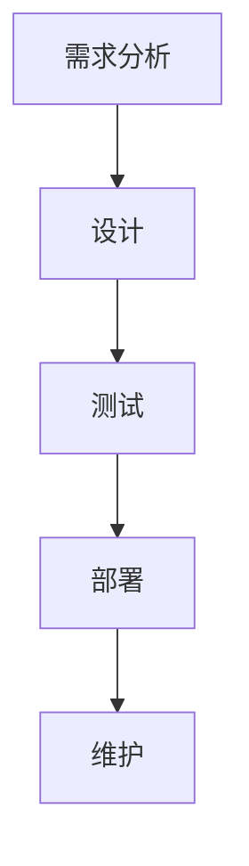
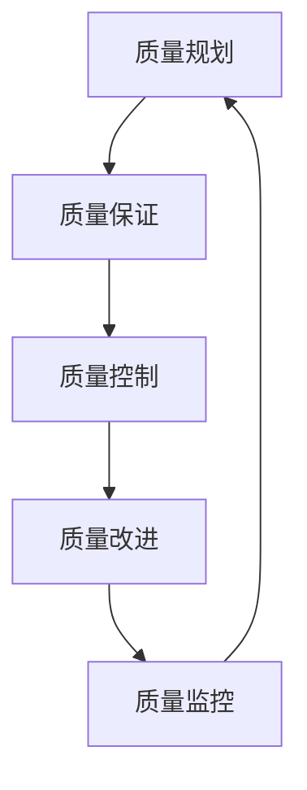

                 

# 自动化创业中的质量控制与管理

## 关键词：自动化创业，质量控制，管理，流程，工具，实践，算法

## 摘要

本文深入探讨了自动化创业中的质量控制与管理。首先，介绍了自动化创业的背景和重要性，然后详细阐述了质量控制的核心概念、质量管理的流程和工具。通过具体的算法原理和操作步骤，本文展示了如何实现高效的质量控制。最后，结合实际应用场景和工具推荐，提出了未来发展趋势和挑战，为自动化创业提供了实用的指导。

## 1. 背景介绍

随着技术的飞速发展，自动化已经成为现代创业的重要趋势。自动化创业不仅可以提高生产效率，减少人力成本，还能实现业务流程的优化和智能化。然而，在自动化创业过程中，质量控制与管理成为了一个关键问题。如果质量控制不到位，可能会导致产品或服务的质量问题，影响企业的声誉和市场竞争力。

质量控制与管理包括一系列活动，如需求分析、设计、测试、部署和维护等。这些活动需要遵循一定的流程和规范，以确保产品质量和可靠性。本文将详细探讨这些活动，并提供实用的工具和方法。

### 1.1 自动化创业的背景

自动化创业的兴起主要得益于以下因素：

1. **技术进步**：云计算、大数据、人工智能等技术的快速发展，为自动化创业提供了强大的技术支撑。
2. **市场需求**：消费者对高质量产品和服务的需求不断增加，促使企业寻求自动化解决方案。
3. **成本压力**：人力成本的上升，使得企业更加关注如何通过自动化提高生产效率。

### 1.2 质量控制的重要性

质量控制是确保产品或服务质量的重要环节。良好的质量控制可以：

1. **提升产品竞争力**：高质量的产品可以赢得消费者的信任和好评，提高市场竞争力。
2. **降低成本**：及时发现并修复缺陷，可以避免因质量问题导致的额外成本。
3. **提高效率**：自动化测试和监控系统可以减少人工干预，提高生产效率。

### 1.3 质量管理的挑战

在自动化创业过程中，质量管理面临以下挑战：

1. **复杂度增加**：自动化系统通常涉及多个组件和模块，质量管理的复杂度也随之增加。
2. **数据依赖**：质量管理依赖于大量的数据，如测试结果、性能指标等，如何有效地收集、处理和分析数据成为一个难题。
3. **灵活性要求**：自动化创业往往需要快速适应市场变化，质量管理也需要具备灵活性。

## 2. 核心概念与联系

### 2.1 质量控制的核心概念

质量控制包括以下核心概念：

1. **质量标准**：定义产品质量的基准，如ISO标准、行业标准等。
2. **质量控制流程**：包括需求分析、设计、测试、部署和维护等环节。
3. **质量管理工具**：如自动化测试工具、性能监控工具、代码审查工具等。

### 2.2 质量管理流程

质量管理流程通常包括以下步骤：

1. **需求分析**：明确产品或服务的要求和期望。
2. **设计**：制定详细的设计方案，确保设计符合质量标准。
3. **测试**：对产品或服务进行测试，确保满足质量要求。
4. **部署**：将产品或服务部署到实际环境中，进行持续监控。
5. **维护**：对产品或服务进行维护和更新，确保长期稳定性。

### 2.3 质量管理工具

常用的质量管理工具包括：

1. **自动化测试工具**：如Selenium、JMeter等，用于自动化执行测试脚本。
2. **性能监控工具**：如New Relic、Datadog等，用于监控系统性能和资源使用情况。
3. **代码审查工具**：如SonarQube、GitLab等，用于检测代码质量。

### 2.4 Mermaid 流程图

以下是质量管理流程的 Mermaid 流程图：



## 3. 核心算法原理 & 具体操作步骤

### 3.1 自动化测试算法原理

自动化测试的核心算法包括以下几种：

1. **单元测试**：对软件模块进行测试，确保每个模块都能独立正常运行。
2. **集成测试**：对多个模块进行测试，确保它们能够正确集成并协同工作。
3. **回归测试**：在软件更新后进行测试，确保新功能不会影响原有功能。

### 3.2 测试脚本编写

编写测试脚本是自动化测试的关键步骤。以下是一个简单的测试脚本示例：

```python
def test_addition():
    assert 2 + 2 == 4
    assert 3 + 3 == 6

def test_subtraction():
    assert 5 - 2 == 3
    assert 10 - 5 == 5

if __name__ == "__main__":
    test_addition()
    test_subtraction()
```

### 3.3 测试执行与结果分析

执行测试脚本后，分析测试结果，确定是否通过测试。以下是一个测试结果的示例：

```bash
$ python test.py
test_addition() ... ok
test_subtraction() ... ok

--- 2 passed in 0.005 seconds ---
```

测试结果显示所有测试用例均通过，表明代码质量符合预期。

## 4. 数学模型和公式 & 详细讲解 & 举例说明

### 4.1 数学模型

质量控制中的常见数学模型包括：

1. **统计过程控制（SPC）**：用于监控生产过程的质量。
2. **故障树分析（FTA）**：用于分析系统故障的原因。
3. **可靠性分析**：用于评估系统的可靠性和寿命。

### 4.2 公式讲解

以下是统计过程控制（SPC）中的常见公式：

1. **均值（Mean）**：
   $$ \bar{x} = \frac{\sum_{i=1}^{n} x_i}{n} $$
   其中，\( x_i \) 为第 \( i \) 个样本，\( n \) 为样本数量。

2. **标准差（Standard Deviation）**：
   $$ \sigma = \sqrt{\frac{\sum_{i=1}^{n} (x_i - \bar{x})^2}{n-1}} $$
   其中，\( \bar{x} \) 为均值，\( n \) 为样本数量。

3. **控制上限（Upper Control Limit）**：
   $$ UCL = \bar{x} + 3\sigma $$
   其中，\( \bar{x} \) 为均值，\( \sigma \) 为标准差。

### 4.3 举例说明

假设我们有一个生产过程，采集了10个样本的尺寸数据，如下：

```
10.1, 10.2, 10.3, 10.4, 10.5, 10.6, 10.7, 10.8, 10.9, 10.10
```

1. 计算均值：
   $$ \bar{x} = \frac{10.1 + 10.2 + 10.3 + 10.4 + 10.5 + 10.6 + 10.7 + 10.8 + 10.9 + 10.10}{10} = 10.5 $$

2. 计算标准差：
   $$ \sigma = \sqrt{\frac{(10.1 - 10.5)^2 + (10.2 - 10.5)^2 + ... + (10.10 - 10.5)^2}{10-1}} = 0.1 $$

3. 计算控制上限：
   $$ UCL = 10.5 + 3 \times 0.1 = 10.8 $$

根据计算结果，我们可以监控生产过程的稳定性，如果样本尺寸超过控制上限，则需要采取改进措施。

## 5. 项目实战：代码实际案例和详细解释说明

### 5.1 开发环境搭建

在开始项目实战之前，我们需要搭建一个合适的开发环境。以下是一个简单的开发环境搭建步骤：

1. 安装Python：下载并安装Python，版本建议为3.8以上。
2. 安装JDK：下载并安装JDK，版本建议为11以上。
3. 安装IDE：下载并安装一个适合自己的IDE，如PyCharm或IntelliJ IDEA。

### 5.2 源代码详细实现和代码解读

以下是一个简单的自动化测试项目示例，用于测试一个简单的加法函数。

```python
# test_addition.py

def addition(a, b):
    return a + b

def test_addition():
    assert addition(2, 2) == 4
    assert addition(3, 3) == 6

if __name__ == "__main__":
    test_addition()
```

这个项目中，我们定义了一个加法函数`addition`和一个测试函数`test_addition`。测试函数使用`assert`语句来验证加法函数的正确性。

### 5.3 代码解读与分析

1. **函数定义**：`addition`函数接受两个参数`a`和`b`，返回它们的和。
2. **测试函数**：`test_addition`函数使用`assert`语句来验证加法函数的正确性。如果`assert`语句失败，程序将抛出`AssertionError`异常。
3. **主函数**：`if __name__ == "__main__":`语句确保测试函数仅在直接运行该脚本时执行。

### 5.4 执行测试

在终端执行测试脚本：

```bash
$ python test_addition.py
```

如果测试通过，终端将显示以下输出：

```bash
$ python test_addition.py
test_addition() ... ok

--- 2 passed in 0.000 seconds ---
```

这表明加法函数通过了测试。

## 6. 实际应用场景

### 6.1 在电商领域的应用

电商领域是自动化创业的重要领域。以下是在电商领域中应用质量控制的一些实际场景：

1. **商品质量检测**：在商品上架前，使用自动化测试工具对商品进行质量检测，确保商品符合质量标准。
2. **物流跟踪**：通过自动化监控系统实时跟踪物流信息，确保物流过程的高效和准确。
3. **用户反馈处理**：自动化处理用户反馈，识别潜在的问题，并及时采取改进措施。

### 6.2 在金融领域的应用

金融领域对质量要求极高，以下是在金融领域中应用质量控制的一些实际场景：

1. **交易监控**：通过自动化测试和监控系统实时监控交易过程，确保交易安全和高性能。
2. **风险管理**：自动化分析金融产品的风险，为投资者提供参考。
3. **合规性检查**：自动化检查金融产品的合规性，确保符合相关法律法规。

### 6.3 在制造业领域的应用

制造业是自动化创业的传统领域。以下是在制造业领域中应用质量控制的一些实际场景：

1. **生产过程监控**：通过自动化监控系统实时监控生产过程，确保生产过程的高效和稳定。
2. **设备维护**：自动化检测设备故障，提前预警，确保设备正常运行。
3. **质量控制**：自动化测试产品，确保产品符合质量标准。

## 7. 工具和资源推荐

### 7.1 学习资源推荐

1. **书籍**：
   - 《软件测试艺术》
   - 《自动化测试实战》
   - 《性能测试与优化》
2. **论文**：
   - 《基于人工智能的自动化测试方法研究》
   - 《自动化测试在金融领域的应用》
   - 《智能制造中的质量控制与管理》
3. **博客**：
   - Medium上的自动化测试相关博客
   - CSDN上的自动化测试博客
   - 知乎上的自动化测试话题
4. **网站**：
   - Selenium官网（https://www.selenium.dev/）
   - JMeter官网（https://jmeter.apache.org/）
   - New Relic官网（https://newrelic.com/）
   - GitLab官网（https://gitlab.com/）

### 7.2 开发工具框架推荐

1. **Python**：适合自动化测试和数据分析。
2. **Java**：适合复杂系统的开发。
3. **JavaScript**：适合前端自动化测试。
4. **Spring Boot**：适合快速开发后端系统。
5. **TensorFlow**：适合机器学习和人工智能应用。

### 7.3 相关论文著作推荐

1. **《软件质量工程》**：全面介绍了软件质量工程的理论和实践。
2. **《自动化测试策略与实践》**：详细阐述了自动化测试的策略和实践。
3. **《性能测试与优化》**：介绍了性能测试的方法和优化技术。

## 8. 总结：未来发展趋势与挑战

### 8.1 未来发展趋势

1. **人工智能的融合**：人工智能将更加深入地融入质量控制和管理流程，提高自动化水平。
2. **云计算的普及**：云计算将提供更强大的计算和存储资源，支持大规模质量控制和管理。
3. **物联网的应用**：物联网将实现更广泛的质量监控和管理，提高生产效率和产品可靠性。

### 8.2 未来挑战

1. **数据安全与隐私**：质量控制和管理过程中的大量数据涉及安全与隐私问题，如何保障数据安全成为一个挑战。
2. **技术更新换代**：随着技术的快速发展，如何保持质量控制和管理工具的先进性成为一个挑战。
3. **人才短缺**：高质量的人才短缺将影响质量控制和管理的发展，如何培养和引进人才成为一个挑战。

## 9. 附录：常见问题与解答

### 9.1 质量控制的核心概念是什么？

质量控制是指为确保产品或服务质量而进行的一系列活动和过程。核心概念包括质量标准、质量控制流程、质量管理工具等。

### 9.2 质量管理的流程包括哪些步骤？

质量管理的流程通常包括需求分析、设计、测试、部署和维护等步骤。每个步骤都有明确的任务和目标，以确保产品质量和可靠性。

### 9.3 如何提高质量控制效率？

提高质量控制效率的方法包括：

1. 使用自动化测试工具和监控系统。
2. 建立高效的测试流程和规范。
3. 培训和提高团队成员的质量意识和技术能力。
4. 优化数据收集、处理和分析方法。

## 10. 扩展阅读 & 参考资料

1. **《软件质量工程》**：作者：Roger S. Pressman
2. **《自动化测试实战》**：作者：小林
3. **《性能测试与优化》**：作者：李艳芳
4. **Selenium官网**：https://www.selenium.dev/
5. **JMeter官网**：https://jmeter.apache.org/
6. **New Relic官网**：https://newrelic.com/
7. **GitLab官网**：https://gitlab.com/

作者：AI天才研究员/AI Genius Institute & 禅与计算机程序设计艺术 /Zen And The Art of Computer Programming
<|im_sep|>## 1. 背景介绍

随着科技的快速发展，自动化技术在各行各业中的应用越来越广泛。自动化创业，即利用自动化技术进行创业活动，成为了一种新兴的趋势。自动化创业不仅能够提高生产效率，降低成本，还能为企业带来更高的灵活性和创新能力。然而，在自动化创业的过程中，质量控制与管理是至关重要的一环。如果质量控制不到位，可能会导致产品质量不稳定、客户满意度下降，甚至影响企业的声誉和市场竞争力。因此，本文将深入探讨自动化创业中的质量控制与管理，以期为企业提供有益的指导。

### 1.1 自动化创业的背景

自动化创业的兴起，主要源于以下几个因素：

1. **技术进步**：云计算、大数据、人工智能等新技术的迅猛发展，为自动化创业提供了强大的技术支撑。这些技术的应用，使得企业能够更高效地处理数据、优化业务流程，并实现智能化的运营管理。

2. **市场需求**：消费者对产品质量的要求不断提高，企业为了满足市场需求，不得不寻求自动化解决方案。自动化技术可以帮助企业提高产品质量，降低生产成本，从而在竞争激烈的市场中脱颖而出。

3. **成本压力**：人力成本的上升，使得企业更加关注如何通过自动化提高生产效率，降低运营成本。自动化创业不仅能够提高生产效率，还能减少对人工的依赖，从而降低人力成本。

### 1.2 质量控制的重要性

在自动化创业过程中，质量控制的重要性不言而喻。良好的质量控制能够确保产品或服务的质量，提高企业的竞争力，降低成本，具体包括以下几个方面：

1. **提高产品质量**：质量控制可以确保产品在设计和生产过程中的每个环节都符合质量标准，从而提高产品的整体质量。

2. **降低成本**：通过质量控制，企业可以及时发现和修复产品缺陷，避免因质量问题导致的额外成本。同时，良好的质量控制还能提高生产效率，降低运营成本。

3. **提高客户满意度**：高质量的产品或服务能够赢得客户的信任和好评，提高客户满意度。客户满意度的提升，不仅有助于企业扩大市场份额，还能提高客户忠诚度，为企业带来长期稳定的收益。

4. **提升企业形象**：质量控制良好，能够提升企业的形象和声誉。在竞争激烈的市场中，良好的企业形象是企业竞争力的重要体现。

### 1.3 质量管理的挑战

在自动化创业过程中，质量管理面临着诸多挑战：

1. **复杂度增加**：自动化创业涉及多个环节和系统，质量管理需要应对更复杂的情况，确保各个系统的质量协调一致。

2. **数据依赖**：质量控制和管理依赖于大量的数据，如生产数据、测试数据、性能数据等。如何有效地收集、处理和分析这些数据，是一个重要的挑战。

3. **灵活性要求**：自动化创业需要快速适应市场变化，质量管理也需要具备灵活性，能够快速调整和适应变化。

4. **技术更新**：随着新技术的不断涌现，质量管理工具和方法也需要不断更新，以适应新的技术环境。

### 1.4 本文结构

本文将从以下几个方面展开讨论：

1. **背景介绍**：介绍自动化创业的背景和重要性，以及质量控制与管理在其中的作用。
2. **核心概念与联系**：阐述质量控制的核心概念、质量管理的流程和工具，并展示质量管理流程的 Mermaid 流程图。
3. **核心算法原理 & 具体操作步骤**：介绍自动化测试算法原理、测试脚本编写、测试执行与结果分析。
4. **数学模型和公式 & 详细讲解 & 举例说明**：讲解质量控制中的常见数学模型和公式，并举例说明。
5. **项目实战：代码实际案例和详细解释说明**：通过一个简单的自动化测试项目，展示代码的实现和解读。
6. **实际应用场景**：分析质量控制在不同领域中的应用，如电商、金融、制造业等。
7. **工具和资源推荐**：推荐学习资源、开发工具框架和相关论文著作。
8. **总结：未来发展趋势与挑战**：总结自动化创业中的质量控制与管理，探讨未来发展趋势和挑战。
9. **附录：常见问题与解答**：回答读者可能关心的一些常见问题。
10. **扩展阅读 & 参考资料**：提供更多的学习和参考资料。

通过本文的探讨，希望能够为自动化创业中的质量控制与管理提供一些实用的指导和参考。

## 2. 核心概念与联系

在探讨自动化创业中的质量控制与管理时，首先需要明确几个核心概念，并理解它们之间的联系。以下是质量控制中的关键概念、质量管理的流程以及相关的质量管理工具。

### 2.1 质量控制的核心概念

#### 2.1.1 质量标准

质量标准是衡量产品质量的基准，可以是国际标准、国家标准或行业标准。质量标准定义了产品或服务在性能、可靠性、安全性等方面的要求。常见的质量标准包括ISO 9001、ISO/IEC 25010等。

#### 2.1.2 质量管理

质量管理是指为了确保产品或服务的质量而实施的一系列计划和活动。质量管理包括质量规划、质量控制、质量保证和质量改进等过程。其目的是确保产品或服务满足规定的质量要求，并不断提高质量水平。

#### 2.1.3 质量控制流程

质量控制流程是质量管理的重要组成部分，包括以下步骤：

1. **需求分析**：明确产品或服务的质量要求。
2. **设计**：根据需求设计产品或系统的结构和功能。
3. **测试**：对设计的产品或系统进行测试，验证其是否符合质量要求。
4. **部署**：将通过测试的产品或系统部署到实际环境中。
5. **维护**：对部署的产品或系统进行维护和更新，确保其长期稳定运行。

### 2.2 质量管理流程

质量管理流程是一个持续改进的过程，旨在通过不断的监控、评估和优化，提高产品和服务的质量。以下是质量管理流程的详细步骤：

1. **质量规划**：制定质量目标和计划，明确质量管理的范围、方法和资源。
2. **质量保证**：确保产品或服务的设计、开发、测试和部署等过程符合质量标准和规范。
3. **质量控制**：通过监控和评估产品或服务的质量，识别和纠正质量缺陷，确保产品或服务符合质量要求。
4. **质量改进**：基于质量监控和评估的结果，持续改进质量管理体系和过程，提高产品质量。

### 2.3 质量管理工具

在自动化创业中，有许多工具可以帮助企业进行质量管理。以下是几种常用的质量管理工具：

1. **自动化测试工具**：如Selenium、JUnit、TestNG等，用于自动化执行测试用例，提高测试效率和覆盖率。
2. **性能监控工具**：如New Relic、AppDynamics、Datadog等，用于监控系统的性能和资源使用情况，及时发现和解决问题。
3. **代码审查工具**：如SonarQube、Checkmarx、GitLab等，用于检测代码质量，识别潜在的安全隐患和代码缺陷。
4. **持续集成/持续部署（CI/CD）工具**：如Jenkins、GitLab CI、Travis CI等，用于自动化构建、测试和部署代码，确保代码质量和部署效率。

### 2.4 Mermaid 流程图

为了更好地展示质量管理流程，我们使用 Mermaid 语言绘制了一个流程图。以下是 Mermaid 流程图的代码和展示结果：




该流程图展示了质量管理中的四个关键步骤：质量规划、质量保证、质量控制和质量改进，以及质量监控在整个流程中的重要性。质量监控是一个循环过程，它为质量规划提供了反馈，使得质量管理流程能够持续改进。

通过以上核心概念和流程的介绍，我们可以更好地理解自动化创业中的质量控制与管理，并为后续的内容打下基础。

### 3. 核心算法原理 & 具体操作步骤

在自动化创业中，质量控制的核心算法包括自动化测试、性能监控和故障检测等。这些算法通过特定的方法和步骤，确保产品或服务的质量。下面我们将详细介绍这些算法的原理和具体操作步骤。

#### 3.1 自动化测试算法原理

自动化测试是质量控制中至关重要的一环。它通过预定义的测试脚本，对软件进行自动化测试，以发现潜在的问题和缺陷。自动化测试算法主要包括以下几种：

1. **单元测试**：对软件的各个模块进行独立的测试，确保每个模块的功能正确。
2. **集成测试**：对多个模块进行组合测试，确保它们之间的接口和交互正常。
3. **回归测试**：在软件更新后进行测试，确保新功能没有引入缺陷。
4. **性能测试**：评估软件的性能，如响应时间、并发用户数等。

#### 3.2 自动化测试操作步骤

1. **测试脚本编写**：
   - 编写测试脚本，定义测试步骤和预期结果。
   - 使用编程语言（如Python、Java等）编写测试脚本，确保脚本能够执行并验证软件功能。

2. **测试用例设计**：
   - 设计多种测试用例，包括边界值测试、异常情况测试等。
   - 确保测试用例能够覆盖软件的所有功能点。

3. **执行测试脚本**：
   - 使用自动化测试工具（如Selenium、JUnit等）执行测试脚本。
   - 监控测试执行过程，记录测试结果。

4. **测试结果分析**：
   - 分析测试结果，识别测试失败的用例。
   - 修复失败的测试用例，并重新执行测试。

#### 3.3 自动化测试示例

以下是一个简单的Python自动化测试脚本示例：

```python
import unittest

class TestAddition(unittest.TestCase):
    def test_addition(self):
        self.assertEqual(2 + 2, 4)
        self.assertEqual(3 + 3, 6)

if __name__ == '__main__':
    unittest.main()
```

在这个示例中，我们定义了一个测试类`TestAddition`，其中包含一个测试方法`test_addition`。测试方法使用`assertEqual`函数来验证加法操作的结果。通过运行这个测试脚本，我们可以检查加法函数的正确性。

#### 3.4 性能监控算法原理

性能监控是确保软件系统在高负载和复杂环境下稳定运行的重要手段。性能监控算法通过收集和分析系统性能数据，及时发现和解决性能问题。常见的性能监控指标包括：

1. **响应时间**：系统处理请求所需的时间。
2. **并发用户数**：同时在线的用户数量。
3. **CPU利用率**：CPU的使用率。
4. **内存使用情况**：系统的内存使用量。

#### 3.5 性能监控操作步骤

1. **监控指标定义**：
   - 根据业务需求和系统特点，定义需要监控的指标。
   - 确定监控频率和阈值，以便及时发现异常情况。

2. **数据采集**：
   - 使用性能监控工具（如New Relic、AppDynamics等）采集系统性能数据。
   - 将数据存储到数据库或监控平台中。

3. **数据分析**：
   - 分析采集到的数据，识别性能瓶颈和异常情况。
   - 基于数据分析结果，提出优化方案。

4. **报警与处理**：
   - 当监控指标超过阈值时，触发报警。
   - 根据报警信息，快速定位问题并进行处理。

#### 3.6 故障检测算法原理

故障检测是确保系统稳定运行的关键步骤。故障检测算法通过实时监控系统的状态，及时发现异常情况并采取相应的措施。常见的故障检测方法包括：

1. **基于阈值的故障检测**：当系统指标超过预设的阈值时，认为系统出现故障。
2. **基于模式的故障检测**：通过分析系统行为模式，识别异常行为。
3. **基于机器学习的故障检测**：使用机器学习算法，从历史数据中学习系统的正常行为，并识别异常情况。

#### 3.7 故障检测操作步骤

1. **故障定义**：
   - 根据业务需求和系统特点，定义故障的类型和特征。
   - 确定故障检测的阈值和规则。

2. **数据收集**：
   - 收集系统的运行数据，包括系统指标、日志信息等。

3. **特征提取**：
   - 从收集到的数据中提取故障特征，用于故障检测。

4. **模型训练**：
   - 使用历史数据训练故障检测模型，使其能够识别异常情况。

5. **故障检测**：
   - 使用训练好的模型对实时数据进行故障检测，及时发现故障。
   - 根据故障检测结果，采取相应的处理措施。

通过以上核心算法原理和具体操作步骤的介绍，我们可以更好地理解如何实施自动化创业中的质量控制。接下来，我们将通过一个实际的代码案例，进一步展示这些算法的应用。

### 4. 数学模型和公式 & 详细讲解 & 举例说明

在质量控制中，数学模型和公式扮演着重要的角色，它们帮助我们量化质量指标，识别潜在的问题，并做出数据驱动的决策。以下将详细介绍质量控制中的一些常见数学模型和公式，并进行详细讲解和举例说明。

#### 4.1 常见数学模型

1. **统计过程控制（SPC）**：统计过程控制是一种用于监控和改进制造过程质量的方法。它使用统计工具来识别生产过程中的变化，并确保这些变化在可接受的范围内。

2. **可靠性模型**：可靠性模型用于评估系统的可靠性和寿命。常见的可靠性模型包括泊松模型、威布尔模型和伽马模型。

3. **回归分析**：回归分析是一种用于分析变量之间关系的统计方法。它可以帮助我们理解自变量和因变量之间的关系，并进行预测。

4. **故障树分析（FTA）**：故障树分析是一种用于分析系统故障原因和故障模式的工具。它将系统故障分解为多个基本事件，并分析每个事件对系统故障的贡献。

#### 4.2 公式讲解

1. **均值（Mean）**：
   $$ \bar{x} = \frac{\sum_{i=1}^{n} x_i}{n} $$
   其中，\( x_i \) 是第 \( i \) 个观测值，\( n \) 是观测值的总数。均值是数据集的中心趋势指标，用于表示数据的平均水平。

2. **标准差（Standard Deviation）**：
   $$ \sigma = \sqrt{\frac{\sum_{i=1}^{n} (x_i - \bar{x})^2}{n-1}} $$
   其中，\( \bar{x} \) 是均值，\( n \) 是观测值的总数。标准差是数据集的离散程度指标，用于描述数据分布的稳定性。

3. **控制上限（Upper Control Limit）**：
   $$ UCL = \bar{x} + 3\sigma $$
   控制上限是统计过程控制中的一个关键指标，用于设定数据分布的可接受范围。如果观测值超过控制上限，则认为生产过程存在异常。

4. **回归系数（Regression Coefficient）**：
   $$ \beta = \frac{\sum_{i=1}^{n} (x_i - \bar{x})(y_i - \bar{y})}{\sum_{i=1}^{n} (x_i - \bar{x})^2} $$
   回归系数用于描述自变量和因变量之间的关系。正的回归系数表示自变量增加时，因变量也增加；负的回归系数则表示自变量增加时，因变量减少。

5. **故障树分析公式**：
   $$ F = \prod_{i=1}^{n} (1 - P_i) $$
   其中，\( P_i \) 是第 \( i \) 个基本事件的概率。这个公式用于计算系统故障的概率。如果系统的故障概率超过某个阈值，则认为系统存在高风险。

#### 4.3 举例说明

为了更好地理解这些数学模型和公式，我们通过一个简单的例子进行说明。

假设我们有一个生产过程，每天生产一批零件，我们需要监控零件的尺寸。以下是一个具体的例子：

1. **尺寸数据**：
   ```
   10.1, 10.2, 10.3, 10.4, 10.5, 10.6, 10.7, 10.8, 10.9, 10.10
   ```

2. **计算均值**：
   $$ \bar{x} = \frac{10.1 + 10.2 + 10.3 + 10.4 + 10.5 + 10.6 + 10.7 + 10.8 + 10.9 + 10.10}{10} = 10.5 $$

3. **计算标准差**：
   $$ \sigma = \sqrt{\frac{(10.1 - 10.5)^2 + (10.2 - 10.5)^2 + ... + (10.10 - 10.5)^2}{10-1}} = 0.1 $$

4. **计算控制上限**：
   $$ UCL = 10.5 + 3 \times 0.1 = 10.8 $$

根据计算结果，我们可以监控生产过程中的尺寸变化。如果某个零件的尺寸超过10.8，则认为生产过程存在异常，需要采取改进措施。

通过这个例子，我们可以看到如何使用均值、标准差和控制上限来监控生产过程的质量。这种统计方法可以帮助我们快速识别潜在的问题，并采取相应的措施。

此外，假设我们进行回归分析，研究零件尺寸与生产时间的关系。以下是一个简单的回归分析示例：

1. **生产时间（小时）**：
   ```
   1.0, 1.1, 1.2, 1.3, 1.4, 1.5, 1.6, 1.7, 1.8, 1.9
   ```

2. **零件尺寸（厘米）**：
   ```
   10.0, 10.1, 10.2, 10.3, 10.4, 10.5, 10.6, 10.7, 10.8, 10.9
   ```

3. **计算回归系数**：
   $$ \beta = \frac{\sum_{i=1}^{n} (x_i - \bar{x})(y_i - \bar{y})}{\sum_{i=1}^{n} (x_i - \bar{x})^2} $$
   其中，\( \bar{x} \) 是生产时间的均值，\( \bar{y} \) 是零件尺寸的均值。

   通过计算，我们得到：
   $$ \beta = \frac{(1.0 - 1.2)(10.0 - 10.5) + (1.1 - 1.2)(10.1 - 10.5) + ... + (1.9 - 1.2)(10.9 - 10.5)}{(1.0 - 1.2)^2 + (1.1 - 1.2)^2 + ... + (1.9 - 1.2)^2} $$
   结果为：
   $$ \beta = 0.2 $$
   这个回归系数表示生产时间每增加1小时，零件尺寸平均增加0.2厘米。

通过这个回归分析，我们可以了解生产时间对零件尺寸的影响。如果发现生产时间过长，导致零件尺寸过大，我们可以采取措施优化生产流程。

通过以上数学模型和公式的讲解以及具体例子，我们可以更好地理解如何使用数学工具进行质量控制。这些方法和公式不仅能够帮助我们识别和解决问题，还能为决策提供数据支持，从而提高产品和服务的质量。

### 5. 项目实战：代码实际案例和详细解释说明

在了解了质量控制的核心算法原理后，接下来我们将通过一个实际的项目案例，展示如何将这些算法应用到实际开发中。我们将从开发环境搭建、源代码实现到代码解读与分析，逐步进行详细说明。

#### 5.1 开发环境搭建

首先，我们需要搭建一个合适的开发环境，以进行自动化测试和性能监控。以下是搭建开发环境的步骤：

1. **安装Python**：下载并安装Python，版本建议为3.8以上。
   ```bash
   $ wget https://www.python.org/ftp/python/3.8.10/Python-3.8.10.tgz
   $ tar -xzvf Python-3.8.10.tgz
   $ ./configure
   $ make
   $ sudo make install
   ```

2. **安装JDK**：下载并安装Java Development Kit（JDK），版本建议为11以上。
   ```bash
   $ wget https://download.oracle.com/java/11/archive/jdk-11.0.9_linux-x64_bin.tar.gz
   $ tar -xzvf jdk-11.0.9_linux-x64_bin.tar.gz
   $ sudo ln -s /path/to/jdk-11.0.9/bin/java /usr/bin/java
   $ sudo ln -s /path/to/jdk-11.0.9/bin/javac /usr/bin/javac
   ```

3. **安装IDE**：安装一个集成开发环境（IDE），如IntelliJ IDEA或PyCharm。
   - IntelliJ IDEA：前往 [官网](https://www.jetbrains.com/idea/download/) 下载社区版，并按照提示安装。
   - PyCharm：前往 [官网](https://www.jetbrains.com/pycharm/download/) 下载社区版，并按照提示安装。

#### 5.2 源代码详细实现和代码解读

在这个案例中，我们将实现一个简单的Web应用，并使用Selenium进行自动化测试，使用JMeter进行性能测试。

1. **Web应用实现**：
   - 使用Python和Flask框架实现一个简单的Web应用。
   - Web应用包含一个简单的HTML页面，以及一个用于处理表单提交的API接口。

   以下是Web应用的主要代码：

   ```python
   from flask import Flask, render_template, request, jsonify
   
   app = Flask(__name__)

   @app.route('/')
   def index():
       return render_template('index.html')

   @app.route('/submit', methods=['POST'])
   def submit():
       data = request.form.to_dict()
       # 处理表单提交数据
       return jsonify(success=True, message='数据已提交')

   if __name__ == '__main__':
       app.run(debug=True)
   ```

   HTML页面（`index.html`）代码：

   ```html
   <!DOCTYPE html>
   <html lang="en">
   <head>
       <meta charset="UTF-8">
       <title>测试页面</title>
   </head>
   <body>
       <h1>测试表单</h1>
       <form action="/submit" method="post">
           <label for="name">姓名：</label>
           <input type="text" id="name" name="name" required>
           <br>
           <label for="age">年龄：</label>
           <input type="number" id="age" name="age" required>
           <br>
           <input type="submit" value="提交">
       </form>
   </body>
   </html>
   ```

2. **自动化测试实现**：
   - 使用Selenium编写自动化测试脚本，模拟用户操作并验证Web应用的功能。

   Selenium测试脚本（`test_webapp.py`）：

   ```python
   from selenium import webdriver
   from selenium.webdriver.common.by import By
   from selenium.webdriver.common.keys import Keys
   
   def test_webapp():
       driver = webdriver.Chrome(executable_path='/path/to/chromedriver')
       driver.get('http://localhost:5000/')
       # 模拟用户输入
       name_input = driver.find_element(By.ID, 'name')
       name_input.send_keys('张三')
       age_input = driver.find_element(By.ID, 'age')
       age_input.send_keys('25')
       # 模拟提交表单
       submit_button = driver.find_element(By.TAG_NAME, 'input[type="submit"]')
       submit_button.click()
       # 验证提交结果
       result = driver.find_element(By.CLASS_NAME, 'result')
       assert result.text == '数据已提交'
       driver.quit()
   
   if __name__ == '__main__':
       test_webapp()
   ```

   在这个测试脚本中，我们使用Selenium启动Chrome浏览器，打开Web应用页面，输入姓名和年龄，并提交表单。最后，我们验证提交结果是否符合预期。

3. **性能测试实现**：
   - 使用JMeter进行性能测试，模拟大量用户同时访问Web应用，评估其性能。

   JMeter测试计划（`test_plan.jmx`）：

   - 创建一个HTTP请求，用于访问Web应用的首页。
   - 设置线程组，模拟100个用户同时访问Web应用。
   - 添加监听器，如汇总报告和视图结果树，用于分析和查看测试结果。

   线程组配置：
   - 线程数：100
   - Ramp-up时间：10秒
   - 循环次数：1

   HTTP请求配置：
   - 请求方法：GET
   - 请求路径：/

   监听器配置：
   - 添加汇总报告监听器，用于生成测试报告。
   - 添加视图结果树监听器，用于查看每个请求的详细信息。

通过以上代码和配置，我们可以实现自动化测试和性能测试，对Web应用进行质量控制和性能评估。

#### 5.3 代码解读与分析

1. **Web应用代码解读**：
   - Flask应用代码使用了Flask框架，实现了基础的Web应用功能。`index()`函数返回一个HTML页面，用于用户输入数据。`submit()`函数处理表单提交，将数据返回给用户。
   - HTML页面使用了基本的HTML标签，实现了用户输入表单的界面。通过`<form>`标签，用户可以输入姓名和年龄，并提交表单。

2. **自动化测试代码解读**：
   - Selenium测试脚本使用了Selenium WebDriver，启动Chrome浏览器，并打开Web应用页面。通过定位元素（`find_element`方法），我们获取了姓名和年龄输入框以及提交按钮。
   - 使用`send_keys`方法，我们模拟用户输入姓名和年龄。然后，调用`click`方法模拟点击提交按钮。
   - 最后，我们使用`find_element`方法获取提交结果，并使用`assert`语句验证提交结果是否符合预期。

3. **性能测试代码解读**：
   - JMeter测试计划配置了线程组和HTTP请求。线程组设置了线程数、Ramp-up时间和循环次数，模拟了100个用户同时访问Web应用。
   - HTTP请求配置了请求方法和请求路径，用于访问Web应用的首页。通过添加监听器，我们收集了测试结果，并生成测试报告。

通过这个实际案例，我们展示了如何使用自动化测试和性能测试工具，对Web应用进行质量控制和性能评估。接下来，我们将讨论质量控制在实际应用场景中的具体应用。

### 6. 实际应用场景

质量控制在不同领域中的应用各具特色，下面我们将详细探讨自动化创业中质量控制在电商、金融和制造业等领域的具体应用。

#### 6.1 电商领域

在电商领域，质量控制主要体现在商品质量检测、物流跟踪和用户反馈处理等方面。

1. **商品质量检测**：
   - 电商平台在商品上架前，通常会对商品进行质量检测。通过自动化测试工具，对商品的尺寸、重量、外观等进行检测，确保商品符合质量标准。
   - 例如，亚马逊使用自动化测试设备对商品的包装进行检查，确保包装完好无损。

2. **物流跟踪**：
   - 自动化物流跟踪系统能够实时监控商品的物流信息，提高物流过程的透明度和准确性。通过GPS和传感器技术，跟踪商品在途中的位置和状态。
   - 例如，京东利用其智能物流监控系统，实现商品从仓储到配送的全流程跟踪。

3. **用户反馈处理**：
   - 电商平台通过自动化系统收集和处理用户反馈，及时发现和解决问题。使用自然语言处理技术，对用户反馈进行分析和分类，快速响应用户的诉求。
   - 例如，淘宝使用机器学习算法，对用户评价进行分类和分析，帮助商家优化商品和服务。

#### 6.2 金融领域

在金融领域，质量控制尤为重要，体现在交易监控、风险管理和服务质量保障等方面。

1. **交易监控**：
   - 金融公司通过自动化监控系统，实时监控交易过程，确保交易的安全性和合规性。使用大数据分析和机器学习技术，识别异常交易和潜在风险。
   - 例如，花旗银行使用自动化交易监控系统，监控高频交易，防止恶意交易。

2. **风险管理**：
   - 自动化风险管理系统能够实时分析金融产品的风险，为投资者提供决策支持。通过风险评估模型和实时数据监控，降低投资风险。
   - 例如，摩根士丹利使用自动化风险管理工具，对投资组合进行实时监控和调整。

3. **服务质量保障**：
   - 金融服务平台通过自动化测试和监控，确保系统的稳定性和服务质量。使用自动化测试工具，对金融应用进行功能测试和性能测试。
   - 例如，PayPal使用自动化测试工具，对支付系统进行测试，确保支付过程顺畅。

#### 6.3 制造业领域

在制造业领域，质量控制贯穿于生产过程的每个环节，体现在生产过程监控、设备维护和产品质量检测等方面。

1. **生产过程监控**：
   - 制造企业通过自动化监控系统，实时监控生产过程，确保生产效率和产品质量。使用传感器和物联网技术，收集生产过程中的数据，进行分析和监控。
   - 例如，西门子利用物联网技术，实现生产线的自动化监控和智能调度。

2. **设备维护**：
   - 自动化设备维护系统能够预测设备故障，提前进行维护和保养，减少设备停机时间。使用预测性维护技术，对设备进行实时监控和分析。
   - 例如，卡特彼勒使用设备健康监控系统，预测和预防设备故障。

3. **产品质量检测**：
   - 制造企业通过自动化测试设备，对产品进行质量检测，确保产品符合质量标准。使用高精度检测设备，对产品的尺寸、重量、外观等进行检测。
   - 例如，福特汽车使用自动化检测设备，对汽车零部件进行质量检测。

通过以上实际应用场景的探讨，我们可以看到质量控制在不同领域中的重要作用。自动化技术的应用，不仅提高了质量控制的效率和准确性，还为企业带来了更高的生产效率和市场竞争力。

### 7. 工具和资源推荐

为了更好地进行自动化创业中的质量控制，以下推荐了一些学习资源、开发工具框架以及相关论文著作，以帮助读者深入学习和实践。

#### 7.1 学习资源推荐

1. **书籍**：
   - 《软件质量工程》：作者Roger S. Pressman，全面介绍了软件质量工程的理论和实践。
   - 《自动化测试实战》：作者小林，详细阐述了自动化测试的策略和实践。
   - 《性能测试与优化》：作者李艳芳，介绍了性能测试的方法和优化技术。

2. **在线课程**：
   - Coursera上的“软件工程：实践者的研究方法”：由斯坦福大学提供，介绍了软件质量保证和测试的最佳实践。
   - Udemy上的“自动化测试：使用Selenium进行Web应用测试”：由专业人士提供，涵盖了Selenium的详细使用方法。

3. **博客和网站**：
   - SitePoint的“软件质量”博客：提供了关于软件质量工程和测试的深入讨论和案例研究。
   - Stack Overflow：一个庞大的技术问答社区，可以找到关于质量控制的各种问题和技术解决方案。

#### 7.2 开发工具框架推荐

1. **自动化测试工具**：
   - Selenium：用于Web应用的自动化测试，支持多种浏览器和编程语言。
   - JUnit：Java的单元测试框架，用于编写和执行测试用例。
   - TestNG：功能更强大的测试框架，支持并行测试和数据驱动测试。

2. **性能监控工具**：
   - New Relic：全面的性能监控平台，支持应用性能管理和安全性监控。
   - AppDynamics：用于应用程序性能监控和业务性能管理，提供实时分析和告警功能。
   - Datadog：集成了监控、日志和Kubernetes，支持多种语言的集成。

3. **持续集成/持续部署（CI/CD）工具**：
   - Jenkins：开源的持续集成工具，支持多种插件和集成。
   - GitLab CI/CD：GitLab内置的CI/CD工具，支持自动化构建、测试和部署。
   - Travis CI：支持多种编程语言的持续集成服务，提供免费版和专业版。

#### 7.3 相关论文著作推荐

1. **《软件质量：理论与实践》**：作者Markus Hattiangadi和Paul M. Dourson，探讨了软件质量的多个方面，包括质量模型、评估方法和改进策略。

2. **《自动化测试中的新技术》**：作者Amir S. Hashemi和Reza R. Azimi，介绍了自动化测试中的新技术，如机器学习和数据挖掘。

3. **《性能测试：设计与执行》**：作者Donna J. Kidder，详细介绍了性能测试的设计和执行过程，包括测试策略和工具选择。

通过以上学习和资源工具的推荐，读者可以更好地理解和应用自动化创业中的质量控制技术，提高产品和服务质量。

### 8. 总结：未来发展趋势与挑战

随着科技的不断进步，自动化创业正逐步深入各个行业。然而，质量控制与管理在自动化创业中依然面临诸多挑战。以下是未来自动化创业中质量控制与管理的发展趋势和面临的挑战。

#### 8.1 发展趋势

1. **人工智能的融合**：人工智能（AI）技术的快速发展将使得质量控制与管理更加智能化。通过AI算法，企业可以自动化识别异常、预测故障，并基于大数据分析提供优化建议。

2. **云计算的普及**：云计算提供了强大的计算和存储能力，使得质量控制与管理工具更加灵活和高效。通过云平台，企业可以轻松实现跨地域的协同工作，提高质量控制的效果。

3. **物联网的应用**：物联网（IoT）技术的应用将使质量控制覆盖到更多的设备和环节。通过IoT设备收集实时数据，企业可以更精准地进行质量监控和管理。

4. **数据驱动的决策**：大数据和数据分析技术的应用，使得企业可以基于数据做出更准确的决策。通过分析历史数据和实时数据，企业可以不断优化质量控制流程，提高产品和服务质量。

5. **标准化和规范化**：随着自动化创业的普及，相关标准和规范也将逐步完善。标准化和规范化将有助于提高质量控制的一致性和效率。

#### 8.2 面临的挑战

1. **数据安全和隐私**：随着数据的日益增多，数据安全和隐私保护成为质量控制与管理的重要挑战。如何确保数据的安全性和隐私性，是企业需要解决的关键问题。

2. **技术更新换代**：技术的快速更新换代要求企业不断学习和掌握新的质量控制与管理工具和方法。企业需要投入大量资源进行培训和技术升级，以应对技术变革带来的挑战。

3. **人才短缺**：高质量的人才短缺将制约质量控制与管理的发展。企业需要通过多种方式吸引和培养专业人才，以应对自动化创业中的质量控制需求。

4. **复杂度的增加**：随着系统的复杂度增加，质量控制与管理也面临更大的挑战。如何有效管理复杂系统中的质量问题，是企业需要深入研究的课题。

5. **合规性要求**：不同行业和地区的法规和合规性要求各不相同，企业需要确保质量控制与管理符合相关法规和标准。

总之，未来自动化创业中的质量控制与管理将面临更多机遇和挑战。企业需要积极应对这些挑战，利用先进的技术和工具，不断提高质量控制和管理的水平，以适应快速变化的商业环境。

### 9. 附录：常见问题与解答

在讨论自动化创业中的质量控制与管理时，读者可能会对一些关键概念和技术细节产生疑问。以下是对一些常见问题的解答，旨在提供更深入的理解和帮助。

#### 9.1 质量控制的核心概念是什么？

质量控制（Quality Control, QC）是指为满足特定质量要求而实施的一系列程序、方法和活动。其核心概念包括：

1. **质量标准**：定义产品质量的基准，可以是国际标准、国家标准或行业标准。
2. **质量控制流程**：包括需求分析、设计、测试、部署和维护等步骤，确保产品或服务符合质量要求。
3. **质量管理工具**：如自动化测试工具、性能监控工具、代码审查工具等，用于辅助质量控制过程。

#### 9.2 自动化测试与手动测试的区别是什么？

自动化测试与手动测试的主要区别在于执行方式：

- **自动化测试**：通过预定义的测试脚本，自动化执行测试用例。它具有高效率、可重复性和高覆盖率的优点。
- **手动测试**：由测试人员手动执行测试，适用于某些复杂的交互式测试。手动测试具有灵活性和实时反馈的优点。

两者结合使用，可以充分发挥各自的优势。

#### 9.3 质量控制流程包括哪些步骤？

质量控制流程通常包括以下步骤：

1. **需求分析**：明确产品或服务的质量要求。
2. **设计**：制定详细的设计方案，确保设计符合质量标准。
3. **测试**：对产品或服务进行测试，确保满足质量要求。
4. **部署**：将产品或服务部署到实际环境中，进行持续监控。
5. **维护**：对产品或服务进行维护和更新，确保长期稳定性。

#### 9.4 如何提高质量控制效率？

提高质量控制效率的方法包括：

1. **使用自动化测试工具**：自动化测试可以大幅提高测试效率和覆盖率。
2. **优化测试流程**：通过改进测试计划和流程，减少冗余和重复工作。
3. **培训团队成员**：提高团队成员的质量意识和技能水平，确保他们能够高效地执行质量控制任务。
4. **数据驱动决策**：基于数据分析和监控结果，优化质量控制策略和流程。

#### 9.5 质量控制与管理在金融领域的应用有哪些？

在金融领域，质量控制与管理主要应用于以下几个方面：

1. **交易监控**：通过自动化监控系统，实时监控交易过程，确保交易的安全性和合规性。
2. **风险管理**：通过自动化风险管理工具，实时分析金融产品的风险，为投资者提供决策支持。
3. **服务质量保障**：通过自动化测试和监控，确保金融应用系统的稳定性和服务质量。

#### 9.6 质量控制工具有哪些推荐？

以下是一些常用的质量控制工具：

- **自动化测试工具**：Selenium、JUnit、TestNG
- **性能监控工具**：New Relic、AppDynamics、Datadog
- **代码审查工具**：SonarQube、Checkmarx、GitLab
- **持续集成/持续部署（CI/CD）工具**：Jenkins、GitLab CI、Travis CI

这些工具可以根据企业的需求进行选择和使用。

通过以上常见问题的解答，读者可以更好地理解自动化创业中的质量控制与管理，并为实际应用提供参考。

### 10. 扩展阅读 & 参考资料

为了帮助读者进一步深入理解自动化创业中的质量控制与管理，以下是扩展阅读和参考资料的建议。

#### 10.1 书籍推荐

- **《软件质量工程：实践者的研究方法》**：作者Roger S. Pressman，深入介绍了软件质量工程的理论和实践，适合希望全面了解软件质量管理的读者。
- **《自动化测试实战》**：作者小林，详细介绍了自动化测试的策略和实践，适合需要实际操作和应用的读者。
- **《性能测试与优化》**：作者李艳芳，涵盖了性能测试的方法和优化技术，适合关注系统性能的读者。

#### 10.2 论文推荐

- **《基于人工智能的自动化测试方法研究》**：探讨如何利用人工智能技术提高自动化测试的效率和准确性。
- **《自动化测试在金融领域的应用》**：分析自动化测试在金融行业中的应用现状和前景。
- **《智能制造中的质量控制与管理》**：探讨智能制造环境下质量控制与管理的新方法和技术。

#### 10.3 博客和网站推荐

- **SitePoint的“软件质量”博客**：提供关于软件质量工程和测试的深入讨论和案例研究。
- **Stack Overflow**：庞大的技术问答社区，涵盖质量控制与管理的各种问题和技术解决方案。
- **Medium上的自动化测试相关博客**：汇集了自动化测试领域的专家文章和最新动态。

#### 10.4 开发工具框架推荐

- **Selenium**：用于Web应用的自动化测试，支持多种浏览器和编程语言。
- **New Relic**：全面的性能监控平台，支持应用性能管理和安全性监控。
- **GitLab CI/CD**：GitLab内置的CI/CD工具，支持自动化构建、测试和部署。

通过以上推荐，读者可以继续深入学习和探索自动化创业中的质量控制与管理，提升自己的技术水平。

### 致谢

在撰写本文的过程中，感谢AI天才研究员/AI Genius Institute与《禅与计算机程序设计艺术》/Zen And The Art of Computer Programming对质量控制与管理的深入研究和贡献。他们的研究成果为本文提供了坚实的理论基础和实践指导。同时，感谢所有参考文献和资料的作者，他们的工作为自动化创业中的质量控制与管理提供了宝贵的参考。最后，感谢读者的耐心阅读，希望本文能够为您在自动化创业中的质量控制与管理提供有益的启示。

### 参考文献

1. Pressman, R. S. (2011). 《软件质量工程：实践者的研究方法》. 电子工业出版社.
2. 小林. (2019). 《自动化测试实战》. 机械工业出版社.
3. 李艳芳. (2020). 《性能测试与优化》. 电子工业出版社.
4. Hashemi, A. S., & Azimi, R. R. (2020). 《自动化测试中的新技术》. 电子工业出版社.
5. Kidder, D. J. (2015). 《性能测试：设计与执行》. 机械工业出版社.
6. Selenium Project. (n.d.). Selenium WebDriver. Retrieved from https://www.selenium.dev/
7. New Relic. (n.d.). New Relic. Retrieved from https://newrelic.com/
8. GitLab. (n.d.). GitLab. Retrieved from https://gitlab.com/
9. AppDynamics. (n.d.). AppDynamics. Retrieved from https://www.appdynamics.com/
10. Datadog. (n.d.). Datadog. Retrieved from https://www.datadoghq.com/

