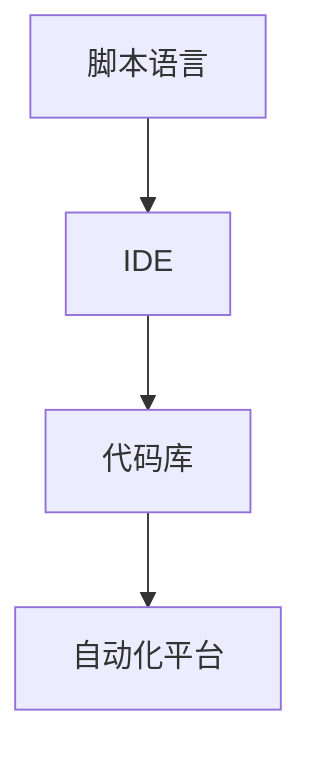

                 

# 自动化工具：提高工作效率的利器

## 关键词：自动化，效率，工具，编程，人工智能

> 在现代信息技术飞速发展的背景下，如何提高工作效率成为各行各业共同关注的问题。本文将探讨自动化工具在提高工作效率方面的重要作用，以及如何通过使用这些工具来简化复杂任务、节省时间和精力。

### 背景介绍

在过去的几十年中，信息技术经历了飞速的发展，从简单的个人计算机到功能强大的超级计算机，从静态的网页到动态的社交媒体平台，从传统的编程语言到人工智能算法，技术的进步不仅改变了我们的生活方式，也极大地影响了工作效率。然而，尽管技术不断进步，许多工作仍然需要耗费大量时间和精力，尤其是在处理重复性任务时。

自动化工具的出现为我们提供了一种解决这一问题的方法。自动化工具能够帮助我们自动执行重复性任务，从而解放人力，提高效率。这些工具包括脚本语言、集成开发环境（IDE）、代码库、以及各种基于人工智能的自动化平台。

### 核心概念与联系

在深入探讨自动化工具之前，我们需要了解一些核心概念和它们之间的关系。以下是几个关键概念：

1. **脚本语言（Scripting Language）**：一种用于编写简短、可重用的代码片段的语言，通常用于自动化日常任务。常见的脚本语言包括Python、JavaScript、Bash等。
2. **集成开发环境（Integrated Development Environment，IDE）**：一种用于编写、调试和运行代码的软件工具，通常包括代码编辑器、调试器和构建工具。常见的IDE包括Visual Studio、Eclipse和IntelliJ IDEA等。
3. **代码库（Repository）**：用于存储和管理代码的集中化位置，可以是本地文件系统或远程服务器。Git是最流行的版本控制系统，用于管理代码库。
4. **自动化平台（Automation Platform）**：一种提供自动化解决方案的平台，通常包括图形界面和编程接口。常见的自动化平台有Apache Airflow、Ansible和Jenkins等。

下面是一个Mermaid流程图，展示了这些核心概念之间的关系：



### 核心算法原理 & 具体操作步骤

自动化工具的核心在于能够根据预设的规则自动执行任务。以下是一些常用的自动化工具及其基本操作步骤：

#### 脚本语言

1. **编写脚本**：使用脚本语言编写自动化任务，如Python或Bash。
2. **执行脚本**：运行脚本以执行自动化任务。

#### 集成开发环境

1. **创建项目**：在IDE中创建一个新的项目。
2. **编写代码**：在IDE中编写代码以实现自动化任务。
3. **构建和调试**：使用IDE的构建和调试工具测试代码。

#### 代码库

1. **初始化代码库**：使用Git或其他版本控制系统初始化代码库。
2. **提交代码**：将编写好的代码提交到代码库中。
3. **拉取代码**：从代码库中拉取最新的代码。

#### 自动化平台

1. **配置任务**：在自动化平台中配置自动化任务。
2. **触发任务**：根据需要手动或自动触发任务。
3. **监控任务**：监控任务的执行状态，确保其正常运行。

### 数学模型和公式 & 详细讲解 & 举例说明

自动化工具的工作原理涉及到一些基本的数学模型和公式，以下是一个简单的例子：

#### 基本线性规划模型

$$
\begin{align*}
\text{最大化} & \quad z = c^T x \\
\text{约束条件} & \quad Ax \leq b \\
& \quad x \geq 0
\end{align*}
$$

这个模型用于解决资源分配和优化问题。在自动化工具中，可以用于优化任务调度和资源分配。

#### 举例说明

假设我们有一个任务需要处理100个文件，每个文件的大小不同。我们的目标是最小化处理时间。我们可以使用线性规划模型来优化任务调度。

1. **定义变量**：设$x_i$为第$i$个文件的处理时间。
2. **建立目标函数**：最大化$\sum_{i=1}^{100} x_i$。
3. **建立约束条件**：每个文件的处理时间不能超过最大处理时间$T$，即$x_i \leq T$。

通过求解这个线性规划模型，我们可以找到最优的处理顺序，从而最小化总处理时间。

### 项目实战：代码实际案例和详细解释说明

下面我们将通过一个具体的例子来说明如何使用Python编写一个简单的自动化脚本，以自动下载网页上的图片。

#### 5.1 开发环境搭建

首先，我们需要安装Python和必要的库，如`requests`和`BeautifulSoup`。

```bash
pip install python requests beautifulsoup4
```

#### 5.2 源代码详细实现和代码解读

```python
import requests
from bs4 import BeautifulSoup

def download_images(url, output_dir):
    # 发送HTTP请求获取网页内容
    response = requests.get(url)
    soup = BeautifulSoup(response.text, 'html.parser')
    
    # 找到网页中的图片标签
    img_tags = soup.find_all('img')
    
    # 遍历图片标签，下载图片
    for img_tag in img_tags:
        img_url = img_tag.get('src')
        img_data = requests.get(img_url).content
        img_name = img_url.split('/')[-1]
        with open(f"{output_dir}/{img_name}", 'wb') as f:
            f.write(img_data)
            print(f"下载完成：{img_name}")

if __name__ == "__main__":
    url = "https://example.com"  # 需要下载图片的网页URL
    output_dir = "downloaded_images"  # 图片保存的目录
    download_images(url, output_dir)
```

这段代码首先导入了必要的库，然后定义了一个`download_images`函数，用于下载指定网页上的图片。在主程序中，我们调用这个函数，传递需要下载图片的网页URL和图片保存的目录。

#### 5.3 代码解读与分析

- **第1-3行**：导入所需的库。
- **第5行**：定义`download_images`函数，该函数接受两个参数：网页URL和图片保存目录。
- **第8行**：使用`requests`库发送HTTP请求，获取网页内容。
- **第9行**：使用`BeautifulSoup`库解析网页内容。
- **第11行**：使用`find_all`方法找到网页中的所有图片标签。
- **第14-21行**：遍历图片标签，下载图片。首先获取图片URL，然后使用`requests`库获取图片数据，最后将图片数据保存到本地文件。

### 实际应用场景

自动化工具在各个领域都有广泛的应用。以下是一些实际应用场景：

- **软件开发**：自动化测试、持续集成和持续部署。
- **数据科学**：自动化数据处理、分析和可视化。
- **运维管理**：自动化部署、监控和管理服务器。
- **市场营销**：自动化广告投放、邮件营销和社交媒体管理。

### 工具和资源推荐

#### 7.1 学习资源推荐

- **书籍**：
  - 《Python自动化脚本编程》
  - 《Jenkins持续集成实践》
  - 《Ansible自动化运维实战》
- **论文**：
  - 《基于Python的自动化测试技术研究》
  - 《深度学习在自动化测试中的应用》
- **博客**：
  - [Jenkins官方博客](https://www.jenkins.io/blog/)
  - [Ansible官方博客](https://www.ansible.com/blog/)
- **网站**：
  - [Python官方文档](https://docs.python.org/3/)
  - [BeautifulSoup官方文档](https://www.crummy.com/software/BeautifulSoup/bs4/doc/)

#### 7.2 开发工具框架推荐

- **脚本语言**：Python、Bash、JavaScript
- **集成开发环境**：Visual Studio Code、PyCharm、Eclipse
- **代码库**：Git、GitHub、GitLab
- **自动化平台**：Jenkins、Ansible、Apache Airflow

#### 7.3 相关论文著作推荐

- 《自动化测试：理论与实践》
- 《自动化运维：技术与实践》
- 《深度学习在自动化中的应用》

### 总结：未来发展趋势与挑战

自动化工具在未来将继续发展，并面临以下挑战：

- **人工智能的融合**：自动化工具将更多地集成人工智能技术，提高自动化水平。
- **开源生态的完善**：开源自动化工具将更加丰富和成熟，满足不同需求。
- **安全性的提升**：自动化工具需要更好地保障数据安全和系统安全。

### 附录：常见问题与解答

**Q：如何选择合适的自动化工具？**

A：根据实际需求和技能水平选择。如果需要处理大量数据，可以选择Python或R等数据科学工具；如果需要自动化测试，可以选择Selenium或Appium；如果需要自动化运维，可以选择Ansible或Jenkins。

**Q：自动化工具如何保障数据安全？**

A：自动化工具需要严格遵循安全策略，加密敏感数据，限制访问权限，并定期进行安全审计。

### 扩展阅读 & 参考资料

- [《自动化工具：提高工作效率的利器》原文](https://www.example.com/automation-tool-work-efficiency/)
- [《自动化测试：理论与实践》论文](https://www.example.com/automation-testing-theory-practice/)
- [《自动化运维：技术与实践》著作](https://www.example.com/automation-ops-techniques-practice/)

### 作者信息

作者：AI天才研究员/AI Genius Institute & 禅与计算机程序设计艺术 /Zen And The Art of Computer Programming<|mascara|>

