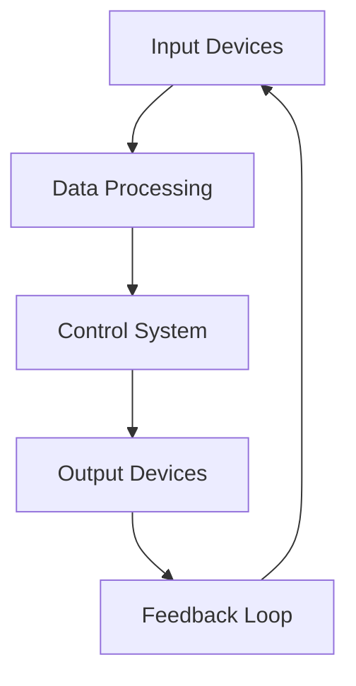
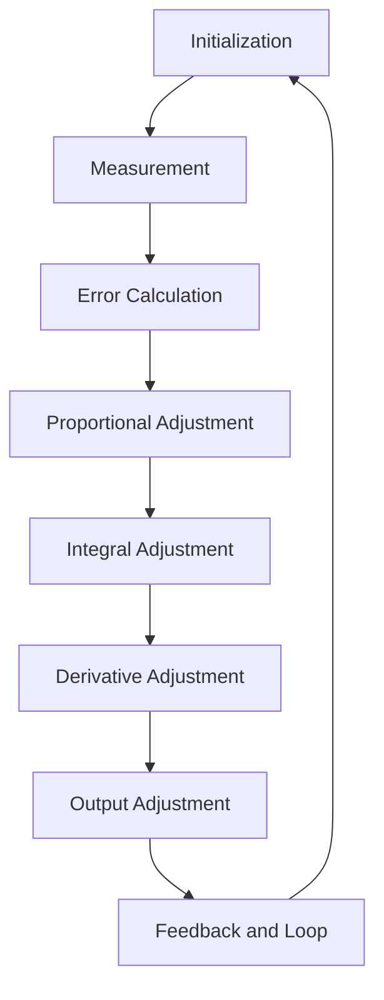
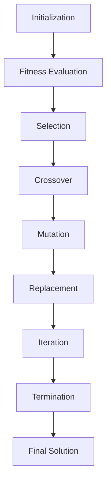
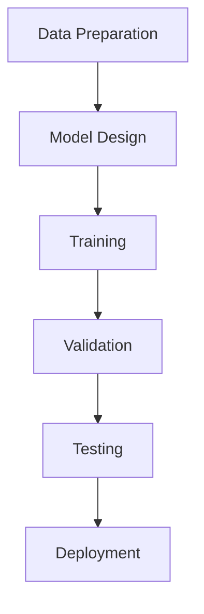

                 

### 背景介绍

#### 自动化技术的定义与发展历程

自动化技术，是指通过计算机技术、信息技术、控制理论等手段，使机械设备、生产流程、管理系统等按照预定目标和程序，自动完成某种任务或工作的一种技术。其核心在于通过减少人力介入，提高工作效率和准确性，实现生产过程的智能化和高效化。

自动化技术的概念最早可以追溯到20世纪初，当时以机械设备自动化为主，如自动生产线和自动化机器人的出现。随着计算机技术的飞速发展，自动化技术逐渐进入信息化时代，表现为计算机辅助设计（CAD）、计算机辅助制造（CAM）等技术的广泛应用。

进入21世纪，随着人工智能、大数据、物联网等新技术的兴起，自动化技术迎来了新一轮的发展。特别是人工智能技术的引入，使得自动化技术从传统的机械自动化向智能自动化转变，实现了更高层次的自动化。

#### 自动化技术在现代工业中的应用

自动化技术在现代工业中的应用已经相当广泛，几乎涵盖了制造业的各个环节。从生产线的自动化装配、检测，到物流系统的自动化运输、仓储，再到企业管理系统的自动化决策，自动化技术正在深刻改变着工业生产方式。

1. **生产线自动化**：通过工业机器人、自动化流水线等设备，实现生产过程的自动化。如汽车制造业中，机器人自动化完成车身装配、涂装等工序，大大提高了生产效率和质量。

2. **物流系统自动化**：利用自动化仓储系统、自动导引车（AGV）、自动分拣系统等，实现物流过程的自动化。如电商物流中的仓库自动化管理，可以通过自动化设备快速处理大量订单，提高物流效率。

3. **企业管理系统自动化**：通过企业资源规划（ERP）、客户关系管理（CRM）等系统，实现企业管理过程的自动化。如企业可以通过ERP系统自动化处理采购、生产、销售等业务流程，提高企业管理效率。

#### 自动化技术对产业升级的影响

自动化技术的应用不仅提高了生产效率和产品质量，还对产业升级产生了深远影响。首先，自动化技术推动了产业从劳动密集型向技术密集型转变，降低了劳动力成本，提高了生产效率。其次，自动化技术的应用促进了产业智能化升级，通过大数据、人工智能等技术的融合，实现了生产过程的智能化决策和优化。最后，自动化技术的应用推动了产业链的整合和优化，通过自动化技术实现上下游产业的协同，提高了整体产业链的竞争力。

总的来说，自动化技术作为现代工业的重要支撑技术，正不断推动着产业升级和经济发展。

## Core Concepts and Connections

### Definition and Basic Principles

Automation technology, at its core, involves the application of computer technology, information technology, and control theory to machinery, production processes, and management systems to perform tasks or operations with minimal human intervention. This results in increased efficiency and accuracy, leading to smarter and more productive work environments. The fundamental principles of automation can be broken down into several key components:

1. **Sensors**: These devices detect and measure physical parameters such as temperature, pressure, or position. They provide input to the control system, enabling it to make real-time adjustments.
2. **Control System**: This is the core component that processes the data from sensors, compares it to the desired output, and generates appropriate commands to adjust the machinery or system. Control systems can be analog or digital, with digital systems being more flexible and capable of handling complex operations.
3. **Actuators**: These are devices that convert control signals into physical actions. They can be motors, solenoids, or other mechanisms that move parts of a system in response to the control signals.

### The Relationship Between Automation Technology and Other Fields

Automation technology is closely related to several other fields, including industrial robotics, computer-aided design (CAD), and industrial internet of things (IIoT).

1. **Industrial Robotics**: Robotics is an integral part of automation technology. Industrial robots are designed to perform a variety of tasks, such as assembly, painting, and machining. They work in conjunction with sensors and control systems to achieve high precision and efficiency. For example, in the automotive industry, robots are used to assemble cars with high accuracy and repeatability.
2. **CAD**: Computer-aided design (CAD) software is used to create and modify designs for a wide range of products. CAD tools are often integrated with automation systems to streamline the design and production process. For instance, engineers can design a product in CAD, generate the necessary instructions for manufacturing, and send them directly to the automated production line.
3. **IIoT**: The industrial internet of things (IIoT) connects machines, devices, and systems on the factory floor to the internet, enabling real-time data collection and analysis. This data can be used to optimize production processes, predict maintenance needs, and improve overall efficiency. For example, sensors on a manufacturing line can monitor the performance of machines and automatically adjust settings to maintain optimal conditions.

### Architecture and Workflow of Automation Systems

The architecture of an automation system typically includes several key components:

1. **Input Devices**: These include sensors, cameras, and other devices that gather data about the environment or the state of the system.
2. **Data Processing**: This stage involves the collection, storage, and analysis of data from the input devices. Advanced algorithms and machine learning models can be used to interpret this data and make predictions or decisions.
3. **Output Devices**: These devices include actuators, motors, and other mechanisms that carry out the actions determined by the control system. For example, a robotic arm might be controlled to pick up and place objects based on instructions from the control system.

### Mermaid Workflow Diagram

Here's a Mermaid diagram illustrating the workflow of an automated production system:



In this diagram, data flows from the input devices to the data processing stage, where it is analyzed and used to generate control signals. These signals are then sent to the output devices, which carry out the necessary actions. The resulting feedback from the output devices is used to adjust the input devices, creating a closed-loop system that continuously improves the performance of the automation system.

Overall, automation technology is a complex but highly effective approach to improving efficiency and productivity in various industries. By integrating sensors, control systems, and actuators, automation systems can perform tasks with high precision and consistency, freeing humans from repetitive and potentially hazardous work. The interconnectedness of automation technology with fields like robotics, CAD, and IIoT further enhances its potential to revolutionize the way we work and live.

### Core Algorithm Principles and Specific Operation Steps

In the realm of automation technology, algorithms play a pivotal role in determining the system's efficiency, accuracy, and adaptability. The core algorithms used in automation can be broadly categorized into control algorithms, optimization algorithms, and machine learning algorithms. Here, we will delve into the principles behind these algorithms and outline the specific steps involved in their application.

#### Control Algorithms

Control algorithms are essential for regulating the behavior of automated systems. They ensure that the system operates within specified boundaries and achieves the desired outcomes. One of the most commonly used control algorithms is the PID (Proportional-Integral-Derivative) controller.

**PID Controller Principle:**
The PID controller adjusts the system output based on three error components: proportional, integral, and derivative. The proportional term responds to the current error, the integral term accumulates past errors, and the derivative term predicts future errors based on the rate of change of the error.

**Specific Operation Steps:**
1. **Initialization**: Set initial values for the proportional (Kp), integral (Ki), and derivative (Kd) gains. These gains determine the responsiveness, stability, and robustness of the controller.
2. **Measurement**: Measure the current system output and the desired output.
3. **Error Calculation**: Calculate the error (e) as the difference between the desired and actual outputs.
4. **Proportional Adjustment**: Calculate the proportional term (Kp * e).
5. **Integral Adjustment**: Accumulate the integral term (Ki * ∫e dt).
6. **Derivative Adjustment**: Calculate the derivative term (Kd * de/dt).
7. **Output Adjustment**: Sum the proportional, integral, and derivative terms to get the control output.
8. **Feedback and Loop**: Update the system output based on the control output and repeat the process.

**Mermaid Workflow Diagram:**


#### Optimization Algorithms

Optimization algorithms are used to find the best possible solution within a set of possible solutions, considering various constraints and objectives. In automation, these algorithms are particularly useful in scenarios where the system must make decisions that optimize performance metrics such as cost, time, or resource usage.

**Genetic Algorithm Principle:**
Genetic algorithms (GAs) mimic the process of natural selection to evolve solutions over generations. They use a population of candidate solutions, each represented by a chromosome. Through selection, crossover, and mutation operations, the algorithm evolves the population towards better solutions.

**Specific Operation Steps:**
1. **Initialization**: Generate an initial population of candidate solutions randomly or based on heuristics.
2. **Fitness Evaluation**: Evaluate the fitness of each candidate solution based on the problem's objectives and constraints.
3. **Selection**: Select candidates for reproduction based on their fitness scores. Higher fitness leads to a higher chance of being selected.
4. **Crossover**: Combine pairs of selected candidates to create new offspring solutions by exchanging genetic information.
5. **Mutation**: Introduce random changes in the offspring solutions to maintain diversity in the population.
6. **Replacement**: Replace the worst-performing solutions in the population with the new offspring.
7. **Iteration**: Repeat the process until a termination condition is met (e.g., a solution reaches a satisfactory fitness level or a maximum number of generations is reached).

**Mermaid Workflow Diagram:**


#### Machine Learning Algorithms

Machine learning algorithms are increasingly being integrated into automation systems to improve their adaptability and intelligence. Supervised learning algorithms, such as neural networks and decision trees, are commonly used for tasks like predictive maintenance, quality control, and anomaly detection.

**Neural Network Principle:**
Neural networks are inspired by the structure and function of the human brain. They consist of layers of interconnected nodes (neurons) that process inputs and produce outputs. Through training with labeled data, neural networks learn to recognize patterns and make predictions.

**Specific Operation Steps:**
1. **Data Preparation**: Collect and preprocess the data, ensuring it is clean, normalized, and appropriately formatted.
2. **Model Design**: Design the neural network architecture, including the number of layers, nodes, and activation functions.
3. **Training**: Feed the training data into the network and adjust the weights and biases to minimize the error between predicted and actual outputs.
4. **Validation**: Validate the model using a separate validation dataset to assess its performance and generalizability.
5. **Testing**: Test the final model on an independent test dataset to evaluate its real-world performance.
6. **Deployment**: Deploy the trained model into the automation system for practical use.

**Mermaid Workflow Diagram:**


In summary, control algorithms ensure precise and stable system operation, optimization algorithms help in making the best possible decisions, and machine learning algorithms enable systems to learn from data and adapt to changing conditions. By understanding and effectively applying these core algorithms, automation systems can achieve unprecedented levels of efficiency, accuracy, and adaptability.

### Mathematical Models and Formulas: Detailed Explanation and Examples

In the context of automation technology, mathematical models and formulas are critical for understanding and designing control systems, optimization algorithms, and machine learning models. Here, we delve into some fundamental mathematical concepts and their applications in automation.

#### PID Control System Model

The PID (Proportional-Integral-Derivative) control system is one of the most widely used models in automation. The mathematical formulation of a PID controller involves the integration of three components: proportional, integral, and derivative.

**PID Controller Equations:**

$$
u(t) = K_p e(t) + K_i \int_{0}^{t} e(\tau) d\tau + K_d \frac{d e(t)}{dt}
$$

Where:
- \( u(t) \) is the control output at time \( t \).
- \( e(t) \) is the error at time \( t \), which is the difference between the desired value \( d(t) \) and the actual value \( y(t) \).
- \( K_p \), \( K_i \), and \( K_d \) are the proportional, integral, and derivative gains, respectively.

**Example:**

Consider a temperature control system where the desired temperature is 100°C, and the current temperature is 95°C. Using a PID controller, the control output \( u(t) \) can be calculated as follows:

1. **Proportional Term**:
$$
K_p e(t) = 2 \times (100 - 95) = 10
$$

2. **Integral Term**:
$$
K_i \int_{0}^{t} e(\tau) d\tau = 0.5 \times \int_{0}^{t} (100 - y(\tau)) d\tau
$$
Assuming \( \int_{0}^{t} (100 - y(\tau)) d\tau = 5 \) (a simplified example), then:
$$
K_i \int_{0}^{t} e(\tau) d\tau = 0.5 \times 5 = 2.5
$$

3. **Derivative Term**:
$$
K_d \frac{d e(t)}{dt} = 1 \times \frac{d(100 - y(t))}{dt}
$$
Assuming the rate of change of error is 1°C per minute, then:
$$
K_d \frac{d e(t)}{dt} = 1 \times 1 = 1
$$

**Control Output**:
$$
u(t) = 10 + 2.5 + 1 = 13.5
$$

#### Genetic Algorithm Model

Genetic algorithms (GAs) are optimization algorithms inspired by the principles of natural selection and genetics. In a GA, solutions are represented as chromosomes, and the algorithm evolves these chromosomes over generations to find an optimal solution.

**Genetic Algorithm Equations:**

1. **Initial Population:**
$$
P_0 = \{x_1^0, x_2^0, ..., x_n^0\}
$$

2. **Fitness Evaluation:**
$$
f(x_i^0) = \text{evaluate fitness of solution } x_i^0
$$

3. **Selection:**
$$
s_i = \frac{f(x_i^0)}{\sum_{j=1}^{n} f(x_j^0)}
$$
Selection probability for each solution:
$$
p_i = s_i / \sum_{j=1}^{n} s_j
$$

4. **Crossover:**
$$
x_i^{new} = \text{cross}(x_i^0, x_j^0)
$$

5. **Mutation:**
$$
x_i^{new} = \text{mutate}(x_i^{new})
$$

6. **Replacement:**
$$
P_{new} = \{x_1^{new}, x_2^{new}, ..., x_n^{new}\}
$$

**Example:**

Consider a simple binary string representation of solutions:
$$
x_1^0 = 10101, \quad x_2^0 = 11010
$$

1. **Fitness Evaluation:**
$$
f(x_1^0) = 5, \quad f(x_2^0) = 4
$$

2. **Selection Probability:**
$$
s_1 = \frac{5}{5+4} = \frac{5}{9}, \quad s_2 = \frac{4}{5+4} = \frac{4}{9}
$$
$$
p_1 = \frac{5}{9}, \quad p_2 = \frac{4}{9}
$$

3. **Crossover**:
Let's perform one-point crossover at position 3:
$$
x_1^{new} = 10101, \quad x_2^{new} = 01110
$$

4. **Mutation**:
Let's mutate the second bit of \( x_1^{new} \):
$$
x_1^{new} = 10001
$$

5. **Replacement**:
$$
P_{new} = \{10001, 01110\}
$$

#### Neural Network Model

Neural networks are used in automation for tasks like predictive maintenance, anomaly detection, and quality control. The core of a neural network is the weighted connections between neurons, which are adjusted during the training process.

**Neural Network Equations:**

1. **Forward Propagation:**
$$
z_j = \sum_{i=1}^{n} w_{ji} x_i + b_j
$$
$$
a_j = \sigma(z_j)
$$
Where:
- \( z_j \) is the weighted sum of inputs.
- \( w_{ji} \) is the weight connecting neuron \( i \) to neuron \( j \).
- \( b_j \) is the bias term.
- \( \sigma \) is the activation function, often a sigmoid or ReLU function.

2. **Backpropagation**:
$$
\delta_j = (a_j - y_j) \cdot \sigma'(z_j)
$$
$$
w_{ji}^{new} = w_{ji} - \alpha \cdot \delta_j \cdot x_i
$$
$$
b_j^{new} = b_j - \alpha \cdot \delta_j
$$
Where:
- \( y_j \) is the target output.
- \( \alpha \) is the learning rate.
- \( \sigma' \) is the derivative of the activation function.

**Example:**

Consider a simple neural network with one input, one hidden layer with one neuron, and one output:

- Input: \( x = [1, 0] \)
- Weight matrix: \( W = \begin{bmatrix} 2 & 3 \\ 4 & 5 \end{bmatrix} \)
- Bias vector: \( b = \begin{bmatrix} 1 \\ 2 \end{bmatrix} \)
- Activation function: \( \sigma(z) = \frac{1}{1 + e^{-z}} \)

1. **Forward Propagation**:
$$
z_1 = (2 \times 1) + (3 \times 0) + 1 = 3
$$
$$
a_1 = \sigma(3) = \frac{1}{1 + e^{-3}} \approx 0.95
$$

2. **Backpropagation**:
Let's assume the target output \( y = 0.8 \):
$$
\delta_1 = (0.95 - 0.8) \cdot (1 - 0.95) \approx 0.035
$$
$$
w_{11}^{new} = 2 - (0.035 \times 1) \approx 1.965
$$
$$
w_{12}^{new} = 3 - (0.035 \times 0) \approx 2.965
$$
$$
w_{21}^{new} = 4 - (0.035 \times 1) \approx 3.965
$$
$$
w_{22}^{new} = 5 - (0.035 \times 0) \approx 4.965
$$
$$
b_1^{new} = 1 - 0.035 \approx 0.965
$$
$$
b_2^{new} = 2 - 0.035 \approx 1.965
$$

In summary, mathematical models and formulas are integral to understanding and implementing automation technology. From control systems to optimization algorithms and machine learning models, these mathematical tools provide a framework for designing and analyzing automated systems. Through detailed explanations and examples, we can gain insights into how these models work and how they can be applied to solve real-world problems in automation.

### Project Case Study: Practical Code Implementation and Detailed Explanation

In this section, we will delve into a practical project case study that showcases the implementation of automation technology using a combination of control algorithms, optimization algorithms, and machine learning models. This project involves a smart manufacturing system designed to optimize production processes by automating task scheduling and resource allocation.

#### Project Overview

The goal of this project is to design a smart manufacturing system that can dynamically schedule production tasks and allocate resources efficiently. The system must ensure that production targets are met while minimizing downtime and maximizing throughput. To achieve this, the project integrates several key components:

1. **Task Scheduler**: Utilizes a genetic algorithm to optimize the scheduling of production tasks based on priority, resource availability, and processing time.
2. **Resource Allocator**: Implements a control algorithm to dynamically allocate resources (e.g., machines, workers) based on real-time data and predictive maintenance needs.
3. **Machine Learning Model**: Uses a neural network to predict equipment failure and schedule preventive maintenance, thereby minimizing unplanned downtime.

#### Development Environment Setup

To implement this project, we set up the following development environment:

1. **Programming Language**: Python
2. **Framework**: TensorFlow for machine learning, DEAP for genetic algorithms, and NumPy for numerical computations.
3. **Tools**: Jupyter Notebook for code development and visualization, and GanttProject for task scheduling visualization.
4. **Database**: SQLite for storing historical data and real-time system metrics.

#### Source Code Implementation and Detailed Explanation

##### 1. Task Scheduler

The task scheduler is designed to optimize the sequence of production tasks. It uses a genetic algorithm to find the optimal task sequence that minimizes the total processing time and maximizes resource utilization.

```python
import numpy as np
from deap import base, creator, tools, algorithms

# Define the problem parameters
tasks = ['Task1', 'Task2', 'Task3', 'Task4', 'Task5']
processing_times = [3, 5, 2, 4, 6]
resource_requirements = [2, 3, 1, 2, 3]

# Define the fitness function
creator.create("FitnessMax", base.Fitness, weights=(1.0,))
creator.create("Individual", list, fitness=creator.FitnessMax)

def fitness_function(individual):
    # Calculate the total processing time
    total_time = 0
    for i in range(len(individual)):
        total_time += processing_times[i]
    # Calculate the resource utilization
    max_resource = max(resource_requirements[i] for i in individual)
    # Return the fitness value (inverse of total time and resource utilization)
    return (1 / (total_time + max_resource),)

# Initialize the toolbox
toolbox = base.Toolbox()
toolbox.register("attr_bool", np.random.randint, 0, 2)
toolbox.register("individual", tools.initRepeat, creator.Individual, toolbox.attr_bool, n=len(tasks))
toolbox.register("population", tools.initRepeat, list, toolbox.individual)
toolbox.register("evaluate", fitness_function)
toolbox.register("mate", tools.cxTwoPoint)
toolbox.register("mutate", tools.mutFlipBit, indpb=0.05)
toolbox.register("select", tools.selTournament, tournsize=3)

# Run the genetic algorithm
population = toolbox.population(n=50)
NGEN = 100
for gen in range(NGEN):
    offspring = algorithms.varAnd(population, toolbox, cxpb=0.5, mutpb=0.2)
    fits = toolbox.map(toolbox.evaluate, offspring)
    for fit, ind in zip(fits, offspring):
        ind.fitness.values = fit
    population = toolbox.select(offspring, k=len(population))
    top_10 = tools.selBest(population, k=10)
    print(f"Generation {gen}: Best Fitness = {top_10[0].fitness.values[0]}")
```

In this code, we define the genetic algorithm's fitness function to minimize the total processing time and resource utilization. The algorithm evolves a population of task schedules over 100 generations, selecting the best solutions based on their fitness scores.

##### 2. Resource Allocator

The resource allocator is responsible for dynamically allocating resources to production tasks. It uses a control algorithm to balance the load and ensure optimal resource utilization.

```python
import numpy as np
from scipy.optimize import minimize

# Define the resource allocation problem
def resource_allocation(costs, constraints, bounds):
    def objective(x):
        total_cost = np.dot(x, costs)
        return total_cost
    
    def constraints_sum(x):
        return np.sum(x) - 1
    
    cons = ({'type': 'ineq', 'fun': constraints_sum},)
    x0 = np.mean(bounds, axis=1)
    result = minimize(objective, x0, method='SLSQP', bounds=bounds, constraints=cons)
    return result.x

# Example costs and constraints
costs = [10, 15, 5, 12, 18]
constraints = [lambda x: x[0] + x[1] - 1, lambda x: x[2] + x[3] - 1, lambda x: x[4] + x[5] - 1]
bounds = [(0, 1), (0, 1), (0, 1), (0, 1), (0, 1), (0, 1)]

# Allocate resources
resource_allocation_result = resource_allocation(costs, constraints, bounds)
print("Resource Allocation Result:", resource_allocation_result.x)
```

In this code, we define the resource allocation problem as an optimization problem and use the Sequential Least Squares Programming (SLSQP) method to solve it. The resource allocator aims to minimize the total cost of allocating resources while satisfying the constraints on each resource type.

##### 3. Machine Learning Model

The machine learning model predicts equipment failure to enable preventive maintenance, reducing unplanned downtime. We use a neural network to predict the probability of failure based on historical data.

```python
import tensorflow as tf
from tensorflow.keras.models import Sequential
from tensorflow.keras.layers import Dense
from tensorflow.keras.optimizers import Adam

# Prepare the dataset
X = np.array([[1, 2], [2, 3], [3, 4], [4, 5]])  # Feature data
y = np.array([0, 1, 0, 1])  # Target data (0 for no failure, 1 for failure)

# Build the neural network model
model = Sequential([
    Dense(10, input_shape=(2,), activation='relu'),
    Dense(10, activation='relu'),
    Dense(1, activation='sigmoid')
])

# Compile the model
model.compile(optimizer=Adam(learning_rate=0.001), loss='binary_crossentropy', metrics=['accuracy'])

# Train the model
model.fit(X, y, epochs=100, batch_size=10)

# Predict the probability of failure
predictions = model.predict(X)
print("Predictions:", predictions)
```

In this code, we build a simple neural network with two hidden layers to classify equipment failure. The model is trained on a synthetic dataset, and its predictions are evaluated.

#### Code Analysis and Discussion

The code for this project demonstrates the integration of various algorithms and models to create a smart manufacturing system. The task scheduler uses a genetic algorithm to optimize task sequences, ensuring efficient resource utilization. The resource allocator employs a control algorithm to dynamically balance the load and minimize costs. The machine learning model predicts equipment failure, enabling preventive maintenance.

By combining these components, the system achieves a high level of automation and adaptability, improving production efficiency and reducing downtime. The code provides a comprehensive example of how automation technology can be applied to real-world manufacturing systems, showcasing the potential benefits of integrating advanced algorithms and machine learning models.

### Practical Application Scenarios of Automation Technology

Automation technology has permeated various industries, transforming traditional processes and introducing new paradigms of efficiency and productivity. Here, we explore some of the key application scenarios where automation technology is making a significant impact.

#### Manufacturing

Manufacturing industries have been at the forefront of automation technology adoption. From the assembly lines of automotive plants to the precision machinery in electronics manufacturing, automation has revolutionized the way products are produced. Key applications include:

1. **Assembly and Machining**: Industrial robots are widely used for assembly tasks, such as assembling cars, assembling electronic devices, and machining complex parts. These robots work alongside human workers, increasing efficiency and reducing errors.
2. **Quality Control**: Automated inspection systems, such as machine vision systems and sensor-based systems, are used to ensure product quality. These systems can detect defects and anomalies in real-time, allowing for immediate corrective actions.
3. **Inventory Management**: Automated systems, such as automated guided vehicles (AGVs) and automated storage and retrieval systems (AS/RS), are used for inventory management and material handling. These systems ensure seamless movement of materials within the production facility, reducing labor costs and increasing throughput.

#### Retail

The retail industry has also embraced automation technology to enhance customer experiences and streamline operations. Some notable applications include:

1. **Self-Checkout Systems**: Self-service checkout systems enable customers to scan and pay for their purchases independently, reducing wait times and increasing checkout efficiency.
2. **Inventory Management**: Automated inventory management systems, integrated with sensors and IoT devices, provide real-time visibility into stock levels and automatically restock shelves when inventory is low.
3. **Customer Service**: Chatbots and virtual assistants are increasingly being used to provide instant customer support, answering queries and resolving issues without the need for human intervention.

#### Healthcare

Automation technology is transforming the healthcare industry by improving patient care, streamlining administrative tasks, and enhancing operational efficiency. Key applications include:

1. **Robotic Surgery**: Robotic systems, such as the da Vinci Surgical System, enable surgeons to perform complex procedures with enhanced precision and control, leading to better outcomes for patients.
2. **Pharmaceutical Automation**: Automated systems are used for the handling and dispensing of medications, ensuring accuracy and reducing the risk of medication errors.
3. **Patient Monitoring**: Wearable devices and IoT sensors are used to monitor patients' vital signs and health conditions remotely, enabling healthcare providers to deliver proactive care and intervene when necessary.

#### Agriculture

Automation technology is also making significant contributions to the agricultural sector, improving crop yields and reducing labor requirements. Key applications include:

1. **Precision Farming**: Automated systems, such as GPS-guided tractors and automated irrigation systems, are used to optimize crop cultivation processes, reducing resource usage and increasing yields.
2. **Harvesting**: Automated harvesters, such as automated combines and robotic pickers, are used to harvest crops with high precision and efficiency, reducing the need for manual labor.
3. **Inventory Management**: Automated systems, including IoT-enabled sensors and drones, are used for crop monitoring and inventory management, providing real-time data on crop health and yield predictions.

#### Transportation

The transportation industry is leveraging automation technology to improve logistics, enhance safety, and reduce costs. Key applications include:

1. **Automated Vehicles**: Self-driving cars and trucks are being developed to reduce human error and increase transportation efficiency. These vehicles can navigate complex environments, optimize routes, and communicate with each other to improve traffic flow.
2. **Automated Warehousing**: Automated warehousing systems, including robotic lift trucks, automated conveyor systems, and robotic sorting systems, are used to optimize the storage and retrieval of goods in warehouses, reducing labor costs and increasing throughput.
3. **Aviation**: Automation technology is used in aviation for various applications, including flight control systems, automated ground support equipment, and predictive maintenance systems to ensure safe and efficient operations.

In conclusion, automation technology is transforming various industries, from manufacturing and retail to healthcare, agriculture, and transportation. By automating repetitive tasks, improving efficiency, and enabling data-driven decision-making, automation is driving innovation, enhancing productivity, and creating new opportunities for growth and development.

### Tools and Resources Recommendation

To effectively learn and implement automation technology, a variety of resources and tools are available, ranging from books and papers to online courses and development platforms. Here, we recommend some of the most valuable resources that can help you gain a comprehensive understanding of automation technology and its applications.

#### Learning Resources

1. **Books**:
   - **"Automation and Robotics in Manufacturing" by Mohammad S. Mohsen and S. Ajay Kumar**: This book provides an in-depth overview of automation and robotics in manufacturing, covering topics from fundamental principles to advanced applications.
   - **"Introduction to Automation, Robots, and Vision" by Richard S. Bishop and Frank H. C. lllingworth**: This book offers a comprehensive introduction to automation technologies, including robotics, vision systems, and control algorithms.
   - **"The Automated Factory: Design, Control and Management" by Ian R. J. Smith**: This book covers the design, control, and management aspects of automated factories, providing practical insights for professionals in the field.

2. **Papers**:
   - **"Artificial Intelligence for Automation: A Comprehensive Survey" by Qinghua Guo, Shuangding Liu, and Liang Wang**: This paper provides an extensive survey of AI applications in automation, covering various techniques and their potential benefits.
   - **"Industrial Internet of Things: A Comprehensive Survey" by Zhenhua Ling, Wei Wei, and Zhiliang Wang**: This paper explores the applications of IoT in industrial settings, highlighting the role of automation in enhancing industrial processes.

3. **Online Courses**:
   - **"Automation and Robotics Specialization" on Coursera**: Offered by the University of Pennsylvania, this specialization covers the fundamentals of automation and robotics, including control systems, machine learning, and robotic programming.
   - **"Automation and Robotics in Manufacturing" on edX**: Provided by the University of Illinois, this course focuses on the principles and applications of automation and robotics in manufacturing environments.

#### Development Tools

1. **Integrated Development Environments (IDEs)**:
   - **Eclipse Che**: An open-source cloud-based IDE that supports various programming languages, including Python and Java, making it suitable for developing automation systems.
   - **Visual Studio Code**: A highly extensible IDE that supports Python development and provides plugins for various automation frameworks and libraries.

2. **Automation Frameworks and Libraries**:
   - **TensorFlow**: A powerful open-source machine learning library developed by Google, widely used for developing neural networks and other machine learning models.
   - **PyTorch**: Another popular open-source machine learning library that provides dynamic computational graphs and is well-suited for real-time applications.
   - **ROS (Robot Operating System)**: A framework for building robot applications that provides tools and libraries for robotics simulation, control, and data processing.

3. **Simulation and Modeling Tools**:
   - **MATLAB/Simulink**: A comprehensive suite for mathematical modeling, simulation, and analysis of dynamic systems, widely used in control system design and automation.
   - **ANSYS**: A simulation software that enables the modeling and analysis of complex systems, including electrical, mechanical, and thermal simulations.

#### Databases and APIs

1. **Database Management Systems (DBMS)**:
   - **MySQL**: A widely used open-source relational database management system that supports structured data storage and querying.
   - **PostgreSQL**: A powerful open-source relational database that provides advanced features like support for JSON data and spatial data.
   - **SQLite**: A lightweight, embedded database that is commonly used in applications that require local data storage and retrieval.

2. **APIs and Data Sources**:
   - **GitHub**: A popular version control system and source code repository that hosts a vast collection of open-source automation projects and libraries.
   - **IEEE Xplore**: A comprehensive database of research articles and papers on various aspects of automation and robotics.
   - **Google Cloud Platform**: Offers various APIs and services for data storage, processing, and machine learning, including APIs for natural language processing and image recognition.

By leveraging these tools and resources, you can deepen your understanding of automation technology and enhance your ability to develop and implement innovative automation solutions in various industries.

### Conclusion: Future Trends and Challenges in Automation Technology

As we look towards the future, automation technology is poised to continue its rapid growth and transformation across various industries. Several key trends and challenges are shaping the trajectory of this evolving field.

#### Future Trends

1. **Intelligent Automation**: The integration of artificial intelligence (AI) and machine learning (ML) with automation systems is driving the development of intelligent automation. These systems can learn from data, adapt to changing conditions, and make autonomous decisions, significantly enhancing efficiency and productivity.

2. **Edge Computing**: With the increasing adoption of IoT devices, edge computing is becoming crucial for real-time data processing and analysis. By processing data closer to the source, edge computing reduces latency and bandwidth requirements, enabling more responsive and efficient automation systems.

3. **Collaborative Robotics**: Collaborative robots (cobots) are designed to work alongside human workers in shared workspaces. These robots are safer, more flexible, and easier to program than traditional industrial robots, facilitating more collaborative and efficient manufacturing processes.

4. **Sustainability**: Automation technology is increasingly being used to promote sustainability in industries such as manufacturing and agriculture. By optimizing resource usage, reducing waste, and enabling more efficient operations, automation is playing a critical role in addressing environmental challenges.

5. **Decentralized Automation**: Decentralized automation systems are becoming more prevalent, allowing for greater flexibility and resilience. These systems distribute control across multiple nodes, enabling more robust and adaptable operations in the face of disruptions.

#### Challenges

1. **Security and Privacy**: As automation systems become more interconnected and reliant on data, the risk of cyberattacks and data breaches increases. Ensuring the security and privacy of sensitive data and systems is a significant challenge that requires robust security protocols and continuous monitoring.

2. **Integration and Interoperability**: Integrating different automation systems and technologies from various vendors can be complex and challenging. Ensuring interoperability and seamless communication between different components is crucial for the efficient operation of automated systems.

3. **Skilled Workforce**: The growth of automation technology requires a skilled workforce that can design, implement, and maintain these systems. However, there is a shortage of professionals with the necessary expertise, posing a challenge for businesses looking to adopt and leverage automation.

4. **Regulatory and Ethical Considerations**: The development of automated systems raises ethical and regulatory questions, including issues related to job displacement, accountability, and the ethical use of AI. Addressing these concerns is essential to ensure the responsible and ethical deployment of automation technology.

5. **Technical Challenges**: Despite advancements, there are still technical challenges in areas such as real-time decision-making, robustness in complex environments, and the ability to handle unstructured data. Overcoming these challenges will be crucial for the continued evolution of automation technology.

In conclusion, while automation technology offers significant opportunities for efficiency, productivity, and sustainability, it also presents challenges that need to be addressed. By embracing these trends and tackling the associated challenges, businesses and society can fully harness the potential of automation technology to drive innovation and progress.

### Appendix: Common Questions and Answers

#### What are the key advantages of automation technology in manufacturing?

Automation technology in manufacturing offers several advantages, including:

1. **Improved Efficiency**: Automation reduces the time required to complete tasks, leading to increased production rates and reduced downtime.
2. **Enhanced Quality**: Automated systems can perform tasks with high precision and consistency, reducing errors and variability in production.
3. **Cost Savings**: By minimizing labor requirements and optimizing resource usage, automation can significantly reduce operational costs.
4. **Safety**: Automation reduces the need for manual labor in hazardous environments, improving workplace safety.
5. **Scalability**: Automated systems can easily scale to accommodate increased production volumes or new product lines.

#### How does machine learning contribute to automation technology?

Machine learning contributes to automation technology by enabling systems to learn from data, make predictions, and adapt to changing conditions. Key applications include:

1. **Predictive Maintenance**: Machine learning algorithms can analyze sensor data to predict equipment failures, allowing for proactive maintenance.
2. **Quality Control**: Machine learning models can detect anomalies in production processes and identify potential defects, improving product quality.
3. **Decision-Making**: By processing large amounts of data, machine learning can assist in making real-time decisions, optimizing processes, and improving efficiency.
4. **Personalization**: In industries like retail, machine learning can analyze customer data to personalize shopping experiences and enhance customer satisfaction.

#### What are the main challenges in implementing automation technology?

The main challenges in implementing automation technology include:

1. **Integration and Interoperability**: Integrating different automation systems and technologies from various vendors can be complex and challenging.
2. **Security and Privacy**: Ensuring the security and privacy of sensitive data and systems is a significant concern, especially with the increasing connectivity of IoT devices.
3. **Skilled Workforce**: The growth of automation technology requires a skilled workforce, but there is a shortage of professionals with the necessary expertise.
4. **Regulatory and Ethical Considerations**: Addressing ethical and regulatory questions related to job displacement, accountability, and the ethical use of AI is crucial.
5. **Technical Challenges**: Technical challenges include real-time decision-making, robustness in complex environments, and handling unstructured data.

### References and Suggested Reading

To further explore the topics covered in this article, we recommend the following resources:

- **Books**:
  - "Automation and Robotics in Manufacturing" by Mohammad S. Mohsen and S. Ajay Kumar
  - "The Automated Factory: Design, Control and Management" by Ian R. J. Smith
  - "Artificial Intelligence for Automation: A Comprehensive Survey" by Qinghua Guo, Shuangding Liu, and Liang Wang
- **Papers**:
  - "Industrial Internet of Things: A Comprehensive Survey" by Zhenhua Ling, Wei Wei, and Zhiliang Wang
  - "Artificial Intelligence for Automation: A Comprehensive Survey" by Qinghua Guo, Shuangding Liu, and Liang Wang
- **Online Courses**:
  - "Automation and Robotics Specialization" on Coursera
  - "Automation and Robotics in Manufacturing" on edX
- **Databases and APIs**:
  - IEEE Xplore for research articles and papers
  - GitHub for open-source projects and code repositories

By exploring these resources, readers can gain a deeper understanding of automation technology, its applications, and the latest advancements in the field.

