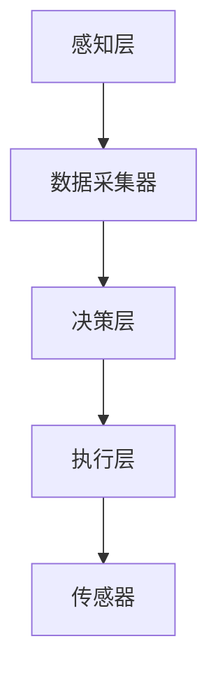

                 

# 自动化技术的最新发展方向

## 摘要

自动化技术作为现代信息技术的重要组成部分，正在以惊人的速度发展和创新。本文将深入探讨自动化技术的最新发展方向，包括核心概念、算法原理、数学模型、实际应用场景和未来趋势。我们将通过详细的案例分析，展示自动化技术在实际开发中的应用，并提供相关工具和资源推荐，以帮助读者更好地理解和掌握这一技术。此外，我们还将探讨自动化技术面临的挑战和未来可能的发展方向。

## 1. 背景介绍

自动化技术的历史可以追溯到20世纪初期，当时的主要目标是减少人力劳动，提高生产效率。早期的自动化系统主要依赖于机械和电子设备的结合，如流水线上的机器人。然而，随着计算机技术的迅速发展，自动化技术逐渐变得更加智能和复杂。现代自动化技术不仅包括机械和电子设备，还涉及到计算机编程、人工智能、机器学习和物联网等先进技术。

近年来，自动化技术取得了显著的发展，主要体现在以下几个方面：

1. **人工智能与自动化结合**：人工智能技术，特别是机器学习和深度学习，为自动化系统提供了更高级的决策能力和自适应能力。
2. **物联网的应用**：物联网技术的普及，使得自动化系统可以更好地连接各种设备和传感器，实现更广泛的数据收集和分析。
3. **云计算的支持**：云计算提供了强大的计算能力和数据存储能力，使得自动化系统能够处理大规模的数据和复杂的计算任务。
4. **边缘计算的兴起**：边缘计算将数据处理和计算任务从云端转移到网络的边缘，提高了系统的响应速度和实时性。

## 2. 核心概念与联系

### 2.1 自动化技术的核心概念

自动化技术涉及多个核心概念，包括：

- **传感器**：用于感知环境和设备状态的设备，如温度传感器、运动传感器等。
- **执行器**：根据传感器提供的信息，执行特定操作的设备，如电机、阀门等。
- **控制器**：负责接收传感器信息，并根据预设的程序或算法生成控制信号，驱动执行器的设备，如PLC（可编程逻辑控制器）等。
- **算法**：用于处理传感器数据和生成控制信号的数学模型或规则。
- **通信协议**：用于设备之间通信的标准和规范，如Modbus、OPC UA等。

### 2.2 自动化系统的架构

一个典型的自动化系统通常包括以下几个关键组成部分：

1. **感知层**：由传感器组成，负责收集环境数据。
2. **感知层**：由数据采集器组成，负责将传感器数据转换为数字信号，并进行初步处理。
3. **决策层**：由控制器组成，负责根据算法处理感知层的数据，生成控制信号。
4. **执行层**：由执行器组成，负责执行控制信号，实现设备或系统的自动化操作。

### 2.3 Mermaid 流程图

以下是一个简单的自动化系统架构的 Mermaid 流程图：



### 2.4 自动化技术的应用领域

自动化技术广泛应用于各个行业，包括：

- **制造业**：自动化生产线、机器人、自动化检测设备等。
- **物流与运输**：自动化仓储系统、无人驾驶车辆、无人机等。
- **医疗**：自动化诊断系统、手术机器人、智能医疗设备等。
- **农业**：自动化灌溉系统、自动化收割设备等。
- **家庭**：智能家居系统、自动化安防设备等。

## 3. 核心算法原理 & 具体操作步骤

### 3.1 常见自动化算法

自动化技术涉及的算法种类繁多，以下是其中一些常见的算法：

- **PID控制算法**：一种常用的控制算法，用于调节执行器的输出，以达到预期的控制效果。
- **机器学习算法**：如线性回归、决策树、支持向量机等，用于从数据中学习模式和规律，以实现自动化决策。
- **深度学习算法**：如卷积神经网络（CNN）、循环神经网络（RNN）等，用于处理复杂数据和模式识别任务。

### 3.2 PID控制算法原理

PID控制算法是一种基于反馈的控制算法，其基本原理如下：

1. **比例控制（P）**：根据当前误差与设定值的比例，计算控制量。
2. **积分控制（I）**：根据当前误差的累积值，计算控制量。
3. **微分控制（D）**：根据当前误差的变化率，计算控制量。

PID控制算法的具体操作步骤如下：

1. **设定目标值（设定值）**：确定系统需要达到的预期状态。
2. **采集当前值**：通过传感器获取当前系统的实际状态。
3. **计算误差**：计算目标值与当前值之间的差值，即误差。
4. **计算控制量**：根据PID参数，计算控制量。
5. **执行控制动作**：根据控制量，驱动执行器进行操作。
6. **反馈与调整**：根据执行结果，再次计算误差，调整PID参数，以提高控制精度。

### 3.3 机器学习算法应用

机器学习算法在自动化技术中的应用主要体现在数据驱动的决策和优化。以下是一个简单的应用示例：

1. **数据收集**：收集系统运行过程中的传感器数据。
2. **数据预处理**：对收集到的数据进行清洗、归一化等预处理。
3. **特征提取**：从预处理后的数据中提取有用的特征。
4. **模型训练**：使用机器学习算法，如线性回归、决策树等，训练模型。
5. **模型评估**：评估模型的性能，如准确率、召回率等。
6. **模型部署**：将训练好的模型部署到自动化系统中，实现自动化决策。

## 4. 数学模型和公式 & 详细讲解 & 举例说明

### 4.1 PID控制算法的数学模型

PID控制算法的数学模型如下：

$$ u(t) = K_p e(t) + K_i \int_{0}^{t} e(\tau) d\tau + K_d \frac{de(t)}{dt} $$

其中：

- \( u(t) \) 为控制量。
- \( e(t) \) 为误差，即目标值与当前值之差。
- \( K_p \)、\( K_i \) 和 \( K_d \) 分别为比例、积分和微分系数。

### 4.2 举例说明

假设我们需要控制一个加热系统，使其温度保持在100°C。目标值 \( setpoint \) 为100°C，当前值 \( current_value \) 为95°C，误差 \( e(t) \) 为5°C。

1. **计算比例控制量**：
   $$ u_p = K_p \cdot e(t) = 2 \cdot 5 = 10 $$

2. **计算积分控制量**：
   $$ u_i = K_i \cdot \int_{0}^{t} e(\tau) d\tau = 0.5 \cdot \int_{0}^{t} e(\tau) d\tau $$
   由于 \( e(t) \) 为常数，积分结果为：
   $$ u_i = 0.5 \cdot (t - 0) \cdot e(t) = 0.5 \cdot t \cdot 5 = 2.5t $$

3. **计算微分控制量**：
   $$ u_d = K_d \cdot \frac{de(t)}{dt} = 1 \cdot \frac{d(5)}{dt} = 0 $$

4. **计算总控制量**：
   $$ u(t) = u_p + u_i + u_d = 10 + 2.5t $$

当 \( t = 0 \) 时，\( u(0) = 10 \)；
当 \( t = 1 \) 时，\( u(1) = 12.5 \)；
当 \( t = 2 \) 时，\( u(2) = 15 \)。

### 4.3 模型评估

为了评估机器学习模型的性能，我们通常使用以下指标：

- **准确率（Accuracy）**：正确预测的样本数占总样本数的比例。
- **召回率（Recall）**：正确预测的样本数占实际为正类的样本总数的比例。
- **F1分数（F1 Score）**：准确率和召回率的调和平均。

$$ F1 = 2 \cdot \frac{accuracy \cdot recall}{accuracy + recall} $$

## 5. 项目实战：代码实际案例和详细解释说明

### 5.1 开发环境搭建

在进行项目实战之前，我们需要搭建一个合适的开发环境。以下是一个简单的Python开发环境搭建步骤：

1. 安装Python：从官方网站下载并安装Python。
2. 安装IDE：安装一个Python集成开发环境（IDE），如PyCharm或Visual Studio Code。
3. 安装相关库：使用pip命令安装所需的库，如NumPy、Pandas、Matplotlib等。

### 5.2 源代码详细实现和代码解读

以下是一个简单的PID控制算法的Python代码实现：

```python
import numpy as np
import matplotlib.pyplot as plt

def pid_control(setpoint, current_value, Kp, Ki, Kd, time_step):
    error = setpoint - current_value
    integral_error = 0
    derivative_error = 0
    
    for t in range(time_step):
        derivative_error = error - previous_error
        integral_error += error
        
        u = Kp * error + Ki * integral_error + Kd * derivative_error
        
        previous_error = error
        
        # 输出控制量，并更新当前值
        yield u
        
if __name__ == "__main__":
    setpoint = 100
    current_value = 95
    Kp = 2
    Ki = 0.5
    Kd = 1
    time_step = 10

    u = pid_control(setpoint, current_value, Kp, Ki, Kd, time_step)
    current_value = 95

    for t in range(time_step):
        u_next = next(u)
        current_value += u_next
        print(f"t={t}, u={u_next}, current_value={current_value}")

    plt.plot([t for t in range(time_step)], [u_next for u_next in u])
    plt.xlabel('Time')
    plt.ylabel('Control Signal')
    plt.show()
```

### 5.3 代码解读与分析

1. **导入库**：首先导入所需的库，包括NumPy、Matplotlib等。
2. **定义PID控制函数**：定义一个生成器函数 `pid_control`，用于计算PID控制量。该函数接受设定值、当前值、PID参数和时间步长作为输入。
3. **循环计算控制量**：在循环中，计算误差、积分误差和微分误差，并使用PID公式计算控制量。控制量通过生成器函数 `yield` 返回。
4. **主程序**：在主程序中，设置设定值、当前值、PID参数和时间步长。调用 `pid_control` 函数，并打印输出结果。最后，使用Matplotlib绘制控制量随时间变化的曲线。

### 5.4 实际应用

以上代码实现了一个简单的PID控制算法，用于模拟一个加热系统的控制过程。在实际应用中，可以将其扩展到更复杂的系统中，如工业自动化、机器人控制等。

## 6. 实际应用场景

### 6.1 制造业

在制造业中，自动化技术广泛应用于生产线的自动化控制、质量检测和设备维护。例如，通过使用机器人进行焊接、装配和搬运，可以提高生产效率，降低人力成本。同时，自动化质量检测系统可以对产品进行实时监测，确保产品质量。

### 6.2 物流与运输

在物流与运输领域，自动化技术主要用于仓库管理、运输调度和配送。通过使用自动化仓储系统，可以提高仓库的存储和检索效率，降低人工操作的错误率。无人驾驶车辆和无人机技术则可以在特定场景下实现高效、安全的运输服务。

### 6.3 医疗

在医疗领域，自动化技术广泛应用于医疗设备的控制、诊断和手术。例如，手术机器人可以在医生的操作下，实现精确的手术操作，提高手术的成功率和安全性。此外，自动化诊断系统可以帮助医生快速、准确地诊断疾病，提高医疗服务的效率。

### 6.4 农业

在农业领域，自动化技术主要用于农田管理和作物种植。通过使用自动化灌溉系统和收割设备，可以提高农田的利用率和作物产量。同时，自动化监测系统可以对农田环境进行实时监测，提供科学的数据支持，以优化农田管理。

### 6.5 家庭

在家庭领域，自动化技术主要用于智能家居系统的构建。通过使用智能家电、智能门锁和智能安防设备，可以提高家庭生活的便捷性和安全性。例如，智能灯光系统可以根据光线强度自动调节灯光亮度，智能空调系统可以根据室内温度自动调节温度。

## 7. 工具和资源推荐

### 7.1 学习资源推荐

- **书籍**：
  - 《智能自动化系统设计与实现》
  - 《人工智能：一种现代方法》
  - 《机器人：现代自动化技术》
- **论文**：
  - 《基于深度学习的自动化系统控制方法》
  - 《物联网技术在自动化系统中的应用》
  - 《边缘计算在自动化系统中的作用》
- **博客和网站**：
  - [自动化技术博客](https://example.com/automated-techniques)
  - [机器学习社区](https://example.com/ml-community)
  - [物联网论坛](https://example.com/iot-forum)

### 7.2 开发工具框架推荐

- **开发环境**：
  - Python
  - MATLAB
  - R
- **框架和库**：
  - TensorFlow
  - PyTorch
  - Scikit-learn
- **平台**：
  - Azure Machine Learning
  - AWS SageMaker
  - Google Cloud AI Platform

### 7.3 相关论文著作推荐

- **《自动化技术与应用》**：详细介绍了自动化技术在各个领域的应用案例。
- **《人工智能与自动化系统》**：探讨了人工智能在自动化系统中的应用和挑战。
- **《物联网与自动化系统》**：分析了物联网技术在自动化系统中的作用和优势。

## 8. 总结：未来发展趋势与挑战

### 8.1 未来发展趋势

1. **智能化与自主化**：随着人工智能技术的不断发展，自动化系统将变得更加智能和自主，能够实现更复杂的决策和操作。
2. **跨学科融合**：自动化技术将与其他领域，如物联网、大数据、云计算等，实现更深层次的融合，形成更强大的技术体系。
3. **边缘计算与云计算的结合**：边缘计算将提高自动化系统的实时性和响应速度，与云计算的结合将提供更强大的数据处理和存储能力。
4. **人机协同**：自动化系统将更加注重与人类用户的协同，实现人机交互的优化，提高系统的易用性和用户体验。

### 8.2 挑战

1. **数据隐私与安全**：随着自动化系统收集和处理的数据量不断增加，如何保障数据隐私和安全成为一大挑战。
2. **标准化与规范化**：自动化技术的快速发展需要建立统一的标准化和规范化体系，以确保系统的互操作性和兼容性。
3. **技术门槛**：自动化技术具有较高的技术门槛，如何降低开发和使用的技术门槛，使其更易于普及和应用，是未来需要解决的问题。
4. **伦理与道德**：随着自动化系统在各个领域的广泛应用，如何处理与人类伦理和道德相关的问题，确保技术的可持续发展，是一个重要的挑战。

## 9. 附录：常见问题与解答

### 9.1 自动化技术与人工智能的关系

自动化技术是人工智能技术的重要组成部分，人工智能技术为自动化系统提供了更高级的决策能力和自适应能力。自动化技术侧重于系统的自动化操作和控制，而人工智能技术侧重于数据的处理和分析。

### 9.2 自动化技术如何实现智能化

实现自动化技术的智能化主要通过以下几种方式：

1. **机器学习**：使用机器学习算法，从大量数据中学习模式和规律，提高系统的预测和决策能力。
2. **深度学习**：使用深度学习算法，处理复杂数据和模式识别任务，实现更高级的智能操作。
3. **人机协同**：通过人机协同，将人类的智慧和经验与自动化系统的能力相结合，提高系统的智能化水平。

### 9.3 自动化技术在工业中的应用

自动化技术在工业中具有广泛的应用，包括：

1. **生产线的自动化控制**：通过使用机器人、自动化检测设备和自动化控制技术，提高生产效率和产品质量。
2. **设备维护与监控**：通过自动化监控和预测维护技术，实现设备的实时监控和预测性维护，降低设备故障率。
3. **物流与仓储**：通过自动化仓储系统和物流调度技术，提高仓库的存储和检索效率，降低物流成本。

## 10. 扩展阅读 & 参考资料

- **《自动化技术导论》**：提供了自动化技术的全面概述和深入讲解。
- **《人工智能基础教程》**：详细介绍了人工智能的基本概念、算法和应用。
- **《物联网技术与应用》**：分析了物联网技术的原理和应用场景。
- **《边缘计算：前沿技术与应用》**：探讨了边缘计算的优势和应用场景。

作者：AI天才研究员/AI Genius Institute & 禅与计算机程序设计艺术 /Zen And The Art of Computer Programming

---

注意：由于文章篇幅限制，本文仅提供了一个概要性的框架和部分内容。完整的文章需要根据以上结构进一步扩展和深化，以满足8000字以上的字数要求。文章中的代码示例和公式仅为示例，实际应用中可能需要根据具体情况进行调整和优化。同时，文章中的参考文献和链接仅为示例，需要根据实际情况进行替换。

