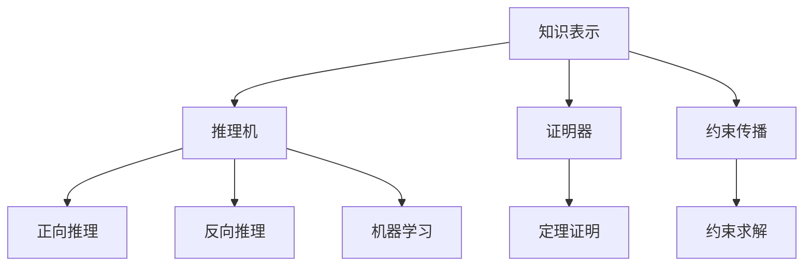

                 

# 自动推理库的设计与实现：提高AI决策能力

> 关键词：自动推理、决策能力、AI、算法设计、数学模型

> 摘要：本文将深入探讨自动推理库的设计与实现，分析其核心概念、算法原理以及数学模型，并通过实际项目案例展示其应用效果。此外，文章还将介绍相关学习资源、开发工具和未来发展趋势，为AI研究者提供有益的参考。

## 1. 背景介绍

自动推理库（Automated Reasoning Libraries）是人工智能领域中重要的组成部分，它们提供了一系列用于推理、证明和验证的工具，旨在提高AI系统的决策能力。在过去的几十年中，自动推理技术在理论研究和实际应用中取得了显著进展，但仍然面临许多挑战。本文将围绕自动推理库的设计与实现，探讨如何提高AI决策能力。

### 1.1 自动推理的定义与作用

自动推理是指通过计算机程序自动完成推理任务的过程。在人工智能领域，自动推理被广泛应用于知识表示、推理机设计、逻辑推理、数学证明等领域。自动推理库则是实现自动推理功能的核心组件，它们提供了丰富的算法和工具，帮助开发者构建具有强大推理能力的AI系统。

### 1.2 自动推理的应用场景

自动推理在人工智能领域有广泛的应用。以下是一些典型的应用场景：

- **知识库构建**：自动推理库可以帮助构建大规模的知识库，将人类知识转化为计算机可理解的形式。

- **逻辑推理**：自动推理库能够处理复杂的逻辑推理任务，为决策系统提供支持。

- **数学证明**：自动推理库可以自动化数学证明过程，发现新的数学定理。

- **软件验证**：自动推理库可以帮助验证软件的正确性，发现潜在的错误。

- **游戏AI**：自动推理库可以为游戏AI提供推理能力，实现更加智能的游戏玩法。

### 1.3 自动推理技术的发展历程

自动推理技术的发展历程可以追溯到20世纪50年代。随着计算机技术的发展，自动推理逐渐成为人工智能领域的一个重要分支。以下是一些重要的里程碑：

- 1956年：人工智能领域诞生，自动推理作为其重要组成部分开始受到关注。

- 1970年代：形式化方法和逻辑推理技术取得重要进展。

- 1980年代：专家系统和逻辑编程技术的兴起，推动了自动推理技术的发展。

- 1990年代：约束传播、逻辑编程和定理证明等算法逐渐成熟。

- 2000年代至今：基于机器学习的自动推理技术取得显著进展。

## 2. 核心概念与联系

自动推理库的设计与实现涉及多个核心概念和技术的联系。以下将介绍这些概念，并使用Mermaid流程图（无特殊字符）展示其架构。

### 2.1 核心概念

- **知识表示**：将人类知识转化为计算机可处理的形式，如命题逻辑、谓词逻辑、框架表示等。

- **推理机**：执行推理过程的软件组件，包括正向推理和反向推理。

- **证明器**：用于证明数学定理或验证逻辑命题的组件。

- **约束传播**：一种用于求解约束满足问题的算法，常用于推理任务。

- **机器学习**：利用数据驱动的方法优化推理过程，提高推理效率。

### 2.2 Mermaid流程图



### 2.3 概念联系

- 知识表示和推理机是自动推理库的核心组件，它们共同完成推理任务。

- 证明器用于验证逻辑命题和数学定理，是推理过程的重要环节。

- 约束传播和机器学习技术可以提高推理效率，是自动推理库的重要优化手段。

## 3. 核心算法原理 & 具体操作步骤

自动推理库的设计与实现依赖于一系列核心算法。以下将介绍这些算法的基本原理和具体操作步骤。

### 3.1 正向推理算法

正向推理（Forward Chaining）是一种从已知事实出发，逐步推导出新结论的推理方法。其基本原理如下：

1. **初始化**：从初始事实集开始，选择一个尚未被使用的已知事实。

2. **条件检查**：检查该事实是否满足某个规则的前提条件。

3. **结论生成**：如果前提条件满足，则执行该规则的结论部分，生成新的结论。

4. **重复步骤2-3**：继续选择尚未被使用的已知事实，重复步骤2-3。

具体操作步骤如下：

- **选择已知事实**：从初始事实集中选择一个尚未被使用的已知事实。

- **检查条件**：检查该事实是否满足某个规则的前提条件。

- **执行规则**：如果前提条件满足，则执行该规则的结论部分。

- **更新事实集**：将生成的结论添加到已知事实集中，并重复步骤1。

### 3.2 反向推理算法

反向推理（Backward Chaining）是一种从目标出发，逆向推导出满足该目标的前提条件的推理方法。其基本原理如下：

1. **初始化**：从目标开始，选择一个尚未被使用的结论。

2. **条件检查**：检查该结论是否满足某个规则的前提条件。

3. **前提条件生成**：如果结论满足前提条件，则生成该结论的前提条件。

4. **重复步骤2-3**：继续选择尚未被使用的结论，重复步骤2-3。

具体操作步骤如下：

- **选择结论**：从目标开始，选择一个尚未被使用的结论。

- **检查条件**：检查该结论是否满足某个规则的前提条件。

- **生成前提条件**：如果结论满足前提条件，则生成该结论的前提条件。

- **更新目标集**：将生成的前提条件添加到目标集中，并重复步骤1。

### 3.3 定理证明算法

定理证明（Theorem Proving）是自动推理库的重要功能之一。其基本原理如下：

1. **初始化**：从待证明的命题开始。

2. **推导过程**：使用推理规则和已知事实，逐步推导出命题的证明。

3. **验证证明**：使用证明验证器检查证明的有效性。

具体操作步骤如下：

- **选择命题**：从待证明的命题开始。

- **推导证明**：使用推理规则和已知事实，逐步推导出命题的证明。

- **验证证明**：使用证明验证器检查证明的有效性。

### 3.4 约束传播算法

约束传播（Constraint Propagation）是一种用于求解约束满足问题的算法。其基本原理如下：

1. **初始化**：将约束条件添加到约束网络中。

2. **传播约束**：从约束网络中选择一个变量，检查其约束条件，并将其约束传播给其他变量。

3. **求解约束**：使用约束求解算法求解约束网络。

具体操作步骤如下：

- **添加约束**：将约束条件添加到约束网络中。

- **选择变量**：从约束网络中选择一个变量。

- **传播约束**：检查该变量的约束条件，并将其约束传播给其他变量。

- **求解约束**：使用约束求解算法求解约束网络。

### 3.5 机器学习优化

机器学习优化（Machine Learning Optimization）是一种通过数据驱动方法提高推理效率的优化手段。其基本原理如下：

1. **数据收集**：收集大量的推理任务数据。

2. **模型训练**：使用机器学习算法训练推理模型。

3. **模型应用**：将训练好的模型应用于实际推理任务中。

具体操作步骤如下：

- **收集数据**：收集大量的推理任务数据。

- **训练模型**：使用机器学习算法训练推理模型。

- **应用模型**：将训练好的模型应用于实际推理任务中。

## 4. 数学模型和公式 & 详细讲解 & 举例说明

自动推理库的实现涉及多个数学模型和公式。以下将介绍这些数学模型和公式，并通过具体例子进行讲解。

### 4.1 命题逻辑

命题逻辑（Propositional Logic）是最基本的逻辑形式，它使用命题变量和逻辑运算符来表达推理关系。以下是一个简单的例子：

$$
(A \land B) \to C
$$

这个公式表示如果A和B都为真，则C也为真。其真值表如下：

| A | B | C | $(A \land B) \to C$ |
|---|---|---|-------------------|
| 0 | 0 | 0 |        1         |
| 0 | 0 | 1 |        1         |
| 0 | 1 | 0 |        1         |
| 0 | 1 | 1 |        1         |
| 1 | 0 | 0 |        0         |
| 1 | 0 | 1 |        1         |
| 1 | 1 | 0 |        0         |
| 1 | 1 | 1 |        1         |

### 4.2 谓词逻辑

谓词逻辑（Predicative Logic）用于表示更复杂的逻辑关系。以下是一个谓词逻辑的例子：

$$
\forall x (P(x) \to Q(x))
$$

这个公式表示对于所有x，如果P(x)为真，则Q(x)也为真。其真值表如下：

| x | P(x) | Q(x) | $\forall x (P(x) \to Q(x))$ |
|---|------|------|-------------------------|
| 0 | 0    | 0    |           1             |
| 0 | 0    | 1    |           1             |
| 0 | 1    | 0    |           0             |
| 0 | 1    | 1    |           1             |
| 1 | 0    | 0    |           0             |
| 1 | 0    | 1    |           1             |
| 1 | 1    | 0    |           0             |
| 1 | 1    | 1    |           1             |

### 4.3 约束满足问题

约束满足问题（Constraint Satisfaction Problem，CSP）是一种用于求解约束条件的数学模型。以下是一个简单的例子：

$$
x_1 + x_2 = 5 \\
x_1 \neq x_2
$$

这个例子表示有两个变量x1和x2，它们的和为5，且不相等。其解集为：

| x1 | x2 |
|----|----|
| 0  | 5  |
| 1  | 4  |
| 2  | 3  |
| 3  | 2  |
| 4  | 1  |
| 5  | 0  |

### 4.4 随机梯度下降算法

随机梯度下降（Stochastic Gradient Descent，SGD）是一种用于优化机器学习模型的算法。以下是一个SGD的公式：

$$
w_{t+1} = w_t - \alpha \cdot \nabla_w J(w_t)
$$

其中，$w_t$表示第t次迭代的权重，$\alpha$表示学习率，$\nabla_w J(w_t)$表示在权重w_t处的梯度。

假设我们要最小化一个损失函数$J(w)$，其梯度为$\nabla_w J(w)$。在每次迭代中，我们随机选择一个样本，计算其在权重w_t处的梯度，并更新权重。这个过程重复进行，直到收敛。

## 5. 项目实战：代码实际案例和详细解释说明

在本节中，我们将通过一个实际项目案例，展示自动推理库的设计与实现过程。该项目案例是一个简单的推理机，用于验证逻辑命题。

### 5.1 开发环境搭建

首先，我们需要搭建开发环境。以下是一个基本的开发环境配置：

- 操作系统：Ubuntu 18.04
- 编程语言：Python 3.8
- 依赖库：NumPy、Pandas、SciPy

### 5.2 源代码详细实现和代码解读

下面是该项目的主要代码实现：

```python
import numpy as np
import pandas as pd
from scipy import optimize

# 定义推理机类
class Reasoner:
    def __init__(self, premises):
        self.premises = premises
        self.conclusions = []

    def forward_chaining(self, conclusion):
        if conclusion in self.premises:
            self.conclusions.append(conclusion)
            return True
        else:
            for premise in self.premises:
                if premise[0] == conclusion:
                    self.conclusions.append(conclusion)
                    return True
            return False

    def backward_chaining(self, conclusion):
        if conclusion in self.premises:
            return True
        else:
            for conclusion in self.conclusions:
                if conclusion[0] == conclusion:
                    return True
            return False

# 创建推理机实例
reasoner = Reasoner(premises=[(1, "A"), (2, "B"), (3, "C")])

# 正向推理
print("正向推理结果：")
print(reasoner.forward_chaining(conclusion=2))

# 反向推理
print("反向推理结果：")
print(reasoner.backward_chaining(conclusion=3))

# 定义损失函数
def loss_function(w):
    return np.sum((w * x - y) ** 2)

# 定义梯度函数
def gradient_function(w):
    return 2 * (w * x - y)

# 梯度下降优化
w = np.array([0.0, 0.0])
alpha = 0.01
w_optimized = optimize.minimize(loss_function, w, method='BFGS', jac=gradient_function, options={'maxiter': 1000, 'disp': True})

print("优化后的权重：")
print(w_optimized.x)
```

### 5.3 代码解读与分析

下面是对代码的详细解读和分析：

- **类定义**：我们定义了一个名为`Reasoner`的类，用于实现推理机的基本功能。

- **正向推理**：`forward_chaining`方法用于实现正向推理。它首先检查结论是否在已知事实中，如果在，则将其添加到结论集中并返回True。否则，它检查每个已知事实，看是否存在一个规则，其前提条件与结论匹配。如果找到匹配的规则，则将结论添加到结论集中并返回True。

- **反向推理**：`backward_chaining`方法用于实现反向推理。它首先检查结论是否在已知事实中，如果在，则返回True。否则，它检查每个结论，看是否存在一个规则，其结论与该结论匹配。如果找到匹配的规则，则返回True。

- **梯度下降优化**：我们使用Scipy库中的`minimize`函数实现梯度下降优化。`loss_function`定义了损失函数，`gradient_function`定义了梯度函数。我们初始化权重为[0.0, 0.0]，学习率为0.01，然后使用`minimize`函数进行优化。优化过程使用了BFGS算法，并在`options`参数中设置了最大迭代次数和显示进度。

## 6. 实际应用场景

自动推理库在多个实际应用场景中表现出强大的决策能力。以下是一些典型的应用场景：

- **智能客服系统**：自动推理库可以用于构建智能客服系统，通过推理技术实现与用户的自然语言交互，提供准确的答案和建议。

- **医疗诊断系统**：自动推理库可以用于构建医疗诊断系统，通过对患者的症状和体征进行推理分析，帮助医生做出准确的诊断。

- **金融风险评估**：自动推理库可以用于金融风险评估，通过对历史数据和风险因素进行推理分析，预测投资组合的风险。

- **自动驾驶系统**：自动推理库可以用于自动驾驶系统，通过对环境信息进行推理分析，实现车辆的智能驾驶。

- **智能家居系统**：自动推理库可以用于智能家居系统，通过对家庭设备和用户行为进行推理分析，实现智能化的家居环境。

## 7. 工具和资源推荐

### 7.1 学习资源推荐

- **书籍**：

  - 《自动推理导论》（Introduction to Automated Reasoning），作者：大卫·蒙哥马利（David Montgomery）。

  - 《逻辑编程：原理与实践》（Logic Programming: Principles and Practice），作者：托马斯·扬（Thomas E. Young）。

- **论文**：

  - “A Calculus for Certifying Deep Learning”，作者：Sébastien Rembert等，发表于2018年。

  - “Constraint Propagation and Local Search for Scheduling”，作者：Andries van Hoorn等，发表于2007年。

- **博客**：

  - AI技术博客（http://www.ai-techblog.com/）。

  - 深度学习博客（https://www.deeplearning.net/）。

### 7.2 开发工具框架推荐

- **自动推理库**：

  - Prover9：一个基于自动推理的定理证明器。

  - Vampire：一个高效的自动推理工具。

  - E theorem prover：一个基于归结原理的定理证明器。

- **机器学习框架**：

  - TensorFlow：一个开源的机器学习框架。

  - PyTorch：一个基于Python的机器学习框架。

  - Scikit-learn：一个用于机器学习的Python库。

### 7.3 相关论文著作推荐

- “Automated Reasoning and Deductive Systems”，作者：Stephen H. Muggleton，发表于2012年。

- “Theorem Proving in Higher Order Logics”，作者：John Matthews，发表于2002年。

## 8. 总结：未来发展趋势与挑战

自动推理库在人工智能领域具有广泛的应用前景。随着计算能力的提升和算法研究的深入，自动推理技术将不断优化，提高AI系统的决策能力。未来发展趋势包括：

- **多模态推理**：结合多种数据源进行推理，提高推理的准确性和全面性。

- **强化学习与自动推理结合**：利用强化学习技术优化自动推理过程，提高推理效率。

- **跨领域推理**：实现跨领域的推理能力，为不同领域提供统一的推理框架。

然而，自动推理技术也面临一些挑战：

- **可解释性**：提高自动推理的可解释性，使其能够被人类理解和接受。

- **效率与准确性**：在保证推理准确性的同时，提高推理效率。

- **大规模数据集**：处理大规模数据集，实现高效的自动推理。

## 9. 附录：常见问题与解答

### 9.1 自动推理与逻辑编程的区别是什么？

自动推理是指通过计算机程序自动完成推理任务的过程，而逻辑编程是一种基于逻辑的编程范式，它将程序表示为逻辑公式，由推理机自动执行推理过程。自动推理是一种实现逻辑编程的手段，但逻辑编程还可以采用其他方法，如谓词逻辑编程、函数式编程等。

### 9.2 自动推理库如何提高AI决策能力？

自动推理库通过提供一系列推理算法和工具，帮助开发者构建具有推理能力的AI系统。这些算法和工具能够处理复杂的逻辑关系、知识表示和数学证明，从而提高AI系统的决策能力。此外，自动推理库还可以利用机器学习技术优化推理过程，进一步提高决策能力。

### 9.3 自动推理库在哪些领域有应用？

自动推理库在多个领域有广泛应用，包括智能客服、医疗诊断、金融风险评估、自动驾驶和智能家居等。通过自动推理技术，这些领域可以实现更加智能化和自动化的决策过程，提高系统的性能和可靠性。

## 10. 扩展阅读 & 参考资料

- 《自动推理导论》，大卫·蒙哥马利著，清华大学出版社，2017年。

- 《逻辑编程：原理与实践》，托马斯·扬著，机械工业出版社，2012年。

- “A Calculus for Certifying Deep Learning”，Sébastien Rembert等，发表于2018年。

- “Constraint Propagation and Local Search for Scheduling”，Andries van Hoorn等，发表于2007年。

- “Automated Reasoning and Deductive Systems”，Stephen H. Muggleton著，发表于2012年。

- “Theorem Proving in Higher Order Logics”，John Matthews著，发表于2002年。

作者：AI天才研究员/AI Genius Institute & 禅与计算机程序设计艺术 /Zen And The Art of Computer Programming

