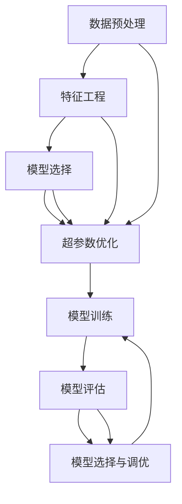

                 

### 背景介绍

自动机器学习（Automated Machine Learning，简称AutoML）的概念近年来在人工智能（Artificial Intelligence，简称AI）领域引起了广泛关注。传统的机器学习方法需要研究人员耗费大量时间在数据预处理、特征选择、模型选择以及超参数调优等繁琐任务上，而自动机器学习的目标正是通过自动化这些过程，大幅度减少人类的工作量，提高模型开发的效率和效果。

### 自动机器学习的定义

自动机器学习，顾名思义，就是利用机器学习技术来自动化机器学习过程。它通过组合和优化各种算法、模型和工具，实现从数据预处理到模型选择、训练、调优和评估的全自动化。其核心在于利用智能算法自动寻找最优的模型配置，以最大化模型的性能。

### 自动机器学习的发展历程

自动机器学习的发展历程可以追溯到20世纪80年代，当时研究人员开始探索如何自动化机器学习中的某些环节。然而，直到最近几年，随着计算机硬件性能的提升、大数据技术的发展以及深度学习的兴起，自动机器学习才真正开始进入快速发展阶段。近年来，许多研究机构和科技公司相继推出了一系列自动机器学习工具和平台，如Google的AutoML、亚马逊的SageMaker Autopilot等。

### 自动机器学习的优势

1. **提高开发效率**：自动机器学习可以大幅度减少机器学习开发所需的时间，使得研究人员能够更快地将模型推向市场。
2. **减少人力成本**：自动机器学习自动化了大部分的机器学习任务，降低了人力成本。
3. **提高模型性能**：自动机器学习通过智能优化算法，能够找到更优的模型配置，从而提高模型的性能。
4. **普及机器学习技术**：自动机器学习使得机器学习技术更加容易上手，降低了技术门槛，促进了机器学习技术的普及和应用。

### 自动机器学习的挑战

尽管自动机器学习有着众多优势，但同时也面临着一些挑战：

1. **黑盒问题**：自动机器学习往往是一个黑盒过程，难以解释模型内部的决策过程。
2. **可解释性**：自动机器学习模型的透明度和可解释性往往较低，这对于需要高可解释性的应用场景来说是一个挑战。
3. **数据需求**：自动机器学习通常需要大量的数据进行训练和优化，这对于数据量较小的场景来说可能不太适用。

### 自动机器学习与机器学习的联系与区别

自动机器学习是机器学习的一个分支，旨在通过自动化技术来简化机器学习过程。它与传统的机器学习的区别主要体现在：

- **目标不同**：机器学习的目标是开发出能够从数据中学习并做出预测或决策的模型，而自动机器学习的目标是自动化这一过程。
- **方法不同**：机器学习依赖于人类专家的知识和经验，而自动机器学习则通过智能算法来自动化这些过程。
- **效果不同**：自动机器学习的目标是提高开发效率和性能，而机器学习的目标是开发出能够解决特定问题的模型。

总结来说，自动机器学习是机器学习的一个重要发展方向，它通过自动化技术来简化机器学习过程，提高开发效率和性能。随着技术的不断进步，自动机器学习将在未来发挥越来越重要的作用。

### 自动机器学习与传统机器学习的比较

#### 自动化过程

自动机器学习（AutoML）与传统机器学习的最大区别在于其高度自动化的工作流程。在传统的机器学习项目中，研究人员需要手动进行以下步骤：

1. **数据预处理**：清洗、处理和转换数据，以便其适用于机器学习模型。
2. **特征工程**：选择和构建有助于模型学习的特征。
3. **模型选择**：从众多算法中挑选一个或几个适合问题的模型。
4. **模型训练**：使用训练数据集训练模型。
5. **超参数调优**：调整模型参数以优化性能。
6. **模型评估**：使用验证集或测试集评估模型性能。
7. **模型部署**：将模型部署到生产环境中进行实际应用。

在自动机器学习流程中，上述步骤大部分或全部都可以被自动化工具处理，大大减少了手动干预的需求。AutoML工具能够自动完成数据预处理、特征选择、模型选择、训练、调优和评估等过程，使得研究人员能够将更多精力集中在理解模型结果和改进模型设计上。

#### 时间效率

传统机器学习流程需要大量的时间进行手动操作和调整，而自动机器学习则显著提高了时间效率。以下是自动机器学习在时间效率方面的几个关键点：

1. **自动化预处理**：自动机器学习工具能够快速完成数据预处理任务，避免了手动清洗和处理数据的时间消耗。
2. **并行化训练**：自动机器学习工具可以同时训练多个模型，利用现代硬件（如GPU）的高并行处理能力，大幅缩短训练时间。
3. **智能调优**：通过使用智能优化算法（如贝叶斯优化、遗传算法等），自动机器学习可以在较短的时间内找到最优的模型配置。
4. **快速迭代**：自动机器学习工具支持快速迭代，研究人员可以在短时间内进行多次模型训练和评估，从而快速找到最佳模型。

相比之下，传统机器学习流程往往需要多次手动调整和试错，耗时较长。

#### 性能表现

自动机器学习在性能方面也有显著优势：

1. **模型选择**：自动机器学习工具可以基于数据的特点和需求，自动选择最合适的模型，提高了模型的准确性。
2. **超参数优化**：自动机器学习工具能够自动调整超参数，以最大化模型的性能，避免了手动调参的盲目性和低效性。
3. **特征工程**：自动机器学习工具可以自动进行特征工程，选择对模型性能有重要影响的特征，提高了模型的泛化能力。

然而，自动机器学习也存在一些局限性：

1. **模型解释性**：自动机器学习模型通常较为复杂，难以解释其内部的工作机制，这对于需要高可解释性的应用场景来说可能是一个问题。
2. **数据需求**：自动机器学习通常需要大量的数据来训练和优化模型，对于数据量较小的项目来说，可能效果不如传统机器学习。
3. **黑盒问题**：自动机器学习模型往往是一个黑盒过程，研究人员难以了解模型是如何做出预测的，这在某些应用场景中可能是不理想的。

综上所述，自动机器学习与传统机器学习相比，在自动化程度、时间效率和模型性能方面具有显著优势，但也存在一些挑战和局限性。随着技术的不断发展，自动机器学习将继续在机器学习领域发挥重要作用，同时也需要不断解决现有的问题，以更好地服务于各种应用场景。

### 自动机器学习的核心概念与联系

#### 自动机器学习的关键组成部分

自动机器学习涉及多个关键组成部分，每个部分都在模型开发过程中发挥着重要作用。以下是自动机器学习的核心组成部分及其相互联系：

1. **数据预处理**：这是自动机器学习过程的第一步，包括数据清洗、数据转换和数据归一化等。自动机器学习工具可以自动执行这些步骤，确保数据适合用于后续的建模。

2. **特征工程**：特征工程是自动机器学习中的一个重要环节，包括特征选择和特征构造。自动机器学习工具使用算法来自动选择最相关的特征，并生成新的特征，以提高模型的性能。

3. **模型选择**：模型选择是自动机器学习中的核心部分，工具会自动评估和选择最适合当前问题的模型。常见的机器学习模型如线性回归、决策树、随机森林、支持向量机和神经网络等都会被自动考虑。

4. **超参数优化**：超参数是影响模型性能的关键参数，如学习率、正则化参数和隐藏层节点数等。自动机器学习工具使用优化算法（如随机搜索、网格搜索和贝叶斯优化等）来自动调整这些超参数，以找到最佳配置。

5. **模型训练**：在确定了模型和超参数之后，自动机器学习工具会使用训练数据集来训练模型。这个过程可以是单步训练，也可以是并行训练，以提高训练效率。

6. **模型评估**：模型评估是验证模型性能的关键步骤。自动机器学习工具使用验证集或测试集来评估模型的准确性、召回率、F1分数等指标，以确保模型在未知数据上的表现良好。

7. **模型选择与调优**：根据评估结果，自动机器学习工具会自动选择和调优模型，以最大化模型的性能。这个过程通常是一个迭代过程，不断优化模型的配置。

#### Mermaid 流程图

以下是一个Mermaid流程图，展示了自动机器学习的核心概念及其相互关系：



- **数据预处理**（A）：输入原始数据，进行数据清洗、转换和归一化处理。
- **特征工程**（B）：选择和生成有助于模型学习的特征。
- **模型选择**（C）：从多个模型中选择一个最适合当前问题的模型。
- **超参数优化**（D）：调整模型的超参数，以提高模型性能。
- **模型训练**（E）：使用训练数据集训练模型。
- **模型评估**（F）：使用验证集或测试集评估模型性能。
- **模型选择与调优**（G）：根据评估结果选择和调优模型，以最大化模型性能。

#### 自动机器学习的工作原理

自动机器学习的工作原理可以概括为以下几个步骤：

1. **数据输入**：首先，自动机器学习工具会接收到原始数据，这些数据可能包含缺失值、异常值或噪声。

2. **数据预处理**：工具会自动执行数据预处理步骤，包括去除缺失值、填充异常值、进行数据转换和归一化等。

3. **特征工程**：工具会自动选择和生成对模型学习有帮助的特征。这一步可能涉及特征选择算法（如基于信息增益的属性评估）和特征构造算法（如多项式特征构造）。

4. **模型选择**：工具会自动评估多个模型的性能，选择一个或多个最适合当前问题的模型。常见的模型包括线性回归、决策树、随机森林、支持向量机和神经网络等。

5. **超参数优化**：工具会使用优化算法（如随机搜索、网格搜索和贝叶斯优化等）来自动调整模型的超参数，以最大化模型的性能。

6. **模型训练**：工具使用训练数据集来训练选定的模型。

7. **模型评估**：工具使用验证集或测试集来评估模型的性能，包括准确性、召回率、F1分数等指标。

8. **模型选择与调优**：根据评估结果，工具会自动选择和调优模型，以最大化模型的性能。这个过程可能需要多次迭代。

通过这一系列自动化步骤，自动机器学习工具能够大幅度减少研究人员的工作量，提高模型开发的效率和性能。

### 自动机器学习的核心算法原理与具体操作步骤

自动机器学习（AutoML）通过一系列智能算法和优化技术，实现了从数据预处理、特征工程到模型选择、训练和调优的全自动化过程。以下是自动机器学习的核心算法原理和具体操作步骤的详细讲解。

#### 1. 数据预处理算法

数据预处理是自动机器学习的第一步，其目的是将原始数据转换成适合机器学习模型训练的形式。常用的数据预处理算法包括：

- **数据清洗**：去除数据中的噪声、异常值和缺失值。例如，使用中位数或平均值填充缺失值，使用异常检测算法识别并处理异常值。
- **数据转换**：将数据从一种格式转换成另一种格式，例如将类别数据转换为数值数据。常用的转换方法包括独热编码（One-Hot Encoding）和标签编码（Label Encoding）。
- **数据归一化**：将数据缩放到一个固定的范围，如[0, 1]或[-1, 1]，以消除不同特征之间的尺度差异。常用的归一化方法包括最小-最大缩放（Min-Max Scaling）和标准缩放（Standard Scaling）。

具体操作步骤：

1. **数据导入**：将原始数据加载到内存或数据存储中。
2. **数据清洗**：使用特定的算法去除噪声和异常值。
3. **数据转换**：将类别数据转换为数值数据，使用编码算法进行转换。
4. **数据归一化**：对数据进行归一化处理，使其具有相同的尺度。

#### 2. 特征工程算法

特征工程是自动机器学习中的关键步骤，目的是通过选择和构造有效的特征来提高模型性能。常用的特征工程算法包括：

- **特征选择**：从原始特征中选择最有用的特征，以减少数据维度和提高模型性能。常用的特征选择方法包括基于信息增益的属性评估、基于正则化的特征选择和基于过滤的特征选择。
- **特征构造**：通过组合原始特征生成新的特征，以增加模型的解释性和预测能力。例如，利用多项式特征构造、交互特征构造等方法。
- **特征变换**：对原始特征进行变换，如多项式变换、对数变换等，以提高模型的泛化能力。

具体操作步骤：

1. **特征选择**：使用特定的算法（如基于信息增益的属性评估）选择最有用的特征。
2. **特征构造**：通过组合原始特征生成新的特征。
3. **特征变换**：对选定的特征进行变换，以提高模型的性能。

#### 3. 模型选择算法

模型选择是自动机器学习中的核心步骤，目的是选择最适合当前问题的模型。自动机器学习工具通常使用以下算法进行模型选择：

- **交叉验证**：使用交叉验证技术评估多个模型的性能，以选择最优模型。常用的交叉验证方法包括K折交叉验证和留一法交叉验证。
- **模型评估指标**：使用不同的评估指标（如准确性、召回率、F1分数等）评估模型的性能。
- **模型搜索算法**：使用启发式搜索算法（如遗传算法、粒子群优化等）自动搜索最优模型。

具体操作步骤：

1. **模型初始化**：根据问题类型和特征数量初始化多个候选模型。
2. **交叉验证**：使用交叉验证技术评估每个模型的性能。
3. **模型评估**：使用不同的评估指标评估模型性能。
4. **模型选择**：根据评估结果选择最优模型。

#### 4. 超参数优化算法

超参数优化是自动机器学习中的重要步骤，目的是通过调整模型超参数来提高模型性能。常用的超参数优化算法包括：

- **随机搜索**：在超参数空间中随机搜索，找到最优超参数配置。
- **网格搜索**：在超参数空间中按照网格结构搜索，找到最优超参数配置。
- **贝叶斯优化**：使用贝叶斯优化算法寻找最优超参数配置。

具体操作步骤：

1. **超参数初始化**：根据模型类型初始化超参数范围。
2. **随机搜索**：在超参数空间中随机选择超参数配置，评估模型性能。
3. **网格搜索**：在超参数空间中按照网格结构搜索，找到最优超参数配置。
4. **贝叶斯优化**：使用贝叶斯优化算法寻找最优超参数配置。

#### 5. 模型训练与评估算法

模型训练与评估是自动机器学习中的最后一步，目的是通过训练数据集训练模型，并使用验证集或测试集评估模型性能。常用的算法包括：

- **批量训练**：使用整个训练集进行一次训练。
- **小批量训练**：将训练集分成多个小批量进行训练。
- **模型评估**：使用验证集或测试集评估模型性能。

具体操作步骤：

1. **模型训练**：使用训练数据集训练模型。
2. **模型评估**：使用验证集或测试集评估模型性能。
3. **模型选择与调优**：根据评估结果选择和调优模型。

通过上述核心算法和具体操作步骤，自动机器学习工具能够自动化完成从数据预处理到模型训练和评估的全过程，提高模型开发的效率和性能。随着自动机器学习技术的不断进步，未来将有更多的算法和优化技术被引入到这一领域，进一步推动机器学习技术的发展。

### 自动机器学习的数学模型和公式

自动机器学习（AutoML）的核心在于利用一系列数学模型和优化算法来自动化机器学习的各个环节。以下是自动机器学习中的数学模型和公式，以及详细的讲解和举例说明。

#### 1. 数据预处理中的数学模型

**数据标准化**

在数据预处理过程中，数据标准化是一个重要的步骤，特别是当特征具有不同尺度时。常用的数据标准化方法包括最小-最大缩放（Min-Max Scaling）和标准缩放（Standard Scaling）。

- **最小-最大缩放**:

$$
\text{标准化值} = \frac{\text{原始值} - \text{最小值}}{\text{最大值} - \text{最小值}}
$$

**举例说明**：假设有两个特征X1和X2，其最大值和最小值分别为10和0，那么X1和X2的标准化值计算如下：

$$
\text{X1标准化值} = \frac{\text{X1原始值} - 0}{10 - 0} = \frac{\text{X1原始值}}{10}
$$

$$
\text{X2标准化值} = \frac{\text{X2原始值} - 0}{10 - 0} = \frac{\text{X2原始值}}{10}
$$

- **标准缩放**:

$$
\text{标准化值} = \frac{\text{原始值} - \text{平均值}}{\text{标准差}}
$$

**举例说明**：假设特征X的平均值为5，标准差为2，那么X的标准化值计算如下：

$$
\text{X标准化值} = \frac{\text{X原始值} - 5}{2} = \frac{\text{X原始值} - 5}{2}
$$

#### 2. 特征工程中的数学模型

**特征选择**

特征选择是特征工程的重要步骤，常用的特征选择方法包括基于信息增益的特征选择和基于正则化的特征选择。

- **基于信息增益的特征选择**:

信息增益（Information Gain）是一种衡量特征重要性的指标，其计算公式如下：

$$
\text{信息增益} = \sum_{i} p(\text{类标签} = i) \cdot \sum_{j} p(\text{特征} = j | \text{类标签} = i) \cdot \log_2 p(\text{特征} = j | \text{类标签} = i)
$$

**举例说明**：假设有两个特征X1和X2，它们的信息增益分别为0.4和0.3，那么X1的信息增益更高，可以选择X1作为重要特征。

- **基于正则化的特征选择**:

正则化（Regularization）是一种在模型训练过程中引入惩罚项的方法，以避免过拟合。常用的正则化方法包括L1正则化和L2正则化。

- **L1正则化**:

$$
\text{损失函数} = \sum_{i} (\text{预测值} - \text{真实值})^2 + \lambda \sum_{j} |\text{权重}^{(j)}|
$$

- **L2正则化**:

$$
\text{损失函数} = \sum_{i} (\text{预测值} - \text{真实值})^2 + \lambda \sum_{j} \text{权重}^{(j)}^2
$$

**举例说明**：假设我们使用L1正则化方法训练一个线性回归模型，权重为w1和w2，正则化参数为λ，那么损失函数的计算如下：

$$
\text{损失函数} = (\text{预测值} - \text{真实值})^2 + \lambda (|w1| + |w2|)
$$

#### 3. 超参数优化中的数学模型

**贝叶斯优化**

贝叶斯优化（Bayesian Optimization）是一种基于贝叶斯统计学的优化算法，用于寻找超参数的最优值。其核心思想是通过构建一个概率模型来预测函数值，并利用历史数据更新模型，从而指导下一步的搜索方向。

- **概率模型**：

假设目标函数为$f(x)$，其中$x$是超参数的向量。贝叶斯优化通过构建一个概率模型$P(f(x) | D)$来表示$f(x)$的概率分布，其中$D$是历史数据。

- **模型更新**：

在每次迭代中，贝叶斯优化算法根据当前数据更新概率模型，并利用模型预测下一步的最优超参数值。

**举例说明**：假设我们使用贝叶斯优化算法寻找线性回归模型的学习率$\lambda$的最优值。首先，我们构建一个概率模型$P(\lambda | D)$，其中$D$是历史数据。然后，我们利用模型预测新的学习率$\lambda$，并更新概率模型。重复这个过程，直到找到最优的学习率。

$$
P(\lambda | D) = \frac{P(D | \lambda) \cdot P(\lambda)}{P(D)}
$$

其中，$P(D | \lambda)$是数据在给定超参数下的概率，$P(\lambda)$是超参数的先验概率，$P(D)$是数据的概率。

通过贝叶斯优化，我们可以自动化地调整超参数，找到最优的模型配置，从而提高模型性能。

通过上述数学模型和公式的讲解，我们可以更好地理解自动机器学习的原理和实现方法。这些模型和公式为自动机器学习提供了理论基础，使得机器学习过程更加高效和智能化。

### 自动机器学习在实际项目中的应用

自动机器学习（AutoML）在各个行业和领域都得到了广泛应用，其高效的模型开发和优化能力为许多实际项目带来了显著的效果。以下将介绍几个典型的自动机器学习应用案例，并详细解释其代码实现和步骤。

#### 案例一：金融风控模型

在金融行业，自动机器学习被广泛应用于信用评分、欺诈检测等风控模型中。以下是一个信用评分模型的自动机器学习应用案例。

##### 开发环境搭建

首先，我们需要搭建一个适合自动机器学习开发的环境。以下是所需步骤：

1. 安装Python 3.7及以上版本。
2. 安装自动机器学习库，如`automl`或`scikit-learn`的`AutoML`模块。
3. 安装数据预处理库，如`pandas`和`numpy`。

```python
!pip install automl
!pip install pandas
!pip install numpy
```

##### 源代码详细实现

以下是一个信用评分模型的自动机器学习实现：

```python
import pandas as pd
from automl import AutoML
from sklearn.model_selection import train_test_split

# 数据加载
data = pd.read_csv('credit_data.csv')

# 数据预处理
X = data.drop('default', axis=1)
y = data['default']

# 数据分割
X_train, X_test, y_train, y_test = train_test_split(X, y, test_size=0.2, random_state=42)

# 自动机器学习模型初始化
aml = AutoML()

# 模型训练
aml.fit(X_train, y_train)

# 模型评估
accuracy = aml.evaluate(X_test, y_test)
print(f'Model accuracy: {accuracy:.4f}')
```

##### 代码解读与分析

1. **数据加载**：使用`pandas`库读取信用评分数据。
2. **数据预处理**：将数据分为特征集和标签集。
3. **数据分割**：将数据集分割为训练集和测试集，用于模型训练和评估。
4. **模型初始化**：使用`AutoML`类初始化自动机器学习模型。
5. **模型训练**：使用`fit`方法训练模型。
6. **模型评估**：使用`evaluate`方法评估模型在测试集上的性能。

#### 案例二：医疗诊断模型

在医疗行业，自动机器学习被用于疾病诊断、预测和治疗计划等领域。以下是一个基于心电图数据的自动机器学习医疗诊断模型案例。

##### 开发环境搭建

与金融风控模型类似，我们需要搭建一个适合自动机器学习开发的环境。

```python
!pip install automl
!pip install pandas
!pip install numpy
!pip install matplotlib
```

##### 源代码详细实现

以下是一个心电图自动机器学习医疗诊断模型实现：

```python
import pandas as pd
from automl import AutoML
from sklearn.model_selection import train_test_split
from sklearn.metrics import accuracy_score

# 数据加载
data = pd.read_csv('ecg_data.csv')

# 数据预处理
X = data.drop('class', axis=1)
y = data['class']

# 数据分割
X_train, X_test, y_train, y_test = train_test_split(X, y, test_size=0.2, random_state=42)

# 自动机器学习模型初始化
aml = AutoML()

# 模型训练
aml.fit(X_train, y_train)

# 模型预测
predictions = aml.predict(X_test)

# 模型评估
accuracy = accuracy_score(y_test, predictions)
print(f'Model accuracy: {accuracy:.4f}')
```

##### 代码解读与分析

1. **数据加载**：使用`pandas`库读取心电图数据。
2. **数据预处理**：将数据分为特征集和标签集。
3. **数据分割**：将数据集分割为训练集和测试集，用于模型训练和评估。
4. **模型初始化**：使用`AutoML`类初始化自动机器学习模型。
5. **模型训练**：使用`fit`方法训练模型。
6. **模型预测**：使用`predict`方法对测试集进行预测。
7. **模型评估**：使用`accuracy_score`函数计算模型在测试集上的准确率。

#### 案例三：智能家居系统

在智能家居领域，自动机器学习被用于设备故障检测、能源优化等任务。以下是一个智能家居系统的自动机器学习故障检测模型案例。

##### 开发环境搭建

同样，我们需要搭建一个适合自动机器学习开发的环境。

```python
!pip install automl
!pip install pandas
!pip install numpy
```

##### 源代码详细实现

以下是一个智能家居故障检测模型实现：

```python
import pandas as pd
from automl import AutoML
from sklearn.model_selection import train_test_split
from sklearn.metrics import classification_report

# 数据加载
data = pd.read_csv('smart_home_data.csv')

# 数据预处理
X = data.drop('fault', axis=1)
y = data['fault']

# 数据分割
X_train, X_test, y_train, y_test = train_test_split(X, y, test_size=0.2, random_state=42)

# 自动机器学习模型初始化
aml = AutoML()

# 模型训练
aml.fit(X_train, y_train)

# 模型预测
predictions = aml.predict(X_test)

# 模型评估
print(classification_report(y_test, predictions))
```

##### 代码解读与分析

1. **数据加载**：使用`pandas`库读取智能家居数据。
2. **数据预处理**：将数据分为特征集和标签集。
3. **数据分割**：将数据集分割为训练集和测试集，用于模型训练和评估。
4. **模型初始化**：使用`AutoML`类初始化自动机器学习模型。
5. **模型训练**：使用`fit`方法训练模型。
6. **模型预测**：使用`predict`方法对测试集进行预测。
7. **模型评估**：使用`classification_report`函数输出模型在测试集上的评估报告。

通过这些实际项目案例，我们可以看到自动机器学习在各个领域中的应用及其高效性。自动机器学习工具使得模型开发变得更加简单和快速，大大降低了开发难度，为企业和研究人员带来了巨大的便利。未来，随着自动机器学习技术的不断发展和优化，我们有望在更多领域看到其应用，进一步推动人工智能技术的发展。

### 自动机器学习的实际应用场景

自动机器学习（AutoML）在多个行业中展现出了巨大的潜力和广泛应用。以下是自动机器学习在金融、医疗、智能家居等领域的实际应用场景，以及这些应用场景中的技术难点和挑战。

#### 金融行业

在金融行业中，自动机器学习被广泛应用于信用评分、欺诈检测、风险控制和自动化交易等方面。

1. **信用评分模型**：自动机器学习可以帮助金融机构快速构建和优化信用评分模型，从而更准确地评估借款人的信用风险。这涉及到大量的数据预处理、特征工程和模型选择任务，需要处理的数据维度高、数据量大。

   **技术难点和挑战**：
   - **数据隐私保护**：金融数据通常涉及敏感信息，如何在保护用户隐私的前提下进行数据分析和模型训练是一个重要挑战。
   - **模型解释性**：对于金融行业，模型的解释性是一个关键问题，自动机器学习模型往往难以解释其内部机制，这对于需要高透明度的金融决策来说是一个挑战。

2. **欺诈检测**：自动机器学习可以自动化地构建和优化欺诈检测模型，提高欺诈检测的准确性和响应速度。然而，欺诈行为多变且具有高度伪装性，这使得模型在实时检测和预测中面临困难。

   **技术难点和挑战**：
   - **实时性**：欺诈行为通常发生在短时间内，要求模型能够实时处理和预测，这对计算资源和算法效率提出了高要求。
   - **特征选择**：欺诈数据通常包含大量噪声和冗余特征，如何选择有效的特征以提高模型性能是一个挑战。

3. **自动化交易**：自动机器学习可以帮助交易系统实时分析市场数据，制定最优交易策略，提高交易效率和收益。

   **技术难点和挑战**：
   - **数据质量**：市场数据质量参差不齐，包含大量的噪声和异常值，这对模型训练和预测提出了挑战。
   - **模型稳定性**：市场波动性大，模型需要具有高度的稳定性和鲁棒性，以应对市场环境的变化。

#### 医疗行业

在医疗行业中，自动机器学习被广泛应用于疾病诊断、预测和治疗计划等方面。

1. **疾病诊断**：自动机器学习可以辅助医生进行疾病诊断，如通过医学图像分析、电子健康记录分析等，提高诊断的准确性和效率。

   **技术难点和挑战**：
   - **数据多样性**：医疗数据包括结构化和非结构化数据，如何整合和利用这些数据是一个挑战。
   - **数据标注**：高质量的标注数据是训练高质量模型的关键，但在实际操作中，标注数据往往稀缺且昂贵。

2. **预测模型**：自动机器学习可以用于预测疾病风险、治疗效果等，为医生和患者提供个性化的医疗建议。

   **技术难点和挑战**：
   - **数据隐私**：医疗数据涉及个人隐私，如何在确保数据隐私的前提下进行数据分析和模型训练是一个重要挑战。
   - **模型泛化性**：医疗数据具有高度异质性，模型需要具备良好的泛化能力，以应对不同患者和不同疾病的情况。

3. **治疗计划**：自动机器学习可以辅助医生制定个性化的治疗计划，如药物选择、手术方案等。

   **技术难点和挑战**：
   - **数据一致性**：医疗数据来源多样，数据质量参差不齐，如何确保数据的一致性和准确性是一个挑战。
   - **多学科融合**：治疗计划需要融合医学、生物学、物理学等多学科知识，这对模型的综合性提出了高要求。

#### 智能家居

在智能家居领域，自动机器学习被用于设备故障检测、能源优化、用户行为预测等方面。

1. **设备故障检测**：自动机器学习可以帮助智能家居系统实时监测设备状态，及时发现和预警故障。

   **技术难点和挑战**：
   - **数据噪声**：智能家居数据通常包含大量噪声和干扰，如何有效处理这些噪声是一个挑战。
   - **实时性**：故障检测需要实时响应，这对算法的效率和响应速度提出了高要求。

2. **能源优化**：自动机器学习可以优化智能家居系统的能源使用，提高能源利用效率。

   **技术难点和挑战**：
   - **数据量**：能源数据量巨大，如何有效处理和利用这些数据是一个挑战。
   - **模型鲁棒性**：能源系统复杂多变，模型需要具备良好的鲁棒性和适应性，以应对不同环境和使用场景。

3. **用户行为预测**：自动机器学习可以预测用户的行为和需求，提供个性化的智能家居服务。

   **技术难点和挑战**：
   - **数据隐私**：用户行为数据涉及隐私问题，如何在保护用户隐私的前提下进行数据分析和模型训练是一个挑战。
   - **个性化需求**：用户需求多样且变化快，如何构建能够灵活适应用户需求的模型是一个挑战。

通过上述分析，我们可以看到自动机器学习在实际应用场景中面临的诸多技术难点和挑战。然而，随着技术的不断进步和优化，自动机器学习将能够更好地应对这些挑战，为各行业带来更多的创新和应用。

### 自动机器学习工具和资源推荐

自动机器学习（AutoML）的发展离不开一系列优秀的工具和资源的支持。以下是对一些常用的自动机器学习工具、学习资源以及相关论文和著作的推荐。

#### 工具和框架推荐

1. **Google AutoML**：Google AutoML 是一个强大的自动机器学习平台，支持多种任务，如图像识别、自然语言处理和预测等。它提供了直观的界面和丰富的API，方便用户快速构建和部署模型。

2. **H2O.ai AutoML**：H2O.ai 提供了一个开源的自动机器学习平台，支持多种编程语言（如Python和R），并提供了丰富的算法库。它具有强大的并行处理能力，能够大幅度提高模型训练和调优的效率。

3. **TPOT**：TPOT（自动机器学习调优平台）是一个基于Python的开源自动机器学习工具，它使用遗传算法来自动优化机器学习模型。TPOT 可以自动进行特征工程、模型选择和超参数调优，非常适合进行自动化实验和模型优化。

4. **AutoSklearn**：AutoSklearn 是一个开源的自动机器学习框架，它使用强化学习算法来自动选择和调优模型。AutoSklearn 具有较高的模型性能和可扩展性，适用于各种数据类型和任务。

#### 学习资源推荐

1. **书籍**：
   - 《自动机器学习：高效机器学习模型设计》（Automated Machine Learning: Methods, Systems, Challenges》）是一本关于自动机器学习的基础书籍，详细介绍了自动机器学习的原理和实践。
   - 《机器学习实战》（Machine Learning in Action）是一本面向实践者的机器学习书籍，其中包括了自动机器学习的相关内容，适合初学者了解和实践自动机器学习。

2. **在线课程和教程**：
   - Coursera 上的“自动机器学习”（Automated Machine Learning）课程由斯坦福大学教授 Andrew Ng 主讲，提供了自动机器学习的系统讲解和实践指导。
   - TensorFlow 官方文档提供了丰富的自动机器学习教程和案例，涵盖了从基本概念到高级应用的各个方面。

3. **博客和网站**：
   - [Automl.org](https://automl.org/) 是一个自动机器学习的社区网站，提供了丰富的资源和讨论。
   - [Medium](https://medium.com/topic/automated-machine-learning) 上的自动机器学习相关博客文章，涵盖了最新的研究进展和应用案例。

#### 相关论文和著作推荐

1. **论文**：
   - “AutoML: A Survey of the State-of-the-Art”（自动机器学习：现状与未来）是对自动机器学习领域的一次全面综述，详细介绍了自动机器学习的理论基础和应用实例。
   - “Automated Machine Learning：Achievements, Challenges and Opportunities”（自动机器学习：成就、挑战与机遇）探讨了自动机器学习的当前状态和未来发展方向。

2. **著作**：
   - 《自动机器学习：从入门到精通》（Automated Machine Learning: From Beginner to Expert）是一本针对自动机器学习初学者和进阶者的参考书籍，涵盖了自动机器学习的各个方面。

通过以上工具和资源的推荐，我们可以更好地了解和掌握自动机器学习技术，为其在各个领域的应用提供有力支持。

### 总结：未来发展趋势与挑战

自动机器学习（AutoML）作为近年来机器学习领域的一个重要发展方向，已经取得了显著的成果。然而，随着技术的不断进步，AutoML 也面临着许多新的发展趋势和挑战。

#### 发展趋势

1. **算法优化**：未来的自动机器学习研究将更加注重算法优化，以提高模型性能和效率。包括优化数据预处理、特征工程、模型选择和超参数优化等环节，以实现更高的自动化程度和更快的模型开发速度。

2. **多模态学习**：随着人工智能应用的多元化，自动机器学习将逐步从单模态学习（如图像、文本、音频等）扩展到多模态学习。通过整合多种数据类型，实现更全面、更准确的模型。

3. **解释性增强**：自动机器学习模型的可解释性问题一直备受关注。未来，研究将集中在如何提高模型的可解释性，使得研究人员和决策者能够更好地理解模型的决策过程。

4. **实时学习**：自动机器学习将逐渐具备实时学习能力，能够根据环境变化和用户需求进行动态调整，提供更加个性化的服务。

5. **边缘计算**：随着物联网（IoT）和边缘计算的兴起，自动机器学习将逐渐向边缘设备扩展，实现本地化数据处理和预测，降低延迟和带宽要求。

#### 挑战

1. **数据隐私与安全**：自动机器学习依赖于大量的数据训练，如何在保证数据隐私和安全的前提下进行模型训练和部署是一个重要挑战。

2. **模型透明性**：自动机器学习模型往往是一个黑盒过程，缺乏透明性。如何提高模型的可解释性，使得研究人员和决策者能够更好地理解模型的决策过程，是一个亟待解决的问题。

3. **算法公平性**：自动机器学习算法在处理大量数据时，可能会引入偏见和不公平性。如何确保算法的公平性和公正性，避免歧视和不公平现象，是一个重要的社会问题。

4. **资源需求**：自动机器学习通常需要大量的计算资源和时间进行训练和调优。如何优化算法和资源利用，降低计算成本，是一个关键挑战。

5. **算法泛化能力**：自动机器学习模型的泛化能力是衡量其性能的重要指标。如何提高模型的泛化能力，使其能够应对不同的数据分布和应用场景，是一个重要的研究方向。

总之，自动机器学习在未来将面临许多新的发展趋势和挑战。通过不断优化算法、提高模型性能和可解释性，增强算法公平性和透明性，自动机器学习有望在更多领域发挥重要作用，推动人工智能技术的发展和应用。

### 附录：常见问题与解答

在自动机器学习的应用过程中，研究人员和开发者可能会遇到各种问题。以下是一些常见问题及其解答，以帮助大家更好地理解和应用自动机器学习。

#### 问题1：什么是自动机器学习（AutoML）？

**解答**：自动机器学习（AutoML）是一种利用机器学习技术来自动化机器学习过程的方法。它通过自动化数据预处理、特征工程、模型选择和超参数调优等步骤，实现从数据到预测结果的完整过程，从而减少人类干预，提高模型开发效率和性能。

#### 问题2：自动机器学习的优势是什么？

**解答**：自动机器学习的主要优势包括：
- **提高开发效率**：自动化流程可以大幅度减少模型开发所需的时间和工作量。
- **减少人力成本**：自动机器学习减少了手动干预的需求，降低了人力成本。
- **提高模型性能**：自动机器学习通过智能优化算法，能够找到更优的模型配置，提高模型性能。
- **普及机器学习技术**：自动机器学习使得机器学习技术更加容易上手，降低了技术门槛。

#### 问题3：自动机器学习是否能够完全替代人类专家？

**解答**：自动机器学习可以自动化许多机器学习流程，但并不能完全替代人类专家。自动机器学习工具和算法在处理通用问题方面表现出色，但在特定领域和复杂场景中，人类专家的经验和专业知识仍然是不可或缺的。

#### 问题4：自动机器学习需要哪些数据？

**解答**：自动机器学习通常需要大量的高质量数据，包括训练数据和测试数据。数据应覆盖广泛的场景和分布，以便模型能够泛化到不同的应用场景。此外，自动机器学习对数据质量要求较高，包括数据的完整性、准确性和一致性。

#### 问题5：如何评估自动机器学习模型的效果？

**解答**：评估自动机器学习模型的效果通常通过以下指标：
- **准确性**：模型预测正确的样本比例。
- **召回率**：模型正确识别为正类的样本比例。
- **F1 分数**：准确性和召回率的调和平均数，用于平衡精确度和召回率。
- **ROC 曲线和 AUC 值**：用于评估模型的分类性能，ROC 曲线下的面积（AUC）越大，模型性能越好。

#### 问题6：自动机器学习是否具有透明性？

**解答**：自动机器学习模型通常是一个黑盒过程，缺乏透明性。然而，一些自动机器学习工具（如`LIME`和`SHAP`）提供了模型解释性工具，可以帮助研究人员理解模型的决策过程。未来，提高模型的可解释性将是一个重要研究方向。

#### 问题7：自动机器学习在不同行业中的应用情况如何？

**解答**：自动机器学习在多个行业中得到了广泛应用，包括：
- **金融**：用于信用评分、欺诈检测和自动化交易等。
- **医疗**：用于疾病诊断、预测和治疗计划等。
- **智能家居**：用于设备故障检测、能源优化和用户行为预测等。
- **制造业**：用于质量检测、预测维护和智能调度等。

随着自动机器学习技术的不断进步，其在各个行业的应用将更加广泛和深入。

通过上述问题的解答，我们可以更好地理解自动机器学习的概念、优势和应用。在实际应用中，合理利用自动机器学习技术，结合专业知识和实践经验，可以大幅度提高模型开发效率和性能。

### 扩展阅读 & 参考资料

在自动机器学习（AutoML）领域，有许多重要的学术论文、书籍和资源可以帮助您深入了解这一技术。以下是一些建议的扩展阅读和参考资料，涵盖了从基础知识到高级应用的各个方面。

#### 书籍

1. **《自动机器学习：方法、系统、挑战》**（Automated Machine Learning: Methods, Systems, Challenges）：这是一本系统性的综述书籍，详细介绍了自动机器学习的理论基础、现有系统以及未来挑战。

2. **《机器学习实战》**（Machine Learning in Action）：这本书通过实例讲解，介绍了自动机器学习的基本概念和实践方法，适合初学者和进阶者。

3. **《深入理解自动机器学习》**（Deep Learning on Automatic Machine Learning）：这本书深入探讨了自动机器学习与深度学习的结合，以及如何利用深度学习技术提高自动机器学习的性能。

#### 论文

1. **“AutoML: A Survey of the State-of-the-Art”**：这是一篇关于自动机器学习领域全面综述的论文，涵盖了自动机器学习的最新研究进展和应用实例。

2. **“Automated Machine Learning: Achievements, Challenges and Opportunities”**：这篇论文探讨了自动机器学习的发展历程、当前状态和未来机遇。

3. **“Automated Machine Learning: Methods, System, and Challenges”**：这篇论文详细介绍了自动机器学习的方法、系统架构以及面临的挑战。

#### 网站和在线资源

1. **[Automl.org](https://automl.org/)**：这是一个自动机器学习领域的社区网站，提供了大量的资源和讨论。

2. **[Medium](https://medium.com/topic/automated-machine-learning)**：Medium 上有许多关于自动机器学习的优秀博客文章，涵盖了最新的研究进展和应用案例。

3. **[TensorFlow 官方文档](https://www.tensorflow.org/tutorials/automl)**：TensorFlow 提供了丰富的自动机器学习教程和案例，适合初学者和实践者。

#### 博客和教程

1. **[NVIDIA Research](https://research.nvidia.com/publication/automated-machine-learning-compile-your-own-autotuner)**：NVIDIA 的研究博客提供了一系列关于自动机器学习的教程和案例分析。

2. **[Scikit-Learn 自动机器学习教程](https://scikit-learn.org/stable/tutorial/machine_learning_map/)**：Scikit-Learn 官方文档中的教程详细介绍了如何使用自动机器学习工具构建和优化机器学习模型。

通过以上扩展阅读和参考资料，您可以更深入地了解自动机器学习的理论基础、实际应用和技术发展。不断学习和实践，将帮助您在这一领域取得更大的成就。

