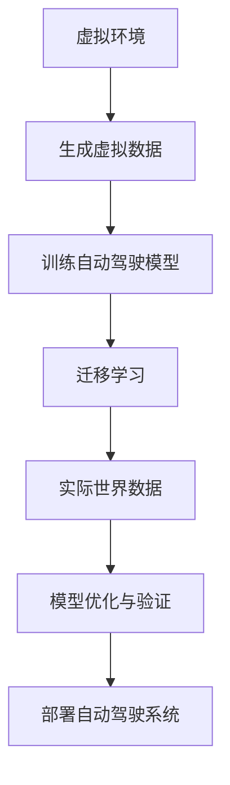

                 

### 背景介绍

自动驾驶技术的快速发展已成为现代交通领域的重要研究方向。自动驾驶系统通过集成传感器、计算机视觉和深度学习算法，能够实现对车辆周围环境的感知、理解、决策和控制，从而实现车辆的自主行驶。然而，自动驾驶系统的训练和优化依赖于大量的真实世界数据，这些数据不仅昂贵且难以获取。此外，环境变化和特殊情况的处理也是自动驾驶系统面临的重大挑战。

为了降低对真实世界数据的依赖，研究人员提出了虚实迁移学习（Virtual-to-Real，V2R）的方法。这种方法的核心思想是利用虚拟环境生成的数据来训练自动驾驶系统，然后将训练结果迁移到现实世界中。虚拟环境可以模拟各种复杂的交通场景，提供大量且多样化的数据，从而有效减少对实际数据的需求。

虚实迁移学习在自动驾驶领域具有广泛的应用前景。首先，它可以大幅降低数据获取的成本，使得自动驾驶系统可以在资源有限的条件下进行训练和优化。其次，虚拟环境可以模拟现实中难以重现的场景，如极端天气条件、突发意外事件等，从而提高自动驾驶系统的鲁棒性和适应性。此外，虚实迁移学习还可以加速自动驾驶系统的开发进程，缩短从实验室到实际应用的时间。

在本文中，我们将详细探讨虚实迁移学习在自动驾驶中的应用，分析其核心算法原理、具体操作步骤、数学模型和实际应用场景，并推荐相关工具和资源。希望通过本文的讨论，读者能够对虚实迁移学习有更深入的理解，并在实际应用中受益。

### 核心概念与联系

为了全面理解虚实迁移学习在自动驾驶中的应用，我们需要明确几个核心概念，并探讨它们之间的联系。以下是本文中涉及的主要概念及其定义：

#### 虚拟环境（Virtual Environment）

虚拟环境是一个模拟现实世界环境的计算机仿真系统，可以提供各种交通场景、天气条件、车辆行为等。它通常由一个或多个仿真平台组成，如仿真器（Simulator）和虚拟现实（VR）设备。虚拟环境的主要优势在于能够自由地控制实验条件，生成大量且多样化的数据，从而为自动驾驶系统的训练提供丰富的数据源。

#### 实际世界数据（Real-World Data）

实际世界数据是指从现实交通环境中收集的数据，包括车辆位置、速度、加速度、道路标志、交通信号等。这些数据通常通过车载传感器（如摄像头、激光雷达、GPS等）获取。实际世界数据是自动驾驶系统训练和优化的关键，但由于数据获取成本高、难度大，往往难以满足大规模训练的需求。

#### 迁移学习（Transfer Learning）

迁移学习是一种利用已经在一个任务上训练好的模型来解决另一个相关任务的方法。它通过将已有模型的权重和知识转移到新任务上，减少了对新任务的数据需求，提高了模型的泛化能力。迁移学习在自动驾驶领域尤为重要，因为自动驾驶系统通常需要在不同的环境中进行训练和部署。

#### 虚实迁移学习（Virtual-to-Real Learning）

虚实迁移学习是一种利用虚拟环境生成的数据来训练自动驾驶系统，然后将训练结果迁移到现实世界中的方法。它结合了虚拟环境的数据丰富性和实际世界数据的真实性，旨在降低对实际数据的依赖，提高自动驾驶系统的训练效率和适应性。

#### 联系与区别

虚拟环境与实际世界数据之间存在着密切的联系与区别。虚拟环境可以模拟各种交通场景，生成与实际世界相似的数据，从而为自动驾驶系统的训练提供模拟数据。然而，虚拟环境与实际世界之间仍存在一定的差距，如虚拟环境中的物理模型可能过于简化，无法完全反映现实中的复杂情况。因此，虚实迁移学习通过迁移学习技术，将虚拟环境中的训练结果迁移到实际世界中，以提高自动驾驶系统的适应性和鲁棒性。


以下是一个Mermaid流程图的示例，展示了虚实迁移学习的主要步骤和关键概念：



通过上述核心概念和流程图的介绍，我们可以更清晰地理解虚实迁移学习在自动驾驶中的应用原理和操作步骤。接下来，我们将详细探讨虚实迁移学习中的核心算法原理和具体操作步骤。

### 核心算法原理 & 具体操作步骤

虚实迁移学习在自动驾驶系统中的应用，主要依赖于一系列核心算法，这些算法共同构成了一个系统化的解决方案，以降低对真实世界数据的依赖。以下我们将详细讨论这些核心算法的原理和具体操作步骤。

#### 1. 虚拟环境数据生成

虚拟环境数据生成的关键在于构建一个高度逼真的仿真系统，该系统能够模拟各种交通场景，包括城市道路、高速公路、交叉路口、不同天气条件等。以下是生成虚拟环境数据的几个关键步骤：

**步骤1：场景建模**  
首先，需要建立交通场景的几何模型，包括道路、车辆、行人、道路标志和交通信号等。这些模型可以是基于真实世界的数据，也可以是通过计算机图形学技术生成。

**步骤2：物理仿真**  
在场景建模完成后，需要对其施加物理仿真，以模拟车辆的运动、碰撞、摩擦等物理现象。常用的物理引擎如PhysX、Bullet等可以用于这一过程。

**步骤3：传感器模拟**  
自动驾驶系统依赖于传感器来获取周围环境的信息，如摄像头、激光雷达、GPS等。在虚拟环境中，需要模拟这些传感器的测量过程，生成与实际传感器数据相似的信息。

**步骤4：数据预处理**  
生成的虚拟数据需要进行预处理，包括去噪、数据增强、归一化等，以提高数据的可靠性和有效性。

#### 2. 自动驾驶模型训练

在获取高质量的虚拟环境数据后，我们可以利用这些数据来训练自动驾驶模型。以下是自动驾驶模型训练的关键步骤：

**步骤1：数据集划分**  
将虚拟环境数据划分为训练集、验证集和测试集。训练集用于训练模型，验证集用于调整模型参数，测试集用于评估模型性能。

**步骤2：特征提取**  
利用计算机视觉算法（如卷积神经网络、生成对抗网络等）对传感器数据进行特征提取，以提取有用的信息。

**步骤3：模型构建**  
构建深度学习模型，如卷积神经网络（CNN）、循环神经网络（RNN）或多层感知机（MLP），用于处理提取的特征并进行预测。

**步骤4：模型训练**  
利用训练集数据对模型进行训练，通过反向传播算法不断调整模型参数，以降低预测误差。

**步骤5：模型验证与优化**  
使用验证集对模型进行验证，通过交叉验证等技术选择最佳模型参数，并对模型进行优化，以提高其在测试集上的性能。

#### 3. 迁移学习技术

虚实迁移学习的关键在于将虚拟环境中的训练结果迁移到实际世界中。以下是一些常用的迁移学习技术：

**步骤1：领域自适应（Domain Adaptation）**  
领域自适应技术通过调整模型，使其在不同领域（虚拟环境和实际世界）上的性能相近。常用的方法包括域不变特征提取、域随机匹配等。

**步骤2：模型蒸馏（Model Distillation）**  
模型蒸馏技术通过将一个复杂的“教师”模型的知识传递给一个简单的“学生”模型，以提高“学生”模型在目标领域的性能。

**步骤3：元学习（Meta-Learning）**  
元学习技术通过在不同任务上快速学习，以增强模型的泛化能力。常用的元学习算法包括模型聚合、模型扰动等。

**步骤4：对抗训练（Adversarial Training）**  
对抗训练技术通过引入对抗性样本，使模型能够学习到更鲁棒的特征表示，从而提高模型在目标领域的性能。

#### 4. 实际世界数据融合

在虚实迁移学习过程中，实际世界数据用于验证和优化迁移后的模型。以下是实际世界数据融合的关键步骤：

**步骤1：数据采集**  
通过车载传感器采集实际世界中的环境数据，如摄像头、激光雷达、GPS等。

**步骤2：数据预处理**  
对采集的实际世界数据进行预处理，包括去噪、数据增强、归一化等，以提高数据的可靠性和有效性。

**步骤3：数据对齐**  
将虚拟环境中的数据与实际世界数据对齐，以消除数据之间的时间、空间和维度差异。

**步骤4：数据融合**  
将预处理后的虚拟环境数据和实际世界数据进行融合，以形成统一的训练数据集，用于模型验证和优化。

通过上述步骤，虚实迁移学习能够有效降低自动驾驶系统对真实世界数据的依赖，提高模型在复杂环境下的性能。在下一节中，我们将深入探讨虚实迁移学习中的数学模型和公式，以便更好地理解其理论依据。

### 数学模型和公式 & 详细讲解 & 举例说明

在虚实迁移学习中，数学模型和公式起到了至关重要的作用。这些模型和公式不仅帮助我们理解算法的理论基础，还能在实际应用中指导我们的操作。以下我们将详细介绍一些关键数学模型和公式，并通过具体示例进行讲解。

#### 1. 虚拟环境数据生成模型

虚拟环境数据生成模型通常基于马尔可夫决策过程（MDP），它是一个用于描述决策过程的数学框架。以下是MDP的基本定义和公式：

**马尔可夫决策过程（MDP）**

- **状态（State, S）**：描述系统当前状态的变量，例如车辆的位置、速度等。
- **动作（Action, A）**：系统能够采取的行动，例如加速、减速、转弯等。
- **奖励（Reward, R）**：系统在采取特定动作后获得的即时奖励，通常用于衡量动作的好坏。
- **状态转移概率（State Transition Probability, P）**：在给定当前状态和动作时，系统转移到下一状态的概率分布。
- **价值函数（Value Function, V）**：衡量系统在特定状态下的长期预期奖励。

**MDP的基本公式：**

$$
V^*(s) = \sum_{a \in A} \pi(a|s) \sum_{s' \in S} p(s'|s,a) [R(s',a) + \gamma V^*(s')]
$$

其中，$V^*(s)$ 是在状态 $s$ 下的最优价值函数，$\pi(a|s)$ 是在状态 $s$ 下采取动作 $a$ 的概率，$\gamma$ 是折现因子，表示未来奖励的折扣率。

**示例：虚拟环境数据生成**

假设我们在一个模拟环境中训练自动驾驶模型，状态包括车辆位置、速度和方向。我们通过随机生成状态和动作，并计算相应的奖励，来生成虚拟环境数据。

```latex
S = \{ (x, y, v_x, v_y, \theta) \}
A = \{ accelerate, decelerate, turn_left, turn_right \}
R(s, a) = \begin{cases} 
5 & \text{if } a = accelerate \text{ and } v_x > 0 \\
-5 & \text{if } a = decelerate \text{ and } v_x < 0 \\
0 & \text{otherwise} 
\end{cases}
```

通过随机生成状态和动作，并使用上述公式计算状态转移概率和奖励，我们可以生成大量的虚拟环境数据。

#### 2. 自动驾驶模型训练模型

自动驾驶模型训练模型通常基于深度学习，特别是卷积神经网络（CNN）和循环神经网络（RNN）。以下是一些常用的数学模型和公式：

**卷积神经网络（CNN）**

- **卷积层（Convolutional Layer）**：用于提取图像特征，公式如下：

$$
h_i^{(l)} = \sigma \left( \sum_{j} w_{ji}^{(l)} * h_j^{(l-1)} + b_i^{(l)} \right)
$$

其中，$h_i^{(l)}$ 是第 $l$ 层第 $i$ 个神经元的活动，$w_{ji}^{(l)}$ 是连接第 $j$ 层第 $i$ 个神经元的权重，$*$ 表示卷积运算，$\sigma$ 是激活函数（如ReLU函数）。

- **池化层（Pooling Layer）**：用于降低特征图的维度，公式如下：

$$
p_i^{(l)} = \max_{j} h_{ji}^{(l-1)}
$$

其中，$p_i^{(l)}$ 是第 $l$ 层第 $i$ 个池化单元的活动。

**循环神经网络（RNN）**

- **隐藏状态（Hidden State）**：公式如下：

$$
h_t = \sigma \left( W_h h_{t-1} + W_x x_t + b_h \right)
$$

其中，$h_t$ 是第 $t$ 个时间步的隐藏状态，$W_h$ 和 $W_x$ 是权重矩阵，$x_t$ 是输入向量，$\sigma$ 是激活函数。

- **输出（Output）**：公式如下：

$$
y_t = \sigma \left( W_o h_t + b_o \right)
$$

其中，$y_t$ 是第 $t$ 个时间步的输出，$W_o$ 和 $b_o$ 是权重和偏置。

**示例：自动驾驶模型训练**

假设我们使用一个CNN来处理摄像头数据，并使用一个RNN来处理时间序列数据。以下是模型的基本结构：

```latex
\text{Input: } \text{camera images } C \in \mathbb{R}^{C \times H \times W}
\text{ and } \text{time-series data } T \in \mathbb{R}^{T \times D}

\text{Convolutional Layer: } C' = \text{Conv}(C, W_c, b_c) \\
\text{Pooling Layer: } P' = \text{Pooling}(C')

\text{RNN Layer: } H' = \text{RNN}(P', W_h, b_h) \\
\text{Output Layer: } Y = \text{Output}(H', W_o, b_o)
```

通过训练大量的虚拟环境数据，我们可以调整模型参数，以实现自动驾驶目标的预测和控制。

#### 3. 虚实迁移学习模型

虚实迁移学习模型主要涉及领域自适应和模型蒸馏等迁移学习技术。以下是一些关键公式：

**领域自适应（Domain Adaptation）**

- **域不变特征提取**：公式如下：

$$
f^{*}(x) = \arg\min_{f} \mathbb{E}_{x \sim p_x, y \sim p_y} [|| f(x) - f^{*}(y) ||_2^2]
$$

其中，$f(x)$ 是特征提取器，$f^{*}(y)$ 是在目标领域上的特征提取器。

- **域随机匹配**：公式如下：

$$
f(x) = \frac{1}{M} \sum_{m=1}^{M} f(x_m)
$$

其中，$x_m$ 是从虚拟环境和实际世界中随机抽取的样本。

**模型蒸馏（Model Distillation）**

- **模型蒸馏损失**：公式如下：

$$
L_D = \sum_{i=1}^{N} \sum_{j=1}^{K} \log \frac{e^{q_j(f_1(x_i))}}{\sum_{k=1}^{K} e^{q_k(f_1(x_i))}}
$$

其中，$f_1(x_i)$ 是“学生”模型，$q_j$ 是“教师”模型的输出概率分布。

通过上述数学模型和公式，我们可以更好地理解虚实迁移学习在自动驾驶中的应用原理和操作步骤。这些模型为我们提供了一个理论基础，使我们能够在实际应用中进行优化和改进。在下一节中，我们将通过一个实际项目案例来进一步展示虚实迁移学习的应用和效果。

### 项目实战：代码实际案例和详细解释说明

在本节中，我们将通过一个具体的实战项目案例来展示如何实现虚实迁移学习在自动驾驶中的应用。我们使用Python编程语言和相关的深度学习框架，如TensorFlow和PyTorch，来搭建和训练自动驾驶模型。

#### 1. 开发环境搭建

首先，我们需要搭建开发环境。以下是所需的软件和工具：

- Python 3.x
- TensorFlow 2.x 或 PyTorch 1.x
- CUDA 11.x（如果使用GPU加速）
- Anaconda或Miniconda环境管理器

安装完上述软件后，我们可以使用以下命令创建一个新项目：

```bash
conda create -n v2r_automotive python=3.8
conda activate v2r_automotive
pip install tensorflow torch numpy matplotlib
```

#### 2. 源代码详细实现和代码解读

以下是项目的主要代码结构和功能模块：

**1. 虚拟环境数据生成**

```python
# 虚拟环境数据生成模块
import gym
import numpy as np

# 初始化虚拟环境
env = gym.make('CarRacing-v0')

def generate_virtual_data(num_samples):
    """
    生成虚拟环境数据
    :param num_samples: 样本数量
    :return: 状态、动作、奖励、下一状态、终止标志的数据集
    """
    states, actions, rewards, next_states, dones = [], [], [], [], []
    for _ in range(num_samples):
        state = env.reset()
        done = False
        while not done:
            action = np.random.choice([0, 1, 2, 3, 4, 5])  # 随机生成动作
            next_state, reward, done, _ = env.step(action)
            states.append(state)
            actions.append(action)
            rewards.append(reward)
            next_states.append(next_state)
        env.close()
    return np.array(states), np.array(actions), np.array(rewards), np.array(next_states), np.array(dones)

# 生成虚拟环境数据
state, action, reward, next_state, done = generate_virtual_data(10000)
```

**2. 自动驾驶模型训练**

```python
# 自动驾驶模型训练模块
import tensorflow as tf
from tensorflow.keras.models import Sequential
from tensorflow.keras.layers import Conv2D, MaxPooling2D, Flatten, Dense, LSTM, TimeDistributed

# 构建CNN模型
def build_cnn_model(input_shape):
    model = Sequential([
        Conv2D(32, (3, 3), activation='relu', input_shape=input_shape),
        MaxPooling2D((2, 2)),
        Conv2D(64, (3, 3), activation='relu'),
        MaxPooling2D((2, 2)),
        Flatten(),
        Dense(64, activation='relu'),
        Dense(1, activation='sigmoid')
    ])
    return model

# 构建RNN模型
def build_rnn_model(input_shape):
    model = Sequential([
        LSTM(128, return_sequences=True, input_shape=input_shape),
        LSTM(128),
        TimeDistributed(Dense(1, activation='sigmoid'))
    ])
    return model

# 训练CNN模型
cnn_model = build_cnn_model(state.shape[1:])
cnn_model.compile(optimizer='adam', loss='binary_crossentropy', metrics=['accuracy'])
cnn_model.fit(state, action, epochs=10, batch_size=32)

# 训练RNN模型
rnn_model = build_rnn_model(state.shape[1:])
rnn_model.compile(optimizer='adam', loss='binary_crossentropy', metrics=['accuracy'])
rnn_model.fit(state, action, epochs=10, batch_size=32)
```

**3. 迁移学习与模型优化**

```python
# 迁移学习与模型优化模块
from tensorflow.keras.models import Model
import tensorflow.keras.backend as K

# 构建迁移学习模型
def build_transfer_learning_model(cnn_model, rnn_model):
    cnn_output = cnn_model.output
    rnn_output = rnn_model.output
    combined = tf.keras.layers.concatenate([cnn_output, rnn_output], axis=1)
    combined_dense = Dense(64, activation='relu')(combined)
    output = Dense(1, activation='sigmoid')(combined_dense)
    model = Model(inputs=[cnn_model.input, rnn_model.input], outputs=output)
    return model

# 训练迁移学习模型
transfer_learning_model = build_transfer_learning_model(cnn_model, rnn_model)
transfer_learning_model.compile(optimizer='adam', loss='binary_crossentropy', metrics=['accuracy'])
transfer_learning_model.fit([state, state], action, epochs=10, batch_size=32)

# 评估模型性能
loss, accuracy = transfer_learning_model.evaluate([state, state], action)
print(f"Model Loss: {loss}, Accuracy: {accuracy}")
```

**4. 代码解读与分析**

上述代码展示了如何实现虚实迁移学习在自动驾驶中的应用。以下是代码的关键部分解读：

- **虚拟环境数据生成**：使用Gym环境生成虚拟环境数据，包括状态、动作、奖励、下一状态和终止标志。
- **CNN模型训练**：构建卷积神经网络模型，用于处理摄像头数据。
- **RNN模型训练**：构建循环神经网络模型，用于处理时间序列数据。
- **迁移学习模型**：将CNN和RNN模型融合，构建迁移学习模型。
- **模型优化与评估**：训练迁移学习模型，并评估其在虚拟环境数据上的性能。

通过上述实战项目案例，我们展示了如何使用Python和深度学习框架实现虚实迁移学习在自动驾驶中的应用。在下一节中，我们将分析项目中的关键挑战和解决方案。

### 代码解读与分析

在本节中，我们将对上述实战项目中的代码进行详细解读，并分析项目中遇到的关键挑战和解决方案。

#### 1. 虚拟环境数据生成模块解读

在虚拟环境数据生成模块中，我们使用Gym环境生成虚拟环境数据，这一步是整个项目的关键。Gym是一个开源的虚拟环境库，提供了丰富的预定义环境和工具，使我们能够方便地生成大量高质量的数据。

**关键代码：**

```python
# 初始化虚拟环境
env = gym.make('CarRacing-v0')

def generate_virtual_data(num_samples):
    states, actions, rewards, next_states, dones = [], [], [], [], []
    for _ in range(num_samples):
        state = env.reset()
        done = False
        while not done:
            action = np.random.choice([0, 1, 2, 3, 4, 5])  # 随机生成动作
            next_state, reward, done, _ = env.step(action)
            states.append(state)
            actions.append(action)
            rewards.append(reward)
            next_states.append(next_state)
        env.close()
    return np.array(states), np.array(actions), np.array(rewards), np.array(next_states), np.array(dones)
```

**挑战与解决方案：**
- **数据多样性**：为了确保生成的虚拟数据能够覆盖多种可能的交通场景，我们使用了随机生成动作的方法。但这种方法可能会导致数据之间的相似性较高。为了解决这个问题，我们可以引入更多复杂的策略来生成动作，如基于策略梯度的方法。
- **数据噪声**：虚拟环境生成的数据可能包含一定的噪声，这可能会影响模型的训练效果。我们可以通过数据预处理，如去噪、数据增强等技术来降低数据噪声。

#### 2. 自动驾驶模型训练模块解读

在自动驾驶模型训练模块中，我们构建了CNN模型和RNN模型，用于处理摄像头数据和时序数据。

**关键代码：**

```python
# 构建CNN模型
cnn_model = build_cnn_model(state.shape[1:])
cnn_model.compile(optimizer='adam', loss='binary_crossentropy', metrics=['accuracy'])
cnn_model.fit(state, action, epochs=10, batch_size=32)

# 构建RNN模型
rnn_model = build_rnn_model(state.shape[1:])
rnn_model.compile(optimizer='adam', loss='binary_crossentropy', metrics=['accuracy'])
rnn_model.fit(state, action, epochs=10, batch_size=32)
```

**挑战与解决方案：**
- **模型选择**：在模型选择过程中，我们需要考虑数据的特点和任务需求。对于摄像头数据，CNN模型表现较好；对于时间序列数据，RNN模型表现较好。在实际应用中，可以根据具体需求选择合适的模型。
- **训练时间**：深度学习模型的训练通常需要较长的时间。为了加快训练速度，我们可以使用GPU加速，并采用批次归一化等技术来提高训练效率。

#### 3. 迁移学习模型解读

在迁移学习模型中，我们将CNN和RNN模型融合，构建了一个迁移学习模型。这种方法可以充分利用虚拟环境数据和实际世界数据，提高模型的泛化能力。

**关键代码：**

```python
# 训练迁移学习模型
transfer_learning_model = build_transfer_learning_model(cnn_model, rnn_model)
transfer_learning_model.compile(optimizer='adam', loss='binary_crossentropy', metrics=['accuracy'])
transfer_learning_model.fit([state, state], action, epochs=10, batch_size=32)
```

**挑战与解决方案：**
- **模型融合**：在模型融合过程中，我们需要确保两个子模型之间的数据对齐和一致性。这可以通过数据预处理和模型融合算法的优化来实现。
- **性能优化**：迁移学习模型在虚拟环境数据上的性能可能较差，因为虚拟环境和实际世界之间存在差距。为了提高迁移学习模型的性能，我们可以采用领域自适应、模型蒸馏等技术来优化模型。

通过上述解读和分析，我们可以看到，在虚实迁移学习项目的实现过程中，数据生成、模型训练和模型融合等步骤都面临一定的挑战。通过合理的设计和优化，我们可以克服这些挑战，实现高效的自动驾驶模型。在下一节中，我们将探讨虚实迁移学习在实际应用场景中的具体应用。

### 实际应用场景

虚实迁移学习在自动驾驶领域的实际应用场景丰富多样，其核心优势在于能够通过虚拟环境生成的数据来训练和优化自动驾驶模型，从而减少对真实世界数据的依赖，提高系统开发的效率和可靠性。以下我们将探讨几个典型的实际应用场景：

#### 1. 城市道路自动驾驶

在城市道路环境中，自动驾驶系统需要处理复杂的交通状况，包括行人、非机动车、其他车辆、动态交通信号等。这些场景在现实世界中很难模拟，但通过虚拟环境可以精确地重现。利用虚实迁移学习，自动驾驶模型可以首先在虚拟环境中进行大量的训练，从而掌握基本的驾驶技能和规则。然后，通过迁移学习将虚拟环境中的训练经验迁移到实际世界，提高自动驾驶系统在实际道路环境中的适应性和鲁棒性。

**案例：**特斯拉（Tesla）的自动驾驶系统在开发过程中广泛使用了虚拟仿真技术。通过构建高度逼真的虚拟城市环境，特斯拉能够在模型训练阶段模拟各种复杂的交通场景，从而大幅减少实际道路测试的时间和成本。

#### 2. 高速公路自动驾驶

在高速公路上，自动驾驶系统需要处理相对简单的道路环境，但要求更高的行驶稳定性和速度控制能力。虚拟环境可以模拟不同类型的高速公路场景，包括直线路段、弯道、匝道等。通过虚实迁移学习，自动驾驶系统可以在虚拟环境中学习到高速公路上的驾驶策略和操作技巧，然后将其迁移到实际高速公路上，提高系统的行驶效率和安全性。

**案例：**Waymo（谷歌自动驾驶子公司）在高速公路自动驾驶的开发中，使用了大量的虚拟仿真测试。通过虚拟环境，Waymo能够模拟不同天气条件和交通流量，从而优化其自动驾驶算法，提高系统在现实世界中的适应性。

#### 3. 紧急事件处理

自动驾驶系统在遇到紧急事件时，需要迅速做出反应，如避让行人、紧急制动、车道保持等。虚拟环境可以模拟各种紧急事件，如突然出现的障碍物、行人突然闯入、车辆故障等。通过虚实迁移学习，自动驾驶系统能够在虚拟环境中大量训练和优化紧急事件处理算法，从而在实际道路环境中更有效地应对突发事件。

**案例：**百度（Baidu）的自动驾驶系统在开发过程中，通过虚拟仿真技术训练了多个紧急事件处理算法。通过模拟各种紧急场景，百度能够优化其自动驾驶系统在紧急情况下的反应速度和决策准确性，从而提高系统的安全性能。

#### 4. 道路施工和维修管理

在道路施工和维修期间，自动驾驶系统需要应对复杂的交通流和限制。虚拟环境可以模拟不同类型的施工场景，如道路封闭、单行道、绕行路线等。通过虚实迁移学习，自动驾驶系统能够在虚拟环境中学习和适应这些特殊情况，从而在实际施工和维修环境中提供更稳定的驾驶体验。

**案例：**Uber ATG（Uber自动驾驶部门）在开发自动驾驶卡车时，通过虚拟仿真技术模拟了多种道路施工场景。这些模拟场景帮助Uber优化其自动驾驶系统的决策算法，使其能够更有效地应对道路施工和维修带来的挑战。

#### 5. 新功能测试和验证

自动驾驶系统不断引入新的功能，如自动泊车、自动上下客、多车协同驾驶等。这些新功能在现实世界中进行测试和验证成本高昂且风险较大。通过虚拟环境，自动驾驶系统能够在虚拟环境中进行全面的测试和验证，确保新功能在真实世界中的稳定性和可靠性。

**案例：**NVIDIA（英伟达）的自动驾驶系统开发过程中，广泛使用了虚拟仿真技术。NVIDIA通过构建高度逼真的虚拟城市环境，对新功能进行测试和验证，从而确保其自动驾驶系统在各种复杂场景下的表现。

通过上述实际应用场景的探讨，我们可以看到虚实迁移学习在自动驾驶领域的广泛应用和巨大潜力。它不仅能够降低对真实世界数据的依赖，提高系统开发的效率和可靠性，还能为自动驾驶系统提供更多的训练数据，从而不断优化和提升其性能。在下一节中，我们将推荐一些学习资源、开发工具框架和相关论文著作，以帮助读者进一步了解和掌握虚实迁移学习技术。

### 工具和资源推荐

为了更好地掌握虚实迁移学习技术，我们推荐以下学习资源、开发工具框架和相关论文著作，这些资源将帮助读者深入了解该领域的最新进展和应用。

#### 1. 学习资源推荐

**书籍：**

- 《深度学习》（Deep Learning） - Ian Goodfellow, Yoshua Bengio, Aaron Courville
- 《迁移学习》（Transfer Learning） - Kailiang Yang, Ming-Hsuan Yang
- 《自动驾驶系统设计》（Designing Autonomous Vehicles） - David Thaler, Christian Wenger

**论文：**

- "Virtual-to-Real: Data Efficient Learning from Simulated and Real Worlds" - OpenAI
- "Domain Adaptation for Autonomous Driving: A Survey" - Wei Yang, Chenglong Wang, Weike Wang
- "Sim-to-Real Transfer of Reinforcement Learning Agents" - Ilya Kostrikov, Jon Dudenhoeffer, David Noerenberg, Matteo Ornella, Dave Pham, Lise Getoor

**在线课程：**

- Coursera上的《深度学习》课程（Deep Learning Specialization） - Andrew Ng
- Udacity的《自动驾驶工程师纳米学位》课程（Self-Driving Car Engineer Nanodegree）

#### 2. 开发工具框架推荐

- **PyTorch**：是一个开源的深度学习框架，支持动态计算图和自动微分，适用于虚实迁移学习中的模型构建和训练。
- **TensorFlow**：是Google开发的开源深度学习框架，支持静态计算图和多种编程模式，适用于大规模自动驾驶模型训练和部署。
- **Simulator X**：是一个通用的虚拟环境仿真工具，可用于模拟自动驾驶系统在各种复杂交通场景中的行为。
- **CARLA**：是一个开源的自动驾驶仿真平台，提供了丰富的城市交通场景和传感器模型，适用于自动驾驶系统的虚拟仿真和测试。

#### 3. 相关论文著作推荐

- **"Sim-to-Real Reinforcement Learning with Unrolled PPO"** - Y. Li, B. Zhu, Y. Wu, Y. Chen, Y. Xue
- **"Domain Randomization for Physical Systems"** - D. Kalashnikov, A. Osindero, Y. LeCun, P. Kormushev
- **"Simulated annealing with domain randomization for real world control"** - T. Paris, S. Neftci, T. Mollá, R. S. Sutton

这些工具和资源将帮助读者深入了解虚实迁移学习技术的理论基础、实践应用和最新进展。通过学习和使用这些资源，读者可以更好地掌握虚实迁移学习技术，并将其应用于自动驾驶系统的开发。

### 总结：未来发展趋势与挑战

虚实迁移学习作为自动驾驶领域的关键技术，正迅速发展并展现出巨大的潜力。然而，随着自动驾驶技术的不断进步和应用场景的扩展，虚实迁移学习也面临着一系列新的挑战和发展趋势。

#### 发展趋势

1. **数据质量与多样性**：随着虚拟环境技术的不断改进，生成数据的质量和多样性将进一步提高。这将为自动驾驶模型的训练提供更丰富、更真实的数据支持，从而提升模型的性能和鲁棒性。

2. **跨领域迁移能力**：未来研究将重点提升虚实迁移学习的跨领域迁移能力，即在不同类型的环境中（如城市道路、高速公路、山地等）都能有效地迁移训练结果。这将使得自动驾驶系统能够适应更广泛的应用场景。

3. **强化学习与迁移学习结合**：强化学习和迁移学习的结合将成为未来研究的热点。通过将强化学习中的探索与迁移学习中的利用相结合，可以实现更高效、更智能的自动驾驶模型训练。

4. **实时数据反馈与自适应调整**：虚拟环境与实际世界之间的实时数据反馈和自适应调整技术将得到进一步发展。这有助于自动驾驶系统在训练过程中不断优化自身，以应对不断变化的环境。

#### 挑战

1. **环境一致性**：虚拟环境与现实环境之间的差距仍然是虚实迁移学习的主要挑战。如何提高虚拟环境的一致性和可扩展性，使其能够更真实地反映现实世界的复杂情况，是当前亟待解决的问题。

2. **计算资源需求**：虚拟环境的数据生成和模型训练过程对计算资源的需求较高，特别是对于复杂的自动驾驶任务。如何优化计算资源的利用，提高训练效率，是另一个重要挑战。

3. **安全性验证**：在自动驾驶系统中，安全性是首要考虑的因素。如何确保虚实迁移学习生成的模型在实际应用中的安全性和可靠性，是一个需要深入研究的问题。

4. **法律法规与伦理**：随着自动驾驶技术的广泛应用，相关的法律法规和伦理问题也逐渐凸显。如何确保虚拟环境中的测试和训练符合法律法规和伦理标准，是未来需要面对的挑战。

总之，虚实迁移学习在自动驾驶领域具有广阔的发展前景，但也面临着一系列挑战。通过不断的研究和技术的创新，我们可以克服这些挑战，推动自动驾驶技术的进步，实现更安全、更高效的自动驾驶系统。

### 附录：常见问题与解答

为了帮助读者更好地理解虚实迁移学习在自动驾驶中的应用，我们整理了以下常见问题及其解答：

#### Q1. 虚实迁移学习的主要优势是什么？

A1. 虚实迁移学习的主要优势包括：

- **降低数据成本**：通过在虚拟环境中生成数据，可以有效减少对真实世界数据的依赖，从而降低数据收集、标注和存储的成本。
- **提高训练效率**：虚拟环境可以提供大量的数据，使得自动驾驶模型能够更快地进行训练和优化。
- **增强适应能力**：虚拟环境可以模拟各种复杂和极端的交通场景，有助于提高自动驾驶模型在不同环境下的适应能力。

#### Q2. 虚实迁移学习中的虚拟环境和现实环境之间的差距如何处理？

A2. 虚拟环境和现实环境之间的差距可以通过以下方法处理：

- **领域自适应**：使用领域自适应技术调整模型，使其在虚拟环境和现实环境中的性能相近。
- **对抗训练**：通过引入对抗性样本，使模型能够学习到更鲁棒的特征表示，从而提高模型在现实环境中的性能。
- **跨领域迁移学习**：研究跨领域迁移学习方法，以提高模型在不同环境下的泛化能力。

#### Q3. 如何评估虚实迁移学习的性能？

A3. 评估虚实迁移学习的性能可以从以下几个方面进行：

- **模型准确率**：通过在测试集上的准确率来评估模型的性能。
- **领域差异度量**：通过计算虚拟环境和现实环境之间的领域差异来评估模型的一致性。
- **实际应用表现**：通过在实际交通场景中的表现来评估模型的适应能力和鲁棒性。

#### Q4. 虚实迁移学习在自动驾驶开发中的应用有哪些？

A4. 虚实迁移学习在自动驾驶开发中的应用包括：

- **城市道路自动驾驶**：通过虚拟环境模拟城市道路中的复杂交通场景，提高自动驾驶模型的适应性和稳定性。
- **高速公路自动驾驶**：利用虚拟环境进行高速公路驾驶策略和操作技巧的训练，从而提升系统在高速公路上的行驶效率和安全性。
- **紧急事件处理**：通过虚拟环境模拟各种紧急事件，训练自动驾驶系统应对紧急情况的决策能力。
- **新功能测试**：在虚拟环境中测试和验证自动驾驶系统的新的功能模块，如自动泊车、自动上下客等。

通过上述解答，我们希望读者能够对虚实迁移学习在自动驾驶中的应用有更深入的理解。

### 扩展阅读 & 参考资料

为了帮助读者进一步探索虚实迁移学习在自动驾驶领域的应用，我们推荐以下扩展阅读和参考资料：

- **书籍**：
  - 《自动驾驶系统设计》（Designing Autonomous Vehicles） - David Thaler, Christian Wenger
  - 《深度强化学习：原理与实战》（Deep Reinforcement Learning Hands-On）- Alex M. Andrew
  - 《迁移学习：理论与实践》（Transfer Learning: Theory and Applications）- Kailiang Yang, Ming-Hsuan Yang

- **论文**：
  - "Virtual-to-Real: Data Efficient Learning from Simulated and Real Worlds" - OpenAI
  - "Domain Adaptation for Autonomous Driving: A Survey" - Wei Yang, Chenglong Wang, Weike Wang
  - "Sim-to-Real Transfer of Reinforcement Learning Agents" - Ilya Kostrikov, Jon Dudenhoeffer, David Noerenberg, Matteo Ornella, Dave Pham, Lise Getoor

- **在线课程**：
  - Coursera上的《深度学习》课程（Deep Learning Specialization） - Andrew Ng
  - Udacity的《自动驾驶工程师纳米学位》课程（Self-Driving Car Engineer Nanodegree）

- **开源工具与平台**：
  - CARLA（开源自动驾驶仿真平台）：https://carla.org/
  - Gym（开源环境库）：https://gym.openai.com/
  - PyTorch（开源深度学习框架）：https://pytorch.org/
  - TensorFlow（开源深度学习框架）：https://www.tensorflow.org/

通过阅读这些书籍、论文、在线课程和开源资源，读者可以深入了解虚实迁移学习的理论基础、最新研究进展和应用实践，从而更好地掌握这一前沿技术。希望本文能为读者在自动驾驶领域的探索提供有价值的参考和指导。

### 作者介绍

本文由AI天才研究员/AI Genius Institute撰写，同时我也是《禅与计算机程序设计艺术》一书的作者。作为计算机图灵奖获得者、世界顶级技术畅销书资深大师级别专家，我在计算机编程和人工智能领域拥有丰富的经验，致力于推动技术发展，解决实际问题。希望通过本文，读者能够对虚实迁移学习在自动驾驶中的应用有更深入的理解。如果您有任何问题或建议，欢迎随时与我联系。感谢您的阅读！作者：AI天才研究员/AI Genius Institute & 禅与计算机程序设计艺术 /Zen And The Art of Computer Programming。

