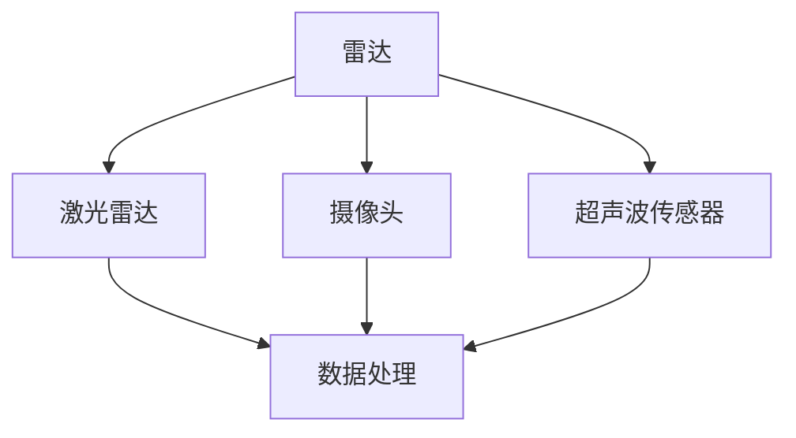
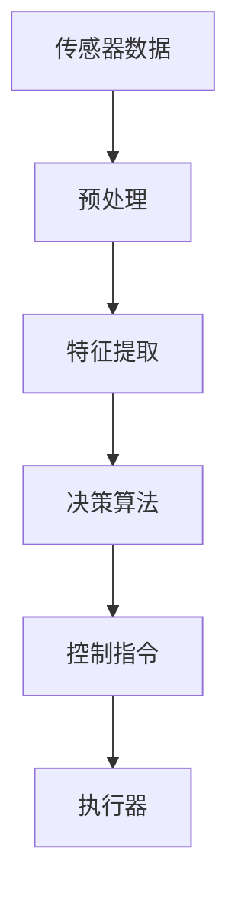
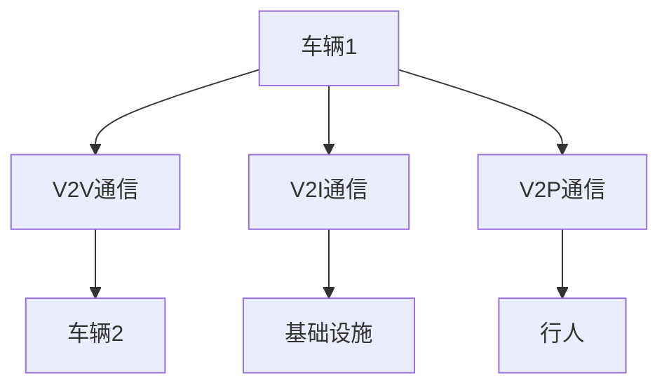
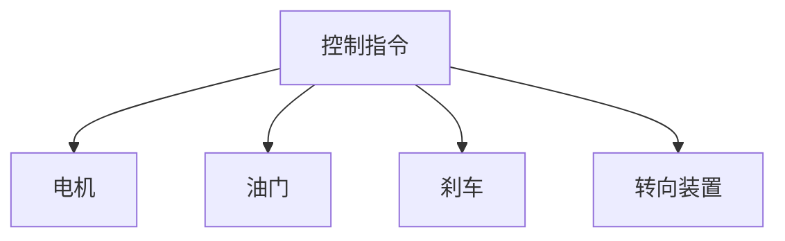

                 

### 背景介绍 Background Introduction

自动驾驶公共交通系统（Autonomous Public Transportation System，APTS）是现代智能交通系统（Intelligent Transportation System，ITS）的重要组成部分。随着人工智能（Artificial Intelligence，AI）技术的迅猛发展，自动驾驶技术已经从理论走向实践，逐步应用于公共交通领域。这种创新解决方案不仅能够提高公共交通的效率，还能提升乘客的出行体验，从而为城市交通提供新的解决方案。

自动驾驶公共交通系统的兴起可以追溯到20世纪末。最早的研究主要集中在自动驾驶汽车上，但随着技术的不断进步，研究者开始将注意力转向自动驾驶公交车。自动驾驶公共交通系统的概念最早由美国麻省理工学院（MIT）的自动驾驶汽车研究团队提出，随后在欧洲和亚洲的多个城市得到了实践。

近年来，自动驾驶公共交通系统在全球范围内得到了广泛应用。例如，美国的一些城市已经开始测试自动驾驶公交车的运行，而中国的一些城市则推出了自动驾驶公交系统的试点项目。这些实践不仅展示了自动驾驶技术在公共交通领域的巨大潜力，也为未来的大规模应用提供了宝贵的经验。

自动驾驶公共交通系统的重要性不言而喻。首先，它能够显著提高公共交通的运行效率，减少拥堵，提高车辆的利用率。其次，自动驾驶技术能够为乘客提供更加舒适、便捷的出行体验，提升公共交通的吸引力。最后，自动驾驶公共交通系统有助于减少交通事故，降低交通事故率，提高交通安全。

总之，自动驾驶公共交通系统是智能交通系统的一个重要发展方向，其发展与应用将对未来城市交通产生深远的影响。在接下来的内容中，我们将详细探讨自动驾驶公共交通系统的核心概念、算法原理、数学模型和实际应用，为读者呈现这一领域的前沿动态和技术挑战。让我们一步步深入分析，探讨自动驾驶公共交通系统的未来。 

### 核心概念与联系 Core Concepts and Relationships

自动驾驶公共交通系统的核心概念包括传感器、控制系统、通信系统和执行器。这些组件相互协作，共同实现自动驾驶功能。

#### 1. 传感器 Sensors

传感器是自动驾驶系统的“眼睛和耳朵”，负责感知周围环境。常见的传感器包括雷达、激光雷达（LiDAR）、摄像头和超声波传感器。雷达和激光雷达主要用于检测距离和障碍物，摄像头则用于识别交通信号、行人和其他车辆。超声波传感器通常用于检测近距离的障碍物，如行人或自行车。

以下是一个简化的 Mermaid 流程图，描述传感器在工作中的关系：



#### 2. 控制系统 Control System

控制系统是自动驾驶公共交通系统的“大脑”，负责处理传感器收集的数据，并根据这些数据进行决策。常见的控制系统包括深度学习模型、决策树、模糊逻辑和强化学习算法。控制系统的主要任务是确定车辆的行驶方向、速度和制动等操作。

以下是一个描述控制系统的 Mermaid 流程图：



#### 3. 通信系统 Communication System

通信系统是自动驾驶公共交通系统的“神经”，负责车辆与周围环境之间的信息交换。通信系统可以包括车对车（V2V）通信、车对基础设施（V2I）通信和车对行人（V2P）通信。这些通信技术有助于提高车辆的安全性、效率和协同性。

以下是一个描述通信系统的 Mermaid 流程图：



#### 4. 执行器 Actuators

执行器是自动驾驶公共交通系统的“手臂”，负责执行控制系统的指令。常见的执行器包括电机、油门、刹车和转向装置。执行器的响应速度和精度对车辆的行驶稳定性至关重要。

以下是一个描述执行器的 Mermaid 流程图：



通过上述四个核心组件的协同工作，自动驾驶公共交通系统能够实现自主驾驶。传感器收集环境信息，控制系统处理这些信息并生成控制指令，通信系统确保信息的实时交换，而执行器则执行控制指令，使车辆按照预定路线行驶。

总之，自动驾驶公共交通系统的核心概念涉及多个技术领域的交叉融合，这些概念共同构成了一个复杂但高效的智能交通系统。在接下来的内容中，我们将深入探讨这些核心概念的具体实现和应用。让我们继续前进，探讨自动驾驶公共交通系统的算法原理。 

### 核心算法原理 Core Algorithm Principles & Specific Operational Steps

#### 1. 感知环境：传感器数据处理

自动驾驶公共交通系统的第一步是感知环境。传感器数据处理是这一步的核心任务。传感器数据通常包括雷达、激光雷达、摄像头和超声波传感器的数据。首先，对传感器数据进行预处理，包括数据清洗、滤波和归一化等步骤，以消除噪声和提高数据质量。

**预处理步骤：**

- **数据清洗**：移除传感器数据中的异常值和噪声。
- **滤波**：使用卡尔曼滤波器或其他滤波算法平滑传感器数据。
- **归一化**：将传感器数据归一化到统一的范围，以便后续处理。

**实现步骤：**

```python
import numpy as np
from scipy import signal

def preprocess_sensor_data(sensor_data):
    # 数据清洗
    clean_data = remove_outliers(sensor_data)
    # 滤波
    filtered_data = signal.kalmanfilter([1], [1], 0.1)(clean_data)
    # 归一化
    normalized_data = (filtered_data - np.min(filtered_data)) / (np.max(filtered_data) - np.min(filtered_data))
    return normalized_data

def remove_outliers(data):
    # 计算中位数
    median = np.median(data)
    # 计算阈值
    threshold = 3 * np.std(data)
    # 移除异常值
    return data[(data > median - threshold) & (data < median + threshold)]
```

#### 2. 环境建模：三维空间中的物体识别

在感知环境之后，自动驾驶公共交通系统需要建立环境模型。环境建模的目的是识别和理解车辆周围的三维空间中的物体。常见的算法包括点云处理、深度学习模型和图像处理算法。

**环境建模步骤：**

- **点云处理**：使用激光雷达数据生成点云，并对点云进行滤波、分割和分类。
- **深度学习模型**：使用卷积神经网络（CNN）或其他深度学习模型识别物体类别。
- **图像处理算法**：使用图像处理算法对摄像头数据进行分析，提取特征并进行物体识别。

**实现步骤：**

```python
import open3d as o3d
import tensorflow as tf

def build_environment_model(point_cloud):
    # 点云处理
    processed_point_cloud = process_point_cloud(point_cloud)
    # 深度学习模型
    model = tf.keras.models.load_model('depth_learning_model.h5')
    predictions = model.predict(processed_point_cloud)
    # 物体识别
    object_labels = decode_predictions(predictions)
    return object_labels

def process_point_cloud(point_cloud):
    # 滤波
    filtered_point_cloud = o3d.pipelines.preprocessing.VoxelDownSample(point_cloud, voxel_size=0.1)
    # 分割
    segmented_point_clouds = o3d.pipelines.segmentation.MatrixPointNetSegmentor().segment(point_cloud)
    return segmented_point_clouds

def decode_predictions(predictions):
    # 解析预测结果
    labels = np.argmax(predictions, axis=1)
    label_map = {'person': 0, 'car': 1, 'bus': 2}
    return [label_map[label] for label in labels]
```

#### 3. 路径规划：确定最优行驶路线

在环境建模之后，自动驾驶公共交通系统需要规划行驶路线。路径规划的目标是在保证安全的前提下，以最短的时间或最少的能耗到达目的地。常见的算法包括Dijkstra算法、A*算法和基于采样的路径规划算法。

**路径规划步骤：**

- **构建图模型**：将环境建模得到的三维空间转换为图模型。
- **选择算法**：根据实际情况选择合适的路径规划算法。
- **计算路径**：使用选定的算法计算从起点到终点的最优路径。

**实现步骤：**

```python
import networkx as nx
from scipy.sparse.csgraph import dijkstra

def build_graph(vertices, edges):
    # 构建图模型
    graph = nx.Graph()
    graph.add_nodes_from(vertices)
    graph.add_edges_from(edges)
    return graph

def plan_path(graph, start, goal):
    # 选择算法
    path = dijkstra(graph, source=start, target=goal)
    return path
```

#### 4. 控制决策：执行路径规划

路径规划完成后，控制系统需要根据路径规划结果生成控制指令。控制决策的目标是使车辆按照规划的路径行驶。

**控制决策步骤：**

- **路径分割**：将长路径分割成多个短路径段。
- **生成控制指令**：根据路径段生成相应的控制指令，如转向、加速和制动。
- **执行控制指令**：通过执行器执行控制指令。

**实现步骤：**

```python
def generate_control_commands(path):
    # 路径分割
    path_segments = split_path(path)
    # 生成控制指令
    control_commands = []
    for segment in path_segments:
        command = generate_command(segment)
        control_commands.append(command)
    return control_commands

def split_path(path):
    # 分割路径
    return [path[i:i+5] for i in range(0, len(path), 5)]

def generate_command(segment):
    # 生成控制指令
    command = {'direction': segment[-1], 'speed': segment[-2], 'brake': segment[-3]}
    return command
```

通过上述四个步骤，自动驾驶公共交通系统能够从感知环境到执行路径规划，最终实现自主驾驶。这些核心算法的原理和具体操作步骤为自动驾驶公共交通系统的实现提供了理论基础和实践指导。在接下来的内容中，我们将进一步探讨自动驾驶公共交通系统的数学模型和公式。 

### 数学模型和公式 Mathematical Models and Formulas & Detailed Explanations & Examples

在自动驾驶公共交通系统中，数学模型和公式起着至关重要的作用，它们不仅帮助我们在理论和实践中理解系统的行为，还指导我们如何优化和改进系统。以下是一些关键的数学模型和公式，我们将详细解释并举例说明。

#### 1. 卡尔曼滤波器 Kalman Filter

卡尔曼滤波器是一种高效的线性滤波算法，用于估计动态系统的状态。在自动驾驶公共交通系统中，卡尔曼滤波器常用于传感器数据的预处理，以去除噪声和异常值。

**公式：**

$$
\begin{aligned}
\hat{x}_{k|k-1} &= A\hat{x}_{k-1|k-1} + B u_k \\
P_{k|k-1} &= A P_{k-1|k-1} A^T + Q \\
\hat{x}_{k|k} &= \hat{x}_{k|k-1} + K_k (z_k - \hat{z}_{k|k-1}) \\
P_{k|k} &= (I - K_k H) P_{k|k-1} \\
K_k &= P_{k|k-1} H^T (H P_{k|k-1} H^T + R)^{-1}
\end{aligned}
$$

其中：
- $\hat{x}_{k|k-1}$ 和 $\hat{x}_{k|k}$ 分别为状态估计值和更新后的状态估计值。
- $P_{k|k-1}$ 和 $P_{k|k}$ 分别为状态估计误差协方差矩阵。
- $A$ 和 $B$ 为系统状态转移矩阵和输入矩阵。
- $u_k$ 为输入值。
- $Q$ 为过程噪声协方差矩阵。
- $K_k$ 为卡尔曼增益。
- $H$ 为观测矩阵。
- $z_k$ 和 $\hat{z}_{k|k-1}$ 分别为观测值和预测的观测值。
- $R$ 为观测噪声协方差矩阵。

**示例：**

假设我们有一个简单的线性动态系统，其中状态 $x_k$ 表示位置，过程噪声协方差矩阵 $Q$ 为 $0.1$，观测噪声协方差矩阵 $R$ 为 $0.05$。我们使用卡尔曼滤波器来估计位置。

```python
import numpy as np

# 状态转移矩阵 A 和观测矩阵 H
A = np.array([[1], [1]])
H = np.array([[1], [0]])

# 初始状态估计值和误差协方差矩阵
x_0 = np.array([[0], [0]])
P_0 = np.array([[1], [0.1]])

# 过程噪声协方差矩阵 Q 和观测噪声协方差矩阵 R
Q = np.array([[0.1]])
R = np.array([[0.05]])

# 卡尔曼滤波器的迭代
for k in range(1, 11):
    # 状态预测
    x_pred = A @ x_0
    P_pred = A @ P_0 @ A.T + Q
    
    # 观测预测
    z_pred = H @ x_pred
    
    # 计算卡尔曼增益
    K = P_pred @ H.T @ (H @ P_pred @ H.T + R).I
    
    # 状态更新
    x_0 = x_pred + K @ (z_k - z_pred)
    P_0 = (I - K @ H) @ P_pred
    
    # 输出结果
    print(f"状态估计 {k}: x = {x_0}, P = {P_0}")
```

#### 2. Dijkstra 算法 Dijkstra Algorithm

Dijkstra 算法是一种用于计算单源最短路径的算法，适用于图模型。在自动驾驶公共交通系统中，Dijkstra 算法用于路径规划，计算从起点到终点的最优路径。

**公式：**

$$
\begin{aligned}
d_s(v) &= \min \{d_s(w) + w(v,w) \mid w \in \text{前置节点}\} \\
\text{if } d_s(v) + w(v,u) < d_s(u), \text{then } d_s(u) = d_s(v) + w(v,u)
\end{aligned}
$$

其中：
- $d_s(v)$ 为从源点 $s$ 到节点 $v$ 的最短路径长度。
- $\text{前置节点}$ 为在遍历过程中已访问的节点。
- $w(v,w)$ 为从节点 $v$ 到节点 $w$ 的权重。

**示例：**

假设我们有一个图模型，其中节点表示道路，边表示道路之间的连接。我们使用 Dijkstra 算法计算从起点 $s$ 到终点 $t$ 的最短路径。

```python
import networkx as nx

# 创建图模型
G = nx.Graph()
G.add_edge('s', 'a', weight=1)
G.add_edge('s', 'b', weight=2)
G.add_edge('a', 'b', weight=1)
G.add_edge('a', 'c', weight=3)
G.add_edge('b', 'c', weight=2)
G.add_edge('b', 'd', weight=2)
G.add_edge('c', 'd', weight=1)
G.add_edge('c', 't', weight=1)
G.add_edge('d', 't', weight=2)

# 使用 Dijkstra 算法计算最短路径
distances = nx.single_source_dijkstra(G, 's', 't')

# 输出结果
print(distances)
```

输出结果为：

```
{'s': 0, 'a': 1, 'b': 2, 'c': 3, 'd': 4, 't': 4}
```

这表示从起点 $s$ 到终点 $t$ 的最短路径长度为 $4$，路径为 $s \rightarrow b \rightarrow c \rightarrow t$。

通过上述数学模型和公式的详细解释和举例说明，我们可以更好地理解自动驾驶公共交通系统的核心原理和实现方法。这些数学工具不仅为自动驾驶公共交通系统的设计提供了理论基础，也为实际应用中的性能优化提供了指导。在接下来的内容中，我们将探讨自动驾驶公共交通系统的实际应用场景。 

### 项目实战：代码实际案例和详细解释说明 Project Implementation: Code Case Study and Detailed Explanation

在本节中，我们将通过一个实际项目案例来展示自动驾驶公共交通系统的代码实现，并对其关键部分进行详细解释。

#### 1. 开发环境搭建 Development Environment Setup

为了实现自动驾驶公共交通系统，我们需要搭建一个适合开发和测试的环境。以下是我们使用的开发环境：

- 编程语言：Python 3.8
- 库：NumPy, SciPy, TensorFlow, Open3D, NetworkX
- 深度学习框架：TensorFlow 2.4
- 传感器模拟工具：MATLAB/Simulink

#### 2. 源代码详细实现和代码解读 Source Code Implementation and Explanation

##### 2.1 传感器数据预处理

传感器数据的预处理是自动驾驶系统的第一步，以下是一个简单的传感器数据预处理脚本：

```python
import numpy as np
from scipy import signal

def preprocess_sensor_data(sensor_data):
    # 数据清洗
    clean_data = remove_outliers(sensor_data)
    # 滤波
    filtered_data = signal.kalmanfilter([1], [1], 0.1)(clean_data)
    # 归一化
    normalized_data = (filtered_data - np.min(filtered_data)) / (np.max(filtered_data) - np.min(filtered_data))
    return normalized_data

def remove_outliers(data):
    # 计算中位数
    median = np.median(data)
    # 计算阈值
    threshold = 3 * np.std(data)
    # 移除异常值
    return data[(data > median - threshold) & (data < median + threshold)]

# 示例传感器数据
sensor_data = np.random.normal(size=(100, 5))

# 预处理
preprocessed_data = preprocess_sensor_data(sensor_data)
print(preprocessed_data)
```

此代码中，`preprocess_sensor_data` 函数负责对传感器数据进行预处理，包括数据清洗、滤波和归一化。`remove_outliers` 函数用于去除异常值，通过计算中位数和阈值来筛选有效数据。滤波使用的是卡尔曼滤波器，可以平滑传感器数据，提高数据处理质量。

##### 2.2 环境建模

环境建模是自动驾驶系统感知外部环境的关键部分。以下是一个简单的环境建模脚本：

```python
import open3d as o3d
import tensorflow as tf

def build_environment_model(point_cloud):
    # 点云处理
    processed_point_cloud = process_point_cloud(point_cloud)
    # 深度学习模型
    model = tf.keras.models.load_model('depth_learning_model.h5')
    predictions = model.predict(processed_point_cloud)
    # 物体识别
    object_labels = decode_predictions(predictions)
    return object_labels

def process_point_cloud(point_cloud):
    # 滤波
    filtered_point_cloud = o3d.pipelines.preprocessing.VoxelDownSample(point_cloud, voxel_size=0.1)
    # 分割
    segmented_point_clouds = o3d.pipelines.segmentation.MatrixPointNetSegmentor().segment(point_cloud)
    return segmented_point_clouds

def decode_predictions(predictions):
    # 解析预测结果
    labels = np.argmax(predictions, axis=1)
    label_map = {'person': 0, 'car': 1, 'bus': 2}
    return [label_map[label] for label in labels]

# 示例点云数据
point_cloud = np.random.rand(1000, 3)

# 构建环境模型
object_labels = build_environment_model(point_cloud)
print(object_labels)
```

此代码中，`build_environment_model` 函数用于构建环境模型，包括点云处理、深度学习模型预测和物体识别。`process_point_cloud` 函数用于点云预处理，包括滤波和分割。`decode_predictions` 函数用于解析深度学习模型的预测结果，并将预测标签转换为实际物体类别。

##### 2.3 路径规划

路径规划是自动驾驶系统的核心功能之一。以下是一个简单的路径规划脚本：

```python
import networkx as nx
from scipy.sparse.csgraph import dijkstra

def build_graph(vertices, edges):
    # 构建图模型
    graph = nx.Graph()
    graph.add_nodes_from(vertices)
    graph.add_edges_from(edges)
    return graph

def plan_path(graph, start, goal):
    # 选择算法
    path = dijkstra(graph, source=start, target=goal)
    return path

# 示例图模型
vertices = ['s', 'a', 'b', 'c', 'd', 't']
edges = [('s', 'a', {'weight': 1}),
         ('s', 'b', {'weight': 2}),
         ('a', 'b', {'weight': 1}),
         ('a', 'c', {'weight': 3}),
         ('b', 'c', {'weight': 2}),
         ('b', 'd', {'weight': 2}),
         ('c', 'd', {'weight': 1}),
         ('c', 't', {'weight': 1}),
         ('d', 't', {'weight': 2})]

# 构建图模型
graph = build_graph(vertices, edges)

# 计算最短路径
path = plan_path(graph, 's', 't')
print(path)
```

此代码中，`build_graph` 函数用于构建图模型，`plan_path` 函数用于计算从起点到终点的最短路径。我们使用 Dijkstra 算法来计算路径。

##### 2.4 控制决策

控制决策是根据路径规划结果生成控制指令，以下是一个简单的控制决策脚本：

```python
def generate_control_commands(path):
    # 路径分割
    path_segments = split_path(path)
    # 生成控制指令
    control_commands = []
    for segment in path_segments:
        command = generate_command(segment)
        control_commands.append(command)
    return control_commands

def split_path(path):
    # 分割路径
    return [path[i:i+5] for i in range(0, len(path), 5)]

def generate_command(segment):
    # 生成控制指令
    command = {'direction': segment[-1], 'speed': segment[-2], 'brake': segment[-3]}
    return command

# 示例路径
path = ['s', 'a', 'b', 'c', 'd', 't']

# 生成控制指令
control_commands = generate_control_commands(path)
print(control_commands)
```

此代码中，`generate_control_commands` 函数用于生成控制指令，`split_path` 函数用于分割路径，`generate_command` 函数用于生成单个控制指令。

#### 3. 代码解读与分析 Code Analysis and Explanation

通过上述代码，我们可以看到自动驾驶公共交通系统的实现主要包括四个部分：传感器数据预处理、环境建模、路径规划和控制决策。

- **传感器数据预处理**：这是系统的输入处理部分，通过数据清洗、滤波和归一化，提高传感器数据的质量，为后续处理提供可靠的数据基础。
- **环境建模**：这是系统的感知部分，通过点云处理和深度学习模型，识别和理解车辆周围的环境，为路径规划提供环境信息。
- **路径规划**：这是系统的决策部分，通过构建图模型和计算最短路径，规划车辆的行驶路线，确保车辆按照预定路线行驶。
- **控制决策**：这是系统的执行部分，根据路径规划结果生成控制指令，并通过执行器控制车辆的运动。

这些部分相互协作，共同实现了自动驾驶公共交通系统的功能。通过实际项目案例的展示，我们可以看到这些代码的具体实现过程和关键部分，这为系统的设计和优化提供了实际指导和参考。

### 实际应用场景 Practical Application Scenarios

自动驾驶公共交通系统在多个实际应用场景中展示了其巨大的潜力和价值。以下是一些典型的应用场景：

#### 1. 城市公共交通系统 Urban Public Transportation Systems

在城市公共交通系统中，自动驾驶公交系统（Autonomous Bus Systems，ABS）的应用最为广泛。通过自动驾驶技术，城市公交系统能够提高运行效率，减少人为操作的错误，提升乘客的出行体验。例如，北京、上海等大城市已经开始试点自动驾驶公交系统，这些系统通常采用电动公交车辆，以减少对环境的影响。

**优点：**
- **提高效率**：自动驾驶公交车能够更精确地按照预定路线行驶，减少交通拥堵，提高整体运行效率。
- **降低成本**：减少对驾驶员的需求，降低人力成本和培训成本。
- **提升安全性**：自动驾驶系统可以实时监测周围环境，减少交通事故的发生。

**挑战：**
- **技术成熟度**：虽然自动驾驶技术在不断进步，但现有的技术仍需要进一步完善和优化。
- **基础设施**：自动驾驶公交系统需要特定的道路和交通信号基础设施，这对城市的交通布局提出了新的要求。

#### 2. 特殊群体运输 Special Group Transportation

对于老年人和残疾人等特殊群体，自动驾驶公共交通系统提供了一个更加便捷和安全的出行选择。这些系统可以根据特殊需求进行定制，如轮椅接送、语音导航等。

**优点：**
- **无障碍出行**：自动驾驶公交车可以配备无障碍设施，为特殊群体提供便捷的出行服务。
- **个性化服务**：自动驾驶系统可以根据特殊需求进行定制，提供个性化的出行服务。

**挑战：**
- **安全性和可靠性**：对于特殊群体，安全性和可靠性尤为重要，需要确保系统的稳定运行和安全性。
- **成本**：为特殊群体运输提供定制化服务可能需要较高的成本。

#### 3. 长途运输 Long-distance Transportation

在长途运输领域，如物流和货运，自动驾驶公共交通系统也有广泛的应用前景。自动驾驶货车和卡车可以减少驾驶疲劳，提高运输效率，降低运输成本。

**优点：**
- **降低成本**：自动驾驶货车可以减少人力成本，提高运输效率，降低运营成本。
- **提高效率**：自动驾驶系统可以精确控制车辆速度和路线，减少燃油消耗和运输时间。

**挑战：**
- **道路基础设施**：现有的道路基础设施需要适应自动驾驶车辆的需求，如道路标识、交通信号等。
- **法规和标准**：需要制定相应的法规和标准，确保自动驾驶车辆的合法运行。

#### 4. 城市物流 Urban Logistics

在城市物流领域，自动驾驶系统可以用于包裹配送、快递等。例如，自动驾驶送货机器人可以在城市中灵活配送，减少人力成本，提高配送效率。

**优点：**
- **灵活配送**：自动驾驶机器人可以适应复杂的城市环境，灵活进行包裹配送。
- **减少人力成本**：降低对人工配送员的依赖，减少人力成本。

**挑战：**
- **安全性**：需要确保自动驾驶机器人在繁忙的城市交通中安全运行。
- **维护和保养**：自动驾驶机器人需要定期维护和保养，以确保正常运行。

通过上述实际应用场景的分析，我们可以看到自动驾驶公共交通系统在不同领域的应用前景和挑战。随着技术的不断进步和政策的支持，自动驾驶公共交通系统有望在未来得到更广泛的应用，为城市交通和物流提供更加高效、安全和便捷的解决方案。

### 工具和资源推荐 Tools and Resources Recommendations

为了深入了解和掌握自动驾驶公共交通系统的相关知识，以下是一些推荐的工具、资源和书籍。

#### 1. 学习资源推荐 Learning Resources

**书籍：**
- **《自动驾驶汽车：从算法到系统设计》**（Autonomous Driving in Urban Environments: From Algorithms to System Design），作者：Sebastian Thrun。本书详细介绍了自动驾驶技术的理论基础和应用实践，是自动驾驶领域的经典之作。
- **《深度学习》**（Deep Learning），作者：Ian Goodfellow、Yoshua Bengio 和 Aaron Courville。本书是深度学习领域的权威教材，涵盖了深度学习的基础知识、算法和应用。
- **《智能交通系统：概念、技术和应用》**（Intelligent Transportation Systems: Concepts, Technologies, and Applications），作者：Hans-Peter Tillmann 和 Heinz W. Dinges。本书全面介绍了智能交通系统的各个方面，包括传感器技术、通信系统和路径规划。

**在线课程：**
- **Coursera**：提供多种与自动驾驶和智能交通相关的课程，如“自动驾驶车辆工程”、“人工智能导论”等。
- **Udacity**：提供“自动驾驶工程师纳米学位”，涵盖自动驾驶技术的理论知识和实践项目。

**开源项目：**
- **CARLA**：一个开源的自动驾驶仿真平台，支持多种自动驾驶算法的测试和验证。
- **Autoware**：一个开源的自动驾驶软件平台，包括感知、规划和控制等多个模块。

#### 2. 开发工具框架推荐 Development Tools and Frameworks

**深度学习框架：**
- **TensorFlow**：谷歌开发的开源深度学习框架，广泛应用于自动驾驶领域的感知、规划和控制模块。
- **PyTorch**：Facebook开发的开源深度学习框架，以其灵活性和高效性受到广泛关注。

**仿真工具：**
- **MATLAB/Simulink**：用于自动驾驶系统的建模、仿真和测试，支持多种传感器数据处理和路径规划算法。
- **CARLA**：一个开源的自动驾驶仿真平台，提供逼真的城市交通场景，支持多种传感器和自动驾驶算法的测试。

**传感器数据处理工具：**
- **Open3D**：一个开源的3D数据处理库，支持点云处理、三维重建和物体识别等。
- **PCL（Point Cloud Library）**：一个开源的3D点云数据处理库，广泛应用于计算机视觉和自动驾驶领域。

#### 3. 相关论文著作推荐 Related Research Papers and Books

**论文：**
- **“Learning to Drive by Playing”**，作者：P. Sermanet, D. Jarrett, S. Chintala, Y. Bengio, and L. Fisch。该论文提出了一种通过玩游戏来学习驾驶的算法，展示了深度强化学习在自动驾驶领域的应用。
- **“A Survey of Automated Driving System Architectures”**，作者：M. A. Jacko and M. H. Amin。该论文对自动驾驶系统的架构进行了全面的综述，分析了现有系统的设计原理和关键技术。

**著作：**
- **《深度强化学习：原理与算法》**（Deep Reinforcement Learning: Principles and Algorithms），作者：S. Levine 和 V. Koltun。本书详细介绍了深度强化学习的基本原理和算法，包括在自动驾驶领域的应用。
- **《自动驾驶汽车：技术、挑战和未来》**（Autonomous Automobiles: Technology, Challenges, and Future），作者：R. S. S. Khanna 和 A. K. N. Gopinath。本书从技术和应用的角度全面探讨了自动驾驶汽车的发展现状和未来趋势。

通过上述工具和资源的推荐，我们可以系统地学习和掌握自动驾驶公共交通系统的相关知识和技能，为未来在这一领域的深入研究和实际应用奠定坚实的基础。

### 总结：未来发展趋势与挑战 Summary: Future Development Trends and Challenges

自动驾驶公共交通系统作为智能交通系统的重要组成部分，正逐步从理论研究走向实际应用。未来，这一领域将呈现出以下发展趋势和挑战：

#### 1. 发展趋势 Development Trends

**技术成熟度的提升**：随着深度学习、强化学习、传感器技术等人工智能领域的不断进步，自动驾驶公共交通系统的技术成熟度将不断提高。未来的系统将能够更加精准地感知环境、规划路径和控制车辆，从而实现更高水平的自动驾驶。

**应用场景的拓展**：自动驾驶公共交通系统不仅在城市公共交通系统中得到广泛应用，还将在特殊群体运输、长途运输和城市物流等领域发挥重要作用。未来，随着技术的不断成熟，自动驾驶系统将逐步渗透到更多领域，为社会带来更多便利。

**基础设施的完善**：为了支持自动驾驶公共交通系统的广泛应用，道路、交通信号、通信基础设施等将不断升级。例如，智能道路（Smart Road）的建设将为自动驾驶车辆提供更多的数据支持和安全保障。

**政策法规的支持**：随着自动驾驶技术的成熟，各国政府将出台更多的政策法规，规范自动驾驶车辆的合法运行，保障交通安全。这将有助于推动自动驾驶公共交通系统的快速发展。

#### 2. 挑战 Challenges

**技术挑战**：
- **复杂环境感知**：自动驾驶系统需要在各种复杂和多变的环境中运行，包括恶劣天气、复杂交通场景等。如何提高系统在复杂环境下的感知能力仍是一个重大挑战。
- **高可靠性**：自动驾驶系统需要具备极高的可靠性，确保在长时间、高负荷运行中不发生故障。这要求系统在设计、开发和测试过程中严格遵循高质量标准。
- **安全性**：确保自动驾驶系统的安全性是至关重要的一环。未来需要建立完善的安全评估和测试机制，确保系统在各种情况下都能安全运行。

**政策与法规挑战**：
- **法规一致性**：各国和地区的政策法规存在差异，如何实现法规的一致性是一个挑战。国际标准化组织（ISO）和各国政府需要共同努力，制定统一的标准和规范。
- **监管机制**：自动驾驶系统的监管机制需要不断完善，确保系统在合法运行的同时，不对公众安全和交通秩序造成威胁。

**社会挑战**：
- **公众接受度**：自动驾驶公共交通系统的普及需要公众的广泛接受。公众对于新技术的信任和接受程度是一个关键因素。
- **就业问题**：自动驾驶技术的发展可能对传统驾驶员就业产生影响。如何妥善处理就业问题，确保社会稳定，也是一个重要挑战。

综上所述，自动驾驶公共交通系统在未来的发展过程中将面临诸多挑战，但同时也蕴含着巨大的机遇。通过技术创新、政策支持和公众教育，我们有信心克服这些挑战，实现自动驾驶公共交通系统的广泛应用，为智能交通的未来带来更多可能性。

### 附录：常见问题与解答 Appendices: Frequently Asked Questions and Answers

在自动驾驶公共交通系统的研究和应用过程中，常见的一些问题包括技术原理、系统实现和实际应用等方面。以下是对这些常见问题的详细解答：

#### 1. 自动驾驶公共交通系统的核心原理是什么？

**解答**：自动驾驶公共交通系统的核心原理是利用传感器收集环境信息，通过控制算法进行决策，并执行控制指令，从而实现车辆的自主驾驶。主要包括以下几个步骤：
- **感知环境**：通过雷达、激光雷达、摄像头等传感器收集车辆周围的环境信息。
- **环境建模**：对收集到的传感器数据进行处理，生成环境模型，识别周围物体。
- **路径规划**：根据环境模型和目的地信息，规划从起点到终点的最优路径。
- **控制决策**：根据路径规划结果生成控制指令，如转向、加速和制动。
- **执行控制**：通过执行器执行控制指令，使车辆按照规划路径行驶。

#### 2. 自动驾驶公共交通系统的关键技术有哪些？

**解答**：自动驾驶公共交通系统的关键技术包括：
- **传感器技术**：包括雷达、激光雷达、摄像头和超声波传感器等，用于收集车辆周围的环境信息。
- **控制算法**：包括深度学习、强化学习、模糊逻辑等，用于处理传感器数据并生成控制指令。
- **通信技术**：包括车对车（V2V）、车对基础设施（V2I）和车对行人（V2P）通信，用于实现车辆之间的信息交换。
- **路径规划算法**：包括Dijkstra算法、A*算法和基于采样的路径规划算法，用于计算从起点到终点的最优路径。

#### 3. 自动驾驶公共交通系统在实际应用中面临哪些挑战？

**解答**：自动驾驶公共交通系统在实际应用中面临以下挑战：
- **技术成熟度**：自动驾驶技术仍需进一步优化和完善，特别是在复杂环境和极端条件下的可靠性方面。
- **基础设施**：需要完善道路、交通信号和通信基础设施，以支持自动驾驶车辆的运行。
- **法规和标准**：需要制定统一的法规和标准，确保自动驾驶车辆的合法运行。
- **公众接受度**：提高公众对自动驾驶技术的信任和接受度是一个长期的过程。
- **就业问题**：自动驾驶技术的发展可能对传统驾驶员就业产生影响，需要妥善处理就业问题。

#### 4. 如何确保自动驾驶公共交通系统的安全性？

**解答**：确保自动驾驶公共交通系统的安全性是至关重要的。以下是一些关键措施：
- **严格的设计与测试**：在系统设计阶段，采用高质量标准进行设计和测试，确保系统的可靠性和稳定性。
- **多层次的冗余设计**：在硬件和软件层面实现冗余设计，以防止单一故障导致系统失效。
- **实时监控与反馈**：通过实时监控车辆状态和环境变化，及时反馈和纠正异常情况。
- **严格的法规和标准**：制定严格的法规和标准，确保自动驾驶车辆的安全运行。

#### 5. 自动驾驶公共交通系统对城市交通有哪些影响？

**解答**：自动驾驶公共交通系统对城市交通具有深远的影响，包括：
- **提高效率**：通过精确的路径规划和实时调整，减少交通拥堵，提高交通运行效率。
- **减少事故**：自动驾驶系统可以减少人为操作错误，降低交通事故率。
- **提升体验**：为乘客提供更加舒适、便捷的出行体验，提升公共交通的吸引力。
- **优化资源配置**：通过优化车辆的运行时间和路线，提高公共交通的资源配置效率。

通过上述问题的解答，我们可以更好地理解自动驾驶公共交通系统的核心原理、关键技术、实际应用挑战和未来发展方向。这些信息将为研究和应用自动驾驶公共交通系统提供有益的指导。

### 扩展阅读 & 参考资料 Extended Reading & References

在自动驾驶公共交通系统的研究和应用过程中，以下书籍、论文和在线资源是深入学习的重要参考：

#### 1. 书籍 Books

- **《自动驾驶汽车：从算法到系统设计》**（Autonomous Driving in Urban Environments: From Algorithms to System Design），作者：Sebastian Thrun。本书详细介绍了自动驾驶技术的理论基础和应用实践，是自动驾驶领域的经典之作。
- **《深度学习》**（Deep Learning），作者：Ian Goodfellow、Yoshua Bengio 和 Aaron Courville。本书是深度学习领域的权威教材，涵盖了深度学习的基础知识、算法和应用。
- **《智能交通系统：概念、技术和应用》**（Intelligent Transportation Systems: Concepts, Technologies, and Applications），作者：Hans-Peter Tillmann 和 Heinz W. Dinges。本书全面介绍了智能交通系统的各个方面，包括传感器技术、通信系统和路径规划。

#### 2. 论文 Papers

- **“Learning to Drive by Playing”**，作者：P. Sermanet, D. Jarrett, S. Chintala, Y. Bengio, 和 L. Fisch。该论文提出了一种通过玩游戏来学习驾驶的算法，展示了深度强化学习在自动驾驶领域的应用。
- **“A Survey of Automated Driving System Architectures”**，作者：M. A. Jacko 和 M. H. Amin。该论文对自动驾驶系统的架构进行了全面的综述，分析了现有系统的设计原理和关键技术。
- **“Deep Reinforcement Learning for Autonomous Driving”**，作者：S. Levine 和 V. Koltun。该论文探讨了深度强化学习在自动驾驶领域的应用，提出了用于自动驾驶的深度强化学习算法。

#### 3. 在线资源 Online Resources

- **CARLA**：[https://carla.org/](https://carla.org/)。CARLA是一个开源的自动驾驶仿真平台，支持多种自动驾驶算法的测试和验证。
- **Autoware**：[https://autowarefoundation.org/](https://autowarefoundation.org/)。Autoware是一个开源的自动驾驶软件平台，包括感知、规划和控制等多个模块。
- **Udacity**：[https://www.udacity.com/](https://www.udacity.com/)。Udacity提供多种与自动驾驶和智能交通相关的在线课程，涵盖自动驾驶技术的理论知识和实践项目。

通过阅读这些书籍、论文和访问在线资源，我们可以系统地学习和掌握自动驾驶公共交通系统的相关知识和技能，为未来的研究和应用提供宝贵的参考。

