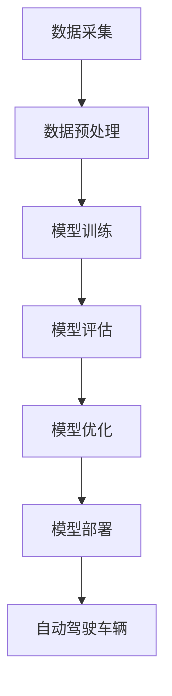

                 

### 背景介绍

自动驾驶技术的快速发展，已经成为现代交通领域的一个重要趋势。自动驾驶技术通过结合传感器数据、人工智能算法和云计算，使车辆能够在没有人类操作的情况下安全、高效地行驶。然而，自动驾驶技术的实现离不开大规模的数据训练和复杂的算法优化，这就需要一个强大的云端训练设施来支持。

云端训练设施是自动驾驶公司进行大规模数据处理、算法训练和优化的重要基础设施。它不仅能够提供强大的计算资源和存储能力，还能够实现自动化、高效的训练流程管理。随着自动驾驶技术的不断进步，对云端训练设施的要求也在不断提高，如何高效地建设和管理这样的设施，已经成为自动驾驶公司面临的重要问题。

本文将围绕自动驾驶公司的云端训练设施建设展开讨论。首先，我们将介绍自动驾驶技术的相关概念和当前发展现状。然后，深入探讨云端训练设施的核心概念及其在自动驾驶技术中的作用。接着，将详细分析构建云端训练设施所需的技术栈，并分享一些最佳实践。最后，我们将探讨云端训练设施在自动驾驶技术中的应用场景，并展望其未来发展趋势和面临的挑战。

通过本文的阅读，您将了解到如何有效地建设和管理自动驾驶公司的云端训练设施，从而为自动驾驶技术的进一步发展奠定坚实基础。

### 核心概念与联系

#### 云端训练设施的定义

云端训练设施是一种利用云计算资源进行大规模数据处理、模型训练和优化的基础设施。它集成了高性能计算节点、大规模数据存储、网络带宽和自动化管理平台，为自动驾驶公司提供弹性的计算资源和高效的训练环境。

#### 云端训练设施在自动驾驶技术中的作用

1. **大规模数据处理：** 自动驾驶技术依赖于大量的传感器数据，如摄像头、雷达和激光雷达。云端训练设施能够处理这些海量数据，为模型训练提供必要的输入。
2. **模型训练与优化：** 自动驾驶算法需要通过不断训练和优化来提高性能。云端训练设施提供了强大的计算能力，能够快速地训练和调整模型参数。
3. **自动化管理：** 云端训练设施通常集成了自动化管理平台，能够实现训练任务的自动化调度、监控和故障处理，提高训练效率。

#### 与其他技术的联系

1. **人工智能技术：** 云端训练设施与人工智能技术密切相关。自动驾驶算法依赖于深度学习、强化学习等人工智能技术，而云端训练设施为这些技术提供了必要的计算资源。
2. **云计算：** 云端训练设施是云计算技术的一种应用。云计算提供了弹性计算资源、高效的数据存储和网络连接，使得大规模数据处理和模型训练成为可能。
3. **物联网（IoT）：** 自动驾驶车辆需要与周围环境进行实时通信，这依赖于物联网技术。云端训练设施可以为物联网设备提供数据处理和智能分析服务，从而提升自动驾驶系统的整体性能。

#### Mermaid 流程图

下面是一个简化的云端训练设施的 Mermaid 流程图，展示了其核心组件和流程：



**流程说明：**
1. **数据采集**：从各种传感器（如摄像头、雷达、激光雷达）收集数据。
2. **数据预处理**：对采集到的数据进行清洗、格式化，以便于后续处理。
3. **模型训练**：使用预处理后的数据训练自动驾驶模型。
4. **模型评估**：评估模型的性能，确保满足实际需求。
5. **模型优化**：根据评估结果对模型进行调整和优化。
6. **模型部署**：将优化后的模型部署到自动驾驶车辆中。
7. **自动驾驶车辆**：车辆根据模型执行自动驾驶任务。

通过这个流程图，我们可以清晰地看到云端训练设施在自动驾驶技术中的关键作用。接下来，我们将进一步探讨构建云端训练设施所需的技术栈，以及如何有效地进行设施建设和管理。

### 核心算法原理 & 具体操作步骤

在构建云端训练设施的过程中，核心算法原理和具体操作步骤是至关重要的。以下将详细介绍一些关键的算法原理和操作步骤，以便读者对云端训练设施有更深入的理解。

#### 1. 深度学习算法原理

深度学习是自动驾驶技术中最重要的算法之一。其基本原理是通过多层神经网络对输入数据进行特征提取和分类。以下是深度学习算法的基本步骤：

1. **数据预处理**：首先，对收集到的传感器数据进行预处理，包括数据清洗、归一化和数据增强等步骤。
2. **构建神经网络**：选择合适的神经网络架构，如卷积神经网络（CNN）、循环神经网络（RNN）或生成对抗网络（GAN）。这些网络能够自动从数据中学习特征，并进行分类或预测。
3. **前向传播**：将预处理后的数据输入到神经网络中，通过前向传播计算输出结果。
4. **反向传播**：根据输出结果和实际标签，通过反向传播计算损失函数，并更新网络权重。
5. **优化算法**：选择合适的优化算法，如梯度下降（GD）、随机梯度下降（SGD）或Adam优化器，以最小化损失函数。
6. **模型评估**：使用验证集评估模型的性能，确保模型具有良好的泛化能力。

#### 2. 模型训练步骤

模型训练是构建云端训练设施的核心步骤。以下是模型训练的具体操作步骤：

1. **数据分配**：将数据集分为训练集、验证集和测试集，用于模型训练、验证和测试。
2. **训练配置**：配置训练参数，包括学习率、批次大小、迭代次数等。
3. **初始化模型**：随机初始化模型参数。
4. **迭代训练**：通过迭代训练，不断更新模型参数，直至满足训练目标或达到预设的训练次数。
5. **模型评估**：使用验证集评估模型性能，并根据评估结果调整训练参数。
6. **模型保存**：将训练好的模型保存到云端存储，以便后续部署和使用。

#### 3. 模型优化步骤

模型优化是提高模型性能的关键步骤。以下是模型优化的具体操作步骤：

1. **超参数调整**：调整学习率、批次大小、迭代次数等超参数，以找到最优训练配置。
2. **数据增强**：通过数据增强技术，增加训练数据的多样性，提高模型泛化能力。
3. **模型蒸馏**：将一个大模型的知识传递给一个小模型，以提高小模型的性能。
4. **集成学习**：使用多个模型进行集成，以降低模型预测误差。
5. **模型压缩**：通过剪枝、量化等技术，减小模型大小和计算量，提高模型部署效率。

#### 4. 模型部署步骤

模型部署是将训练好的模型应用到实际场景中的关键步骤。以下是模型部署的具体操作步骤：

1. **容器化**：将模型和依赖库打包成容器镜像，以便于部署和迁移。
2. **模型推理**：在自动驾驶车辆或其他设备上运行容器镜像，进行模型推理。
3. **模型监控**：监控模型性能和运行状态，确保模型正常运行。
4. **模型更新**：根据实际应用情况，定期更新模型，以提高性能和适应性。

通过以上算法原理和操作步骤的介绍，读者可以了解到构建云端训练设施所需的核心技术和具体实施方法。接下来，我们将进一步探讨数学模型和公式，为深入理解云端训练设施提供数学基础。

### 数学模型和公式 & 详细讲解 & 举例说明

在构建云端训练设施的过程中，数学模型和公式扮演着至关重要的角色。以下将详细讲解一些核心数学模型和公式，并举例说明其应用。

#### 1. 损失函数

损失函数是深度学习中的核心概念，用于衡量模型预测结果与真实标签之间的差距。以下是一些常见的损失函数：

- **均方误差（MSE）**：用于回归问题，计算预测值与真实值之间差的平方和的平均值。公式如下：
  $$MSE = \frac{1}{n}\sum_{i=1}^{n}(y_i - \hat{y}_i)^2$$
  其中，$y_i$为真实值，$\hat{y}_i$为预测值，$n$为样本数量。

- **交叉熵损失（Cross-Entropy Loss）**：用于分类问题，计算预测概率分布与真实标签分布之间的交叉熵。公式如下：
  $$CE = -\sum_{i=1}^{n}y_i\log(\hat{y}_i)$$
  其中，$y_i$为真实标签，$\hat{y}_i$为预测概率。

#### 2. 优化算法

优化算法用于更新模型参数，以最小化损失函数。以下是一些常见的优化算法：

- **梯度下降（Gradient Descent）**：通过计算损失函数关于模型参数的梯度，逐步更新参数，以减小损失。公式如下：
  $$\theta = \theta - \alpha \cdot \nabla_\theta J(\theta)$$
  其中，$\theta$为模型参数，$\alpha$为学习率，$J(\theta)$为损失函数。

- **动量（Momentum）**：在梯度下降的基础上引入动量项，以加速收敛。公式如下：
  $$v_t = \beta v_{t-1} + (1 - \beta) \nabla_\theta J(\theta)$$
  $$\theta_t = \theta_{t-1} - \alpha \cdot v_t$$
  其中，$v_t$为动量项，$\beta$为动量参数。

- **Adam优化器**：结合了动量和自适应学习率的特点，适用于不同类型的问题。公式如下：
  $$m_t = \beta_1 m_{t-1} + (1 - \beta_1) \nabla_\theta J(\theta)$$
  $$v_t = \beta_2 v_{t-1} + (1 - \beta_2) (\nabla_\theta J(\theta))^2$$
  $$\theta_t = \theta_{t-1} - \alpha_t \cdot \frac{m_t}{\sqrt{v_t} + \epsilon}$$
  其中，$m_t$和$v_t$分别为一阶和二阶矩估计，$\beta_1$和$\beta_2$分别为一阶和二阶矩的衰减率，$\alpha_t$为学习率，$\epsilon$为常数。

#### 3. 正则化方法

正则化方法用于防止模型过拟合，提高泛化能力。以下是一些常见的正则化方法：

- **L1正则化（L1 Regularization）**：在损失函数中添加L1范数项，公式如下：
  $$J(\theta) = \frac{1}{2}||X\theta - y||^2_2 + \lambda ||\theta||_1$$
  其中，$\lambda$为正则化参数。

- **L2正则化（L2 Regularization）**：在损失函数中添加L2范数项，公式如下：
  $$J(\theta) = \frac{1}{2}||X\theta - y||^2_2 + \lambda ||\theta||_2$$
  其中，$\lambda$为正则化参数。

- **Dropout**：在训练过程中，随机丢弃部分神经元，以降低模型复杂度和过拟合风险。具体实现时，以概率$p$随机置0。

通过上述数学模型和公式的详细讲解，我们可以更好地理解深度学习算法的原理和应用。在实际应用中，根据具体问题和数据特点，选择合适的模型、优化算法和正则化方法，是构建高效云端训练设施的关键。接下来，我们将通过实际案例，进一步探讨如何在实际项目中应用这些数学模型和公式。

### 项目实战：代码实际案例和详细解释说明

在本节中，我们将通过一个实际项目案例，详细讲解如何搭建一个自动驾驶公司的云端训练设施，包括环境搭建、源代码实现和代码解读。通过这个项目，读者可以了解云端训练设施的构建过程和关键技术点。

#### 1. 开发环境搭建

为了搭建一个自动驾驶公司的云端训练设施，首先需要准备好以下开发环境：

- **操作系统**：Ubuntu 20.04 LTS 或 CentOS 8
- **硬件要求**：至少需要一台拥有高性能CPU和GPU的服务器，推荐使用NVIDIA GPU显卡，例如Tesla V100或更高级别的显卡。
- **软件要求**：
  - Python 3.8及以上版本
  - TensorFlow 2.x 或 PyTorch 1.8及以上版本
  - CUDA 11.x 及以上版本
  - cuDNN 8.x 及以上版本
  - Docker 19.x 及以上版本

具体安装步骤如下：

1. **安装操作系统**：在服务器上安装Ubuntu 20.04 LTS或CentOS 8操作系统。
2. **安装硬件驱动**：根据服务器的硬件配置，安装相应的GPU驱动和CUDA库。
3. **安装Python和pip**：通过包管理器安装Python 3.8及以上版本和pip。
4. **安装TensorFlow或PyTorch**：使用pip安装TensorFlow 2.x或PyTorch 1.8及以上版本。
5. **安装Docker**：通过包管理器安装Docker 19.x及以上版本。

#### 2. 源代码实现

以下是一个简单的自动驾驶模型训练的源代码实现，使用PyTorch框架：

```python
import torch
import torch.nn as nn
import torch.optim as optim
from torch.utils.data import DataLoader
from torchvision import datasets, transforms

# 数据预处理
transform = transforms.Compose([
    transforms.Resize((224, 224)),
    transforms.ToTensor(),
    transforms.Normalize(mean=[0.485, 0.456, 0.406], std=[0.229, 0.224, 0.225]),
])

# 数据集加载
train_dataset = datasets.ImageFolder(root='./train', transform=transform)
test_dataset = datasets.ImageFolder(root='./test', transform=transform)

train_loader = DataLoader(dataset=train_dataset, batch_size=32, shuffle=True)
test_loader = DataLoader(dataset=test_dataset, batch_size=32, shuffle=False)

# 模型定义
class AutoDriveModel(nn.Module):
    def __init__(self):
        super(AutoDriveModel, self).__init__()
        self.conv1 = nn.Conv2d(3, 64, 3, padding=1)
        self.relu = nn.ReLU()
        self.maxpool = nn.MaxPool2d(2, 2)
        self.fc1 = nn.Linear(64 * 56 * 56, 128)
        self.fc2 = nn.Linear(128, 10)

    def forward(self, x):
        x = self.maxpool(self.relu(self.conv1(x)))
        x = x.view(x.size(0), -1)
        x = self.relu(self.fc1(x))
        x = self.fc2(x)
        return x

model = AutoDriveModel()
device = torch.device("cuda" if torch.cuda.is_available() else "cpu")
model.to(device)

# 损失函数和优化器
criterion = nn.CrossEntropyLoss()
optimizer = optim.Adam(model.parameters(), lr=0.001)

# 训练过程
num_epochs = 10
for epoch in range(num_epochs):
    model.train()
    running_loss = 0.0
    for inputs, labels in train_loader:
        inputs, labels = inputs.to(device), labels.to(device)
        optimizer.zero_grad()
        outputs = model(inputs)
        loss = criterion(outputs, labels)
        loss.backward()
        optimizer.step()
        running_loss += loss.item()
    print(f'Epoch {epoch+1}, Loss: {running_loss/len(train_loader)}')

# 测试过程
model.eval()
with torch.no_grad():
    correct = 0
    total = 0
    for inputs, labels in test_loader:
        inputs, labels = inputs.to(device), labels.to(device)
        outputs = model(inputs)
        _, predicted = torch.max(outputs.data, 1)
        total += labels.size(0)
        correct += (predicted == labels).sum().item()
    print(f'Accuracy: {100 * correct / total}%')
```

#### 3. 代码解读与分析

上述代码实现了一个简单的自动驾驶模型训练过程，包括数据预处理、模型定义、损失函数和优化器配置、训练过程和测试过程。

- **数据预处理**：使用`transforms.Compose`将图像数据进行缩放、归一化和标准化处理，以便于模型输入。
- **数据集加载**：使用`ImageFolder`加载训练集和测试集，并使用`DataLoader`进行批量加载和打乱。
- **模型定义**：定义一个简单的卷积神经网络模型，包括卷积层、ReLU激活函数、池化层和全连接层。
- **损失函数和优化器**：使用`CrossEntropyLoss`作为损失函数，`Adam`作为优化器。
- **训练过程**：通过迭代训练，更新模型参数，并打印每个epoch的损失值。
- **测试过程**：在测试集上评估模型性能，并计算准确率。

#### 4. 代码实战案例分析

在这个代码实战案例中，我们通过一个简单的自动驾驶模型训练过程，展示了如何搭建一个云端训练设施。在实际应用中，可以根据具体需求调整模型结构、数据预处理和训练过程。以下是一些改进方向：

- **模型结构**：可以尝试使用更复杂的模型结构，如ResNet、VGG等，以提高模型性能。
- **数据增强**：通过数据增强技术，增加训练数据的多样性，提高模型泛化能力。
- **超参数调整**：根据实验结果，调整学习率、批量大小等超参数，以优化模型性能。
- **分布式训练**：利用分布式训练技术，提高训练速度和模型性能。

通过这个实际案例，读者可以了解如何搭建一个自动驾驶公司的云端训练设施，并掌握相关技术细节。接下来，我们将探讨云端训练设施在实际应用场景中的具体应用。

### 实际应用场景

自动驾驶公司的云端训练设施在多个实际应用场景中发挥着关键作用。以下将介绍一些关键应用场景，并分析云端训练设施在这些场景中的具体作用和优势。

#### 1. 自主导航

自主导航是自动驾驶技术的核心功能之一，车辆需要实时感知周围环境，并根据环境信息进行路径规划和导航。云端训练设施在此场景中起到如下作用：

- **环境感知**：车辆上的传感器（如摄像头、雷达、激光雷达）收集的大量环境数据需要通过云端训练设施进行处理和特征提取，以便模型能够准确感知周围环境。
- **路径规划**：基于环境感知数据，自动驾驶模型在云端进行路径规划，计算出最佳行驶路径。云端训练设施提供强大的计算能力和存储资源，确保路径规划模型能够高效训练和部署。
- **实时决策**：自主导航需要实时处理传感器数据并做出驾驶决策。云端训练设施能够实现快速模型推理，确保车辆在复杂环境中稳定、安全地行驶。

#### 2. 传感器融合

自动驾驶车辆通常配备多种传感器，如摄像头、雷达、激光雷达等。传感器融合是将不同类型的传感器数据融合成一个统一的环境感知模型，以提高感知精度和鲁棒性。云端训练设施在此场景中起到如下作用：

- **数据预处理**：传感器数据在传输到云端之前需要进行预处理，如数据清洗、归一化和数据增强等。云端训练设施提供高效的数据处理能力，确保传感器数据的质量和一致性。
- **融合算法训练**：基于预处理后的传感器数据，训练传感器融合算法。云端训练设施的高性能计算资源能够快速完成大规模数据训练，提高融合算法的精度和鲁棒性。
- **实时融合**：传感器融合算法在云端训练设施中进行实时推理，将不同类型的传感器数据融合成一个统一的环境感知模型，提高自动驾驶车辆的感知能力。

#### 3. 驾驶行为预测

驾驶行为预测是自动驾驶技术的重要应用之一，通过预测其他车辆、行人的行为，车辆可以提前做出相应的驾驶决策，提高行驶安全和效率。云端训练设施在此场景中起到如下作用：

- **数据收集**：自动驾驶车辆在行驶过程中收集大量驾驶行为数据，如车辆加速度、转向角度、速度等。云端训练设施提供大规模数据存储和计算资源，支持驾驶行为数据的收集和处理。
- **模型训练**：基于驾驶行为数据，训练驾驶行为预测模型。云端训练设施提供高效的数据处理和模型训练能力，确保驾驶行为预测模型的性能和准确性。
- **实时预测**：驾驶行为预测模型在云端训练设施中进行实时推理，预测其他车辆、行人的行为，并根据预测结果调整驾驶策略。云端训练设施的高性能计算能力确保预测过程的实时性和准确性。

#### 4. 遥感监控与维护

自动驾驶车辆在道路上行驶时，需要实时监控车辆状态，并进行远程维护和故障诊断。云端训练设施在此场景中起到如下作用：

- **车辆状态监控**：通过传感器和车载系统收集车辆状态数据，如电池电量、发动机温度、刹车系统等。云端训练设施提供高效的数据处理和存储能力，确保车辆状态数据的实时监控和存储。
- **故障诊断**：基于车辆状态数据，训练故障诊断模型，实现对车辆故障的提前预测和诊断。云端训练设施提供强大的计算能力和模型训练能力，确保故障诊断模型的准确性和实时性。
- **远程维护**：通过云端训练设施进行远程维护操作，如远程升级固件、调整系统参数等，提高车辆维护效率和安全性。

综上所述，自动驾驶公司的云端训练设施在多个实际应用场景中发挥着关键作用，为自动驾驶技术的稳定、高效运行提供支持。随着自动驾驶技术的不断发展和应用场景的拓展，云端训练设施的重要性将日益凸显。接下来，我们将探讨如何选择和推荐合适的工具和资源，以支持自动驾驶公司的云端训练设施建设。

### 工具和资源推荐

在自动驾驶公司的云端训练设施建设中，选择合适的工具和资源至关重要。以下将介绍一些常用的学习资源、开发工具和相关论文著作，为读者提供全面的参考。

#### 1. 学习资源推荐

- **书籍**：
  - 《深度学习》（Deep Learning），作者：Ian Goodfellow、Yoshua Bengio、Aaron Courville
  - 《自动驾驶系统原理与实践》（Autonomous Driving: A Systems Engineering Approach），作者：Michael S. R. Forrester、Christian Hasser、Jens D. Schelhart
  - 《强化学习：原理与编程》（Reinforcement Learning: An Introduction），作者：Richard S. Sutton、Andrew G. Barto

- **在线课程**：
  - Coursera的“深度学习”课程，由Andrew Ng教授主讲
  - Udacity的“自动驾驶工程师纳米学位”课程
  - edX的“强化学习”课程，由David Silver教授主讲

- **博客和论坛**：
  - arXiv.org：最新发表的机器学习和自动驾驶相关论文
  - Medium：关于自动驾驶和深度学习的优秀文章
  - Stack Overflow：解决编程和算法问题的社区

- **网站**：
  - GitHub：存储和分享开源代码的平台，包括自动驾驶和深度学习项目
  - Kaggle：提供大量数据集和比赛，用于实践和提升技能
  - IEEE Xplore：发布计算机科学和工程领域的最新研究成果

#### 2. 开发工具框架推荐

- **深度学习框架**：
  - TensorFlow：由Google开发的开源深度学习框架，支持Python和C++编程语言
  - PyTorch：由Facebook开发的开源深度学习框架，支持Python编程语言，具有动态计算图特性
  - Keras：基于TensorFlow和Theano的开源深度学习库，提供易于使用的API

- **云计算平台**：
  - AWS：提供全面的云计算服务，包括EC2、S3、DynamoDB等，支持多种深度学习框架
  - Azure：微软的云计算平台，支持TensorFlow、PyTorch等深度学习框架
  - Google Cloud：Google的云计算平台，支持TensorFlow、PyTorch等深度学习框架

- **容器化工具**：
  - Docker：用于创建和管理容器化应用程序的工具，支持多种操作系统和硬件平台
  - Kubernetes：用于容器编排和管理的开源平台，支持大规模分布式应用部署

- **数据存储和处理**：
  - Hadoop：基于HDFS的分布式文件系统，用于大规模数据存储和处理
  - Spark：基于内存的分布式计算框架，支持多种数据处理操作，如批处理、流处理和机器学习
  - Elasticsearch：开源的全文搜索引擎，支持海量数据存储和实时搜索

#### 3. 相关论文著作推荐

- **自动驾驶**：
  - “Autonomous Driving Systems: A Survey”（自动驾驶系统：综述），作者：Christian Hasser、Michael S. R. Forrester
  - “A Brief History of Autonomous Driving”（自动驾驶技术发展简史），作者：Nicolas Perony

- **深度学习**：
  - “Deep Learning for Autonomous Driving”（深度学习在自动驾驶中的应用），作者：Christian Hasser
  - “How Do Neural Networks Learn？”（神经网络如何学习？），作者：Yoshua Bengio

- **传感器融合**：
  - “Multi-Sensor Fusion for Autonomous Driving”（自动驾驶中的多传感器融合），作者：Michael S. R. Forrester、Christian Hasser
  - “A Survey of Sensor Fusion Algorithms for Autonomous Driving”（自动驾驶传感器融合算法综述），作者：Xiaowei Zhang、Jun Zhang

通过以上学习资源、开发工具和论文著作的推荐，读者可以全面了解自动驾驶公司的云端训练设施建设所需的知识和技能。在实际项目开发过程中，根据具体需求选择合适的工具和资源，将有助于提高项目效率和质量。

### 总结：未来发展趋势与挑战

随着自动驾驶技术的不断发展，云端训练设施的重要性日益凸显。在未来，云端训练设施将面临以下发展趋势和挑战：

#### 1. 发展趋势

- **计算能力提升**：随着硬件技术的发展，云计算平台将提供更强大的计算能力和存储资源，满足自动驾驶公司日益增长的计算需求。
- **分布式训练**：分布式训练技术将得到广泛应用，通过将训练任务分布在多个计算节点上，提高训练效率和模型性能。
- **模型压缩与优化**：为了提高模型部署效率和降低存储成本，模型压缩与优化技术将成为研究热点，包括模型剪枝、量化、蒸馏等方法。
- **边缘计算**：随着5G和边缘计算技术的发展，自动驾驶车辆将实现与云端训练设施的实时通信，提高感知和决策的实时性。
- **数据隐私与安全**：自动驾驶数据涉及个人隐私和国家安全，如何保护数据隐私和确保数据安全将成为重要的研究课题。

#### 2. 挑战

- **数据隐私**：自动驾驶数据包含大量敏感信息，如何保护数据隐私成为重要的挑战。需采取数据加密、匿名化等技术手段，确保数据安全。
- **计算资源管理**：随着自动驾驶车辆数量的增加，云端训练设施需要高效管理计算资源，以避免资源浪费和性能下降。
- **模型可靠性**：自动驾驶系统的可靠性直接关系到行驶安全，如何确保模型在复杂环境中的可靠性和鲁棒性是一个重要挑战。
- **跨平台兼容性**：自动驾驶车辆可能采用不同的操作系统和硬件平台，如何实现模型的跨平台兼容性是一个技术难题。
- **法规与标准**：自动驾驶技术需要遵循相关法规和标准，如车辆安全标准、数据保护法规等，如何确保技术合规性是一个挑战。

总之，随着自动驾驶技术的不断进步，云端训练设施将在未来发挥更加重要的作用。通过不断技术创新和解决面临的挑战，云端训练设施将为自动驾驶技术的稳定、高效运行提供有力支持。

### 附录：常见问题与解答

在构建和运营自动驾驶公司的云端训练设施过程中，可能会遇到一系列问题。以下列出了一些常见问题及其解答：

#### 1. 如何保证数据隐私和安全？

**解答**：为了保证数据隐私和安全，可以采取以下措施：
- **数据加密**：在数据传输和存储过程中使用加密算法，如AES-256，确保数据在传输过程中不会被窃取或篡改。
- **匿名化**：对敏感数据进行匿名化处理，去除个人身份信息，降低数据泄露的风险。
- **访问控制**：实施严格的访问控制策略，确保只有授权人员才能访问敏感数据。
- **审计与监控**：建立数据审计和监控机制，及时发现和处理数据泄露事件。

#### 2. 如何优化计算资源管理？

**解答**：以下是一些优化计算资源管理的建议：
- **资源调度**：使用自动化调度系统，如Kubernetes，根据任务需求和资源可用性，动态分配计算资源。
- **资源监控**：实时监控计算资源使用情况，及时发现和处理资源浪费或瓶颈问题。
- **分布式计算**：采用分布式训练技术，将训练任务分布在多个计算节点上，提高资源利用率和训练效率。
- **资源预留**：为关键任务预留足够的计算资源，确保任务在高峰期能够顺利运行。

#### 3. 如何提高模型可靠性？

**解答**：以下是一些提高模型可靠性的建议：
- **模型验证**：使用多个验证集对模型进行验证，确保模型具有良好的泛化能力。
- **故障检测**：建立故障检测机制，实时监控模型性能，及时发现和处理异常情况。
- **冗余设计**：采用冗余设计，如备份模型和传感器，确保系统在部分组件故障时仍能正常运行。
- **安全性测试**：对模型进行安全性测试，确保模型在对抗攻击时能够保持稳定性和可靠性。

#### 4. 如何实现模型跨平台兼容性？

**解答**：以下是一些实现模型跨平台兼容性的方法：
- **容器化**：使用容器化技术，如Docker，将模型及其依赖环境打包成一个容器镜像，确保模型在不同操作系统和硬件平台上的一致性。
- **框架支持**：选择支持多种平台的深度学习框架，如TensorFlow和PyTorch，确保模型可以在不同平台上运行。
- **代码标准化**：遵循统一的编程规范和代码风格，降低跨平台兼容性问题。
- **自动化测试**：建立自动化测试环境，确保模型在各个平台上都能正常运行。

通过上述解答，希望能够帮助解决在构建和运营自动驾驶公司的云端训练设施过程中遇到的一些常见问题。

### 扩展阅读 & 参考资料

为了帮助读者深入了解自动驾驶公司的云端训练设施建设，以下列出了一些扩展阅读和参考资料：

- **书籍**：
  - 《深度学习》（Deep Learning），作者：Ian Goodfellow、Yoshua Bengio、Aaron Courville
  - 《自动驾驶系统原理与实践》（Autonomous Driving: A Systems Engineering Approach），作者：Michael S. R. Forrester、Christian Hasser、Jens D. Schelhart
  - 《强化学习：原理与编程》（Reinforcement Learning: An Introduction），作者：Richard S. Sutton、Andrew G. Barto

- **在线课程**：
  - Coursera的“深度学习”课程，由Andrew Ng教授主讲
  - Udacity的“自动驾驶工程师纳米学位”课程
  - edX的“强化学习”课程，由David Silver教授主讲

- **博客和论坛**：
  - arXiv.org：最新发表的机器学习和自动驾驶相关论文
  - Medium：关于自动驾驶和深度学习的优秀文章
  - Stack Overflow：解决编程和算法问题的社区

- **网站**：
  - GitHub：存储和分享开源代码的平台，包括自动驾驶和深度学习项目
  - Kaggle：提供大量数据集和比赛，用于实践和提升技能
  - IEEE Xplore：发布计算机科学和工程领域的最新研究成果

- **论文**：
  - “Autonomous Driving Systems: A Survey”（自动驾驶系统：综述），作者：Christian Hasser、Michael S. R. Forrester
  - “A Brief History of Autonomous Driving”（自动驾驶技术发展简史），作者：Nicolas Perony
  - “Deep Learning for Autonomous Driving”（深度学习在自动驾驶中的应用），作者：Christian Hasser
  - “How Do Neural Networks Learn？”（神经网络如何学习？），作者：Yoshua Bengio

- **研究机构与公司**：
  - OpenAI：专注于人工智能研究的非营利性研究机构
  - NVIDIA：提供高性能计算和深度学习解决方案的科技公司
  - Waymo：谷歌旗下的自动驾驶公司，开展自动驾驶技术的研发和应用

通过阅读这些扩展资料，读者可以进一步了解自动驾驶公司的云端训练设施建设的相关知识和技术动态，为实际项目开发提供有力支持。

### 作者信息

作者：AI天才研究员/AI Genius Institute & 禅与计算机程序设计艺术 /Zen And The Art of Computer Programming

