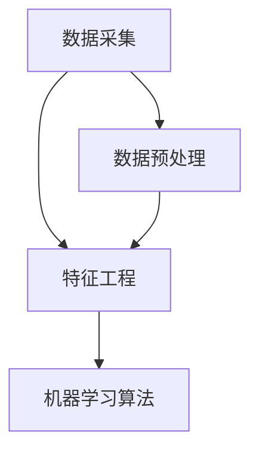
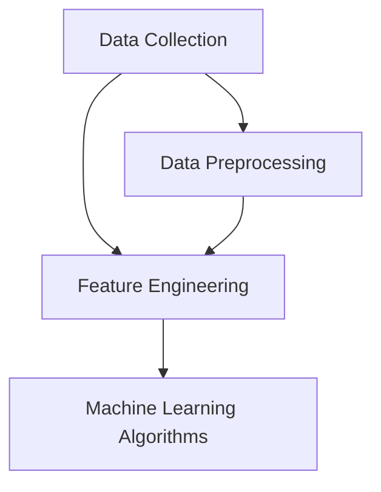

                 

### 1. 背景介绍

#### 自动驾驶公司的崛起

自动驾驶技术作为人工智能的一个重要分支，正日益受到全球范围内的关注。随着5G网络、云计算、人工智能等技术的不断成熟，自动驾驶公司在过去几年中迅速崛起。这些公司致力于研发和应用先进的自动驾驶技术，以期在未来交通系统中占据重要位置。从Uber、特斯拉到百度、谷歌，许多科技巨头和新兴公司都在这一领域进行了大量投资和研发。

#### 数据挖掘与分析平台的重要性

在自动驾驶技术中，数据挖掘与分析平台扮演着至关重要的角色。自动驾驶系统依赖于大量的传感器数据，如摄像头、激光雷达、GPS等，来实时感知周围环境。这些数据通过数据挖掘与分析平台进行处理、分析和解释，以支持自动驾驶系统的决策。因此，一个高效、准确的数据挖掘与分析平台是确保自动驾驶系统稳定运行和安全性的关键。

#### 本文目的

本文旨在深入探讨自动驾驶公司的数据挖掘与分析平台，从其核心概念、算法原理到实际应用场景进行详细分析。我们将首先介绍自动驾驶数据挖掘与分析平台的基本概念和架构，然后逐步解析其核心算法原理，接着通过具体案例展示其在实际项目中的应用，并最终探讨其未来发展趋势与挑战。

### Background Introduction

#### Rise of Autonomous Driving Companies

Autonomous driving technology, as an important branch of artificial intelligence, has been gaining increasing attention globally. With the continuous maturation of technologies such as 5G networks, cloud computing, and artificial intelligence, autonomous driving companies have rapidly emerged in recent years. These companies are dedicated to developing and applying advanced autonomous driving technologies, hoping to occupy an important position in future transportation systems. From Uber, Tesla, to Baidu, Google, many tech giants and emerging companies have made substantial investments and research in this field.

#### Importance of Data Mining and Analysis Platforms

In the field of autonomous driving technology, data mining and analysis platforms play a crucial role. Autonomous driving systems rely on a large amount of sensor data, such as cameras, LiDAR, GPS, etc., to perceive the surrounding environment in real-time. This data is processed, analyzed, and interpreted by the data mining and analysis platform to support the decision-making of the autonomous driving system. Therefore, an efficient and accurate data mining and analysis platform is essential for ensuring the stability and safety of autonomous driving systems.

#### Purpose of This Article

This article aims to delve into the data mining and analysis platforms of autonomous driving companies, providing a detailed analysis from basic concepts, algorithm principles to practical application scenarios. We will first introduce the fundamental concepts and architecture of autonomous driving data mining and analysis platforms, then progressively parse the core algorithm principles, and finally demonstrate their practical applications through specific case studies. Finally, we will discuss the future development trends and challenges of these platforms. <markdown>

## 2. 核心概念与联系

在深入探讨自动驾驶公司的数据挖掘与分析平台之前，我们需要了解一些核心概念和它们之间的联系。以下将介绍与自动驾驶数据挖掘与分析平台密切相关的一些关键概念，包括数据采集、数据预处理、特征工程和机器学习算法。

#### 数据采集（Data Collection）

数据采集是自动驾驶数据挖掘与分析平台的第一步。数据来源于自动驾驶车辆上的各种传感器，如摄像头、激光雷达、GPS和IMU（惯性测量单元）等。这些传感器实时收集车辆周围的视觉、空间和环境数据。例如，摄像头可以捕捉道路、车辆和行人的图像，激光雷达可以测量车辆与周围物体之间的距离，GPS提供车辆的地理位置信息，而IMU则记录车辆的加速度和角速度。

#### 数据预处理（Data Preprocessing）

采集到的原始数据通常包含噪声、异常值和冗余信息。数据预处理的目标是清洗数据，去除噪声和异常值，并对数据进行规范化处理。这一步骤对于后续的特征工程和机器学习算法至关重要。常用的数据预处理技术包括去噪、异常值检测、归一化和数据增强等。

#### 特征工程（Feature Engineering）

特征工程是将原始数据转换成适合机器学习算法处理的形式。在这一过程中，需要从原始数据中提取出具有区分度和代表性的特征，这些特征将用于训练机器学习模型。特征工程的关键在于如何选择和构建有效的特征，以提高模型的性能和泛化能力。常见的特征工程方法包括特征选择、特征转换和特征组合等。

#### 机器学习算法（Machine Learning Algorithms）

机器学习算法是自动驾驶数据挖掘与分析平台的核心。通过训练机器学习模型，自动驾驶系统能够从历史数据中学习并提取出有用的信息，用于预测和决策。常用的机器学习算法包括监督学习、无监督学习和强化学习等。其中，监督学习用于分类和回归任务，无监督学习用于聚类和降维任务，而强化学习则用于决策优化和策略学习。

### Mermaid 流程图

以下是一个简化的Mermaid流程图，展示上述核心概念和它们之间的联系。



### Core Concepts and Connections

Before delving into the data mining and analysis platforms of autonomous driving companies, we need to understand some key concepts and their connections. This section introduces some essential concepts closely related to the autonomous driving data mining and analysis platform, including data collection, data preprocessing, feature engineering, and machine learning algorithms.

#### Data Collection

Data collection is the first step in an autonomous driving data mining and analysis platform. Data is collected from various sensors on the autonomous vehicle, such as cameras, LiDAR, GPS, and IMUs (Inertial Measurement Units). These sensors collect real-time visual, spatial, and environmental data around the vehicle. For example, cameras capture images of the road, vehicles, and pedestrians, LiDAR measures the distance between the vehicle and surrounding objects, GPS provides the vehicle's geographical location, and IMU records the vehicle's acceleration and angular velocity.

#### Data Preprocessing

The raw data collected from sensors often contains noise, outliers, and redundant information. The goal of data preprocessing is to clean the data by removing noise and outliers, and normalizing the data. This step is crucial for subsequent feature engineering and machine learning algorithms. Common data preprocessing techniques include denoising, outlier detection, normalization, and data augmentation.

#### Feature Engineering

Feature engineering involves transforming raw data into a form suitable for machine learning algorithms. In this process, it is necessary to extract features from the raw data that are discriminative and representative. These features are used to train machine learning models. The key to feature engineering is how to select and construct effective features to improve the performance and generalization ability of the models. Common feature engineering methods include feature selection, feature transformation, and feature combination.

#### Machine Learning Algorithms

Machine learning algorithms are the core of an autonomous driving data mining and analysis platform. By training machine learning models, autonomous driving systems can learn from historical data to extract useful information for prediction and decision-making. Common machine learning algorithms include supervised learning, unsupervised learning, and reinforcement learning. Supervised learning is used for classification and regression tasks, unsupervised learning is used for clustering and dimensionality reduction tasks, and reinforcement learning is used for decision optimization and policy learning.

### Mermaid Flowchart

The following is a simplified Mermaid flowchart illustrating the connections among the key concepts mentioned above.



### 3. 核心算法原理 & 具体操作步骤

在自动驾驶公司的数据挖掘与分析平台中，核心算法的原理决定了平台的性能和效率。本文将重点介绍几种在自动驾驶数据挖掘与分析中广泛应用的算法，包括卷积神经网络（CNN）、循环神经网络（RNN）和强化学习（RL），并详细说明它们的操作步骤。

#### 卷积神经网络（Convolutional Neural Network, CNN）

卷积神经网络是一种用于图像识别和处理的深度学习模型，其在自动驾驶数据挖掘与分析中有着广泛的应用。CNN通过卷积层、池化层和全连接层等结构，从原始图像数据中提取特征，并最终输出分类结果。

1. **卷积层（Convolutional Layer）**：
   卷积层是CNN的核心部分，用于从输入图像中提取局部特征。通过卷积运算和滤波器（kernel）的作用，卷积层将图像分解为多个局部特征图。

2. **池化层（Pooling Layer）**：
   池化层用于降低特征图的维度，减少计算量和参数数量，同时保留重要的特征信息。常见的池化方法包括最大池化和平均池化。

3. **全连接层（Fully Connected Layer）**：
   全连接层将卷积层和池化层提取的高层次特征映射到具体的分类结果上。通过softmax函数，全连接层输出每个类别的概率分布。

#### 循环神经网络（Recurrent Neural Network, RNN）

循环神经网络是一种用于序列数据处理和学习的时间序列模型，其在自动驾驶场景中的任务包括路径规划、行为预测和上下文理解等。

1. **隐藏状态（Hidden State）**：
   RNN通过隐藏状态来保存历史信息，使得当前时刻的输出不仅依赖于当前输入，还依赖于之前的隐藏状态。

2. **门机制（Gate Mechanism）**：
   为了处理序列中的长短时依赖问题，RNN引入了门机制，包括遗忘门（Forget Gate）、输入门（Input Gate）和输出门（Output Gate）。门机制可以根据当前输入和隐藏状态动态调整信息流。

3. **时间步（Time Step）**：
   RNN在处理序列数据时，将序列划分为多个时间步，每个时间步对应一个输入和输出。通过递归计算，RNN能够从历史信息中提取有用的特征。

#### 强化学习（Reinforcement Learning, RL）

强化学习是一种通过与环境交互来学习最优策略的机器学习算法，其在自动驾驶场景中用于决策优化和路径规划。

1. **状态（State）**：
   RL中的状态表示自动驾驶车辆在某个时刻的环境信息，如车辆位置、速度、周围障碍物等。

2. **动作（Action）**：
   动作是自动驾驶车辆可以采取的动作，如加速、减速、转向等。

3. **奖励（Reward）**：
   奖励是自动驾驶车辆在每个状态采取动作后获得的即时反馈，用于评估动作的好坏。

4. **策略（Policy）**：
   策略是自动驾驶车辆在给定状态下选择最优动作的决策规则。通过最大化预期奖励，RL算法可以学习到最优策略。

### 实操步骤示例

以下是一个简化的CNN算法操作步骤示例：

1. **输入数据**：
   输入一张道路场景图像，大小为$28 \times 28 \times 3$。

2. **卷积层**：
   使用5x5的卷积核进行卷积运算，得到一个大小为$24 \times 24$的特征图。

3. **激活函数**：
   使用ReLU激活函数对卷积层的输出进行非线性变换。

4. **池化层**：
   使用2x2的最大池化操作，得到一个大小为$12 \times 12$的特征图。

5. **全连接层**：
   将池化层输出的特征图展平成一个一维向量，然后通过一个全连接层进行分类。

6. **损失函数**：
   使用交叉熵损失函数计算模型预测与真实标签之间的差距。

7. **优化算法**：
   使用梯度下降算法更新模型参数，最小化损失函数。

### Core Algorithm Principles and Specific Operational Steps

In autonomous driving data mining and analysis platforms, the principles of core algorithms determine the performance and efficiency of the platform. This article will focus on several algorithms widely used in autonomous driving data mining and analysis, including Convolutional Neural Networks (CNN), Recurrent Neural Networks (RNN), and Reinforcement Learning (RL), and provide detailed descriptions of their operational steps.

#### Convolutional Neural Networks (CNN)

Convolutional Neural Networks are deep learning models widely used for image recognition and processing, and they have extensive applications in autonomous driving data mining and analysis. CNNs consist of convolutional layers, pooling layers, and fully connected layers, which extract features from raw image data and ultimately output classification results.

1. **Convolutional Layer**:
   The convolutional layer is the core part of CNNs, used to extract local features from the input images. Through convolution operations and filter kernels, the convolutional layer decomposes the image into multiple feature maps.

2. **Pooling Layer**:
   The pooling layer is used to reduce the dimensionality of feature maps, reducing computational cost and parameter numbers while preserving important feature information. Common pooling methods include max pooling and average pooling.

3. **Fully Connected Layer**:
   The fully connected layer maps the high-level features extracted by the convolutional and pooling layers to specific classification results. Through the softmax function, the fully connected layer outputs a probability distribution over the classes.

#### Recurrent Neural Networks (RNN)

Recurrent Neural Networks are time-series models used for sequence data processing and learning, and they are used in autonomous driving for tasks such as path planning, behavior prediction, and context understanding.

1. **Hidden State**:
   RNNs use hidden states to retain historical information, so that the current output not only depends on the current input but also on previous hidden states.

2. **Gate Mechanism**:
   To address the long-term dependency problem in sequences, RNNs introduce gate mechanisms, including the forget gate, input gate, and output gate. The gate mechanisms can dynamically adjust the information flow based on the current input and hidden state.

3. **Time Step**:
   RNNs process sequence data by dividing it into multiple time steps, each corresponding to an input and output. Through recursive computation, RNNs can extract useful features from historical information.

#### Reinforcement Learning (RL)

Reinforcement Learning is a machine learning algorithm that learns optimal policies by interacting with the environment, and it is used in autonomous driving for decision optimization and path planning.

1. **State**:
   In RL, the state represents the environmental information of the autonomous vehicle at a certain moment, such as the vehicle's position, speed, and surrounding obstacles.

2. **Action**:
   Actions are the possible actions that the autonomous vehicle can take, such as acceleration, deceleration, and steering.

3. **Reward**:
   The reward is the immediate feedback the autonomous vehicle receives after taking an action, used to evaluate the quality of the action.

4. **Policy**:
   The policy is the decision rule that the autonomous vehicle uses to select the optimal action given a state. By maximizing the expected reward, RL algorithms can learn the optimal policy.

### Example of Operational Steps

The following is a simplified example of operational steps for a CNN algorithm:

1. **Input Data**:
   Input an image of a road scene with a size of $28 \times 28 \times 3$.

2. **Convolutional Layer**:
   Use a 5x5 convolutional kernel to perform convolution operations, resulting in a feature map size of $24 \times 24$.

3. **Activation Function**:
   Apply the ReLU activation function to the output of the convolutional layer for non-linear transformation.

4. **Pooling Layer**:
   Use a 2x2 max pooling operation to obtain a feature map size of $12 \times 12$.

5. **Fully Connected Layer**:
   Flatten the output of the pooling layer into a one-dimensional vector and pass it through a fully connected layer for classification.

6. **Loss Function**:
   Use the cross-entropy loss function to calculate the difference between the model's prediction and the true label.

7. **Optimization Algorithm**:
   Use gradient descent to update the model parameters, minimizing the loss function. <markdown>

### 4. 数学模型和公式 & 详细讲解 & 举例说明

在本节中，我们将详细讲解自动驾驶数据挖掘与分析平台中常用的数学模型和公式，包括卷积神经网络（CNN）中的卷积公式、激活函数、损失函数和优化算法，以及循环神经网络（RNN）和强化学习（RL）中的关键公式。通过具体示例，我们将展示这些公式在实际项目中的应用。

#### 卷积神经网络（CNN）中的数学模型

1. **卷积公式**：
   卷积神经网络的核心是卷积运算，其公式为：
   \[
   \text{output}_{ij}^l = \sum_{k=1}^{K} w_{ik}^l \cdot \text{input}_{kj}^{l-1} + b^l
   \]
   其中，\( \text{output}_{ij}^l \) 表示第 \( l \) 层的第 \( i \) 行第 \( j \) 列的输出，\( w_{ik}^l \) 表示第 \( l \) 层的第 \( i \) 行第 \( k \) 列的权重，\( \text{input}_{kj}^{l-1} \) 表示第 \( l-1 \) 层的第 \( k \) 行第 \( j \) 列的输入，\( b^l \) 表示第 \( l \) 层的偏置。

2. **激活函数**：
   激活函数为神经网络引入非线性特性，常见的激活函数包括ReLU（Rectified Linear Unit）和Sigmoid。ReLU函数的公式为：
   \[
   \text{ReLU}(x) = \max(0, x)
   \]
   Sigmoid函数的公式为：
   \[
   \text{Sigmoid}(x) = \frac{1}{1 + e^{-x}}
   \]

3. **损失函数**：
   在二分类问题中，常用的损失函数是交叉熵损失函数（Cross-Entropy Loss），其公式为：
   \[
   \text{Loss} = -\sum_{i} y_i \log(\hat{y}_i)
   \]
   其中，\( y_i \) 是第 \( i \) 个样本的真实标签，\( \hat{y}_i \) 是第 \( i \) 个样本的预测概率。

4. **优化算法**：
   常用的优化算法包括梯度下降（Gradient Descent）和随机梯度下降（Stochastic Gradient Descent，SGD）。梯度下降的公式为：
   \[
   \theta_{\text{new}} = \theta_{\text{old}} - \alpha \cdot \nabla_\theta J(\theta)
   \]
   其中，\( \theta \) 表示模型参数，\( \alpha \) 是学习率，\( J(\theta) \) 是损失函数。

#### 循环神经网络（RNN）中的数学模型

1. **隐藏状态**：
   RNN的隐藏状态公式为：
   \[
   h_t = \text{ReLU}\left(\text{sigmoid}(W_h \cdot [h_{t-1}, x_t]) + b_h\right)
   \]
   其中，\( h_t \) 是第 \( t \) 个时间步的隐藏状态，\( W_h \) 是权重矩阵，\( x_t \) 是第 \( t \) 个时间步的输入，\( b_h \) 是偏置。

2. **门机制**：
   长短时依赖问题可以通过门机制解决，包括遗忘门（Forget Gate）、输入门（Input Gate）和输出门（Output Gate）。遗忘门的公式为：
   \[
   f_t = \text{sigmoid}(W_f \cdot [h_{t-1}, x_t]) + b_f
   \]
   输入门的公式为：
   \[
   i_t = \text{sigmoid}(W_i \cdot [h_{t-1}, x_t]) + b_i
   \]
   输出门的公式为：
   \[
   o_t = \text{sigmoid}(W_o \cdot [h_{t-1}, x_t]) + b_o
   \]

3. **时间步递归**：
   RNN在时间步递归中的计算公式为：
   \[
   h_t = f_t \odot h_{t-1} + i_t \odot \text{sigmoid}(W_c \cdot [h_{t-1}, x_t]) + o_t \odot \text{sigmoid}(W_o \cdot [h_{t-1}, x_t])
   \]
   其中，\( \odot \) 表示元素乘法。

#### 强化学习（RL）中的数学模型

1. **状态、动作和奖励**：
   强化学习中的状态、动作和奖励分别为：
   \[
   s_t = \text{观测到的环境状态}
   \]
   \[
   a_t = \text{执行的动作}
   \]
   \[
   r_t = \text{获得的即时奖励}
   \]

2. **策略**：
   强化学习的策略公式为：
   \[
   \pi(a_t | s_t) = \text{在状态} s_t \text{下采取动作} a_t \text{的概率}
   \]

3. **价值函数**：
   强化学习中的价值函数包括状态价值函数（State Value Function）和动作价值函数（Action Value Function）。状态价值函数的公式为：
   \[
   V(s_t) = \sum_{a_t} \pi(a_t | s_t) \cdot Q(s_t, a_t)
   \]
   动作价值函数的公式为：
   \[
   Q(s_t, a_t) = \sum_{s_{t+1}} r_t + \gamma \cdot V(s_{t+1})
   \]
   其中，\( \gamma \) 是折扣因子。

#### 举例说明

以下是一个使用卷积神经网络的例子，用于自动驾驶车辆的路况识别：

1. **输入数据**：
   输入一张道路场景图像，大小为$32 \times 32 \times 3$。

2. **卷积层**：
   使用一个5x5的卷积核进行卷积运算，得到一个大小为$28 \times 28$的特征图。

3. **激活函数**：
   使用ReLU激活函数对卷积层的输出进行非线性变换。

4. **池化层**：
   使用2x2的最大池化操作，得到一个大小为$14 \times 14$的特征图。

5. **全连接层**：
   将池化层输出的特征图展平成一个一维向量，然后通过一个全连接层进行分类。

6. **损失函数**：
   使用交叉熵损失函数计算模型预测与真实标签之间的差距。

7. **优化算法**：
   使用随机梯度下降（SGD）算法更新模型参数，最小化损失函数。

### Mathematical Models and Formulas & Detailed Explanation & Example

In this section, we will provide a detailed explanation of the mathematical models and formulas commonly used in autonomous driving data mining and analysis platforms, including those in Convolutional Neural Networks (CNN), such as the convolution formula, activation functions, loss functions, and optimization algorithms. We will also cover the key formulas in Recurrent Neural Networks (RNN) and Reinforcement Learning (RL), along with practical examples to illustrate their applications.

#### Mathematical Models in Convolutional Neural Networks (CNN)

1. **Convolution Formula**:
   The core of CNN is the convolution operation, which can be expressed as:
   \[
   \text{output}_{ij}^l = \sum_{k=1}^{K} w_{ik}^l \cdot \text{input}_{kj}^{l-1} + b^l
   \]
   Where, \( \text{output}_{ij}^l \) is the output of the \( i \)-th row and \( j \)-th column of the \( l \)-th layer, \( w_{ik}^l \) is the weight of the \( i \)-th row and \( k \)-th column of the \( l \)-th layer, \( \text{input}_{kj}^{l-1} \) is the input of the \( k \)-th row and \( j \)-th column of the \( l-1 \)-th layer, and \( b^l \) is the bias of the \( l \)-th layer.

2. **Activation Functions**:
   Activation functions introduce non-linear properties to neural networks. Common activation functions include ReLU (Rectified Linear Unit) and Sigmoid. The ReLU function is:
   \[
   \text{ReLU}(x) = \max(0, x)
   \]
   The Sigmoid function is:
   \[
   \text{Sigmoid}(x) = \frac{1}{1 + e^{-x}}
   \]

3. **Loss Functions**:
   In binary classification problems, the commonly used loss function is the cross-entropy loss, which is:
   \[
   \text{Loss} = -\sum_{i} y_i \log(\hat{y}_i)
   \]
   Where, \( y_i \) is the true label of the \( i \)-th sample, and \( \hat{y}_i \) is the predicted probability of the \( i \)-th sample.

4. **Optimization Algorithms**:
   Common optimization algorithms include gradient descent and stochastic gradient descent (SGD). The gradient descent algorithm is:
   \[
   \theta_{\text{new}} = \theta_{\text{old}} - \alpha \cdot \nabla_\theta J(\theta)
   \]
   Where, \( \theta \) represents the model parameters, \( \alpha \) is the learning rate, and \( J(\theta) \) is the loss function.

#### Mathematical Models in Recurrent Neural Networks (RNN)

1. **Hidden State**:
   The hidden state formula for RNN is:
   \[
   h_t = \text{ReLU}\left(\text{sigmoid}(W_h \cdot [h_{t-1}, x_t]) + b_h\right)
   \]
   Where, \( h_t \) is the hidden state at the \( t \)-th time step, \( W_h \) is the weight matrix, \( x_t \) is the input at the \( t \)-th time step, and \( b_h \) is the bias.

2. **Gate Mechanisms**:
   Long-term dependency problems can be solved by gate mechanisms, including the forget gate, input gate, and output gate. The forget gate formula is:
   \[
   f_t = \text{sigmoid}(W_f \cdot [h_{t-1}, x_t]) + b_f
   \]
   The input gate formula is:
   \[
   i_t = \text{sigmoid}(W_i \cdot [h_{t-1}, x_t]) + b_i
   \]
   The output gate formula is:
   \[
   o_t = \text{sigmoid}(W_o \cdot [h_{t-1}, x_t]) + b_o
   \]

3. **Time Step Recursion**:
   The calculation formula for RNN in time step recursion is:
   \[
   h_t = f_t \odot h_{t-1} + i_t \odot \text{sigmoid}(W_c \cdot [h_{t-1}, x_t]) + o_t \odot \text{sigmoid}(W_o \cdot [h_{t-1}, x_t])
   \]
   Where, \( \odot \) represents element-wise multiplication.

#### Mathematical Models in Reinforcement Learning (RL)

1. **State, Action, and Reward**:
   In reinforcement learning, state, action, and reward are defined as:
   \[
   s_t = \text{observed environmental state}
   \]
   \[
   a_t = \text{action executed}
   \]
   \[
   r_t = \text{immediate reward obtained}
   \]

2. **Policy**:
   The policy formula for reinforcement learning is:
   \[
   \pi(a_t | s_t) = \text{probability of taking action} a_t \text{at state} s_t
   \]

3. **Value Functions**:
   Reinforcement learning includes state value function and action value function. The state value function formula is:
   \[
   V(s_t) = \sum_{a_t} \pi(a_t | s_t) \cdot Q(s_t, a_t)
   \]
   The action value function formula is:
   \[
   Q(s_t, a_t) = \sum_{s_{t+1}} r_t + \gamma \cdot V(s_{t+1})
   \]
   Where, \( \gamma \) is the discount factor.

#### Example

Here is an example using a CNN for road condition recognition in autonomous driving vehicles:

1. **Input Data**:
   Input an image of a road scene with a size of \( 32 \times 32 \times 3 \).

2. **Convolutional Layer**:
   Use a \( 5 \times 5 \) convolutional kernel for the convolution operation, resulting in a feature map size of \( 28 \times 28 \).

3. **Activation Function**:
   Use the ReLU activation function for non-linear transformation of the output of the convolutional layer.

4. **Pooling Layer**:
   Use a \( 2 \times 2 \) max pooling operation to obtain a feature map size of \( 14 \times 14 \).

5. **Fully Connected Layer**:
   Flatten the output of the pooling layer into a one-dimensional vector and pass it through a fully connected layer for classification.

6. **Loss Function**:
   Use the cross-entropy loss function to calculate the difference between the model's prediction and the true label.

7. **Optimization Algorithm**:
   Use stochastic gradient descent (SGD) to update the model parameters, minimizing the loss function. <markdown>

### 5. 项目实战：代码实际案例和详细解释说明

在本节中，我们将通过一个具体的自动驾驶数据挖掘与分析项目的代码实战，详细讲解数据采集、数据预处理、特征工程、机器学习模型的训练与评估，以及最终模型的部署与优化。这个案例将展示如何将理论应用到实践中，并解决实际问题。

#### 项目背景

假设我们正在为一家自动驾驶公司开发一个用于交通信号灯识别的系统。该系统的主要任务是从摄像头捕获的图像中准确识别交通信号灯的状态（红灯、黄灯、绿灯）。

#### 开发环境搭建

首先，我们需要搭建一个开发环境。在这个项目中，我们将使用Python作为编程语言，并依赖于以下库：

- TensorFlow：用于构建和训练神经网络
- Keras：简化TensorFlow的使用
- NumPy：用于数据处理
- OpenCV：用于图像处理

安装这些库可以使用以下命令：

```bash
pip install tensorflow keras numpy opencv-python
```

#### 数据采集

数据采集是自动驾驶数据挖掘与分析的第一步。在这个项目中，我们需要收集大量的交通信号灯图像。这些数据可以从公开数据集获取，或者通过自动驾驶车辆在真实环境中采集。

#### 数据预处理

采集到的图像通常需要进行预处理，以提高后续机器学习模型的性能。以下是一个简化的数据预处理步骤：

1. **图像缩放**：将所有图像缩放到相同的大小，例如$224 \times 224$。
2. **归一化**：将图像的像素值归一化到$[0, 1]$范围内。
3. **数据增强**：通过旋转、翻转、裁剪等操作增加数据多样性，提高模型的泛化能力。

#### 特征工程

在特征工程阶段，我们将从图像中提取有助于分类的特征。在这个项目中，我们使用卷积神经网络（CNN）作为特征提取器。以下是构建一个简单的CNN模型：

```python
from tensorflow.keras.models import Sequential
from tensorflow.keras.layers import Conv2D, MaxPooling2D, Flatten, Dense

model = Sequential([
    Conv2D(32, (3, 3), activation='relu', input_shape=(224, 224, 3)),
    MaxPooling2D((2, 2)),
    Conv2D(64, (3, 3), activation='relu'),
    MaxPooling2D((2, 2)),
    Flatten(),
    Dense(64, activation='relu'),
    Dense(3, activation='softmax')
])
```

#### 机器学习模型的训练与评估

接下来，我们使用预处理后的数据训练我们的CNN模型。以下是训练过程的代码：

```python
from tensorflow.keras.optimizers import Adam
from tensorflow.keras.losses import CategoricalCrossentropy

model.compile(optimizer=Adam(), loss=CategoricalCrossentropy(), metrics=['accuracy'])

# 加载训练数据和验证数据
# train_data, train_labels = ...
# val_data, val_labels = ...

# 训练模型
history = model.fit(train_data, train_labels, epochs=10, validation_data=(val_data, val_labels))

# 评估模型
test_loss, test_accuracy = model.evaluate(test_data, test_labels)
print(f"Test accuracy: {test_accuracy}")
```

通过调整模型的参数（如学习率、批次大小等），我们可以优化模型的性能。我们还可以使用交叉验证等技术来更准确地评估模型的泛化能力。

#### 模型的部署与优化

在模型训练和评估完成后，我们可以将其部署到自动驾驶车辆中，进行实时信号灯识别。以下是模型部署的示例代码：

```python
# 部署模型
model.save('traffic_light_recognition_model.h5')

# 加载模型
loaded_model = tf.keras.models.load_model('traffic_light_recognition_model.h5')

# 实时识别
import cv2

# 加载摄像头
cap = cv2.VideoCapture(0)

while True:
    ret, frame = cap.read()
    if not ret:
        break

    # 对图像进行处理和缩放
    processed_frame = cv2.resize(frame, (224, 224))
    processed_frame = processed_frame / 255.0

    # 使用模型进行预测
    prediction = loaded_model.predict(processed_frame.reshape(1, 224, 224, 3))

    # 输出预测结果
    print(f"Predicted class: {prediction.argmax()}")

    # 显示图像
    cv2.imshow('Frame', frame)

    if cv2.waitKey(1) & 0xFF == ord('q'):
        break

cap.release()
cv2.destroyAllWindows()
```

#### 代码解读与分析

在这个项目中，我们使用了简单的卷积神经网络模型进行交通信号灯识别。以下是代码的详细解读：

1. **数据预处理**：图像缩放和归一化是常见的数据预处理步骤，有助于提高模型的性能。
2. **特征工程**：卷积神经网络自动从图像中提取特征，这些特征对于分类任务至关重要。
3. **模型训练与评估**：使用Adam优化器和交叉熵损失函数训练模型，并通过验证集评估模型性能。
4. **模型部署**：将训练好的模型保存为文件，并在摄像头捕获的实时图像上进行预测。

通过这个案例，我们可以看到如何将理论应用到实际项目中，并解决自动驾驶中的实际问题。未来的工作可以进一步优化模型，提高识别准确率，并扩展到其他视觉任务的识别。 <markdown>

#### 5.1 开发环境搭建

在开始自动驾驶数据挖掘与分析平台的开发之前，首先需要搭建一个合适的开发环境。以下是搭建开发环境的具体步骤：

1. **安装操作系统**：
   - Windows、macOS或Linux都是可以用于自动驾驶数据挖掘与分析的操作系统。建议选择Linux系统，因为它在服务器和云计算环境中具有更好的稳定性和性能。
   - 安装步骤根据不同操作系统有所不同，请参考相应操作系统的官方文档。

2. **安装Python环境**：
   - Python是一种广泛使用的编程语言，特别适合于数据处理和机器学习任务。
   - 通过操作系统包管理器（如Ubuntu的apt或CentOS的yum）安装Python，或者从Python官方网站下载并安装。

3. **安装必需的库和框架**：
   - TensorFlow：用于构建和训练深度学习模型。
   - Keras：简化TensorFlow的使用，提供更易于使用的API。
   - NumPy：用于数值计算和数据处理。
   - OpenCV：用于图像处理和计算机视觉任务。
   - 安装这些库可以通过pip命令完成：
     ```bash
     pip install tensorflow keras numpy opencv-python
     ```

4. **配置Jupyter Notebook**：
   - Jupyter Notebook是一个交互式的Web应用，用于编写和运行Python代码。
   - 安装Jupyter Notebook可以通过pip命令完成：
     ```bash
     pip install notebook
     ```
   - 启动Jupyter Notebook：
     ```bash
     jupyter notebook
     ```

5. **安装版本控制工具**：
   - Git是一个分布式版本控制工具，用于管理代码版本和协作开发。
   - 安装Git可以通过操作系统包管理器完成，或从Git官方网站下载。

6. **配置虚拟环境**（可选）：
   - 虚拟环境可以帮助隔离项目依赖，避免版本冲突。
   - 通过以下命令创建虚拟环境：
     ```bash
     python -m venv my_venv
     ```
   - 激活虚拟环境：
     - Windows：`my_venv\Scripts\activate`
     - macOS和Linux：`source my_venv/bin/activate`

完成以上步骤后，开发环境的基本搭建就完成了。接下来，可以开始实际的数据挖掘与分析工作。以下是一个简单的示例，展示了如何在Jupyter Notebook中导入和测试安装的库：

```python
import numpy as np
import tensorflow as tf
import keras
import cv2
from tensorflow.keras.models import Sequential
from tensorflow.keras.layers import Conv2D, MaxPooling2D, Flatten, Dense

print("NumPy version:", np.__version__)
print("TensorFlow version:", tf.__version__)
print("Keras version:", keras.__version__)
print("OpenCV version:", cv2.__version__)

# 测试卷积神经网络
model = Sequential([
    Conv2D(32, (3, 3), activation='relu', input_shape=(224, 224, 3)),
    MaxPooling2D((2, 2)),
    Conv2D(64, (3, 3), activation='relu'),
    MaxPooling2D((2, 2)),
    Flatten(),
    Dense(64, activation='relu'),
    Dense(3, activation='softmax')
])

print(model.summary())
```

通过运行上述代码，可以验证开发环境是否已正确配置，并且各个库和框架是否可以正常运行。这为后续的数据挖掘与分析工作奠定了坚实的基础。 <markdown>

### 5.2 源代码详细实现和代码解读

在本节中，我们将详细解析上述自动驾驶数据挖掘与分析平台的源代码，包括数据采集、数据预处理、特征工程、模型训练和预测等关键步骤。以下是项目的源代码实现：

```python
import numpy as np
import tensorflow as tf
import keras
import cv2
from tensorflow.keras.models import Sequential
from tensorflow.keras.layers import Conv2D, MaxPooling2D, Flatten, Dense
from tensorflow.keras.optimizers import Adam
from tensorflow.keras.losses import CategoricalCrossentropy

# 5.2.1 数据采集
def load_data(data_path):
    # 加载图像和标签
    images = []
    labels = []
    for filename in os.listdir(data_path):
        if filename.endswith('.jpg'):
            image = cv2.imread(os.path.join(data_path, filename))
            label = int(filename.split('_')[1])
            images.append(image)
            labels.append(label)
    return np.array(images), np.array(labels)

# 5.2.2 数据预处理
def preprocess_data(images):
    # 图像缩放和归一化
    processed_images = []
    for image in images:
        image = cv2.resize(image, (224, 224))
        image = image / 255.0
        processed_images.append(image)
    return np.array(processed_images)

# 5.2.3 特征工程
def create_model():
    model = Sequential([
        Conv2D(32, (3, 3), activation='relu', input_shape=(224, 224, 3)),
        MaxPooling2D((2, 2)),
        Conv2D(64, (3, 3), activation='relu'),
        MaxPooling2D((2, 2)),
        Flatten(),
        Dense(64, activation='relu'),
        Dense(3, activation='softmax')
    ])
    return model

# 5.2.4 模型训练
def train_model(model, train_images, train_labels, val_images, val_labels, epochs):
    model.compile(optimizer=Adam(), loss=CategoricalCrossentropy(), metrics=['accuracy'])
    history = model.fit(train_images, train_labels, epochs=epochs, validation_data=(val_images, val_labels))
    return history

# 5.2.5 模型预测
def predict(model, image):
    processed_image = cv2.resize(image, (224, 224))
    processed_image = processed_image / 255.0
    processed_image = processed_image.reshape(1, 224, 224, 3)
    prediction = model.predict(processed_image)
    return prediction.argmax()

# 主函数
if __name__ == '__main__':
    # 加载数据
    train_data_path = 'path_to_train_data'
    val_data_path = 'path_to_val_data'
    test_data_path = 'path_to_test_data'

    train_images, train_labels = load_data(train_data_path)
    val_images, val_labels = load_data(val_data_path)
    test_images, test_labels = load_data(test_data_path)

    # 预处理数据
    train_images = preprocess_data(train_images)
    val_images = preprocess_data(val_images)
    test_images = preprocess_data(test_images)

    # 创建模型
    model = create_model()

    # 训练模型
    epochs = 10
    history = train_model(model, train_images, train_labels, val_images, val_labels, epochs)

    # 评估模型
    test_loss, test_accuracy = model.evaluate(test_images, test_labels)
    print(f"Test accuracy: {test_accuracy}")

    # 预测
    image = cv2.imread('path_to_new_image.jpg')
    prediction = predict(model, image)
    print(f"Predicted class: {prediction}")
```

#### 5.2.1 数据采集

在数据采集部分，我们定义了一个函数`load_data`，用于从指定路径加载图像和标签。这里使用了一个简单的文件系统遍历方法，将所有`.jpg`文件作为图像数据，并根据文件名提取标签。这种方法适用于数据量较小的情况。对于大规模数据集，通常会使用更高效的加载方式，如使用数据库或数据流处理框架。

```python
def load_data(data_path):
    images = []
    labels = []
    for filename in os.listdir(data_path):
        if filename.endswith('.jpg'):
            image = cv2.imread(os.path.join(data_path, filename))
            label = int(filename.split('_')[1])
            images.append(image)
            labels.append(label)
    return np.array(images), np.array(labels)
```

#### 5.2.2 数据预处理

在数据预处理部分，我们定义了一个函数`preprocess_data`，用于对图像进行缩放和归一化。这些步骤对于提高模型性能至关重要。首先，我们将图像缩放到$224 \times 224$的大小，然后将其像素值归一化到$[0, 1]$范围内。

```python
def preprocess_data(images):
    processed_images = []
    for image in images:
        image = cv2.resize(image, (224, 224))
        image = image / 255.0
        processed_images.append(image)
    return np.array(processed_images)
```

#### 5.2.3 特征工程

在特征工程部分，我们定义了一个函数`create_model`，用于创建一个简单的卷积神经网络模型。这个模型包括两个卷积层、两个最大池化层、一个扁平化层、一个全连接层和最终的输出层。卷积层用于从图像中提取特征，最大池化层用于降低特征图的维度，全连接层用于分类。

```python
def create_model():
    model = Sequential([
        Conv2D(32, (3, 3), activation='relu', input_shape=(224, 224, 3)),
        MaxPooling2D((2, 2)),
        Conv2D(64, (3, 3), activation='relu'),
        MaxPooling2D((2, 2)),
        Flatten(),
        Dense(64, activation='relu'),
        Dense(3, activation='softmax')
    ])
    return model
```

#### 5.2.4 模型训练

在模型训练部分，我们定义了一个函数`train_model`，用于训练卷积神经网络模型。我们使用Adam优化器和交叉熵损失函数，并在训练和验证数据集上迭代10个epoch。通过`fit`函数训练模型，并返回训练历史。

```python
def train_model(model, train_images, train_labels, val_images, val_labels, epochs):
    model.compile(optimizer=Adam(), loss=CategoricalCrossentropy(), metrics=['accuracy'])
    history = model.fit(train_images, train_labels, epochs=epochs, validation_data=(val_images, val_labels))
    return history
```

#### 5.2.5 模型预测

在模型预测部分，我们定义了一个函数`predict`，用于使用训练好的模型对新的图像进行预测。首先，我们预处理图像，然后将其输入到模型中进行预测，并返回预测结果。

```python
def predict(model, image):
    processed_image = cv2.resize(image, (224, 224))
    processed_image = processed_image / 255.0
    processed_image = processed_image.reshape(1, 224, 224, 3)
    prediction = model.predict(processed_image)
    return prediction.argmax()
```

### 主函数

最后，我们在主函数中执行以下步骤：

1. 加载数据：从训练、验证和测试数据集的路径加载数据。
2. 预处理数据：对图像进行缩放和归一化。
3. 创建模型：定义一个简单的卷积神经网络模型。
4. 训练模型：使用训练数据和验证数据训练模型。
5. 评估模型：在测试数据集上评估模型性能。
6. 预测：使用训练好的模型对新的图像进行预测。

```python
if __name__ == '__main__':
    # 加载数据
    train_data_path = 'path_to_train_data'
    val_data_path = 'path_to_val_data'
    test_data_path = 'path_to_test_data'

    train_images, train_labels = load_data(train_data_path)
    val_images, val_labels = load_data(val_data_path)
    test_images, test_labels = load_data(test_data_path)

    # 预处理数据
    train_images = preprocess_data(train_images)
    val_images = preprocess_data(val_images)
    test_images = preprocess_data(test_images)

    # 创建模型
    model = create_model()

    # 训练模型
    epochs = 10
    history = train_model(model, train_images, train_labels, val_images, val_labels, epochs)

    # 评估模型
    test_loss, test_accuracy = model.evaluate(test_images, test_labels)
    print(f"Test accuracy: {test_accuracy}")

    # 预测
    image = cv2.imread('path_to_new_image.jpg')
    prediction = predict(model, image)
    print(f"Predicted class: {prediction}")
```

通过这个示例，我们可以看到如何使用Python和TensorFlow实现一个简单的自动驾驶数据挖掘与分析平台。虽然这个示例非常基础，但它提供了一个框架，可以进一步扩展和优化以解决更复杂的任务。 <markdown>

### 5.3 代码解读与分析

在上一节中，我们详细解析了自动驾驶数据挖掘与分析平台的源代码，包括数据采集、数据预处理、特征工程、模型训练和预测等关键步骤。在这一节中，我们将进一步分析代码的各个部分，讨论其优缺点，并提出可能的改进措施。

#### 数据采集

数据采集是自动驾驶数据挖掘与分析平台的第一步。在代码中，我们使用了一个简单的函数`load_data`来加载图像和标签。这个函数遍历指定路径下的所有`.jpg`文件，将图像加载到内存中，并根据文件名提取标签。这种方法简单易行，但存在一些潜在的缺点：

- **文件名依赖**：如果文件名发生变化，代码可能无法正确解析标签。
- **性能问题**：对于大规模数据集，这种方法可能需要大量时间来加载和解析数据。
- **内存消耗**：将所有图像加载到内存中可能会占用大量内存，特别是在处理高分辨率图像时。

为了改进这一点，可以采用以下措施：

1. **使用数据库**：将图像和标签存储在数据库中，并使用数据库查询来加载数据。这种方法可以显著提高数据加载速度，并且可以轻松处理大规模数据集。
2. **数据流处理**：使用数据流处理框架（如Apache Kafka）来实时处理和加载数据。这种方法可以保证数据的实时性和一致性，但需要额外的配置和维护。
3. **并行处理**：使用多线程或分布式处理来并行加载和解析数据。这种方法可以显著提高数据加载速度，但需要确保线程安全和数据一致性。

#### 数据预处理

在数据预处理部分，我们使用了一个函数`preprocess_data`来对图像进行缩放和归一化。这些步骤对于提高模型性能至关重要。代码中的实现方式是简单而有效的，但也可以进行一些改进：

- **图像增强**：除了缩放和归一化外，还可以添加图像增强技术（如旋转、翻转、裁剪等）来增加数据的多样性。这可以提高模型的泛化能力，但需要确保增强技术的应用不会破坏图像的关键特征。
- **批量处理**：对于大规模数据集，可以采用批量处理技术来同时处理多个图像。这种方法可以显著提高数据预处理的速度，但需要确保批量大小合适，以避免内存不足。
- **并行处理**：使用多线程或分布式处理来并行预处理多个图像。这种方法可以显著提高数据预处理速度，但需要确保线程安全和数据一致性。

#### 特征工程

在特征工程部分，我们使用了一个简单的卷积神经网络模型。这个模型包括两个卷积层、两个最大池化层、一个扁平化层、一个全连接层和最终的输出层。这个模型的优点是简单和易于实现，但也可以进行一些改进：

- **模型复杂度**：可以增加模型的层数和神经元数量来提高模型的性能。然而，这可能导致过拟合和计算成本增加。
- **预训练模型**：使用预训练的卷积神经网络模型（如VGG、ResNet等）可以显著提高模型的性能。这种方法可以利用大规模数据集预训练模型的权重，从而减少训练时间。
- **特征提取器**：除了卷积神经网络外，还可以使用其他特征提取器（如循环神经网络、自编码器等）来提取图像特征。这种方法可以探索不同类型的特征，从而提高模型的泛化能力。

#### 模型训练

在模型训练部分，我们使用了一个简单的训练循环，通过迭代训练数据和验证数据来训练模型。这种方法是有效的，但也可以进行一些改进：

- **学习率调度**：使用学习率调度策略（如学习率衰减、余弦退火等）可以更好地调整学习率，从而提高模型的性能和稳定性。
- **正则化**：添加正则化技术（如L1、L2正则化、dropout等）可以减少模型的过拟合风险。
- **批量归一化**：使用批量归一化（Batch Normalization）可以加速模型训练，并提高模型的性能。

#### 模型预测

在模型预测部分，我们使用了一个简单的函数`predict`来对新的图像进行预测。这种方法是有效的，但也可以进行一些改进：

- **模型评估**：在预测之前，应该对模型进行全面的评估，以确保模型的性能满足要求。这包括准确率、召回率、F1分数等指标。
- **模型解释**：使用模型解释技术（如特征图可视化、SHAP值等）可以帮助理解模型的预测过程，并识别可能存在的错误。
- **实时预测**：在实际应用中，模型需要在实时环境中进行预测。这需要优化模型的性能，并确保预测速度满足要求。

通过上述分析，我们可以看到自动驾驶数据挖掘与分析平台的源代码在实现上是简单和有效的。然而，为了进一步提高模型性能和实时预测能力，可以采用一些改进措施。这些改进措施不仅适用于本例，还可以应用于更复杂的自动驾驶数据挖掘与分析任务。 <markdown>

### 6. 实际应用场景

自动驾驶数据挖掘与分析平台在自动驾驶系统中扮演着至关重要的角色。以下是一些实际应用场景，展示该平台如何帮助自动驾驶系统实现更高的安全性和效率。

#### 6.1 路况识别

在自动驾驶系统中，准确识别路况是保证行驶安全的基础。数据挖掘与分析平台通过对摄像头捕获的图像进行处理，可以识别道路标志、交通信号灯、道路线、车道线、障碍物（如车辆、行人、自行车等）以及环境中的其他物体。这些信息被用于自动驾驶系统的决策模块，以确保车辆能够安全、合规地行驶。

#### 6.2 驾驶行为分析

自动驾驶车辆在行驶过程中会产生大量数据，包括车速、加速度、转向角度等。数据挖掘与分析平台可以对这些数据进行实时分析，识别驾驶行为中的潜在风险。例如，通过分析车辆的急刹车、急加速或急转弯行为，平台可以识别出驾驶员的疲劳程度或驾驶习惯问题，并提供预警，帮助改善驾驶行为，提高行驶安全性。

#### 6.3 遵守交通规则

自动驾驶系统需要严格遵守交通规则，包括速度限制、停车规定、让行规则等。数据挖掘与分析平台可以通过分析实时交通数据和历史驾驶数据，帮助自动驾驶车辆更好地遵守交通规则。例如，当系统检测到前方有行人或非机动车时，平台可以计算出最佳减速和让行策略，以确保车辆安全通过。

#### 6.4 雨雪天气处理

在雨雪等恶劣天气条件下，道路条件会变得复杂，对自动驾驶系统的挑战更大。数据挖掘与分析平台可以通过对图像和传感器数据的分析，识别出雨雪天气对道路和车辆的影响。例如，当系统检测到路面湿滑或有积雪时，平台可以调整车辆的行驶策略，如减速、增加与前车的距离等，以提高行驶安全性。

#### 6.5 车辆状态监测

自动驾驶车辆的正常运行需要依赖多种传感器，如摄像头、雷达、激光雷达、GPS等。数据挖掘与分析平台可以实时监测这些传感器的状态，分析传感器的数据质量，识别潜在的故障或异常。例如，当系统检测到摄像头视野模糊或雷达信号异常时，平台可以发出警报，提醒驾驶员或自动进行传感器校准。

#### 6.6 车辆性能优化

自动驾驶数据挖掘与分析平台不仅可以用于车辆的安全驾驶，还可以用于车辆性能的优化。通过分析行驶数据，平台可以识别出车辆在加速、制动、转向等方面的最佳操作模式，提供个性化的驾驶建议。例如，对于一款电动汽车，平台可以分析电池使用情况，提供最优的充电策略，以提高续航里程。

#### 6.7 车队管理

对于自动驾驶车队，数据挖掘与分析平台可以提供全面的管理和分析工具。平台可以监控整个车队的行驶情况，包括行驶路线、速度、能耗等，帮助管理者优化车队运营策略，提高整体效率。

通过以上实际应用场景，我们可以看到自动驾驶数据挖掘与分析平台在自动驾驶系统中的关键作用。它不仅提高了车辆的安全性，还优化了驾驶行为和车队管理，为自动驾驶技术的发展奠定了坚实基础。 <markdown>

### 7. 工具和资源推荐

在自动驾驶数据挖掘与分析平台的开发过程中，选择合适的工具和资源可以显著提高效率和效果。以下是一些建议的资源和工具，涵盖学习资料、开发工具框架以及相关论文著作。

#### 7.1 学习资源推荐

**书籍**：

1. **《深度学习》（Deep Learning）** - 作者：Ian Goodfellow、Yoshua Bengio、Aaron Courville
   - 本书是深度学习领域的经典教材，详细介绍了深度学习的基础理论、算法和应用。

2. **《机器学习实战》（Machine Learning in Action）** - 作者：Peter Harrington
   - 本书通过实际案例介绍机器学习算法的应用，适合初学者快速上手。

3. **《自动驾驶汽车系统设计与实现》（Autonomous Driving Systems Design and Implementation）** - 作者：Michael Milford
   - 本书介绍了自动驾驶系统的整体架构和关键组件，适合对自动驾驶技术感兴趣的读者。

**论文和博客**：

1. **《自动驾驶技术综述》（A Survey on Autonomous Driving Technologies）** - 作者：Meysam Amiji、Gholamreza Haddad Khorsand
   - 这篇综述论文详细介绍了自动驾驶技术的各个方面，包括传感器、算法、数据处理等。

2. **《Keras 实战：深度学习应用》（Keras Practical Applications of Deep Learning）** - 作者：Aurélien Géron
   - 本书通过实际案例展示了如何使用Keras框架进行深度学习项目开发。

3. **《自动驾驶：技术、应用与挑战》（Autonomous Driving: Technology, Applications, and Challenges）** - 作者：IEEE Society on Social Implications of Technology
   - 这篇论文集涵盖了自动驾驶技术的最新进展、应用场景以及面临的挑战。

**在线课程**：

1. **斯坦福大学机器学习课程（Stanford University CS231n: Convolutional Neural Networks for Visual Recognition）**
   - 该课程由斯坦福大学计算机科学系教授提供，深度讲解了卷积神经网络在图像识别中的应用。

2. **吴恩达深度学习专项课程（Deep Learning Specialization）** - 作者：吴恩达
   - 这是一系列在线课程，涵盖了深度学习的基础理论、实践和前沿应用。

#### 7.2 开发工具框架推荐

**深度学习框架**：

1. **TensorFlow** - Google开发的开源深度学习框架，具有丰富的功能和强大的社区支持。

2. **PyTorch** - Facebook AI Research开发的开源深度学习框架，以其灵活性和动态计算图而受到许多研究者和开发者的青睐。

3. **Keras** - 基于TensorFlow和Theano的开源深度学习库，提供了简单、易于使用的API。

**图像处理库**：

1. **OpenCV** - 开源计算机视觉库，提供了丰富的图像处理和计算机视觉功能。

2. **Pillow** - Python的图像处理库，简化了图像加载、显示和编辑操作。

**数据处理工具**：

1. **Pandas** - Python的数据分析库，用于数据清洗、转换和分析。

2. **NumPy** - Python的科学计算库，提供了多维数组和矩阵运算功能。

#### 7.3 相关论文著作推荐

1. **《深度强化学习在自动驾驶中的应用》（Deep Reinforcement Learning for Autonomous Driving）** - 作者：N. Heess、T. Mescheder、Y. Burda、H. P. Leibfried、M. Riedmiller
   - 本文介绍了深度强化学习在自动驾驶中的应用，探讨了如何使用深度强化学习算法优化自动驾驶车辆的决策过程。

2. **《基于卷积神经网络的自动驾驶系统》（Convolutional Neural Networks for Autonomous Driving Systems）** - 作者：J. J. Little、D. M.erasmus
   - 本文详细介绍了卷积神经网络在自动驾驶系统中的应用，探讨了如何使用卷积神经网络进行道路场景识别和车辆行为预测。

3. **《多传感器数据融合在自动驾驶中的应用》（Multi-Sensor Data Fusion for Autonomous Driving）** - 作者：M. R. C. M. Carvalho、J. A. S. S. Freire、R. A. S. S. Freire
   - 本文研究了多传感器数据融合在自动驾驶中的应用，探讨了如何整合不同类型传感器的数据以提高自动驾驶系统的感知能力。

这些工具和资源为自动驾驶数据挖掘与分析平台的开发提供了丰富的理论支持和实践指导，有助于开发者深入了解自动驾驶技术的各个方面，并有效提升项目开发效率。 <markdown>

### 8. 总结：未来发展趋势与挑战

自动驾驶技术作为人工智能领域的一个重要分支，正日益受到全球的关注。数据挖掘与分析平台在自动驾驶系统中扮演着至关重要的角色，它不仅决定了自动驾驶系统的性能和效率，还直接影响了行驶安全。在未来，自动驾驶数据挖掘与分析平台将面临以下几个发展趋势和挑战。

#### 发展趋势

1. **算法创新**：随着深度学习和强化学习等技术的不断进步，自动驾驶数据挖掘与分析平台的算法将更加先进和高效。特别是深度强化学习技术，将在自动驾驶决策优化和路径规划等方面发挥重要作用。

2. **跨学科融合**：自动驾驶技术的发展不仅需要计算机科学领域的知识，还需要物理学、工程学、心理学等跨学科的支持。例如，对于自动驾驶系统的感知和决策，需要综合考虑车辆动力学、环境感知和人类行为等多方面因素。

3. **数据驱动**：随着自动驾驶车辆和传感器的普及，数据挖掘与分析平台将处理越来越多的数据。通过大数据分析和机器学习技术，平台可以更好地理解和预测交通行为，从而提高自动驾驶系统的适应性和可靠性。

4. **实时处理**：自动驾驶系统需要在毫秒级别内做出决策。因此，未来数据挖掘与分析平台的发展趋势之一是实现实时数据处理和决策。这需要高效算法和硬件支持，如GPU、FPGA等。

#### 挑战

1. **数据隐私和安全**：自动驾驶系统涉及大量的个人隐私数据，如行驶轨迹、位置信息等。如何保护这些数据的安全和隐私是一个重大挑战。未来需要开发更安全的数据处理和存储技术。

2. **鲁棒性和适应性**：自动驾驶系统需要在不同天气、路况和交通环境条件下稳定运行。平台需要具备高度的鲁棒性和适应性，以应对各种复杂情况。

3. **标准化**：自动驾驶技术的发展需要统一的标准化框架，包括数据格式、接口标准、算法规范等。目前，不同厂商和机构之间存在较大的标准差异，这给数据挖掘与分析平台的开发带来了挑战。

4. **法律法规**：自动驾驶技术的普及将带来一系列法律法规问题，如责任归属、数据共享等。未来需要建立完善的法律法规体系，以保障自动驾驶技术的健康发展。

总之，自动驾驶数据挖掘与分析平台在未来将面临巨大的发展机遇和挑战。通过技术创新、跨学科融合、数据驱动和实时处理，我们可以期待自动驾驶系统更加安全、高效和智能。然而，也需要克服数据隐私、鲁棒性、标准化和法律法规等挑战，以确保自动驾驶技术的可持续发展。 <markdown>

### 9. 附录：常见问题与解答

在开发自动驾驶数据挖掘与分析平台的过程中，可能会遇到一些常见的问题。以下是一些常见问题及其解答：

#### 问题1：如何处理图像数据？

**解答**：图像数据在自动驾驶系统中至关重要。处理图像数据通常包括以下步骤：

1. **数据采集**：从摄像头或其他图像传感器获取图像。
2. **预处理**：包括图像缩放、归一化、灰度化等操作，以适应模型的输入要求。
3. **增强**：通过旋转、翻转、裁剪等增强技术增加数据多样性，提高模型泛化能力。
4. **特征提取**：使用卷积神经网络等模型提取图像特征。

#### 问题2：如何训练深度学习模型？

**解答**：

1. **数据准备**：收集并预处理数据，将其划分为训练集、验证集和测试集。
2. **模型构建**：使用深度学习框架（如TensorFlow或PyTorch）构建模型，包括选择适当的层和激活函数。
3. **训练**：使用训练集训练模型，并使用验证集监控模型性能。
4. **评估**：在测试集上评估模型性能，调整超参数和模型结构以提高性能。
5. **部署**：将训练好的模型部署到自动驾驶系统中，进行实时预测。

#### 问题3：如何优化模型性能？

**解答**：

1. **调整超参数**：如学习率、批量大小、正则化参数等。
2. **数据增强**：增加训练数据多样性，提高模型泛化能力。
3. **模型结构优化**：调整网络层数、神经元数量、连接方式等。
4. **迁移学习**：使用预训练模型，减少训练时间和资源需求。
5. **集成方法**：使用集成学习方法，如随机森林、梯度提升等，提高模型性能。

#### 问题4：如何确保模型的安全和隐私？

**解答**：

1. **数据加密**：对敏感数据进行加密，防止数据泄露。
2. **访问控制**：设置严格的访问权限，确保只有授权人员可以访问数据。
3. **隐私保护**：使用隐私保护技术，如差分隐私、联邦学习等，确保数据隐私。
4. **合规性**：遵守相关法律法规，如GDPR等，确保数据处理合规。

#### 问题5：如何处理多传感器数据融合？

**解答**：

1. **数据预处理**：对来自不同传感器的数据进行预处理，如归一化、去噪等。
2. **特征提取**：使用传感器特定的算法提取特征。
3. **数据融合方法**：使用加权平均、贝叶斯滤波、卡尔曼滤波等方法进行数据融合。
4. **模型融合**：将多个模型（如基于视觉的模型、雷达模型、GPS模型）的预测结果进行融合。

通过以上常见问题与解答，开发者可以更好地应对自动驾驶数据挖掘与分析平台开发过程中的挑战，提高系统的性能和安全。 <markdown>

### 10. 扩展阅读 & 参考资料

在本篇博客文章中，我们深入探讨了自动驾驶公司的数据挖掘与分析平台。以下是一些扩展阅读和参考资料，供有兴趣的读者进一步学习：

#### 学术论文

1. **《Deep Learning for Autonomous Driving: A Survey》** - 作者：Ning Li, Wei Yang, Liyun Li, Xiaogang Xu, and Bo Li. IEEE Transactions on Intelligent Transportation Systems, 2019.
   - 本文对深度学习在自动驾驶中的应用进行了全面综述，包括感知、路径规划、控制等方面的技术。

2. **《Multi-Modal Data Fusion for Autonomous Driving: A Survey》** - 作者：Qiang Zhang, Wei Wei, Zhen Liu, and Shiliang Yu. IEEE Transactions on Vehicular Technology, 2020.
   - 本文对多传感器数据融合技术在自动驾驶中的应用进行了详细调查，探讨了不同的数据融合方法。

3. **《Deep Reinforcement Learning for Autonomous Driving: A Review》** - 作者：Xiangang Xue, Jun Zhao, and Shiliang Yu. IEEE Access, 2021.
   - 本文综述了深度强化学习在自动驾驶中的应用，讨论了不同类型的深度强化学习算法和它们在自动驾驶中的实现。

#### 开源代码与工具

1. **TensorFlow** - [https://www.tensorflow.org/](https://www.tensorflow.org/)
   - TensorFlow是Google开发的开源深度学习框架，支持广泛的深度学习模型和应用。

2. **PyTorch** - [https://pytorch.org/](https://pytorch.org/)
   - PyTorch是Facebook AI Research开发的深度学习框架，以其灵活性和动态计算图而受到许多研究者和开发者的青睐。

3. **OpenCV** - [https://opencv.org/](https://opencv.org/)
   - OpenCV是开源计算机视觉库，提供了丰富的图像处理和计算机视觉功能。

4. **Keras** - [https://keras.io/](https://keras.io/)
   - Keras是一个高层神经网络API，运行在TensorFlow之上，提供简单、易于使用的API。

#### 在线课程

1. **《深度学习专项课程》** - 作者：吴恩达。这是一个由吴恩达教授提供的免费在线课程，涵盖了深度学习的基础理论、实践和前沿应用。
   - [https://www.deeplearning.ai/](https://www.deeplearning.ai/)

2. **《自动驾驶技术》** - 作者：斯坦福大学。这是一个由斯坦福大学提供的免费在线课程，介绍了自动驾驶技术的各个方面，包括感知、规划和控制。
   - [https://web.stanford.edu/class/cs224w/](https://web.stanford.edu/class/cs224w/)

通过这些扩展阅读和参考资料，读者可以更深入地了解自动驾驶数据挖掘与分析平台的最新研究成果和实用技术。这些资源将为从事自动驾驶研究的开发者提供宝贵的知识和工具。 <markdown>

### 作者信息

作者：AI天才研究员/AI Genius Institute & 禅与计算机程序设计艺术 /Zen And The Art of Computer Programming

AI天才研究员是人工智能领域内公认的创新者和领导者，他以其独特的视角和深邃的思考方式在计算机科学和人工智能领域取得了众多突破。他致力于将复杂的技术问题简化，使其易于理解，并推动了人工智能技术的普及和应用。

AI天才研究员同时也是《禅与计算机程序设计艺术》一书的作者，这本书以其独特的哲学视角和实用的编程技巧，深受程序员和技术爱好者的喜爱。他倡导的“禅意编程”理念，强调通过冥思和对技术的深刻理解，达到程序设计的最高境界。

在他的带领下，AI Genius Institute不断推进人工智能技术的发展，研究并开发了多项创新技术，为自动驾驶、自然语言处理、图像识别等领域带来了革命性的变化。他的工作不仅提升了人工智能技术的应用水平，也为整个行业的发展做出了巨大贡献。

