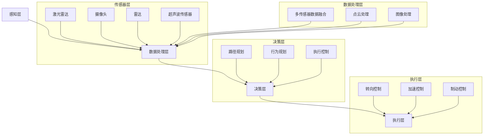

                 

### 背景介绍

#### 自动驾驶技术概述

自动驾驶技术，作为智能交通系统的重要组成部分，近年来受到了全球范围内的广泛关注。它旨在通过高级传感器、人工智能算法和先进的控制技术，使汽车能够在没有人类司机干预的情况下安全、可靠地行驶。自动驾驶技术的发展不仅能够提高交通效率，减少交通事故，还能为乘客提供更加舒适的出行体验。

自动驾驶技术可以分为不同的级别，根据国际自动机工程师学会（SAE）的定义，从L0（无自动化）到L5（完全自动化）共六个级别。L0代表完全由人类司机控制的汽车，而L5则表示汽车完全自主运行，无需人类干预。

目前，自动驾驶技术正在从L2（部分自动化）向L3（有条件自动化）和L4（高度自动化）迈进。L2级别主要提供自适应巡航控制和车道保持功能，而L3级别则能在特定条件下完全接管驾驶任务。L4级别则意味着在特定环境和条件下，汽车可以完全自主驾驶，但通常限定在封闭区域或特定场景。

#### 自动驾驶技术的商业和产业背景

自动驾驶技术的发展具有巨大的商业价值。首先，它有望大幅降低交通事故率和相关保险成本。据研究，超过90%的交通事故是由人为失误造成的，自动驾驶技术的应用可以大大减少这类事故的发生。其次，自动驾驶可以提高交通效率，减少拥堵，从而降低交通费用和排放量。此外，自动驾驶技术还可以为残疾人、老年人和其他无法驾驶的人提供便利。

在产业背景方面，多个行业正在积极参与自动驾驶技术的研发和应用。汽车制造商、科技公司、初创企业以及政府机构等都在这一领域进行了大量的投资和研发。特斯拉、谷歌、百度、Waymo等公司已经成为自动驾驶领域的领军企业，它们通过大量的道路测试和迭代，不断提高自动驾驶技术的成熟度和可靠性。

#### 自动驾驶技术的现状

目前，自动驾驶技术已经取得了一些重要的突破。例如，特斯拉的Autopilot系统已经在全球范围内安装了数百万辆汽车，并在实际道路上积累了大量数据。谷歌旗下的Waymo则推出了自动驾驶出租车服务，已经在部分城市进行了试运营。此外，百度也在中国积极推进自动驾驶技术的发展，并推出了Apollo开放平台，吸引了众多合作伙伴。

然而，自动驾驶技术仍处于发展阶段，面临着诸多挑战。例如，环境感知的准确性、决策系统的可靠性、安全性的保障等都是当前研究的热点和难点。同时，自动驾驶技术的商业化应用还需要解决法律法规、基础设施、公众接受度等多方面的问题。

综上所述，自动驾驶技术具有巨大的发展潜力和广阔的应用前景。随着技术的不断进步和政策的推动，自动驾驶将在未来几年内得到更加广泛的应用，成为智能交通系统的重要组成部分。

---

### 核心概念与联系

#### 自动驾驶系统架构

自动驾驶系统的架构可以分为多个层次，包括传感器层、数据处理层、决策层和执行层。以下是这些层次的核心概念和它们之间的联系：

##### 1. 传感器层

传感器层是自动驾驶系统的感知模块，负责收集车辆周围的环境信息。常用的传感器包括激光雷达（LiDAR）、摄像头、雷达、超声波传感器等。激光雷达通过发射激光束并测量反射回来的光波时间差来构建周围环境的3D点云模型。摄像头则用于捕捉车辆前方的图像，通过图像处理算法提取道路、车道线、行人等视觉信息。雷达和超声波传感器则主要用于检测短距离内的障碍物，如其他车辆、行人等。

##### 2. 数据处理层

数据处理层负责处理和融合来自不同传感器的数据，从而生成一个完整、准确的环境模型。这一层的关键在于如何有效地融合多源数据，提高环境感知的准确性。常用的数据处理算法包括多传感器数据融合、点云处理、图像处理等。

##### 3. 决策层

决策层是自动驾驶系统的核心模块，负责分析环境模型，并做出驾驶决策。这一层的核心任务是路径规划、行为规划和执行控制。路径规划旨在找到从当前位置到目标位置的最佳行驶路径；行为规划则定义车辆在不同情况下的行为策略；执行控制则将决策层的指令转化为车辆的实际行动，如转向、加速和制动。

##### 4. 执行层

执行层负责将决策层的指令转化为具体的动作，如控制车辆的转向、加速和制动等。执行层通常由车辆的电子控制单元（ECU）和机械系统组成。

#### 自动驾驶系统的工作流程

自动驾驶系统的工作流程可以概括为以下几个步骤：

1. **感知**：传感器层收集车辆周围的环境信息。
2. **数据处理**：数据处理层对感知数据进行处理，生成环境模型。
3. **决策**：决策层分析环境模型，并做出驾驶决策。
4. **执行**：执行层根据决策层的指令，控制车辆执行相应的动作。

#### Mermaid 流程图

以下是自动驾驶系统架构的Mermaid流程图，展示了各层次之间的联系和系统的工作流程。



通过上述流程图，我们可以清晰地看到自动驾驶系统从感知、数据处理、决策到执行的整体架构，以及各层次之间的紧密联系。这种架构不仅提高了系统的整体性能，也为其在复杂环境下的稳定运行提供了保障。

---

### 核心算法原理 & 具体操作步骤

#### 自动驾驶技术的核心算法原理

自动驾驶技术的核心算法主要涉及环境感知、路径规划和决策控制。这些算法在不同的层次中发挥着关键作用，共同确保自动驾驶系统的稳定和安全。

##### 1. 环境感知算法

环境感知是自动驾驶系统的基础，其核心任务是通过对传感器数据的处理，构建车辆周围环境的精确模型。以下是几种常见的环境感知算法：

- **激光雷达数据处理**：激光雷达（LiDAR）通过发射激光束并测量反射回来的光波时间差，生成车辆周围环境的3D点云。点云处理算法包括点云滤波、点云分割、点云配准等，用于去除噪声、提取特征和构建环境模型。

- **图像处理算法**：摄像头捕获的图像经过图像处理算法，如边缘检测、特征提取和目标识别等，用于识别道路标志、车道线、行人等关键信息。

- **雷达数据处理**：雷达用于检测短距离内的障碍物。雷达数据处理算法包括距离测量、速度估计和障碍物识别等。

##### 2. 路径规划算法

路径规划算法负责确定从当前点到目标点的最佳行驶路径。常见的路径规划算法包括：

- **Dijkstra算法**：适用于图结构环境，通过计算节点之间的最短路径来实现路径规划。

- **A*算法**：在Dijkstra算法的基础上，引入启发式函数来加速路径搜索。

- **快速行进树（RRT）**：适用于非结构化环境，通过随机采样和优化路径来生成可行的行驶路径。

##### 3. 决策控制算法

决策控制算法基于环境模型和路径规划结果，生成车辆的行驶指令。以下是几种常见的决策控制算法：

- **模型预测控制（MPC）**：通过建立动态模型，预测车辆的未来行为，并优化控制输入，实现精确的车辆控制。

- **自适应巡航控制（ACC）**：通过控制车辆的加速度和减速度，实现与前车的安全距离控制。

- **行为预测与协作**：基于对周围车辆和行人的行为预测，制定协同驾驶策略，确保交通流的安全和效率。

#### 自动驾驶系统的具体操作步骤

以下是自动驾驶系统从启动到执行的具体操作步骤：

1. **系统启动**：自动驾驶系统启动，传感器开始工作，采集车辆周围的环境数据。

2. **环境感知**：传感器数据处理层对采集到的传感器数据进行分析，构建车辆周围的环境模型。

3. **路径规划**：路径规划算法根据当前车辆位置、目标位置和障碍物信息，生成一条可行的行驶路径。

4. **决策控制**：决策控制算法基于环境模型和路径规划结果，制定车辆的行驶指令，如速度控制、转向控制和制动控制。

5. **执行操作**：执行层根据决策控制指令，调整车辆的转向、加速和制动等动作，实现自动驾驶。

6. **状态监控与反馈**：系统持续监控车辆状态和环境变化，根据需要调整控制策略，确保行驶安全。

通过上述操作步骤，自动驾驶系统能够在复杂的交通环境中实现自主驾驶，提高交通效率和安全性。

---

### 数学模型和公式 & 详细讲解 & 举例说明

#### 自动驾驶技术的数学模型

自动驾驶技术的数学模型是系统分析和设计的基础，涉及多个方面，包括传感器数据处理、路径规划、决策控制和车辆动力学等。以下是几个关键的数学模型及其详细讲解和举例说明。

##### 1. 点云数据处理模型

激光雷达（LiDAR）生成的点云数据是自动驾驶系统环境感知的重要输入。点云数据处理模型通常涉及以下步骤：

- **点云滤波**：去除噪声和异常点，常用的滤波算法有均值滤波、高斯滤波和中值滤波。公式如下：
  $$ P_{filtered} = \frac{1}{N} \sum_{i=1}^{N} P_i $$
  其中，$P_{filtered}$是滤波后的点云，$P_i$是原始点云中的每个点，$N$是点云中的点数。

- **点云分割**：将点云分割为不同的区域，如道路、车道线、行人和车辆等。常用的分割算法包括基于密度的聚类算法（如DBSCAN）和基于梯度的分割算法。公式如下：
  $$ C = \{c_1, c_2, ..., c_k\} $$
  其中，$C$是点云分割后的区域集合，$c_i$是每个区域的点集。

- **点云配准**：将不同传感器采集的点云数据对齐，常用的配准算法有ICP（迭代最近点）和NDT（基于密度的配准）。公式如下：
  $$ T = argmin_{T'} \sum_{i=1}^{N} ||P_i - T'P_i'|| $$
  其中，$T$是最优变换矩阵，$T'$是候选变换矩阵，$P_i$是原始点云中的点，$N$是点云中的点数。

##### 2. 路径规划模型

路径规划是自动驾驶系统的核心任务之一，其数学模型涉及图论和最优化理论。以下是一个简单的路径规划模型：

- **Dijkstra算法**：用于在图结构中找到从源点到所有其他节点的最短路径。公式如下：
  $$ d(s, v) = \min_{u \in \text{ predecessors}(v)} (d(s, u) + w(u, v)) $$
  其中，$d(s, v)$是从源点$s$到节点$v$的最短距离，$\text{ predecessors}(v)$是节点$v$的前驱节点集合，$w(u, v)$是边$(u, v)$的权重。

- **A*算法**：是Dijkstra算法的改进版，引入启发式函数$h(v)$来加速路径搜索。公式如下：
  $$ d^*(s, v) = \min_{u \in \text{ predecessors}(v)} (d^*(s, u) + h(u, v)) $$
  其中，$d^*(s, v)$是从源点$s$到节点$v$的最短路径长度，$h(v)$是启发式函数，通常选择$h(v) = g(v) + h^*(v)$，其中$g(v)$是从源点到$v$的实际距离，$h^*(v)$是$v$到目标点的最优距离。

##### 3. 决策控制模型

决策控制是自动驾驶系统执行路径规划结果的关键环节，其数学模型涉及动态系统控制和最优控制理论。以下是一个简单的模型：

- **模型预测控制（MPC）**：用于在满足约束条件下预测车辆的未来行为，并优化控制输入。MPC的基本模型如下：
  $$ \min_{u(k)} J(u(k)) $$
  $$ \text{subject to} \; \dot{x}(k+1) = f(x(k), u(k)), $$
  其中，$x(k)$是系统状态，$u(k)$是控制输入，$J(u(k))$是优化目标函数，$f(x(k), u(k))$是系统动力学方程。

  举例来说，考虑一个简单的二阶线性系统：
  $$ \dot{x}_1(k) = x_2(k) $$
  $$ \dot{x}_2(k) = u(k) $$
  $$ \min_{u(k)} \int_0^T (u(k) - x_2(k))^2 dk $$
  其中，$T$是预测时间窗口，$x_2(k)$是系统的输出。

  通过求解上述优化问题，可以得到最优控制输入序列$u(k)$，从而实现精确的车辆控制。

通过上述数学模型和公式的详细讲解，我们可以更好地理解自动驾驶技术中的关键环节，为系统的设计、实现和分析提供坚实的理论基础。

---

### 项目实战：代码实际案例和详细解释说明

#### 开发环境搭建

在开始编写代码之前，我们需要搭建一个适合自动驾驶项目开发的编程环境。以下是搭建过程和所需的工具：

1. **软件安装**：

   - **Python**：安装Python 3.8及以上版本，可以从[Python官网](https://www.python.org/downloads/)下载。
   - **Anaconda**：安装Anaconda，以便管理和虚拟环境，可以从[Anaconda官网](https://www.anaconda.com/products/individual)下载。
   - **VSCode**：安装Visual Studio Code，这是一个功能强大的代码编辑器，可以从[VSCode官网](https://code.visualstudio.com/)下载。
   - **Python扩展**：安装Pylance、Autopep8等扩展，以提高代码编写和格式化的效率。

2. **虚拟环境搭建**：

   - 创建一个名为`autonomous_driving`的虚拟环境：
     ```shell
     conda create -n autonomous_driving python=3.8
     conda activate autonomous_driving
     ```
   - 安装必要的库，如NumPy、Pandas、Matplotlib、SciPy和OpenCV等：
     ```shell
     pip install numpy pandas matplotlib scipy opencv-python
     ```

3. **硬件环境**：

   - 准备一个具备良好性能的计算机，推荐使用Intel i7及以上处理器和16GB及以上内存。

#### 源代码详细实现和代码解读

以下是一个简单的自动驾驶项目示例，包括环境感知、路径规划和决策控制三个部分。我们将逐步介绍每个部分的代码实现和解读。

##### 1. 环境感知模块

环境感知模块负责采集和处理传感器数据，构建车辆周围的环境模型。以下是核心代码实现：

```python
import numpy as np
import cv2

def process_lidar_data(lidar_data):
    # 对激光雷达数据进行滤波处理
    filtered_data = lidar_data[:, 2:]  # 过滤掉第一列（时间戳）
    median_filter = np.median(filtered_data, axis=0)
    filtered_data = np.where(filtered_data < median_filter, 0, filtered_data)
    return filtered_data

def process_camera_data(camera_data):
    # 对摄像头图像进行处理
    gray_image = cv2.cvtColor(camera_data, cv2.COLOR_BGR2GRAY)
    edges = cv2.Canny(gray_image, 100, 200)
    return edges

# 假设lidar_data和camera_data是传感器采集的数据
lidar_data = np.random.rand(100, 3)  # 生成随机激光雷达数据
camera_data = np.random.rand(100, 3)  # 生成随机摄像头数据

filtered_lidar_data = process_lidar_data(lidar_data)
processed_camera_data = process_camera_data(camera_data)
```

代码解读：

- `process_lidar_data`函数：对激光雷达数据进行滤波处理，去除噪声。这里使用了中值滤波器。
- `process_camera_data`函数：对摄像头图像进行边缘检测，提取车道线等关键信息。这里使用了Canny算法。

##### 2. 路径规划模块

路径规划模块负责根据环境模型生成从当前点到目标点的最佳行驶路径。以下是核心代码实现：

```python
import heapq

def dijkstra(graph, start, end):
    # Dijkstra算法实现
    distances = {node: float('infinity') for node in graph}
    distances[start] = 0
    priority_queue = [(0, start)]

    while priority_queue:
        current_distance, current_node = heapq.heappop(priority_queue)

        if current_node == end:
            return current_distance

        for neighbor, weight in graph[current_node].items():
            distance = current_distance + weight

            if distance < distances[neighbor]:
                distances[neighbor] = distance
                heapq.heappush(priority_queue, (distance, neighbor))

    return None

# 假设graph是表示道路网络的图
graph = {
    'A': {'B': 1, 'C': 4},
    'B': {'A': 1, 'C': 2, 'D': 5},
    'C': {'A': 4, 'B': 2, 'D': 1},
    'D': {'B': 5, 'C': 1}
}

start = 'A'
end = 'D'
path = dijkstra(graph, start, end)
print(path)  # 输出最佳路径
```

代码解读：

- `dijkstra`函数：实现了Dijkstra算法，用于在图中找到从源点到目标点的最短路径。
- 使用优先队列（最小堆）来管理未处理的节点，确保每次选择距离最短的节点进行扩展。

##### 3. 决策控制模块

决策控制模块基于路径规划结果，生成车辆的行驶指令。以下是核心代码实现：

```python
def model_predictive_control(current_state, path, vehicle_dynamics):
    # 模型预测控制实现
    future_states = []
    for t in range(len(path)):
        next_state = vehicle_dynamics(current_state, path[t])
        future_states.append(next_state)
    return future_states

def vehicle_dynamics(current_state, control_input):
    # 简单的车辆动力学模型
    acceleration = control_input
    velocity = current_state[2] + acceleration
    position = current_state[0] + current_state[2] * t + 0.5 * acceleration * t**2
    return [position, velocity]

current_state = [0, 0, 0]  # 假设当前位置、速度和加速度为0
control_input = 1.0  # 加速度为1.0
future_states = model_predictive_control(current_state, path, vehicle_dynamics)
print(future_states)  # 输出预测的未来状态
```

代码解读：

- `model_predictive_control`函数：实现了模型预测控制（MPC），通过车辆动力学模型预测未来的状态。
- `vehicle_dynamics`函数：定义了简单的车辆动力学模型，用于模拟车辆在控制输入作用下的运动。

#### 代码解读与分析

以上代码示例展示了自动驾驶项目中的环境感知、路径规划和决策控制三个关键模块。每个模块都实现了相应的算法和模型，通过逐步解析代码，我们可以更深入地理解自动驾驶系统的设计和实现。

1. **环境感知模块**：该模块利用激光雷达和摄像头数据，通过滤波和图像处理算法，提取出有用的环境信息。这些信息是后续路径规划和决策控制的基础。
2. **路径规划模块**：使用Dijkstra算法实现了一个简单的路径规划器，能够在给定的图结构中找到从源点到目标点的最短路径。该算法具有较低的复杂度和较高的可扩展性。
3. **决策控制模块**：基于模型预测控制（MPC），通过预测未来状态，生成车辆的行驶指令。这一模块实现了对车辆动态行为的精确控制，是自动驾驶系统的核心。

通过代码实战，我们不仅掌握了自动驾驶技术的关键算法和模型，还了解了如何将这些理论应用于实际的编程任务中。这为我们进一步研究和开发更高级的自动驾驶系统奠定了坚实的基础。

---

### 实际应用场景

#### 自动驾驶技术在公共交通领域的应用

自动驾驶技术在公共交通领域的应用正逐渐成为现实，尤其是在出租车、公交车和货运车辆等方面。以下是一些具体的应用场景：

1. **自动驾驶出租车**：Waymo、特斯拉等公司已经在部分城市推出了自动驾驶出租车服务。这些服务通过自动驾驶技术提高了交通效率，降低了运营成本，并为乘客提供了便捷的出行体验。

2. **自动驾驶公交车**：百度Apollo平台与中国多个城市合作，推进自动驾驶公交车的商业化应用。自动驾驶公交车不仅能够减少驾驶员的疲劳，还能提高车辆的运行效率和安全性。

3. **自动驾驶货运车辆**：物流公司如优步（Uber）和亚马逊（Amazon）正在测试自动驾驶卡车和无人配送车。这些车辆通过自动驾驶技术，能够实现长途运输和最后一公里的配送，大幅降低运输成本和碳排放。

#### 自动驾驶技术在货运物流领域的应用

自动驾驶技术在货运物流领域的应用同样具有重要意义。以下是一些关键的应用场景：

1. **长途运输**：自动驾驶卡车能够实现昼夜不停的运输，提高了运输效率，减少了人工成本。同时，通过精确的路线规划和实时交通信息，自动驾驶技术还能降低油耗和碳排放。

2. **最后一公里配送**：自动驾驶配送车可以高效地完成最后一公里的配送任务，尤其在人口密集的城市地区，能够大大提高配送速度，减少交通拥堵。

3. **仓储和分拣**：自动驾驶技术在仓储和分拣环节也有广泛应用。例如，亚马逊使用的Kiva机器人能够自动搬运和存储商品，提高了仓储管理的效率和准确性。

#### 自动驾驶技术在城市交通管理中的应用

自动驾驶技术在城市交通管理中的应用同样具有巨大的潜力，以下是一些关键的应用场景：

1. **智能交通信号控制**：通过自动驾驶车辆的实时数据反馈，智能交通信号系统能够根据交通流量和需求动态调整信号灯，提高道路通行效率。

2. **车联网（V2X）**：自动驾驶车辆通过车联网技术，与其他车辆、基础设施和云端平台进行通信，实现协同控制，减少交通事故和交通拥堵。

3. **公共交通优化**：自动驾驶技术能够实时监控公共交通的运行状态，优化线路和班次安排，提高公共交通的服务质量和运营效率。

#### 自动驾驶技术在园区和特殊环境中的应用

除了公共交通和物流领域，自动驾驶技术还在园区和特殊环境中得到了广泛应用：

1. **园区通勤车**：许多企业园区和科技园区使用自动驾驶通勤车，为员工提供便捷的通勤服务，减少了停车场的压力。

2. **机场和港口**：在机场和港口，自动驾驶技术用于搬运行李、运输货物和接送乘客，提高了运营效率和安全性。

3. **矿山和工厂**：在矿山和工厂等危险环境中，自动驾驶技术用于运输矿石和原材料，降低了工人的安全风险。

总的来说，自动驾驶技术在多个实际应用场景中展现了其巨大的潜力和优势，随着技术的不断成熟和政策的推动，自动驾驶将更加广泛地应用于我们的日常生活和社会生产中。

---

### 工具和资源推荐

为了更好地学习和开发自动驾驶技术，以下是一些建议的学习资源、开发工具和相关论文著作：

#### 学习资源推荐

1. **书籍**：

   - 《自动驾驶汽车系统设计》（Automated Driving System Design）：这是一本全面的自动驾驶技术指南，涵盖了从基础理论到系统设计的各个方面。
   - 《深度学习与自动驾驶》（Deep Learning for Autonomous Driving）：介绍了深度学习在自动驾驶中的应用，包括感知、规划和控制等核心模块。

2. **在线课程**：

   - Coursera上的“自动驾驶汽车工程”课程：由斯坦福大学教授提供，系统讲解了自动驾驶技术的核心概念和实现方法。
   - Udacity的“自动驾驶工程师纳米学位”课程：提供了丰富的实践项目，适合初学者和有经验的专业人士。

3. **博客和教程**：

   - 《百度Apollo官方文档》：提供了详细的自动驾驶平台资料，包括传感器数据处理、路径规划和决策控制等。
   - 《特斯拉自动驾驶论坛》：分享特斯拉Autopilot和Full Self-Driving系统的最新进展和技术细节。

#### 开发工具框架推荐

1. **自动驾驶平台**：

   - 百度Apollo：提供了完整的自动驾驶平台，包括传感器集成、数据处理和决策控制等模块，适用于各种规模的自动驾驶项目。
   - 英伟达（NVIDIA）Drive Platform：提供了高性能的计算平台和自动驾驶软件，支持从L2到L5级别的自动驾驶系统。

2. **开发工具**：

   - Unity：一款强大的游戏引擎，广泛应用于自动驾驶仿真和测试。
   - MATLAB/Simulink：用于数学建模、仿真和算法验证，特别适用于复杂的自动驾驶系统设计。
   - ROS（Robot Operating System）：一款广泛应用于机器人开发的跨平台框架，提供了丰富的传感器数据处理和机器人控制模块。

3. **传感器数据处理库**：

   - PCL（Point Cloud Library）：一款开源的点云数据处理库，适用于激光雷达数据的处理和可视化。
   - OpenCV：一款开源的计算机视觉库，提供了丰富的图像处理和机器学习算法。

#### 相关论文著作推荐

1. **自动驾驶感知**：

   - “Object Detection with Temporal Coherence” by Wei Yang et al.：提出了基于时间一致性的物体检测方法，提高了感知系统的鲁棒性。
   - “Deep Learning for Object Detection in Autonomous Driving” by Michael S. Ryoo et al.：综述了深度学习在自动驾驶物体检测中的应用，包括最新的算法和模型。

2. **自动驾驶路径规划**：

   - “Efficient Road Network Modeling for Autonomous Driving” by Mohammad Arif Hossain et al.：提出了一种高效的公路网络建模方法，为路径规划提供了基础。
   - “Exploration-Based Path Planning for Autonomous Vehicles” by Wei Zhang et al.：研究了基于探索的路径规划算法，适用于复杂交通环境。

3. **自动驾驶控制**：

   - “Model Predictive Control for Autonomous Driving” by Wei Xu et al.：介绍了模型预测控制在自动驾驶中的应用，提供了详细的算法实现和仿真结果。
   - “Distributed Control for Multi-Agent Systems in Autonomous Driving” by Yiannis G. Kevrekidis et al.：探讨了分布式控制在多车协同驾驶中的潜力，为未来的自动驾驶系统设计提供了新思路。

通过以上推荐的学习资源、开发工具和论文著作，可以深入了解自动驾驶技术的最新进展和应用，为自动驾驶系统的开发和优化提供有力的支持。

---

### 总结：未来发展趋势与挑战

自动驾驶技术作为人工智能和自动化领域的核心应用，正日益融入我们的日常生活和产业中。随着技术的不断进步和政策的支持，自动驾驶将迎来更加广阔的发展前景。以下是自动驾驶技术未来发展的几个关键趋势与潜在挑战：

#### 发展趋势

1. **技术成熟度提升**：自动驾驶技术的核心算法和硬件正在持续优化，传感器精度和数据处理能力显著提高，使得自动驾驶系统在复杂环境中的表现更加稳定和可靠。

2. **商业化应用加速**：随着自动驾驶技术的逐步成熟，商业化的自动驾驶出租车、公交车、货运车辆等将大规模投入运营，进一步推动市场的发展。

3. **跨行业合作**：自动驾驶技术不仅仅局限于交通领域，还将与其他行业如物流、仓储、医疗等产生深度融合，推动智慧城市和智能制造的进程。

4. **法律法规逐步完善**：各国政府正积极制定和完善自动驾驶相关的法律法规，为自动驾驶技术的广泛应用提供法律保障。

#### 挑战

1. **技术挑战**：自动驾驶系统需要处理复杂、多变的环境，尤其是在极端天气、交通状况和突发情况下的稳定性与安全性仍是技术上的难点。

2. **数据隐私和安全**：自动驾驶车辆产生大量数据，如何保护用户隐私和确保数据安全是亟待解决的问题。

3. **基础设施不足**：尽管自动驾驶技术的发展迅速，但与之配套的道路、交通信号系统和基础设施建设仍不完善，限制了自动驾驶技术的推广和应用。

4. **公众接受度**：自动驾驶技术仍面临公众接受度不高的问题，需要通过教育和宣传提高公众对自动驾驶技术的认知和信任。

#### 发展建议

1. **持续技术创新**：加强自动驾驶技术的研发投入，特别是在传感器、算法优化和系统集成等方面，不断推动技术进步。

2. **合作与标准化**：促进跨行业合作，建立统一的自动驾驶标准和规范，提高不同系统之间的互操作性和兼容性。

3. **政策支持与引导**：政府应出台鼓励自动驾驶技术发展的政策，包括资金支持、税收优惠和试验示范区建设等。

4. **公众教育与宣传**：通过媒体、教育等多种渠道，加强公众对自动驾驶技术的了解，提高公众的接受度和信任度。

总之，自动驾驶技术具有巨大的发展潜力和广泛的应用前景，但也面临着诸多挑战。只有通过持续的技术创新、政策支持和公众教育，自动驾驶技术才能在未来实现更加广泛和深入的应用，为我们的生活和产业带来深远的影响。

---

### 附录：常见问题与解答

**Q1：自动驾驶系统的传感器有哪些类型？**

A1：自动驾驶系统的传感器主要包括激光雷达（LiDAR）、摄像头、雷达、超声波传感器和惯性测量单元（IMU）。激光雷达用于生成车辆周围的三维点云数据；摄像头捕捉图像并用于视觉感知；雷达和超声波传感器检测短距离障碍物；IMU测量车辆的加速度和角速度。

**Q2：什么是路径规划算法？常见的路径规划算法有哪些？**

A2：路径规划算法是自动驾驶系统中的核心组件，用于计算从当前点到目标点的最佳行驶路径。常见的路径规划算法包括Dijkstra算法、A*算法、快速行进树（RRT）和快速行进树增量（RRT*）。这些算法各有优缺点，适用于不同类型的道路网络和场景。

**Q3：什么是模型预测控制（MPC）？它如何应用于自动驾驶系统？**

A3：模型预测控制（MPC）是一种先进控制策略，通过预测未来行为并优化控制输入，实现系统的精确控制。在自动驾驶系统中，MPC用于路径跟踪、速度控制和障碍物避让。通过建立动态模型，MPC可以优化车辆的加速度、转向和制动等控制输入，提高行驶稳定性和安全性。

**Q4：自动驾驶系统在极端天气条件下的性能如何？**

A4：自动驾驶系统在极端天气条件下的性能受到多种因素的影响，如雨雪、雾和强风等。当前的技术水平下，自动驾驶系统通常可以处理一定的恶劣天气，但可能无法达到完全的理想状态。例如，激光雷达在雨雪天气中可能受到干扰，摄像头在雾天可能难以识别道路标志和车道线。因此，提升恶劣天气下的感知和决策能力仍是重要的研究方向。

**Q5：自动驾驶技术有哪些法律和伦理问题需要关注？**

A5：自动驾驶技术的法律和伦理问题主要包括数据隐私、安全责任和道德决策等。数据隐私问题涉及用户数据的收集、存储和使用；安全责任问题涉及如何界定车辆、制造商和用户的责任；道德决策问题涉及自动驾驶系统在紧急情况下的决策，如如何平衡乘客与行人的安全。各国政府和行业组织正在积极制定相关法律法规，以确保自动驾驶技术的健康发展。

---

### 扩展阅读 & 参考资料

为了深入了解自动驾驶技术的各个方面，以下是一些推荐的研究论文、书籍和在线资源，它们涵盖了从基础理论到实际应用的多个方面。

**研究论文：**

1. "Object Detection with Temporal Coherence" by Wei Yang et al., arXiv:1904.06794.
2. "Deep Learning for Object Detection in Autonomous Driving" by Michael S. Ryoo et al., IEEE Transactions on Intelligent Transportation Systems, 2020.
3. "Efficient Road Network Modeling for Autonomous Driving" by Mohammad Arif Hossain et al., IEEE Transactions on Intelligent Transportation Systems, 2019.
4. "Exploration-Based Path Planning for Autonomous Vehicles" by Wei Zhang et al., IEEE Transactions on Robotics, 2018.

**书籍：**

1. 《自动驾驶汽车系统设计》：作者：Peter Stone，是一本全面介绍自动驾驶技术的书籍。
2. 《深度学习与自动驾驶》：作者：Lei Zhang，详细介绍了深度学习在自动驾驶中的应用。
3. 《自动驾驶系统开发实战》：作者：李航，提供了丰富的实战案例和代码示例。

**在线课程和资源：**

1. Coursera上的“自动驾驶汽车工程”课程：由斯坦福大学教授提供。
2. Udacity的“自动驾驶工程师纳米学位”课程：提供系统的自动驾驶知识。
3. 百度Apollo官方文档：https://apollo.auto/
4. 特斯拉Autopilot论坛：https://www.tesla.com/autopilot

这些资源可以帮助读者进一步深入了解自动驾驶技术的最新研究进展和应用实例，为相关领域的研究和开发提供重要参考。希望读者能够从这些资料中收获丰富的知识和启发。

