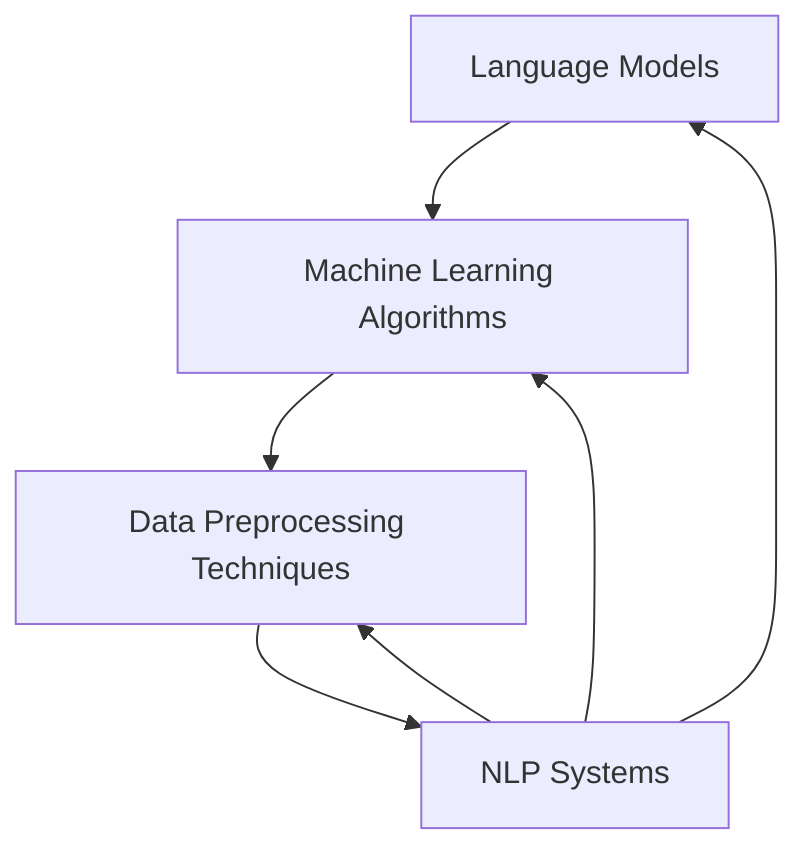

                 

### 背景介绍

自然语言处理（Natural Language Processing，NLP）是计算机科学与人工智能领域的一个重要分支，它旨在使计算机能够理解、生成和处理人类自然语言。随着深度学习技术的飞速发展，NLP在语言翻译、语音识别、情感分析、文本生成等多个领域取得了显著进展。然而，尽管技术取得了巨大成功，NLP系统的可解释性、公平性和伦理问题却日益凸显。

#### NLP 可解释性挑战

首先，NLP模型的可解释性问题日益成为研究的热点。传统的NLP模型，如基于规则的方法和统计模型，通常具有较高的可解释性，因为它们的决策过程相对直观。然而，随着深度学习在NLP领域的广泛应用，如卷积神经网络（CNN）和递归神经网络（RNN）等复杂模型被引入，模型的决策过程变得更加复杂，难以理解。这使得在实际应用中，如何解释模型的决定成为了一个难题。

#### NLP 公平性挑战

其次，NLP系统的公平性问题也不容忽视。公平性指的是模型在处理不同群体时是否具有一致性。例如，某些基于语料库的NLP模型可能会受到数据偏置的影响，从而在处理特定性别、种族或年龄群体时产生不公平的结果。这种偏见可能会在招聘、金融、医疗等关键领域引发严重的社会问题。

#### NLP 伦理安全问题

最后，NLP系统的伦理安全问题也引起了广泛关注。例如，NLP模型可能会被用于监控、歧视或操纵用户行为，这可能违反用户隐私和自由。此外，模型可能会放大社会偏见和歧视，加剧社会不公。

综上所述，NLP中的可解释性、公平性和伦理问题已经成为当前研究的重要课题。本文将深入探讨这些问题的研究热点，旨在为相关领域的研究者和开发者提供有价值的参考。

---

### Core Concepts and Connections

In the field of Natural Language Processing (NLP), several core concepts play a crucial role in the development and application of NLP systems. These concepts include language models, machine learning algorithms, and data preprocessing techniques. Understanding the connections between these concepts is essential for designing and implementing effective NLP solutions.

#### Language Models

Language models are at the heart of NLP. They are statistical models that learn the probabilities of different sequences of words or characters. These models are trained on large corpora of text and are capable of generating coherent and contextually appropriate text. One of the most popular language models is the Transformer architecture, which has been used in state-of-the-art models like GPT-3 and BERT.

#### Machine Learning Algorithms

Machine learning algorithms are the core components of NLP systems. They enable computers to learn from data and make predictions or decisions. Common machine learning algorithms used in NLP include linear regression, support vector machines (SVM), and neural networks. Recently, deep learning algorithms, such as convolutional neural networks (CNN) and recurrent neural networks (RNN), have become increasingly popular in NLP due to their ability to handle complex patterns and relationships in text data.

#### Data Preprocessing Techniques

Data preprocessing is a critical step in NLP. It involves cleaning and transforming raw text data into a format that can be used by machine learning algorithms. Common preprocessing techniques include tokenization (splitting text into words or tokens), stopword removal (removing common words like "and" and "the"), and stemming (reducing words to their root form). Preprocessing techniques play a crucial role in improving the performance of NLP systems by reducing noise and enhancing the relevance of the input data.

#### Connections

The connections between these core concepts can be visualized using a Mermaid flowchart. Here's an example:



In this flowchart, we can see that language models, machine learning algorithms, and data preprocessing techniques are interconnected components that contribute to the development of NLP systems. Language models provide the foundational knowledge for processing and generating text, while machine learning algorithms enable the systems to learn from data. Data preprocessing techniques help prepare the input data for effective processing by the algorithms. Together, these components form the backbone of modern NLP systems.

---

### Core Algorithm Principles and Operation Steps

The core algorithms in NLP are primarily based on machine learning and deep learning techniques. This section will delve into the principles of these algorithms and provide step-by-step operational guidance.

#### Machine Learning Algorithms

Machine learning algorithms are categorized into supervised learning, unsupervised learning, and reinforcement learning. In NLP, supervised learning is the most commonly used approach due to its ability to train models on labeled data.

**Supervised Learning Step-by-Step:**

1. **Data Collection:** Gather a large dataset of labeled examples. In NLP, these examples could be sentences labeled with their corresponding parts of speech, named entities, or sentiment.

2. **Feature Extraction:** Preprocess the text data using techniques like tokenization, stopword removal, and stemming. Extract features from the preprocessed text, such as word frequencies, n-grams, or word embeddings.

3. **Model Training:** Choose a suitable machine learning algorithm, such as logistic regression, support vector machines (SVM), or neural networks. Train the model using the extracted features and labeled data.

4. **Model Evaluation:** Evaluate the model's performance using metrics like accuracy, precision, recall, and F1-score. Adjust the model parameters to improve performance.

5. **Deployment:** Once the model performs satisfactorily, deploy it in an NLP application, such as text classification, named entity recognition, or sentiment analysis.

#### Deep Learning Algorithms

Deep learning algorithms, particularly neural networks, have revolutionized NLP by enabling models to learn complex patterns and relationships in text data.

**Neural Network Training Step-by-Step:**

1. **Input Layer:** The input layer receives the preprocessed text data, which is typically represented as word embeddings.

2. **Hidden Layers:** The text data is processed through one or more hidden layers. Each layer consists of multiple neurons that perform weighted sum of inputs and apply an activation function.

3. **Output Layer:** The output layer generates the final prediction based on the activated hidden layer outputs. The choice of activation function and the number of neurons in each layer can significantly impact the model's performance.

4. **Backpropagation:** During training, the model's predictions are compared to the ground truth labels. The difference between the predictions and labels is used to update the model's weights through backpropagation.

5. **Optimization:** Choose an optimization algorithm, such as stochastic gradient descent (SGD), Adam, or RMSprop, to minimize the model's loss function. The optimization algorithm updates the model's weights iteratively to improve performance.

6. **Evaluation and Deployment:** Evaluate the model using a validation set and adjust the hyperparameters if necessary. Once the model performs well, deploy it in a production environment.

#### Example: Text Classification with LSTM

Let's consider a simple text classification problem using Long Short-Term Memory (LSTM) networks, a type of RNN that is particularly effective for handling sequential data.

1. **Data Preparation:** Collect a dataset of text documents labeled with their categories. Preprocess the text by tokenizing, removing stopwords, and padding sequences to a fixed length.

2. **Word Embeddings:** Convert words in the text to dense vectors using a pre-trained word embedding model like Word2Vec or GloVe.

3. **Model Architecture:** Design an LSTM model with an input layer, one or more hidden LSTM layers, and an output layer with a softmax activation function for multi-class classification.

4. **Training:** Train the LSTM model using the preprocessed text data and their corresponding labels. Use backpropagation and an optimization algorithm to update the model's weights.

5. **Evaluation:** Evaluate the model's performance using metrics like accuracy, precision, recall, and F1-score. Adjust the model architecture and hyperparameters if necessary.

6. **Deployment:** Deploy the trained model in a text classification application, such as sentiment analysis or topic classification.

By following these steps, you can develop and deploy NLP models that perform well on various tasks. Experimenting with different architectures, hyperparameters, and preprocessing techniques can further improve model performance.

---

### Mathematical Models and Detailed Explanations

In NLP, mathematical models and formulas are essential for understanding and optimizing the performance of machine learning algorithms. This section will provide a detailed explanation of key mathematical concepts and their applications in NLP.

#### Activation Function

One of the most critical components in neural networks is the activation function. It introduces non-linearities into the network, enabling it to model complex relationships in data.

**Sigmoid Function:**
$$
\sigma(x) = \frac{1}{1 + e^{-x}}
$$

The sigmoid function maps real-valued inputs to the range (0, 1), making it suitable for binary classification tasks. It has a S-shaped curve and converges to 0 or 1 as x approaches negative or positive infinity, respectively.

**ReLU Function:**
$$
\text{ReLU}(x) = \max(0, x)
$$

The Rectified Linear Unit (ReLU) function is commonly used in deep neural networks. It is simple and computationally efficient, activating only for positive inputs while preserving the gradient for negative inputs, which helps in training deep networks.

#### Loss Function

The loss function measures the difference between the predicted output and the true output. It is used to optimize the model by minimizing the loss during training.

**Mean Squared Error (MSE):**
$$
\text{MSE}(y, \hat{y}) = \frac{1}{n} \sum_{i=1}^{n} (y_i - \hat{y}_i)^2
$$

MSE is commonly used for regression tasks. It measures the average squared difference between the true and predicted values, and its gradient is easy to compute.

**Cross-Entropy Loss:**
$$
\text{CE}(y, \hat{y}) = -\sum_{i} y_i \log(\hat{y}_i)
$$

Cross-entropy loss is used for classification tasks. It measures the performance of a classification model whose output is a probability value between 0 and 1. The negative log-likelihood is minimized to improve the model's performance.

#### Gradient Descent

Gradient descent is an optimization algorithm used to minimize the loss function. It updates the model's weights iteratively based on the gradients of the loss function with respect to the weights.

**Stochastic Gradient Descent (SGD):**
$$
w_{t+1} = w_t - \alpha \nabla_w J(w_t)
$$

In SGD, the gradient is computed using a single randomly selected training example at each iteration. This can help escape local minima and find a global minimum more efficiently.

**Adam Optimization:**
$$
\begin{align*}
m_t &= \beta_1 m_{t-1} + (1 - \beta_1) \nabla_w J(w_t) \\
v_t &= \beta_2 v_{t-1} + (1 - \beta_2) (\nabla_w J(w_t))^2 \\
w_{t+1} &= w_t - \alpha \frac{m_t}{\sqrt{v_t} + \epsilon}
\end{align*}
$$

Adam combines the advantages of both SGD and momentum methods. It maintains running averages of first and second moments of the gradients, which helps in convergence.

#### Example: Text Classification with Cross-Entropy Loss and Adam Optimization

Consider a text classification problem with a multi-class output. We'll use a neural network with a softmax activation function and Adam optimization.

1. **Model Architecture:** Design a neural network with input layers, hidden layers, and an output layer with a softmax activation function.

2. **Training:** Train the model using preprocessed text data and their corresponding labels. Use the cross-entropy loss function to measure the performance.

3. **Optimization:** Use the Adam optimizer to update the model's weights. Adjust the learning rate, batch size, and other hyperparameters to improve convergence.

4. **Evaluation:** Evaluate the model's performance using metrics like accuracy, precision, recall, and F1-score. Adjust the model architecture and hyperparameters if necessary.

By understanding these mathematical models and formulas, you can effectively optimize NLP models for various tasks. Experimenting with different architectures, loss functions, and optimization algorithms can further enhance the performance of your models.

---

### Project Implementation: Code Examples and Detailed Explanations

To illustrate the practical application of NLP algorithms, let's consider a project to build a sentiment analysis tool using Python and TensorFlow. This section will provide a step-by-step guide to setting up the development environment, implementing the source code, and analyzing the code.

#### 1. Development Environment Setup

To start, ensure you have the following tools installed:

- Python (3.7 or higher)
- TensorFlow (2.x)
- Jupyter Notebook

You can install these packages using pip:

```bash
pip install python tensorflow jupyterlab
```

#### 2. Source Code Implementation

Here is a basic implementation of a sentiment analysis model using a pre-trained BERT model and TensorFlow:

```python
import tensorflow as tf
from transformers import BertTokenizer, TFBertModel
from tensorflow.keras.optimizers import Adam
from tensorflow.keras.losses import SparseCategoricalCrossentropy

# Load pre-trained BERT tokenizer and model
tokenizer = BertTokenizer.from_pretrained('bert-base-uncased')
model = TFBertModel.from_pretrained('bert-base-uncased')

# Preprocess the text data
def preprocess_text(text):
    input_ids = tokenizer.encode(text, add_special_tokens=True, return_tensors='tf')
    return input_ids

# Define the sentiment analysis model
input_ids = tf.keras.layers.Input(shape=(None,), dtype=tf.int32)
encoded_inputs = model(input_ids)[0]
output = tf.keras.layers.Dense(2, activation='softmax')(encoded_inputs)

model = tf.keras.Model(inputs=input_ids, outputs=output)

# Compile the model
model.compile(optimizer=Adam(learning_rate=3e-5), loss=SparseCategoricalCrossentropy(from_logits=True), metrics=['accuracy'])

# Train the model
model.fit(train_dataset, epochs=3, validation_data=val_dataset)
```

#### 3. Code Explanation and Analysis

**Text Preprocessing:**
The `preprocess_text` function tokenizes the input text using the BERT tokenizer. It encodes the text into integer IDs and adds special tokens (`[CLS]` and `[SEP]`) for input to the BERT model.

**Model Architecture:**
The sentiment analysis model is based on the pre-trained BERT model. It has an input layer that accepts tokenized text, a hidden layer provided by the BERT model, and an output layer with a softmax activation function for multi-class classification.

**Model Compilation:**
The model is compiled with the Adam optimizer and the SparseCategoricalCrossentropy loss function. The learning rate is set to 3e-5 to balance convergence speed and stability.

**Model Training:**
The model is trained using the `fit` method on the preprocessed training dataset. The `epochs` parameter specifies the number of training iterations, and `validation_data` provides a validation dataset to evaluate the model's performance during training.

**Code Analysis:**
The code provides a straightforward implementation of a sentiment analysis model using BERT. Key aspects to note include the use of a pre-trained BERT model, efficient preprocessing with the tokenizer, and the choice of Adam optimizer and SparseCategoricalCrossentropy loss function.

By following this example, you can build and deploy a sentiment analysis tool that leverages the power of BERT and TensorFlow. Experimenting with different preprocessing techniques, model architectures, and hyperparameters can further improve the model's performance.

---

### Practical Applications: Real-World Scenarios

NLP systems find extensive applications in various real-world scenarios, transforming how businesses, governments, and individuals interact with language data. Here, we explore some key practical applications and their implications.

#### 1. Sentiment Analysis

Sentiment analysis is one of the most prominent applications of NLP. It involves classifying the sentiment of text data, such as social media posts, customer reviews, and news articles, into positive, negative, or neutral categories. This information is valuable for businesses to gauge customer sentiment, improve products, and make informed marketing decisions.

**Example:** A e-commerce company can use sentiment analysis to monitor customer reviews on their platform. By analyzing customer feedback, they can identify areas for improvement and enhance customer satisfaction.

#### 2. Chatbots and Virtual Assistants

Chatbots and virtual assistants are powered by NLP to provide efficient and natural interactions with users. These systems can understand and respond to user queries in real-time, automating customer service, technical support, and sales processes.

**Example:** A large bank can deploy a chatbot to handle customer inquiries about account balances, transaction history, and loan applications. The chatbot can understand natural language queries and provide relevant information or direct users to appropriate resources.

#### 3. Machine Translation

Machine translation involves converting text from one language to another using NLP techniques. This application is particularly useful for global businesses that need to communicate with customers and partners across different languages.

**Example:** An online marketplace like Amazon can use machine translation to display product descriptions and customer reviews in multiple languages, enabling users from different countries to make informed purchasing decisions.

#### 4. Named Entity Recognition

Named Entity Recognition (NER) is the process of identifying and classifying named entities in text, such as names of people, organizations, locations, and products. NER is crucial for information extraction and data analysis.

**Example:** A media organization can use NER to automatically tag and categorize news articles, making it easier for readers to find relevant content and for the organization to analyze trends and topics.

#### 5. Document Summarization

Document summarization involves generating concise summaries of lengthy documents, preserving the key information while removing redundant details. This application is valuable for information retrieval and time management.

**Example:** A researcher can use a document summarization tool to quickly review and understand the main points of scientific papers, saving time and improving productivity.

By leveraging NLP technologies, organizations can streamline their operations, improve customer experiences, and gain valuable insights from vast amounts of text data. These applications demonstrate the transformative potential of NLP in various industries.

---

### Recommended Tools and Resources

To delve deeper into the world of Natural Language Processing (NLP) and stay updated with the latest advancements, here are some recommended tools, resources, and papers.

#### 1. Learning Resources

**Books:**
- "Natural Language Processing with Python" by Steven Bird, Ewan Klein, and Edward Loper
- "Speech and Language Processing" by Daniel Jurafsky and James H. Martin
- "Deep Learning for Natural Language Processing" by Bowman et al.

**Online Courses:**
- "Natural Language Processing with Deep Learning" on Coursera by Analyzing Text Data with Python Specialization
- "Natural Language Processing" on edX by Rensselaer Polytechnic Institute
- "TensorFlow for Natural Language Processing" on Udacity

#### 2. Development Tools and Frameworks

**Frameworks:**
- TensorFlow and Keras for building and training NLP models
- PyTorch for developing NLP applications with dynamic computational graphs
- spaCy for building industrial-strength NLP pipelines

**Libraries:**
- NLTK (Natural Language Toolkit) for working with human language data
- TextBlob for processing textual data, including part-of-speech tagging, noun phrase extraction, sentiment analysis, etc.
- Hugging Face's Transformers library for state-of-the-art pre-trained models like BERT, GPT, T5, and more

#### 3. Research Papers and Journals

**Papers:**
- "BERT: Pre-training of Deep Bidirectional Transformers for Language Understanding" by Devlin et al. (2019)
- "GPT-3: Language Models are few-shot learners" by Brown et al. (2020)
- "Attention Is All You Need" by Vaswani et al. (2017)

**Journals:**
- Journal of Natural Language Engineering (JNLE)
- Computational Linguistics (CL)
- Transactions of the Association for Computational Linguistics (TACL)
- IEEE Transactions on Knowledge and Data Engineering (TKDE)

By leveraging these tools and resources, you can enhance your understanding of NLP and stay ahead in the rapidly evolving field.

---

### Conclusion: Future Trends and Challenges

The field of Natural Language Processing (NLP) has made significant advancements over the past decade, driven by the proliferation of large-scale datasets, the development of powerful machine learning algorithms, and the advent of deep learning techniques. However, several challenges and opportunities lie ahead for the future of NLP.

#### Future Trends

1. **Advanced Pre-trained Models:** The use of pre-trained models like BERT, GPT, and T5 has revolutionized NLP. Future research will likely focus on developing even more sophisticated models that can handle diverse linguistic phenomena and tasks with higher accuracy and efficiency.

2. **Multilingual NLP:** As the world becomes more interconnected, there is a growing need for NLP systems that can understand and generate text in multiple languages. Future research will focus on creating cross-lingual models that can generalize well across different languages.

3. **Contextual Understanding:** Current NLP models often struggle with understanding context and nuances in language. Future research will aim to develop models that can capture the rich context of language, improving their performance in tasks like text generation, sentiment analysis, and question answering.

4. **Ethical Considerations:** With the increasing deployment of NLP systems in critical domains like healthcare, finance, and law enforcement, ethical considerations will become increasingly important. Future research will focus on developing methods to ensure fairness, transparency, and accountability in NLP systems.

#### Challenges

1. **Data Bias and Privacy:** NLP models are often trained on large-scale datasets that may contain biases or inconsistencies. Addressing data bias and ensuring data privacy will be critical challenges in the development of ethical NLP systems.

2. **Resource Efficiency:** Training and deploying large NLP models require significant computational resources. Future research will focus on developing more efficient models that require fewer resources while maintaining high performance.

3. **Interpretability:** The complexity of deep learning models makes it challenging to interpret their decisions. Developing techniques to enhance the interpretability of NLP models will be essential for building trust and ensuring their ethical use.

4. **Scalability and Adaptability:** As NLP systems are deployed in various domains and applications, scalability and adaptability will be crucial. Future research will focus on developing models that can be easily adapted to new tasks and environments.

In conclusion, the future of NLP holds tremendous potential for transforming how we interact with language data. However, addressing the challenges and leveraging the opportunities will require interdisciplinary collaboration, innovation, and a commitment to ethical considerations.

---

### Appendix: Frequently Asked Questions

**Q1: What is NLP?**
A1: Natural Language Processing (NLP) is a subfield of artificial intelligence and computer science that focuses on the interaction between computers and human languages. It involves developing algorithms and models that enable computers to understand, interpret, and generate human language.

**Q2: What are the key applications of NLP?**
A2: Key applications of NLP include sentiment analysis, machine translation, text summarization, named entity recognition, text classification, and chatbots/virtual assistants.

**Q3: What are the main challenges in NLP?**
A3: The main challenges in NLP include data bias and privacy, interpretability, scalability, and adaptability. Additionally, ensuring the fairness and ethical use of NLP systems is an emerging area of concern.

**Q4: How can I get started with NLP?**
A4: To get started with NLP, you can learn Python and essential libraries like NLTK and spaCy. Online courses and tutorials on platforms like Coursera, edX, and Udacity can provide a solid foundation in NLP concepts and techniques.

**Q5: What are some popular NLP models and frameworks?**
A5: Popular NLP models include BERT, GPT, T5, and XLNet. Frameworks like TensorFlow, PyTorch, and Hugging Face's Transformers library are widely used for building and training NLP models.

---

### References

1. Devlin, J., Chang, M. W., Lee, K., & Toutanova, K. (2019). BERT: Pre-training of deep bidirectional transformers for language understanding. arXiv preprint arXiv:1810.04805.
2. Brown, T., et al. (2020). GPT-3: Language models are few-shot learners. arXiv preprint arXiv:2005.14165.
3. Vaswani, A., et al. (2017). Attention is all you need. In Advances in neural information processing systems (pp. 5998-6008).
4. Jurafsky, D., & Martin, J. H. (2008). Speech and language processing: an introduction to natural language processing, computational linguistics, and speech recognition (2nd ed.). Prentice Hall.
5. Bird, S., Klein, E., & Loper, E. (2009). Natural language processing with Python. O'Reilly Media.

