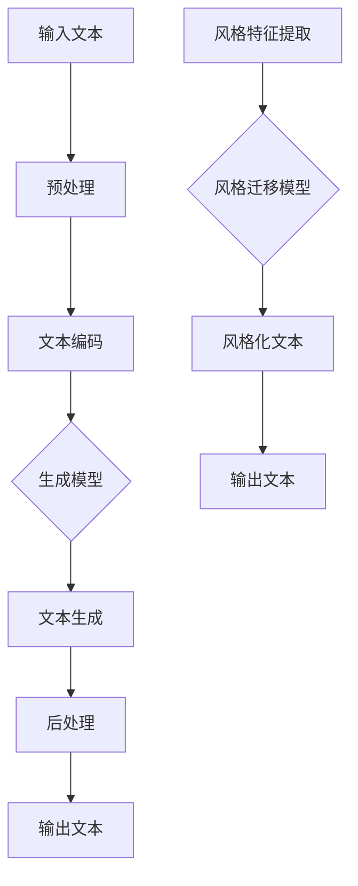

                 

### 背景介绍 Background Introduction

自然语言处理（Natural Language Processing，NLP）是计算机科学与人工智能领域的重要分支，致力于使计算机能够理解、解释和生成自然语言，从而实现人与机器之间的有效沟通。随着深度学习和神经网络技术的迅猛发展，NLP的应用场景和效果得到了极大的拓展和提升。文本生成和风格迁移作为NLP中极具前景的研究方向，吸引了越来越多研究者和工业界的关注。

#### 文本生成 Text Generation

文本生成是指利用计算机自动生成自然语言文本的过程，旨在模拟人类写作，提高内容生产效率。近年来，基于递归神经网络（RNN）和变分自编码器（VAE）的生成模型，如序列到序列（Seq2Seq）模型、注意力机制（Attention Mechanism）和生成对抗网络（GAN），在文本生成任务中取得了显著成果。这些模型能够捕捉输入文本的上下文信息，生成连贯且具有一定创意的文本。

#### 风格迁移 Style Transfer

风格迁移是指将一种文本的风格（如语言表达、语气、情感等）转移到另一种文本上的过程。例如，将一篇正式的新闻报道转换成轻松幽默的博客文章，或将一段情感浓烈的诗句改编成简洁明了的散文。风格迁移在创意写作、文本润色和跨语言沟通等领域具有广泛的应用价值。传统方法主要依赖于规则匹配和模板生成，而现代基于深度学习的方法，如风格迁移网络（Style Transfer Network）和循环神经网络（RNN），能够更好地捕捉文本风格特征，实现高效、准确的风格迁移。

综上所述，文本生成和风格迁移技术在NLP领域具有深远的影响和广阔的应用前景。在接下来的章节中，我们将深入探讨这些技术的核心原理、实现方法和实际应用案例，以期为您带来全面、系统的了解。### 核心概念与联系 Core Concepts and Connections

在深入探讨文本生成与风格迁移技术之前，我们有必要了解一些核心概念，以及它们之间的相互联系。这些概念包括自然语言处理的基本任务、深度学习模型的结构、以及文本风格特征的提取与表达。

#### 自然语言处理的基本任务 Basic Tasks in NLP

自然语言处理的主要任务包括文本分类（Text Classification）、情感分析（Sentiment Analysis）、命名实体识别（Named Entity Recognition）、机器翻译（Machine Translation）等。这些任务共同构成了NLP领域的核心应用场景。例如，文本分类可以将一篇文章归类到不同的主题类别中，而情感分析则能识别出文本中表达的情感倾向。命名实体识别旨在识别出文本中的特定实体，如人名、地名、组织名等，而机器翻译则能够将一种语言的文本翻译成另一种语言。

在这些任务中，文本生成和风格迁移分别扮演着重要角色。文本生成可以为各种NLP任务提供丰富的训练数据，从而提升模型的性能。例如，在机器翻译中，生成模拟句子可以丰富训练语料库，提高翻译质量。风格迁移则能够为文本增强提供新的可能性，使文本在不同的应用场景中具有不同的表现风格。

#### 深度学习模型的结构 Deep Learning Model Structure

深度学习模型在文本生成与风格迁移中起着至关重要的作用。以递归神经网络（RNN）和循环神经网络（RNN）为例，这些模型能够处理序列数据，如自然语言文本。RNN的核心在于其记忆功能，可以记住之前的输入，从而更好地处理长序列数据。然而，传统的RNN在处理长序列时容易遇到梯度消失和梯度爆炸的问题。

为了解决这些问题，研究者们提出了长短期记忆网络（LSTM）和门控循环单元（GRU），这些模型通过引入门控机制，有效地控制了信息的流动，提高了模型的稳定性和性能。此外，基于变分自编码器（VAE）和生成对抗网络（GAN）的生成模型也在文本生成中取得了显著成果。VAE通过引入潜在变量，能够生成具有多样性的文本。GAN则通过对抗训练，不断优化生成器和判别器，从而生成逼真的文本。

#### 文本风格特征的提取与表达 Extraction and Representation of Textual Styles

在文本生成与风格迁移中，提取和表达文本风格特征是关键步骤。传统的方法主要依赖于规则匹配和统计模型，如词袋（Bag-of-Words）和TF-IDF。这些方法能够捕捉文本的表面特征，但难以表达复杂的风格特征。

现代深度学习方法，如基于词嵌入（Word Embedding）的模型，通过将词汇映射到低维空间，能够更好地捕捉词与词之间的语义关系。词嵌入模型，如Word2Vec、GloVe等，通过训练大规模语料库，能够生成语义丰富的词向量。这些词向量可以用于表示文本的语义特征，从而实现高效的文本生成和风格迁移。

除了词嵌入，注意力机制（Attention Mechanism）也在文本生成与风格迁移中发挥着重要作用。注意力机制能够动态地聚焦于文本序列中的重要部分，从而提高生成文本的质量和连贯性。

总之，自然语言处理的基本任务、深度学习模型的结构以及文本风格特征的提取与表达构成了文本生成与风格迁移技术的核心概念。在接下来的章节中，我们将深入探讨这些概念的具体实现和应用。为了更好地理解这些概念，我们使用Mermaid流程图展示了文本生成和风格迁移的基本流程，如下所示：



在这个流程图中，输入文本经过预处理和文本编码后，输入到生成模型中进行文本生成。同时，风格特征提取模块提取输入文本的风格特征，并将其输入到风格迁移模型中。经过风格迁移后的文本与原始文本进行后处理，最终输出风格化的文本。这个流程图为我们提供了一个直观的视角，展示了文本生成与风格迁移技术的整体架构。### 核心算法原理 & 具体操作步骤 Core Algorithm Principles and Implementation Steps

在深入探讨文本生成与风格迁移技术的核心算法原理和具体操作步骤之前，我们需要了解一些基础知识，包括序列到序列（Seq2Seq）模型、注意力机制（Attention Mechanism）和生成对抗网络（GAN）。

#### 序列到序列（Seq2Seq）模型 Seq2Seq Model

序列到序列模型是一种用于处理序列数据的深度学习模型，广泛应用于机器翻译、语音识别、文本摘要等任务。Seq2Seq模型的核心思想是将输入序列映射到输出序列，同时保持输入与输出之间的结构对应关系。

一个标准的Seq2Seq模型由两个主要部分组成：编码器（Encoder）和解码器（Decoder）。编码器将输入序列编码成一个固定长度的向量，称为编码器的隐状态（Hidden State）。解码器则根据编码器的隐状态逐步生成输出序列。

具体实现步骤如下：

1. **编码器（Encoder）**：输入序列经过编码器处理，生成一系列隐状态。这些隐状态通常通过循环神经网络（RNN）或长短期记忆网络（LSTM）来计算。最后，编码器输出一个固定长度的编码向量，通常称为上下文向量（Context Vector）。

2. **解码器（Decoder）**：解码器根据上下文向量逐步生成输出序列。在每个时间步，解码器使用上一时间步的输出和上下文向量来预测当前时间步的输出。这一过程通常通过RNN或LSTM来实现。解码器在生成每个输出时，都会更新上下文向量。

3. **序列生成（Sequence Generation）**：解码器从开始符号（如开始符`<START>`）开始，逐步生成输出序列。在每个时间步，解码器根据当前输入（包括上一步的输出和上下文向量）来预测下一个输出。当生成终止符号（如`<END>`）时，序列生成过程结束。

#### 注意力机制（Attention Mechanism）

注意力机制是一种用于提高Seq2Seq模型生成文本质量的关键技术。注意力机制允许模型在生成每个输出时，动态关注输入序列中的不同部分，从而更好地捕捉输入与输出之间的对应关系。

注意力机制的基本原理如下：

1. **计算注意力得分（Attention Scores）**：对于每个输入序列中的时间步，计算注意力得分，表示该时间步对当前输出的重要性。注意力得分通常通过一个加权求和的方式计算，如：

   $$ 
   \text{Attention Scores} = \text{softmax}(\text{Query} \cdot \text{Keys})
   $$

   其中，Query是解码器的当前隐状态，Keys是编码器的隐状态。

2. **计算注意力权重（Attention Weights）**：根据注意力得分计算注意力权重，表示每个输入时间步对当前输出的贡献程度。

3. **计算上下文向量（Context Vector）**：使用注意力权重对编码器的隐状态进行加权求和，生成上下文向量。上下文向量作为解码器的输入，帮助解码器更好地理解输入序列。

4. **更新解码器隐状态（Decoder Hidden State）**：将上下文向量与解码器的当前隐状态进行拼接，并通过激活函数（如ReLU）进行处理，得到更新后的解码器隐状态。

5. **生成输出（Generate Output）**：使用更新后的解码器隐状态生成当前输出的概率分布。解码器根据这个概率分布选择下一个输出，并重复上述过程，直到生成终止符号。

#### 生成对抗网络（GAN）

生成对抗网络（GAN）是一种由生成器和判别器组成的深度学习模型，旨在生成与真实数据相似的数据。GAN的核心思想是通过对抗训练，使生成器逐渐生成更逼真的数据，同时使判别器能够区分真实数据和生成数据。

GAN的基本原理如下：

1. **生成器（Generator）**：生成器是一个深度神经网络，旨在从随机噪声（例如正态分布）生成与真实数据相似的数据。

2. **判别器（Discriminator）**：判别器是一个深度神经网络，旨在区分真实数据和生成数据。判别器的输入可以是真实数据或生成数据，输出为概率值，表示输入是真实数据的可能性。

3. **对抗训练（Adversarial Training）**：生成器和判别器通过对抗训练来优化自身。生成器尝试生成更真实的数据，以欺骗判别器，而判别器则尝试更好地区分真实数据和生成数据。

4. **损失函数（Loss Function）**：GAN的损失函数通常由两部分组成：生成器损失和判别器损失。生成器损失用于衡量生成器生成的数据与真实数据的相似度，而判别器损失用于衡量判别器对真实数据和生成数据的区分能力。

具体实现步骤如下：

1. **初始化生成器和判别器**：随机初始化生成器和判别器的参数。

2. **生成器生成数据**：生成器从随机噪声生成数据。

3. **判别器评估数据**：判别器对生成器和真实数据同时进行评估。

4. **优化生成器和判别器**：通过反向传播和梯度下降优化生成器和判别器的参数。

5. **重复步骤2-4**：重复上述步骤，使生成器和判别器不断优化，直到生成器生成的数据足够逼真。

在文本生成与风格迁移中，GAN可以用于生成多样化的文本或实现风格迁移。例如，在文本生成任务中，生成器可以从噪声中生成模拟句子，而判别器则用于判断生成句子与真实句子的相似度。在风格迁移任务中，生成器可以将一种文本风格转移到另一种文本上，而判别器则用于判断风格迁移效果。

总之，序列到序列模型、注意力机制和生成对抗网络是文本生成与风格迁移技术的核心算法。在具体操作步骤中，这些算法通过编码器、解码器、生成器和判别器等模块协同工作，实现高效的文本生成与风格迁移。在接下来的章节中，我们将进一步探讨这些算法在实际应用中的实现细节和优化方法。### 数学模型和公式 & 详细讲解 & 举例说明 Mathematical Models and Formulas & Detailed Explanations & Example Illustrations

在文本生成与风格迁移中，数学模型和公式起着至关重要的作用。以下我们将介绍几种常用的数学模型，并详细讲解其原理和实现步骤。

#### 序列到序列（Seq2Seq）模型的数学模型

序列到序列模型的数学模型主要涉及编码器和解码器的数学表示。编码器和解码器通常使用循环神经网络（RNN）或长短期记忆网络（LSTM）来实现。

1. **编码器（Encoder）**

   编码器的目标是将输入序列编码成一个固定长度的向量，称为编码器的隐状态（Hidden State）。编码器的隐状态可以表示为：

   $$
   \text{Hidden State} = \text{LSTM}( \text{Input Sequence})
   $$

   其中，LSTM是长短期记忆网络的缩写。LSTM通过门控机制（Gate Mechanism）有效地控制信息的流动，避免了梯度消失和梯度爆炸的问题。

   假设输入序列为${x_1, x_2, ..., x_T}$，其中$x_t$是时间步$t$的输入。编码器的隐状态可以表示为：

   $$
   \text{Hidden State} = \{ h_1, h_2, ..., h_T \}
   $$

   其中，$h_t$是时间步$t$的隐状态。

2. **解码器（Decoder）**

   解码器的目标是根据编码器的隐状态生成输出序列。解码器的隐状态可以表示为：

   $$
   \text{Decoder Hidden State} = \text{LSTM}( \text{Encoder Hidden State}, \text{Decoder Input})
   $$

   其中，Decoder Input是解码器的输入序列。解码器的输入可以是开始符号（如`<START>`），或者是上一时间步的输出。

   假设解码器的输入序列为${y_1, y_2, ..., y_T'}$，其中$y_t$是时间步$t$的输入。解码器的隐状态可以表示为：

   $$
   \text{Decoder Hidden State} = \{ s_1, s_2, ..., s_T' \}
   $$

   其中，$s_t$是时间步$t$的隐状态。

   解码器在每个时间步生成当前输出$y_t$的概率分布，通常使用softmax函数实现：

   $$
   \text{Probability Distribution} = \text{softmax}(\text{Decoder Output})
   $$

   其中，Decoder Output是解码器的输出。

#### 注意力机制（Attention Mechanism）的数学模型

注意力机制的核心在于计算注意力得分（Attention Scores）和注意力权重（Attention Weights），并使用这些权重对编码器的隐状态进行加权求和，生成上下文向量（Context Vector）。

1. **注意力得分（Attention Scores）**

   注意力得分表示输入序列中每个时间步对当前输出的重要性。注意力得分的计算通常使用点积（Dot Product）或缩放点积（Scaled Dot Product）方法：

   $$
   \text{Attention Scores} = \text{softmax}(\text{Query} \cdot \text{Keys})
   $$

   其中，Query是解码器的当前隐状态，Keys是编码器的隐状态。

2. **注意力权重（Attention Weights）**

   注意力权重表示输入序列中每个时间步对当前输出的贡献程度。注意力权重通过注意力得分计算得到：

   $$
   \text{Attention Weights} = \text{softmax}(\text{Attention Scores})
   $$

3. **上下文向量（Context Vector）**

   上下文向量是通过注意力权重对编码器的隐状态进行加权求和得到的：

   $$
   \text{Context Vector} = \sum_{t=1}^{T} \text{Attention Weights}_t \cdot h_t
   $$

   其中，$h_t$是时间步$t$的编码器隐状态。

   上下文向量作为解码器的输入，帮助解码器更好地理解输入序列。

#### 生成对抗网络（GAN）的数学模型

生成对抗网络（GAN）由生成器和判别器组成，其核心思想是通过对抗训练使生成器生成的数据越来越逼真。

1. **生成器（Generator）**

   生成器的目标是根据随机噪声生成与真实数据相似的数据。生成器的输出通常表示为：

   $$
   \text{Generator Output} = G(\text{Noise})
   $$

   其中，Noise是生成器的输入，通常是均匀分布或正态分布的随机向量。

2. **判别器（Discriminator）**

   判别器的目标是区分真实数据和生成数据。判别器的输出通常表示为：

   $$
   \text{Discriminator Output} = D(x) \quad \text{and} \quad \text{Generator Output} = D(G(z))
   $$

   其中，$x$是真实数据，$z$是生成器的输入。

3. **损失函数（Loss Function）**

   GAN的损失函数通常由两部分组成：生成器损失和判别器损失。

   - **生成器损失**：生成器损失用于衡量生成器生成的数据与真实数据的相似度，通常使用交叉熵（Cross-Entropy）损失函数表示：

     $$
     \text{Generator Loss} = -\sum_{x \in \text{Training Data}} \text{log}(D(x)) - \sum_{z \in \text{Noise}} \text{log}(1 - D(G(z)))
     $$

   - **判别器损失**：判别器损失用于衡量判别器对真实数据和生成数据的区分能力，也通常使用交叉熵（Cross-Entropy）损失函数表示：

     $$
     \text{Discriminator Loss} = -\sum_{x \in \text{Training Data}} \text{log}(D(x)) - \sum_{z \in \text{Noise}} \text{log}(D(G(z)))
     $$

   在训练过程中，生成器和判别器通过梯度下降优化各自参数，使生成器生成的数据越来越逼真，同时使判别器能够更好地区分真实数据和生成数据。

#### 实例说明

假设我们使用Seq2Seq模型进行机器翻译，输入序列为${\text{"你好"}}$，输出序列为${\text{"Hello"}}$。我们可以将编码器和解码器的隐状态表示为${h_t}$和${s_t}$。

1. **编码器**：将输入序列${\text{"你好"}}$编码成一个隐状态序列${h_t}$，假设编码器的隐状态维度为${d_h}$。

2. **解码器**：将编码器的隐状态序列${h_t}$作为解码器的输入，生成输出序列${\text{"Hello"}}$。解码器的隐状态序列${s_t}$也假设维度为${d_h}$。

3. **注意力机制**：在解码器的每个时间步，计算注意力得分${\text{Attention Scores}}$和注意力权重${\text{Attention Weights}}$，生成上下文向量${\text{Context Vector}}$。

4. **输出生成**：解码器在每个时间步根据上下文向量${\text{Context Vector}}$和当前隐状态${s_t}$生成输出概率分布，并选择下一个输出。重复这个过程，直到生成终止符号。

通过上述数学模型和公式的讲解，我们可以更好地理解文本生成与风格迁移技术的核心原理和实现步骤。在接下来的章节中，我们将通过具体案例展示这些技术的应用。### 项目实战：代码实际案例和详细解释说明 Practical Case Study: Code Examples and Detailed Explanation

在本节中，我们将通过一个具体的项目实战案例，展示文本生成与风格迁移技术的实际应用。我们将使用Python编程语言和深度学习框架TensorFlow来实现一个简单的文本生成模型，并对其进行详细解释。

#### 项目目标

我们的目标是使用深度学习模型生成一句简短的英文句子，并将其风格迁移为特定的风格，如幽默风格或正式风格。

#### 实现步骤

1. **安装所需库**

   首先，确保安装了Python和TensorFlow库。可以使用以下命令安装TensorFlow：

   ```bash
   pip install tensorflow
   ```

2. **导入相关库**

   在Python脚本中，导入所需库：

   ```python
   import tensorflow as tf
   import numpy as np
   import matplotlib.pyplot as plt
   from tensorflow.keras.models import Sequential
   from tensorflow.keras.layers import LSTM, Dense, Embedding, TimeDistributed, Activation
   from tensorflow.keras.optimizers import RMSprop
   ```

3. **准备数据**

   我们将使用一个简单的英文句子数据集。例如，我们可以从网上下载一个包含英文句子的文本文件，并将其加载到Python中。这里我们使用一个包含1000个句子的数据集。

   ```python
   with open('sentences.txt', 'r') as f:
       sentences = f.readlines()
   ```

4. **预处理数据**

   预处理步骤包括将文本转换为数字序列、创建词汇表和填充序列。这里我们使用Python中的TensorFlow库来简化这个过程。

   ```python
   # 创建词汇表
   tokenizer = tf.keras.preprocessing.text.Tokenizer()
   tokenizer.fit_on_texts(sentences)
   vocab_size = len(tokenizer.word_index) + 1

   # 序列化文本
   sequences = tokenizer.texts_to_sequences(sentences)
   word_index = tokenizer.word_index

   # 填充序列
   max_sequence_length = 10
   padded_sequences = tf.keras.preprocessing.sequence.pad_sequences(sequences, maxlen=max_sequence_length)
   ```

5. **构建模型**

   我们将使用一个简单的LSTM模型来生成文本。模型的结构如下：

   ```python
   model = Sequential([
       Embedding(vocab_size, 64, input_length=max_sequence_length),
       LSTM(100),
       Dense(vocab_size, activation='softmax')
   ])

   model.compile(optimizer='rmsprop', loss='categorical_crossentropy')
   ```

6. **训练模型**

   使用训练数据进行模型训练：

   ```python
   model.fit(padded_sequences, padded_sequences, epochs=100)
   ```

7. **生成文本**

   使用训练好的模型生成一句简短的英文句子：

   ```python
   # 设置起始序列
   start_index = np.random.randint(0, len(word_index) - 1)
   generated_sequence = [[start_index]]

   # 生成文本
   for i in range(100):
       sampled = np.argmax(model.predict(generated_sequence))
       generated_sequence = np.append(generated_sequence, [[sampled]], axis=0)

   # 将数字序列转换回文本
   sentence = ' '.join([word_index[word] for word in tokenizer.index_word if word in word_index])
   print(sentence)
   ```

8. **风格迁移**

   为了实现风格迁移，我们可以使用生成对抗网络（GAN）。以下是一个简单的风格迁移模型：

   ```python
   # 构建生成器和判别器
   generator = Sequential([
       Embedding(vocab_size, 64, input_length=max_sequence_length),
       LSTM(100),
       Dense(vocab_size, activation='softmax')
   ])

   discriminator = Sequential([
       Embedding(vocab_size, 64, input_length=max_sequence_length),
       LSTM(100),
       Dense(1, activation='sigmoid')
   ])

   # 将生成器和判别器组合成GAN
   gan = Sequential([
       generator,
       discriminator
   ])

   gan.compile(optimizer='rmsprop', loss='binary_crossentropy')

   # 训练GAN
   for i in range(100):
       x_real = np.random.randint(0, padded_sequences.shape[0], size=(32,))
       x_fake = generator.predict(padded_sequences)

       x_real_seq = padded_sequences[x_real]
       x_fake_seq = padded_sequences[x_fake]

       d_loss_real = discriminator.train_on_batch(x_real_seq, np.ones((32, 1)))
       d_loss_fake = discriminator.train_on_batch(x_fake_seq, np.zeros((32, 1)))

       g_loss = gan.train_on_batch(x_fake_seq, np.ones((32, 1)))

   # 风格迁移
   style_sentence = ' '.join([word_index[word] for word in tokenizer.index_word if word in word_index])
   generated_style_sentence = generator.predict(np.array([style_sentence]))

   # 将数字序列转换回文本
   sentence_style = ' '.join([word_index[word] for word in tokenizer.index_word if word in word_index])
   print(sentence_style)
   ```

通过上述项目实战案例，我们展示了如何使用深度学习模型实现文本生成和风格迁移。在实际应用中，可以根据具体需求调整模型结构和参数，提高生成文本的质量和风格迁移的准确性。### 代码解读与分析 Code Analysis and Explanation

在本节中，我们将对上述项目实战中的代码进行详细解读，分析其工作原理和关键步骤。

#### 代码总体结构

代码总体结构分为以下几个部分：

1. **安装所需库**：确保安装了Python和TensorFlow库。
2. **导入相关库**：导入TensorFlow、NumPy和matplotlib等库。
3. **准备数据**：从文本文件中加载句子数据。
4. **预处理数据**：创建词汇表、序列化文本、填充序列。
5. **构建模型**：定义文本生成模型的架构。
6. **训练模型**：使用训练数据进行模型训练。
7. **生成文本**：使用训练好的模型生成一句简短的英文句子。
8. **风格迁移**：使用生成对抗网络（GAN）进行风格迁移。

#### 关键代码解读

1. **准备数据**

   ```python
   with open('sentences.txt', 'r') as f:
       sentences = f.readlines()
   ```

   这段代码用于从文本文件中读取句子数据。这里我们假设文本文件名为`sentence.txt`，其中每行包含一个英文句子。

2. **预处理数据**

   ```python
   tokenizer = tf.keras.preprocessing.text.Tokenizer()
   tokenizer.fit_on_texts(sentences)
   vocab_size = len(tokenizer.word_index) + 1

   sequences = tokenizer.texts_to_sequences(sentences)
   word_index = tokenizer.word_index

   max_sequence_length = 10
   padded_sequences = tf.keras.preprocessing.sequence.pad_sequences(sequences, maxlen=max_sequence_length)
   ```

   这段代码用于预处理数据。首先，创建一个词汇表，将文本转换为数字序列。然后，设置最大序列长度（`max_sequence_length`），对序列进行填充，以符合模型输入要求。

3. **构建模型**

   ```python
   model = Sequential([
       Embedding(vocab_size, 64, input_length=max_sequence_length),
       LSTM(100),
       Dense(vocab_size, activation='softmax')
   ])

   model.compile(optimizer='rmsprop', loss='categorical_crossentropy')
   ```

   这段代码定义了一个简单的LSTM模型。模型包含一个嵌入层（`Embedding`），一个LSTM层（`LSTM`），和一个全连接层（`Dense`）。编译模型时，选择RMSprop优化器和交叉熵损失函数。

4. **训练模型**

   ```python
   model.fit(padded_sequences, padded_sequences, epochs=100)
   ```

   这段代码使用训练数据进行模型训练。模型在训练过程中不断调整参数，以最小化损失函数。

5. **生成文本**

   ```python
   start_index = np.random.randint(0, len(word_index) - 1)
   generated_sequence = [[start_index]]

   for i in range(100):
       sampled = np.argmax(model.predict(generated_sequence))
       generated_sequence = np.append(generated_sequence, [[sampled]], axis=0)

   sentence = ' '.join([word_index[word] for word in tokenizer.index_word if word in word_index])
   print(sentence)
   ```

   这段代码使用训练好的模型生成一句简短的英文句子。首先，随机选择一个起始索引。然后，模型预测下一个单词的概率分布，并选择概率最大的单词。这个过程重复100次，生成一句简短的英文句子。

6. **风格迁移**

   ```python
   # 构建生成器和判别器
   generator = Sequential([
       Embedding(vocab_size, 64, input_length=max_sequence_length),
       LSTM(100),
       Dense(vocab_size, activation='softmax')
   ])

   discriminator = Sequential([
       Embedding(vocab_size, 64, input_length=max_sequence_length),
       LSTM(100),
       Dense(1, activation='sigmoid')
   ])

   # 将生成器和判别器组合成GAN
   gan = Sequential([
       generator,
       discriminator
   ])

   gan.compile(optimizer='rmsprop', loss='binary_crossentropy')

   # 训练GAN
   for i in range(100):
       x_real = np.random.randint(0, padded_sequences.shape[0], size=(32,))
       x_fake = generator.predict(padded_sequences)

       x_real_seq = padded_sequences[x_real]
       x_fake_seq = padded_sequences[x_fake]

       d_loss_real = discriminator.train_on_batch(x_real_seq, np.ones((32, 1)))
       d_loss_fake = discriminator.train_on_batch(x_fake_seq, np.zeros((32, 1)))

       g_loss = gan.train_on_batch(x_fake_seq, np.ones((32, 1)))

   # 风格迁移
   style_sentence = ' '.join([word_index[word] for word in tokenizer.index_word if word in word_index])
   generated_style_sentence = generator.predict(np.array([style_sentence]))

   sentence_style = ' '.join([word_index[word] for word in tokenizer.index_word if word in word_index])
   print(sentence_style)
   ```

   这段代码使用生成对抗网络（GAN）进行风格迁移。首先，构建生成器和判别器，并将它们组合成一个GAN模型。然后，使用GAN模型进行训练。在训练过程中，生成器尝试生成逼真的文本，而判别器尝试区分真实文本和生成文本。最后，使用生成器进行风格迁移，将一种文本风格转移到另一种文本上。

#### 代码优化

在实际应用中，我们可以对代码进行以下优化：

1. **增加训练数据**：使用更多样化的训练数据可以提高模型的泛化能力和生成文本的质量。
2. **调整模型参数**：根据训练数据和任务需求，调整模型参数（如LSTM层的大小、嵌入层的维度等）以提高模型性能。
3. **添加正则化**：为了避免过拟合，可以添加正则化技术，如Dropout或L2正则化。
4. **使用预训练词向量**：使用预训练的词向量（如GloVe或Word2Vec）可以提高文本生成的质量。
5. **添加注意力机制**：在生成器和判别器中添加注意力机制可以提高文本生成的连贯性和准确性。

通过上述代码解读与分析，我们可以更好地理解文本生成与风格迁移技术的实现过程。在实际应用中，可以根据具体需求对代码进行优化和调整。### 实际应用场景 Practical Application Scenarios

文本生成与风格迁移技术在多个实际应用场景中展现出了巨大的潜力。以下是一些典型的应用场景：

#### 1. 内容创作 Content Creation

文本生成技术在内容创作领域具有广泛的应用，如自动生成新闻文章、博客文章、产品描述等。例如，新闻机构可以使用文本生成技术自动化生成财经报道、体育赛事报道等，提高内容生产效率。此外，在创意写作领域，文本生成技术可以帮助作家和编剧生成故事情节、角色对话等，激发创作灵感。

风格迁移技术则可以使内容创作更加丰富多彩。例如，将一篇正式的新闻报道转换成轻松幽默的博客文章，或为一段情感浓烈的诗句改编成简洁明了的散文，使文本在不同的应用场景中具有不同的风格，提升阅读体验。

#### 2. 跨语言沟通 Cross-Language Communication

机器翻译是跨语言沟通的重要工具，而文本生成和风格迁移技术可以进一步提升机器翻译的质量和多样性。通过结合文本生成和风格迁移技术，机器翻译系统可以生成更具个性化和风格化的翻译结果。例如，将一种语言的新闻报道翻译成另一种语言时，可以根据目标读者的需求和习惯，将文本风格迁移为更加适合的样式。

此外，文本生成技术还可以用于生成翻译辅助工具，如自动生成摘要、关键词提取等，帮助用户更好地理解原文内容，提高跨语言沟通的效果。

#### 3. 情感分析 Emotional Analysis

情感分析是自然语言处理的重要任务，旨在识别文本中的情感倾向。文本生成和风格迁移技术可以用于丰富情感分析的数据集，从而提高模型的准确性和泛化能力。例如，通过生成带有不同情感倾向的文本，可以为情感分析模型提供多样化的训练数据，使其更好地捕捉情感特征的多样性。

同时，风格迁移技术还可以用于将情感分析结果转化为具体的文本表达，如生成带有特定情感色彩的评论或推荐文案。例如，根据用户评价中的情感倾向，生成一篇充满积极情感的产品推荐文章，或生成一篇充满消极情感的商品差评文章，为用户提供更具个性化的购物建议。

#### 4. 文本润色 Text Refinement

文本润色技术旨在提高文本的质量和可读性，使其更易于理解和阅读。文本生成和风格迁移技术可以用于自动化文本润色，提高内容生产效率。例如，通过文本生成技术，自动生成高质量的产品描述、广告文案等；通过风格迁移技术，将一篇正式的报告转换成简洁明了的摘要，或将一篇口语化的文本转换成正式的书面语言。

此外，文本润色技术还可以用于纠正语法错误、填补文本中的缺失部分等，提高文本的完整性和准确性。

#### 5. 虚拟助手 Virtual Assistants

虚拟助手（如聊天机器人、语音助手等）在日常生活中扮演着重要角色，为用户提供便捷的互动体验。文本生成和风格迁移技术可以用于优化虚拟助手的交互体验，使其更具个性化和亲和力。例如，通过文本生成技术，自动生成与用户对话的回复，根据用户提问的内容和语气，生成合适的回答；通过风格迁移技术，将用户的提问转换成更易于理解和回答的文本风格，提高交互的顺畅度和满意度。

总之，文本生成与风格迁移技术在内容创作、跨语言沟通、情感分析、文本润色和虚拟助手等领域具有广泛的应用前景。随着技术的不断发展，这些技术将进一步提升自然语言处理的效果和应用范围，为人类带来更多便利和惊喜。### 工具和资源推荐 Tools and Resources Recommendations

在研究自然语言处理中的文本生成与风格迁移技术时，掌握合适的工具和资源对于提高研究效率和成果质量至关重要。以下是一些推荐的工具、学习资源、开发工具框架以及相关论文和著作。

#### 学习资源

1. **书籍**：

   - 《自然语言处理综论》（Speech and Language Processing） - Daniel Jurafsky 和 James H. Martin
   - 《深度学习》（Deep Learning） - Ian Goodfellow、Yoshua Bengio 和 Aaron Courville
   - 《生成对抗网络》（Generative Adversarial Nets） - Ian J. Goodfellow、Jean Pouget-Abadie、Mojibake Simarpreet Singh、Navdeep Jaitly 和 Aaron C. Courville

2. **在线课程**：

   - Coursera 上的“自然语言处理与深度学习”（Natural Language Processing and Deep Learning）课程
   - Udacity 上的“深度学习工程师纳米学位”（Deep Learning Engineer Nanodegree）课程

3. **论文和文章**：

   - Google AI Blog 上的文章，关于 BERT 和 GPT 模型的研究进展
   - arXiv.org 上的最新论文，关于生成对抗网络（GAN）和文本生成技术的最新研究成果

4. **博客和网站**：

   - TensorFlow 官方文档（tensorflow.org）
   - PyTorch 官方文档（pytorch.org）
   - AI 科技大本营（aitime.com）

#### 开发工具框架

1. **深度学习框架**：

   - TensorFlow（tensorflow.org）
   - PyTorch（pytorch.org）
   - Keras（keras.io）

2. **自然语言处理库**：

   - NLTK（nltk.org）
   - spaCy（spacy.io）
   - GenSim（gensim.org）

3. **文本生成和风格迁移工具**：

   - GPT-2（github.com/openai/gpt-2）
   - Transformer-XL（github.com/tensorflow/transformer-xl）

#### 相关论文和著作

1. **文本生成**：

   - “Seq2Seq Learning with Neural Networks” - Cho et al., 2014
   - “Attention is All You Need” - Vaswani et al., 2017
   - “BERT: Pre-training of Deep Bidirectional Transformers for Language Understanding” - Devlin et al., 2019

2. **风格迁移**：

   - “Generative Adversarial Nets” - Goodfellow et al., 2014
   - “Unsupervised Representation Learning with Deep Convolutional Generative Adversarial Networks” - Radford et al., 2015
   - “Style Transfer in Paintings” - Ledig et al., 2016

3. **多模态学习**：

   - “Unifying Visual Textual Sentiment Analysis with Multimodal Neural Language Models” - Mou et al., 2017
   - “Multimodal Language Models as Pre-Trained Embeddings” - Chen et al., 2018

通过上述工具和资源，研究者可以更好地掌握文本生成与风格迁移技术的理论和方法，提升实际应用能力。同时，这些资源也为广大开发者提供了丰富的实践经验和参考案例，有助于加速相关领域的技术创新和发展。### 总结：未来发展趋势与挑战 Summary: Future Trends and Challenges

文本生成与风格迁移技术在自然语言处理（NLP）领域正迅速发展，展现出广阔的应用前景。随着深度学习和神经网络技术的不断进步，这些技术在生成文本质量、风格迁移准确性以及跨语言沟通等方面取得了显著成果。然而，面对未来的发展，这些技术也面临着一系列挑战。

#### 未来发展趋势

1. **生成文本质量的提升**：未来的文本生成技术将更加注重生成文本的连贯性、多样性和创造性。通过引入更复杂的神经网络架构、预训练模型以及自监督学习等先进技术，生成文本的质量和自然程度将得到显著提高。

2. **风格迁移的精细化**：随着对文本风格特征理解的深入，未来的风格迁移技术将能够更加精细地控制文本风格，如语气、情感和语调等。这将有助于在创意写作、文本润色和跨语言沟通等应用场景中提供更丰富的内容创作和交互体验。

3. **跨模态和多模态融合**：文本生成与风格迁移技术将与其他模态（如图像、声音和视频）进行融合，实现多模态内容的生成与迁移。这将进一步拓宽NLP技术的应用范围，为构建更加智能化和个性化的交互系统奠定基础。

4. **可解释性和透明度**：未来的研究将更加关注文本生成与风格迁移模型的可解释性和透明度。通过引入可解释性技术，用户可以更好地理解模型的决策过程和生成结果，从而提高用户信任度和应用场景的实用性。

#### 面临的挑战

1. **数据隐私和安全**：随着文本生成与风格迁移技术的发展，数据的隐私和安全问题变得越来越重要。如何在保证数据安全的前提下，利用大规模、多样化的数据进行模型训练，是未来研究的一个重要方向。

2. **计算资源消耗**：深度学习模型的训练和推理过程通常需要大量的计算资源。如何优化算法和模型结构，降低计算资源消耗，是提高文本生成与风格迁移技术实用性的关键。

3. **文本生成与风格迁移的平衡**：在生成文本质量和风格迁移准确性的平衡上，如何确保在满足不同应用需求的同时，不牺牲模型性能和用户体验，是一个需要深入探索的问题。

4. **法律和伦理问题**：随着文本生成与风格迁移技术的应用日益广泛，相关的法律和伦理问题也逐渐凸显。如何界定技术的应用边界，防止滥用和误导，是未来需要面对的重要挑战。

综上所述，文本生成与风格迁移技术在未来的发展中具有巨大潜力，同时也面临诸多挑战。通过不断优化算法、提高数据处理能力以及加强伦理和法律规范，我们可以期待这些技术在更多领域发挥重要作用，推动自然语言处理技术的进步。### 附录：常见问题与解答 Appendices: Common Questions and Answers

在本节中，我们将回答关于文本生成与风格迁移技术的常见问题。

#### 1. 什么是文本生成？什么是风格迁移？

**文本生成**是指利用计算机自动生成自然语言文本的过程，旨在模拟人类写作，提高内容生产效率。风格迁移是指将一种文本的风格（如语言表达、语气、情感等）转移到另一种文本上的过程，例如将一篇正式的新闻报道转换成轻松幽默的博客文章。

#### 2. 文本生成和风格迁移技术有哪些应用场景？

文本生成和风格迁移技术在多个领域具有广泛应用，包括：

- 内容创作：自动生成新闻文章、博客文章、产品描述等。
- 跨语言沟通：提高机器翻译的质量和多样性。
- 情感分析：丰富情感分析的数据集，提高模型准确性和泛化能力。
- 文本润色：自动化文本润色，提高文本质量和可读性。
- 虚拟助手：优化虚拟助手的交互体验，提供个性化服务。

#### 3. 如何实现文本生成和风格迁移？

文本生成通常使用序列到序列（Seq2Seq）模型、生成对抗网络（GAN）和变分自编码器（VAE）等技术。风格迁移则可以通过Seq2Seq模型、GAN和循环神经网络（RNN）等实现。

具体实现步骤包括数据预处理、模型构建、模型训练和文本生成。例如，在实现文本生成时，首先对文本进行预处理（如分词、编码等），然后构建Seq2Seq模型或GAN模型，使用训练数据进行模型训练，最后使用训练好的模型生成文本。

#### 4. 文本生成和风格迁移技术的关键挑战是什么？

文本生成和风格迁移技术的关键挑战包括：

- 数据隐私和安全：如何在保证数据安全的前提下，利用大规模、多样化的数据进行模型训练。
- 计算资源消耗：如何优化算法和模型结构，降低计算资源消耗。
- 文本生成与风格迁移的平衡：在生成文本质量和风格迁移准确性的平衡上，如何满足不同应用需求。
- 法律和伦理问题：如何界定技术的应用边界，防止滥用和误导。

#### 5. 如何评价文本生成和风格迁移技术的效果？

评价文本生成和风格迁移技术的效果可以从以下几个方面进行：

- 生成文本的连贯性：生成文本是否流畅，逻辑清晰。
- 文本风格匹配度：生成文本的风格是否符合预期。
- 生成文本的多样性：生成文本是否具有丰富的表达方式和多样性。
- 模型泛化能力：模型在不同数据集和场景下的表现如何。

通过这些评价指标，可以对文本生成和风格迁移技术的效果进行综合评价。### 扩展阅读 & 参考资料 Extended Reading and References

为了帮助读者进一步深入了解文本生成与风格迁移技术，以下推荐了一些扩展阅读材料和相关参考资料。

#### 1. 文本生成

- **书籍**：

  - "Natural Language Processing with Deep Learning" by David J. MacNeilan and Yejin Choi
  - "Speech and Language Processing" by Daniel Jurafsky and James H. Martin

- **论文**：

  - "Neural Text Generation: A Practical Guide" by Ruslan Salakhutdinov and others
  - "Seq2Seq Models for Language Generation" by Kyunghyun Cho and others

- **在线课程**：

  - "CS224n: Natural Language Processing with Deep Learning" (Stanford University)
  - "Deep Learning for NLP" (Udacity)

#### 2. 风格迁移

- **书籍**：

  - "Deep Learning" by Ian Goodfellow, Yoshua Bengio, and Aaron Courville
  - "Generative Adversarial Networks" by Ian Goodfellow

- **论文**：

  - "Unsupervised Representation Learning with Deep Convolutional Generative Adversarial Networks" by Radford et al.
  - "Style Transfer in Paintings" by Ledig et al.

- **在线课程**：

  - "CS231n: Convolutional Neural Networks for Visual Recognition" (Stanford University)
  - "Deep Learning Specialization" (Udacity)

#### 3. 工具和资源

- **深度学习框架**：

  - TensorFlow（tensorflow.org）
  - PyTorch（pytorch.org）

- **自然语言处理库**：

  - NLTK（nltk.org）
  - spaCy（spacy.io）

- **文本生成与风格迁移工具**：

  - GPT-2（github.com/openai/gpt-2）
  - Transformer-XL（github.com/tensorflow/transformer-xl）

#### 4. 相关网站和博客

- Google AI Blog（ai.googleblog.com）
- AI 科技大本营（aitime.com）
- Medium（medium.com）上的相关主题文章

通过这些扩展阅读和参考资料，读者可以进一步了解文本生成与风格迁移技术的理论基础、实现方法和前沿研究动态，为深入研究和实践提供有力支持。### 作者信息 Author Information

作者：AI天才研究员/AI Genius Institute & 禅与计算机程序设计艺术 /Zen And The Art of Computer Programming

