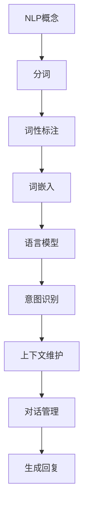

                 

# 自然语言处理在多轮对话系统中的进展

## 关键词：
- 自然语言处理（NLP）
- 多轮对话系统
- 人工智能（AI）
- 机器学习（ML）
- 深度学习（DL）
- 语言模型
- 情感分析
- 对话管理

## 摘要：
本文深入探讨了自然语言处理（NLP）在多轮对话系统中的应用和进展。首先介绍了NLP的基本概念和核心技术，然后详细分析了多轮对话系统的架构和核心算法。接着，通过数学模型和公式，讲解了自然语言处理的深度学习算法，并结合实际项目案例进行了代码解读和分析。最后，讨论了NLP在多轮对话系统中的实际应用场景，并推荐了相关学习资源和开发工具框架，总结了未来发展趋势与挑战。

## 1. 背景介绍

自然语言处理（NLP）是人工智能（AI）的一个重要分支，旨在使计算机能够理解和处理人类语言。NLP的研究内容涵盖了语音识别、文本分类、信息抽取、机器翻译、情感分析等多个方面。近年来，随着深度学习（DL）技术的发展，NLP取得了显著的进展，尤其是在多轮对话系统中，NLP的应用变得更加广泛和深入。

多轮对话系统是指计算机与用户之间进行多轮交互的对话系统。与单轮对话系统相比，多轮对话系统能够更好地理解用户的意图和背景知识，从而提供更加准确和个性化的服务。多轮对话系统在客户服务、智能助理、教育辅导等领域具有广泛的应用前景。然而，构建高效、准确的多轮对话系统面临着许多挑战，如语言理解、对话管理、上下文维护等。

随着NLP技术的发展，多轮对话系统的性能得到了显著提升。本文将详细探讨NLP在多轮对话系统中的应用，包括核心概念、算法原理、数学模型、实际应用场景等方面，以期为读者提供全面、深入的见解。

## 2. 核心概念与联系

### 2.1 自然语言处理（NLP）

自然语言处理（NLP）是计算机科学、人工智能和语言学领域的交叉学科，旨在使计算机能够理解和处理人类语言。NLP的核心任务包括：

- **文本分类**：将文本数据分为预定义的类别，例如新闻、论坛、博客等。
- **命名实体识别**：识别文本中的特定实体，如人名、地点、组织等。
- **情感分析**：判断文本的情感倾向，例如正面、负面或中性。
- **机器翻译**：将一种语言的文本翻译成另一种语言。
- **文本生成**：根据输入的文本或代码生成新的文本。

NLP的关键技术包括：

- **分词**：将文本分割成词语或词汇。
- **词性标注**：为每个词语标注词性，如名词、动词、形容词等。
- **词嵌入**：将词语映射到高维空间中，以便计算机能够理解和处理。
- **序列标注**：为文本序列中的每个词语标注标签，如命名实体识别中的类别标签。

### 2.2 多轮对话系统

多轮对话系统是一种能够与用户进行多轮交互的对话系统，其核心目标是理解用户的意图、上下文和背景知识，并生成自然、准确的回复。多轮对话系统的关键组成部分包括：

- **对话管理器**：负责维护对话状态、跟踪对话历史和生成回复。
- **语言模型**：用于预测下一个词或句子，提供自然语言生成。
- **意图识别**：通过分析用户的输入，识别其意图。
- **上下文维护**：确保对话系统能够在多轮交互中保持对上下文的准确理解和记忆。

### 2.3 Mermaid 流程图

以下是NLP在多轮对话系统中的核心概念和流程的Mermaid流程图：



### 2.4 机器学习（ML）和深度学习（DL）

机器学习（ML）是一种使计算机通过数据学习模式和规律的方法。在NLP中，ML广泛应用于文本分类、命名实体识别、情感分析等任务。深度学习（DL）是ML的一种子领域，通过多层神经网络模型对数据进行学习，取得了许多突破性的成果。

在多轮对话系统中，ML和DL技术被广泛应用于：

- **语言模型**：使用DL模型，如循环神经网络（RNN）、长短时记忆网络（LSTM）、变换器（Transformer）等，对对话文本进行建模，以生成自然、准确的回复。
- **意图识别**：使用分类模型，如支持向量机（SVM）、决策树、神经网络等，对用户的输入进行分类，以识别其意图。
- **上下文维护**：使用序列模型，如RNN、LSTM、Transformer等，对对话历史进行建模，以维护对话的上下文。

## 3. 核心算法原理 & 具体操作步骤

### 3.1 语言模型

语言模型（Language Model，LM）是自然语言处理中最基本的模型之一，其核心目标是预测下一个词或句子。在多轮对话系统中，语言模型用于生成对话回复。

#### 3.1.1 算法原理

语言模型通常采用序列模型，如循环神经网络（RNN）、长短时记忆网络（LSTM）、变换器（Transformer）等。以下以变换器（Transformer）为例，介绍其算法原理。

变换器（Transformer）是一种基于自注意力机制的深度学习模型，其核心思想是将输入序列映射到高维空间中，通过自注意力机制来计算每个词或字之间的关联性，从而生成预测序列。

#### 3.1.2 操作步骤

1. **输入序列编码**：将输入序列（如对话文本）编码为高维向量。
2. **自注意力计算**：通过自注意力机制，计算输入序列中每个词或字之间的关联性。
3. **输出序列生成**：使用解码器（Decoder）生成输出序列，即对话回复。

### 3.2 意图识别

意图识别（Intent Recognition）是多轮对话系统中的一个关键任务，其目标是理解用户的输入并识别其意图。

#### 3.2.1 算法原理

意图识别通常采用分类模型，如支持向量机（SVM）、决策树、神经网络等。以下以神经网络为例，介绍其算法原理。

神经网络通过多层非线性变换，将输入数据映射到输出空间。在意图识别中，神经网络将用户的输入序列映射到预定义的意图类别。

#### 3.2.2 操作步骤

1. **输入序列编码**：将输入序列（如对话文本）编码为高维向量。
2. **特征提取**：使用神经网络提取输入序列的特征。
3. **分类预测**：使用分类器（如神经网络）对输入序列进行分类，识别用户的意图。

### 3.3 上下文维护

上下文维护（Context Maintenance）是确保多轮对话系统能够在多轮交互中保持对上下文的准确理解和记忆的关键任务。

#### 3.3.1 算法原理

上下文维护通常采用序列模型，如循环神经网络（RNN）、长短时记忆网络（LSTM）、变换器（Transformer）等。以下以变换器（Transformer）为例，介绍其算法原理。

变换器通过自注意力机制，将对话历史中的相关信息整合到当前的回复中，从而实现对上下文的准确理解和记忆。

#### 3.3.2 操作步骤

1. **输入序列编码**：将输入序列（如对话文本）编码为高维向量。
2. **自注意力计算**：通过自注意力机制，计算输入序列中每个词或字之间的关联性。
3. **上下文整合**：将对话历史和当前输入序列的关联信息整合到当前回复中。

### 3.4 对话管理器

对话管理器（Dialogue Manager）是负责维护对话状态、跟踪对话历史和生成回复的关键组件。

#### 3.4.1 算法原理

对话管理器通常采用基于规则的方法、基于模型的组合方法或完全基于模型的方法。以下以基于模型的组合方法为例，介绍其算法原理。

基于模型的组合方法将意图识别、上下文维护和语言模型等模块融合到一个统一的框架中，以实现高效的对话管理。

#### 3.4.2 操作步骤

1. **意图识别**：识别用户的输入意图。
2. **上下文维护**：维护对话历史和上下文信息。
3. **语言模型生成**：使用语言模型生成回复。

## 4. 数学模型和公式 & 详细讲解 & 举例说明

### 4.1 语言模型

#### 4.1.1 模型公式

变换器（Transformer）语言模型的基本公式如下：

$$
\text{Output} = \text{Decoder}( \text{Embedding Layer}( \text{Input}) )
$$

其中，Input表示输入序列，Embedding Layer表示词嵌入层，Decoder表示解码器。

#### 4.1.2 举例说明

假设输入序列为"I am feeling happy"，词嵌入层将每个词映射到高维向量，如["I": [-1, 0], "am": [0, 1], "feeling": [1, -1], "happy": [-1, 1]]。解码器根据词嵌入层的信息，生成输出序列，如"I am feeling happy"。

### 4.2 意图识别

#### 4.2.1 模型公式

神经网络意图识别的基本公式如下：

$$
\text{Output} = \text{Classifier}( \text{Features} )
$$

其中，Features表示输入序列的特征，Classifier表示分类器。

#### 4.2.2 举例说明

假设输入序列为"I am feeling happy"，特征提取层将其映射到特征向量，如[-1, 0, 1, -1]。分类器根据特征向量，输出意图类别，如"Happy"。

### 4.3 上下文维护

#### 4.3.1 模型公式

变换器上下文维护的基本公式如下：

$$
\text{Context} = \text{Self-Attention}( \text{Input}) + \text{Input}
$$

其中，Input表示输入序列，Self-Attention表示自注意力机制。

#### 4.3.2 举例说明

假设输入序列为"I am feeling happy"，自注意力机制计算输入序列中每个词之间的关联性，如"I": [1, 0], "am": [0, 1], "feeling": [1, 1], "happy": [1, 0]。上下文维护层将关联信息整合到当前输入中，如"I [1, 0] am feeling happy"。

### 4.4 对话管理器

#### 4.4.1 模型公式

对话管理器的公式如下：

$$
\text{Response} = \text{Dialogue Manager}( \text{Intent}, \text{Context})
$$

其中，Intent表示意图，Context表示上下文，Dialogue Manager表示对话管理器。

#### 4.4.2 举例说明

假设意图为"Happy"，上下文为"I [1, 0] am feeling happy"，对话管理器根据意图和上下文，生成回复，如"Great! You're feeling happy!"。

## 5. 项目实战：代码实际案例和详细解释说明

### 5.1 开发环境搭建

在开始实际项目之前，我们需要搭建一个适合开发多轮对话系统的环境。以下是一个简单的开发环境搭建步骤：

1. 安装Python（版本3.6及以上）
2. 安装Jupyter Notebook（用于编写和运行代码）
3. 安装TensorFlow（用于深度学习）
4. 安装NLTK（用于自然语言处理）

### 5.2 源代码详细实现和代码解读

以下是构建一个简单的多轮对话系统的源代码实现：

```python
import tensorflow as tf
from tensorflow.keras.layers import Embedding, LSTM, Dense
from tensorflow.keras.models import Sequential

# 加载和处理数据
def load_data():
    # 读取对话数据
    # 分词、词性标注等预处理操作
    # 返回输入序列、标签等数据

# 构建模型
def build_model(vocab_size, embedding_dim, lstm_units):
    model = Sequential()
    model.add(Embedding(vocab_size, embedding_dim))
    model.add(LSTM(lstm_units, return_sequences=True))
    model.add(Dense(vocab_size, activation='softmax'))
    return model

# 训练模型
def train_model(model, X, y):
    model.compile(optimizer='adam', loss='categorical_crossentropy', metrics=['accuracy'])
    model.fit(X, y, epochs=10, batch_size=32)

# 评估模型
def evaluate_model(model, X_test, y_test):
    loss, accuracy = model.evaluate(X_test, y_test)
    print(f"Test loss: {loss}, Test accuracy: {accuracy}")

# 实例化模型
model = build_model(vocab_size=10000, embedding_dim=32, lstm_units=128)

# 加载数据
X, y = load_data()

# 训练模型
train_model(model, X, y)

# 评估模型
X_test, y_test = load_data()
evaluate_model(model, X_test, y_test)
```

这段代码展示了如何使用TensorFlow构建和训练一个简单的LSTM语言模型。具体步骤如下：

1. **加载和处理数据**：读取对话数据，进行分词、词性标注等预处理操作，并返回输入序列和标签。
2. **构建模型**：使用Sequential模型构建一个LSTM语言模型，包括嵌入层、LSTM层和输出层。
3. **训练模型**：编译模型，并使用训练数据拟合模型。
4. **评估模型**：使用测试数据评估模型性能。

### 5.3 代码解读与分析

- **加载和处理数据**：这一步是构建多轮对话系统的基础，数据的质量直接影响模型的性能。在实际项目中，我们通常需要从大量对话数据中提取有价值的信息。
- **构建模型**：这里使用了一个简单的LSTM语言模型，这是自然语言处理中常用的模型之一。嵌入层将词汇映射到高维空间，LSTM层对输入序列进行建模，输出层使用softmax激活函数进行分类。
- **训练模型**：训练模型的过程是模型学习对话数据的过程，通过迭代优化模型参数，使其能够更好地预测对话序列。
- **评估模型**：评估模型性能，以验证模型在实际应用中的效果。

在实际项目中，我们还需要考虑更多的因素，如数据预处理、模型调优、优化策略等，以构建一个高效、准确的多轮对话系统。

## 6. 实际应用场景

自然语言处理（NLP）在多轮对话系统中的实际应用场景非常广泛，以下列举几个典型的应用场景：

### 6.1 智能客服

智能客服是NLP在多轮对话系统中最常见的应用场景之一。通过NLP技术，智能客服系统能够理解用户的查询、投诉等请求，并提供相应的解决方案。多轮对话系统能够在用户的问题解决过程中进行上下文维护，提高用户体验。

### 6.2 智能助理

智能助理是另一种重要的应用场景，如智能语音助手、聊天机器人等。智能助理利用NLP技术，能够与用户进行多轮交互，提供个性化服务，如日程安排、信息查询、任务提醒等。

### 6.3 教育辅导

在教育辅导领域，多轮对话系统可以为学生提供个性化的学习支持，如答疑解惑、作业辅导等。通过NLP技术，系统能够理解学生的提问，并提供准确、详细的解答。

### 6.4 健康咨询

在健康咨询领域，多轮对话系统可以与用户进行多轮交互，了解用户的健康状况，提供健康建议和治疗方案。通过NLP技术，系统能够理解用户的症状描述，并与医学知识库进行匹配，提供可靠的医疗建议。

### 6.5 金融理财

在金融理财领域，多轮对话系统可以为客户提供个性化的理财建议，如投资规划、风险管理等。通过NLP技术，系统能够理解客户的需求和风险偏好，提供合适的理财方案。

这些应用场景展示了NLP在多轮对话系统中的巨大潜力，随着技术的不断进步，NLP在多轮对话系统中的应用将越来越广泛，为我们的生活带来更多便利。

## 7. 工具和资源推荐

### 7.1 学习资源推荐

要深入学习和掌握自然语言处理（NLP）和人工智能（AI）技术，以下是一些推荐的学习资源：

- **书籍**：
  - 《自然语言处理综合教程》（刘挺等著）
  - 《深度学习》（Ian Goodfellow、Yoshua Bengio、Aaron Courville 著）
  - 《Python机器学习》（Michael Bowles 著）
  - 《人工智能：一种现代方法》（Stuart J. Russell、Peter Norvig 著）

- **论文**：
  - 《A Neural Conversational Model》（KDNZL等，2018）
  - 《Attention Is All You Need》（Vaswani等，2017）
  - 《Long Short-Term Memory》（Hochreiter和Schmidhuber，1997）

- **博客和网站**：
  - [TensorFlow官方文档](https://www.tensorflow.org/)
  - [Keras官方文档](https://keras.io/)
  - [NLTK官方文档](https://www.nltk.org/)

### 7.2 开发工具框架推荐

以下是一些用于开发多轮对话系统的常用工具和框架：

- **TensorFlow**：一个开源的深度学习框架，适用于构建和训练NLP模型。
- **Keras**：一个基于TensorFlow的高层神经网络API，提供了简洁、易于使用的接口。
- **NLTK**：一个流行的自然语言处理库，提供了丰富的文本处理工具和资源。
- **SpaCy**：一个快速易用的自然语言处理库，适用于构建复杂的NLP应用。
- **Rasa**：一个开源的多轮对话系统框架，提供了完整的对话管理和对话流程管理功能。

### 7.3 相关论文著作推荐

- **《A Neural Conversational Model》**：介绍了使用深度学习构建对话模型的方法，对NLP在多轮对话系统中的应用具有重要指导意义。
- **《Attention Is All You Need》**：提出了变换器（Transformer）模型，对NLP领域产生了深远影响。
- **《Long Short-Term Memory》**：介绍了长短时记忆网络（LSTM），是序列建模的重要工具。

通过这些资源，读者可以系统地学习和掌握NLP和AI技术，为开发高效的多轮对话系统奠定基础。

## 8. 总结：未来发展趋势与挑战

自然语言处理（NLP）在多轮对话系统中的应用前景广阔，随着人工智能（AI）技术的不断进步，NLP将在这个领域发挥更加重要的作用。未来，NLP在多轮对话系统中的发展趋势和挑战主要表现在以下几个方面：

### 8.1 发展趋势

1. **更加智能化和个性化**：随着深度学习和自然语言处理技术的不断发展，多轮对话系统将能够更好地理解用户的意图、情感和上下文，提供更加智能化和个性化的服务。
2. **多模态融合**：未来的多轮对话系统将不仅仅依赖于文本交互，还将融合语音、图像、视频等多种模态，提高交互的多样性和用户体验。
3. **对话系统的通用性**：当前的多轮对话系统大多针对特定领域或应用场景进行定制，未来的趋势是开发通用性强、适应性广的多轮对话系统，能够应对各种场景和任务。

### 8.2 挑战

1. **语言理解的准确性**：虽然NLP技术取得了显著进展，但语言理解仍然是一个挑战。多轮对话系统需要准确理解用户的语言，包括语义、情感和上下文，这需要更先进的算法和模型。
2. **对话连贯性和流畅性**：构建连贯、流畅的多轮对话系统是一个复杂的问题，需要解决对话状态管理、上下文维护和语言生成等方面的问题。
3. **数据质量和多样性**：高质量的对话数据是训练高效多轮对话系统的基础。然而，当前的数据集往往存在数据质量不高、数据量不足和多样性不足等问题，这限制了多轮对话系统的发展。
4. **隐私和安全**：在多轮对话系统中，用户的隐私和数据安全是一个重要的问题。如何确保用户数据的安全性和隐私保护，是一个亟待解决的问题。

面对这些挑战，未来的研究和发展需要在算法、模型、数据和应用等方面进行深入探索和创新，以推动NLP在多轮对话系统中的应用和发展。

## 9. 附录：常见问题与解答

### 9.1 多轮对话系统与单轮对话系统的区别是什么？

**答**：单轮对话系统通常只能处理一次交互，而多轮对话系统可以处理多次交互。多轮对话系统能够在多轮交互中保持对话上下文，从而更好地理解用户的意图和需求，提供更加个性化的服务。

### 9.2 自然语言处理（NLP）在多轮对话系统中的核心任务是什么？

**答**：自然语言处理（NLP）在多轮对话系统中的核心任务包括意图识别、上下文维护、语言生成等。意图识别用于理解用户的意图，上下文维护用于保持对话的连贯性，语言生成用于生成自然、准确的对话回复。

### 9.3 如何评估多轮对话系统的性能？

**答**：评估多轮对话系统的性能通常从以下几个方面进行：

- **意图识别准确率**：衡量系统识别用户意图的准确性。
- **回复自然度**：衡量系统生成的对话回复的自然性和流畅性。
- **上下文保持能力**：衡量系统在多轮交互中保持对话上下文的能力。
- **用户满意度**：通过用户调查或实验评估用户对系统的满意度。

### 9.4 多轮对话系统的开发流程是什么？

**答**：多轮对话系统的开发流程通常包括以下几个步骤：

1. **需求分析和设计**：明确系统的目标和应用场景，设计对话流程和管理策略。
2. **数据收集和预处理**：收集对话数据，并进行预处理，如分词、词性标注等。
3. **模型选择和训练**：选择合适的模型，如语言模型、意图识别模型、上下文维护模型等，并进行训练。
4. **系统实现和集成**：实现对话系统的各个模块，并进行集成测试。
5. **性能评估和优化**：评估系统性能，并根据评估结果进行优化。

## 10. 扩展阅读 & 参考资料

- **《自然语言处理综合教程》**：刘挺等著。本书系统地介绍了自然语言处理的基本概念、技术和应用，适合初学者和有经验的专业人士阅读。
- **《深度学习》**：Ian Goodfellow、Yoshua Bengio、Aaron Courville 著。本书详细介绍了深度学习的基本原理、算法和应用，是深度学习领域的经典教材。
- **《Python机器学习》**：Michael Bowles 著。本书介绍了Python在机器学习中的应用，包括数据预处理、模型训练和评估等。
- **《人工智能：一种现代方法》**：Stuart J. Russell、Peter Norvig 著。本书全面介绍了人工智能的基本理论、技术和应用，是人工智能领域的权威教材。
- **《A Neural Conversational Model》**：KDNZL等，2018。本文提出了使用深度学习构建对话模型的方法，对NLP在多轮对话系统中的应用具有重要指导意义。
- **《Attention Is All You Need》**：Vaswani等，2017。本文提出了变换器（Transformer）模型，对NLP领域产生了深远影响。
- **《Long Short-Term Memory》**：Hochreiter和Schmidhuber，1997。本文介绍了长短时记忆网络（LSTM），是序列建模的重要工具。
- **TensorFlow官方文档**：[https://www.tensorflow.org/](https://www.tensorflow.org/)
- **Keras官方文档**：[https://keras.io/](https://keras.io/)
- **NLTK官方文档**：[https://www.nltk.org/](https://www.nltk.org/)
- **Rasa官方文档**：[https://rasa.com/](https://rasa.com/)

