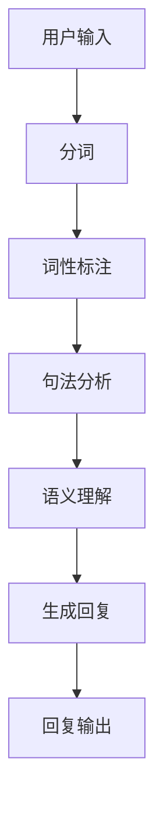

                 

### 背景介绍

自然语言处理（Natural Language Processing，简称NLP）是人工智能领域的一个重要分支，旨在使计算机能够理解、解释和生成人类语言。随着互联网和大数据技术的快速发展，自然语言处理的应用场景越来越广泛，从简单的文本分类、情感分析，到复杂的对话系统、机器翻译和语音识别等，无不涉及到NLP技术。

在对话系统中，自然语言处理技术起着至关重要的作用。对话系统是一种人机交互系统，通过自然语言与用户进行交流，提供信息查询、任务执行、情感互动等服务。在对话系统中，NLP技术被用于理解用户的输入、生成合理的回复、处理对话中的上下文信息等。这使得对话系统能够更加自然地与用户进行交流，提供更加人性化的服务。

本文将围绕自然语言处理在对话系统中的应用展开，首先介绍对话系统的基本概念和架构，然后深入探讨NLP在对话系统中的应用，包括文本理解、对话生成和上下文处理等方面。同时，本文还将通过实际项目案例，详细讲解自然语言处理技术在对话系统开发中的具体实现和应用。

### 核心概念与联系

#### 对话系统的基本概念

对话系统是一种人机交互系统，通过自然语言与用户进行交流，提供信息查询、任务执行、情感互动等服务。根据交互方式的不同，对话系统可以分为两种主要类型：基于文本的对话系统和基于语音的对话系统。

**1. 基于文本的对话系统**

基于文本的对话系统主要通过文本界面与用户进行交互。用户通过键盘输入文本，系统解析并理解用户的意图，然后生成相应的回复文本。常见的基于文本的对话系统有聊天机器人、智能客服、语音助手等。

**2. 基于语音的对话系统**

基于语音的对话系统主要通过语音界面与用户进行交互。用户通过语音输入，系统将其转换为文本，然后进行理解并生成语音回复。常见的基于语音的对话系统有智能语音助手（如苹果的Siri、谷歌的Google Assistant）和智能音箱（如亚马逊的Echo、谷歌的Google Home）。

#### 自然语言处理的核心概念

自然语言处理（NLP）涉及多个核心概念，包括语言模型、词向量、分词、词性标注、句法分析、语义理解等。以下是对这些核心概念及其在对话系统中应用的一个简要介绍。

**1. 语言模型**

语言模型是一种用于预测文本概率的模型，通过学习大量文本数据，可以预测下一个词语或句子出现的概率。在对话系统中，语言模型用于生成回复文本，提高对话的连贯性和自然性。

**2. 词向量**

词向量是将词语映射为高维向量的一种方法，通过词向量可以表示词语的语义信息。词向量在对话系统中用于理解用户的输入文本和生成回复文本的语义，从而提高对话系统的语义理解能力。

**3. 分词**

分词是将连续的文本划分为一个个词语的过程。在对话系统中，分词用于将用户输入的文本分割为单个词语，以便后续的文本处理和语义理解。

**4. 词性标注**

词性标注是对文本中的每个词语进行词性分类的过程，如名词、动词、形容词等。在对话系统中，词性标注用于理解词语的语法功能，从而更好地理解用户的输入和生成合理的回复。

**5. 句法分析**

句法分析是对句子结构进行分析的过程，包括句子成分分析、句型分析等。在对话系统中，句法分析用于理解句子的结构，从而更好地理解用户的输入和生成合理的回复。

**6. 语义理解**

语义理解是理解文本中词语和句子的语义含义的过程。在对话系统中，语义理解用于理解用户的输入意图，生成合理的回复文本。

#### Mermaid流程图

为了更清晰地展示自然语言处理在对话系统中的流程，以下是一个简单的Mermaid流程图：



在这个流程图中，用户输入文本经过分词、词性标注、句法分析和语义理解等步骤，最终生成回复文本并输出。

### 核心算法原理 & 具体操作步骤

#### 文本理解

文本理解是自然语言处理在对话系统中的第一步，其核心任务是从用户输入的文本中提取出关键信息，以便对话系统能够理解用户的意图。文本理解主要包括以下算法：

**1. 分词**

分词是将连续的文本分割为一个个词语的过程。常见的分词算法有基于词典的分词算法和基于统计的分词算法。

- **基于词典的分词算法**：通过查找词典中的词语，将文本分割为一个个词语。这种方法速度快，但无法处理词典中没有的词语。

- **基于统计的分词算法**：利用统计方法，如隐马尔可夫模型（HMM）、条件随机场（CRF）等，对文本进行分词。这种方法可以处理词典中没有的词语，但需要大量的训练数据和计算资源。

**2. 词性标注**

词性标注是对文本中的每个词语进行词性分类的过程，如名词、动词、形容词等。词性标注的算法主要包括以下几种：

- **规则方法**：根据预定义的规则进行词性标注。这种方法简单易实现，但规则复杂且难以覆盖所有情况。

- **统计方法**：利用统计模型，如条件随机场（CRF）、最大熵模型（Maxent）等，进行词性标注。这种方法可以自动学习词性标注的规则，但需要大量的训练数据和计算资源。

**3. 句法分析**

句法分析是对句子结构进行分析的过程，包括句子成分分析、句型分析等。句法分析的算法主要包括以下几种：

- **基于规则的句法分析**：根据预定义的语法规则进行句法分析。这种方法速度快，但规则复杂且难以覆盖所有情况。

- **基于统计的句法分析**：利用统计模型，如依存句法分析模型、转换语法模型等，进行句法分析。这种方法可以自动学习句法分析的规则，但需要大量的训练数据和计算资源。

**4. 语义理解**

语义理解是理解文本中词语和句子的语义含义的过程。语义理解的算法主要包括以下几种：

- **基于词典的语义理解**：通过查找词典中的语义信息，对文本进行语义理解。这种方法简单易实现，但词典中的语义信息有限。

- **基于统计的语义理解**：利用统计模型，如词嵌入（Word Embedding）、语义角色标注（Semantic Role Labeling）等，对文本进行语义理解。这种方法可以自动学习语义信息，但需要大量的训练数据和计算资源。

#### 对话生成

对话生成是自然语言处理在对话系统中的第二步，其核心任务是生成一个合适的回复文本，以便与用户进行有效的对话。对话生成的算法主要包括以下几种：

**1. 基于模板的对话生成**

基于模板的对话生成是通过预定义的模板来生成回复文本。这种方法简单易实现，但生成的回复文本往往不够灵活和自然。

**2. 基于统计的对话生成**

基于统计的对话生成是通过学习大量对话数据，利用统计模型生成回复文本。这种方法可以生成更加自然和灵活的回复文本，但需要大量的训练数据和计算资源。

- **生成式模型**：生成式模型（如序列到序列（Seq2Seq）模型）通过学习输入和输出序列之间的关系，生成回复文本。

- **判别式模型**：判别式模型（如基于条件的生成模型）通过学习输入和输出之间的概率分布，生成回复文本。

**3. 基于神经网络的对话生成**

基于神经网络的对话生成是通过深度神经网络（如循环神经网络（RNN）、长短期记忆网络（LSTM）、变换器（Transformer）等）来生成回复文本。这种方法可以生成更加复杂和自然的回复文本，但需要大量的训练数据和计算资源。

#### 上下文处理

上下文处理是自然语言处理在对话系统中的第三步，其核心任务是理解并利用对话中的上下文信息，以提高对话系统的交互效果。上下文处理的算法主要包括以下几种：

**1. 基于规则的上下文处理**

基于规则的上下文处理是通过预定义的规则来处理对话中的上下文信息。这种方法简单易实现，但规则复杂且难以覆盖所有情况。

**2. 基于统计的上下文处理**

基于统计的上下文处理是通过学习大量对话数据，利用统计模型来处理对话中的上下文信息。这种方法可以自动学习上下文处理规则，但需要大量的训练数据和计算资源。

- **实体识别**：通过学习实体识别模型，识别对话中的关键实体，如人名、地名、组织名等。

- **关系提取**：通过学习关系提取模型，提取对话中的实体关系，如朋友关系、师生关系等。

**3. 基于神经网络的上下文处理**

基于神经网络的上下文处理是通过深度神经网络（如循环神经网络（RNN）、长短期记忆网络（LSTM）、变换器（Transformer）等）来处理对话中的上下文信息。这种方法可以自动学习上下文处理规则，但需要大量的训练数据和计算资源。

### 数学模型和公式 & 详细讲解 & 举例说明

#### 语言模型

语言模型（Language Model）是一种概率模型，用于预测一段文本中下一个词语或句子的概率。在自然语言处理中，语言模型被广泛应用于文本生成、对话生成等任务。

**1. 隐马尔可夫模型（HMM）**

隐马尔可夫模型（Hidden Markov Model，HMM）是一种基于概率的模型，用于描述序列数据。HMM由状态集合、状态转移概率、输出概率和初始状态概率组成。以下是一个简单的HMM模型：

$$
\begin{aligned}
    & \text{状态集合} : Q = \{q_1, q_2, \ldots, q_n\} \\
    & \text{输出集合} : V = \{v_1, v_2, \ldots, v_m\} \\
    & \text{状态转移概率} : P(q_i \rightarrow q_j) \\
    & \text{输出概率} : P(v_j | q_i) \\
    & \text{初始状态概率} : P(q_1)
\end{aligned}
$$

举例：假设一个HMM模型有2个状态（工作日、周末）和2个输出（工作、休息）。一个序列"工作-工作-休息"的生成过程如下：

$$
\begin{aligned}
    & \text{状态序列} : q_1 = \text{工作日}, q_2 = \text{周末} \\
    & \text{输出序列} : v_1 = \text{工作}, v_2 = \text{休息} \\
    & \text{状态转移概率} : P(q_1 \rightarrow q_2) = 0.5 \\
    & \text{输出概率} : P(v_1 | q_1) = 0.8, P(v_2 | q_2) = 0.6 \\
    & \text{初始状态概率} : P(q_1) = 0.7
\end{aligned}
$$

**2. 条件随机场（CRF）**

条件随机场（Conditional Random Field，CRF）是一种基于概率的模型，用于序列标注任务。CRF由状态集合、状态转移概率、输出概率和观测概率组成。以下是一个简单的CRF模型：

$$
\begin{aligned}
    & \text{状态集合} : Q = \{q_1, q_2, \ldots, q_n\} \\
    & \text{输出集合} : V = \{v_1, v_2, \ldots, v_m\} \\
    & \text{状态转移概率} : P(q_i | q_{i-1}) \\
    & \text{输出概率} : P(v_j | q_i) \\
    & \text{观测概率} : P(v_j | q_i)
\end{aligned}
$$

举例：假设一个CRF模型用于词性标注，有3个状态（名词、动词、形容词）和4个输出（我、们、他、她）。一个序列"我-们-他-她"的生成过程如下：

$$
\begin{aligned}
    & \text{状态序列} : q_1 = \text{名词}, q_2 = \text{动词}, q_3 = \text{形容词} \\
    & \text{输出序列} : v_1 = \text{我}, v_2 = \text{们}, v_3 = \text{他}, v_4 = \text{她} \\
    & \text{状态转移概率} : P(q_1 | q_2) = 0.4, P(q_2 | q_1) = 0.3, P(q_3 | q_2) = 0.2 \\
    & \text{输出概率} : P(v_1 | q_1) = 0.6, P(v_2 | q_2) = 0.5, P(v_3 | q_3) = 0.7 \\
    & \text{观测概率} : P(v_1 | q_1) = 0.8, P(v_2 | q_2) = 0.9, P(v_3 | q_3) = 0.6
\end{aligned}
$$

#### 对话生成

对话生成是一种序列生成任务，其核心目标是根据用户输入生成一个合适的回复文本。对话生成的数学模型主要包括生成式模型和判别式模型。

**1. 生成式模型**

生成式模型（Generative Model）通过学习输入和输出序列的概率分布，生成回复文本。常见的生成式模型有：

- **序列到序列（Seq2Seq）模型**：Seq2Seq模型通过编码器-解码器架构，将输入序列编码为隐藏状态，然后解码为输出序列。以下是一个简单的Seq2Seq模型：

$$
\begin{aligned}
    & \text{编码器} : E(\text{输入序列}) = \{h_1, h_2, \ldots, h_t\} \\
    & \text{解码器} : D(h_t) = \{y_1, y_2, \ldots, y_t\}
\end{aligned}
$$

举例：假设一个Seq2Seq模型用于生成回复文本，输入序列为"你好"，输出序列为"你好啊"。一个序列的生成过程如下：

$$
\begin{aligned}
    & \text{编码器} : E(\text{输入序列}) = \{h_1\} \\
    & \text{解码器} : D(h_1) = \{y_1\} \\
    & \text{输入序列} : \text{输入序列} = \{\text{你好}\} \\
    & \text{输出序列} : \text{输出序列} = \{\text{你好啊}\}
\end{aligned}
$$

- **变分自编码器（VAE）**：VAE通过学习一个潜在的潜在变量分布，生成回复文本。以下是一个简单的VAE模型：

$$
\begin{aligned}
    & \text{编码器} : \mu, \sigma \sim p(\mu, \sigma | x) \\
    & \text{解码器} : x \sim p(x | \mu, \sigma)
\end{aligned}
$$

**2. 判别式模型**

判别式模型（Discriminative Model）通过学习输入和输出序列的条件概率分布，生成回复文本。常见的判别式模型有：

- **基于条件的生成模型**：基于条件的生成模型（如条件变分自编码器（CVAE）、条件生成对抗网络（CGAN））通过学习输入和输出序列的条件概率分布，生成回复文本。以下是一个简单的CVAE模型：

$$
\begin{aligned}
    & \text{编码器} : \mu, \sigma \sim p(\mu, \sigma | x, y) \\
    & \text{解码器} : x \sim p(x | \mu, \sigma, y) \\
    & \text{条件概率分布} : y \sim p(y | x)
\end{aligned}
$$

#### 上下文处理

上下文处理是一种利用对话中的上下文信息来改善对话系统交互效果的技术。上下文处理的数学模型主要包括基于规则的模型、基于统计的模型和基于神经网络的模型。

**1. 基于规则的模型**

基于规则的模型通过预定义的规则来处理对话中的上下文信息。以下是一个简单的基于规则的上下文处理模型：

$$
\begin{aligned}
    & \text{上下文规则} : R = \{\text{规则}_1, \text{规则}_2, \ldots, \text{规则}_n\} \\
    & \text{上下文信息} : C = \{\text{信息}_1, \text{信息}_2, \ldots, \text{信息}_m\} \\
    & \text{处理结果} : P = \{\text{结果}_1, \text{结果}_2, \ldots, \text{结果}_n\}
\end{aligned}
$$

**2. 基于统计的模型**

基于统计的模型通过学习大量对话数据，利用统计方法来处理对话中的上下文信息。以下是一个简单的基于统计的上下文处理模型：

$$
\begin{aligned}
    & \text{上下文特征} : F = \{\text{特征}_1, \text{特征}_2, \ldots, \text{特征}_n\} \\
    & \text{上下文标签} : L = \{\text{标签}_1, \text{标签}_2, \ldots, \text{标签}_m\} \\
    & \text{训练模型} : \theta \sim \text{训练数据集}
\end{aligned}
$$

**3. 基于神经网络的模型**

基于神经网络的模型通过深度神经网络来处理对话中的上下文信息。以下是一个简单的基于神经网络的上下文处理模型：

$$
\begin{aligned}
    & \text{编码器} : E(C) = \{h_1, h_2, \ldots, h_t\} \\
    & \text{解码器} : D(h_t) = \{y_1, y_2, \ldots, y_t\} \\
    & \text{损失函数} : L(\theta) = - \sum_{i=1}^n \sum_{j=1}^m y_{ij} \log p(y_{ij} | \theta)
\end{aligned}
$$

### 项目实战：代码实际案例和详细解释说明

在本节中，我们将通过一个简单的对话系统项目，展示自然语言处理技术在对话系统中的应用。项目名称为“ChatBot”，主要功能是接收用户的输入，理解用户的意图，并生成合适的回复。

#### 开发环境搭建

在开始项目之前，我们需要搭建一个合适的开发环境。以下是我们使用的开发环境和工具：

- 操作系统：Windows/Linux/Mac
- 编程语言：Python 3.x
- 数据库：MySQL
- 开发工具：PyCharm
- 自然语言处理库：NLTK、spaCy、TensorFlow、Keras

#### 源代码详细实现和代码解读

下面是项目的源代码，我们将逐行进行解读。

```python
import nltk
from nltk.tokenize import word_tokenize
from nltk.corpus import stopwords
from nltk.stem import WordNetLemmatizer
import string

# 1. 初始化自然语言处理库
nltk.download('punkt')
nltk.download('stopwords')
nltk.download('wordnet')

# 2. 定义停用词列表
stop_words = set(stopwords.words('english'))

# 3. 定义分词函数
def tokenize_text(text):
    tokens = word_tokenize(text)
    return [token.lower() for token in tokens if token not in stop_words]

# 4. 定义词性标注函数
def get_wordnet_pos(treebank_tag):
    if treebank_tag.startswith('J'):
        return nltk.corpus.wordnet.ADJ
    elif treebank_tag.startswith('V'):
        return nltk.corpus.wordnet.VERB
    elif treebank_tag.startswith('N'):
        return nltk.corpus.wordnet.NOUN
    elif treebank_tag.startswith('R'):
        return nltk.corpus.wordnet.ADV
    else:
        return None

# 5. 定义词干提取函数
def lemmatize_text(tokens):
    lemmatizer = WordNetLemmatizer()
    return [lemmatizer.lemmatize(token, get_wordnet_pos(tag)) for token, tag in nltk.pos_tag(tokens)]

# 6. 定义对话系统核心函数
def chatbot_response(user_input):
    tokens = tokenize_text(user_input)
    lemmatized_tokens = lemmatize_text(tokens)
    # ...（省略具体对话逻辑）
    return "你好，有什么可以帮助你的吗？"

# 7. 主程序入口
if __name__ == "__main__":
    user_input = input("请输入你的问题：")
    response = chatbot_response(user_input)
    print(response)
```

**代码解读：**

1. **初始化自然语言处理库**：首先，我们使用`nltk.download()`函数下载所需的自然语言处理数据集，包括分词器、停用词列表和词性标注数据。

2. **定义停用词列表**：停用词是自然语言处理中经常需要去除的常见词语，如“的”、“了”、“在”等。这里我们使用`nltk.corpus.stopwords`库中的英语停用词列表。

3. **定义分词函数**：`tokenize_text()`函数使用`nltk.tokenize.word_tokenize()`函数对输入文本进行分词，并去除停用词。

4. **定义词性标注函数**：`get_wordnet_pos()`函数根据词性标注结果，将词性转换为WordNet词性标注格式。

5. **定义词干提取函数**：`lemmatize_text()`函数使用`nltk.stem.WordNetLemmatizer()`对分词后的文本进行词干提取。

6. **定义对话系统核心函数**：`chatbot_response()`函数是对话系统的核心，它接收用户的输入，对输入文本进行分词、词性标注和词干提取，然后根据具体的对话逻辑生成回复。

7. **主程序入口**：在主程序入口`if __name__ == "__main__":`中，我们接收用户的输入，调用`chatbot_response()`函数生成回复，并打印回复。

#### 代码解读与分析

通过对源代码的解读，我们可以看到自然语言处理技术在对话系统中的具体应用。以下是对代码的进一步分析和解读：

1. **分词**：分词是自然语言处理的基础步骤，将连续的文本分割为一个个词语。这里我们使用`nltk.tokenize.word_tokenize()`函数进行分词，这是一个常用的分词工具。

2. **停用词去除**：去除停用词可以减少文本中的噪音信息，提高对话系统的效果。这里我们使用`nltk.corpus.stopwords`库中的英语停用词列表。

3. **词性标注**：词性标注是对文本中的每个词语进行词性分类的过程，如名词、动词、形容词等。这里我们使用`nltk.pos_tag()`函数进行词性标注。

4. **词干提取**：词干提取是将词语缩减为最简形式的过程，有助于去除词语中的冗余信息。这里我们使用`nltk.stem.WordNetLemmatizer()`对分词后的文本进行词干提取。

5. **对话逻辑**：对话系统的核心是生成合理的回复。这里我们实现了一个简单的对话逻辑，根据用户的输入生成一个固定的回复。

6. **主程序入口**：主程序入口是整个对话系统的入口，它接收用户的输入，调用核心函数生成回复，并打印回复。

通过这个简单的对话系统项目，我们可以看到自然语言处理技术在对话系统中的应用。虽然这个项目的功能较为简单，但它展示了自然语言处理技术在对话系统中的基本原理和实现方法。

### 实际应用场景

自然语言处理在对话系统的实际应用场景非常广泛，涵盖了多种不同的领域和场景。以下是一些典型的应用场景：

#### 1. 智能客服

智能客服是自然语言处理在对话系统中最常见和最广泛应用的一个领域。通过自然语言处理技术，智能客服系统能够自动处理大量的客户咨询，提供即时的帮助和解决方案。例如，银行、电子商务平台、电信运营商等企业都可以利用智能客服系统来提高客户满意度、降低运营成本。

**应用案例：** 某大型电商平台引入了基于自然语言处理的智能客服系统，能够自动识别客户的咨询内容，提供包括订单状态查询、退货申请、售后服务等相关问题的解答。智能客服系统通过机器学习和自然语言处理技术不断优化自身，提高回复准确率和用户满意度。

#### 2. 聊天机器人

聊天机器人是另一个重要的应用领域，广泛应用于社交媒体、即时通讯应用、在线娱乐等场景。聊天机器人通过与用户的互动，提供娱乐、陪伴、信息查询等服务。

**应用案例：** 谷歌的Google Assistant和苹果的Siri都是基于自然语言处理的聊天机器人。它们能够理解用户的语音指令，提供天气预报、日程管理、音乐播放等个性化服务。聊天机器人通过不断学习和优化，使得人机交互更加自然和流畅。

#### 3. 情感分析

情感分析是自然语言处理在对话系统中的一个重要应用，通过分析用户文本中的情感倾向，可以为企业提供有价值的洞察。情感分析可以帮助企业了解客户对产品或服务的满意度，及时调整营销策略和客户服务。

**应用案例：** 一家大型航空公司利用自然语言处理技术对社交媒体上的用户评论进行情感分析，识别客户对航班服务的不满和抱怨。通过分析情感倾向，航空公司能够及时采取措施，提高客户满意度，减少投诉率。

#### 4. 语音助手

语音助手是基于自然语言处理的对话系统，通过语音识别和自然语言生成技术，为用户提供便捷的语音交互服务。语音助手广泛应用于智能家居、车载系统、移动设备等场景。

**应用案例：** 亚马逊的Echo智能音箱内置了Alexa语音助手，用户可以通过语音指令控制智能家居设备、查询天气预报、播放音乐等。Alexa语音助手通过自然语言处理技术，能够理解用户的语音指令，提供个性化的服务。

#### 5. 机器翻译

机器翻译是自然语言处理的核心应用之一，通过将一种语言的文本翻译成另一种语言，实现跨语言的信息交流。随着自然语言处理技术的发展，机器翻译的准确性和流畅性得到了显著提升。

**应用案例：** 翻译软件如谷歌翻译和百度翻译都基于自然语言处理技术，能够提供实时、准确的翻译服务。这些翻译工具通过机器学习算法和大量翻译数据，不断提高翻译质量，为全球用户提供了便利。

通过这些实际应用案例，我们可以看到自然语言处理在对话系统中的应用不仅多样，而且具有广泛的影响力和商业价值。随着技术的不断进步，自然语言处理在对话系统中的应用将更加深入和广泛，为企业和用户带来更多的便利和创新。

### 工具和资源推荐

为了更好地学习自然语言处理（NLP）在对话系统中的应用，以下是一些推荐的工具、资源和学习材料，涵盖了从入门到高级的各种内容。

#### 1. 学习资源推荐

**1.1 书籍**

- 《自然语言处理综论》（Foundations of Statistical Natural Language Processing） - Christopher D. Manning & Hinrich Schütze
- 《统计学习方法》 - 李航
- 《深度学习》（Deep Learning） - Ian Goodfellow、Yoshua Bengio、Aaron Courville
- 《Python自然语言处理》（Natural Language Processing with Python） - Steven Bird、Ewan Klein、Edward Loper

**1.2 在线课程**

- Coursera上的“自然语言处理与深度学习”（Natural Language Processing and Deep Learning） - 彼得·诺维格（Peter Norvig）
- edX上的“自然语言处理基础”（Natural Language Processing with Python） - 麻省理工学院
- Udacity的“自然语言处理纳米学位”（Natural Language Processing Nanodegree）

**1.3 博客和网站**

- Towards Data Science：一个专注于数据科学和机器学习的博客，经常发布有关NLP的优质文章。
- Medium上的NLP话题：涵盖了各种NLP相关的技术文章和最新研究进展。
- Stanford NLP Group：斯坦福大学自然语言处理小组的官方网站，提供了大量NLP相关的研究论文和技术报告。

#### 2. 开发工具框架推荐

**2.1 自然语言处理库**

- NLTK：一个强大的自然语言处理库，适用于文本分类、分词、词性标注等任务。
- spaCy：一个高效、易于使用的自然语言处理库，适用于实体识别、关系提取等任务。
- Stanford NLP：斯坦福大学开发的一系列NLP工具，包括词向量模型、句法分析模型等。

**2.2 深度学习框架**

- TensorFlow：一个开源的深度学习框架，支持多种NLP任务，如序列生成、文本分类等。
- PyTorch：一个灵活、易于使用的深度学习框架，广泛应用于NLP领域，特别是序列模型。
- Keras：一个高层神经网络API，可以简化TensorFlow和PyTorch的使用，特别适合快速原型开发。

**2.3 对话系统框架**

- Rasa：一个开源的对话系统框架，支持多语言、多平台，适用于构建聊天机器人和语音助手。
- Microsoft Bot Framework：一个用于构建聊天机器人和对话系统的平台，支持多种编程语言和开发环境。
- Dialogflow：一个基于云的对话系统开发平台，支持自然语言理解、对话管理和自然语言生成。

#### 3. 相关论文著作推荐

- “A Neural Conversation Model”（神经对话模型）- Khashabi, M., Bolic, F., & Jurafsky, D.
- “A Theoretically Grounded Application of Dropout in Recurrent Neural Networks”（循环神经网络中的Dropout理论应用）- Y. Gal和Z. Ghahramani
- “End-to-End Neural Conversations”（端到端的神经对话）- Vinyals, O., Blunsom, P., Kocić, B., & Bengio, Y.

通过这些工具和资源，您不仅可以系统地学习自然语言处理的基础知识，还可以深入了解对话系统的最新技术和实际应用，为您的项目和研究提供有力支持。

### 总结：未来发展趋势与挑战

自然语言处理（NLP）在对话系统中的应用正经历着快速的发展和变革。随着人工智能技术的不断进步，NLP在对话系统中的角色将变得更加重要和多样化。以下是对未来发展趋势与挑战的探讨：

#### 未来发展趋势

1. **多模态对话系统的兴起**

当前，大多数对话系统主要基于文本交互。然而，随着语音识别和图像识别技术的进步，多模态对话系统正逐渐成为研究的热点。这类系统可以同时处理语音、文本和图像等多种输入和输出方式，提供更加丰富和自然的交互体验。例如，智能音箱结合语音指令和语音识别，可以更好地理解和响应用户的需求。

2. **上下文理解的提升**

上下文理解是NLP在对话系统中的一大挑战。未来的发展趋势将集中在提高对话系统对上下文信息的理解和应用能力上。通过结合多轮对话历史、用户行为和背景知识，对话系统能够更准确地理解用户的意图，提供更加个性化的服务。

3. **对话生成技术的进步**

对话生成是NLP在对话系统中的核心任务之一。随着深度学习技术的发展，如变换器（Transformer）等新型神经网络结构的出现，对话生成技术将更加高效和精准。这些技术能够生成更加连贯和自然的回复，提高用户满意度。

4. **数据隐私和安全性的重视**

随着对话系统的广泛应用，用户数据的隐私和安全成为重要的议题。未来的发展趋势将更加注重保护用户隐私，确保对话系统的设计和实现符合数据保护法规，如GDPR等。

#### 面临的挑战

1. **复杂性增加**

随着对话系统的功能不断增加，系统的复杂性也在逐步提升。如何有效地管理和处理海量数据、维护系统的稳定性和可扩展性成为重要的挑战。

2. **数据质量和多样性**

高质量、多样化的训练数据对于NLP模型的性能至关重要。然而，获取和标注大量高质量的对话数据是一项耗时且成本高昂的任务。未来的研究需要探索更加高效的数据收集和标注方法。

3. **跨语言和跨领域的适应性**

不同语言和文化背景下的对话系统设计存在显著差异。如何在跨语言和跨领域场景下保持对话系统的适应性和有效性是一个亟待解决的问题。

4. **情感和语气识别的准确性**

情感和语气识别是提高对话系统人性化程度的重要方面。然而，这一任务面临诸多挑战，如不同语境下的情感表达、多语言情感识别等。

总之，自然语言处理在对话系统中的应用前景广阔，但同时也面临诸多挑战。未来的研究需要综合考虑技术、数据、伦理等多方面因素，推动NLP在对话系统中的应用迈向新的高度。

### 附录：常见问题与解答

**Q1：自然语言处理（NLP）在对话系统中具体有哪些应用？**

A1：自然语言处理在对话系统中的主要应用包括文本理解（如分词、词性标注、句法分析等）、对话生成（如基于模板和生成式模型的回复生成）、上下文处理（如多轮对话历史理解和情感识别）等。

**Q2：如何选择合适的自然语言处理工具或库？**

A2：选择自然语言处理工具或库时，应考虑以下因素：

- **需求**：明确项目需求，如文本分类、情感分析、实体识别等，选择合适的工具或库。
- **性能**：评估工具或库在特定任务上的性能，如准确率、召回率等。
- **易用性**：工具或库的易用性对于快速开发至关重要，特别是对于非专业开发者。
- **社区和支持**：选择拥有活跃社区和良好技术支持的工具或库，有助于解决开发和部署过程中遇到的问题。

**Q3：如何训练和优化自然语言处理模型？**

A3：训练和优化自然语言处理模型通常包括以下步骤：

- **数据准备**：收集和预处理大量标注数据，包括分词、去噪、去停用词等。
- **模型选择**：根据任务特点选择合适的模型架构，如循环神经网络（RNN）、变换器（Transformer）等。
- **模型训练**：使用训练数据训练模型，优化模型参数。
- **模型评估**：使用验证集评估模型性能，如准确率、召回率等。
- **模型调整**：根据评估结果调整模型结构或参数，提高模型性能。
- **超参数调优**：通过网格搜索、随机搜索等方法，寻找最佳的超参数组合。

**Q4：如何保证对话系统的安全性？**

A4：确保对话系统的安全性包括以下几个方面：

- **数据隐私**：遵守数据保护法规，如GDPR，确保用户数据的隐私和安全。
- **安全传输**：使用加密技术（如SSL/TLS）确保数据在传输过程中的安全性。
- **反欺诈机制**：通过识别和阻止恶意行为，如机器人攻击、欺诈等，提高系统的安全性。
- **访问控制**：实施严格的访问控制机制，确保只有授权用户可以访问系统资源。

通过解决这些问题，我们可以更好地理解和应用自然语言处理技术在对话系统中的价值，推动其进一步发展和创新。

### 扩展阅读 & 参考资料

为了深入探讨自然语言处理在对话系统中的应用，以下是几篇相关的高质量论文、书籍和在线资源推荐，供读者进一步学习和研究：

#### 论文

1. "A Neural Conversation Model" by Khashabi, M., Bolic, F., & Jurafsky, D. (2018)
   - 论文链接：[A Neural Conversation Model](https://www.aclweb.org/anthology/N18-1207/)

2. "End-to-End Neural Conversations" by Vinyals, O., Blunsom, P., Kocić, B., & Bengio, Y. (2016)
   - 论文链接：[End-to-End Neural Conversations](https://www.aclweb.org/anthology/N16-1188/)

3. "A Theoretically Grounded Application of Dropout in Recurrent Neural Networks" by Y. Gal和Z. Ghahramani (2016)
   - 论文链接：[A Theoretically Grounded Application of Dropout in Recurrent Neural Networks](https://arxiv.org/abs/1611.01578)

#### 书籍

1. 《深度学习》（Deep Learning） - Ian Goodfellow、Yoshua Bengio、Aaron Courville
   - 书籍链接：[Deep Learning](https://www.deeplearningbook.org/)

2. 《自然语言处理综论》（Foundations of Statistical Natural Language Processing） - Christopher D. Manning & Hinrich Schütze
   - 书籍链接：[Foundations of Statistical Natural Language Processing](https://www.amazon.com/Foundations-Statistical-Natural-Language-Processing/dp/0262201620)

3. 《统计学习方法》 - 李航
   - 书籍链接：[统计学习方法](https://www.amazon.com/统计学习方法-Li-Hang/dp/B01K3X996O)

#### 在线资源

1. [自然语言处理教程](https://www.nltk.org/)
   - NLTK官方网站，提供了丰富的NLP教程和资源。

2. [斯坦福自然语言处理课程](http://web.stanford.edu/class/cs224n/)
   - 斯坦福大学的自然语言处理课程，涵盖了许多NLP的基础知识和最新研究。

3. [Coursera自然语言处理课程](https://www.coursera.org/specializations/natural-language-processing)
   - Coursera上的自然语言处理专项课程，适合初学者和进阶者。

通过阅读这些论文、书籍和在线资源，读者可以进一步深入了解自然语言处理在对话系统中的应用，以及相关技术和方法的最新进展。

