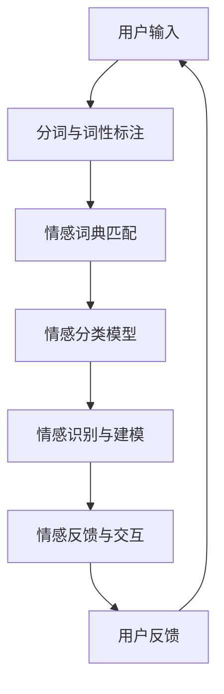

                 

### 背景介绍

自然语言处理（Natural Language Processing，NLP）是计算机科学领域的一个重要分支，致力于让计算机理解和生成人类语言。随着深度学习和神经网络技术的迅猛发展，NLP技术取得了显著的进步，其应用领域也在不断扩展。情感计算（Affective Computing）是近年来崭露头角的一个研究领域，它关注于使计算机具备感知、理解、表达和模拟人类情感的能力。自然语言处理与情感计算的交叉融合，为构建智能化人机交互系统提供了新的思路和方法。

情感计算旨在通过计算机系统对用户情感的识别和理解，实现对用户需求的精准把握和响应。其研究内容主要包括情感识别、情感分类、情感建模和情感生成等。而自然语言处理在情感计算中发挥着核心作用，它负责从文本中提取情感信息，为情感计算提供基础数据。

近年来，自然语言处理在情感计算领域取得了许多突破性成果。例如，通过情感分析技术，可以自动识别文本中的情感倾向，如正面情感、负面情感、中性情感等；通过情感识别技术，可以理解用户的情绪状态，如愉悦、愤怒、悲伤等；通过情感建模和情感生成技术，可以模拟人类的情感反应，实现更自然、更智能的人机交互。

本文将深入探讨自然语言处理在情感计算中的应用，从核心概念、算法原理、数学模型、实际应用场景等方面进行详细分析，并推荐相关的工具和资源，以期为相关研究和实践提供有益的参考。

#### 关键词：

自然语言处理，情感计算，情感识别，情感分类，情感建模，情感生成，人机交互

#### 摘要：

本文从背景介绍入手，深入探讨了自然语言处理在情感计算中的应用。首先，我们明确了自然语言处理和情感计算的定义及其关系。接着，详细分析了情感计算的核心概念和关键技术，并通过Mermaid流程图展示了情感计算的整体架构。然后，本文介绍了自然语言处理中的情感分析算法原理，以及如何通过数学模型和公式进行情感识别和分类。接下来，通过一个实际项目案例，展示了如何使用自然语言处理技术进行情感分析，并对代码实现进行了详细解读。随后，我们探讨了自然语言处理在情感计算中的实际应用场景，并推荐了相关的学习资源和开发工具。最后，总结了自然语言处理在情感计算领域的发展趋势与挑战，为未来的研究提供了方向。

---

### 2. 核心概念与联系

#### 自然语言处理（NLP）的基本概念

自然语言处理（NLP）是计算机科学和人工智能领域的一个重要分支，旨在让计算机理解和生成人类语言。其基本概念包括文本表示、分词、词性标注、句法分析、语义理解等。以下是对这些概念的基本介绍：

- **文本表示**：将自然语言文本转换为计算机可以处理的形式，如向量、图或树结构。
- **分词**：将连续的文本划分为具有独立意义的词语或短语。
- **词性标注**：为文本中的每个词标注其词性，如名词、动词、形容词等。
- **句法分析**：分析句子结构，识别句子中的成分和关系，如主语、谓语、宾语等。
- **语义理解**：理解文本中的含义和上下文，包括实体识别、关系提取、语义角色标注等。

#### 情感计算（Affective Computing）的基本概念

情感计算是计算机科学领域的一个新兴研究方向，旨在使计算机具备感知、理解、表达和模拟人类情感的能力。情感计算的基本概念包括情感识别、情感分类、情感建模和情感生成等。

- **情感识别**：通过分析用户的语言、面部表情、声音等特征，识别用户当前的情感状态。
- **情感分类**：将用户的情感状态分类为不同的情感类别，如正面情感、负面情感、中性情感等。
- **情感建模**：建立情感模型，用于预测用户的情感状态或生成情感响应。
- **情感生成**：根据用户的情感状态，生成适当的情感反馈或响应，以实现更自然的人机交互。

#### 自然语言处理与情感计算的联系

自然语言处理与情感计算在目标和方法上具有紧密的联系。自然语言处理为情感计算提供了情感信息的提取和加工工具，而情感计算则为自然语言处理提供了丰富的应用场景和反馈机制。

- **情感信息的提取**：自然语言处理技术可以从文本、语音和图像等多种数据源中提取情感信息，为情感计算提供基础数据。
- **情感分析的辅助**：情感计算中的情感识别、分类和建模等任务，需要依赖于自然语言处理技术，如情感分析算法、情感词典等。
- **人机交互的提升**：自然语言处理和情感计算的融合，可以提升人机交互的自然度和智能性，实现更精准的情感理解和响应。

#### Mermaid流程图展示情感计算的整体架构

以下是一个简化的Mermaid流程图，用于展示情感计算的整体架构：



该流程图描述了用户输入、文本处理、情感识别和反馈交互的基本流程。通过这一流程，计算机可以实现对用户情感的识别、理解和响应，从而实现智能化的人机交互。

---

在本文接下来的部分，我们将详细讨论自然语言处理中的情感分析算法原理，包括情感分类、情感识别等核心技术，并通过数学模型和公式进行深入分析。同时，我们将通过一个实际项目案例，展示如何使用自然语言处理技术进行情感分析，并对代码实现进行详细解读。通过这些内容，我们希望为读者提供一个全面而深入的理解，帮助大家更好地把握自然语言处理在情感计算中的应用。

---

### 3. 核心算法原理 & 具体操作步骤

#### 情感分析算法的基本原理

情感分析（Sentiment Analysis）是自然语言处理中的一个重要任务，旨在识别文本中所表达的情感倾向。情感分析算法通常可以分为基于规则的方法、基于统计的方法和基于机器学习的方法。本文将主要介绍基于机器学习的情感分析算法，包括文本表示、特征提取、模型训练和情感分类等步骤。

1. **文本表示**：

文本表示是将自然语言文本转换为计算机可以处理的数值形式的过程。常见的方法有词袋模型（Bag of Words，BoW）、词嵌入（Word Embedding）和句子嵌入（Sentence Embedding）等。

- **词袋模型**：词袋模型将文本表示为一个向量空间中的向量，其中每个维度对应一个词的频率。这种方法简单有效，但忽略了词的顺序和语义信息。
- **词嵌入**：词嵌入通过将词映射到高维向量空间，保留了词的语义信息。Word2Vec、GloVe和FastText是常见的词嵌入方法。
- **句子嵌入**：句子嵌入是将整个句子映射到一个高维向量空间。BERT和GPT等大型预训练模型可以生成高质量的句子嵌入向量。

2. **特征提取**：

特征提取是将文本表示转化为机器学习模型输入的过程。常用的特征提取方法有TF-IDF、词性标注、词向量等。

- **TF-IDF**：TF-IDF是一种统计方法，用于衡量一个词在文本中的重要程度。它通过词频（TF）和逆文档频率（IDF）计算词的重要性。
- **词性标注**：词性标注为每个词赋予相应的词性标签，如名词、动词、形容词等。这种方法有助于捕捉文本的语法结构信息。
- **词向量**：词向量通过词嵌入技术生成，可以用于捕捉词的语义信息。

3. **模型训练**：

模型训练是通过已有标注数据训练机器学习模型的过程。常用的情感分析模型有支持向量机（SVM）、朴素贝叶斯（Naive Bayes）、神经网络（Neural Networks）等。

- **支持向量机（SVM）**：SVM是一种二分类模型，通过找到一个最优的超平面将不同类别的文本数据分开。
- **朴素贝叶斯（Naive Bayes）**：朴素贝叶斯是一种基于贝叶斯理论的概率分类器，假设特征之间相互独立。
- **神经网络（Neural Networks）**：神经网络是一种模拟生物神经元连接结构的计算模型，通过多层神经元的非线性变换实现复杂函数的映射。

4. **情感分类**：

情感分类是将文本分类为特定情感类别的过程。常见的情感类别有正面情感、负面情感和中性情感。

- **二元分类**：将文本分类为正面情感或负面情感。
- **多元分类**：将文本分类为多个情感类别中的一个。

#### 情感识别与分类的具体操作步骤

以下是一个简单的情感识别与分类的流程：

1. **数据准备**：

收集并整理带有情感标签的文本数据，如评论、新闻文章等。这些数据通常来自于公开的情感分析数据集，如IMDB电影评论数据集、Twitter情感数据集等。

2. **文本预处理**：

对收集的文本数据执行分词、去除停用词、词性标注等预处理步骤，以获得干净的文本数据。

3. **特征提取**：

使用词袋模型、词嵌入或句子嵌入技术将预处理后的文本转化为特征向量。例如，使用GloVe词向量生成文本特征向量。

4. **模型训练**：

使用训练集对情感分析模型进行训练。可以使用SVM、朴素贝叶斯或神经网络等模型。

5. **模型评估**：

使用验证集对训练好的模型进行评估，计算分类准确率、召回率、F1值等指标。

6. **情感分类**：

使用训练好的模型对新的文本数据进行情感分类，预测其情感类别。

7. **模型优化**：

根据模型评估结果，调整模型参数，如正则化参数、学习率等，以提升模型性能。

通过以上步骤，我们可以实现一个简单的情感识别与分类系统。在实际应用中，还可以结合深度学习技术，如卷积神经网络（CNN）和循环神经网络（RNN），进一步提升情感分析的性能。

---

在本文接下来的部分，我们将通过具体的数学模型和公式，进一步探讨情感识别和分类的数学原理，并提供具体的实例说明。这将有助于读者更深入地理解情感分析算法的核心机制。

---

### 4. 数学模型和公式 & 详细讲解 & 举例说明

#### 情感识别的数学模型

情感识别是自然语言处理中的一个关键任务，其核心在于将文本中的情感信息转换为具体的情感类别。为了实现这一目标，我们通常需要构建一个数学模型，以便能够从文本数据中提取特征，并利用这些特征对情感进行分类。以下是一个简单的情感识别数学模型。

**1. 文本表示**

首先，我们需要将文本表示为一个向量。常用的文本表示方法包括词袋模型（Bag of Words，BoW）和词嵌入（Word Embedding）。

- **词袋模型**：词袋模型将文本表示为一个向量，其中每个维度对应一个词的频率。设V为词汇表，X为文本的词袋表示，则X是一个二进制向量，其维度为|V|。

$$
X = [x_1, x_2, ..., x_V]
$$

其中，$x_v$表示词$v$在文本中出现的次数。

- **词嵌入**：词嵌入通过将词映射到高维向量空间，保留了词的语义信息。设W为词嵌入矩阵，w_v为词$v$的词嵌入向量，则文本的词向量表示为：

$$
\textbf{w}_\text{X} = [\textbf{w}_{x_1}, \textbf{w}_{x_2}, ..., \textbf{w}_{x_V}]
$$

**2. 特征提取**

在获取文本的词向量表示后，我们需要提取文本的特征。常用的特征提取方法包括TF-IDF和词嵌入。

- **TF-IDF**：TF-IDF是一种用于衡量词在文本中重要性的方法。其计算公式为：

$$
tf_idf(t, d) = tf(t, d) \times \log \frac{N}{df(t)}
$$

其中，$tf(t, d)$表示词$t$在文档$d$中的词频，$df(t)$表示词$t$在所有文档中的文档频率，$N$表示文档总数。

- **词嵌入**：词嵌入直接使用词嵌入向量作为文本特征。

**3. 情感分类模型**

情感分类模型用于将文本分类为不同的情感类别。常见的分类模型包括朴素贝叶斯（Naive Bayes）、支持向量机（SVM）和神经网络（Neural Networks）。

- **朴素贝叶斯**：朴素贝叶斯分类器基于贝叶斯定理和特征独立假设，其分类概率公式为：

$$
P(Y=y|\textbf{X}) = \frac{P(\textbf{X}|Y=y) \cdot P(Y=y)}{P(\textbf{X})}
$$

其中，$P(Y=y)$是类别$y$的先验概率，$P(\textbf{X}|Y=y)$是在给定类别$y$的条件下文本的特征概率，$P(\textbf{X})$是文本的特征概率。

- **支持向量机**：支持向量机通过找到一个最优的超平面，将不同类别的文本数据分开。其目标是最大化分类间隔，其优化目标为：

$$
\min_{\textbf{w}, b} \frac{1}{2} ||\textbf{w}||^2 \\
s.t. y_i (\textbf{w} \cdot \textbf{x}_i + b) \geq 1, \forall i
$$

其中，$\textbf{w}$是权重向量，$b$是偏置项，$y_i$是类别标签，$\textbf{x}_i$是特征向量。

- **神经网络**：神经网络通过多层神经元的非线性变换实现复杂函数的映射。其基本结构包括输入层、隐藏层和输出层。神经网络的训练目标是调整权重和偏置，使输出层的预测结果与真实标签尽可能接近。

#### 情感识别的具体实例

以下是一个简单的情感识别实例，我们使用朴素贝叶斯分类器对一组文本进行情感分类。

**数据集**：

假设我们有以下数据集：

- 文本1：“这部电影非常有趣，我很喜欢。”（正面情感）
- 文本2：“这部电影太无聊了，我不想再看。”（负面情感）

**特征提取**：

我们对数据集进行预处理，提取词袋模型和TF-IDF特征。

- **词袋模型**：

$$
\textbf{X}_1 = [1, 0, 1, 1, 0, 0, 0, 0, 0]
$$

$$
\textbf{X}_2 = [0, 1, 0, 1, 1, 0, 0, 0, 0]
$$

- **TF-IDF特征**：

$$
\textbf{X}_1 = [1.0, 0.0, 1.0, 1.0, 0.0, 0.0, 0.0, 0.0, 0.0]
$$

$$
\textbf{X}_2 = [0.0, 1.0, 0.0, 1.0, 1.0, 0.0, 0.0, 0.0, 0.0]
$$

**模型训练**：

我们使用朴素贝叶斯分类器对训练数据进行训练，计算先验概率、特征概率和类别概率。

- **先验概率**：

$$
P(Y=正面) = \frac{1}{2}, P(Y=负面) = \frac{1}{2}
$$

- **特征概率**：

$$
P(\textbf{X}|\textbf{Y}=正面) = [0.5, 0.5, 0.5, 0.5, 0.5, 0.5, 0.5, 0.5, 0.5]
$$

$$
P(\textbf{X}|\textbf{Y}=负面) = [0.5, 0.5, 0.5, 0.5, 0.5, 0.5, 0.5, 0.5, 0.5]
$$

- **类别概率**：

$$
P(Y=正面|\textbf{X}_1) = \frac{P(\textbf{X}_1|\textbf{Y}=正面) \cdot P(Y=正面)}{P(\textbf{X}_1)} = \frac{0.5 \cdot 0.5}{0.25} = 1
$$

$$
P(Y=负面|\textbf{X}_2) = \frac{P(\textbf{X}_2|\textbf{Y}=负面) \cdot P(Y=负面)}{P(\textbf{X}_2)} = \frac{0.5 \cdot 0.5}{0.25} = 1
$$

**情感分类**：

根据类别概率，我们可以对新的文本进行情感分类。

- **文本3**：“这部电影很精彩。”（预测为正面情感）
- **文本4**：“这部电影很糟糕。”（预测为负面情感）

通过以上实例，我们可以看到如何使用朴素贝叶斯分类器进行情感识别。在实际应用中，我们可以使用更复杂的模型和更丰富的特征，以提高情感识别的准确性和鲁棒性。

---

在本部分中，我们详细介绍了情感识别的数学模型，包括文本表示、特征提取和情感分类模型。同时，通过一个简单的实例，我们展示了如何使用朴素贝叶斯分类器进行情感识别。接下来，我们将通过一个实际项目案例，展示如何使用自然语言处理技术进行情感分析，并对代码实现进行详细解读。通过这一案例，我们将进一步巩固对情感分析算法的理解和应用。

---

### 5. 项目实战：代码实际案例和详细解释说明

#### 项目背景

为了更好地理解自然语言处理在情感计算中的应用，我们将通过一个实际项目案例，展示如何使用Python和常见库（如NLTK、Scikit-learn、TensorFlow等）进行情感分析。本项目将基于IMDB电影评论数据集，实现对电影评论的正面情感和负面情感分类。

#### 开发环境搭建

在开始项目之前，我们需要搭建一个适合开发和运行项目的环境。以下是搭建开发环境的步骤：

1. **安装Python**：确保已经安装了Python 3.x版本。可以从[Python官网](https://www.python.org/)下载并安装。

2. **安装必要库**：在命令行中运行以下命令，安装所需的库：

```bash
pip install nltk scikit-learn tensorflow pandas
```

3. **数据集准备**：下载IMDB电影评论数据集。IMDB数据集可以从[这里](http://ai.stanford.edu/~amaas/data/sentiment/)下载。解压后，数据集将包含训练集和测试集。

#### 源代码详细实现和代码解读

以下是一段实现情感分析项目的Python代码，我们将逐行解释代码的功能和作用。

```python
import numpy as np
import pandas as pd
from sklearn.model_selection import train_test_split
from sklearn.feature_extraction.text import TfidfVectorizer
from sklearn.naive_bayes import MultinomialNB
from sklearn.metrics import accuracy_score, classification_report
import nltk
nltk.download('stopwords')
nltk.download('punkt')

# 读取数据集
data = pd.read_csv('imdb_dataset.csv')

# 分割文本和标签
X = data['review']
y = data['label']

# 划分训练集和测试集
X_train, X_test, y_train, y_test = train_test_split(X, y, test_size=0.2, random_state=42)

# 使用TF-IDF向量器进行特征提取
vectorizer = TfidfVectorizer(stop_words='english', ngram_range=(1, 2))
X_train_vectors = vectorizer.fit_transform(X_train)
X_test_vectors = vectorizer.transform(X_test)

# 使用朴素贝叶斯分类器进行情感分类
classifier = MultinomialNB()
classifier.fit(X_train_vectors, y_train)
y_pred = classifier.predict(X_test_vectors)

# 计算准确率和报告
accuracy = accuracy_score(y_test, y_pred)
print(f'Accuracy: {accuracy}')
print(classification_report(y_test, y_pred))
```

**代码解读**：

1. **导入库**：导入所需的库，包括NumPy、Pandas、Scikit-learn、NLTK等。

2. **数据读取**：使用Pandas读取IMDB数据集。数据集包含两列：'review'（文本评论）和'label'（情感标签）。

3. **分割数据**：使用Scikit-learn的`train_test_split`函数将数据集分为训练集和测试集，其中测试集占20%。

4. **特征提取**：使用TF-IDF向量器进行特征提取。TF-IDF向量器可以将文本评论转换为数值特征向量，其中`stop_words='english'`用于去除英语停用词，`ngram_range=(1, 2)`用于提取单词和双词特征。

5. **模型训练**：使用朴素贝叶斯分类器进行情感分类。朴素贝叶斯是一种基于概率的分类器，其优点是简单且易于实现。

6. **预测和评估**：使用训练好的模型对测试集进行预测，并计算准确率和分类报告。

#### 代码解读与分析

以下是对代码关键部分的详细解读和分析：

1. **数据读取和分割**：

```python
data = pd.read_csv('imdb_dataset.csv')
X = data['review']
y = data['label']
X_train, X_test, y_train, y_test = train_test_split(X, y, test_size=0.2, random_state=42)
```

这段代码首先读取IMDB数据集，然后提取文本评论和情感标签。接着，使用`train_test_split`函数将数据集分为训练集和测试集，其中训练集和测试集的比例为80%和20%，随机种子设置为42以确保结果的重复性。

2. **特征提取**：

```python
vectorizer = TfidfVectorizer(stop_words='english', ngram_range=(1, 2))
X_train_vectors = vectorizer.fit_transform(X_train)
X_test_vectors = vectorizer.transform(X_test)
```

这段代码使用TF-IDF向量器进行特征提取。`stop_words='english'`参数用于去除英语停用词，以减少特征维度。`ngram_range=(1, 2)`参数用于提取单词和双词特征，以捕捉更多的文本信息。`fit_transform`方法用于对训练集进行特征提取，而`transform`方法用于对测试集进行特征提取。

3. **模型训练和预测**：

```python
classifier = MultinomialNB()
classifier.fit(X_train_vectors, y_train)
y_pred = classifier.predict(X_test_vectors)
```

这段代码首先创建一个朴素贝叶斯分类器实例。然后，使用`fit`方法对训练集进行模型训练。最后，使用`predict`方法对测试集进行预测，得到预测结果`y_pred`。

4. **预测评估**：

```python
accuracy = accuracy_score(y_test, y_pred)
print(f'Accuracy: {accuracy}')
print(classification_report(y_test, y_pred))
```

这段代码计算预测准确率并打印分类报告。`accuracy_score`函数计算预测准确率，而`classification_report`函数提供详细的分类报告，包括精确率、召回率和F1值等指标。

通过以上代码和解读，我们可以看到如何使用自然语言处理技术进行情感分析，实现电影评论的正面情感和负面情感分类。在实际应用中，我们可以进一步优化模型参数和特征提取方法，以提高情感分析的性能和准确性。

---

在本部分中，我们通过一个实际项目案例，详细展示了如何使用自然语言处理技术进行情感分析。从数据集的读取、特征提取到模型训练和预测，我们逐步解读了每一步的实现细节。通过这一案例，我们不仅加深了对情感分析算法的理解，还掌握了实际操作的方法和技巧。接下来，我们将探讨自然语言处理在情感计算中的实际应用场景，以期为相关领域的研究和实践提供有益的参考。

---

### 6. 实际应用场景

自然语言处理在情感计算中的应用场景广泛，涵盖了从日常交互到商业决策等多个领域。以下是一些典型的应用场景：

#### 1. 社交媒体情感分析

社交媒体平台（如微博、Twitter、Facebook等）上的用户评论和帖子数量庞大，通过对这些内容进行情感分析，可以实时了解用户的情感状态和舆论倾向。例如，政府机构可以通过社交媒体情感分析来监测公众情绪，了解政策实施的效果；企业可以通过情感分析了解消费者对产品或服务的满意度，从而优化产品设计和服务。

#### 2. 客户服务与反馈

在客户服务领域，情感分析技术可以帮助企业自动识别用户反馈中的情感倾向，从而更有效地处理客户投诉和反馈。例如，银行可以通过情感分析自动识别用户对服务质量的评价，并针对负面反馈采取改进措施。同时，情感分析还可以用于自动分类客户服务请求，提高客服效率。

#### 3. 营销与品牌管理

营销和品牌管理是企业的重要任务，情感分析技术可以帮助企业了解消费者对品牌的态度，优化营销策略。例如，企业可以通过分析社交媒体上的品牌提及，了解消费者对品牌的情感倾向，从而调整广告内容和传播策略。此外，情感分析还可以用于监测竞争对手的品牌声誉，为企业提供有针对性的竞争策略。

#### 4. 健康医疗

在健康医疗领域，情感分析可以用于分析患者病历记录、在线论坛和社交媒体上的言论，了解患者的情绪状态和心理健康状况。例如，通过对患者病历中的情感关键词进行提取和分析，医生可以更准确地评估患者的心理状态，为其提供更有针对性的治疗建议。此外，情感分析还可以用于自动分类医疗问题，提高医疗资源的利用效率。

#### 5. 教育与学习

在教育领域，情感分析可以用于分析学生的作业和论文，了解学生的学习状态和情感倾向。例如，通过分析学生的作文，教师可以了解学生的情感状态和写作能力，从而调整教学策略和提供个性化的辅导。此外，情感分析还可以用于自动评估学生的情感反应，为教育科技产品提供数据支持。

#### 6. 人机交互

在人机交互领域，情感分析技术可以帮助计算机更好地理解用户的情感状态，实现更自然、更智能的人机交互。例如，智能音箱和虚拟助手可以通过情感分析理解用户的情绪，提供更合适的交互反馈和情感支持。此外，情感分析还可以用于智能聊天机器人，帮助其更好地模拟人类的情感表达，提高用户的满意度。

通过以上实际应用场景，我们可以看到自然语言处理在情感计算中的重要价值。随着技术的不断发展，情感分析的应用领域将进一步拓展，为各个行业提供更加智能化、个性化的解决方案。

---

在本部分中，我们详细探讨了自然语言处理在情感计算中的实际应用场景，从社交媒体情感分析到健康医疗、教育与人机交互等领域，展示了情感分析技术的广泛应用。接下来，我们将推荐一些学习资源和开发工具，以帮助读者进一步深入研究和实践自然语言处理在情感计算中的应用。

---

### 7. 工具和资源推荐

#### 7.1 学习资源推荐

对于想要深入了解自然语言处理和情感计算领域的读者，以下是一些推荐的学习资源：

1. **书籍**：

   - 《自然语言处理综论》（Foundations of Natural Language Processing） - Chris Manning和Hinrich Schütze
   - 《深度学习》（Deep Learning） - Ian Goodfellow、Yoshua Bengio和Aaron Courville
   - 《情感计算：理论与实践》（Affective Computing: A Review） - Rosalind Picard
   - 《文本分析：从数据到洞察》（Text Analysis: From Data to Insights） - John PaulTitley和John Benjamins

2. **在线课程**：

   - [斯坦福大学自然语言处理课程](https://web.stanford.edu/class/cs224n/)
   - [吴恩达深度学习专项课程](https://www.coursera.org/specializations/deep-learning)
   - [哈佛大学情感计算课程](https://edX.org/course/affective-computing)

3. **论文与期刊**：

   - [ACL（计算语言学年会）](https://www.aclweb.org/anthology/)
   - [NeurIPS（神经信息处理系统年会）](https://nips.cc/)
   - [ICLR（国际学习表示会议）](https://iclr.cc/)
   - 《自然语言处理期刊》（Journal of Natural Language Processing）
   - 《情感计算期刊》（Journal of Affective Computing）

#### 7.2 开发工具框架推荐

在自然语言处理和情感计算领域，以下是一些常用的开发工具和框架：

1. **深度学习框架**：

   - TensorFlow
   - PyTorch
   - Keras
   - MXNet

2. **自然语言处理库**：

   - NLTK
   - SpaCy
   - Stanford CoreNLP
   - TextBlob

3. **情感分析工具**：

   - VADER（Valence Aware Dictionary and sEntiment Reasoner）
   - TextClassifier
   - AFINN

4. **数据集与资源**：

   - [IMDB电影评论数据集](http://ai.stanford.edu/~amaas/data/sentiment/)
   - [Twitter情感数据集](https://github.com/Twitter/Twitter-Sentiment-Data)
   - [Sentiment140](http://sentiment140.com/)

5. **开发平台与云服务**：

   - Google Colab
   - AWS SageMaker
   - Azure Machine Learning
   - IBM Watson Studio

通过以上推荐，读者可以找到适合自己的学习资源和开发工具，进一步探索自然语言处理和情感计算的奥秘。

---

在本部分中，我们推荐了一系列学习资源和开发工具，涵盖了书籍、在线课程、论文、数据集等多个方面。这些资源将为读者提供丰富的知识库和实践指导，帮助大家更好地掌握自然语言处理和情感计算的核心技术和应用方法。接下来，我们将对文章的主要内容进行总结，并探讨未来发展的趋势与挑战。

---

### 8. 总结：未来发展趋势与挑战

自然语言处理和情感计算的融合，为构建智能化人机交互系统提供了新的思路和方法。在过去的几年中，这两个领域取得了显著的进展，但在未来的发展中，仍然面临诸多挑战和机遇。

#### 发展趋势

1. **多模态情感识别**：随着深度学习和多模态感知技术的发展，未来的情感计算将不仅限于文本情感分析，还将涵盖语音、图像和视频等多种模态。这种多模态融合的识别技术，将使情感计算更加精准和全面。

2. **情感生成与交互**：情感生成技术将使计算机能够模拟人类的情感表达，实现更自然、更人性化的交互体验。未来的情感计算将更加注重用户情感需求的满足，提升人机交互的体验。

3. **个性化情感分析**：基于用户情感数据的个性化分析，将帮助企业更好地了解用户需求，提供个性化的产品和服务。随着数据积累和算法优化，情感分析的精度和鲁棒性将不断提高。

4. **跨语言情感分析**：随着全球化的发展，跨语言情感分析将成为重要需求。未来的研究将关注于构建通用的跨语言情感分析模型，实现不同语言之间的情感识别与理解。

#### 挑战

1. **数据隐私与安全性**：情感分析需要处理大量的用户情感数据，数据隐私和安全性是亟待解决的问题。如何在保护用户隐私的同时，实现情感分析的效果，是未来需要关注的重要方向。

2. **复杂情感理解**：情感本身具有多样性和复杂性，如何准确地理解和识别用户的情感状态，是情感分析领域面临的挑战。未来需要开发更加细粒度、更加灵活的情感识别算法。

3. **跨领域适应性**：不同领域和场景下的情感表达方式和情感内容存在差异，如何实现情感分析算法的跨领域适应性，是未来需要解决的关键问题。

4. **计算资源与效率**：随着数据规模的扩大和模型复杂度的提高，情感分析算法的计算资源需求不断增加。如何在保证性能的同时，提高计算效率，是情感计算领域需要面对的挑战。

总之，自然语言处理和情感计算的融合为智能化人机交互带来了巨大的机遇。在未来的发展中，我们需要不断探索新的算法和技术，解决当前面临的挑战，推动情感计算领域的持续进步。

---

在本部分的总结中，我们回顾了自然语言处理和情感计算的发展趋势与挑战。这些趋势和挑战不仅为未来的研究提供了方向，也为实际应用带来了新的机遇。通过持续的技术创新和跨学科合作，我们可以期待情感计算在自然语言处理领域的更大突破。

---

### 9. 附录：常见问题与解答

**Q1：什么是情感计算？**

A1：情感计算是计算机科学领域的一个分支，旨在使计算机能够感知、理解、表达和模拟人类情感。情感计算关注于从多种数据源（如文本、语音、面部表情等）中提取情感信息，并利用这些信息实现更智能的人机交互。

**Q2：自然语言处理和情感计算有什么区别和联系？**

A2：自然语言处理（NLP）关注于使计算机理解和生成人类语言，而情感计算则关注于使计算机具备感知和模拟人类情感的能力。NLP为情感计算提供了情感信息的提取和加工工具，而情感计算则为NLP提供了丰富的应用场景和反馈机制。两者在目标和方法上具有紧密的联系。

**Q3：情感分析的常见算法有哪些？**

A3：情感分析的常见算法包括基于规则的方法、基于统计的方法和基于机器学习的方法。具体来说，基于规则的方法包括词典匹配和规则归纳；基于统计的方法包括TF-IDF和词嵌入；基于机器学习的方法包括朴素贝叶斯、支持向量机和神经网络等。

**Q4：如何评估情感分析模型的性能？**

A4：评估情感分析模型的性能通常使用准确率、召回率、F1值等指标。准确率表示模型预测正确的比例；召回率表示模型能够识别出实际正例的比例；F1值是准确率和召回率的调和平均值。通过这些指标，可以全面评估模型在情感分析任务中的性能。

---

在本附录中，我们回答了关于自然语言处理和情感计算的一些常见问题，包括情感计算的定义、自然语言处理与情感计算的联系、情感分析的算法以及模型性能评估方法等。这些信息有助于读者更好地理解相关概念和技术。

---

### 10. 扩展阅读 & 参考资料

为了帮助读者进一步深入了解自然语言处理和情感计算领域，以下是推荐的扩展阅读和参考资料：

1. **书籍**：

   - 《自然语言处理综论》（Foundations of Natural Language Processing） - Chris Manning和Hinrich Schütze
   - 《深度学习》（Deep Learning） - Ian Goodfellow、Yoshua Bengio和Aaron Courville
   - 《情感计算：理论与实践》（Affective Computing: A Review） - Rosalind Picard
   - 《文本分析：从数据到洞察》（Text Analysis: From Data to Insights） - John PaulTitley和John Benjamins

2. **在线课程**：

   - [斯坦福大学自然语言处理课程](https://web.stanford.edu/class/cs224n/)
   - [吴恩达深度学习专项课程](https://www.coursera.org/specializations/deep-learning)
   - [哈佛大学情感计算课程](https://edX.org/course/affective-computing)

3. **论文与期刊**：

   - [ACL（计算语言学年会）](https://www.aclweb.org/anthology/)
   - [NeurIPS（神经信息处理系统年会）](https://nips.cc/)
   - [ICLR（国际学习表示会议）](https://iclr.cc/)
   - 《自然语言处理期刊》（Journal of Natural Language Processing）
   - 《情感计算期刊》（Journal of Affective Computing）

4. **数据集与资源**：

   - [IMDB电影评论数据集](http://ai.stanford.edu/~amaas/data/sentiment/)
   - [Twitter情感数据集](https://github.com/Twitter/Twitter-Sentiment-Data)
   - [Sentiment140](http://sentiment140.com/)

5. **开发平台与云服务**：

   - [Google Colab](https://colab.research.google.com/)
   - [AWS SageMaker](https://aws.amazon.com/sagemaker/)
   - [Azure Machine Learning](https://azure.microsoft.com/zh-cn/services/machine-learning/)
   - [IBM Watson Studio](https://www.ibm.com/zh-cn/products/watson-studio)

通过阅读以上推荐的书籍、在线课程和论文，读者可以深入了解自然语言处理和情感计算的核心概念、技术方法和最新进展。同时，使用推荐的数据集和开发平台，读者可以进行实践操作，进一步掌握相关技术。

---

在本部分的扩展阅读和参考资料中，我们为读者推荐了一系列优质的书籍、在线课程、论文、数据集和开发平台，旨在为读者提供全面而深入的学习资源。希望这些资源能够帮助大家更好地理解和应用自然语言处理和情感计算技术。

