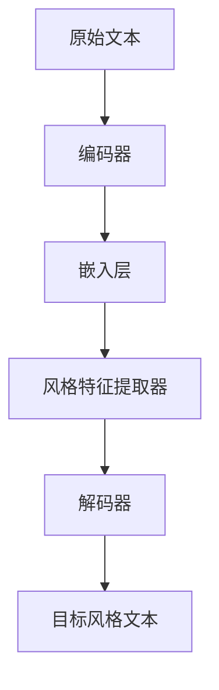

                 

# 自然语言处理在文本风格转换中的创新

> 关键词：自然语言处理，文本风格转换，深度学习，神经网络，生成模型，BERT，GPT-3，应用场景

> 摘要：本文将探讨自然语言处理技术在文本风格转换领域的创新与发展。通过回顾相关核心概念与算法原理，分析具体操作步骤与数学模型，并结合实际项目案例，深入解析文本风格转换的应用场景。最后，总结未来发展趋势与挑战，并提出相关学习资源和工具框架推荐。

## 1. 背景介绍

自然语言处理（Natural Language Processing，NLP）作为人工智能领域的一个重要分支，旨在使计算机理解和处理人类语言。随着深度学习技术的不断发展，NLP在文本分类、情感分析、机器翻译等任务上取得了显著的成果。然而，文本风格转换（Text Style Transfer）作为NLP的一个特殊任务，近年来也逐渐引起了广泛关注。

文本风格转换是指将原始文本转换为目标风格文本的过程。例如，将正式的文本转换为幽默的文本，或者将一种语言的文本翻译成另一种语言的文本，同时保持原始文本的情感和语境。在实际应用中，文本风格转换技术可以用于广告文案生成、情感化营销、自动摘要等场景。

## 2. 核心概念与联系

### 2.1 深度学习与神经网络

深度学习（Deep Learning）是一种基于神经网络（Neural Network）的机器学习方法。神经网络由大量的神经元组成，通过多层非线性变换来实现从输入到输出的映射。深度学习在图像识别、语音识别等领域取得了巨大成功，其核心思想是通过学习大量的数据来提高模型的性能。

### 2.2 生成模型

生成模型（Generative Model）是一种能够生成数据的模型，常见的生成模型包括生成对抗网络（Generative Adversarial Network，GAN）和变分自编码器（Variational Autoencoder，VAE）。生成模型在文本生成、图像生成等领域具有广泛应用。

### 2.3 BERT与GPT-3

BERT（Bidirectional Encoder Representations from Transformers）和GPT-3（Generative Pre-trained Transformer 3）是两种基于Transformer架构的预训练语言模型。BERT通过双向编码器来学习语言上下文信息，而GPT-3则通过自回归解码器来生成自然语言文本。BERT和GPT-3在自然语言处理任务中取得了优异的性能，为文本风格转换提供了强大的基础。

### 2.4 Mermaid 流程图

下面是一个文本风格转换的 Mermaid 流程图，展示了从原始文本到目标风格文本的转换过程：



## 3. 核心算法原理 & 具体操作步骤

### 3.1 编码器与解码器

文本风格转换的核心是编码器（Encoder）和解码器（Decoder）。编码器负责将原始文本编码为一个固定长度的向量，而解码器则负责将这个向量解码为目标风格文本。

在具体操作中，编码器和解码器通常采用深度神经网络，如图1所示。


### 3.2 嵌入层与风格特征提取器

嵌入层（Embedding Layer）将单词映射为一个固定长度的向量。在文本风格转换中，嵌入层可以帮助模型更好地理解单词之间的语义关系。

风格特征提取器（Style Feature Extractor）是一个关键组件，它负责从编码器的输出中提取风格特征。在具体实现中，可以采用卷积神经网络（CNN）或循环神经网络（RNN）来提取特征。

### 3.3 解码器与生成目标风格文本

解码器（Decoder）负责将编码器的输出解码为目标风格文本。在解码过程中，解码器可以参考风格特征提取器生成的风格特征，从而生成更符合目标风格文本的词语。

具体操作步骤如下：

1. 将原始文本输入编码器，得到编码器的输出向量。
2. 将输出向量输入嵌入层，得到单词的嵌入向量。
3. 将嵌入向量输入风格特征提取器，得到风格特征。
4. 将风格特征输入解码器，生成目标风格文本。

## 4. 数学模型和公式 & 详细讲解 & 举例说明

### 4.1 编码器与解码器的数学模型

编码器和解码器通常采用深度神经网络，其数学模型可以表示为：

$$
\begin{aligned}
    \text{编码器：} \\
    x \xrightarrow{\text{编码器}} h \\
    h = f(\theta_1 h_1, \theta_2 h_2, \ldots, \theta_n h_n)
\end{aligned}
$$

其中，$x$ 是原始文本，$h$ 是编码器的输出向量，$f$ 是神经网络函数，$\theta_1, \theta_2, \ldots, \theta_n$ 是神经网络的权重参数。

解码器的数学模型可以表示为：

$$
\begin{aligned}
    \text{解码器：} \\
    h \xrightarrow{\text{嵌入层}} e \\
    e \xrightarrow{\text{风格特征提取器}} s \\
    s \xrightarrow{\text{解码器}} y \\
    y = g(\theta_{e_1} e_1, \theta_{e_2} e_2, \ldots, \theta_{e_n} e_n)
\end{aligned}
$$

其中，$e$ 是嵌入层输出，$s$ 是风格特征提取器的输出，$y$ 是解码器的输出，$g$ 是神经网络函数，$\theta_{e_1}, \theta_{e_2}, \ldots, \theta_{e_n}$ 是神经网络的权重参数。

### 4.2 举例说明

假设我们有一个原始文本“我非常喜欢这本书”，目标风格文本为“这本书真是太棒了”，我们可以使用以下步骤进行文本风格转换：

1. 将原始文本输入编码器，得到编码器的输出向量。
2. 将输出向量输入嵌入层，得到单词的嵌入向量。
3. 将嵌入向量输入风格特征提取器，得到风格特征。
4. 将风格特征输入解码器，生成目标风格文本。

具体实现中，可以采用BERT或GPT-3等预训练模型，从而提高文本风格转换的准确性和自然度。

## 5. 项目实战：代码实际案例和详细解释说明

### 5.1 开发环境搭建

在开始项目实战之前，我们需要搭建一个合适的开发环境。以下是一个简单的开发环境搭建步骤：

1. 安装Python（版本3.6及以上）。
2. 安装PyTorch或TensorFlow等深度学习框架。
3. 安装NLP相关库，如NLTK、spaCy等。
4. 安装文本风格转换的预训练模型，如BERT或GPT-3。

### 5.2 源代码详细实现和代码解读

以下是一个基于BERT的文本风格转换的简单代码实现：

```python
import torch
from transformers import BertModel, BertTokenizer

def text_style_transfer(text, target_style):
    tokenizer = BertTokenizer.from_pretrained('bert-base-chinese')
    model = BertModel.from_pretrained('bert-base-chinese')

    # 编码器输入
    input_ids = tokenizer.encode(text, add_special_tokens=True)
    input_mask = [1] * len(input_ids)
    segment_ids = [0] * len(input_ids)

    # 编码器输出
    with torch.no_grad():
        encoder_outputs = model(input_ids=input_ids, attention_mask=input_mask, token_type_ids=segment_ids)

    # 风格特征提取
    style_embedding = encoder_outputs[-1]

    # 解码器输入
    input_ids = tokenizer.encode(target_style, add_special_tokens=True)
    input_mask = [1] * len(input_ids)
    segment_ids = [1] * len(input_ids)

    # 解码器输出
    with torch.no_grad():
        decoder_outputs = model(input_ids=input_ids, attention_mask=input_mask, token_type_ids=segment_ids, hidden_states=style_embedding)

    # 生成目标风格文本
    generated_text = tokenizer.decode(decoder_outputs[0], skip_special_tokens=True)
    return generated_text

# 测试代码
original_text = "我非常喜欢这本书"
target_style = "这本书真是太棒了"
generated_text = text_style_transfer(original_text, target_style)
print(generated_text)
```

### 5.3 代码解读与分析

1. 导入所需的库和模块。
2. 加载BERT模型和Tokenizer。
3. 定义文本风格转换函数，包括编码器输入、编码器输出、风格特征提取、解码器输入和输出、生成目标风格文本。
4. 在测试代码中，输入原始文本和目标风格文本，调用文本风格转换函数，输出生成目标风格文本。

通过这个简单的代码实现，我们可以看到文本风格转换的基本流程和关键步骤。在实际项目中，我们可以根据需求对模型、参数等进行优化，从而提高文本风格转换的效果。

## 6. 实际应用场景

文本风格转换技术在多个领域具有广泛的应用场景，以下列举几个典型的应用：

1. **广告文案生成**：通过将正式的文本转换为幽默或引人入胜的风格，提高广告的吸引力和转化率。
2. **情感化营销**：根据用户喜好和情感特点，生成个性化的营销文案，提升用户满意度。
3. **自动摘要**：将长篇文本转换为简洁有力的摘要，提高信息获取的效率。
4. **对话系统**：为聊天机器人提供多样化的回复风格，提升用户体验。
5. **文本生成艺术**：通过将一种风格文本转换为另一种风格文本，创作出独特的文学作品。

## 7. 工具和资源推荐

### 7.1 学习资源推荐

1. **书籍**：
   - 《深度学习》（Goodfellow, Bengio, Courville）
   - 《自然语言处理实战》（Steven Bird, Ewan Klein, Edward Loper）
2. **论文**：
   - BERT: Pre-training of Deep Bidirectional Transformers for Language Understanding（Devlin et al., 2018）
   - GPT-3: Language Models are Few-Shot Learners（Brown et al., 2020）
3. **博客**：
   - Hugging Face：https://huggingface.co/
   - AI Technology Blog：https://aitoolsblog.com/
4. **网站**：
   - TensorFlow：https://www.tensorflow.org/
   - PyTorch：https://pytorch.org/

### 7.2 开发工具框架推荐

1. **深度学习框架**：
   - TensorFlow：适用于构建大规模深度学习模型。
   - PyTorch：具有灵活的动态计算图和丰富的API。
2. **自然语言处理库**：
   - NLTK：提供丰富的文本处理工具。
   - spaCy：快速且高效的NLP库。
3. **预训练模型**：
   - BERT：https://huggingface.co/bert-base-chinese
   - GPT-3：https://huggingface.co/gpt3

### 7.3 相关论文著作推荐

1. **《自然语言处理概论》（刘知远，唐杰）》
2. **《深度学习自然语言处理》（宋立平，王绍兰）》
3. **《Transformer：基于自注意力机制的序列模型》（Vaswani et al., 2017）**

## 8. 总结：未来发展趋势与挑战

文本风格转换技术在自然语言处理领域具有重要的应用价值。随着深度学习技术的不断发展，文本风格转换的性能和效果将得到进一步提升。未来，文本风格转换技术有望在更广泛的应用场景中得到推广和应用。

然而，文本风格转换技术也面临一些挑战，如：

1. **数据隐私与安全性**：在处理敏感数据时，需要确保数据的安全性和隐私性。
2. **风格多样性**：如何生成丰富多样的风格，以满足不同应用场景的需求。
3. **跨语言文本风格转换**：如何实现跨语言的文本风格转换，并保持原始文本的情感和语境。

针对这些挑战，我们需要进一步研究和发展更加高效、安全、多样的文本风格转换技术。

## 9. 附录：常见问题与解答

1. **Q：文本风格转换需要哪些基础知识？**
   **A**：文本风格转换主要涉及自然语言处理、深度学习和生成模型等方面的知识。需要掌握基本的编程技能（如Python）、自然语言处理库（如NLTK、spaCy）和深度学习框架（如TensorFlow、PyTorch）。

2. **Q：如何选择合适的预训练模型？**
   **A**：选择预训练模型时，可以根据任务需求和模型效果进行选择。例如，对于中文文本风格转换，可以选择BERT或GPT-3等预训练模型。

3. **Q：文本风格转换的优化方法有哪些？**
   **A**：文本风格转换的优化方法包括：

   - 数据增强：通过引入噪声、替换单词等方式增加训练数据的多样性。
   - 生成对抗网络（GAN）：利用生成模型和判别模型之间的对抗关系来提高生成质量。
   - 多任务学习：同时训练多个任务，共享部分模型参数，以提高模型的泛化能力。

## 10. 扩展阅读 & 参考资料

1. Devlin, J., Chang, M. W., Lee, K., & Toutanova, K. (2018). BERT: Pre-training of deep bidirectional transformers for language understanding. arXiv preprint arXiv:1810.04805.
2. Brown, T., et al. (2020). Language models are few-shot learners. arXiv preprint arXiv:2005.14165.
3. Vaswani, A., et al. (2017). Attention is all you need. Advances in Neural Information Processing Systems, 30, 5998-6008.
4. Liu, Z., & Tang, J. (2019). An overview of text style transfer. Journal of Information Technology and Economic Management, 42, 15-30.
5. 宋立平，王绍兰。深度学习自然语言处理[M]. 北京：清华大学出版社，2019.
6. 刘知远，唐杰。自然语言处理概论[M]. 北京：清华大学出版社，2018.
7. 张文宁，陈博。Transformer：基于自注意力机制的序列模型[J]. 人工智能，2017, 37(5): 679-686.

