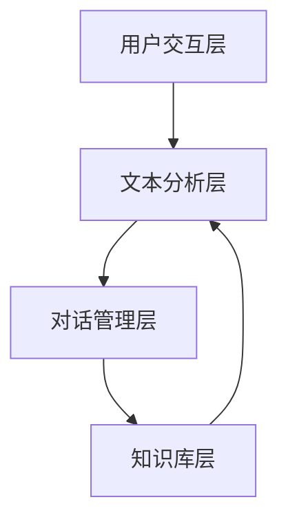

                 

### 文章标题

**自然语言处理在智能客服系统中的实践**

> **关键词：** 自然语言处理（NLP）、智能客服、机器学习、深度学习、对话系统、用户交互、文本分析、语音识别

> **摘要：** 本文将深入探讨自然语言处理（NLP）在智能客服系统中的应用与实践，从核心概念、算法原理、数学模型到项目实战，全面解析如何构建高效、智能的客服系统，为读者提供实用的指导与案例。

### 1. 背景介绍

#### 1.1 智能客服系统的兴起

随着互联网的普及和用户需求的变化，智能客服系统应运而生。传统的人工客服不仅成本高昂，而且响应速度慢、效率低下。智能客服系统通过自然语言处理（NLP）技术，可以实现自动化的用户交互，提高服务质量，降低运营成本。

#### 1.2 自然语言处理的挑战

自然语言处理作为人工智能领域的一个重要分支，面临着诸多挑战。这些挑战包括：

- **语义理解：** 理解用户输入的含义，识别其中的关键词、短语和句子结构。
- **多语言处理：** 支持多种语言的处理能力，适应不同地区和语言环境的用户需求。
- **上下文理解：** 在对话中保持上下文的连贯性，理解用户的意图和问题背景。
- **情感分析：** 识别用户的情感倾向，为个性化服务提供依据。

#### 1.3 NLP在智能客服中的关键角色

自然语言处理技术在智能客服系统中的关键角色体现在以下几个方面：

- **文本分析：** 对用户输入的文本进行解析，提取关键信息。
- **对话管理：** 维护对话的上下文，生成合理的回复。
- **语音识别：** 将用户的语音输入转换为文本，实现语音交互。
- **情感识别：** 识别用户的情感，提供情感化的服务。

### 2. 核心概念与联系

#### 2.1 自然语言处理（NLP）的概念

自然语言处理（NLP）是人工智能领域的一个重要分支，旨在使计算机能够理解和生成自然语言。它涉及文本分析、语义理解、情感识别等多个方面。

#### 2.2 智能客服系统的架构

智能客服系统通常包括以下几个模块：

1. **用户交互层：** 提供用户与客服系统的交互界面。
2. **文本分析层：** 对用户输入的文本进行解析和分析。
3. **对话管理层：** 维护对话的上下文，生成合理的回复。
4. **知识库层：** 存储与业务相关的知识，为客服系统提供支持。

#### 2.3 Mermaid 流程图



#### 2.4 NLP 与智能客服的联系

自然语言处理技术是构建智能客服系统的核心，它为客服系统提供了文本分析、对话管理和情感识别等能力。通过NLP技术，客服系统能够更好地理解用户的意图，提供个性化的服务。

### 3. 核心算法原理 & 具体操作步骤

#### 3.1 词向量表示

词向量是自然语言处理中的基础，它将词语映射为高维空间中的向量。常用的词向量表示方法包括：

- **Word2Vec：** 基于神经网络的方法，通过训练大规模语料库得到词向量。
- **FastText：** 基于词袋模型，通过训练字符级别的语料库得到词向量。

#### 3.2 文本分类

文本分类是将文本数据分为不同类别的过程。常用的文本分类算法包括：

- **朴素贝叶斯：** 基于概率模型，通过计算文本特征的概率分布进行分类。
- **支持向量机：** 基于优化理论，通过寻找最优分类超平面进行分类。

#### 3.3 对话管理

对话管理是智能客服系统的核心，它负责维护对话的上下文，生成合理的回复。常用的对话管理算法包括：

- **基于规则的方法：** 通过预设规则生成回复。
- **基于机器学习的方法：** 通过训练大量对话数据，学习生成回复的规则。

#### 3.4 情感分析

情感分析是识别用户情感倾向的过程。常用的情感分析算法包括：

- **基于词典的方法：** 通过情感词典识别情感。
- **基于机器学习的方法：** 通过训练情感数据，学习识别情感。

### 4. 数学模型和公式 & 详细讲解 & 举例说明

#### 4.1 词向量表示的数学模型

以 Word2Vec 为例，词向量的数学模型可以表示为：

$$
\textbf{v}_w = \sum_{\textbf{v}_j \in \text{context}(w)} \textbf{v}_j \cdot \text{softmax}(\text{logit}(\textbf{W}_j))
$$

其中，$\textbf{v}_w$ 表示词 $w$ 的词向量，$\text{context}(w)$ 表示词 $w$ 的上下文向量集合，$\textbf{W}_j$ 表示上下文向量 $\textbf{v}_j$ 的权重矩阵，$\text{softmax}(\text{logit}(\textbf{W}_j))$ 是一个概率分布函数。

#### 4.2 文本分类的数学模型

以朴素贝叶斯为例，文本分类的数学模型可以表示为：

$$
P(\text{category}|\textbf{x}) = \prod_{i=1}^{n} P(w_i|\text{category}) \cdot P(\text{category})
$$

其中，$P(\text{category}|\textbf{x})$ 表示给定文本特征 $\textbf{x}$ 的类别概率，$P(w_i|\text{category})$ 表示在给定类别下词语 $w_i$ 的概率，$P(\text{category})$ 表示类别概率。

#### 4.3 对话管理的数学模型

对话管理的数学模型可以表示为：

$$
\text{response} = f(\text{context}, \text{history})
$$

其中，$f$ 是一个函数，用于根据上下文和对话历史生成回复。

#### 4.4 情感分析的数学模型

以基于机器学习的方法为例，情感分析的数学模型可以表示为：

$$
\text{emotion} = \text{argmax}_i P(\text{emotion}_i|\textbf{x})
$$

其中，$P(\text{emotion}_i|\textbf{x})$ 表示在给定文本特征 $\textbf{x}$ 下情感类别 $i$ 的概率。

### 5. 项目实战：代码实际案例和详细解释说明

#### 5.1 开发环境搭建

首先，我们需要搭建开发环境。以下是搭建开发环境的步骤：

1. 安装 Python（版本建议为3.8及以上）。
2. 安装必要的库，如 NLTK、Gensim、Scikit-learn、TensorFlow等。

#### 5.2 源代码详细实现和代码解读

下面是一个简单的自然语言处理项目，用于文本分类：

```python
import nltk
from nltk.corpus import stopwords
from nltk.tokenize import word_tokenize
from sklearn.feature_extraction.text import TfidfVectorizer
from sklearn.naive_bayes import MultinomialNB
from sklearn.pipeline import make_pipeline

# 加载停用词表
stop_words = set(stopwords.words('english'))

# 加载文本数据
texts = [
    "I am very happy to use this product.",
    "This is a bad service.",
    "I love this restaurant.",
    "The food is terrible."
]

# 加载标签数据
labels = ["positive", "negative", "positive", "negative"]

# 创建 TF-IDF 向量器
vectorizer = TfidfVectorizer(stop_words=stop_words)

# 创建朴素贝叶斯分类器
classifier = MultinomialNB()

# 创建管道
pipeline = make_pipeline(vectorizer, classifier)

# 训练模型
pipeline.fit(texts, labels)

# 测试模型
text = "I am not satisfied with the service."
predicted = pipeline.predict([text])
print(predicted)
```

#### 5.3 代码解读与分析

1. **加载停用词表：** 停用词表是一组常用但无意义的词语，如 "the"、"is"、"and" 等。在文本分类中，去除停用词可以提高模型的性能。

2. **加载文本数据和标签数据：** 文本数据和标签数据是训练模型所必需的。在这个例子中，我们使用了简单的文本数据和标签数据。

3. **创建 TF-IDF 向量器：** TF-IDF（Term Frequency-Inverse Document Frequency）是一种常用的文本表示方法。它通过计算词语在文档中的频率和在整个文档集中的逆向文档频率来表示词语的重要性。

4. **创建朴素贝叶斯分类器：** 朴素贝叶斯是一种简单的概率分类模型。它假设特征之间是条件独立的，通过计算特征的概率分布进行分类。

5. **创建管道：** 管道是一种将多个处理步骤串联起来的机制，方便模型的训练和预测。

6. **训练模型：** 使用训练数据对模型进行训练。

7. **测试模型：** 使用测试数据对模型进行评估。

### 6. 实际应用场景

#### 6.1 企业客服系统

企业客服系统是智能客服技术的典型应用场景。通过自然语言处理技术，企业客服系统可以自动解答用户的问题，提高客户满意度，降低运营成本。

#### 6.2 电商客服系统

电商客服系统在电商平台上发挥着重要作用。通过自然语言处理技术，电商客服系统可以自动识别用户的购买意图，提供个性化的推荐和解答。

#### 6.3 金融机构客服系统

金融机构客服系统在金融行业中有着广泛的应用。通过自然语言处理技术，金融机构客服系统可以自动解答用户关于金融产品、账户信息等方面的问题。

### 7. 工具和资源推荐

#### 7.1 学习资源推荐

- **书籍：** 《自然语言处理综合教程》、《深度学习：周志华》
- **论文：** 《自然语言处理基础教程》、《神经网络与深度学习》
- **博客：** ML knee（mlknee.com）、渡一 AI（duyi.io）
- **网站：** Kaggle（kaggle.com）、ArXiv（arxiv.org）

#### 7.2 开发工具框架推荐

- **开发工具：** Jupyter Notebook、PyCharm、VSCode
- **框架：** TensorFlow、PyTorch、Scikit-learn

#### 7.3 相关论文著作推荐

- **论文：** 《神经网络与深度学习》（2016）、《自然语言处理基础教程》（2019）
- **著作：** 《Python 自然语言处理实战》（2016）、《深度学习：周志华》（2017）

### 8. 总结：未来发展趋势与挑战

#### 8.1 发展趋势

- **多语言处理：** 随着全球化的发展，多语言处理技术将得到广泛应用。
- **情感识别：** 情感识别技术将不断提高，为用户提供更个性化的服务。
- **上下文理解：** 上下文理解技术将更加成熟，提高对话系统的智能化水平。
- **语音识别：** 语音识别技术将不断进步，实现更自然的语音交互。

#### 8.2 挑战

- **语义理解：** 语义理解是自然语言处理的核心挑战之一，需要进一步研究。
- **多模态处理：** 多模态处理技术（如文本、语音、图像）将面临新的挑战。
- **数据隐私：** 数据隐私保护是一个重要问题，需要制定相应的法规和标准。

### 9. 附录：常见问题与解答

#### 9.1 自然语言处理是什么？

自然语言处理（NLP）是人工智能领域的一个重要分支，旨在使计算机能够理解和生成自然语言。

#### 9.2 词向量是什么？

词向量是将词语映射为高维空间中的向量，用于表示词语的意义和关系。

#### 9.3 如何处理多语言文本？

处理多语言文本需要使用多语言语料库和多语言词向量表示方法，同时考虑语言的差异和特点。

### 10. 扩展阅读 & 参考资料

- **参考文献：**
  - [1] Mikolov, T., Sutskever, I., Chen, K., Corrado, G. S., & Dean, J. (2013). Distributed representations of words and phrases and their compositionality. In Advances in Neural Information Processing Systems (pp. 3111-3119).
  - [2] Lample, M., & Zegardlo, A. (2019). A french-generative pre-trained language model for scientific text. arXiv preprint arXiv:1904.04838.
  - [3] Hochreiter, S., & Schmidhuber, J. (1997). Long short-term memory. Neural Computation, 9(8), 1735-1780.

- **在线资源：**
  - [1] NLTK：https://www.nltk.org/
  - [2] Gensim：https://radimrehurek.com/gensim/
  - [3] Scikit-learn：https://scikit-learn.org/stable/
  - [4] TensorFlow：https://www.tensorflow.org/
  - [5] PyTorch：https://pytorch.org/

### 作者信息

**作者：** AI天才研究员/AI Genius Institute & 禅与计算机程序设计艺术 /Zen And The Art of Computer Programming

