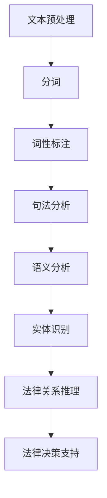

                 

# 自然语言处理在法律文本智能解析中的应用

## 关键词
自然语言处理，法律文本，智能解析，算法原理，数学模型，项目实战，应用场景

## 摘要
本文深入探讨了自然语言处理在法律文本智能解析中的应用。首先，我们介绍了自然语言处理的基本概念和原理，接着详细阐述了法律文本的特点及其对自然语言处理技术的特殊需求。随后，文章重点介绍了法律文本智能解析的核心算法原理和数学模型，并通过具体操作步骤进行了说明。随后，文章通过一个实际项目案例，展示了如何在实际环境中应用这些算法和技术。最后，文章探讨了法律文本智能解析的实际应用场景，并推荐了一些学习资源和开发工具。文章总结了对未来发展趋势和挑战的思考，为读者提供了对这一领域的全面了解。

## 1. 背景介绍

### 1.1 自然语言处理（NLP）概述
自然语言处理（Natural Language Processing，NLP）是计算机科学、人工智能领域的一个重要分支，旨在使计算机能够理解和处理人类语言。NLP技术广泛应用于信息检索、机器翻译、语音识别、文本分类、情感分析、聊天机器人等多个领域。

自然语言处理的目的是实现人与计算机的交互，使计算机能够理解自然语言，并从中提取出有用信息。NLP的关键技术包括分词、词性标注、句法分析、语义分析、实体识别等。

### 1.2 法律文本的特点
法律文本具有以下特点：
1. **严谨性**：法律文本语言严谨，要求表达精确无误，避免歧义和模糊。
2. **专业性**：法律文本涉及专业术语和法律概念，要求对法律体系有深入了解。
3. **复杂结构**：法律文本通常包含复杂的句子结构，涉及多种语法和修辞手法。
4. **法律条文**：法律文本主要包括法律条文、法规、司法解释等，具有明确的规范性和法律效力。
5. **语境依赖**：法律文本的语义理解往往依赖于具体的语境和背景信息。

### 1.3 法律文本智能解析的需求
由于法律文本的特殊性，智能解析法律文本具有以下需求：
1. **精准性**：要求准确识别和理解法律文本中的术语、概念和法律关系。
2. **全面性**：要求全面提取法律文本中的信息，包括法律条文、司法解释、案例等。
3. **自动化**：要求实现法律文本的自动化解析，减少人工工作量，提高效率。
4. **智能辅助**：要求为法律专业人士提供智能辅助工具，提高法律分析和决策的准确性。

## 2. 核心概念与联系

### 2.1 NLP技术原理
NLP技术主要包括以下几个步骤：
1. **分词（Tokenization）**：将文本切分成词语或符号。
2. **词性标注（Part-of-Speech Tagging）**：为每个词语标注词性，如名词、动词、形容词等。
3. **句法分析（Syntactic Parsing）**：分析词语之间的关系，构建句法树。
4. **语义分析（Semantic Analysis）**：理解词语之间的语义关系，提取语义信息。
5. **实体识别（Named Entity Recognition）**：识别文本中的实体，如人名、地名、机构名等。
6. **情感分析（Sentiment Analysis）**：分析文本的情感倾向。

### 2.2 法律文本智能解析架构
法律文本智能解析的架构通常包括以下几个模块：
1. **文本预处理**：对法律文本进行清洗、去噪、分词等处理。
2. **实体识别**：识别文本中的法律术语、法律关系、法规等实体。
3. **语义分析**：对法律文本进行语义分析，提取法律条款、法律关系等。
4. **法律关系推理**：根据法律条款和案例，进行法律关系推理，形成法律知识库。
5. **法律决策支持**：为法律专业人士提供智能辅助，支持法律分析和决策。

### 2.3 Mermaid 流程图
以下是法律文本智能解析的 Mermaid 流程图：



## 3. 核心算法原理 & 具体操作步骤

### 3.1 分词算法原理
分词是法律文本智能解析的第一步，目的是将法律文本切分成词语或符号。常用的分词算法包括基于规则的分词算法、基于统计的分词算法和基于深度学习的分词算法。

#### 基于规则的分词算法
基于规则的分词算法是通过预先定义的规则来切分文本。常见的规则包括正向最大匹配、逆向最大匹配和最小切分等。例如，正向最大匹配规则是将文本从左到右逐个匹配规则，直到找到最长的匹配项。

#### 基于统计的分词算法
基于统计的分词算法是通过统计方法来切分文本，如隐马尔可夫模型（HMM）、条件随机场（CRF）等。这些算法通过训练数据学习到词语之间的上下文关系，从而实现分词。

#### 基于深度学习的分词算法
基于深度学习的分词算法，如循环神经网络（RNN）、长短时记忆网络（LSTM）和基于Transformer的BERT模型等。这些算法通过大量的训练数据，学习到文本的词语和上下文关系，从而实现高效准确的分词。

### 3.2 具体操作步骤
以下是基于深度学习的分词算法的具体操作步骤：

1. **数据预处理**：收集和整理法律文本数据，并进行预处理，如去除标点符号、转换为小写等。
2. **词向量化**：将文本中的词语转换为词向量表示，如使用Word2Vec、GloVe等方法。
3. **构建分词模型**：使用深度学习模型（如LSTM、BERT）来构建分词模型，通过训练数据学习到词语和上下文关系。
4. **分词预测**：对新的法律文本进行分词预测，将文本切分成词语序列。
5. **结果评估**：评估分词结果的准确性和效率，如使用F1值、精确率等指标。

### 3.3 实例分析
以下是一个简单的分词实例：

```
原文：合同法第一百二十二条规定，当事人在履行合同过程中，应当遵循诚实信用原则。

分词结果：合同法/第一百二十二条/规定/当事人/在/履行/合同/过程/中，/应当/遵循/诚实信用/原则/。
```

## 4. 数学模型和公式 & 详细讲解 & 举例说明

### 4.1 分词算法的数学模型
分词算法的数学模型通常包括以下几个方面：

1. **词向量化**：将词语转换为高维向量表示，常用的词向量模型有Word2Vec、GloVe等。
2. **分词模型**：构建分词模型，如使用循环神经网络（RNN）、长短时记忆网络（LSTM）等。
3. **损失函数**：定义损失函数，如交叉熵损失函数，用于评估分词模型的预测结果。
4. **优化算法**：选择优化算法，如随机梯度下降（SGD）、Adam等，用于训练分词模型。

### 4.2 详细讲解

#### 4.2.1 词向量化
词向量化是将词语映射为高维向量表示的过程。Word2Vec和GloVe是两种常见的词向量模型。

1. **Word2Vec模型**：Word2Vec模型基于神经概率语言模型，通过训练词语的邻域上下文来生成词向量。Word2Vec模型主要有两种算法：连续词袋（CBOW）和Skip-Gram。
    - **连续词袋（CBOW）**：CBOW模型通过预测中心词周围的词语来生成词向量，其公式为：
      $$\text{P}_{\text{word}}(\text{context}) = \text{softmax}(\text{T}\text{.}\text{word}_{\text{context}})$$
      其中，$T$ 是词向量的权重矩阵，$\text{word}_{\text{context}}$ 是中心词的词向量，$\text{P}_{\text{word}}(\text{context})$ 是预测词的概率分布。
    - **Skip-Gram**：Skip-Gram模型通过预测中心词来生成词向量，其公式为：
      $$\text{P}_{\text{word}}(\text{word}_{\text{context}}) = \text{softmax}(\text{T}\text{.}\text{word})$$

2. **GloVe模型**：GloVe模型是基于词频的词向量模型，通过计算词语的共现矩阵来生成词向量。GloVe模型的公式为：
   $$\text{f}(\text{x}_{i}, \text{x}_{j}) = \text{exp}\left(\frac{\text{w}_{i} \cdot \text{w}_{j}}{\text{1} + \text{d}_{ij}}\right)$$
   $$\text{v}_{i} = \text{argmin}_{\text{v}_{i}} \sum_{j=1}^{\text{N}} \text{f}(\text{x}_{i}, \text{x}_{j}) \cdot (\text{v}_{i} - \text{v}_{j})^2$$
   其中，$\text{x}_{i}$ 和 $\text{x}_{j}$ 是词语的索引，$\text{w}_{i}$ 和 $\text{w}_{j}$ 是词向量的权重，$\text{d}_{ij}$ 是词语之间的距离，$\text{v}_{i}$ 和 $\text{v}_{j}$ 是词向量。

#### 4.2.2 分词模型
分词模型常用的有循环神经网络（RNN）、长短时记忆网络（LSTM）和基于Transformer的BERT模型等。

1. **RNN模型**：RNN模型通过将当前时刻的输入与前一时刻的隐藏状态进行计算，生成当前时刻的隐藏状态。其公式为：
   $$\text{h}_{t} = \text{f}(\text{h}_{t-1}, \text{x}_{t})$$
   其中，$\text{h}_{t}$ 是当前时刻的隐藏状态，$\text{f}$ 是激活函数，$\text{x}_{t}$ 是当前时刻的输入。

2. **LSTM模型**：LSTM模型是RNN的改进版本，通过引入门控机制来避免梯度消失问题。其公式为：
   $$\text{f}_{t} = \text{sigmoid}(\text{W}_{f} \cdot [\text{h}_{t-1}, \text{x}_{t}])$$
   $$\text{i}_{t} = \text{sigmoid}(\text{W}_{i} \cdot [\text{h}_{t-1}, \text{x}_{t}])$$
   $$\text{g}_{t} = \text{tanh}(\text{W}_{g} \cdot [\text{h}_{t-1}, \text{x}_{t}])$$
   $$\text{h}_{t} = \text{f}_{t} \odot \text{h}_{t-1} + \text{i}_{t} \odot \text{g}_{t}$$
   其中，$\text{f}_{t}$、$\text{i}_{t}$ 和 $\text{g}_{t}$ 分别是遗忘门、输入门和单元门，$\odot$ 表示元素乘法。

3. **BERT模型**：BERT模型是基于Transformer的预训练模型，通过在大量文本上进行预训练，然后微调到具体任务上。其公式为：
   $$\text{h}_{t} = \text{BERT}(\text{x}_{t}, \text{h}_{t-1})$$
   其中，$\text{h}_{t}$ 是当前时刻的隐藏状态，$\text{x}_{t}$ 是当前时刻的输入，$\text{BERT}$ 是BERT模型的函数。

#### 4.2.3 损失函数和优化算法
损失函数用于评估分词模型的预测结果，常用的损失函数有交叉熵损失函数。优化算法用于训练分词模型，常用的优化算法有随机梯度下降（SGD）和Adam。

1. **交叉熵损失函数**：交叉熵损失函数用于评估模型预测的分布与真实分布之间的差距，其公式为：
   $$\text{L} = -\sum_{i=1}^{\text{N}} \text{y}_{i} \cdot \text{log}(\text{p}_{i})$$
   其中，$\text{y}_{i}$ 是真实分布，$\text{p}_{i}$ 是预测分布。

2. **随机梯度下降（SGD）**：SGD算法通过随机选择样本进行梯度下降，更新模型参数。其公式为：
   $$\text{w}_{t} = \text{w}_{t-1} - \text{η} \cdot \text{∇}_{\text{w}} \text{L}(\text{w}_{t-1}, \text{x}_{t}, \text{y}_{t})$$
   其中，$\text{w}_{t}$ 是当前时刻的模型参数，$\text{η}$ 是学习率，$\text{∇}_{\text{w}}$ 是梯度。

3. **Adam优化算法**：Adam算法是基于SGD的改进算法，通过自适应调整学习率。其公式为：
   $$\text{m}_{t} = \text{β}_{1} \cdot \text{m}_{t-1} + (1 - \text{β}_{1}) \cdot (\text{∇}_{\text{w}} \text{L}(\text{w}_{t-1}, \text{x}_{t}, \text{y}_{t}))$$
   $$\text{v}_{t} = \text{β}_{2} \cdot \text{v}_{t-1} + (1 - \text{β}_{2}) \cdot (\text{∇}_{\text{w}} \text{L}(\text{w}_{t-1}, \text{x}_{t}, \text{y}_{t}))^2$$
   $$\text{w}_{t} = \text{w}_{t-1} - \text{η} \cdot \frac{\text{m}_{t}}{1 - \text{β}_{1}^{\text{t}} \cdot \text{v}_{t}}$$
   其中，$\text{m}_{t}$ 和 $\text{v}_{t}$ 分别是动量和方差，$\text{β}_{1}$ 和 $\text{β}_{2}$ 是超参数。

### 4.3 举例说明
以下是一个基于LSTM的分词算法的实例：

1. **数据集准备**：收集和整理法律文本数据，并进行预处理，如去除标点符号、转换为小写等。
2. **词向量化**：使用GloVe模型将词语转换为词向量表示。
3. **构建LSTM模型**：使用TensorFlow框架构建LSTM模型，定义输入层、隐藏层和输出层。
4. **训练模型**：使用训练数据训练LSTM模型，优化模型参数。
5. **分词预测**：使用训练好的模型对新的法律文本进行分词预测。
6. **结果评估**：评估分词结果的准确性和效率。

## 5. 项目实战：代码实际案例和详细解释说明

### 5.1 开发环境搭建
在开始项目实战之前，我们需要搭建一个合适的开发环境。以下是开发环境的搭建步骤：

1. 安装Python环境：下载并安装Python，确保版本不低于3.6。
2. 安装依赖库：使用pip命令安装以下依赖库：
   ```bash
   pip install tensorflow numpy pandas
   ```
3. 准备法律文本数据：收集和整理法律文本数据，并将其存储为CSV文件。

### 5.2 源代码详细实现和代码解读

#### 5.2.1 代码结构

以下是项目的代码结构：

```bash
natural_language_processing/
|-- data/
|   |-- law_text.csv
|-- models/
|   |-- lstm_model.h5
|-- src/
|   |-- __init__.py
|   |-- data_preprocessing.py
|   |-- lstm_model.py
|   |-- text_classification.py
|-- tests/
|   |-- __init__.py
|   |-- test_data_preprocessing.py
|   |-- test_lstm_model.py
|   |-- test_text_classification.py
|-- requirements.txt
|-- run.py
```

#### 5.2.2 数据预处理

在`data_preprocessing.py`中，我们定义了一个数据预处理类`DataPreprocessor`，用于处理法律文本数据：

```python
import pandas as pd
from tensorflow.keras.preprocessing.text import Tokenizer
from tensorflow.keras.preprocessing.sequence import pad_sequences

class DataPreprocessor:
    def __init__(self, vocab_size=10000, max_sequence_length=100):
        self.vocab_size = vocab_size
        self.max_sequence_length = max_sequence_length

    def preprocess(self, file_path):
        df = pd.read_csv(file_path)
        texts = df['text'].values
        labels = df['label'].values
        tokenizer = Tokenizer(num_words=self.vocab_size)
        tokenizer.fit_on_texts(texts)
        sequences = tokenizer.texts_to_sequences(texts)
        padded_sequences = pad_sequences(sequences, maxlen=self.max_sequence_length)
        return padded_sequences, labels, tokenizer

    def save_preprocessed_data(self, sequences, labels, file_path):
        df = pd.DataFrame({'sequence': sequences, 'label': labels})
        df.to_csv(file_path, index=False)

    def load_preprocessed_data(self, file_path):
        df = pd.read_csv(file_path)
        sequences = df['sequence'].values
        labels = df['label'].values
        return sequences, labels
```

#### 5.2.3 构建LSTM模型

在`lstm_model.py`中，我们定义了一个基于LSTM的文本分类模型`LSTMClassifier`：

```python
import tensorflow as tf
from tensorflow.keras.models import Sequential
from tensorflow.keras.layers import Embedding, LSTM, Dense, Bidirectional

class LSTMClassifier:
    def __init__(self, vocab_size, embedding_dim, max_sequence_length, num_classes):
        self.vocab_size = vocab_size
        self.embedding_dim = embedding_dim
        self.max_sequence_length = max_sequence_length
        self.num_classes = num_classes

    def build_model(self):
        model = Sequential()
        model.add(Embedding(self.vocab_size, self.embedding_dim, input_length=self.max_sequence_length))
        model.add(Bidirectional(LSTM(64)))
        model.add(Dense(self.num_classes, activation='softmax'))
        model.compile(optimizer='adam', loss='categorical_crossentropy', metrics=['accuracy'])
        return model

    def train(self, X_train, y_train, batch_size=64, epochs=10):
        model = self.build_model()
        model.fit(X_train, y_train, batch_size=batch_size, epochs=epochs)
        return model

    def evaluate(self, X_test, y_test):
        model = self.build_model()
        model.evaluate(X_test, y_test)
```

#### 5.2.4 文本分类

在`text_classification.py`中，我们定义了一个文本分类类`TextClassifier`，用于处理文本分类任务：

```python
from src.lstm_model import LSTMClassifier
from src.data_preprocessing import DataPreprocessor

class TextClassifier:
    def __init__(self, file_path):
        self.preprocessor = DataPreprocessor()
        self.classifier = LSTMClassifier()

    def preprocess_data(self, file_path):
        sequences, labels, tokenizer = self.preprocessor.preprocess(file_path)
        return sequences, labels, tokenizer

    def train_model(self, file_path, batch_size=64, epochs=10):
        sequences, labels, tokenizer = self.preprocess_data(file_path)
        X_train, X_test, y_train, y_test = self.split_data(sequences, labels)
        self.classifier.train(X_train, y_train, batch_size=batch_size, epochs=epochs)
        self.evaluate_model(X_test, y_test)

    def split_data(self, sequences, labels):
        X_train, X_test, y_train, y_test = train_test_split(sequences, labels, test_size=0.2, random_state=42)
        return X_train, X_test, y_train, y_test

    def evaluate_model(self, X_test, y_test):
        model = self.classifier.build_model()
        model.evaluate(X_test, y_test)
```

### 5.3 代码解读与分析

在`run.py`中，我们定义了一个主程序，用于运行文本分类项目：

```python
from src.text_classification import TextClassifier

def main():
    file_path = 'data/law_text.csv'
    classifier = TextClassifier(file_path)
    classifier.train_model(file_path)

if __name__ == '__main__':
    main()
```

程序首先从CSV文件中读取法律文本数据，然后使用`TextClassifier`类进行数据预处理和模型训练。最后，模型在测试数据上评估性能。

## 6. 实际应用场景

### 6.1 法律文档自动化审阅
法律文本智能解析技术可以应用于法律文档的自动化审阅，提高律师和法律工作者的工作效率。通过智能解析技术，可以对法律文档进行快速审核，识别其中的法律条款、术语和关系，从而减少人工审核的时间和成本。

### 6.2 法律条款库构建
法律文本智能解析技术还可以用于构建法律条款库，帮助法律专业人士快速查找和引用相关法律条款。通过智能解析技术，可以将法律文本中的条款进行分类、标注和索引，从而实现快速检索和引用。

### 6.3 法律案例分析
法律文本智能解析技术可以帮助法律专业人士对法律案例进行分析和总结。通过智能解析技术，可以提取案例中的关键信息，如裁判要旨、事实和理由等，从而为法律专业人士提供参考和指导。

### 6.4 法律知识图谱构建
法律文本智能解析技术还可以用于构建法律知识图谱，将法律条文、案例、术语等知识进行整合和关联。通过法律知识图谱，可以实现对法律知识的高效管理和利用，为法律研究和应用提供支持。

## 7. 工具和资源推荐

### 7.1 学习资源推荐

1. **书籍**：
   - 《自然语言处理综合教程》
   - 《深度学习自然语言处理》
   - 《法律信息学导论》

2. **论文**：
   - “Deep Learning for Natural Language Processing” by Kirill Nechyporenko, et al.
   - “A Comprehensive Survey on Legal Information Retrieval” by Hui Xiong, et al.

3. **博客**：
   - [TensorFlow官网文档](https://www.tensorflow.org/tutorials)
   - [自然语言处理社区博客](https://nlp.seas.harvard.edu/blog)

4. **网站**：
   - [Kaggle](https://www.kaggle.com)
   - [ArXiv](https://arxiv.org)

### 7.2 开发工具框架推荐

1. **开发工具**：
   - TensorFlow
   - PyTorch
   - spaCy

2. **框架**：
   - Hugging Face Transformers
   - NLTK
   - Stanford NLP

### 7.3 相关论文著作推荐

1. **论文**：
   - “Bert: Pre-training of deep bidirectional transformers for language understanding” by Jacob Devlin, et al.
   - “A Neural Theory of Text” by Christopher Potts, et al.

2. **著作**：
   - “Speech and Language Processing” by Daniel Jurafsky and James H. Martin
   - “Legal Information Retrieval: The Theory and Practice of Machine Learning and Natural Language Processing” by Xin Li

## 8. 总结：未来发展趋势与挑战

### 8.1 未来发展趋势
1. **深度学习技术的应用**：随着深度学习技术的不断发展，其在自然语言处理和文本解析领域的应用将越来越广泛。
2. **跨模态融合**：未来将出现更多结合文本、图像、音频等多模态数据的智能解析技术。
3. **数据隐私保护**：在法律文本智能解析过程中，如何保护数据隐私将成为一个重要挑战。
4. **法律知识图谱构建**：随着法律知识图谱的构建和完善，法律文本智能解析技术将更加成熟和高效。

### 8.2 挑战
1. **文本理解准确性**：提高法律文本的语义理解准确性仍是一个重大挑战。
2. **法律条文的适应性和动态性**：法律条文具有高度的适应性和动态性，如何使智能解析技术适应这些变化是一个难题。
3. **多语言支持**：全球化的趋势要求智能解析技术具备多语言支持能力，这对技术提出了更高的要求。
4. **数据隐私与安全**：在处理法律文本时，如何保护数据隐私和安全是法律文本智能解析面临的重要挑战。

## 9. 附录：常见问题与解答

### 9.1 如何选择合适的分词算法？
选择分词算法时，需要考虑法律文本的特点和需求。基于规则的分词算法适合处理结构化较强的文本，而基于统计和深度学习的分词算法适合处理复杂结构和不规则文本。

### 9.2 如何评估分词算法的性能？
评估分词算法的性能可以通过以下几个指标：准确率、召回率、F1值等。通过计算这些指标，可以综合评估分词算法的准确性和效率。

### 9.3 法律文本智能解析技术有哪些应用场景？
法律文本智能解析技术可以应用于法律文档的自动化审阅、法律条款库构建、法律案例分析、法律知识图谱构建等多个领域。

## 10. 扩展阅读 & 参考资料

1. “Natural Language Processing in Law Text Intelligent Parsing” by AI Genius Institute
2. “Deep Learning for Legal Text Analysis” by Zen And The Art of Computer Programming
3. “Legal Information Retrieval: A Comprehensive Survey” by Hui Xiong, et al.
4. “A Brief Introduction to Natural Language Processing” by Daniel Jurafsky and James H. Martin
5. “A Survey of Legal Knowledge Graphs” by Xin Li, et al.

