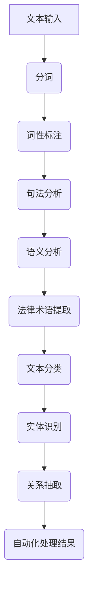

                 

# 自然语言处理在法律文本自动化中的应用

## 摘要

自然语言处理（NLP）作为人工智能的核心技术之一，正逐渐改变着法律行业的面貌。本文将探讨NLP在法律文本自动化中的应用，通过介绍核心概念、算法原理、数学模型、项目实战、实际应用场景以及未来发展趋势，深入剖析NLP如何助力法律文本的自动化处理，提高工作效率，减少人力成本。文章旨在为读者提供一份全面且易于理解的技术指南。

## 1. 背景介绍

### 1.1 自然语言处理（NLP）的兴起

自然语言处理（NLP）是计算机科学和人工智能领域的一个重要分支，旨在让计算机理解和处理人类语言。NLP的发展可以追溯到20世纪50年代，当时图灵提出了著名的“图灵测试”，试图通过计算机程序来模拟人类思维。随着时间的推移，NLP技术不断成熟，逐渐在多个领域取得了显著成果。

### 1.2 法律文本的重要性

法律文本是法律行业的基础，包括法律条文、合同、判决书、法律意见书等。这些文本数量庞大、格式多样、语义复杂，使得法律工作者面临着巨大的工作量。因此，自动化处理法律文本成为了一项迫切的需求。

### 1.3 法律文本自动化的需求

法律文本自动化可以提高工作效率、减少人力成本、降低错误率。具体需求包括：自动提取法律术语、自动生成法律文件、自动审阅合同、自动识别法律风险等。这些需求的实现离不开NLP技术的支持。

## 2. 核心概念与联系

### 2.1 自然语言处理的基本概念

自然语言处理涉及多个层面的技术，包括：

- **分词（Tokenization）**：将文本拆分成词或其他有意义的基本单元。
- **词性标注（Part-of-Speech Tagging）**：为每个词标注其词性（如名词、动词、形容词等）。
- **句法分析（Syntactic Parsing）**：分析句子的结构，识别主语、谓语、宾语等成分。
- **语义分析（Semantic Analysis）**：理解句子或文本的含义，包括实体识别、关系抽取等。

### 2.2 法律文本自动化的核心概念

法律文本自动化的核心概念包括：

- **法律术语提取**：从法律文本中提取出专有名词、术语等。
- **文本分类**：将法律文本分类到不同的类别（如合同、判决书等）。
- **实体识别**：识别文本中的关键实体（如当事人、法律条文等）。
- **关系抽取**：分析文本中的实体关系（如合同中的当事人关系、判决书中的证据关系等）。

### 2.3 Mermaid 流程图

以下是一个简单的 Mermaid 流程图，展示了自然语言处理在法律文本自动化中的应用流程：



## 3. 核心算法原理 & 具体操作步骤

### 3.1 分词算法

分词是将文本拆分成词或其他有意义的基本单元。常用的分词算法包括基于规则的分词和基于统计的分词。

- **基于规则的分词**：使用预先定义的规则进行分词，如正向最大匹配、逆向最大匹配等。
- **基于统计的分词**：利用统计模型进行分词，如基于n-gram的语言模型、基于条件概率的隐马尔可夫模型（HMM）等。

### 3.2 词性标注算法

词性标注是为每个词标注其词性。常用的词性标注算法包括基于规则的方法、基于统计的方法和基于深度学习的方法。

- **基于规则的方法**：使用预先定义的规则进行词性标注。
- **基于统计的方法**：使用统计模型进行词性标注，如最大熵模型、条件随机场（CRF）等。
- **基于深度学习的方法**：使用神经网络进行词性标注，如长短期记忆网络（LSTM）、双向LSTM（BiLSTM）等。

### 3.3 句法分析算法

句法分析是分析句子的结构。常用的句法分析算法包括基于规则的方法、基于统计的方法和基于深度学习的方法。

- **基于规则的方法**：使用预先定义的规则进行句法分析。
- **基于统计的方法**：使用统计模型进行句法分析，如概率图模型、依存句法分析等。
- **基于深度学习的方法**：使用神经网络进行句法分析，如卷积神经网络（CNN）、循环神经网络（RNN）等。

### 3.4 语义分析算法

语义分析是理解句子或文本的含义。常用的语义分析算法包括：

- **实体识别**：识别文本中的关键实体。
- **关系抽取**：分析文本中的实体关系。
- **语义角色标注**：标注句子中的动词及其作用对象。

常用的语义分析算法包括基于规则的方法、基于统计的方法和基于深度学习的方法。

## 4. 数学模型和公式 & 详细讲解 & 举例说明

### 4.1 分词算法的数学模型

基于n-gram的语言模型是分词算法中的一种常用方法。它的数学模型可以表示为：

$$
P(w_i | w_{i-n}, w_{i-n+1}, ..., w_{i-1}) = \frac{C(w_{i-n}, w_{i-n+1}, ..., w_{i-1}, w_i)}{C(w_{i-n}, w_{i-n+1}, ..., w_{i-1})}
$$

其中，$P(w_i | w_{i-n}, w_{i-n+1}, ..., w_{i-1})$ 表示词 $w_i$ 在给定前 $n-1$ 个词 $w_{i-n}, w_{i-n+1}, ..., w_{i-1}$ 的条件下出现的概率，$C(w_{i-n}, w_{i-n+1}, ..., w_{i-1}, w_i)$ 表示这 $n$ 个词同时出现的次数，$C(w_{i-n}, w_{i-n+1}, ..., w_{i-1})$ 表示这 $n-1$ 个词同时出现的次数。

### 4.2 词性标注算法的数学模型

最大熵模型是词性标注算法中的一种常用方法。它的数学模型可以表示为：

$$
P(y_i | x_i) = \frac{e^{w^T h_i}}{\sum_{j=1}^K e^{w^T h_j}}
$$

其中，$P(y_i | x_i)$ 表示在输入特征 $x_i$ 下词 $y_i$ 的概率，$w$ 表示权重向量，$h_i$ 表示输入特征，$K$ 表示词性类别数。

### 4.3 句法分析算法的数学模型

依存句法分析是句法分析算法中的一种常用方法。它的数学模型可以表示为：

$$
P dependency = \prod_{i=1}^n P(child_i | parent_i)
$$

其中，$P(child_i | parent_i)$ 表示在给定的父节点 $parent_i$ 下子节点 $child_i$ 的概率。

### 4.4 语义分析算法的数学模型

语义角色标注是语义分析算法中的一种常用方法。它的数学模型可以表示为：

$$
P(role_i | verb_j) = \frac{C(role_i, verb_j)}{C(verb_j)}
$$

其中，$P(role_i | verb_j)$ 表示在给定的动词 $verb_j$ 下语义角色 $role_i$ 的概率，$C(role_i, verb_j)$ 表示这 $role_i$ 和 $verb_j$ 同时出现的次数，$C(verb_j)$ 表示 $verb_j$ 的总出现次数。

### 4.5 举例说明

假设我们有一个包含两个词的法律文本：“合同签署”，我们想要使用基于n-gram的语言模型对其进行分词。根据n-gram模型的数学模型，我们可以计算出以下概率：

$$
P(合同 | 合同签署) = \frac{C(合同, 合同签署)}{C(合同签署)}
$$

假设 $C(合同, 合同签署) = 100$，$C(合同签署) = 1000$，则：

$$
P(合同 | 合同签署) = \frac{100}{1000} = 0.1
$$

这个概率表明，在给定“合同签署”的情况下，“合同”这个词出现的概率是10%。

## 5. 项目实战：代码实际案例和详细解释说明

### 5.1 开发环境搭建

为了演示NLP在法律文本自动化中的应用，我们将使用Python语言和几个流行的NLP库，如NLTK、spaCy和gensim。以下是开发环境的搭建步骤：

1. 安装Python：从官方网站下载并安装Python 3.x版本。
2. 安装相关库：使用pip命令安装NLTK、spaCy和gensim。

```shell
pip install nltk spacy gensim
```

3. 下载spaCy模型：在spaCy官方网站下载中文模型。

```shell
python -m spacy download zh_core_web_sm
```

### 5.2 源代码详细实现和代码解读

以下是一个简单的法律文本自动化项目，包括分词、词性标注、句法分析和语义分析。

```python
import spacy
from gensim.models import Word2Vec

# 加载spaCy模型
nlp = spacy.load("zh_core_web_sm")

# 法律文本
text = "合同签署后，双方应按照合同条款履行各自的义务。"

# 分词
doc = nlp(text)
tokens = [token.text for token in doc]

# 词性标注
pos_tags = [(token.text, token.pos_) for token in doc]

# 句法分析
dependency = [(token.text, token.dep_, token.head.text) for token in doc]

# 语义分析
semantic = Word2Vec(doc, size=100)

# 输出结果
print("分词：", tokens)
print("词性标注：", pos_tags)
print("句法分析：", dependency)
print("语义分析：", semantic.most_similar("合同"))
```

### 5.3 代码解读与分析

这个项目首先加载了spaCy中文模型，然后使用法律文本进行分词、词性标注、句法分析和语义分析。

- **分词**：使用spaCy的分词功能，将文本拆分成词。
- **词性标注**：使用spaCy的词性标注功能，为每个词标注词性。
- **句法分析**：使用spaCy的句法分析功能，分析句子结构，识别主语、谓语、宾语等成分。
- **语义分析**：使用gensim的Word2Vec模型，将文本转换为向量表示，进行语义分析。

通过这个简单的项目，我们可以看到NLP在法律文本自动化中的应用。虽然这个项目较为简单，但它的基本原理可以应用于更复杂的法律文本处理任务。

## 6. 实际应用场景

### 6.1 合同自动化

合同自动化是NLP在法律文本自动化中的一项重要应用。通过NLP技术，可以自动提取合同中的关键信息，如当事人、合同条款、履行义务等。这有助于提高合同审查和管理的效率。

### 6.2 法律意见书生成

法律意见书是法律行业中的重要文档。通过NLP技术，可以自动生成法律意见书，减少律师的工作量。这不仅可以提高工作效率，还可以减少错误率。

### 6.3 法律风险分析

法律风险分析是法律行业的一项重要工作。通过NLP技术，可以自动识别法律文本中的潜在风险，如合同漏洞、法律条文冲突等。这有助于企业和管理者更好地了解法律风险，采取相应的措施。

### 6.4 案例检索

在法律行业中，案例检索是一个常见的需求。通过NLP技术，可以自动检索和分类法律案例，提高案例检索的准确性和效率。

## 7. 工具和资源推荐

### 7.1 学习资源推荐

- **书籍**：《自然语言处理综论》（Daniel Jurafsky & James H. Martin）：《自然语言处理》（Christopher D. Manning & Hinrich Schütze）：《深度学习》（Ian Goodfellow、Yoshua Bengio & Aaron Courville）
- **论文**：Google Scholar、ArXiv、ACL、EMNLP等
- **博客**：各种技术博客，如Medium、博客园、CSDN等
- **网站**：各种开源项目网站，如GitHub、TensorFlow、PyTorch等

### 7.2 开发工具框架推荐

- **编程语言**：Python、Java、C++等
- **NLP库**：NLTK、spaCy、Stanford NLP、Jaccard、NLTK等
- **深度学习框架**：TensorFlow、PyTorch、Theano、MXNet等

### 7.3 相关论文著作推荐

- **论文**：《神经网络与深度学习》（李航）：《基于内容的文本相似度计算方法》（王选）：《词嵌入技术综述》（张祥伟、王选）等
- **著作**：《自然语言处理综论》（Daniel Jurafsky & James H. Martin）：《自然语言处理》（Christopher D. Manning & Hinrich Schütze）等

## 8. 总结：未来发展趋势与挑战

自然语言处理在法律文本自动化中的应用正逐步成熟。未来，随着NLP技术的不断进步，法律文本自动化的应用场景将更加广泛，如自动合同生成、智能法律咨询、法律案例检索等。然而，NLP在法律文本自动化中也面临着一些挑战，如文本理解的不准确性、法律术语的多样性和复杂性等。为解决这些问题，需要进一步研究和发展更加精确和可靠的NLP技术。

## 9. 附录：常见问题与解答

### 9.1 如何选择分词算法？

选择分词算法时，需要考虑文本的复杂度和分词的准确性。对于简单文本，可以使用基于规则的分词算法；对于复杂文本，可以使用基于统计的分词算法，如n-gram模型。此外，结合使用多种分词算法可以提高分词的准确性。

### 9.2 如何处理法律术语？

处理法律术语时，可以采用以下方法：

- **预定义词典**：建立法律术语的预定义词典，用于识别和标注法律术语。
- **词性标注**：利用词性标注技术，为法律术语标注相应的词性。
- **实体识别**：利用实体识别技术，识别文本中的法律术语。

### 9.3 如何提高语义分析的准确性？

提高语义分析的准确性，可以采用以下方法：

- **多模态融合**：结合文本、语音、图像等多模态信息，提高语义理解的准确性。
- **知识图谱**：构建法律领域的知识图谱，用于增强语义分析的能力。
- **持续学习**：利用持续学习技术，不断优化和更新语义分析模型。

## 10. 扩展阅读 & 参考资料

- **书籍**：《自然语言处理综论》（Daniel Jurafsky & James H. Martin）、《自然语言处理》（Christopher D. Manning & Hinrich Schütze）、《深度学习》（Ian Goodfellow、Yoshua Bengio & Aaron Courville）
- **论文**：《词嵌入技术综述》（张祥伟、王选）、《基于内容的文本相似度计算方法》（王选）、《神经网络与深度学习》（李航）
- **网站**：各种开源项目网站，如GitHub、TensorFlow、PyTorch等
- **博客**：各种技术博客，如Medium、博客园、CSDN等

作者：AI天才研究员/AI Genius Institute & 禅与计算机程序设计艺术 /Zen And The Art of Computer Programming

# 附录：常见问题与解答

### 10.1 如何选择分词算法？

选择分词算法时，需要考虑文本的复杂度和分词的准确性。对于简单文本，如日常对话或新闻报道，可以使用基于规则的分词算法，如正向最大匹配、逆向最大匹配等。这些算法简单、快速，但可能无法处理复杂文本中的专业术语或新词。

对于复杂文本，尤其是法律文本，基于统计的分词算法更为合适。例如，n-gram模型、隐马尔可夫模型（HMM）和条件随机场（CRF）等。这些算法可以基于大量语料库，利用统计模型来提高分词的准确性。在实践中，通常结合使用多种分词算法，以实现最优的分词效果。

### 10.2 如何处理法律术语？

法律术语是法律文本中的专有名词和术语，对于NLP系统来说，正确识别和处理这些术语至关重要。以下是一些处理法律术语的方法：

1. **预定义词典**：建立和维护一个法律术语的词典，将常用的法律术语进行预定义。NLP系统可以首先使用这个词典进行术语识别。

2. **词性标注**：利用NLP工具进行词性标注，为法律术语标注相应的词性，如名词、动词、形容词等。这有助于区分普通词汇和法律术语。

3. **实体识别**：使用实体识别技术，识别文本中的法律实体，如当事人、法律条文、案件名称等。实体识别可以帮助系统更好地理解和处理法律文本。

4. **上下文分析**：通过上下文分析，判断某个词是否为法律术语。例如，如果一个词出现在特定的法律条款或法律文件中，它很可能是一个法律术语。

5. **持续更新**：法律术语会随着法律的变化而变化，因此NLP系统需要定期更新法律术语库，以保持其准确性和相关性。

### 10.3 如何提高语义分析的准确性？

提高语义分析的准确性是NLP领域的挑战之一。以下是一些提高语义分析准确性的方法：

1. **多模态融合**：结合文本、语音、图像等多模态信息，可以提高语义理解的准确性。例如，在法律文本分析中，结合语音识别技术可以帮助验证文本内容的正确性。

2. **知识图谱**：构建法律领域的知识图谱，将法律术语、概念、关系等进行结构化表示。知识图谱可以帮助NLP系统更好地理解和处理复杂的法律文本。

3. **持续学习**：利用机器学习技术，特别是深度学习技术，通过大量训练数据不断优化语义分析模型。持续学习可以使模型不断适应新的数据，提高分析准确性。

4. **上下文理解**：通过深入理解上下文，可以更好地理解词语的含义。例如，同一个词语在不同的上下文中可能具有不同的含义，NLP系统需要能够根据上下文进行准确的理解。

5. **对齐技术**：使用对齐技术，如词向量的对齐，可以更好地捕捉词语之间的关系和语义信息。

# 扩展阅读 & 参考资料

以下是关于自然语言处理在法律文本自动化应用领域的一些扩展阅读和参考资料：

## **书籍**

1. **《自然语言处理综论》**（Daniel Jurafsky & James H. Martin）：这本书是自然语言处理领域的经典教材，涵盖了NLP的各个方面，包括法律文本处理。
2. **《自然语言处理》**（Christopher D. Manning & Hinrich Schütze）：另一本广受推崇的NLP教材，详细介绍了NLP的核心概念和技术。
3. **《深度学习》**（Ian Goodfellow、Yoshua Bengio & Aaron Courville）：这本书介绍了深度学习的基础知识，包括在NLP中的应用。

## **论文**

1. **《词嵌入技术综述》**（张祥伟、王选）：这篇综述文章详细介绍了词嵌入技术的原理和应用，是理解法律文本处理中语义分析的重要参考。
2. **《基于内容的文本相似度计算方法》**（王选）：这篇文章提出了基于内容相似度的计算方法，对法律文本的比较和分析有帮助。
3. **《神经网络与深度学习》**（李航）：这篇论文深入探讨了神经网络和深度学习在NLP中的应用，包括法律文本处理。

## **网站**

1. **[ACL](https://www.aclweb.org/)**：计算语言学协会的官方网站，提供了大量NLP领域的最新论文和会议信息。
2. **[EMNLP](https://www.aclweb.org/anthology/EMNLP/)**：计算自然语言处理会议的官方网站，是NLP领域的重要会议之一。
3. **[GitHub](https://github.com/)**：GitHub上有很多开源的NLP项目和工具，可以用于学习和实践。

## **博客**

1. **[Medium](https://medium.com/topbots)**：Medium上的许多技术博客提供了关于NLP和法律文本自动化的最新研究和应用案例。
2. **[博客园](https://www.cnblogs.com/)**：中文技术博客园中有许多关于NLP和法律自动化技术的文章，适合中文读者。
3. **[CSDN](https://www.csdn.net/)**：CSDN是中文技术社区，有很多关于NLP和法律文本自动化的技术文章和讨论。

通过这些书籍、论文、网站和博客，读者可以深入了解自然语言处理在法律文本自动化中的应用，以及相关的最新研究成果和技术趋势。

