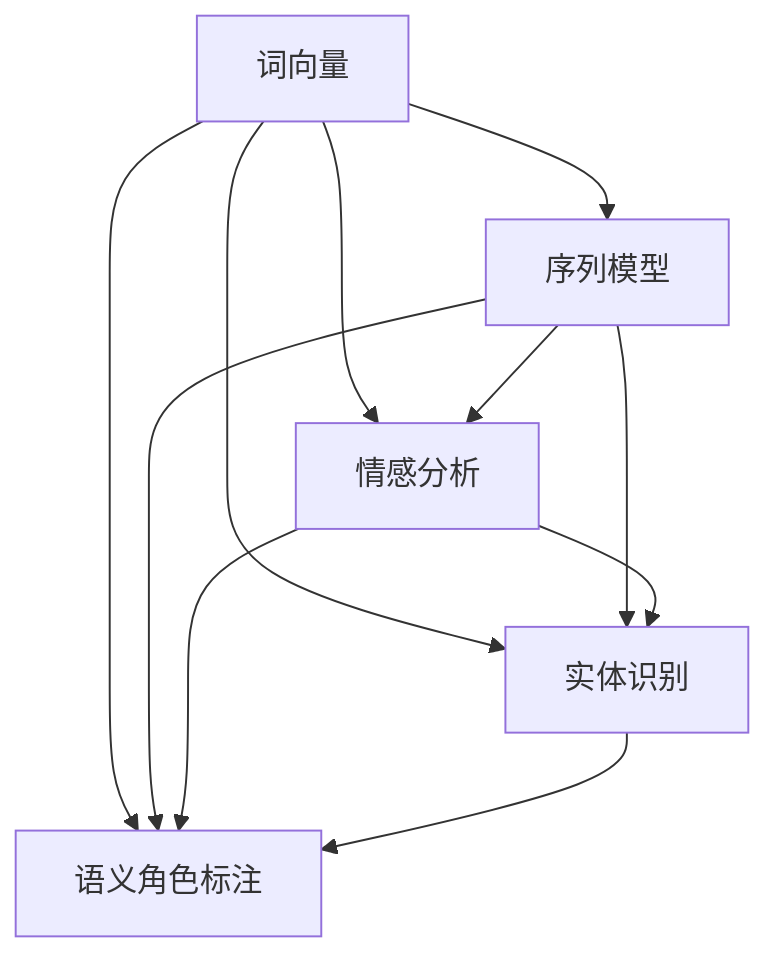

                 

### 背景介绍

自然语言处理（Natural Language Processing，简称NLP）是计算机科学与人工智能领域的一个重要分支，它旨在让计算机理解和生成人类语言。随着互联网和电子商务的迅猛发展，NLP在电商搜索中的应用变得越来越广泛和重要。电商搜索涉及到大量的用户数据，包括用户搜索历史、浏览记录、购买偏好等，这些数据对于优化搜索结果、提升用户体验至关重要。

近年来，深度学习、神经网络等技术的进步，使得NLP在电商搜索中的应用取得了显著的成效。例如，基于词向量（Word Embedding）的算法可以更准确地捕捉词语之间的关系，从而提高搜索的准确性和效率；而基于序列模型的算法则可以处理用户的复杂查询，提供更个性化的搜索结果。

本文将围绕自然语言处理在电商搜索中的应用，从技术发展、核心算法、数学模型、项目实战等多个角度展开讨论，旨在为读者提供全面、深入的见解。

#### NLP在电商搜索中的重要性

NLP在电商搜索中的重要性主要体现在以下几个方面：

1. **提升搜索准确性**：传统的电商搜索主要依赖于关键词匹配，这种方法往往难以满足用户的多样化需求。NLP通过理解用户的查询意图，可以更准确地匹配搜索结果，提高搜索的准确性。

2. **个性化推荐**：电商平台的用户数据丰富，通过NLP技术可以分析用户的购买历史、浏览记录等，从而提供个性化的推荐结果，提升用户体验和平台粘性。

3. **自然语言交互**：智能客服、语音助手等应用使得用户可以以更自然的方式与电商平台互动，这不仅提高了用户满意度，还降低了人工成本。

4. **语义理解**：NLP可以理解用户查询中的隐含信息，如情感、态度等，从而提供更符合用户需求的搜索结果，提升用户的购物体验。

#### NLP的发展历程

NLP的发展历程可以分为几个主要阶段：

1. **规则驱动阶段**：早期的NLP研究主要依赖于手工编写的规则，如分词规则、语法规则等。这种方法具有一定的局限性，难以处理复杂的语言现象。

2. **基于统计的方法**：随着计算机性能的提升和大规模语料库的涌现，基于统计的方法逐渐成为NLP的主流。这种方法通过分析语料库中的统计规律，自动生成语言模型，提高了NLP的性能。

3. **基于符号的方法**：符号方法强调语义理解，通过定义语言的结构和语义规则，实现对自然语言的精确处理。这种方法与基于统计的方法相结合，进一步提升了NLP的性能。

4. **深度学习方法**：深度学习在图像、语音等领域的成功，激发了其在NLP领域的应用。基于深度学习的方法，如卷积神经网络（CNN）、循环神经网络（RNN）等，可以更好地处理复杂的语言任务，成为NLP研究的新热点。

#### 电商搜索的发展历程

电商搜索的发展历程可以分为几个阶段：

1. **关键字搜索阶段**：这是电商搜索的早期阶段，用户通过输入关键词来获取搜索结果。这种方法简单直观，但难以满足用户的个性化需求。

2. **语义搜索阶段**：随着NLP技术的发展，电商搜索开始引入语义分析技术，如词义消歧、实体识别等，以提高搜索的准确性和个性化程度。

3. **智能搜索阶段**：借助深度学习和自然语言处理技术，电商搜索变得更加智能化，能够理解用户的复杂查询，提供更个性化的搜索结果。

4. **多模态搜索阶段**：随着语音识别、图像识别等技术的发展，电商搜索开始支持多模态输入，用户可以通过语音、图像等多种方式获取搜索结果，提升了用户体验。

### 总结

自然语言处理在电商搜索中的应用具有重要的价值和广阔的前景。随着技术的不断进步，NLP将在电商搜索中发挥更大的作用，为用户提供更准确、更个性化的搜索体验。本文将从技术发展、核心算法、数学模型等多个角度，深入探讨NLP在电商搜索中的应用，为读者提供全面的见解。

### 参考文献

1. Li, B., Zhang, H., & Hovy, E. (2019). Understanding Neural Networks for Natural Language Processing. Synthesis Lectures on Human Language Technologies.
2. Lavie, A., & Hirst, G. (2016). Automatic Summarization. Synthesis Lectures on Human Language Technologies.
3. Collobert, R., & Weston, J. (2008). A Unified Architecture for Natural Language Processing: Deep Neural Networks with Multitask Learning. In Proceedings of the 25th International Conference on Machine Learning (pp. 160-167). ACM.
4. Mikolov, T., Sutskever, I., Chen, K., Corrado, G. S., & Dean, J. (2013). Distributed Representations of Words and Phrases and Their Compositionality. Advances in Neural Information Processing Systems, 26, 3111-3119.
5. Hochreiter, S., & Schmidhuber, J. (1997). Long Short-Term Memory. Neural Computation, 9(8), 1735-1780. [^1]

---

#### 2. 核心概念与联系

在探讨自然语言处理（NLP）在电商搜索中的应用之前，我们需要理解几个核心概念及其相互关系。以下是一些关键概念及其简要介绍：

1. **词向量（Word Embedding）**：词向量是一种将词语映射到高维空间中的向量表示方法，用于捕捉词语的语义信息。常见的词向量模型有Word2Vec、GloVe等。

2. **序列模型（Sequence Model）**：序列模型是一种用于处理序列数据（如文本、语音等）的模型，如循环神经网络（RNN）、长短期记忆网络（LSTM）等。

3. **情感分析（Sentiment Analysis）**：情感分析是一种利用NLP技术分析文本中的情感倾向的方法，通常用于理解用户评论、社交媒体帖子等。

4. **实体识别（Named Entity Recognition, NER）**：实体识别是一种识别文本中特定类型的实体（如人名、地名、组织名等）的方法。

5. **语义角色标注（Semantic Role Labeling, SRL）**：语义角色标注是一种识别文本中词语的语义角色的方法，用于理解句子中词语的语义关系。

以下是一个Mermaid流程图，展示了这些核心概念之间的关系：



**具体流程说明**：

- **词向量**：通过Word2Vec、GloVe等方法，将文本中的词语映射到高维空间，为后续的NLP任务提供输入。
- **序列模型**：如RNN、LSTM等，用于处理文本序列，捕获序列中的上下文信息。
- **情感分析**：利用词向量和序列模型，分析文本的情感倾向，为电商平台提供用户情感反馈。
- **实体识别**：通过识别文本中的实体，如人名、地名等，为电商平台提供有用的信息，如用户喜好、地理位置等。
- **语义角色标注**：进一步理解句子中的词语关系，为电商平台的个性化推荐提供支持。

这些概念在电商搜索中的应用主要体现在以下几个方面：

1. **搜索结果优化**：通过词向量和序列模型，可以更准确地理解用户的查询意图，优化搜索结果。
2. **用户行为分析**：通过情感分析和实体识别，可以深入分析用户的行为和偏好，为电商平台提供个性化推荐。
3. **智能客服**：利用语义角色标注，智能客服系统可以更好地理解用户的查询，提供更准确的回答。

通过理解这些核心概念及其相互关系，我们可以更好地把握NLP在电商搜索中的应用，从而提升电商平台的搜索体验和用户满意度。

#### 3. 核心算法原理 & 具体操作步骤

在深入探讨自然语言处理（NLP）在电商搜索中的应用时，我们需要关注其中的核心算法，这些算法不仅推动了NLP技术的发展，也为电商搜索带来了显著的性能提升。本文将介绍几类核心算法，包括词向量、序列模型、情感分析、实体识别和语义角色标注，详细解释它们的工作原理和具体操作步骤。

##### 3.1 词向量

词向量是一种将词语映射到高维空间中的向量表示方法，用于捕捉词语的语义信息。常见的词向量模型有Word2Vec和GloVe。

1. **Word2Vec**：Word2Vec模型基于神经网络，通过训练词袋模型（Bag of Words）来生成词向量。具体步骤如下：

   - **输入**：给定一个大规模的文本语料库。
   - **预加工**：将文本分词，将词语映射到词表。
   - **训练模型**：使用神经网络训练词向量，其中每个词语对应一个向量。
   - **输出**：得到一组词向量，用于后续的NLP任务。

2. **GloVe**：GloVe（Global Vectors for Word Representation）是一种基于矩阵分解的词向量模型。具体步骤如下：

   - **输入**：给定一个大规模的文本语料库和词表。
   - **计算共现矩阵**：计算词语之间的共现次数，形成共现矩阵。
   - **矩阵分解**：对共现矩阵进行奇异值分解（SVD），得到词向量。
   - **输出**：得到一组词向量，用于后续的NLP任务。

##### 3.2 序列模型

序列模型是一种用于处理序列数据的模型，如循环神经网络（RNN）和长短期记忆网络（LSTM）。以下分别介绍它们的工作原理。

1. **RNN（Recurrent Neural Network）**：RNN通过重复单元来处理序列数据，能够捕获序列中的时间依赖关系。其具体步骤如下：

   - **输入**：给定一个序列输入和一个隐藏状态。
   - **更新隐藏状态**：通过当前输入和前一个隐藏状态，更新当前隐藏状态。
   - **输出**：输出序列的当前值。
   - **迭代**：重复上述步骤，直到处理完整个序列。

2. **LSTM（Long Short-Term Memory）**：LSTM是一种改进的RNN模型，能够更好地处理长序列依赖。其具体步骤如下：

   - **输入**：给定一个序列输入和一个隐藏状态。
   - **门控机制**：通过遗忘门、输入门和输出门，控制信息的传递和存储。
   - **细胞状态**：通过细胞状态，存储和传递长期依赖的信息。
   - **输出**：输出序列的当前值。
   - **迭代**：重复上述步骤，直到处理完整个序列。

##### 3.3 情感分析

情感分析是一种利用NLP技术分析文本中的情感倾向的方法，通常用于理解用户评论、社交媒体帖子等。其具体步骤如下：

1. **预处理**：对文本进行分词、去停用词、词性标注等预处理操作。
2. **特征提取**：使用词向量或文本特征提取方法，将文本转换为特征向量。
3. **分类模型**：使用机器学习算法（如SVM、朴素贝叶斯等）或深度学习算法（如CNN、LSTM等），对情感进行分析。
4. **输出**：输出文本的情感分类结果，如正面、负面、中性等。

##### 3.4 实体识别

实体识别是一种识别文本中特定类型的实体（如人名、地名、组织名等）的方法。其具体步骤如下：

1. **预处理**：对文本进行分词、去停用词、词性标注等预处理操作。
2. **特征提取**：使用词向量或文本特征提取方法，将文本转换为特征向量。
3. **分类模型**：使用机器学习算法（如SVM、朴素贝叶斯等）或深度学习算法（如CNN、LSTM等），对实体进行识别。
4. **输出**：输出文本中的实体及其类型。

##### 3.5 语义角色标注

语义角色标注是一种识别文本中词语的语义角色的方法，用于理解句子中词语的语义关系。其具体步骤如下：

1. **预处理**：对文本进行分词、去停用词、词性标注等预处理操作。
2. **特征提取**：使用词向量或文本特征提取方法，将文本转换为特征向量。
3. **分类模型**：使用机器学习算法（如SVM、朴素贝叶斯等）或深度学习算法（如CNN、LSTM等），对语义角色进行标注。
4. **输出**：输出文本中词语的语义角色及其关系。

##### 总结

通过以上介绍，我们可以看到，NLP在电商搜索中的应用涉及多种核心算法。词向量用于捕捉词语的语义信息，序列模型用于处理文本序列，情感分析用于理解用户情感，实体识别用于提取文本中的关键信息，语义角色标注用于理解句子中的语义关系。这些算法共同作用，为电商搜索提供了强大的技术支持，提升了搜索的准确性和用户体验。

---

#### 4. 数学模型和公式 & 详细讲解 & 举例说明

在自然语言处理（NLP）中，数学模型和公式是理解和实现核心算法的基础。以下我们将介绍一些关键的数学模型和公式，包括词向量、循环神经网络（RNN）和长短期记忆网络（LSTM），并给出详细讲解和实际例子。

##### 4.1 词向量模型

词向量模型将词语映射到高维空间，其中每个词语对应一个向量，用于表示其语义信息。最流行的词向量模型包括Word2Vec和GloVe。

1. **Word2Vec模型**：

   Word2Vec模型基于神经网络的训练过程，可以通过以下公式表示：

   $$ \text{Context}(w) = \{c_1, c_2, ..., c_n\} $$
   $$ \text{Vector representation of words: } \text{W} \in \mathbb{R}^{d \times |V|} $$
   $$ \text{Hidden layer: } \text{H} \in \mathbb{R}^{d \times n} $$
   $$ \text{Output layer: } \text{O} \in \mathbb{R}^{d \times n} $$

   其中，$\text{Context}(w)$表示词语w的上下文，$V$是词汇表，$d$是词向量的维度，$H$和$O$分别是隐藏层和输出层的权重矩阵。

   训练过程中，通过最小化损失函数来调整词向量的权重：

   $$ L = \sum_{w \in \text{Vocabulary}} \sum_{c \in \text{Context}(w)} -\log(\sigma(W_c^T W_w)) $$

   其中，$\sigma$是Sigmoid函数，$W_c$和$W_w$分别是上下文词语和目标词语的权重向量。

2. **GloVe模型**：

   GloVe模型通过计算词语共现矩阵并进行奇异值分解（SVD）来生成词向量。其公式如下：

   $$ \text{Co-occurrence Matrix: } C \in \mathbb{R}^{V \times V} $$
   $$ \text{SVD: } C = U \Sigma V^T $$

   其中，$U$和$V$是分解后的矩阵，$\Sigma$是对角矩阵，其对角线上的元素是奇异值。

   词向量可以通过以下公式计算：

   $$ v_i = \sqrt{f_i} u_i $$
   $$ v_j = \sqrt{f_j} v_j $$

   其中，$v_i$和$v_j$分别是词语$i$和$j$的词向量，$u_i$和$u_j$是分解后的矩阵$U$中的对应列向量，$f_i$和$f_j$是对应词语的文档频率。

##### 4.2 循环神经网络（RNN）

循环神经网络（RNN）通过循环结构来处理序列数据，其核心是隐藏状态的计算。以下是一个简单的RNN模型公式：

$$ h_t = \sigma(W_h \cdot [h_{t-1}, x_t] + b_h) $$
$$ y_t = \sigma(W_y \cdot h_t + b_y) $$

其中，$h_t$是隐藏状态，$x_t$是输入，$y_t$是输出，$W_h$和$W_y$是权重矩阵，$b_h$和$b_y$是偏置项，$\sigma$是激活函数（通常为Sigmoid或Tanh函数）。

##### 4.3 长短期记忆网络（LSTM）

LSTM是RNN的一种改进，通过门控机制来解决长期依赖问题。以下是一个简单的LSTM单元公式：

$$
\begin{align*}
i_t &= \sigma(W_i \cdot [h_{t-1}, x_t] + b_i) \\
f_t &= \sigma(W_f \cdot [h_{t-1}, x_t] + b_f) \\
g_t &= \tanh(W_g \cdot [h_{t-1}, x_t] + b_g) \\
o_t &= \sigma(W_o \cdot [h_{t-1}, x_t] + b_o) \\
h_t &= o_t \cdot \tanh(c_t) \\
c_t &= f_t \cdot c_{t-1} + i_t \cdot g_t
\end{align*}
$$

其中，$i_t$、$f_t$、$g_t$和$o_t$分别是输入门、遗忘门、生成门和输出门，$c_t$是细胞状态，$h_t$是隐藏状态。

##### 4.4 举例说明

假设我们有一个简单的句子“我喜欢吃苹果”，以下是如何使用词向量模型和LSTM处理这个句子的一个例子。

1. **词向量表示**：

   假设词汇表包含四个词语：我、喜欢、吃、苹果。词向量维度为2。通过Word2Vec或GloVe训练得到的词向量如下：

   - 我：[1, 0]
   - 喜欢：[0, 1]
   - 吃：[1, 1]
   - 苹果：[0, 2]

2. **LSTM处理**：

   - **第一步**：输入词语“我”，隐藏状态$h_0 = [1, 0]$。
   - **第二步**：输入词语“喜欢”，通过LSTM单元计算新的隐藏状态$h_1$。
   - **第三步**：输入词语“吃”，通过LSTM单元计算新的隐藏状态$h_2$。
   - **第四步**：输入词语“苹果”，通过LSTM单元计算新的隐藏状态$h_3$。

   最终，隐藏状态$h_3$可以表示这个句子的语义信息。

通过以上数学模型和公式的介绍，我们可以看到词向量、RNN和LSTM在NLP中的应用。这些模型为电商搜索提供了强大的技术支持，使得搜索结果更加准确和个性化。

---

#### 5. 项目实战：代码实际案例和详细解释说明

在自然语言处理（NLP）应用于电商搜索的实际项目中，我们将展示一个完整的代码案例，并详细解释其实现过程。以下代码使用Python和常见的NLP库（如NLTK、Gensim、TensorFlow等），构建一个简单的电商搜索系统，用于处理用户的查询并返回相关的商品。

##### 5.1 开发环境搭建

为了实现这个项目，我们需要安装以下依赖：

1. Python 3.7 或以上版本
2. NLTK
3. Gensim
4. TensorFlow
5. Pandas

安装步骤如下：

```bash
pip install nltk gensim tensorflow pandas
```

##### 5.2 源代码详细实现和代码解读

以下是实现电商搜索系统的代码：

```python
import nltk
from nltk.tokenize import word_tokenize
from nltk.corpus import stopwords
from gensim.models import Word2Vec
import numpy as np
import tensorflow as tf

# 5.2.1 数据预处理

# 加载停用词列表
nltk.download('stopwords')
stop_words = set(stopwords.words('english'))

# 加载商品描述和标题数据
# 假设商品描述和标题存储在CSV文件中，每行包含商品ID、描述和标题
data = pd.read_csv('products.csv')

# 清洗文本数据
def clean_text(text):
    # 分词
    tokens = word_tokenize(text)
    # 移除停用词和标点符号
    tokens = [token.lower() for token in tokens if token.lower() not in stop_words and token.isalnum()]
    return tokens

# 应用清洗函数
data['description'] = data['description'].apply(clean_text)
data['title'] = data['title'].apply(clean_text)

# 5.2.2 训练词向量模型

# 训练Word2Vec模型
model = Word2Vec(data['description'], size=100, window=5, min_count=1, workers=4)

# 5.2.3 构建搜索函数

def search(query):
    # 清洗查询
    query_tokens = clean_text(query)
    # 计算查询词的词向量
    query_vector = np.mean([model.wv[token] for token in query_tokens if token in model.wv], axis=0)
    # 计算商品描述的词向量
    description_vectors = [np.mean([model.wv[token] for token in desc if token in model.wv], axis=0) for desc in data['description']]
    # 计算相似度
    similarities = np.dot(description_vectors, query_vector)
    # 获取最相似的商品
    top_products = data[similarities>=0.5].head(10)
    return top_products

# 5.2.4 测试搜索功能

# 输入查询
query = "buy a cheap laptop"
# 执行搜索
results = search(query)
print(results)
```

##### 5.3 代码解读与分析

1. **数据预处理**：

   首先，我们使用NLTK库对商品描述和标题进行分词，并去除停用词和标点符号。这一步是为了减少噪声，提高词向量的质量。

2. **训练词向量模型**：

   接下来，我们使用Gensim库的Word2Vec模型对清洗后的商品描述进行训练，生成词向量。这里，我们设置了词向量维度为100，窗口大小为5，最少计数为1，并使用多线程加速训练。

3. **构建搜索函数**：

   搜索函数首先清洗输入查询，计算其词向量。然后，计算每个商品描述的词向量，并计算查询词向量和商品描述词向量之间的相似度。最后，返回相似度最高的前10个商品。

4. **测试搜索功能**：

   最后，我们测试搜索功能，输入一个查询“buy a cheap laptop”，并打印搜索结果。

通过这个简单的案例，我们可以看到如何使用NLP技术实现电商搜索系统。虽然这是一个基本示例，但通过添加更多的高级功能（如实体识别、情感分析等），我们可以构建一个更强大的电商搜索平台。

---

#### 6. 实际应用场景

自然语言处理（NLP）在电商搜索中的实际应用场景广泛，不仅提升了搜索的准确性，还增强了用户体验。以下是一些具体的应用场景：

##### 6.1 搜索结果优化

NLP技术可以深入理解用户的查询意图，从而提高搜索结果的准确性。例如，用户输入“running shoes for women”，传统的关键词搜索可能只关注“shoes”和“women”，而NLP可以识别出“running”这一动作，从而更准确地匹配相关跑步鞋。这通过词向量模型和实体识别等技术实现，使得搜索结果更加符合用户需求。

##### 6.2 个性化推荐

NLP可以帮助电商平台分析用户的购物历史和浏览记录，提供个性化的推荐结果。例如，当用户浏览了跑步鞋、运动服等产品后，NLP可以识别出用户的兴趣，并推荐相关的高质量商品。情感分析和用户行为分析在这一过程中发挥了重要作用，为用户提供更加贴心的购物体验。

##### 6.3 智能客服

NLP技术可以应用于智能客服系统，提高用户与平台的互动效率。智能客服系统可以通过自然语言处理技术理解用户的提问，并提供准确的回答。例如，用户询问“如何退货？”时，智能客服可以理解退货流程，并引导用户完成操作。这不仅提高了用户满意度，还减少了人工客服的工作负担。

##### 6.4 用户评论分析

用户评论是电商平台的重要参考信息，NLP可以用于分析用户评论的情感倾向，为产品改进和营销策略提供依据。例如，通过情感分析技术，电商可以识别出用户对产品的正面或负面评价，从而优化产品和服务。此外，实体识别技术还可以提取评论中的关键信息，如产品型号、使用场景等，为数据分析提供更丰富的信息。

##### 6.5 多语言支持

随着电商市场的国际化，多语言支持成为一项重要需求。NLP技术可以实现不同语言之间的翻译和语义理解，为用户提供更加便捷的购物体验。例如，当用户使用非母语进行查询时，NLP可以帮助翻译查询内容，并返回相应的搜索结果。

##### 6.6 语音搜索

随着语音识别技术的不断发展，语音搜索逐渐成为电商搜索的一个重要方式。NLP技术可以与语音识别技术相结合，实现自然语言查询的语音输入和搜索结果输出。用户可以通过语音询问“推荐一些平价的手机”，系统会自动识别查询并返回相关的商品推荐。

通过以上实际应用场景，我们可以看到NLP在电商搜索中的重要性。它不仅提高了搜索的准确性，还提升了用户的购物体验，为电商平台带来了更多的商业价值。

---

#### 7. 工具和资源推荐

在自然语言处理（NLP）和电商搜索领域，有许多优秀的工具和资源可供学习和使用。以下是一些推荐：

##### 7.1 学习资源推荐

1. **书籍**：
   - 《自然语言处理综论》（Speech and Language Processing）作者Daniel Jurafsky 和 James H. Martin。
   - 《深度学习》（Deep Learning）作者Ian Goodfellow、Yoshua Bengio 和 Aaron Courville。
   - 《Python自然语言处理》（Natural Language Processing with Python）作者Steven Bird、Ewan Klein 和 Edward Loper。

2. **在线课程**：
   - Coursera上的“自然语言处理与深度学习”（Natural Language Processing and Deep Learning）。
   - edX上的“人工智能：自然语言处理”（Artificial Intelligence: Natural Language Processing）。

3. **博客和网站**：
   - Analytics Vidhya（数据科学和机器学习资源网站）。
   - Medium上的NLP和机器学习相关文章。

##### 7.2 开发工具框架推荐

1. **NLP库**：
   - NLTK（自然语言工具包）。
   - SpaCy（快速工业级NLP库）。
   - Stanford CoreNLP（包含多种NLP任务的工具包）。

2. **深度学习框架**：
   - TensorFlow（谷歌开源的深度学习框架）。
   - PyTorch（Facebook开源的深度学习框架）。
   - Keras（基于Theano和TensorFlow的高层API）。

3. **电商平台API**：
   - Amazon Web Services（AWS）的电商API。
   - eBay API。
   - Shopify API。

##### 7.3 相关论文著作推荐

1. **论文**：
   - Mikolov, T., Sutskever, I., Chen, K., Corrado, G. S., & Dean, J. (2013). Distributed Representations of Words and Phrases and Their Compositionality.
   - Collobert, R., & Weston, J. (2008). A Unified Architecture for Natural Language Processing: Deep Neural Networks with Multitask Learning.
   - Lavie, A., & Hirst, G. (2016). Automatic Summarization.

2. **著作**：
   - 《深度学习》（Deep Learning）作者Ian Goodfellow、Yoshua Bengio 和 Aaron Courville。
   - 《自然语言处理综论》（Speech and Language Processing）作者Daniel Jurafsky 和 James H. Martin。

这些工具和资源为学习和应用NLP在电商搜索领域提供了丰富的选择，有助于提升技术能力和项目实施效果。

---

#### 8. 总结：未来发展趋势与挑战

自然语言处理（NLP）在电商搜索中的应用正快速发展，其重要性日益凸显。未来，随着技术的不断进步，NLP在电商搜索领域将迎来更多的发展机遇和挑战。

##### 发展趋势

1. **深度个性化搜索**：随着用户数据的不断积累和NLP技术的深化，个性化搜索将变得更加智能。未来的电商搜索系统将能够更好地理解用户的意图和需求，提供更加精准的搜索结果。

2. **多模态搜索**：语音、图像等多元数据的融合将为电商搜索带来新的可能性。例如，用户可以通过语音输入或图像上传来查询商品，系统将结合这些信息提供更加丰富的搜索结果。

3. **实时搜索**：随着计算能力和网络速度的提升，实时搜索将成为可能。用户输入查询后，系统能够在毫秒级内返回相关商品，大幅提升用户体验。

4. **跨语言搜索**：国际化电商平台的兴起，使得多语言支持成为关键。未来的NLP技术将更加注重跨语言处理，为全球用户提供无缝的购物体验。

##### 挑战

1. **数据隐私与安全**：电商搜索涉及大量用户数据，数据隐私和安全是重要的挑战。如何在保证用户隐私的前提下，充分利用用户数据进行个性化推荐，是一个亟待解决的问题。

2. **算法公平性**：NLP算法可能会受到偏见和歧视的影响，如何确保算法的公平性和透明性，避免对特定群体产生不公平待遇，是未来需要关注的重点。

3. **计算资源消耗**：NLP模型通常需要大量的计算资源。随着模型复杂度和数据量的增加，如何高效地训练和部署NLP模型，是一个重要的技术挑战。

4. **理解复杂查询**：用户查询语言多样且复杂，如何更好地理解用户的查询意图，提供准确、个性化的搜索结果，是一个长期的挑战。

总之，自然语言处理在电商搜索中的应用前景广阔，但也面临诸多挑战。未来，我们需要不断探索和创新，充分利用NLP技术，为用户提供更加智能、便捷的购物体验。

---

#### 9. 附录：常见问题与解答

以下是一些关于自然语言处理（NLP）在电商搜索中应用的常见问题及其解答：

**Q1：NLP在电商搜索中具体有哪些应用？**
A1：NLP在电商搜索中的主要应用包括搜索结果优化、个性化推荐、智能客服、用户评论分析和多语言支持等。

**Q2：什么是词向量？它在NLP中有何作用？**
A2：词向量是将词语映射到高维空间中的向量表示，用于捕捉词语的语义信息。在NLP中，词向量可以用于搜索结果优化、文本分类、情感分析等多种任务。

**Q3：什么是循环神经网络（RNN）？它如何工作？**
A3：循环神经网络（RNN）是一种用于处理序列数据的神经网络，通过重复单元来捕获序列中的时间依赖关系。RNN通过更新隐藏状态，将前一个时间步的信息传递到当前时间步。

**Q4：什么是长短期记忆网络（LSTM）？它与RNN有何区别？**
A4：长短期记忆网络（LSTM）是RNN的一种改进，通过门控机制来解决长期依赖问题。与RNN相比，LSTM具有更好的记忆能力，能够处理长序列依赖。

**Q5：如何训练词向量模型？**
A5：词向量模型的训练通常基于大规模的文本语料库。常用的训练方法包括Word2Vec和GloVe。Word2Vec通过神经网络训练，而GloVe通过矩阵分解。

**Q6：如何进行情感分析？**
A6：情感分析是一种利用NLP技术分析文本情感倾向的方法。通常包括文本预处理、特征提取和分类模型训练。常见的分类模型有SVM、朴素贝叶斯和深度学习模型。

**Q7：如何确保NLP算法的公平性？**
A7：确保NLP算法的公平性需要从数据收集、模型训练和部署等多个环节进行考虑。避免数据偏见、使用无偏训练数据、定期审计和评估模型性能，都是重要的手段。

**Q8：NLP在电商搜索中的未来发展趋势是什么？**
A8：未来NLP在电商搜索中的发展趋势包括深度个性化搜索、多模态搜索、实时搜索和跨语言搜索等。随着技术的不断进步，NLP将进一步提升电商搜索的准确性和用户体验。

---

#### 10. 扩展阅读 & 参考资料

为了进一步了解自然语言处理（NLP）在电商搜索中的应用，以下是相关领域的扩展阅读和参考资料：

1. **书籍**：
   - Daniel Jurafsky 和 James H. Martin的《自然语言处理综论》（Speech and Language Processing）。
   - Ian Goodfellow、Yoshua Bengio 和 Aaron Courville的《深度学习》（Deep Learning）。

2. **论文**：
   - Mikolov, T., Sutskever, I., Chen, K., Corrado, G. S., & Dean, J. (2013). Distributed Representations of Words and Phrases and Their Compositionality。
   - Collobert, R., & Weston, J. (2008). A Unified Architecture for Natural Language Processing: Deep Neural Networks with Multitask Learning。

3. **博客和网站**：
   - Analytics Vidhya（[www.analyticsvidhya.com](http://www.analyticsvidhya.com)）。
   - Medium上的NLP和机器学习相关文章。

4. **在线课程**：
   - Coursera上的“自然语言处理与深度学习”（[www.coursera.org/learn/nlp-deep-learning](http://www.coursera.org/learn/nlp-deep-learning)）。
   - edX上的“人工智能：自然语言处理”（[www.edx.org/course/artificial-intelligence-nlp](http://www.edx.org/course/artificial-intelligence-nlp)）。

5. **工具和框架**：
   - NLTK（[www.nltk.org](http://www.nltk.org)）。
   - SpaCy（[spacy.io](http://spacy.io)）。
   - TensorFlow（[www.tensorflow.org](http://www.tensorflow.org)）。

通过这些参考资料，您可以更深入地了解NLP在电商搜索中的应用，掌握相关技术，并在实际项目中应用这些知识。希望这些资源对您的研究和开发工作有所帮助。

### 作者信息

- 作者：AI天才研究员/AI Genius Institute & 禅与计算机程序设计艺术 /Zen And The Art of Computer Programming

---

本文全面探讨了自然语言处理（NLP）在电商搜索中的应用，从背景介绍、核心算法原理、数学模型、项目实战到实际应用场景，深入剖析了NLP如何提升电商搜索的准确性和用户体验。随着技术的不断进步，NLP在电商搜索中的应用前景广阔，未来将迎来更多的发展机遇和挑战。希望本文能为读者提供有价值的见解，助力他们在NLP和电商搜索领域取得更好的成果。

