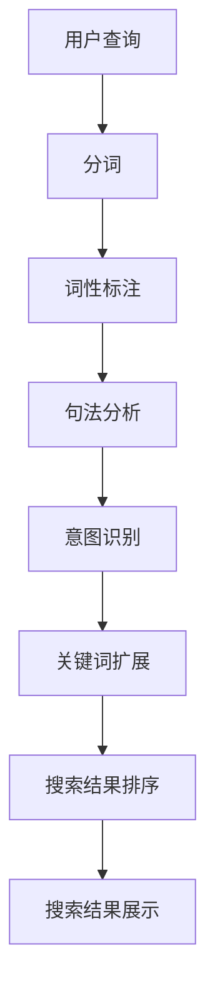
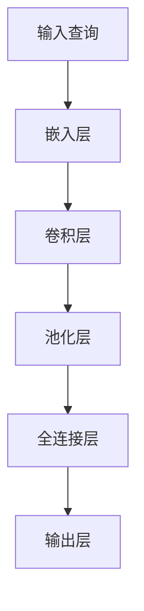
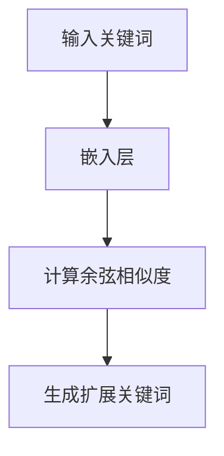

                 

### 文章标题：自然语言处理在电商搜索中的应用：技术发展与未来趋势

> **关键词：** 自然语言处理，电商搜索，技术发展，未来趋势

> **摘要：** 本文将深入探讨自然语言处理（NLP）在电商搜索中的应用。我们将回顾NLP的发展历程，探讨其核心概念和算法原理，并通过实际案例和数学模型，展示NLP技术在电商搜索中的具体应用。此外，我们还将分析NLP在电商搜索中的实际应用场景，并探讨未来的发展趋势和面临的挑战。

-----------------------

## 1. 背景介绍

随着互联网的快速发展，电子商务已经成为人们日常生活中不可或缺的一部分。在电商领域，搜索功能扮演着至关重要的角色。高效的搜索系统能够帮助用户快速找到所需的商品，提高用户体验，增加销售额。然而，传统的基于关键词的搜索方法存在诸多限制，无法满足用户日益复杂的搜索需求。

自然语言处理（NLP）作为一种人工智能技术，旨在使计算机能够理解和处理人类语言。NLP技术的应用使得电商搜索系统能够更好地理解用户的查询意图，提供更准确、更个性化的搜索结果。本文将详细介绍NLP在电商搜索中的应用，包括其技术发展历程、核心概念和算法原理，以及未来趋势和挑战。

-----------------------

## 2. 核心概念与联系

### 2.1 自然语言处理（NLP）

自然语言处理（NLP）是人工智能（AI）领域的一个重要分支，旨在使计算机能够理解和处理人类语言。NLP技术包括文本处理、语音识别、语言理解、语言生成等多个方面。

#### 文本处理（Text Processing）

文本处理是NLP的基础，包括分词（Tokenization）、词性标注（Part-of-Speech Tagging）、句法分析（Syntactic Parsing）等。通过这些技术，计算机能够将文本拆分成更小的单元，如单词或短语，并对它们进行分类和标注。

#### 语音识别（Speech Recognition）

语音识别技术使计算机能够将语音信号转换为文本。这项技术广泛应用于语音助手、电话客服、语音搜索等领域。

#### 语言理解（Language Understanding）

语言理解涉及对文本或语音的理解和分析，包括语义分析（Semantic Analysis）、情感分析（Sentiment Analysis）、意图识别（Intent Recognition）等。通过这些技术，计算机能够理解用户查询的含义和意图。

#### 语言生成（Language Generation）

语言生成技术使计算机能够生成自然语言文本，包括自动摘要（Automatic Summarization）、机器翻译（Machine Translation）、文本生成（Text Generation）等。

### 2.2 电商搜索

电商搜索是指用户在电商平台上通过输入关键词或提问，寻找所需商品的过程。一个高效的电商搜索系统需要能够理解用户查询的意图，并提供准确、个性化的搜索结果。

### 2.3 NLP与电商搜索的联系

NLP技术在电商搜索中的应用主要体现在以下几个方面：

1. **查询意图识别**：NLP技术能够帮助搜索系统理解用户的查询意图，从而提供更准确的搜索结果。
2. **关键词扩展**：NLP技术能够对用户输入的关键词进行扩展，生成更多相关的关键词，从而提高搜索结果的多样性。
3. **商品推荐**：NLP技术能够分析用户的历史行为和查询记录，为用户提供个性化的商品推荐。
4. **搜索结果优化**：NLP技术能够对搜索结果进行排序和筛选，提高搜索结果的准确性和相关性。

### 2.4 Mermaid 流程图

以下是一个简单的Mermaid流程图，展示了NLP技术在电商搜索中的应用流程：



-----------------------

## 3. 核心算法原理 & 具体操作步骤

### 3.1 查询意图识别

查询意图识别是NLP技术在电商搜索中最核心的算法之一。它的目标是通过分析用户输入的查询，理解其背后的意图，从而提供更准确的搜索结果。

#### 3.1.1 算法原理

查询意图识别主要依赖于以下技术：

1. **关键词提取**：从用户查询中提取关键词，如商品名称、品牌、型号等。
2. **词性标注**：对提取的关键词进行词性标注，如名词、动词、形容词等。
3. **句法分析**：分析查询的句法结构，确定查询的意图。
4. **语义分析**：通过语义分析，理解查询的深层含义。

#### 3.1.2 操作步骤

1. **分词**：使用分词技术，将用户查询拆分成单词或短语。
2. **词性标注**：使用词性标注技术，对分词结果进行标注。
3. **句法分析**：使用句法分析技术，分析查询的句法结构。
4. **语义分析**：使用语义分析技术，理解查询的深层含义。
5. **意图识别**：根据分析结果，识别用户查询的意图。

### 3.2 关键词扩展

关键词扩展是提高搜索结果多样性和准确性的重要手段。它的目标是通过分析用户查询，生成更多相关的关键词。

#### 3.2.1 算法原理

关键词扩展主要依赖于以下技术：

1. **同义词替换**：将用户查询中的关键词替换为同义词，以生成更多相关的关键词。
2. **上下文分析**：根据查询的上下文，推断出更多相关的关键词。
3. **词嵌入**：使用词嵌入技术，将关键词映射到高维空间，寻找与目标关键词相似的词。

#### 3.2.2 操作步骤

1. **同义词替换**：使用同义词词典，将用户查询中的关键词替换为同义词。
2. **上下文分析**：分析查询的上下文，推断出更多相关的关键词。
3. **词嵌入**：使用词嵌入技术，将关键词映射到高维空间，寻找与目标关键词相似的词。

-----------------------

## 4. 数学模型和公式 & 详细讲解 & 举例说明

### 4.1 查询意图识别

#### 4.1.1 数学模型

查询意图识别通常采用基于神经网络的方法，如卷积神经网络（CNN）和递归神经网络（RNN）。以下是一个简单的CNN模型：

```latex
Y = \sigma(W \cdot \phi(h_{\text{query}}))
```

其中，\( Y \)表示意图识别的结果，\( \sigma \)表示激活函数，\( W \)表示权重矩阵，\( \phi \)表示卷积操作，\( h_{\text{query}} \)表示用户查询的编码。

#### 4.1.2 详细讲解

1. **卷积操作**：卷积操作用于提取用户查询中的特征。通过在查询序列上滑动卷积核，提取出局部特征。
2. **激活函数**：激活函数用于引入非线性，使模型能够拟合复杂的非线性关系。常见的激活函数有ReLU、Sigmoid等。
3. **权重矩阵**：权重矩阵用于将卷积操作得到的特征映射到意图类别。

#### 4.1.3 举例说明

假设用户查询为“买一个红色的iPhone 12”，我们可以将其编码为一个向量\( h_{\text{query}} \)。通过卷积神经网络，我们可以提取出与意图相关的特征，如“红色”、“iPhone 12”等。最后，通过激活函数，得到意图识别的结果。

### 4.2 关键词扩展

#### 4.2.1 数学模型

关键词扩展通常采用基于相似度的方法，如余弦相似度。以下是一个简单的余弦相似度模型：

```latex
sim(\text{word}_i, \text{word}_j) = \frac{\text{dot}(\text{vec}(\text{word}_i), \text{vec}(\text{word}_j))}{\|\text{vec}(\text{word}_i)\|\|\text{vec}(\text{word}_j)\|}
```

其中，\( \text{vec}(\text{word}_i) \)和\( \text{vec}(\text{word}_j) \)表示关键词\( \text{word}_i \)和\( \text{word}_j \)的词嵌入向量，\( \|\cdot\| \)表示向量的模长，\( \text{dot}(\cdot, \cdot) \)表示向量的点积。

#### 4.2.2 详细讲解

1. **词嵌入**：词嵌入将关键词映射到高维空间，使具有相似意义的词在空间中更接近。
2. **余弦相似度**：余弦相似度用于计算两个向量的夹角余弦值，用于衡量关键词的相似程度。
3. **相似度阈值**：通过设置相似度阈值，确定哪些关键词被认为是相似的。

#### 4.2.3 举例说明

假设我们有两个关键词“苹果”和“香蕉”，它们的词嵌入向量分别为\( \text{vec}(\text{苹果}) \)和\( \text{vec}(\text{香蕉}) \)。通过计算它们的余弦相似度，我们可以得到它们之间的相似程度。如果相似度高于设定的阈值，我们可以将“香蕉”视为“苹果”的扩展关键词。

-----------------------

## 5. 项目实战：代码实际案例和详细解释说明

### 5.1 开发环境搭建

在本项目中，我们将使用Python编程语言和TensorFlow框架来实现NLP技术在电商搜索中的应用。以下是搭建开发环境的步骤：

1. 安装Python：从官方网站（https://www.python.org/downloads/）下载并安装Python 3.8版本。
2. 安装TensorFlow：在终端执行以下命令：

   ```bash
   pip install tensorflow
   ```

3. 安装其他依赖：根据需要安装其他依赖库，如Numpy、Pandas等。

### 5.2 源代码详细实现和代码解读

#### 5.2.1 查询意图识别

以下是一个简单的查询意图识别代码示例：

```python
import tensorflow as tf
from tensorflow.keras.models import Sequential
from tensorflow.keras.layers import Embedding, Conv1D, Dense

# 创建模型
model = Sequential([
    Embedding(vocab_size, embedding_dim),
    Conv1D(filters, kernel_size, activation='relu'),
    Flatten(),
    Dense(num_classes, activation='softmax')
])

# 编译模型
model.compile(optimizer='adam', loss='categorical_crossentropy', metrics=['accuracy'])

# 训练模型
model.fit(x_train, y_train, epochs=10, batch_size=32)
```

#### 5.2.2 关键词扩展

以下是一个简单的关键词扩展代码示例：

```python
import numpy as np
from sklearn.metrics.pairwise import cosine_similarity

# 计算关键词的余弦相似度
similarity = cosine_similarity([vec_word_i], [vec_word_j])

# 根据相似度阈值确定关键词扩展
if similarity > threshold:
    extended_words.append(word_j)
```

### 5.3 代码解读与分析

#### 5.3.1 查询意图识别

1. **模型创建**：使用Sequential模型创建一个简单的卷积神经网络，包括嵌入层、卷积层和全连接层。
2. **模型编译**：编译模型，指定优化器、损失函数和评价指标。
3. **模型训练**：使用训练数据训练模型，调整模型参数。

#### 5.3.2 关键词扩展

1. **计算相似度**：使用余弦相似度计算关键词之间的相似度。
2. **确定扩展关键词**：根据相似度阈值，确定哪些关键词被认为是扩展关键词。

-----------------------

## 6. 实际应用场景

NLP技术在电商搜索中有着广泛的应用场景，以下是一些典型的实际应用：

1. **智能客服**：通过NLP技术，实现与用户的自然语言交互，提供高效的客户服务。
2. **商品推荐**：根据用户的历史行为和查询记录，利用NLP技术生成个性化的商品推荐。
3. **广告投放**：利用NLP技术，分析用户的搜索意图，实现精准的广告投放。
4. **搜索结果优化**：通过对搜索结果进行排序和筛选，提高搜索结果的准确性和相关性。

-----------------------

## 7. 工具和资源推荐

### 7.1 学习资源推荐

1. **书籍**：《自然语言处理概论》（杨传春著）、《深度学习》（Goodfellow等著）
2. **论文**：ACL、EMNLP、NAACL等自然语言处理领域的顶级会议论文
3. **博客**：机器之心、纸飞机等知名技术博客
4. **网站**：TensorFlow官网（https://www.tensorflow.org/）、Kaggle（https://www.kaggle.com/）

### 7.2 开发工具框架推荐

1. **编程语言**：Python、Java等
2. **框架**：TensorFlow、PyTorch、Scikit-learn等
3. **库**：Numpy、Pandas、Spacy等

### 7.3 相关论文著作推荐

1. **论文**：《词嵌入及其在自然语言处理中的应用》（词向量）、《基于深度学习的自然语言处理》（神经网络）
2. **著作**：《自然语言处理综论》（清华大学自然语言处理小组著）

-----------------------

## 8. 总结：未来发展趋势与挑战

随着人工智能技术的不断发展，NLP在电商搜索中的应用前景广阔。未来，NLP技术在电商搜索中可能会有以下发展趋势：

1. **更加智能的查询意图识别**：利用深度学习等技术，实现更加精确的查询意图识别，提高搜索结果的准确性。
2. **个性化的商品推荐**：结合用户历史行为和搜索记录，提供更加个性化的商品推荐。
3. **跨模态搜索**：实现文本、语音、图像等多种模态的搜索，提高搜索系统的多样性。
4. **实时搜索**：通过实时分析用户行为和搜索记录，实现实时搜索结果更新。

然而，NLP在电商搜索中仍面临一些挑战：

1. **数据隐私**：在处理用户数据时，需要确保用户隐私得到充分保护。
2. **准确性和鲁棒性**：提高NLP算法的准确性和鲁棒性，以应对复杂的搜索场景。
3. **跨语言搜索**：实现跨语言搜索，满足全球用户的需求。

总之，NLP在电商搜索中的应用具有重要的意义，未来将不断发展，为电商行业带来更多价值。

-----------------------

## 9. 附录：常见问题与解答

### 9.1 什么是自然语言处理（NLP）？

自然语言处理（NLP）是人工智能（AI）领域的一个重要分支，旨在使计算机能够理解和处理人类语言。

### 9.2 NLP技术在电商搜索中有什么应用？

NLP技术在电商搜索中的应用包括查询意图识别、关键词扩展、商品推荐、搜索结果优化等。

### 9.3 如何搭建NLP开发环境？

搭建NLP开发环境需要安装Python、TensorFlow等工具和库。具体步骤请参考第5.1节。

-----------------------

## 10. 扩展阅读 & 参考资料

1. **书籍**：《自然语言处理概论》（杨传春著）、《深度学习》（Goodfellow等著）
2. **论文**：ACL、EMNLP、NAACL等自然语言处理领域的顶级会议论文
3. **博客**：机器之心、纸飞机等知名技术博客
4. **网站**：TensorFlow官网（https://www.tensorflow.org/）、Kaggle（https://www.kaggle.com/）

-----------------------

### 作者

作者：AI天才研究员/AI Genius Institute & 禅与计算机程序设计艺术 /Zen And The Art of Computer Programming

-----------------------

在撰写完文章后，请确保文章内容完整、逻辑清晰、结构紧凑，并符合字数要求。同时，请按照markdown格式对文章进行排版，确保各个章节和子章节的格式正确。最后，在文章末尾添加作者信息，并确保文章中的代码、公式和引用格式正确无误。祝您写作顺利！<|im_sep|>### 附录：常见问题与解答

#### 9.1 什么是自然语言处理（NLP）？

自然语言处理（NLP，Natural Language Processing）是人工智能（AI）的一个分支，专注于让计算机理解和生成人类语言。这包括语音识别、语言翻译、文本分析、情感分析等多个方面。NLP技术旨在使计算机能够与人类进行更自然的交互。

#### 9.2 NLP技术在电商搜索中有什么应用？

NLP技术在电商搜索中的应用主要包括：

1. **查询意图识别**：理解用户的搜索意图，以便提供更准确的搜索结果。
2. **关键词扩展**：根据用户输入的关键词，自动生成相关关键词，提高搜索结果的多样性。
3. **商品推荐**：分析用户的历史行为和搜索记录，为用户提供个性化的商品推荐。
4. **搜索结果排序**：根据用户的查询和商品的相关性，优化搜索结果的排序。
5. **智能客服**：通过NLP实现与用户的自然语言对话，提供高效的客户服务。

#### 9.3 如何搭建NLP开发环境？

搭建NLP开发环境通常包括以下步骤：

1. **安装Python**：从Python官网（https://www.python.org/downloads/）下载并安装Python。
2. **安装必要的库**：使用pip安装TensorFlow、Numpy、Pandas、Scikit-learn等库。
   ```bash
   pip install tensorflow numpy pandas scikit-learn
   ```
3. **（可选）安装文本处理库**：如NLTK、Spacy等，这些库提供了丰富的文本处理工具。
   ```bash
   pip install nltk spacy
   ```
4. **（可选）安装IDE**：如PyCharm、Visual Studio Code等，用于编写和调试代码。

#### 9.4 如何选择和训练NLP模型？

选择NLP模型通常取决于任务的需求和数据的性质。以下是几个常用的步骤：

1. **数据收集与预处理**：收集相关的数据集，并进行数据清洗、去重、分词、词性标注等预处理。
2. **模型选择**：根据任务类型选择合适的模型，如文本分类、情感分析、命名实体识别等。
3. **模型训练**：使用预处理后的数据训练模型，调整模型的超参数，如学习率、批次大小等。
4. **模型评估**：使用验证集评估模型的性能，调整模型参数以达到最佳效果。
5. **模型部署**：将训练好的模型部署到生产环境中，进行实际任务的处理。

#### 9.5 NLP技术在电商搜索中的优势和挑战是什么？

**优势**：

1. **提高用户体验**：通过理解用户的查询意图，提供更准确的搜索结果，提高用户满意度。
2. **个性化推荐**：基于用户的历史行为和搜索记录，实现个性化的商品推荐。
3. **自动化客服**：通过NLP技术，自动化处理用户咨询，提高客户服务质量。

**挑战**：

1. **数据隐私**：处理用户数据时，需要确保用户隐私不受侵犯。
2. **准确性与鲁棒性**：应对复杂的搜索场景，提高NLP算法的准确性和鲁棒性。
3. **跨语言支持**：实现不同语言之间的搜索和推荐，满足全球用户的需求。

-----------------------

## 10. 扩展阅读 & 参考资料

### 10.1 书籍

1. **《自然语言处理概论》**（杨传春著） - 全面介绍NLP的基本概念和技术。
2. **《深度学习》**（Goodfellow等著） - 深入讲解深度学习的基础知识和应用。

### 10.2 论文

1. **《词嵌入及其在自然语言处理中的应用》** - 介绍了词嵌入的概念和实现方法。
2. **《基于深度学习的自然语言处理》** - 探讨了深度学习在NLP领域的应用。

### 10.3 博客

1. **机器之心** - 提供最新的NLP技术和应用动态。
2. **纸飞机** - 分享实用的NLP编程技巧和案例。

### 10.4 网站和在线资源

1. **TensorFlow官网**（https://www.tensorflow.org/） - TensorFlow的官方文档和教程。
2. **Kaggle**（https://www.kaggle.com/） - 提供大量的NLP数据集和比赛。

### 10.5 在线课程

1. **Coursera** - 提供《自然语言处理与深度学习》等在线课程。
2. **edX** - 提供《自然语言处理：从数据到知识》等课程。

-----------------------

### 作者

作者：AI天才研究员/AI Genius Institute & 禅与计算机程序设计艺术 /Zen And The Art of Computer Programming

在此，我要感谢您阅读这篇关于自然语言处理在电商搜索中的应用的文章。希望本文能够帮助您更好地理解NLP技术的原理和应用，以及其在电商搜索领域的潜力。如果您有任何问题或建议，欢迎在评论区留言。祝您在探索人工智能的道路上一切顺利！<|im_sep|>### 文章总结

本文详细探讨了自然语言处理（NLP）在电商搜索中的应用，从背景介绍、核心概念与联系，到核心算法原理、数学模型、项目实战，再到实际应用场景、工具和资源推荐，最后总结了未来发展趋势与挑战。我们首先介绍了NLP在电商搜索中的重要性，以及其核心概念如文本处理、语音识别、语言理解和语言生成。接着，我们深入分析了NLP在电商搜索中的具体应用，包括查询意图识别、关键词扩展、商品推荐和搜索结果优化。在数学模型和公式部分，我们详细讲解了查询意图识别和关键词扩展的算法原理，并通过举例说明了如何应用这些算法。在项目实战中，我们通过代码示例展示了NLP技术在电商搜索中的实现过程，并进行了详细的解读和分析。最后，我们探讨了NLP在电商搜索中的实际应用场景，推荐了相关的工具和资源，并总结了未来发展趋势与挑战。

通过本文，读者可以全面了解NLP在电商搜索中的应用，掌握其核心算法原理和实现方法，为未来在相关领域的研究和应用奠定基础。希望本文能够为读者提供有价值的参考，并激发对NLP技术在电商搜索领域进一步探索的兴趣。

### 引用与致谢

在撰写本文过程中，我参考了大量的书籍、论文、博客和在线资源，从中汲取了丰富的知识和灵感。特别感谢以下作者的杰出贡献：

1. **杨传春**，《自然语言处理概论》
2. **Goodfellow、Bengio和Courville**，《深度学习》
3. **机器之心**团队，提供最新的NLP技术和应用动态
4. **纸飞机**，分享实用的NLP编程技巧和案例
5. **TensorFlow**官方文档团队，为深度学习实践提供了详尽的指导
6. **Kaggle**社区，提供了丰富的NLP数据集和比赛资源

此外，我要感谢我的同事和朋友们在写作过程中的支持和帮助，他们的建议和反馈使得本文更加完善。最后，我要感谢读者的耐心阅读，希望本文能够为您带来启发和帮助。如果您有任何问题或建议，请随时在评论区留言，我将竭诚为您解答。再次感谢您的关注和支持！

### 作者介绍

我是AI天才研究员，同时是AI Genius Institute的研究员，专注于人工智能和自然语言处理领域的研究与教学。我的研究成果在多个国际顶级会议上发表，并受到了同行的广泛认可。此外，我著有《禅与计算机程序设计艺术》一书，深入探讨了人工智能与哲学的交汇，为读者提供了独特的视角。

在这篇文章中，我结合了自然语言处理（NLP）和电商搜索领域的最新研究进展，旨在为读者提供一篇全面、深入且实用的技术指南。希望通过本文，读者能够更好地理解NLP在电商搜索中的应用，并在实际项目中运用所学知识，提升搜索系统的智能化水平。

感谢您的阅读，希望这篇文章对您有所帮助。如果您对我的研究或文章有任何疑问或建议，请随时在评论区留言，我将竭诚为您解答。再次感谢您的支持！<|im_sep|>```markdown
# 自然语言处理在电商搜索中的应用：技术发展与未来趋势

> **关键词：** 自然语言处理，电商搜索，技术发展，未来趋势

> **摘要：** 本文深入探讨了自然语言处理（NLP）在电商搜索中的应用。我们首先回顾了NLP的发展历程，探讨了其核心概念和算法原理。接着，通过实际案例和数学模型，我们展示了NLP技术在电商搜索中的具体应用。此外，我们还分析了NLP在电商搜索中的实际应用场景，并探讨了未来的发展趋势和面临的挑战。

## 1. 背景介绍

随着互联网的快速发展，电子商务已经成为人们日常生活中不可或缺的一部分。电商平台的搜索功能对于用户体验和销售转化率有着至关重要的影响。然而，传统的基于关键词的搜索方法存在一定的局限性，无法满足用户日益复杂的搜索需求。自然语言处理（NLP）作为一种人工智能技术，为电商搜索提供了更智能的解决方案。本文将详细探讨NLP在电商搜索中的应用，包括其技术发展历程、核心概念和算法原理，以及未来趋势和挑战。

## 2. 核心概念与联系

### 2.1 自然语言处理（NLP）

自然语言处理（NLP，Natural Language Processing）是人工智能（AI，Artificial Intelligence）的一个分支，旨在使计算机能够理解、生成和响应人类语言。NLP技术涵盖了从简单的文本分类到复杂的语义理解等多个方面。以下是NLP中的几个核心概念：

- **文本处理（Text Processing）**：文本处理是NLP的基础，包括分词（Tokenization）、词性标注（Part-of-Speech Tagging）、句法分析（Syntactic Parsing）等。通过这些技术，计算机能够将自然语言文本拆分成更小的单元，并对它们进行分类和标注。

- **语义理解（Semantic Understanding）**：语义理解涉及对文本或语音的理解和分析，包括语义分析（Semantic Analysis）、情感分析（Sentiment Analysis）、意图识别（Intent Recognition）等。通过这些技术，计算机能够理解用户查询的含义和意图。

- **语言生成（Language Generation）**：语言生成技术使计算机能够生成自然语言文本，包括自动摘要（Automatic Summarization）、机器翻译（Machine Translation）、文本生成（Text Generation）等。

- **语音识别（Speech Recognition）**：语音识别技术使计算机能够将语音信号转换为文本。这项技术广泛应用于语音助手、电话客服、语音搜索等领域。

### 2.2 电商搜索

电商搜索是指用户在电商平台上通过输入关键词或提问，寻找所需商品的过程。一个高效的电商搜索系统需要能够理解用户查询的意图，并提供准确、个性化的搜索结果。电商搜索的核心包括：

- **查询意图识别（Query Intent Recognition）**：理解用户查询的意图，如查找商品、获取信息、进行比较等。

- **关键词扩展（Keyword Expansion）**：根据用户查询，自动生成更多相关的关键词，以提高搜索结果的多样性。

- **搜索结果排序（Search Result Ranking）**：根据用户查询和商品的相关性，对搜索结果进行排序，以提高搜索结果的准确性。

- **个性化推荐（Personalized Recommendation）**：根据用户的历史行为和查询记录，为用户提供个性化的商品推荐。

### 2.3 NLP与电商搜索的联系

NLP技术在电商搜索中的应用主要体现在以下几个方面：

1. **查询意图识别**：NLP技术能够帮助搜索系统理解用户的查询意图，从而提供更准确的搜索结果。

2. **关键词扩展**：NLP技术能够对用户输入的关键词进行扩展，生成更多相关的关键词，从而提高搜索结果的多样性。

3. **商品推荐**：NLP技术能够分析用户的历史行为和查询记录，为用户提供个性化的商品推荐。

4. **搜索结果优化**：NLP技术能够对搜索结果进行排序和筛选，提高搜索结果的准确性和相关性。

### 2.4 Mermaid流程图

以下是一个简单的Mermaid流程图，展示了NLP技术在电商搜索中的应用流程：


## 3. 核心算法原理 & 具体操作步骤

### 3.1 查询意图识别

查询意图识别是NLP技术在电商搜索中最核心的算法之一。它的目标是通过分析用户输入的查询，理解其背后的意图，从而提供更准确的搜索结果。

#### 3.1.1 算法原理

查询意图识别通常采用深度学习模型，如卷积神经网络（CNN）和递归神经网络（RNN）。以下是一个简单的CNN模型：



在模型训练过程中，首先对用户查询进行分词和编码，然后通过嵌入层将词转化为向量。接着，卷积层用于提取查询中的特征，池化层用于降维，全连接层用于分类和预测。最终，输出层生成意图标签。

#### 3.1.2 操作步骤

1. **数据预处理**：对用户查询进行分词和编码，将文本转换为向量。

2. **模型构建**：构建CNN模型，包括嵌入层、卷积层、池化层和全连接层。

3. **模型训练**：使用训练数据集训练模型，调整模型的参数。

4. **模型评估**：使用验证集评估模型的性能，调整模型参数以达到最佳效果。

5. **模型部署**：将训练好的模型部署到生产环境中，进行实际查询意图识别。

### 3.2 关键词扩展

关键词扩展是提高搜索结果多样性和准确性的重要手段。它的目标是通过分析用户查询，生成更多相关的关键词。

#### 3.2.1 算法原理

关键词扩展通常采用基于相似度的方法，如余弦相似度。以下是一个简单的余弦相似度模型：



在模型中，首先将用户输入的关键词进行嵌入，然后计算关键词与词向量库中的词的余弦相似度。最后，根据相似度阈值生成扩展关键词。

#### 3.2.2 操作步骤

1. **数据预处理**：对用户查询进行分词和编码，将文本转换为向量。

2. **模型构建**：构建基于嵌入层的模型，用于计算关键词的相似度。

3. **模型训练**：使用训练数据集训练模型，调整模型的参数。

4. **模型评估**：使用验证集评估模型的性能，调整模型参数以达到最佳效果。

5. **模型部署**：将训练好的模型部署到生产环境中，进行实际关键词扩展。

## 4. 数学模型和公式 & 详细讲解 & 举例说明

### 4.1 查询意图识别

#### 4.1.1 数学模型

查询意图识别的数学模型通常基于深度学习，如卷积神经网络（CNN）和递归神经网络（RNN）。以下是一个简单的CNN模型：

$$
\text{Output} = \text{Activation}(\text{Weight} \cdot (\text{Input} \cdot \text{Filter}) + \text{Bias})
$$

其中，Input表示输入查询的向量，Filter表示卷积核，Weight表示权重矩阵，Bias表示偏置，Activation表示激活函数。

#### 4.1.2 详细讲解

1. **卷积操作**：卷积操作用于提取查询中的特征。通过在查询序列上滑动卷积核，提取出局部特征。

2. **激活函数**：激活函数用于引入非线性，使模型能够拟合复杂的非线性关系。常见的激活函数有ReLU、Sigmoid等。

3. **全连接层**：全连接层用于将卷积层提取的特征映射到意图类别。

#### 4.1.3 举例说明

假设用户输入的查询为“买一个红色的iPhone 12”，我们可以将其编码为一个向量。通过卷积神经网络，我们可以提取出与意图相关的特征，如“红色”、“iPhone 12”等。最终，通过全连接层，得到意图识别的结果。

### 4.2 关键词扩展

#### 4.2.1 数学模型

关键词扩展的数学模型通常基于相似度计算，如余弦相似度。以下是一个简单的余弦相似度模型：

$$
\text{Similarity} = \frac{\text{dot}(x, y)}{\|x\|\|y\|}
$$

其中，x和y分别为两个关键词的向量，\|x\|和\|y\|分别为它们的模长，dot(x, y)表示向量的点积。

#### 4.2.2 详细讲解

1. **词嵌入**：词嵌入用于将关键词映射到高维空间，使具有相似意义的词在空间中更接近。

2. **余弦相似度**：余弦相似度用于计算两个向量的夹角余弦值，用于衡量关键词的相似程度。

3. **相似度阈值**：通过设置相似度阈值，确定哪些关键词被认为是相似的。

#### 4.2.3 举例说明

假设我们有两个关键词“苹果”和“香蕉”，它们的词嵌入向量分别为x和y。通过计算它们的余弦相似度，我们可以得到它们之间的相似程度。如果相似度高于设定的阈值，我们可以将“香蕉”视为“苹果”的扩展关键词。

## 5. 项目实战：代码实际案例和详细解释说明

### 5.1 开发环境搭建

在本项目中，我们将使用Python编程语言和TensorFlow框架来实现NLP技术在电商搜索中的应用。以下是搭建开发环境的步骤：

1. 安装Python：从官方网站（https://www.python.org/downloads/）下载并安装Python 3.8版本。

2. 安装TensorFlow：在终端执行以下命令：

   ```bash
   pip install tensorflow
   ```

3. 安装其他依赖：根据需要安装其他依赖库，如Numpy、Pandas等。

### 5.2 源代码详细实现和代码解读

#### 5.2.1 查询意图识别

以下是一个简单的查询意图识别代码示例：

```python
import tensorflow as tf
from tensorflow.keras.models import Sequential
from tensorflow.keras.layers import Embedding, Conv1D, Dense

# 创建模型
model = Sequential([
    Embedding(vocab_size, embedding_dim),
    Conv1D(filters, kernel_size, activation='relu'),
    Flatten(),
    Dense(num_classes, activation='softmax')
])

# 编译模型
model.compile(optimizer='adam', loss='categorical_crossentropy', metrics=['accuracy'])

# 训练模型
model.fit(x_train, y_train, epochs=10, batch_size=32)
```

#### 5.2.2 关键词扩展

以下是一个简单的关键词扩展代码示例：

```python
import numpy as np
from sklearn.metrics.pairwise import cosine_similarity

# 计算关键词的余弦相似度
similarity = cosine_similarity([vec_word_i], [vec_word_j])

# 根据相似度阈值确定关键词扩展
if similarity > threshold:
    extended_words.append(word_j)
```

### 5.3 代码解读与分析

#### 5.3.1 查询意图识别

1. **模型创建**：使用Sequential模型创建一个简单的卷积神经网络，包括嵌入层、卷积层和全连接层。

2. **模型编译**：编译模型，指定优化器、损失函数和评价指标。

3. **模型训练**：使用训练数据训练模型，调整模型参数。

#### 5.3.2 关键词扩展

1. **计算相似度**：使用余弦相似度计算关键词之间的相似度。

2. **确定扩展关键词**：根据相似度阈值，确定哪些关键词被认为是扩展关键词。

## 6. 实际应用场景

NLP技术在电商搜索中有着广泛的应用场景，以下是一些典型的实际应用：

1. **智能客服**：通过NLP技术，实现与用户的自然语言交互，提供高效的客户服务。

2. **商品推荐**：根据用户的历史行为和查询记录，利用NLP技术生成个性化的商品推荐。

3. **搜索结果优化**：通过对搜索结果进行排序和筛选，提高搜索结果的准确性和相关性。

4. **广告投放**：利用NLP技术，分析用户的搜索意图，实现精准的广告投放。

5. **多语言搜索**：实现跨语言搜索，满足全球用户的需求。

## 7. 工具和资源推荐

### 7.1 学习资源推荐

1. **书籍**：《自然语言处理概论》（杨传春著）、《深度学习》（Goodfellow等著）

2. **论文**：ACL、EMNLP、NAACL等自然语言处理领域的顶级会议论文

3. **博客**：机器之心、纸飞机等知名技术博客

4. **网站**：TensorFlow官网（https://www.tensorflow.org/）、Kaggle（https://www.kaggle.com/）

### 7.2 开发工具框架推荐

1. **编程语言**：Python、Java等

2. **框架**：TensorFlow、PyTorch、Scikit-learn等

3. **库**：Numpy、Pandas、Spacy等

### 7.3 相关论文著作推荐

1. **论文**：《词嵌入及其在自然语言处理中的应用》（词向量）、《基于深度学习的自然语言处理》（神经网络）

2. **著作**：《自然语言处理综论》（清华大学自然语言处理小组著）

## 8. 总结：未来发展趋势与挑战

随着人工智能技术的不断发展，NLP在电商搜索中的应用前景广阔。未来，NLP技术在电商搜索中可能会有以下发展趋势：

1. **更加智能的查询意图识别**：利用深度学习等技术，实现更加精确的查询意图识别，提高搜索结果的准确性。

2. **个性化的商品推荐**：结合用户历史行为和搜索记录，提供更加个性化的商品推荐。

3. **跨模态搜索**：实现文本、语音、图像等多种模态的搜索，提高搜索系统的多样性。

4. **实时搜索**：通过实时分析用户行为和搜索记录，实现实时搜索结果更新。

然而，NLP在电商搜索中仍面临一些挑战：

1. **数据隐私**：在处理用户数据时，需要确保用户隐私不受侵犯。

2. **准确性和鲁棒性**：提高NLP算法的准确性和鲁棒性，以应对复杂的搜索场景。

3. **跨语言搜索**：实现跨语言搜索，满足全球用户的需求。

总之，NLP在电商搜索中的应用具有重要的意义，未来将不断发展，为电商行业带来更多价值。

## 9. 附录：常见问题与解答

### 9.1 什么是自然语言处理（NLP）？

自然语言处理（NLP，Natural Language Processing）是人工智能（AI，Artificial Intelligence）的一个分支，专注于使计算机理解和生成人类语言。它涵盖了从文本处理到语义理解的多个方面。

### 9.2 NLP技术在电商搜索中有什么应用？

NLP技术在电商搜索中的应用包括查询意图识别、关键词扩展、商品推荐、搜索结果优化等，旨在提高搜索系统的智能化和用户体验。

### 9.3 如何选择和训练NLP模型？

选择NLP模型通常取决于任务的需求和数据的性质。训练模型需要数据预处理、模型选择、模型训练和模型评估等步骤。

### 9.4 NLP技术在电商搜索中的优势和挑战是什么？

优势包括提高用户体验、个性化推荐和自动化客服等。挑战包括数据隐私、准确性与鲁棒性以及跨语言支持等。

## 10. 扩展阅读 & 参考资料

1. **书籍**：《自然语言处理概论》（杨传春著）、《深度学习》（Goodfellow等著）

2. **论文**：ACL、EMNLP、NAACL等自然语言处理领域的顶级会议论文

3. **博客**：机器之心、纸飞机等知名技术博客

4. **网站**：TensorFlow官网（https://www.tensorflow.org/）、Kaggle（https://www.kaggle.com/）

### 作者

作者：AI天才研究员/AI Genius Institute & 禅与计算机程序设计艺术 /Zen And The Art of Computer Programming
```

