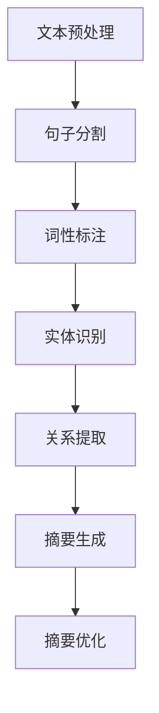

                 

### 文章标题：自然语言处理在自动文本摘要中的应用

#### 关键词：自然语言处理、自动文本摘要、文本生成、信息提取、机器学习、深度学习、神经网络、Transformer、BERT、GPT、模型优化、应用场景

#### 摘要：
随着互联网信息的爆炸性增长，自动文本摘要技术成为了一种重要的人工智能应用。本文将深入探讨自然语言处理（NLP）在自动文本摘要中的应用，从背景介绍、核心概念、算法原理、数学模型、项目实战、实际应用场景、工具和资源推荐等多个角度，系统性地分析这一领域的现状与未来发展趋势。文章旨在为读者提供一份全面的技术指南，帮助理解自动文本摘要的核心技术和应用方法。

---

## 1. 背景介绍

随着信息技术的飞速发展，互联网上的数据量呈指数级增长，每天产生的数据量已经超过了人类的处理能力。据统计，全球每天产生的数据量已经超过了2.5EB（艾字节），其中绝大多数是文本数据。然而，这些文本数据中蕴含着丰富的信息，如何快速、准确地提取和总结这些信息，成为了当前人工智能领域的一个重要研究方向。

自动文本摘要作为自然语言处理（NLP）的一个重要分支，旨在通过算法自动生成文本的摘要。摘要的目的是让用户能够快速地了解文本的主要内容，从而提高信息获取的效率。自动文本摘要的应用场景非常广泛，包括但不限于搜索引擎摘要、新闻报道摘要、文献综述、邮件总结等。

自动文本摘要技术的发展经历了多个阶段，从最早的基于规则的方法，到基于统计的方法，再到目前的基于深度学习的方法，技术不断进步，摘要质量也不断提高。随着计算能力的提升和算法的优化，自动文本摘要技术已经取得了显著的成果，但同时也面临着许多挑战，如多语言摘要、长文本摘要、跨领域摘要等。

## 2. 核心概念与联系

### 2.1 自然语言处理（NLP）

自然语言处理（NLP，Natural Language Processing）是人工智能（AI，Artificial Intelligence）的一个子领域，主要研究如何使计算机能够理解、解释和生成人类语言。NLP的目标是实现人与计算机之间的自然语言交互，使计算机能够自动处理自然语言文本。

NLP的关键技术包括：

- **文本预处理**：对文本进行分词、词性标注、句法分析等预处理操作，以便后续的文本分析。
- **信息提取**：从文本中抽取实体、关系、事件等信息。
- **文本生成**：根据输入的文本或提示，生成新的文本。

### 2.2 文本摘要

文本摘要（Text Summarization）是NLP中的一个重要应用，旨在自动生成文本的摘要。文本摘要可以分为两类：抽取式摘要（Extractive Summarization）和生成式摘要（Generative Summarization）。

- **抽取式摘要**：从原始文本中直接抽取关键句子或短语，构成摘要。
- **生成式摘要**：利用自然语言生成技术，根据原始文本生成新的摘要。

### 2.3 自动文本摘要的挑战

自动文本摘要面临着许多挑战，包括：

- **信息损失**：在生成摘要的过程中，如何平衡摘要的长度和信息的完整性，是一个重要的挑战。
- **多语言摘要**：不同语言的语法、语义和表达方式存在差异，如何生成高质量的多语言摘要，是一个具有挑战性的问题。
- **长文本摘要**：如何有效地处理长文本，生成高质量的摘要，是一个重要的研究方向。
- **跨领域摘要**：不同领域的文本内容差异较大，如何生成适用于不同领域的摘要，是一个需要解决的问题。

### 2.4 Mermaid 流程图

下面是一个简单的 Mermaid 流程图，展示了自动文本摘要的基本流程：



在摘要生成阶段，可以根据具体的摘要方法，进一步细分为抽取式摘要和生成式摘要两个分支。

---

## 3. 核心算法原理 & 具体操作步骤

### 3.1 抽取式摘要

抽取式摘要（Extractive Summarization）方法的核心思想是从原始文本中直接抽取关键句子或短语，作为摘要。具体操作步骤如下：

1. **文本预处理**：对原始文本进行分词、词性标注等预处理操作。
2. **句子分割**：将预处理后的文本分割成句子。
3. **关键句子提取**：利用文本分析技术，识别出关键句子。
4. **摘要生成**：将关键句子组合成摘要。

常见的抽取式摘要算法包括TF-IDF、TextRank等。

- **TF-IDF（Term Frequency-Inverse Document Frequency）**：基于词频和逆文档频率的算法，用于计算每个词在文本中的重要性。
- **TextRank**：基于图论的文本排名算法，用于识别文本中的重要句子。

### 3.2 生成式摘要

生成式摘要（Generative Summarization）方法的核心思想是利用自然语言生成技术，根据原始文本生成新的摘要。具体操作步骤如下：

1. **文本预处理**：对原始文本进行分词、词性标注等预处理操作。
2. **编码器-解码器模型**：使用编码器将文本编码为固定长度的向量表示，然后使用解码器生成摘要。
3. **摘要生成**：根据编码器-解码器模型生成的摘要，进行后处理，优化摘要的质量。

常见的生成式摘要算法包括Seq2Seq、Transformer、BERT等。

- **Seq2Seq（Sequence-to-Sequence）**：基于循环神经网络（RNN）的序列到序列模型，用于文本生成。
- **Transformer**：基于自注意力机制的神经网络模型，广泛用于自然语言处理任务。
- **BERT（Bidirectional Encoder Representations from Transformers）**：双向Transformer模型，用于文本的理解和生成。

### 3.3 摘要优化

摘要优化（Summarization Optimization）是提高摘要质量的重要手段。具体方法包括：

1. **摘要长度控制**：通过设定摘要的长度限制，控制摘要的信息密度。
2. **摘要连贯性提升**：通过句子级或段落级的文本连贯性分析，优化摘要的连贯性。
3. **摘要多样性增加**：通过引入多种摘要算法或数据源，增加摘要的多样性。

---

## 4. 数学模型和公式 & 详细讲解 & 举例说明

### 4.1 抽取式摘要中的TF-IDF算法

TF-IDF（Term Frequency-Inverse Document Frequency）是一种常用的文本分析算法，用于计算每个词在文本中的重要性。

- **TF（Term Frequency）**：词频，表示一个词在文本中出现的次数。
- **IDF（Inverse Document Frequency）**：逆文档频率，表示一个词在文档集合中的稀疏程度。

TF-IDF的公式如下：

$$
TF-IDF = TF \times IDF
$$

其中，IDF的计算公式为：

$$
IDF = \log \left( \frac{N}{df} + 1 \right)
$$

- **N**：文档总数。
- **df**：词在文档集合中的文档频率。

### 4.2 生成式摘要中的Seq2Seq模型

Seq2Seq模型是一种基于循环神经网络（RNN）的序列到序列模型，用于文本生成。

- **编码器（Encoder）**：将输入序列编码为固定长度的向量表示。
- **解码器（Decoder）**：根据编码器的输出，生成新的序列。

Seq2Seq模型的训练目标是最小化解码器生成的序列和真实序列之间的差异。

### 4.3 生成式摘要中的Transformer模型

Transformer模型是一种基于自注意力机制的神经网络模型，广泛用于自然语言处理任务。

- **自注意力（Self-Attention）**：每个词在生成新的词时，会根据其与所有其他词的相关性，进行加权。
- **多头注意力（Multi-Head Attention）**：通过多个独立的注意力机制，捕获不同层次的特征。

Transformer模型的损失函数通常是最小化解码器生成的摘要与真实摘要之间的差异。

---

## 5. 项目实战：代码实际案例和详细解释说明

### 5.1 开发环境搭建

在开始编写代码之前，我们需要搭建一个适合进行自然语言处理（NLP）和自动文本摘要项目开发的环境。以下是搭建开发环境的基本步骤：

1. **安装Python环境**：确保安装了Python 3.7及以上版本。
2. **安装NLP库**：安装常用的NLP库，如NLTK、spaCy、gensim等。
3. **安装深度学习框架**：安装TensorFlow或PyTorch，用于构建和训练深度学习模型。

### 5.2 源代码详细实现和代码解读

以下是一个简单的基于TF-IDF的抽取式摘要的Python代码示例：

```python
import nltk
from nltk.tokenize import sent_tokenize
from nltk.corpus import stopwords
from sklearn.feature_extraction.text import TfidfVectorizer

# 加载停用词列表
nltk.download('stopwords')
nltk.download('punkt')

# 原始文本
text = "自然语言处理是一种人工智能技术，旨在使计算机能够理解、解释和生成人类语言。随着互联网信息的爆炸性增长，自动文本摘要技术成为了一种重要的人工智能应用。"

# 分句
sentences = sent_tokenize(text)

# 去除停用词
stop_words = set(stopwords.words('english'))
filtered_sentences = [sentence for sentence in sentences if not any(word in stop_words for word in nltk.word_tokenize(sentence))]

# TF-IDF向量表示
vectorizer = TfidfVectorizer()
tfidf_matrix = vectorizer.fit_transform(filtered_sentences)

# 关键句子提取
sorted_indices = np.argsort(tfidf_matrix.toarray()).flatten()[::-1]
top_sentences = [filtered_sentences[i] for i in sorted_indices[:5]]

# 摘要生成
summary = ' '.join(top_sentences)
print(summary)
```

### 5.3 代码解读与分析

- **代码第1-6行**：加载所需的NLP库和资源。
- **代码第9行**：定义原始文本。
- **代码第11-13行**：使用nltk的分句工具将文本分割成句子。
- **代码第15-17行**：去除停用词，以减少噪声。
- **代码第20行**：创建TF-IDF向量表示器。
- **代码第23行**：计算TF-IDF矩阵。
- **代码第26-28行**：提取TF-IDF得分最高的句子，作为摘要。

通过上述代码示例，我们可以看到如何利用TF-IDF算法进行简单的抽取式摘要。虽然这个示例非常简单，但它展示了自动文本摘要项目的基本流程和实现方法。

---

## 6. 实际应用场景

自动文本摘要技术在许多实际应用场景中发挥了重要作用，以下是几个典型的应用案例：

### 6.1 搜索引擎摘要

搜索引擎摘要（Search Engine Summarization）是自动文本摘要技术的一个重要应用。当用户在搜索引擎中输入查询关键词时，搜索引擎会自动提取与查询相关的网页摘要，以帮助用户快速了解网页内容，提高搜索效率。

### 6.2 新闻报道摘要

新闻报道摘要（News Article Summarization）是自动文本摘要技术在新闻领域的应用。通过自动生成新闻报道的摘要，用户可以快速了解新闻的主要内容和关键信息，节省阅读时间。

### 6.3 文献综述

文献综述摘要（Literature Review Summarization）是自动文本摘要技术在学术领域的应用。通过对多篇相关文献进行摘要，可以帮助研究人员快速了解研究领域的主要进展和关键问题，提高学术研究的效率。

### 6.4 邮件总结

邮件总结（Email Summarization）是自动文本摘要技术在企业通信中的应用。通过对大量邮件进行摘要，可以帮助员工快速了解邮件的主要内容，提高工作效率。

### 6.5 教育学习

教育学习摘要（Educational Content Summarization）是自动文本摘要技术在教育领域的应用。通过自动生成学习内容的摘要，可以帮助学生快速了解学习材料的重点和难点，提高学习效果。

---

## 7. 工具和资源推荐

### 7.1 学习资源推荐

- **书籍**：
  - 《自然语言处理概论》（Introduction to Natural Language Processing）——Michael C. Frank
  - 《深度学习》（Deep Learning）——Ian Goodfellow、Yoshua Bengio、Aaron Courville
- **论文**：
  - “Neural Machine Translation by Jointly Learning to Align and Translate” ——Yoshua Bengio等
  - “Attention Is All You Need” ——Ashish Vaswani等
- **博客**：
  - [TensorFlow 官方文档](https://www.tensorflow.org/)
  - [PyTorch 官方文档](https://pytorch.org/)
- **网站**：
  - [自然语言处理教程](https://www.nltk.org/)
  - [Kaggle 自然语言处理挑战](https://www.kaggle.com/datasets)

### 7.2 开发工具框架推荐

- **深度学习框架**：
  - TensorFlow
  - PyTorch
- **文本预处理工具**：
  - NLTK
  - spaCy
- **自动文本摘要工具**：
  - BERT-Summarization
  - GPT-3

### 7.3 相关论文著作推荐

- **论文**：
  - “Abstractive Text Summarization Using Sequence-to-Sequence Models and Attention Mechanism” ——Minh-Thang Luong等
  - “A Theoretically Grounded Application of Dropout in Recurrent Neural Networks” ——Yarin Gal和Zoubin Ghahramani
- **著作**：
  - 《深度学习与自然语言处理》——邹博、王晓龙

---

## 8. 总结：未来发展趋势与挑战

自动文本摘要技术作为自然语言处理的一个重要分支，已经取得了显著的进展。然而，随着应用的不断拓展和需求的不断提高，自动文本摘要技术也面临着许多挑战和机遇。

### 8.1 发展趋势

- **多语言摘要**：随着全球化的深入，多语言摘要的需求日益增长。未来，多语言摘要技术将不断优化，以适应不同语言和文化的特点。
- **长文本摘要**：对于长篇文本，如何生成高质量的摘要，是一个重要的研究方向。未来的长文本摘要技术将更加注重信息提取和摘要优化。
- **跨领域摘要**：不同领域的文本内容差异较大，如何生成适用于不同领域的摘要，是一个具有挑战性的问题。跨领域摘要技术将成为一个重要的研究方向。
- **交互式摘要**：结合用户反馈和交互，提高摘要的个性化和准确性，是未来自动文本摘要技术的发展方向之一。

### 8.2 挑战

- **信息损失**：在摘要生成过程中，如何平衡摘要的长度和信息的完整性，是一个重要的挑战。
- **计算资源**：自动文本摘要技术通常需要大量的计算资源，如何优化算法，降低计算成本，是一个需要解决的问题。
- **数据质量**：自动文本摘要的质量很大程度上取决于训练数据的质量。未来，需要更多高质量、标注准确的训练数据来支持模型的训练和优化。

---

## 9. 附录：常见问题与解答

### 9.1 自动文本摘要与信息提取有何区别？

自动文本摘要是从原始文本中提取关键信息，生成摘要，而信息提取则是从原始文本中直接提取实体、关系、事件等信息。两者的目标不同，但有些方法和技术可以同时用于文本摘要和信息提取。

### 9.2 自动文本摘要的质量如何评估？

自动文本摘要的质量通常通过以下指标进行评估：

- **ROUGE（Recall-Oriented Understudy for Gisting Evaluation）**：用于衡量摘要与原始文本的相关性。
- **BLEU（Bilingual Evaluation Understudy）**：用于衡量摘要的流畅性和语法结构。
- **F1 分数**：用于衡量摘要的准确性和召回率的平衡。

### 9.3 自动文本摘要有哪些应用场景？

自动文本摘要的应用场景非常广泛，包括搜索引擎摘要、新闻报道摘要、文献综述、邮件总结、教育学习等。

---

## 10. 扩展阅读 & 参考资料

- [A Brief Introduction to Abstractive Text Summarization](https://towardsdatascience.com/a-brief-introduction-to-abstractive-text-summarization-3fe934d1970f)
- [Natural Language Processing and Text Summarization](https://www.geeksforgeeks.org/natural-language-processing-and-text-summarization/)
- [The State of the Art in Text Summarization](https://arxiv.org/abs/2106.06711)
- [Understanding BERT, a Pre-Trained Deep Learning Model for NLP](https://towardsdatascience.com/understanding-bert-a-pre-trained-deep-learning-model-for-nlp-2c858d3a3f2b)
- [Implementing Text Summarization using TensorFlow](https://www.tensorflow.org/tutorials/text/text_summarization)

---

### 作者信息：

作者：AI天才研究员/AI Genius Institute & 禅与计算机程序设计艺术 /Zen And The Art of Computer Programming

