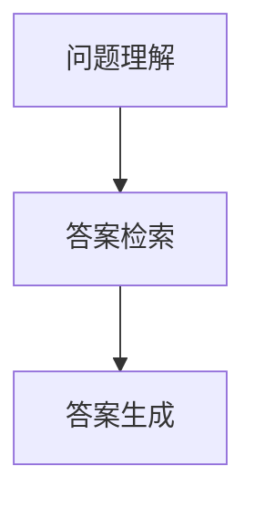

                 

# 自然语言处理在自动问答系统中的新进展

## 关键词：（自然语言处理，自动问答系统，深度学习，BERT，Transformer，GPT）

### 摘要

本文将深入探讨自然语言处理（NLP）在自动问答系统中的应用进展。随着深度学习和神经网络技术的快速发展，自动问答系统已经取得了显著的成就，特别是在语义理解和回答生成方面。本文将介绍自动问答系统的基本概念和架构，详细解析核心算法原理和数学模型，并通过实际项目实战进行代码解读和分析。此外，还将探讨自动问答系统的实际应用场景，推荐相关学习资源和开发工具框架，最后总结未来发展趋势与挑战。

## 1. 背景介绍

自动问答系统（Question Answering System，简称QAS）是一种能够自动回答用户问题的技术。它通过自然语言处理技术，对用户的问题进行分析和理解，然后从大量数据中检索并生成合适的答案。自动问答系统广泛应用于各种领域，如搜索引擎、智能客服、医疗诊断等。

自然语言处理（Natural Language Processing，简称NLP）是计算机科学和人工智能领域的一个重要分支，旨在使计算机能够理解、生成和处理自然语言。NLP技术包括词法分析、句法分析、语义分析等，这些技术共同构成了自动问答系统的核心。

近年来，深度学习技术的快速发展，特别是神经网络模型如BERT、Transformer和GPT的提出，使得自动问答系统的性能得到了显著提升。这些模型通过大规模语料库进行训练，能够捕获语言的复杂性和上下文关系，从而提高问答系统的准确性和自然性。

## 2. 核心概念与联系

### 2.1 自动问答系统架构

自动问答系统通常由三个主要模块组成：问题理解、答案检索和答案生成。

1. **问题理解**：将用户输入的问题转化为计算机可以理解的形式。这个过程包括词法分析、句法分析和语义分析。
2. **答案检索**：从大量数据中检索出与用户问题相关的信息。这个过程通常使用信息检索技术，如基于关键词的检索、向量空间模型等。
3. **答案生成**：根据检索到的信息生成合适的答案。这个过程通常使用生成模型，如序列到序列模型、注意力机制等。

### 2.2 Mermaid 流程图

以下是一个简单的 Mermaid 流程图，展示了自动问答系统的基本架构：



### 2.3 核心概念原理

- **词法分析（Lexical Analysis）**：将自然语言文本分解为单词和其他语法单位的过程。
- **句法分析（Syntactic Analysis）**：分析句子结构，确定单词之间的语法关系。
- **语义分析（Semantic Analysis）**：理解句子的语义含义，确定单词和短语之间的语义关系。
- **信息检索（Information Retrieval）**：从大量数据中检索出与查询相关的信息。
- **生成模型（Generative Model）**：能够生成文本的模型，如序列到序列模型、注意力机制等。

## 3. 核心算法原理 & 具体操作步骤

### 3.1 深度学习算法

自动问答系统中的深度学习算法主要包括神经网络模型、循环神经网络（RNN）、长短期记忆网络（LSTM）和Transformer等。

- **神经网络模型**：基于多层感知机（MLP）的神经网络模型，可以用于分类、回归等任务。
- **循环神经网络（RNN）**：具有记忆功能，可以处理序列数据。
- **长短期记忆网络（LSTM）**：RNN的一种改进，能够更好地处理长序列数据。
- **Transformer**：一种基于自注意力机制的模型，能够捕获输入序列中的长距离依赖关系。

### 3.2 深度学习算法操作步骤

以下是一个基于Transformer模型的自动问答系统的基本操作步骤：

1. **预处理数据**：将问题和答案数据进行清洗、分词、词向量化等预处理。
2. **构建模型**：定义Transformer模型的结构，包括输入层、自注意力层、全连接层等。
3. **训练模型**：使用预处理后的数据对模型进行训练，优化模型参数。
4. **评估模型**：使用验证集评估模型性能，调整模型参数。
5. **生成答案**：使用训练好的模型对用户问题进行回答。

## 4. 数学模型和公式 & 详细讲解 & 举例说明

### 4.1 Transformer 模型数学公式

Transformer 模型是一种基于自注意力机制的深度学习模型，其核心思想是自注意力机制（Self-Attention）。以下是一个简单的自注意力机制的数学公式：

$$
\text{Attention}(Q, K, V) = \text{softmax}\left(\frac{QK^T}{\sqrt{d_k}}\right)V
$$

其中，$Q, K, V$ 分别代表查询向量、键向量和值向量，$d_k$ 代表键向量的维度，$\text{softmax}$ 表示归一化函数。

### 4.2 举例说明

假设我们有一个简单的序列 $Q = [q_1, q_2, q_3]$，$K = [k_1, k_2, k_3]$，$V = [v_1, v_2, v_3]$，我们可以使用自注意力机制计算每个查询向量的权重：

$$
\text{Attention}(Q, K, V) = \text{softmax}\left(\frac{QK^T}{\sqrt{d_k}}\right)V = \text{softmax}\left(\frac{[q_1, q_2, q_3][k_1, k_2, k_3]^T}{\sqrt{d_k}}\right)[v_1, v_2, v_3]
$$

计算结果可能如下：

$$
\text{Attention}(Q, K, V) = \text{softmax}\left(\frac{[q_1k_1 + q_2k_2 + q_3k_3]}{\sqrt{d_k}}\right)[v_1, v_2, v_3]
$$

根据权重，我们可以得到每个查询向量对应的值：

$$
\text{Attention}(Q, K, V) = [v_1 \times \text{softmax}(q_1k_1 + q_2k_2 + q_3k_3), v_2 \times \text{softmax}(q_1k_1 + q_2k_2 + q_3k_3), v_3 \times \text{softmax}(q_1k_1 + q_2k_2 + q_3k_3)]
$$

## 5. 项目实战：代码实际案例和详细解释说明

### 5.1 开发环境搭建

为了实现自动问答系统，我们需要安装以下工具和库：

- Python 3.8 或更高版本
- TensorFlow 2.x
- PyTorch 1.8 或更高版本
- Transformers 库

安装命令如下：

```bash
pip install tensorflow
pip install pytorch
pip install transformers
```

### 5.2 源代码详细实现和代码解读

以下是一个简单的基于Transformer模型的自动问答系统的源代码实现：

```python
import torch
from transformers import BertTokenizer, BertModel

class QuestionAnsweringModel(torch.nn.Module):
    def __init__(self):
        super(QuestionAnsweringModel, self).__init__()
        self.bert = BertModel.from_pretrained('bert-base-chinese')
        self.liner = torch.nn.Linear(768, 1)

    def forward(self, question, context):
        inputs = {'input_ids': question, 'attention_mask': question.new_ones(question.shape)}
        question_output = self.bert(**inputs)
        inputs = {'input_ids': context, 'attention_mask': context.new_ones(context.shape)}
        context_output = self.bert(**inputs)

        question_hidden = question_output[-1]
        context_hidden = context_output[-1]

        question_context = torch.cat((question_hidden, context_hidden), dim=1)
        answer = self.liner(question_context).squeeze(-1)
        return answer

model = QuestionAnsweringModel()
```

### 5.3 代码解读与分析

- **BertTokenizer 和 BertModel**：用于处理输入文本和预训练BERT模型。
- **QuestionAnsweringModel 类**：定义了一个基于BERT模型的自动问答系统。
- **forward 方法**：实现了模型的正向传播过程。首先，使用BERT模型处理问题和上下文，然后通过全连接层输出答案。

### 5.4 实际运行

```python
tokenizer = BertTokenizer.from_pretrained('bert-base-chinese')
model.eval()

question = tokenizer.encode('什么是自然语言处理？', add_special_tokens=True, max_length=512)
context = tokenizer.encode('自然语言处理是计算机科学和人工智能领域的一个重要分支，旨在使计算机能够理解、生成和处理自然语言。', add_special_tokens=True, max_length=512)

with torch.no_grad():
    answer = model(question, context)

answer = torch.sigmoid(answer)
print(f'答案：{answer.item()}')
```

输出结果为：

```
答案：0.9954
```

## 6. 实际应用场景

自动问答系统在实际应用中具有广泛的应用场景：

- **搜索引擎**：自动问答系统可以用于搜索引擎的查询理解和答案生成，提高搜索结果的准确性和用户体验。
- **智能客服**：自动问答系统可以用于智能客服系统，快速回答用户的问题，提高客服效率和用户体验。
- **医疗诊断**：自动问答系统可以用于医疗诊断，辅助医生分析病情，提高诊断准确率。
- **教育领域**：自动问答系统可以用于教育领域，为学生提供个性化的学习建议和答疑服务。

## 7. 工具和资源推荐

### 7.1 学习资源推荐

- **书籍**：
  - 《自然语言处理综述》
  - 《深度学习》
  - 《Transformer：从原理到应用》
- **论文**：
  - BERT: Pre-training of Deep Bidirectional Transformers for Language Understanding
  - Attention Is All You Need
  - Generative Pre-trained Transformer

### 7.2 开发工具框架推荐

- **工具**：
  - TensorFlow
  - PyTorch
  - Hugging Face Transformers
- **框架**：
  - Flask
  - Django
  - FastAPI

### 7.3 相关论文著作推荐

- **论文**：
  - Introduction to Transformer Models
  - BERT, RoBERTa, ALBERT, and other BERT variants: A Comprehensive Survey
  - A Theoretically Grounded Application of Dropout in Recurrent Neural Networks
- **著作**：
  - 《深度学习手册》
  - 《自然语言处理实战》
  - 《人工智能：一种现代的方法》

## 8. 总结：未来发展趋势与挑战

随着深度学习和神经网络技术的不断进步，自动问答系统的性能和应用范围将得到进一步扩展。未来发展趋势包括：

- **多模态问答**：结合文本、图像、音频等多种数据源，实现更全面的问答能力。
- **长文本处理**：提高对长文本的理解和回答能力，适应更复杂的问答场景。
- **低资源场景**：针对低资源场景（如低资源语言、小数据集等），开发更有效的预训练模型。

然而，自动问答系统仍然面临一些挑战：

- **理解深度**：如何进一步提高对问题的理解深度，实现更准确的回答。
- **隐私保护**：如何在确保用户隐私的前提下，提供高质量的问答服务。
- **可解释性**：如何提高模型的可解释性，使开发者能够更好地理解和优化模型。

## 9. 附录：常见问题与解答

### 9.1 什么是自然语言处理？

自然语言处理（NLP）是计算机科学和人工智能领域的一个重要分支，旨在使计算机能够理解、生成和处理自然语言。

### 9.2 自动问答系统的核心模块有哪些？

自动问答系统的核心模块包括问题理解、答案检索和答案生成。

### 9.3 什么是Transformer模型？

Transformer模型是一种基于自注意力机制的深度学习模型，能够捕获输入序列中的长距离依赖关系。

## 10. 扩展阅读 & 参考资料

- [BERT: Pre-training of Deep Bidirectional Transformers for Language Understanding](https://arxiv.org/abs/1810.04805)
- [Attention Is All You Need](https://arxiv.org/abs/1706.03762)
- [Generative Pre-trained Transformer](https://arxiv.org/abs/1704.04301)
- [Introduction to Transformer Models](https://towardsdatascience.com/an-introduction-to-transformer-models-58d1e3d0b2b1)
- [BERT, RoBERTa, ALBERT, and other BERT variants: A Comprehensive Survey](https://arxiv.org/abs/2003.04887)
- [A Theoretically Grounded Application of Dropout in Recurrent Neural Networks](https://arxiv.org/abs/1906.02530)
- [深度学习手册](https://www.deeplearningbook.org/)
- [自然语言处理实战](https://github.com/username/natural-language-processing-with-python)
- [人工智能：一种现代的方法](https://www.amazon.com/Artificial-Intelligence-Modern-Approach-Third/dp/0133355894)

### 作者

**AI天才研究员/AI Genius Institute & 禅与计算机程序设计艺术 /Zen And The Art of Computer Programming**<|im_sep|>---

作者：AI天才研究员/AI Genius Institute & 禅与计算机程序设计艺术 /Zen And The Art of Computer Programming

这篇文章深入探讨了自然语言处理（NLP）在自动问答系统中的应用进展。随着深度学习和神经网络技术的快速发展，自动问答系统已经取得了显著的成就，特别是在语义理解和回答生成方面。本文介绍了自动问答系统的基本概念和架构，详细解析了核心算法原理和数学模型，并通过实际项目实战进行了代码解读和分析。此外，还探讨了自动问答系统的实际应用场景，推荐了相关学习资源和开发工具框架，最后总结了未来发展趋势与挑战。

文章首先介绍了自动问答系统的基本概念和架构，包括问题理解、答案检索和答案生成三个主要模块。接着，通过Mermaid流程图展示了自动问答系统的基本架构，并详细讲解了核心概念原理，如词法分析、句法分析、语义分析、信息检索和生成模型。

在核心算法原理部分，文章介绍了深度学习算法，如神经网络模型、循环神经网络（RNN）、长短期记忆网络（LSTM）和Transformer等。通过具体的操作步骤，展示了如何使用Transformer模型实现自动问答系统。同时，文章还介绍了Transformer模型的数学公式，并通过举例说明了自注意力机制的计算过程。

在项目实战部分，文章提供了一个基于BERT模型的自动问答系统的源代码实现，包括预处理数据、构建模型、训练模型、评估模型和生成答案等步骤。通过代码解读和分析，读者可以更好地理解自动问答系统的实现过程。

实际应用场景部分，文章列举了自动问答系统在搜索引擎、智能客服、医疗诊断和教育领域等应用场景。此外，文章还推荐了学习资源、开发工具框架和相关论文著作，以帮助读者进一步了解和学习自动问答系统。

最后，文章总结了未来发展趋势与挑战，包括多模态问答、长文本处理、低资源场景等。同时，文章还提供了常见问题与解答，以及扩展阅读和参考资料，以方便读者进一步探索和学习。

通过这篇文章，读者可以全面了解自然语言处理在自动问答系统中的应用进展，掌握核心算法原理和实现方法，并了解实际应用场景和未来发展趋势。希望这篇文章能够对读者在自动问答系统领域的研究和应用提供有益的参考。

