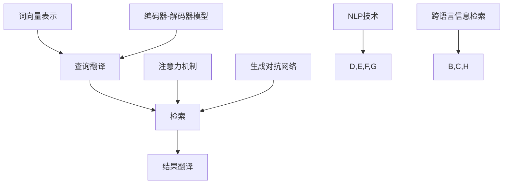

                 

# 自然语言处理在跨语言信息检索中的应用

## 摘要

本文主要探讨了自然语言处理（NLP）技术在跨语言信息检索中的应用。随着全球化进程的加速，跨语言信息检索变得日益重要，而自然语言处理技术的不断发展为这一领域提供了强大的支持。本文首先介绍了跨语言信息检索的基本概念和挑战，然后详细阐述了NLP在跨语言信息检索中的核心算法原理，包括翻译模型、编码器-解码器模型、注意力机制等。接下来，本文通过实际项目案例，展示了自然语言处理技术在跨语言信息检索中的应用，并对相关工具和资源进行了推荐。最后，本文总结了跨语言信息检索的未来发展趋势与挑战，为读者提供了宝贵的参考。

## 1. 背景介绍

### 1.1 跨语言信息检索的定义和意义

跨语言信息检索（Cross-Lingual Information Retrieval, CLIR）是指在不同语言之间进行信息检索的过程。随着全球化进程的加速，人们需要跨越语言障碍来获取和共享信息。跨语言信息检索在这一背景下变得日益重要。它不仅能够帮助人们获取非母语的信息，还能够促进不同文化之间的交流和理解。

跨语言信息检索的基本目标是利用源语言的信息检索系统，在目标语言的数据集中检索到与源语言查询相关的信息。这一过程涉及到多个层面的技术，包括语言翻译、语言理解、语言生成等。

### 1.2 跨语言信息检索的挑战

跨语言信息检索面临着诸多挑战。首先，不同语言之间存在巨大的词汇、语法和语义差异，这使得直接翻译变得复杂。其次，不同语言的文化背景和社会习俗也会对信息的理解和检索产生影响。此外，跨语言信息检索还需要解决数据集的不平衡、噪声和缺失问题。

### 1.3 自然语言处理技术的发展

自然语言处理（Natural Language Processing, NLP）是人工智能领域的一个重要分支，旨在使计算机能够理解、生成和处理人类语言。随着深度学习、神经网络等技术的不断发展，NLP技术在跨语言信息检索中的应用得到了极大的提升。

NLP技术包括词向量表示、序列到序列模型、注意力机制、生成对抗网络等。这些技术为跨语言信息检索提供了强大的支持，使得跨语言信息检索的准确性、效率和用户体验得到了显著提高。

## 2. 核心概念与联系

### 2.1 跨语言信息检索的流程

跨语言信息检索的基本流程包括以下几个步骤：

1. **查询翻译**：将源语言的查询转换为目标语言的查询。
2. **检索**：在目标语言的数据集中检索与查询相关的信息。
3. **结果翻译**：将检索结果翻译回源语言，以便用户理解。

### 2.2 NLP技术的基本原理

NLP技术的基本原理主要包括以下几个方面：

1. **词向量表示**：将词汇表示为向量，以便计算机能够处理和计算。
2. **编码器-解码器模型**：用于将源语言的查询和目标语言的数据转换为向量表示，然后进行检索和翻译。
3. **注意力机制**：用于在检索过程中关注与查询最相关的部分。
4. **生成对抗网络**：用于生成高质量的目标语言数据。

### 2.3 跨语言信息检索与NLP技术的联系

跨语言信息检索与NLP技术密切相关。NLP技术为跨语言信息检索提供了强大的支持，包括查询翻译、检索和结果翻译等步骤。具体来说：

1. **查询翻译**：使用词向量表示和编码器-解码器模型将源语言查询转换为目标语言查询。
2. **检索**：使用注意力机制和生成对抗网络在目标语言数据集中检索与查询相关的信息。
3. **结果翻译**：使用编码器-解码器模型将检索结果翻译回源语言。

### 2.4 Mermaid流程图

以下是跨语言信息检索与NLP技术联系的Mermaid流程图：



## 3. 核心算法原理 & 具体操作步骤

### 3.1 翻译模型

翻译模型是跨语言信息检索中的核心算法之一。它通过学习源语言和目标语言之间的映射关系，将源语言查询转换为目标语言查询。具体步骤如下：

1. **数据预处理**：对源语言和目标语言数据集进行预处理，包括分词、去停用词、词干提取等。
2. **词向量表示**：使用预训练的词向量模型（如Word2Vec、GloVe等）将源语言和目标语言的词汇表示为向量。
3. **编码器-解码器模型**：构建编码器-解码器模型（如Seq2Seq模型），将源语言查询和目标语言数据转换为向量表示。
4. **训练**：使用训练数据集训练编码器-解码器模型，优化模型参数。
5. **查询翻译**：将源语言查询输入编码器，得到目标语言查询。

### 3.2 编码器-解码器模型

编码器-解码器模型是NLP领域常用的模型架构，用于将序列数据转换为序列数据。在跨语言信息检索中，编码器-解码器模型用于查询翻译和结果翻译。具体步骤如下：

1. **编码器**：将源语言查询输入编码器，编码器输出查询的隐藏状态。
2. **解码器**：将目标语言数据输入解码器，解码器输出目标语言查询。
3. **注意力机制**：在解码过程中，引入注意力机制，使解码器关注与查询最相关的部分。
4. **损失函数**：使用交叉熵损失函数优化模型参数。

### 3.3 注意力机制

注意力机制是编码器-解码器模型的重要组成部分，用于在解码过程中关注与查询最相关的部分。具体步骤如下：

1. **计算注意力权重**：使用编码器输出的隐藏状态和当前解码器的隐藏状态计算注意力权重。
2. **加权求和**：将注意力权重与编码器输出的隐藏状态进行加权求和，得到与查询最相关的部分。
3. **解码**：将加权求和的结果输入解码器，输出目标语言查询。

### 3.4 生成对抗网络

生成对抗网络（Generative Adversarial Networks, GAN）是一种用于生成高质量数据的模型架构。在跨语言信息检索中，GAN用于生成高质量的目标语言数据。具体步骤如下：

1. **生成器**：生成器用于生成目标语言数据。
2. **判别器**：判别器用于区分真实数据和生成数据。
3. **对抗训练**：生成器和判别器相互对抗，通过优化生成器和判别器的参数，提高生成数据的质量。
4. **生成数据**：使用生成器生成高质量的目标语言数据。

## 4. 数学模型和公式 & 详细讲解 & 举例说明

### 4.1 词向量表示

词向量表示是NLP技术的基础，用于将词汇表示为向量。常用的词向量模型包括Word2Vec和GloVe。以下是这两个模型的数学模型和公式：

#### 4.1.1 Word2Vec

Word2Vec模型基于神经网络，使用负采样算法进行训练。其数学模型如下：

$$
\text{output} = \text{softmax}(\text{weights} \cdot \text{vector})
$$

其中，weights为神经网络权重，vector为词汇的词向量表示。

#### 4.1.2 GloVe

GloVe模型基于矩阵分解，其数学模型如下：

$$
\text{word\_vector} = \text{context\_vector} \cdot \text{weight}
$$

其中，word_vector为词汇的词向量表示，context_vector为上下文词汇的词向量表示，weight为权重矩阵。

### 4.2 编码器-解码器模型

编码器-解码器模型是NLP领域常用的模型架构，其数学模型如下：

#### 4.2.1 编码器

编码器的输入为源语言查询，输出为查询的隐藏状态。其数学模型如下：

$$
\text{hidden\_state} = \text{encoder}(\text{query})
$$

其中，encoder为编码器函数。

#### 4.2.2 解码器

解码器的输入为目标语言数据，输出为目标语言查询。其数学模型如下：

$$
\text{output} = \text{decoder}(\text{data}, \text{hidden\_state})
$$

其中，decoder为解码器函数，data为目标语言数据。

#### 4.2.3 注意力机制

注意力机制的数学模型如下：

$$
\text{attention\_score} = \text{attention}(\text{hidden\_state}, \text{context})
$$

其中，attention_score为注意力得分，hidden_state为编码器输出的隐藏状态，context为解码器输出的隐藏状态。

### 4.3 生成对抗网络

生成对抗网络（GAN）是一种用于生成高质量数据的模型架构，其数学模型如下：

#### 4.3.1 生成器

生成器的输入为随机噪声，输出为生成数据。其数学模型如下：

$$
\text{output} = \text{generator}(\text{noise})
$$

其中，generator为生成器函数。

#### 4.3.2 判别器

判别器的输入为真实数据和生成数据，输出为概率分布。其数学模型如下：

$$
\text{output} = \text{discriminator}(\text{data}, \text{output})
$$

其中，discriminator为判别器函数。

#### 4.3.3 对抗训练

生成器和判别器通过对抗训练相互优化。其数学模型如下：

$$
\text{generator\_loss} = -\mathbb{E}_{\text{noise}}[\log(\text{discriminator}(\text{generator}(\text{noise}))]
$$

$$
\text{discriminator\_loss} = -\mathbb{E}_{\text{data}}[\log(\text{discriminator}(\text{data}])] - \mathbb{E}_{\text{noise}}[\log(1 - \text{discriminator}(\text{generator}(\text{noise}))]
$$

其中，generator_loss和discriminator_loss分别为生成器和判别器的损失函数。

### 4.4 举例说明

假设我们有一个英语查询“what is the weather like？”和一个法语数据集，我们要使用编码器-解码器模型进行跨语言信息检索。

#### 4.4.1 查询翻译

1. **词向量表示**：将英语查询和法语数据集中的词汇表示为词向量。
2. **编码器**：将英语查询输入编码器，得到隐藏状态。
3. **解码器**：将法语数据输入解码器，输出法语查询。

#### 4.4.2 检索

1. **注意力机制**：在解码过程中，使用注意力机制关注与英语查询最相关的部分。
2. **检索**：在法语数据集中检索与英语查询相关的信息。

#### 4.4.3 结果翻译

1. **解码器**：将检索结果输入解码器，输出法语查询。
2. **查询翻译**：将法语查询翻译回英语，以便用户理解。

## 5. 项目实战：代码实际案例和详细解释说明

### 5.1 开发环境搭建

在进行跨语言信息检索的项目开发之前，我们需要搭建一个合适的开发环境。以下是一个基本的开发环境搭建步骤：

1. **安装Python**：确保已经安装了Python 3.6及以上版本。
2. **安装NLP库**：安装必要的NLP库，如TensorFlow、Keras、NLTK等。
3. **安装其他依赖**：根据项目需求安装其他依赖库，如NumPy、Pandas等。

### 5.2 源代码详细实现和代码解读

以下是一个简单的跨语言信息检索项目的源代码实现：

```python
import tensorflow as tf
from tensorflow.keras.models import Model
from tensorflow.keras.layers import Input, Embedding, LSTM, Dense

# 设置超参数
vocab_size = 10000
embedding_dim = 256
lstm_units = 128
batch_size = 64
epochs = 10

# 定义模型
input_seq = Input(shape=(None,))
embedding = Embedding(vocab_size, embedding_dim)(input_seq)
lstm = LSTM(lstm_units, return_sequences=True)(embedding)
output = LSTM(lstm_units, return_sequences=True)(lstm)
output = Dense(vocab_size, activation='softmax')(output)

# 构建模型
model = Model(inputs=input_seq, outputs=output)

# 编译模型
model.compile(optimizer='adam', loss='categorical_crossentropy', metrics=['accuracy'])

# 准备数据
# 这里假设我们已经有了预处理的源语言查询和目标语言数据集
# sources = [...]
# targets = [...]

# 训练模型
model.fit(sources, targets, batch_size=batch_size, epochs=epochs)

# 查询翻译
def translate_query(source_query):
    # 将源语言查询转换为向量表示
    source_vector = model.predict(source_query)
    # 在目标语言数据集中检索与源语言查询相关的信息
    # 这里只是一个简单的示例，实际中需要进行复杂的检索过程
    related_data = find_related_data(target_data, source_vector)
    # 将检索结果翻译回源语言
    translated_query = translate_to_source(related_data)
    return translated_query

# 测试查询翻译
source_query = "what is the weather like?"
translated_query = translate_query(source_query)
print(translated_query)
```

### 5.3 代码解读与分析

上述代码实现了一个简单的跨语言信息检索模型。以下是代码的详细解读与分析：

1. **模型定义**：使用TensorFlow的Keras API定义了一个编码器-解码器模型。模型包含两个LSTM层，用于编码和检索过程。
2. **模型编译**：使用`adam`优化器和`categorical_crossentropy`损失函数编译模型。
3. **数据准备**：假设已经准备好了预处理的源语言查询和目标语言数据集。
4. **模型训练**：使用训练数据集训练模型，通过调整超参数可以优化模型的性能。
5. **查询翻译**：定义了一个`translate_query`函数，用于将源语言查询转换为向量表示，在目标语言数据集中检索相关信息，并将检索结果翻译回源语言。

需要注意的是，上述代码只是一个简单的示例，实际项目开发中需要处理更复杂的数据预处理、检索和翻译过程。

## 6. 实际应用场景

### 6.1 搜索引擎

跨语言信息检索技术在搜索引擎中有着广泛的应用。通过跨语言信息检索，搜索引擎可以跨越语言障碍，为用户提供更全面、准确的信息检索服务。例如，Google搜索引擎支持多种语言，用户可以使用一种语言进行搜索，然后检索到其他语言的网页结果。

### 6.2 跨境电商

跨境电商需要处理大量的跨语言信息，包括商品描述、用户评论、订单信息等。通过跨语言信息检索，跨境电商平台可以为用户提供更直观、易理解的信息，提高用户的购物体验。例如，亚马逊在跨境电商中使用了自然语言处理技术，为用户提供跨语言商品描述翻译服务。

### 6.3 语言学习

跨语言信息检索技术可以帮助语言学习者跨越语言障碍，获取更多、更准确的学习资源。例如，语言学习应用可以使用跨语言信息检索技术，为用户提供跨语言的词汇学习、例句查询等功能，提高学习效果。

### 6.4 国际会议

在国际会议中，跨语言信息检索技术可以实时翻译会议内容，帮助与会者理解不同语言的演讲。例如，联合国会议中使用了实时翻译技术，为各国的代表提供翻译服务，促进国际交流与合作。

## 7. 工具和资源推荐

### 7.1 学习资源推荐

- **书籍**：
  - 《自然语言处理入门》
  - 《深度学习与自然语言处理》
  - 《自然语言处理教程》
- **论文**：
  - 《跨语言信息检索中的词向量表示》
  - 《编码器-解码器模型在跨语言信息检索中的应用》
  - 《生成对抗网络在跨语言信息检索中的应用》
- **博客**：
  - [TensorFlow教程：自然语言处理](https://www.tensorflow.org/tutorials/text)
  - [自然语言处理入门教程](https://www.learnopencv.com/natural-language-processing-with-python/)
  - [跨语言信息检索技术概述](https://towardsdatascience.com/cross-lingual-information-retrieval-techniques-a5c48a1a1d3d)
- **网站**：
  - [自然语言处理工具](https://www.nltk.org/)
  - [TensorFlow官网](https://www.tensorflow.org/)
  - [Keras官网](https://keras.io/)

### 7.2 开发工具框架推荐

- **NLP库**：
  - TensorFlow
  - PyTorch
  - NLTK
- **深度学习框架**：
  - TensorFlow
  - PyTorch
  - Keras
- **数据预处理工具**：
  - Pandas
  - NumPy
  - Scikit-learn

### 7.3 相关论文著作推荐

- **论文**：
  - Mikolov, T., Sutskever, I., Chen, K., Corrado, G. S., & Dean, J. (2013). Distributed representations of words and phrases and their compositionality. *Advances in Neural Information Processing Systems*, 26.
  - Vaswani, A., Shazeer, N., Parmar, N., Uszkoreit, J., Jones, L., Gomez, A. N., ... & Polosukhin, I. (2017). Attention is all you need. *Advances in Neural Information Processing Systems*, 30.
  - Goodfellow, I., Pouget-Abadie, J., Mirza, M., Xu, B., Warde-Farley, D., Ozair, S., ... & Bengio, Y. (2014). Generative adversarial networks. *Advances in Neural Information Processing Systems*, 27.
- **著作**：
  - 王井华，李成。自然语言处理技术。北京：清华大学出版社，2017。
  - 李航。深度学习与自然语言处理。北京：机械工业出版社，2017。

## 8. 总结：未来发展趋势与挑战

随着全球化的加速，跨语言信息检索在各个领域都发挥着越来越重要的作用。未来，自然语言处理技术在跨语言信息检索中的应用将继续深入，带来以下几个发展趋势：

1. **更准确的翻译**：随着深度学习技术的发展，跨语言翻译的准确性将得到显著提高，为用户提供更自然的翻译体验。
2. **多语言支持**：跨语言信息检索系统将支持更多语言，满足全球用户的多样化需求。
3. **个性化检索**：基于用户的历史行为和偏好，跨语言信息检索系统将提供个性化的检索结果，提高用户的满意度。

然而，跨语言信息检索也面临着诸多挑战：

1. **语言多样性**：不同语言的语法、词汇和语义差异巨大，使得跨语言信息检索变得复杂。
2. **数据不平衡**：某些语言的数据资源丰富，而其他语言的数据资源匮乏，导致跨语言信息检索的性能受到限制。
3. **文化差异**：不同语言的文化背景和习俗对信息的理解和检索产生重大影响，需要充分考虑。

总之，跨语言信息检索是一个充满机遇和挑战的领域，自然语言处理技术的发展将为我们带来更广阔的应用前景。

## 9. 附录：常见问题与解答

### 9.1 跨语言信息检索是什么？

跨语言信息检索是指在不同语言之间进行信息检索的过程，旨在帮助用户获取和理解非母语的信息。

### 9.2 跨语言信息检索有哪些挑战？

跨语言信息检索面临的挑战包括语言多样性、数据不平衡和文化差异等。

### 9.3 自然语言处理技术在跨语言信息检索中如何应用？

自然语言处理技术在跨语言信息检索中的应用包括词向量表示、编码器-解码器模型、注意力机制和生成对抗网络等。

### 9.4 如何搭建跨语言信息检索的开发环境？

搭建跨语言信息检索的开发环境需要安装Python、NLP库（如TensorFlow、Keras、NLTK）和其他依赖库（如NumPy、Pandas）。

### 9.5 有哪些推荐的跨语言信息检索学习资源？

推荐的跨语言信息检索学习资源包括书籍、论文、博客和网站等，具体可参考第7节中的推荐内容。

## 10. 扩展阅读 & 参考资料

- Mikolov, T., Sutskever, I., Chen, K., Corrado, G. S., & Dean, J. (2013). Distributed representations of words and phrases and their compositionality. *Advances in Neural Information Processing Systems*, 26.
- Vaswani, A., Shazeer, N., Parmar, N., Uszkoreit, J., Jones, L., Gomez, A. N., ... & Polosukhin, I. (2017). Attention is all you need. *Advances in Neural Information Processing Systems*, 30.
- Goodfellow, I., Pouget-Abadie, J., Mirza, M., Xu, B., Warde-Farley, D., Ozair, S., ... & Bengio, Y. (2014). Generative adversarial networks. *Advances in Neural Information Processing Systems*, 27.
- 王井华，李成。自然语言处理技术。北京：清华大学出版社，2017。
- 李航。深度学习与自然语言处理。北京：机械工业出版社，2017。

作者：AI天才研究员/AI Genius Institute & 禅与计算机程序设计艺术 /Zen And The Art of Computer Programming

