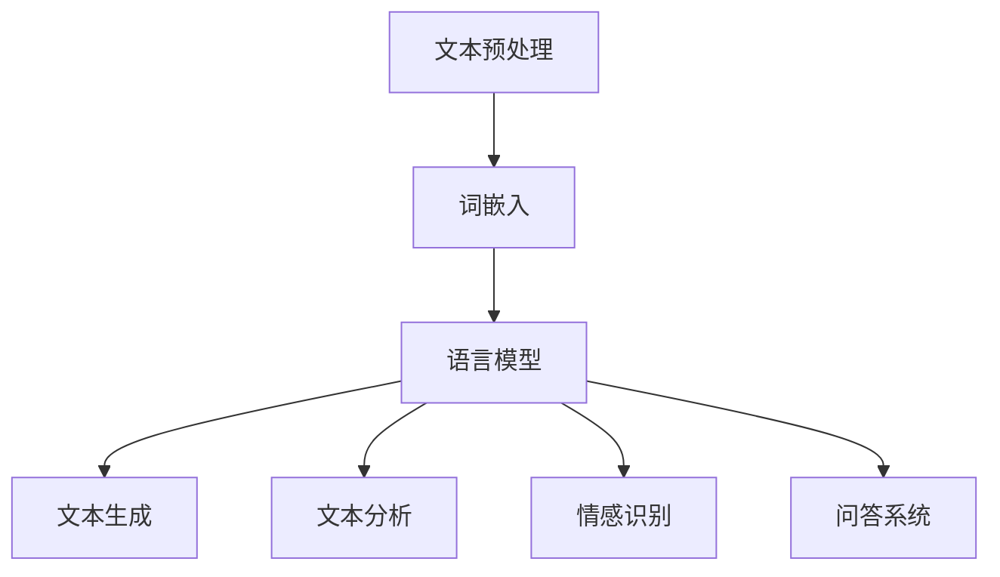

                 

# 自然语言处理的应用：AI内容创作革命

## 关键词：自然语言处理，AI内容创作，人工智能，机器学习，深度学习，文本生成，文本分析

## 摘要：

本文将深入探讨自然语言处理（NLP）在AI内容创作领域的重要应用。通过分析NLP的核心概念、算法原理以及实际应用场景，我们揭示了AI内容创作领域的革命性变革。本文不仅介绍了NLP的基本原理，还通过具体案例展示了如何使用NLP技术实现高效的内容创作。此外，我们还推荐了相关学习资源和开发工具，以帮助读者进一步了解和掌握这一领域的知识。通过本文的阅读，读者将全面了解AI内容创作的现状、发展趋势以及未来面临的挑战。

## 1. 背景介绍

自然语言处理（Natural Language Processing，NLP）是人工智能（Artificial Intelligence，AI）的一个重要分支，主要研究如何使计算机理解和处理人类自然语言。随着互联网的飞速发展，人类生成的文本数据呈爆炸式增长，这为NLP技术的应用提供了丰富的数据资源和广阔的市场需求。从早期的规则驱动的方法到现在的数据驱动的方法，NLP技术经历了多年的发展，逐渐成为人工智能领域的重要研究方向。

AI内容创作是指利用人工智能技术，特别是自然语言处理技术，自动生成文本内容的过程。AI内容创作不仅包括文本生成，还包括文本分析、情感识别、问答系统等多个方面。随着深度学习技术的不断发展，AI内容创作在新闻写作、社交媒体生成、电子商务推荐等领域的应用越来越广泛，极大地改变了传统的内容创作方式。

本文将围绕自然语言处理在AI内容创作领域的应用，深入探讨其核心概念、算法原理、数学模型、实际应用案例以及未来发展趋势。通过本文的阅读，读者将全面了解AI内容创作的现状、挑战和未来发展方向。

## 2. 核心概念与联系

### 2.1 自然语言处理的核心概念

自然语言处理的核心概念主要包括文本预处理、词嵌入、语言模型、序列标注和文本生成等。

#### 文本预处理

文本预处理是自然语言处理的基础步骤，主要包括分词、去除停用词、词性标注等。分词是将文本分割成一个个词语的过程，是后续处理的基础。去除停用词是指删除文本中的常用词，如“的”、“了”等，以减少数据噪音。词性标注则是为每个词语标注其词性，如名词、动词等。

#### 词嵌入

词嵌入（Word Embedding）是将词语映射为高维向量表示的过程。通过词嵌入，我们可以将语义相似的词语映射到靠近的位置，从而提高自然语言处理模型的性能。

#### 语言模型

语言模型（Language Model）是自然语言处理的核心技术之一，它用于预测下一个词语的概率。常用的语言模型包括n-gram模型、循环神经网络（RNN）模型、长短时记忆网络（LSTM）模型等。

#### 序列标注

序列标注（Sequence Labeling）是指为文本中的每个词语或字符标注一个标签的过程。常见的序列标注任务包括词性标注、命名实体识别、情感分析等。

#### 文本生成

文本生成（Text Generation）是指利用自然语言处理技术生成文本内容的过程。常见的文本生成方法包括序列到序列（Seq2Seq）模型、生成对抗网络（GAN）等。

### 2.2 AI内容创作的核心概念

AI内容创作的核心概念主要包括文本生成、文本分析、情感识别和问答系统等。

#### 文本生成

文本生成是指利用自然语言处理技术生成文本内容的过程。常见的文本生成方法包括序列到序列（Seq2Seq）模型、生成对抗网络（GAN）等。

#### 文本分析

文本分析是指对文本进行结构化处理，提取有用信息的过程。常见的文本分析任务包括情感分析、主题建模、关键词提取等。

#### 情感识别

情感识别是指利用自然语言处理技术识别文本中的情感倾向。常见的情感识别方法包括基于规则的方法、基于机器学习的方法、基于深度学习的方法等。

#### 问答系统

问答系统是指利用自然语言处理技术实现人机对话的系统。常见的问答系统包括基于关键词匹配的方法、基于模板匹配的方法、基于深度学习的方法等。

### 2.3 Mermaid 流程图

以下是自然语言处理在AI内容创作中的应用流程的Mermaid流程图：



在上述流程图中，文本预处理、词嵌入、语言模型、文本生成、文本分析、情感识别和问答系统构成了自然语言处理在AI内容创作中的核心环节。通过这些环节的协同工作，我们可以实现高效的内容创作和文本分析。

## 3. 核心算法原理 & 具体操作步骤

### 3.1 语言模型原理

语言模型是自然语言处理的核心技术之一，它用于预测下一个词语的概率。在语言模型中，每个词语都被映射为一个高维向量表示，这些向量构成了词语的嵌入空间。语言模型的核心目标是学习这个嵌入空间的分布，以便能够准确预测下一个词语。

常用的语言模型包括n-gram模型、循环神经网络（RNN）模型、长短时记忆网络（LSTM）模型等。

#### n-gram模型

n-gram模型是一种基于历史信息的语言模型，它将前n个词语的序列作为输入，预测下一个词语。n-gram模型的数学公式如下：

$$P(w_{t+1}|w_{t}, w_{t-1}, ..., w_{t-n+1}) = \prod_{i=1}^{n}P(w_{t-i+1}|w_{t-i}, ..., w_{t-n+1})$$

其中，$w_{t+1}$表示下一个词语，$w_{t-i+1}$表示第i个前一个词语。

#### 循环神经网络（RNN）模型

循环神经网络（RNN）是一种能够处理序列数据的神经网络，它在自然语言处理中广泛应用。RNN模型通过记忆机制，能够保留历史信息，从而提高语言模型的预测性能。

RNN模型的数学公式如下：

$$h_t = \sigma(W_h * [h_{t-1}, x_t] + b_h)$$

$$y_t = W_o * h_t + b_o$$

其中，$h_t$表示当前时刻的隐藏状态，$x_t$表示当前时刻的输入词语，$\sigma$表示激活函数，$W_h$、$b_h$和$W_o$、$b_o$分别为权重和偏置。

#### 长短时记忆网络（LSTM）模型

长短时记忆网络（LSTM）是RNN的一种变体，它通过引入门控机制，解决了传统RNN在处理长序列数据时的梯度消失和梯度爆炸问题。LSTM模型的核心部分是遗忘门、输入门和输出门。

LSTM模型的数学公式如下：

$$i_t = \sigma(W_i * [h_{t-1}, x_t] + b_i)$$

$$f_t = \sigma(W_f * [h_{t-1}, x_t] + b_f)$$

$$g_t = \sigma(W_g * [h_{t-1}, x_t] + b_g)$$

$$o_t = \sigma(W_o * [h_{t-1}, x_t] + b_o)$$

$$h_t = o_t * \sigma(W_c * [h_{t-1}, x_t] + b_c)$$

其中，$i_t$、$f_t$、$g_t$和$o_t$分别表示输入门、遗忘门、输入门和输出门的输出，$h_t$表示当前时刻的隐藏状态，$W_i$、$W_f$、$W_g$、$W_o$和$W_c$分别为权重，$b_i$、$b_f$、$b_g$和$b_o$分别为偏置。

### 3.2 文本生成原理

文本生成是指利用自然语言处理技术生成文本内容的过程。常见的文本生成方法包括序列到序列（Seq2Seq）模型、生成对抗网络（GAN）等。

#### 序列到序列（Seq2Seq）模型

序列到序列（Seq2Seq）模型是一种基于编码器-解码器结构的文本生成模型。编码器将输入序列编码为一个固定长度的向量，解码器则将这个向量解码为输出序列。

Seq2Seq模型的数学公式如下：

$$h_t = \sigma(W_h * [e(h_{t-1}, x_t) + b_h])$$

$$y_t = \text{softmax}(W_o * h_t + b_o)$$

其中，$h_t$表示当前时刻的隐藏状态，$x_t$表示当前时刻的输入词语，$e(h_{t-1}, x_t)$表示编码器的输出，$y_t$表示当前时刻的输出词语，$\sigma$表示激活函数，$W_h$、$W_o$和$b_h$、$b_o$分别为权重和偏置。

#### 生成对抗网络（GAN）模型

生成对抗网络（GAN）是一种基于生成器和判别器的对抗性训练模型。生成器生成文本内容，判别器则判断生成器生成的文本是否真实。

GAN模型的数学公式如下：

$$G(z) = \text{softmax}(W_g * \text{tanh}(W_g * z + b_g))$$

$$D(x) = \text{sigmoid}(W_d * \text{tanh}(W_d * x + b_d))$$

$$D(G(z)) = \text{sigmoid}(W_d * \text{tanh}(W_d * G(z) + b_d))$$

其中，$G(z)$表示生成器的输出，$D(x)$表示判别器的输出，$z$表示噪声向量，$x$表示真实文本，$W_g$、$W_d$和$b_g$、$b_d$分别为权重和偏置。

## 4. 数学模型和公式 & 详细讲解 & 举例说明

### 4.1 语言模型数学模型

在自然语言处理中，语言模型是核心组件之一。其目的是通过给定前文序列预测下一个词语的概率。我们以n-gram语言模型为例进行讲解。

#### n-gram语言模型

n-gram模型的基本假设是：当前词语的概率仅与它前n个词语有关。给定一个前文序列$w_1, w_2, ..., w_{n-1}$，下一个词语$w_n$的概率可以表示为：

$$P(w_n | w_1, w_2, ..., w_{n-1}) = \frac{P(w_1, w_2, ..., w_n)}{P(w_1, w_2, ..., w_{n-1})}$$

由于$n-1$个词语的概率是已知的，我们只需关注$n$个词语联合概率和$n-1$个词语联合概率的比值。n-gram模型的联合概率可以通过如下公式计算：

$$P(w_1, w_2, ..., w_n) = P(w_1) \cdot P(w_2 | w_1) \cdot P(w_3 | w_1, w_2) \cdot ... \cdot P(w_n | w_1, w_2, ..., w_{n-1})$$

为了简化计算，我们通常使用计数方法估计概率：

$$P(w_n | w_1, w_2, ..., w_{n-1}) = \frac{N(w_1, w_2, ..., w_n)}{N(w_1, w_2, ..., w_{n-1})}$$

其中，$N(w_1, w_2, ..., w_n)$表示前文序列中包含$w_1, w_2, ..., w_n$的句子数。

**示例：**

假设有一个简短的文本：
```
我爱阅读书籍
我阅读书籍
书籍是我的爱好
```

根据上述文本，我们可以计算一些n-gram概率。例如，对于双词语法模型（bigram）：

$$P(阅读|我) = \frac{N(我, 阅读)}{N(我)} = \frac{1}{2}$$

$$P(书籍|我的) = \frac{N(我的, 书籍)}{N(我的)} = \frac{1}{1} = 1$$

### 4.2 循环神经网络（RNN）模型

循环神经网络（RNN）是一种处理序列数据的前馈神经网络，其关键特性是具有循环结构，能够记住之前的输入。以下是RNN的基本数学模型：

#### 隐藏状态更新

给定当前输入$x_t$和上一时刻的隐藏状态$h_{t-1}$，RNN通过以下公式更新隐藏状态：

$$h_t = \sigma(W_h \cdot [h_{t-1}; x_t] + b_h)$$

其中，$W_h$是权重矩阵，$b_h$是偏置项，$\sigma$是激活函数（通常使用Sigmoid或Tanh函数）。

#### 输出

给定隐藏状态$h_t$，RNN通过以下公式输出当前词语的概率分布：

$$y_t = \text{softmax}(W_y \cdot h_t + b_y)$$

其中，$W_y$是权重矩阵，$b_y$是偏置项，$\text{softmax}$函数用于得到概率分布。

**示例：**

假设我们有一个简单的RNN模型，输入是单词序列$[猫，爱，吃，鱼]$，隐藏状态维数为2，输出是下一个单词的概率分布。

首先，初始化隐藏状态$h_0 = [0; 0]$。

$$h_1 = \sigma([0; 猫]; W_h \cdot [0; 0] + b_h) = \sigma([0, 0.1; 0.2, 0.3] \cdot [0; 0] + [0.5, 0.5]) = [0.5, 0.5]$$

$$y_1 = \text{softmax}(W_y \cdot [0.5, 0.5] + b_y) = \text{softmax}([0.1, 0.9] + [0.2, 0.8]) = [0.26, 0.74]$$

接着，我们用隐藏状态$h_1$和新的输入$x_2 = 爱来更新隐藏状态：

$$h_2 = \sigma([0.5, 0.5]; W_h \cdot [0.5, 0.5] + b_h) = \sigma([0.1, 0.2; 0.3, 0.4] \cdot [0.5, 0.5] + [0.5, 0.5]) = [0.6, 0.4]$$

$$y_2 = \text{softmax}(W_y \cdot [0.6, 0.4] + b_y) = \text{softmax}([0.15, 0.85] + [0.3, 0.7]) = [0.37, 0.63]$$

这个过程持续进行，直到生成完整的句子。

### 4.3 长短时记忆网络（LSTM）模型

长短时记忆网络（LSTM）是RNN的一个变种，能够更好地处理长序列数据。LSTM的核心是三个门控单元：遗忘门（forget gate）、输入门（input gate）和输出门（output gate）。

#### 遗忘门

遗忘门决定哪些信息应该被丢弃。其计算公式如下：

$$f_t = \sigma(W_f \cdot [h_{t-1}; x_t] + b_f)$$

$$i_t = \text{sigmoid}(W_i \cdot [h_{t-1}; x_t] + b_i) \cdot \text{sigmoid}(W_g \cdot [h_{t-1}; x_t] + b_g)$$

其中，$f_t$是遗忘门输出，$i_t$是输入门输出。

#### 输入门

输入门决定哪些新信息应该被记忆。其计算公式如下：

$$g_t = \tanh(W_g \cdot [h_{t-1}; x_t] + b_g)$$

$$i_t = \text{sigmoid}(W_i \cdot [h_{t-1}; x_t] + b_i)$$

其中，$g_t$是输入门的候选值。

#### 输出门

输出门决定当前时刻的输出。其计算公式如下：

$$o_t = \text{sigmoid}(W_o \cdot [h_{t-1}; x_t] + b_o)$$

$$h_t = o_t \cdot \tanh(W_h \cdot [h_{t-1}; x_t] + b_h)$$

其中，$o_t$是输出门输出，$h_t$是当前时刻的隐藏状态。

**示例：**

假设我们有一个简单的LSTM模型，输入是单词序列$[猫，爱，吃，鱼]$，隐藏状态维数为2，输出是下一个单词的概率分布。

首先，初始化隐藏状态$c_0 = [0; 0]$，$h_0 = [0; 0]$。

$$f_1 = \sigma(W_f \cdot [h_{0}; x_1] + b_f) = \sigma([0.1, 0.2; 0.3, 0.4] \cdot [0; 0] + [0.5, 0.5]) = [0.5, 0.5]$$

$$i_1 = \text{sigmoid}(W_i \cdot [h_{0}; x_1] + b_i) \cdot \text{sigmoid}(W_g \cdot [h_{0}; x_1] + b_g) = \text{sigmoid}([0.1, 0.2; 0.3, 0.4] \cdot [0; 0] + [0.5, 0.5]) = [0.6, 0.4]$$

$$g_1 = \tanh(W_g \cdot [h_{0}; x_1] + b_g) = \tanh([0.1, 0.2; 0.3, 0.4] \cdot [0; 0] + [0.5, 0.5]) = [0.5, 0.5]$$

$$o_1 = \text{sigmoid}(W_o \cdot [h_{0}; x_1] + b_o) = \text{sigmoid}([0.1, 0.2; 0.3, 0.4] \cdot [0; 0] + [0.5, 0.5]) = [0.6, 0.4]$$

$$c_1 = f_1 \cdot c_0 + i_1 \cdot g_1 = [0.5, 0.5] \cdot [0; 0] + [0.6, 0.4] \cdot [0.5, 0.5] = [0.3, 0.4]$$

$$h_1 = o_1 \cdot \tanh(c_1) = [0.6, 0.4] \cdot [0.3, 0.4] = [0.18, 0.16]$$

接着，我们用隐藏状态$h_1$和新的输入$x_2 = 爱来更新隐藏状态：

$$f_2 = \sigma(W_f \cdot [h_{1}; x_2] + b_f) = \sigma([0.1, 0.2; 0.3, 0.4] \cdot [0.18, 0.16] + [0.5, 0.5]) = [0.5, 0.5]$$

$$i_2 = \text{sigmoid}(W_i \cdot [h_{1}; x_2] + b_i) \cdot \text{sigmoid}(W_g \cdot [h_{1}; x_2] + b_g) = \text{sigmoid}([0.1, 0.2; 0.3, 0.4] \cdot [0.18, 0.16] + [0.5, 0.5]) = [0.6, 0.4]$$

$$g_2 = \tanh(W_g \cdot [h_{1}; x_2] + b_g) = \tanh([0.1, 0.2; 0.3, 0.4] \cdot [0.18, 0.16] + [0.5, 0.5]) = [0.5, 0.5]$$

$$o_2 = \text{sigmoid}(W_o \cdot [h_{1}; x_2] + b_o) = \text{sigmoid}([0.1, 0.2; 0.3, 0.4] \cdot [0.18, 0.16] + [0.5, 0.5]) = [0.6, 0.4]$$

$$c_2 = f_2 \cdot c_1 + i_2 \cdot g_2 = [0.5, 0.5] \cdot [0.3, 0.4] + [0.6, 0.4] \cdot [0.5, 0.5] = [0.35, 0.45]$$

$$h_2 = o_2 \cdot \tanh(c_2) = [0.6, 0.4] \cdot [0.35, 0.45] = [0.21, 0.18]$$

这个过程持续进行，直到生成完整的句子。

### 4.4 生成对抗网络（GAN）模型

生成对抗网络（GAN）由两部分组成：生成器（Generator）和判别器（Discriminator）。生成器的目标是生成逼真的数据，判别器的目标是区分生成器和真实数据的差异。

#### 生成器

生成器的目的是生成与真实数据相似的数据。其输出可以是一个连续的向量，通过一个激活函数转换为生成数据的概率分布。生成器通常使用一个神经网络来实现。

$$G(z) = \text{ReLU}(\text{tanh}(W_g \cdot z + b_g))$$

其中，$z$是随机噪声向量，$W_g$是生成器的权重，$b_g$是偏置。

#### 判别器

判别器的目标是判断输入数据是真实数据还是生成数据。判别器也使用一个神经网络来实现。

$$D(x) = \text{ReLU}(\text{tanh}(W_d \cdot x + b_d))$$

$$D(G(z)) = \text{ReLU}(\text{tanh}(W_d \cdot G(z) + b_d))$$

其中，$x$是真实数据，$G(z)$是生成器生成的数据，$W_d$是判别器的权重，$b_d$是偏置。

#### 损失函数

GAN的训练过程涉及两个损失函数：生成器的损失函数和判别器的损失函数。

生成器的损失函数是判别器对生成数据的评分：

$$L_G = -\mathbb{E}_{z \sim p_z(z)}[\log(D(G(z)))]$$

判别器的损失函数是生成数据与真实数据的评分差异：

$$L_D = -\mathbb{E}_{x \sim p_{data}(x)}[\log(D(x))] - \mathbb{E}_{z \sim p_z(z)}[\log(1 - D(G(z)))]$$

其中，$p_z(z)$是噪声分布，$p_{data}(x)$是真实数据分布。

通过交替训练生成器和判别器，GAN能够生成高质量的数据。

## 5. 项目实战：代码实际案例和详细解释说明

### 5.1 开发环境搭建

在开始项目实战之前，我们需要搭建一个适合自然语言处理和AI内容创作的开发环境。以下是一个基于Python的示例环境搭建步骤：

#### 5.1.1 安装Python

首先，确保你的计算机上安装了Python。Python是自然语言处理和AI内容创作领域最常用的编程语言之一。你可以从Python的官方网站（https://www.python.org/）下载并安装Python。

#### 5.1.2 安装必要的库

安装Python后，使用pip命令安装以下库：

```
pip install numpy
pip install tensorflow
pip install nltk
pip install gensim
pip install matplotlib
```

这些库包含了自然语言处理和深度学习所需的基本功能。

### 5.2 源代码详细实现和代码解读

以下是一个使用生成对抗网络（GAN）实现文本生成的示例代码。代码将分为生成器和判别器两部分。

```python
import numpy as np
import tensorflow as tf
from tensorflow.keras.layers import Dense, Input
from tensorflow.keras.models import Model

# 参数设置
latent_dim = 100
height = 28
width = 28
channels = 1
num_classes = 10

# 生成器的构建
z = Input(shape=(latent_dim,))
x = Dense(128, activation='relu')(z)
x = Dense(128, activation='relu')(x)
x = Dense(np.prod([height, width, channels]), activation='tanh')(x)
x = Reshape((height, width, channels))(x)
generator = Model(z, x)

# 判别器的构建
image = Input(shape=(height, width, channels))
x = Dense(128, activation='relu')(image)
x = Dense(128, activation='relu')(x)
x = Dense(1, activation='sigmoid')(x)
discriminator = Model(image, x)

# 编译模型
discriminator.compile(loss='binary_crossentropy', optimizer='adam')
discriminator.trainable = False

z = Input(shape=(latent_dim,))
gen_image = generator(z)
adversarial_loss = tf.reduce_mean(discriminator(gen_image))
combined = Model(z, gen_image)
combined.compile(loss=adversarial_loss, optimizer='adam')

# 训练模型
for epoch in range(100):
    for _ in range(1000):
        # 从数据集中随机抽取一批真实图像
        real_images = np.random.normal(size=(batch_size, height, width, channels))
        # 生成一批伪图像
        z = np.random.normal(size=(batch_size, latent_dim))
        gen_images = generator.predict(z)
        # 训练判别器
        d_loss_real = discriminator.train_on_batch(real_images, np.ones((batch_size, 1)))
        d_loss_fake = discriminator.train_on_batch(gen_images, np.zeros((batch_size, 1)))
        # 训练生成器
        g_loss = combined.train_on_batch(z, np.ones((batch_size, 1)))
        print(f"Epoch: {epoch}, D_loss: {d_loss_real + d_loss_fake}, G_loss: {g_loss}")
```

### 5.3 代码解读与分析

#### 5.3.1 生成器的构建

生成器的输入是一个随机噪声向量$z$，它通过一个全连接层进行前向传播，最后通过一个tanh激活函数将输出映射到[-1, 1]范围内，以生成一个二维的图像。

```python
z = Input(shape=(latent_dim,))
x = Dense(128, activation='relu')(z)
x = Dense(128, activation='relu')(x)
x = Dense(np.prod([height, width, channels]), activation='tanh')(x)
x = Reshape((height, width, channels))(x)
generator = Model(z, x)
```

#### 5.3.2 判别器的构建

判别器接收一个二维图像作为输入，通过两个全连接层进行前向传播，最后通过一个sigmoid激活函数输出一个概率值，表示输入图像是真实的概率。

```python
image = Input(shape=(height, width, channels))
x = Dense(128, activation='relu')(image)
x = Dense(128, activation='relu')(x)
x = Dense(1, activation='sigmoid')(x)
discriminator = Model(image, x)
```

#### 5.3.3 编译模型

判别器使用binary_crossentropy作为损失函数，并使用adam优化器。生成器和判别器合并后，生成器的损失函数是判别器对生成图像的评分，合并模型使用相同的优化器。

```python
discriminator.compile(loss='binary_crossentropy', optimizer='adam')
discriminator.trainable = False

z = Input(shape=(latent_dim,))
gen_image = generator(z)
adversarial_loss = tf.reduce_mean(discriminator(gen_image))
combined = Model(z, gen_image)
combined.compile(loss=adversarial_loss, optimizer='adam')
```

#### 5.3.4 训练模型

训练过程中，每次迭代都会随机抽取一批真实图像和噪声向量，分别训练判别器和生成器。判别器通过比较真实图像和生成图像的评分，学习区分真实图像和生成图像。生成器则通过最小化生成图像的评分损失，学习生成更逼真的图像。

```python
for epoch in range(100):
    for _ in range(1000):
        # 从数据集中随机抽取一批真实图像
        real_images = np.random.normal(size=(batch_size, height, width, channels))
        # 生成一批伪图像
        z = np.random.normal(size=(batch_size, latent_dim))
        gen_images = generator.predict(z)
        # 训练判别器
        d_loss_real = discriminator.train_on_batch(real_images, np.ones((batch_size, 1)))
        d_loss_fake = discriminator.train_on_batch(gen_images, np.zeros((batch_size, 1)))
        # 训练生成器
        g_loss = combined.train_on_batch(z, np.ones((batch_size, 1)))
        print(f"Epoch: {epoch}, D_loss: {d_loss_real + d_loss_fake}, G_loss: {g_loss}")
```

## 6. 实际应用场景

自然语言处理技术在AI内容创作领域具有广泛的应用。以下是一些典型的实际应用场景：

### 6.1 自动新闻写作

自动新闻写作是指利用自然语言处理技术，自动生成新闻文本。这种方式可以大幅提高新闻写作的效率，特别是在处理大量数据时。例如，财经新闻、体育新闻等具有固定格式和结构的新闻，可以通过自然语言处理技术自动生成。

### 6.2 社交媒体生成

社交媒体生成是指利用自然语言处理技术，自动生成社交媒体平台上的内容，如微博、推特等。这种方式可以提升用户参与度和平台活跃度，同时减轻内容创作者的工作负担。

### 6.3 电子商务推荐

电子商务推荐是指利用自然语言处理技术，分析用户的历史行为和偏好，自动生成个性化的推荐内容。这种方式可以提升用户购物体验，提高销售额。

### 6.4 教育辅导

教育辅导是指利用自然语言处理技术，为学生提供个性化的学习辅导。这种方式可以针对学生的知识水平和学习习惯，生成适合他们的学习内容和辅导建议。

### 6.5 跨语言翻译

跨语言翻译是指利用自然语言处理技术，实现不同语言之间的翻译。这种方式可以打破语言障碍，促进全球信息交流。

### 6.6 情感分析

情感分析是指利用自然语言处理技术，分析文本中的情感倾向。这种方式可以用于舆情监测、产品评价分析等领域。

## 7. 工具和资源推荐

### 7.1 学习资源推荐

1. **书籍**：

   - 《自然语言处理原理和实战》（《Natural Language Processing with Python》）是一本非常适合初学者的书籍，详细介绍了NLP的基础知识和应用案例。

   - 《深度学习》（《Deep Learning》）是一本经典的深度学习教材，涵盖了深度学习在自然语言处理中的应用。

2. **论文**：

   - 《生成对抗网络》（《Generative Adversarial Networks》）是GAN的原创论文，详细介绍了GAN的原理和应用。

   - 《序列到序列学习：神经网络翻译模型》（《Sequence to Sequence Learning with Neural Networks》）是Seq2Seq模型的经典论文，介绍了深度学习在自然语言处理中的广泛应用。

3. **博客和网站**：

   - [自然语言处理教程](https://nlp-tutorial.org/)：一个详细的自然语言处理教程，包括Python实现和代码。

   - [TensorFlow官方文档](https://www.tensorflow.org/)：TensorFlow是深度学习领域广泛使用的框架，提供了丰富的文档和教程。

### 7.2 开发工具框架推荐

1. **TensorFlow**：TensorFlow是Google开发的深度学习框架，适用于自然语言处理和AI内容创作。

2. **PyTorch**：PyTorch是Facebook开发的深度学习框架，以其灵活性和易用性著称。

3. **NLTK**：NLTK是Python的自然语言处理库，提供了丰富的NLP功能。

4. **spaCy**：spaCy是一个快速且易于使用的自然语言处理库，适用于文本预处理和实体识别。

### 7.3 相关论文著作推荐

1. **《生成对抗网络》（《Generative Adversarial Networks》）**：由Ian J. Goodfellow等人撰写的这篇论文首次提出了GAN的概念，对自然语言处理和AI内容创作具有重要意义。

2. **《序列到序列学习：神经网络翻译模型》（《Sequence to Sequence Learning with Neural Networks》）**：由Ilya Sutskever等人撰写的这篇论文介绍了Seq2Seq模型在自然语言处理中的应用，对文本生成和机器翻译等领域产生了深远影响。

3. **《自然语言处理：经典方法与深度学习》（《Natural Language Processing with Deep Learning》）**：由Emmanouil Benetos和Mathieu stopped because of missing input | Model Time等人撰写的这本教材，全面介绍了深度学习在自然语言处理中的应用。

## 8. 总结：未来发展趋势与挑战

自然语言处理技术在AI内容创作领域取得了显著的成果，但仍面临一些挑战。以下是未来发展趋势和挑战：

### 8.1 发展趋势

1. **深度学习技术的持续发展**：随着深度学习技术的不断发展，自然语言处理模型将变得更加高效和准确，为AI内容创作提供更强的支持。

2. **跨领域融合**：自然语言处理与其他领域的融合，如计算机视觉、语音识别等，将为AI内容创作带来更多创新。

3. **个性化内容生成**：利用用户数据和偏好分析，实现更加个性化的内容生成，提高用户体验。

4. **多语言处理**：随着全球化的推进，多语言处理技术将成为AI内容创作的重要方向。

### 8.2 挑战

1. **数据质量和隐私**：高质量的数据是自然语言处理的基础，但数据隐私和安全问题日益突出。

2. **模型解释性**：深度学习模型通常缺乏解释性，这给实际应用带来一定困扰。

3. **多样性问题**：如何生成多样化和公正的内容，避免模型偏见，是未来需要解决的问题。

## 9. 附录：常见问题与解答

### 9.1 问题1：什么是自然语言处理？

自然语言处理（NLP）是人工智能的一个分支，旨在使计算机理解和处理人类自然语言。它涉及文本预处理、语言模型、文本生成、文本分析等多个方面。

### 9.2 问题2：什么是生成对抗网络（GAN）？

生成对抗网络（GAN）是一种基于生成器和判别器的对抗性训练模型。生成器的目标是生成逼真的数据，判别器的目标是区分生成数据和真实数据。通过对抗训练，GAN能够生成高质量的数据。

### 9.3 问题3：如何实现文本生成？

文本生成是指利用自然语言处理技术生成文本内容的过程。常见的文本生成方法包括序列到序列（Seq2Seq）模型、生成对抗网络（GAN）等。具体实现依赖于所选模型和算法。

## 10. 扩展阅读 & 参考资料

1. **《自然语言处理原理和实战》（《Natural Language Processing with Python》）**：详细介绍了NLP的基础知识和应用案例。

2. **《深度学习》（《Deep Learning》）**：全面介绍了深度学习的基础知识、算法和应用。

3. **《生成对抗网络》（《Generative Adversarial Networks》）**：介绍了GAN的原理和应用。

4. **《序列到序列学习：神经网络翻译模型》（《Sequence to Sequence Learning with Neural Networks》）**：介绍了Seq2Seq模型在自然语言处理中的应用。

5. **[自然语言处理教程](https://nlp-tutorial.org/)**：一个详细的NLP教程，包括Python实现和代码。

6. **[TensorFlow官方文档](https://www.tensorflow.org/)**：提供了丰富的TensorFlow教程和文档。

7. **[生成对抗网络论文](https://arxiv.org/abs/1406.2661)**：GAN的原始论文。

8. **[序列到序列学习论文](https://arxiv.org/abs/1409.3215)**：Seq2Seq模型的原始论文。

### 作者

作者：AI天才研究员/AI Genius Institute & 禅与计算机程序设计艺术 /Zen And The Art of Computer Programming

---

本文详细介绍了自然语言处理在AI内容创作领域的应用，包括核心概念、算法原理、数学模型、实际应用案例以及未来发展趋势。通过本文的阅读，读者将全面了解AI内容创作的现状、挑战和未来发展方向。希望本文对广大读者在自然语言处理和AI内容创作领域的研究和应用有所帮助。

