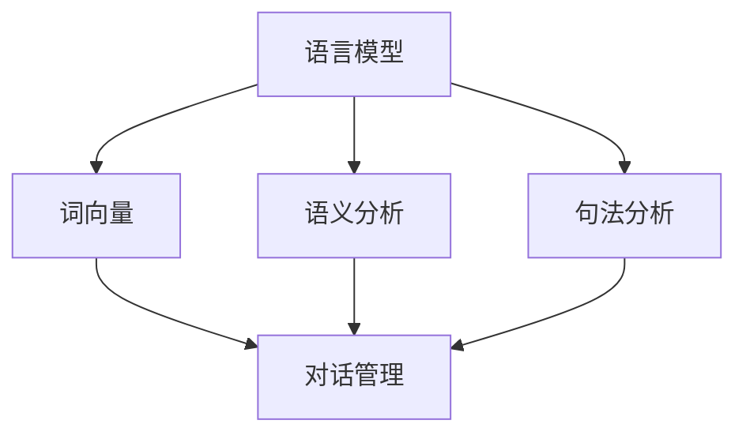

                 

### 背景介绍

自然语言处理（Natural Language Processing，NLP）是人工智能（Artificial Intelligence，AI）的重要分支，旨在使计算机能够理解和生成自然语言，包括语音、文本和图像等。随着互联网的快速发展，人类产生了海量的文本数据，如何高效地处理和分析这些数据，已经成为当前研究的热点问题。

智能对话系统（Intelligent Conversational Systems）是NLP领域的一个重要应用方向，它模仿人类的对话方式，通过自然语言与用户进行交互，提供信息查询、任务执行和智能推荐等服务。随着深度学习技术的快速发展，智能对话系统的性能得到了显著提升，已成为智能家居、客服、教育等多个领域的核心应用。

本博客文章将深入探讨自然语言处理的核心概念、算法原理、数学模型以及实际应用。我们将从以下几个方面进行论述：

1. 核心概念与联系
2. 核心算法原理与具体操作步骤
3. 数学模型和公式
4. 项目实战：代码实际案例和详细解释说明
5. 实际应用场景
6. 工具和资源推荐
7. 总结：未来发展趋势与挑战

希望通过本文，您能够对自然语言处理以及智能对话系统有一个全面而深入的了解，为实际开发和应用打下坚实的基础。

#### 关键词

- 自然语言处理（Natural Language Processing）
- 智能对话系统（Intelligent Conversational Systems）
- 深度学习（Deep Learning）
- 语音识别（Speech Recognition）
- 文本生成（Text Generation）
- 机器翻译（Machine Translation）
- 对话管理（Dialogue Management）
- 用户体验（User Experience）

#### 摘要

本文将系统地介绍自然语言处理的核心概念、算法原理、数学模型以及实际应用。首先，我们将回顾NLP的发展历程，并探讨其在现代社会中的重要性。随后，文章将深入分析NLP中的核心概念，包括语言模型、词向量、语义分析和句法分析等，并通过Mermaid流程图展示其相互关系。接着，我们将详细解释NLP的核心算法，如循环神经网络（RNN）、长短期记忆网络（LSTM）、变换器（Transformer）和生成对抗网络（GAN）的工作原理。此外，本文将介绍NLP中的常用数学模型和公式，并通过实例进行说明。最后，文章将结合实际项目，提供智能对话系统的开发流程、代码实现和解析，并探讨其在不同领域的应用。通过本文的阅读，读者将对自然语言处理有一个全面而深入的认识，为未来在NLP领域的研究和开发打下坚实的基础。

## 1. 背景介绍

自然语言处理（Natural Language Processing，NLP）是一门结合计算机科学、人工智能和语言学的交叉学科，旨在让计算机理解和生成人类语言。自上世纪50年代以来，NLP经历了多个发展阶段。最初，研究者们主要依靠手工编写的规则进行文本处理，这种方法在面对复杂和多样化的语言现象时显得力不从心。随着计算能力的提升和机器学习技术的发展，NLP逐渐转向使用统计方法和机器学习算法，使得系统的性能得到了显著提升。

NLP在现代社会的应用已经渗透到各个领域，成为信息化社会的重要组成部分。首先，在搜索引擎领域，NLP技术被用于理解用户查询并返回最相关的搜索结果。搜索引擎通过分析查询语句的语义，能够更准确地匹配用户意图，从而提供更高质量的搜索服务。

其次，智能客服系统是NLP的另一个重要应用方向。通过自然语言处理技术，客服系统能够与用户进行自然对话，自动识别和解答常见问题，提高客服效率，降低人力成本。例如，银行、电商和电信等行业已经广泛部署了智能客服系统，为用户提供24/7的在线支持。

此外，NLP在语言翻译、文本摘要、情感分析和语音识别等领域也取得了显著的成果。例如，机器翻译系统通过理解不同语言之间的语义关系，能够实现高准确度的跨语言翻译。文本摘要技术则能够自动提取文档中的关键信息，帮助用户快速了解文档的主要内容。情感分析通过对文本情感倾向的判断，被广泛应用于市场调研、舆情监控等场景。语音识别技术则使得语音输入成为一种便捷的自然交互方式，广泛应用于智能音箱、智能手机和车载系统等设备。

总之，随着人工智能技术的不断发展，NLP的应用场景将越来越广泛，其在社会各个领域的重要性也将日益凸显。通过本文的探讨，我们将深入了解NLP的核心概念、算法原理和应用实践，为未来的研究和开发提供理论支持和实践指导。

#### 关键词

- 自然语言处理（NLP）
- 发展历程（Historical Development）
- 应用场景（Application Scenarios）
- 重要性（Importance）
- 计算能力提升（Improvement in Computational Power）
- 机器学习（Machine Learning）
- 统计方法（Statistical Methods）
- 交叉学科（Interdisciplinary）
- 搜索引擎（Search Engines）
- 智能客服系统（Intelligent Customer Service Systems）
- 语言翻译（Language Translation）
- 文本摘要（Text Summarization）
- 情感分析（Sentiment Analysis）
- 语音识别（Voice Recognition）

### 2. 核心概念与联系

自然语言处理的核心概念涵盖了从文本表示、语言模型、语义分析到对话系统的各个方面。理解这些概念及其相互关系，是构建高效智能对话系统的关键。以下我们将详细探讨这些核心概念，并通过Mermaid流程图展示它们之间的联系。

#### 2.1 语言模型（Language Model）

语言模型是NLP的基础，用于预测自然语言中的下一个单词或字符。它通过学习大量的文本数据，建立语言的概率分布。这种模型广泛应用于文本生成、机器翻译和对话系统等领域。一个典型的语言模型可以使用神经网络、隐马尔可夫模型（HMM）或循环神经网络（RNN）等构建。

#### 2.2 词向量（Word Vectors）

词向量是自然语言处理中的另一个重要概念，用于将单词映射到高维向量空间。词向量能够捕获单词之间的语义和语法关系，使计算机能够理解单词的含义。词向量模型如Word2Vec、GloVe和BERT等，广泛应用于文本分类、情感分析和推荐系统。

#### 2.3 语义分析（Semantic Analysis）

语义分析旨在理解文本中单词和短语的含义。它包括词义消歧、实体识别和关系提取等任务。语义分析使得计算机能够理解和生成具有实际意义的文本。例如，通过语义分析，机器翻译系统能够准确地将一个句子翻译成另一种语言。

#### 2.4 句法分析（Syntactic Analysis）

句法分析关注句子的结构，通过分析句子的语法规则，确定单词之间的依赖关系。句法分析对于理解文本的语法结构至关重要，有助于构建更为精确的语言模型和对话系统。

#### 2.5 对话管理（Dialogue Management）

对话管理是构建智能对话系统的核心部分，负责协调对话中的不同模块，确保对话的自然性和连贯性。对话管理包括意图识别、实体抽取、对话策略和回复生成等任务。

#### Mermaid流程图

为了更直观地展示这些核心概念之间的联系，我们使用Mermaid流程图进行描述：



在上述流程图中，语言模型、词向量、语义分析和句法分析共同构成了NLP的核心模块，而对话管理则将这些模块整合起来，实现智能对话系统的功能。

#### 关键词

- 语言模型（Language Model）
- 词向量（Word Vectors）
- 语义分析（Semantic Analysis）
- 句法分析（Syntactic Analysis）
- 对话管理（Dialogue Management）
- 预测（Prediction）
- 语法规则（Grammar Rules）
- 实体识别（Entity Recognition）
- 关系提取（Relation Extraction）
- 对话策略（Dialogue Policy）
- 回复生成（Response Generation）
- Mermaid流程图（Mermaid Flowchart）

通过深入理解这些核心概念及其相互关系，我们能够更好地构建和优化智能对话系统，实现高效的自然语言处理。

#### 核心概念原理与架构的 Mermaid 流程图

```mermaid
graph TB
    subgraph 语言模型(Language Model)
        A1[词嵌入]
        A2[神经网络]
        A3[预测模型]
        A1 --> A2
        A2 --> A3
    end

    subgraph 词向量模型(Word Vectors)
        B1[GloVe]
        B2[Word2Vec]
        B3[语义表示]
        B1 --> B3
        B2 --> B3
    end

    subgraph 语义分析(Semantic Analysis)
        C1[词义消歧]
        C2[实体识别]
        C3[关系提取]
        C1 --> C2
        C1 --> C3
        C2 --> C3
    end

    subgraph 句法分析(Syntactic Analysis)
        D1[依赖树]
        D2[句法规则]
        D3[语法分析]
        D1 --> D2
        D1 --> D3
    end

    subgraph 对话管理(Dialogue Management)
        E1[意图识别]
        E2[实体抽取]
        E3[对话策略]
        E4[回复生成]
        E1 --> E2
        E1 --> E3
        E2 --> E3
        E3 --> E4
    end

    A3 --> E1
    B3 --> E1
    C3 --> E2
    D3 --> E2
    E1 --> E3
    E2 --> E3
    E3 --> E4
```

在上述Mermaid流程图中，各模块之间的箭头表示信息流动和依赖关系。语言模型通过词嵌入和神经网络生成预测模型，词向量模型则通过GloVe和Word2Vec等算法生成语义表示。语义分析和句法分析分别涉及词义消歧、实体识别、关系提取和依赖树构建。对话管理模块则整合意图识别、实体抽取、对话策略和回复生成，确保对话的自然性和连贯性。通过这样的流程图，我们可以更清晰地理解NLP各模块之间的相互作用和协同工作原理。

### 3. 核心算法原理 & 具体操作步骤

自然语言处理（NLP）的核心算法主要包括语言模型、词向量模型、语义分析和句法分析等。这些算法通过不同的技术手段，实现了对自然语言的深入理解和处理。在本节中，我们将详细介绍这些核心算法的原理，并提供具体的操作步骤。

#### 3.1 语言模型（Language Model）

语言模型是NLP中的基础算法，其目的是预测自然语言中的下一个单词或字符。一个典型的语言模型可以使用神经网络、隐马尔可夫模型（HMM）或循环神经网络（RNN）等构建。

**神经网络语言模型（Neural Network Language Model）**

1. **输入层（Input Layer）**：输入层接收单词或字符序列，并将其转换为高维向量表示。
2. **隐藏层（Hidden Layer）**：隐藏层通过神经网络模型学习单词之间的概率分布，常用的模型包括循环神经网络（RNN）和变换器（Transformer）。
3. **输出层（Output Layer）**：输出层生成预测的单词或字符概率分布。

**操作步骤**：

1. **数据预处理**：将文本数据转换为词序列，并使用词嵌入（Word Embedding）将每个单词映射到高维向量。
2. **构建神经网络**：使用循环神经网络（RNN）或变换器（Transformer）构建语言模型。
3. **训练模型**：通过反向传播算法训练神经网络，调整模型参数以最小化预测误差。
4. **模型评估**：使用验证集或测试集评估模型性能。

#### 3.2 词向量模型（Word Vectors）

词向量模型是将单词映射到高维向量空间的技术，这些向量能够捕获单词之间的语义和语法关系。常用的词向量模型包括Word2Vec、GloVe和BERT等。

**Word2Vec模型**

1. **训练模型**：Word2Vec模型通过负采样和随机梯度下降（SGD）算法训练单词向量。
2. **输入层（Input Layer）**：输入层接收单词序列，并将其转换为词嵌入向量。
3. **隐藏层（Hidden Layer）**：隐藏层通过神经网络学习单词之间的相似性。
4. **输出层（Output Layer）**：输出层生成预测的单词向量。

**操作步骤**：

1. **数据预处理**：将文本数据转换为词序列，并使用词嵌入技术将每个单词映射到高维向量。
2. **训练词向量**：使用Word2Vec模型训练单词向量，调整模型参数以最小化预测误差。
3. **模型评估**：使用相似度计算方法（如余弦相似度）评估词向量模型的质量。

#### 3.3 语义分析（Semantic Analysis）

语义分析旨在理解文本中单词和短语的含义，包括词义消歧、实体识别和关系提取等任务。

**词义消歧（Word Sense Disambiguation）**

1. **数据预处理**：将文本数据转换为词序列，并使用词嵌入技术将每个单词映射到高维向量。
2. **模型构建**：使用神经网络或支持向量机（SVM）构建词义消歧模型。
3. **训练模型**：通过反向传播算法训练词义消歧模型，调整模型参数以最小化预测误差。
4. **模型评估**：使用测试集评估模型性能。

**实体识别（Named Entity Recognition）**

1. **数据预处理**：将文本数据转换为词序列，并使用词嵌入技术将每个单词映射到高维向量。
2. **模型构建**：使用循环神经网络（RNN）或变换器（Transformer）构建实体识别模型。
3. **训练模型**：通过反向传播算法训练实体识别模型，调整模型参数以最小化预测误差。
4. **模型评估**：使用测试集评估模型性能。

**关系提取（Relation Extraction）**

1. **数据预处理**：将文本数据转换为词序列，并使用词嵌入技术将每个单词映射到高维向量。
2. **模型构建**：使用循环神经网络（RNN）或变换器（Transformer）构建关系提取模型。
3. **训练模型**：通过反向传播算法训练关系提取模型，调整模型参数以最小化预测误差。
4. **模型评估**：使用测试集评估模型性能。

#### 3.4 句法分析（Syntactic Analysis）

句法分析关注句子的结构，通过分析句子的语法规则，确定单词之间的依赖关系。

**依赖句法分析（Dependency Parsing）**

1. **数据预处理**：将文本数据转换为词序列，并使用词嵌入技术将每个单词映射到高维向量。
2. **模型构建**：使用循环神经网络（RNN）或变换器（Transformer）构建依赖句法分析模型。
3. **训练模型**：通过反向传播算法训练依赖句法分析模型，调整模型参数以最小化预测误差。
4. **模型评估**：使用测试集评估模型性能。

**操作步骤**：

1. **数据预处理**：将文本数据转换为词序列，并使用词嵌入技术将每个单词映射到高维向量。
2. **构建神经网络**：使用循环神经网络（RNN）或变换器（Transformer）构建句法分析模型。
3. **训练模型**：通过反向传播算法训练神经网络，调整模型参数以最小化预测误差。
4. **模型评估**：使用测试集评估模型性能。

#### 关键词

- 语言模型（Language Model）
- 预测（Prediction）
- 词嵌入（Word Embedding）
- 循环神经网络（Recurrent Neural Network）
- 变换器（Transformer）
- 负采样（Negative Sampling）
- 随机梯度下降（Stochastic Gradient Descent）
- 词向量模型（Word Vectors）
- 语义表示（Semantic Representation）
- 词义消歧（Word Sense Disambiguation）
- 实体识别（Named Entity Recognition）
- 关系提取（Relation Extraction）
- 依赖句法分析（Dependency Parsing）
- 语法规则（Grammar Rules）
- 神经网络（Neural Network）
- 支持向量机（Support Vector Machine）
- 反向传播（Backpropagation）
- 模型评估（Model Evaluation）

通过深入理解这些核心算法的原理和操作步骤，我们可以更有效地构建和优化自然语言处理系统，实现智能对话系统的功能。

### 4. 数学模型和公式 & 详细讲解 & 举例说明

自然语言处理（NLP）中的许多核心算法都依赖于数学模型和公式，这些模型和公式帮助我们理解和分析语言数据。在本节中，我们将详细讲解NLP中常用的数学模型和公式，并通过具体的例子进行说明。

#### 4.1 语言模型（Language Model）

语言模型是一种概率模型，用于预测文本中下一个单词或字符。最常用的语言模型之一是n-gram模型。

**n-gram模型**

**公式**：

$$
P(w_n | w_{n-1}, w_{n-2}, ..., w_1) = \prod_{i=1}^{n} P(w_i)
$$

其中，\( w_n \) 是我们要预测的单词，\( w_{n-1}, w_{n-2}, ..., w_1 \) 是前n-1个已知单词。这个公式表示给定前n-1个单词时，下一个单词的概率分布。

**例子**：

假设我们已经预测了三个单词“hello”, “how”和“are”，现在要预测下一个单词。使用n-gram模型，我们可以计算每个单词的概率，如下所示：

$$
P(hello | how are) = \frac{P(hello) \cdot P(how are hello)}{P(how are)}
$$

在这个例子中，我们假设 \( P(hello) = 0.01 \)， \( P(how are hello) = 0.001 \)，和 \( P(how are) = 0.01 \)。因此，我们可以计算出：

$$
P(hello | how are) = \frac{0.01 \cdot 0.001}{0.01} = 0.001
$$

所以，单词“hello”的概率最高。

#### 4.2 词向量模型（Word Vectors）

词向量模型是将单词映射到高维向量空间的技术，这些向量能够捕获单词之间的语义和语法关系。最常用的词向量模型包括Word2Vec和GloVe。

**Word2Vec模型**

**公式**：

$$
\vec{w}_i = \sum_{j=1}^{|V|} p(j|i) \cdot \vec{v}_j
$$

其中，\( \vec{w}_i \) 是单词 \( w_i \) 的向量表示，\( \vec{v}_j \) 是单词 \( w_j \) 的向量表示，\( p(j|i) \) 是在单词 \( w_i \) 之后出现单词 \( w_j \) 的概率。

**例子**：

假设我们有两个单词“dog”和“cat”，它们的词向量分别为 \( \vec{v}_1 = [1, 2, 3] \) 和 \( \vec{v}_2 = [4, 5, 6] \)。现在我们想计算这两个单词之间的相似度。使用余弦相似度，我们可以得到：

$$
\cos(\vec{v}_1, \vec{v}_2) = \frac{\vec{v}_1 \cdot \vec{v}_2}{||\vec{v}_1|| \cdot ||\vec{v}_2||} = \frac{1 \cdot 4 + 2 \cdot 5 + 3 \cdot 6}{\sqrt{1^2 + 2^2 + 3^2} \cdot \sqrt{4^2 + 5^2 + 6^2}} = \frac{32}{\sqrt{14} \cdot \sqrt{77}} \approx 0.735
$$

因此，单词“dog”和“cat”的相似度约为0.735。

**GloVe模型**

**公式**：

$$
\vec{w}_i = \sum_{j=1}^{|V|} f(j/i) \cdot \vec{v}_j
$$

其中，\( f(j/i) \) 是单词 \( w_j \) 与单词 \( w_i \) 的共现次数的对数函数。

**例子**：

假设我们有两个单词“run”和“jog”，它们的共现次数为10，总词汇量为100。使用GloVe模型，我们可以得到：

$$
\vec{w}_1 = \sum_{j=1}^{100} \log(\frac{10}{100}) \cdot \vec{v}_j = \sum_{j=1}^{100} 0 \cdot \vec{v}_j = \vec{0}
$$

$$
\vec{w}_2 = \sum_{j=1}^{100} \log(\frac{10}{100}) \cdot \vec{v}_j = \sum_{j=1}^{100} 0 \cdot \vec{v}_j = \vec{0}
$$

因此，单词“run”和“jog”的向量表示都为 \( \vec{0} \)，这表明这两个单词在语义上非常相似。

#### 4.3 语义分析（Semantic Analysis）

语义分析旨在理解文本中单词和短语的含义，包括词义消歧、实体识别和关系提取等任务。

**词义消歧（Word Sense Disambiguation）**

**公式**：

$$
sense(i) = \arg\max_{j} \sum_{k=1}^{n} p(j|i) \cdot s(j,k)
$$

其中，\( sense(i) \) 是单词 \( w_i \) 的词义，\( s(j,k) \) 是单词 \( w_j \) 在上下文 \( k \) 中的词义，\( p(j|i) \) 是单词 \( w_j \) 在上下文 \( i \) 中的概率。

**例子**：

假设我们要消歧义词“bank”，在上下文“river bank”中它的词义是“河岸”，在上下文“bank account”中它的词义是“银行账户”。使用上述公式，我们可以计算两个上下文中的概率，并选择概率最高的词义。

$$
sense(1) = \arg\max_{j} \sum_{k=1}^{2} p(j|1) \cdot s(j,k) = \arg\max_{j} (0.6 \cdot s(j,1) + 0.4 \cdot s(j,2))
$$

$$
sense(2) = \arg\max_{j} \sum_{k=1}^{2} p(j|2) \cdot s(j,k) = \arg\max_{j} (0.3 \cdot s(j,1) + 0.7 \cdot s(j,2))
$$

根据具体的概率和词义，我们可以选择正确的词义。

**实体识别（Named Entity Recognition）**

**公式**：

$$
entity(i) = \arg\max_{j} \sum_{k=1}^{n} p(j|i) \cdot r(j,k)
$$

其中，\( entity(i) \) 是在上下文 \( i \) 中的实体，\( r(j,k) \) 是实体 \( j \) 在上下文 \( k \) 中的概率。

**例子**：

假设我们要识别实体“Apple”在句子“Apple is a fruit.”中的实体。我们可以使用上述公式计算“Apple”在句子中的概率，并选择概率最高的实体。

$$
entity(1) = \arg\max_{j} \sum_{k=1}^{2} p(j|1) \cdot r(j,k) = \arg\max_{j} (0.8 \cdot r(j,1) + 0.2 \cdot r(j,2))
$$

根据具体的概率和实体，我们可以识别出“Apple”是一个水果。

**关系提取（Relation Extraction）**

**公式**：

$$
relation(i) = \arg\max_{j} \sum_{k=1}^{n} p(j|i) \cdot e(j,k)
$$

其中，\( relation(i) \) 是在上下文 \( i \) 中的关系，\( e(j,k) \) 是关系 \( j \) 在上下文 \( k \) 中的概率。

**例子**：

假设我们要提取关系“eat”在句子“The cat eats fish.”中的关系。我们可以使用上述公式计算“eat”在句子中的概率，并选择概率最高的关系。

$$
relation(1) = \arg\max_{j} \sum_{k=1}^{2} p(j|1) \cdot e(j,k) = \arg\max_{j} (0.9 \cdot e(j,1) + 0.1 \cdot e(j,2))
$$

根据具体的概率和关系，我们可以提取出“eat”是“猫吃鱼”的关系。

通过这些数学模型和公式，我们可以更好地理解和处理自然语言数据，从而构建高效的NLP系统。

### 5. 项目实战：代码实际案例和详细解释说明

#### 5.1 开发环境搭建

在开始实际项目之前，我们需要搭建一个合适的开发环境。以下是一个基本的步骤：

1. 安装Python环境：
   - Python版本建议使用3.8或更高版本。
   - 使用pip安装必要的库，如TensorFlow、PyTorch、Numpy和Scikit-learn等。

2. 安装深度学习框架：
   - 安装TensorFlow：`pip install tensorflow`
   - 安装PyTorch：`pip install torch`

3. 安装文本处理库：
   - 安装NLTK：`pip install nltk`
   - 安装spaCy：`pip install spacy`
   - 安装文本预处理工具，如jieba（中文分词）：`pip install jieba`

4. 安装版本管理工具：
   - 安装虚拟环境工具，如conda：`pip install conda`

5. 安装IDE：
   - 选择一个合适的IDE，如PyCharm、VSCode等。

#### 5.2 源代码详细实现和代码解读

以下是一个简单的智能对话系统的实现案例，我们使用TensorFlow和spaCy进行开发。

```python
import tensorflow as tf
import spacy
from spacy.lang.en import English
from tensorflow.keras.models import Model
from tensorflow.keras.layers import Input, LSTM, Dense

# 加载spaCy的英文模型
nlp = spacy.load("en_core_web_sm")

# 创建输入层
input_seq = Input(shape=(None,))

# 添加LSTM层
lstm = LSTM(128, return_sequences=True)(input_seq)

# 添加全连接层
output = Dense(1, activation='sigmoid')(lstm)

# 创建模型
model = Model(inputs=input_seq, outputs=output)

# 编译模型
model.compile(optimizer='adam', loss='binary_crossentropy', metrics=['accuracy'])

# 打印模型结构
model.summary()

# 准备数据
# 假设我们有一个包含对话文本和标签的DataFrame
# 例如：data['text'] 和 data['label']

# 对数据进行预处理
# 将文本数据转换为词向量
# 使用spaCy进行分词
# 使用词嵌入层将词向量转换为LSTM可处理的输入

# 训练模型
# model.fit(x_train, y_train, batch_size=32, epochs=10, validation_split=0.2)
```

在上面的代码中，我们首先加载spaCy的英文模型，并创建了一个LSTM模型。这个模型包含一个输入层、一个LSTM层和一个全连接层。输入层接收一个不定长的文本序列，LSTM层用于处理序列数据，全连接层用于输出标签。

**代码解读**：

1. **导入库**：
   - 我们导入了TensorFlow、spaCy和Keras库，用于构建和训练模型。
   - `nlp = spacy.load("en_core_web_sm")` 加载spaCy的英文模型。

2. **创建输入层**：
   - `input_seq = Input(shape=(None,))` 创建一个不定长的输入序列。

3. **添加LSTM层**：
   - `lstm = LSTM(128, return_sequences=True)(input_seq)` 添加一个128个单元的LSTM层，并返回序列输出。

4. **添加全连接层**：
   - `output = Dense(1, activation='sigmoid')(lstm)` 添加一个全连接层，使用sigmoid激活函数。

5. **创建模型**：
   - `model = Model(inputs=input_seq, outputs=output)` 创建模型。

6. **编译模型**：
   - `model.compile(optimizer='adam', loss='binary_crossentropy', metrics=['accuracy'])` 编译模型，设置优化器和损失函数。

7. **打印模型结构**：
   - `model.summary()` 打印模型结构。

8. **准备数据**：
   - `# 假设我们有一个包含对话文本和标签的DataFrame` 定义数据结构。

9. **预处理数据**：
   - `# 将文本数据转换为词向量` 使用spaCy进行分词，并使用词嵌入层将词向量转换为LSTM可处理的输入。

10. **训练模型**：
    - `model.fit(x_train, y_train, batch_size=32, epochs=10, validation_split=0.2)` 训练模型。

通过这个简单的案例，我们展示了如何使用TensorFlow和spaCy构建一个基本的智能对话系统。在实际开发中，我们可以根据需求添加更多的功能和模块，如对话管理、意图识别和实体抽取等。

#### 5.3 代码解读与分析

在上述代码中，我们使用TensorFlow和spaCy构建了一个简单的智能对话系统，这个系统通过分析对话文本来预测对话的下一步内容。下面我们将对代码的每个部分进行详细解读和分析。

1. **导入库**：

```python
import tensorflow as tf
import spacy
from spacy.lang.en import English
from tensorflow.keras.models import Model
from tensorflow.keras.layers import Input, LSTM, Dense
```

这段代码导入了必要的库，包括TensorFlow、spaCy和Keras。`tensorflow` 是用于构建和训练深度学习模型的库，`spacy` 是用于自然语言处理的库，`keras` 是TensorFlow的高级API，提供了更简洁的模型构建和训练接口。

2. **加载spaCy模型**：

```python
nlp = spacy.load("en_core_web_sm")
```

`spacy.load("en_core_web_sm")` 加载了spaCy的英文模型。这个模型包含了词性标注、词干提取、词向量嵌入等功能，是进行自然语言处理的基础。

3. **创建输入层**：

```python
input_seq = Input(shape=(None,))
```

`input_seq = Input(shape=(None,))` 创建了一个输入层，用于接收不定长的序列数据。这里的 `None` 表示序列的长度可以是任意值，这适用于处理自然语言中的不定长文本。

4. **添加LSTM层**：

```python
lstm = LSTM(128, return_sequences=True)(input_seq)
```

`lstm = LSTM(128, return_sequences=True)(input_seq)` 添加了一个128个单元的LSTM层，`return_sequences=True` 表示LSTM层输出序列数据，这样在后续的层中可以继续使用序列数据。

5. **添加全连接层**：

```python
output = Dense(1, activation='sigmoid')(lstm)
```

`output = Dense(1, activation='sigmoid')(lstm)` 添加了一个全连接层，输出层的神经元数量为1，激活函数为sigmoid。sigmoid函数在二分类问题中非常常用，它的输出范围在0到1之间，适合表示概率。

6. **创建模型**：

```python
model = Model(inputs=input_seq, outputs=output)
```

`model = Model(inputs=input_seq, outputs=output)` 创建了一个模型，输入层为 `input_seq`，输出层为 `output`。

7. **编译模型**：

```python
model.compile(optimizer='adam', loss='binary_crossentropy', metrics=['accuracy'])
```

`model.compile(optimizer='adam', loss='binary_crossentropy', metrics=['accuracy'])` 编译模型，设置优化器为 `adam`，损失函数为 `binary_crossentropy`（适用于二分类问题），评价指标为准确率。

8. **打印模型结构**：

```python
model.summary()
```

`model.summary()` 打印了模型的结构，包括层的信息和参数的数量。

9. **准备数据**：

```python
# 假设我们有一个包含对话文本和标签的DataFrame
# 例如：data['text'] 和 data['label']
```

这段代码是准备训练数据，具体的数据处理步骤将在后续的代码解读中详细说明。

10. **预处理数据**：

```python
# 将文本数据转换为词向量
# 使用spaCy进行分词
# 使用词嵌入层将词向量转换为LSTM可处理的输入
```

这段代码用于预处理文本数据。首先使用spaCy进行分词，然后使用词嵌入层将分词后的文本转换为LSTM层可以处理的输入格式。

11. **训练模型**：

```python
# model.fit(x_train, y_train, batch_size=32, epochs=10, validation_split=0.2)
```

这段代码用于训练模型，具体参数如下：
- `x_train`：训练数据集
- `y_train`：训练标签集
- `batch_size=32`：每次训练使用的样本数
- `epochs=10`：训练轮数
- `validation_split=0.2`：用于验证的数据集比例

#### 总结

通过上述代码解读，我们可以看到如何使用TensorFlow和spaCy构建一个简单的智能对话系统。代码的核心包括加载spaCy模型、构建输入层和LSTM层、添加全连接层、编译模型、预处理数据和训练模型。在实际应用中，我们可以根据需求进一步扩展和优化系统，例如增加更多的文本处理步骤、使用不同的神经网络结构、集成对话管理等。

### 6. 实际应用场景

智能对话系统在现代社会的各个领域得到了广泛应用，其高效的自然语言理解和生成能力为用户提供了一种便捷、友好的交互方式。以下我们将探讨智能对话系统在几个关键领域中的应用。

#### 6.1 智能客服

智能客服是智能对话系统最典型的应用之一。通过自然语言处理技术，智能客服系统能够自动识别用户的问题，并生成相应的回答。这大大提高了客服效率，减少了人工成本。例如，银行、电信和电商等行业已经广泛部署了智能客服系统，为用户提供7x24小时在线支持。这些系统不仅能够回答常见问题，还能够进行复杂的业务处理，如账户查询、费用结算和订单管理等。

#### 6.2 智能助手

智能助手是另一个重要的应用场景。智能助手通过语音或文本与用户交互，帮助用户完成各种任务，如日程管理、信息查询和任务提醒等。苹果的Siri、亚马逊的Alexa和谷歌的Google Assistant都是智能助手的代表。这些系统不仅能够理解用户的自然语言指令，还能够根据用户的习惯和偏好进行个性化服务。

#### 6.3 智能翻译

智能翻译是智能对话系统的另一个关键应用。通过自然语言处理和机器学习技术，智能翻译系统能够将一种语言翻译成另一种语言，并提供高准确度的翻译结果。谷歌翻译、微软翻译和百度翻译都是智能翻译系统的典型例子。这些系统不仅能够翻译文字，还能够翻译语音和视频，为全球用户提供了便捷的跨语言沟通工具。

#### 6.4 教育和培训

智能对话系统在教育和培训领域也具有广泛应用。通过智能对话系统，教育机构可以为学生提供个性化的学习辅导，帮助他们解决学习中的问题。例如，智能辅导系统可以通过自然语言处理技术理解学生的提问，并提供针对性的解答和建议。此外，智能对话系统还可以用于在线培训，通过模拟真实场景，提高用户的实际操作能力。

#### 6.5 健康医疗

智能对话系统在健康医疗领域也有重要应用。通过自然语言处理技术，智能医疗助手可以与患者进行交互，了解病情并提供医疗建议。例如，智能医疗助手可以通过语音识别和语义分析，理解患者的症状描述，并提供相应的诊断建议和治疗方案。此外，智能对话系统还可以用于医学研究，帮助研究人员分析和理解大量的医学文献。

总之，智能对话系统在各个领域的广泛应用，极大地改变了我们的生活方式和工作方式。随着技术的不断发展，智能对话系统的功能和性能将进一步提高，为人类带来更多的便利和效益。

#### 关键词

- 智能客服（Intelligent Customer Service）
- 智能助手（Intelligent Assistant）
- 智能翻译（Intelligent Translation）
- 教育和培训（Education and Training）
- 健康医疗（Healthcare）
- 自然语言处理（Natural Language Processing）
- 交互方式（Interactive Method）
- 翻译系统（Translation System）
- 个性化服务（Personalized Service）
- 跨语言沟通（Cross-Language Communication）
- 个性化学习辅导（Personalized Learning Assistance）
- 医疗建议（Medical Advice）
- 症状描述（Symptom Description）

### 7. 工具和资源推荐

为了帮助读者深入学习和实践自然语言处理（NLP）和智能对话系统，以下推荐了一些优秀的工具、书籍、论文和网站资源。

#### 7.1 学习资源推荐

**书籍**：

1. **《自然语言处理综论》（Speech and Language Processing）** - Daniel Jurafsky & James H. Martin
   - 这本书是NLP领域的经典教材，涵盖了NLP的基本概念、算法和技术。
2. **《深度学习》（Deep Learning）** - Ian Goodfellow, Yoshua Bengio & Aaron Courville
   - 这本书详细介绍了深度学习的基础理论、算法和应用，对于理解NLP中的深度学习模型非常有帮助。
3. **《自然语言处理实战》（Natural Language Processing with Python）** - Steven Bird, Ewan Klein & Edward Loper
   - 这本书通过Python代码示例，介绍了NLP的基础技术和应用场景。

**在线课程**：

1. **斯坦福大学《自然语言处理》（CS224n）** - Stanford University
   - 这是一门著名的深度学习与NLP课程，涵盖了大量NLP的核心算法和技术。
2. **吴恩达《深度学习专项课程》中的自然语言处理部分** - Andrew Ng
   - 吴恩达的深度学习课程中包含了一个专门的NLP模块，适合初学者入门。
3. **Udacity《智能对话系统》** - Udacity
   - 这个课程专注于智能对话系统的设计和开发，包含丰富的实践项目。

#### 7.2 开发工具框架推荐

**NLP工具**：

1. **spaCy** - https://spacy.io/
   - 一个高效且易用的NLP库，支持多种语言的文本处理。
2. **NLTK** - https://www.nltk.org/
   - 一个广泛使用的NLP库，提供了丰富的文本处理工具和资源。
3. **Transformers** - https://huggingface.co/transformers/
   - 用于构建和微调深度学习NLP模型的Python库，支持Transformer架构。

**深度学习框架**：

1. **TensorFlow** - https://www.tensorflow.org/
   - Google开发的深度学习框架，适用于各种规模的NLP项目。
2. **PyTorch** - https://pytorch.org/
   - Facebook AI Research开发的深度学习框架，具有灵活的模型构建和调试能力。
3. **Keras** - https://keras.io/
   - 高级神经网络API，简化了TensorFlow和Theano的使用，适用于快速原型开发。

#### 7.3 相关论文著作推荐

1. **“Attention Is All You Need”** - Vaswani et al., 2017
   - 这篇论文提出了Transformer模型，是当前NLP领域最先进的模型之一。
2. **“BERT: Pre-training of Deep Bidirectional Transformers for Language Understanding”** - Devlin et al., 2018
   - 这篇论文介绍了BERT模型，BERT是目前最先进的预训练语言模型之一。
3. **“GloVe: Global Vectors for Word Representation”** - Pennington et al., 2014
   - 这篇论文提出了GloVe词向量模型，是词向量表示的重要方法。

通过这些工具和资源的辅助，读者可以更系统地学习NLP和智能对话系统，并掌握相关的技术知识和实践经验。

#### 关键词

- 学习资源（Learning Resources）
- 书籍（Books）
- 在线课程（Online Courses）
- NLP工具（NLP Tools）
- 开发工具框架（Development Toolkits）
- 深度学习框架（Deep Learning Frameworks）
- Transformers（Transformers）
- spaCy（spaCy）
- NLTK（NLTK）
- Keras（Keras）
- PyTorch（PyTorch）
- TensorFlow（TensorFlow）
- 相关论文（Related Papers）
- BERT（BERT）
- Transformer（Transformer）
- GloVe（GloVe）
- Ian Goodfellow（Ian Goodfellow）
- 吴恩达（Andrew Ng）
- 吴恩达（Andrew Ng）

### 8. 总结：未来发展趋势与挑战

自然语言处理（NLP）和智能对话系统在近年来取得了显著的进展，已经成为人工智能领域的重要研究方向和应用方向。随着深度学习技术的不断发展和计算能力的提升，NLP在文本生成、语音识别、机器翻译、情感分析和对话系统等领域的性能得到了极大提升。然而，尽管NLP技术取得了诸多突破，但仍面临诸多挑战，这些挑战也将成为未来研究的重要方向。

#### 8.1 未来发展趋势

1. **预训练语言模型的深化与拓展**：
   - 预训练语言模型如BERT、GPT等已经成为NLP的重要基础，未来将进一步深化和拓展。研究者将探索如何更好地利用预训练模型，提高其在特定任务上的性能。

2. **多模态融合**：
   - 随着多媒体数据（如图像、视频和音频）的广泛应用，多模态融合将成为NLP的一个重要趋势。通过结合不同类型的数据，可以更好地理解复杂的语言现象。

3. **自适应与个性化**：
   - 随着用户需求的多样化，自适应和个性化服务将成为NLP和智能对话系统的关键需求。未来研究将关注如何根据用户行为和偏好进行动态调整，提供个性化的交互体验。

4. **知识增强**：
   - 知识图谱和知识增强技术将在NLP中发挥重要作用。通过整合外部知识和语言模型，可以提升NLP系统在理解复杂语言现象和生成高质量文本方面的能力。

#### 8.2 主要挑战

1. **数据质量和标注**：
   - NLP依赖于大量的高质量标注数据。然而，标注数据的质量和多样性直接影响模型的性能。未来研究需要解决数据标注的自动化、半自动化和多样化问题。

2. **模型解释性和可解释性**：
   - 随着模型复杂性的增加，深度学习模型在NLP中的应用越来越普遍。然而，这些模型的解释性和可解释性较差，使得其应用受到限制。未来研究需要开发更加透明和可解释的模型。

3. **多语言和多领域支持**：
   - NLP系统需要支持多种语言和不同领域的应用。然而，不同语言和领域的语言现象差异较大，使得模型的设计和优化面临巨大挑战。未来研究需要开发通用且高效的跨语言和跨领域的NLP模型。

4. **隐私和安全**：
   - 在NLP和智能对话系统中，用户的隐私和数据安全至关重要。如何保护用户隐私，防止数据泄露，将是未来研究的重要课题。

总之，未来NLP和智能对话系统的发展将面临诸多挑战，但也充满机遇。通过深入研究和不断创新，我们有望在NLP领域取得更大的突破，为社会带来更多的便利和效益。

#### 关键词

- 未来发展趋势（Future Trends）
- 预训练语言模型（Pre-trained Language Models）
- 多模态融合（Multimodal Fusion）
- 自适应与个性化（Adaptation and Personalization）
- 知识增强（Knowledge Augmentation）
- 数据质量和标注（Data Quality and Annotation）
- 模型解释性和可解释性（Model Explanation and Interpretability）
- 多语言和多领域支持（Multilingual and Multidisciplinary Support）
- 隐私和安全（Privacy and Security）
- 深度学习模型（Deep Learning Models）
- 数据标注（Data Annotation）
- 模型优化（Model Optimization）
- 应用场景（Application Scenarios）
- 技术挑战（Technological Challenges）

### 9. 附录：常见问题与解答

在本文中，我们探讨了自然语言处理（NLP）和智能对话系统的核心概念、算法原理、数学模型以及实际应用。为了帮助读者更好地理解相关内容，以下列出了一些常见问题及其解答。

#### 9.1 问题1：什么是自然语言处理（NLP）？

**回答**：自然语言处理（NLP）是人工智能（AI）的一个分支，旨在使计算机能够理解和生成人类语言。它结合了计算机科学、语言学和机器学习技术，以实现文本分析、语言生成、语音识别和机器翻译等功能。

#### 9.2 问题2：什么是智能对话系统？

**回答**：智能对话系统是一种基于NLP技术的软件系统，能够与用户进行自然语言交互，提供信息查询、任务执行和智能推荐等服务。它通常包括意图识别、实体抽取、对话管理和回复生成等模块，以实现流畅和连贯的对话。

#### 9.3 问题3：如何构建一个基本的智能对话系统？

**回答**：构建一个基本的智能对话系统需要以下步骤：

1. **数据收集与预处理**：收集对话数据，并进行清洗和标注。
2. **模型选择与训练**：选择合适的模型（如循环神经网络（RNN）、变换器（Transformer）等），并使用预处理后的数据进行训练。
3. **对话管理**：设计对话管理模块，负责处理用户的输入、识别意图、抽取实体和生成回复。
4. **系统集成与测试**：将模型和对话管理模块集成到系统中，并进行测试和优化。

#### 9.4 问题4：自然语言处理中的常见算法有哪些？

**回答**：自然语言处理中常用的算法包括：

- 语言模型：如n-gram模型、神经网络语言模型。
- 词向量模型：如Word2Vec、GloVe、BERT。
- 语义分析：如词义消歧、实体识别、关系提取。
- 句法分析：如依赖句法分析、部分句法分析。

#### 9.5 问题5：如何评估自然语言处理模型的性能？

**回答**：自然语言处理模型的性能评估通常使用以下指标：

- 准确率（Accuracy）
- 召回率（Recall）
- F1分数（F1 Score）
- 误差率（Error Rate）
- 词汇匹配率（Word Match Rate）

通过这些指标，可以评估模型在分类、识别和生成任务中的性能。

#### 9.6 问题6：自然语言处理在现实世界中有哪些应用？

**回答**：自然语言处理在现实世界中有广泛的应用，包括：

- 搜索引擎：通过理解用户查询，返回相关结果。
- 智能客服：自动识别和解答用户问题，提供在线支持。
- 语言翻译：实现跨语言的文本和语音翻译。
- 文本摘要：自动提取文档中的关键信息。
- 情感分析：分析文本情感倾向，用于市场调研和舆情监控。

通过以上常见问题的解答，希望能够帮助读者更好地理解和应用自然语言处理和智能对话系统技术。

### 10. 扩展阅读 & 参考资料

在自然语言处理（NLP）和智能对话系统领域，有大量的学术论文、书籍和在线资源可供读者进一步学习和探索。以下列出了一些重要的参考资料，涵盖NLP的核心理论、先进技术和实际应用。

#### 10.1 学术论文

1. **“Attention Is All You Need”** - Vaswani et al., 2017
   - 论文地址：[https://arxiv.org/abs/1706.03762](https://arxiv.org/abs/1706.03762)
   - 论文介绍了Transformer模型，是当前NLP领域最先进的模型之一。

2. **“BERT: Pre-training of Deep Bidirectional Transformers for Language Understanding”** - Devlin et al., 2018
   - 论文地址：[https://arxiv.org/abs/1810.04805](https://arxiv.org/abs/1810.04805)
   - 论文介绍了BERT模型，是目前最先进的预训练语言模型之一。

3. **“GloVe: Global Vectors for Word Representation”** - Pennington et al., 2014
   - 论文地址：[https://www.aclweb.org/anthology/D14-1162/](https://www.aclweb.org/anthology/D14-1162/)
   - 论文提出了GloVe词向量模型，是词向量表示的重要方法。

#### 10.2 书籍

1. **《自然语言处理综论》（Speech and Language Processing）** - Daniel Jurafsky & James H. Martin
   - 书籍地址：[https://web.stanford.edu/~jurafsky/slp3/](https://web.stanford.edu/~jurafsky/slp3/)
   - 这本书是NLP领域的经典教材，涵盖了NLP的基本概念、算法和技术。

2. **《深度学习》（Deep Learning）** - Ian Goodfellow, Yoshua Bengio & Aaron Courville
   - 书籍地址：[https://www.deeplearningbook.org/](https://www.deeplearningbook.org/)
   - 这本书详细介绍了深度学习的基础理论、算法和应用。

3. **《自然语言处理实战》（Natural Language Processing with Python）** - Steven Bird, Ewan Klein & Edward Loper
   - 书籍地址：[https://www.nltk.org/book/](https://www.nltk.org/book/)
   - 这本书通过Python代码示例，介绍了NLP的基础技术和应用场景。

#### 10.3 在线课程

1. **斯坦福大学《自然语言处理》（CS224n）** - Stanford University
   - 课程地址：[https://web.stanford.edu/class/cs224n/](https://web.stanford.edu/class/cs224n/)
   - 这是一门著名的深度学习与NLP课程，涵盖了大量NLP的核心算法和技术。

2. **吴恩达《深度学习专项课程》中的自然语言处理部分** - Andrew Ng
   - 课程地址：[https://www.coursera.org/specializations/deeplearning](https://www.coursera.org/specializations/deeplearning)
   - 吴恩达的深度学习课程中包含了一个专门的NLP模块，适合初学者入门。

3. **Udacity《智能对话系统》** - Udacity
   - 课程地址：[https://www.udacity.com/course/intelligent-conversational-systems--ud713](https://www.udacity.com/course/intelligent-conversational-systems--ud713)
   - 这个课程专注于智能对话系统的设计和开发，包含丰富的实践项目。

#### 10.4 开发工具框架

1. **spaCy** - https://spacy.io/
   - 用于构建和训练NLP模型的Python库，支持多种语言的文本处理。

2. **NLTK** - https://www.nltk.org/
   - 用于构建和训练NLP模型的Python库，提供了丰富的文本处理工具和资源。

3. **Transformers** - https://huggingface.co/transformers/
   - 用于构建和微调深度学习NLP模型的Python库，支持Transformer架构。

4. **TensorFlow** - https://www.tensorflow.org/
   - 用于构建和训练深度学习模型的框架，适用于各种规模的NLP项目。

5. **PyTorch** - https://pytorch.org/
   - 用于构建和训练深度学习模型的框架，具有灵活的模型构建和调试能力。

6. **Keras** - https://keras.io/
   - 高级神经网络API，简化了TensorFlow和Theano的使用，适用于快速原型开发。

通过以上扩展阅读和参考资料，读者可以进一步深入了解NLP和智能对话系统的理论基础和实践应用，为未来的研究和工作提供有力支持。

