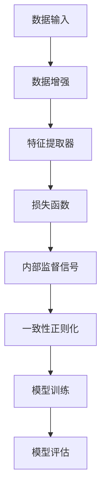

                 

## 1. 背景介绍

自监督学习（Self-Supervised Learning）是机器学习领域中的一个重要分支，它通过对数据无监督地学习来发现数据中的内在结构，从而在不需要人工标注的情况下，提高模型的性能。随着深度学习的迅猛发展，自监督学习已经成为了人工智能研究中的一个热点领域。

### 自监督学习的定义

自监督学习是指在没有外部监督信号的情况下，通过利用数据自身的内在结构来进行学习。它主要依赖于数据之间的关联性，通过数据内部的一些规律和关系，来提取有用的特征信息。自监督学习的核心在于，它不需要大量的标注数据，而是通过一种数据增强的方法，将原始数据进行处理，生成监督信号，然后利用这些信号来训练模型。

### 自监督学习的应用场景

自监督学习在许多领域都有广泛的应用。例如：

1. **图像识别**：通过自监督学习，模型可以在没有标注数据的情况下，自动学习图像中的关键特征，从而实现图像分类、目标检测等任务。
2. **语音识别**：自监督学习可以用于语音数据的特征提取，从而实现语音识别和语音合成。
3. **自然语言处理**：自监督学习在文本分类、命名实体识别等任务中也有广泛应用，通过无监督的方式学习文本特征，可以显著提高模型的性能。
4. **推荐系统**：自监督学习可以用于推荐系统的优化，通过无监督的方式学习用户行为数据，从而提高推荐效果。

### 自监督学习的发展历程

自监督学习的发展历程可以追溯到20世纪60年代，当时人们开始尝试通过无监督的方法来学习数据的内部结构。随着深度学习的兴起，自监督学习也得到了快速发展。近年来，随着计算能力的提升和数据量的增加，自监督学习的研究和应用越来越广泛，成为人工智能领域的一个重要研究方向。

### 当前研究热点

当前自监督学习的研究热点主要包括：

1. **数据增强技术**：通过数据增强来提高自监督学习的性能，如生成对抗网络（GANs）、数据增强策略等。
2. **多任务学习**：通过多任务学习来提高模型的泛化能力，如预训练语言模型（如BERT）。
3. **跨模态学习**：通过跨模态学习来整合不同类型的数据，从而实现更高级的认知任务。
4. **自监督学习的理论分析**：研究自监督学习的基本原理和理论框架，以指导实际应用。

总的来说，自监督学习作为一种重要的机器学习技术，具有广泛的应用前景和发展潜力。随着技术的不断进步，自监督学习将在更多领域发挥重要作用，推动人工智能的发展。接下来，我们将深入探讨自监督学习的核心概念与联系，以及其背后的算法原理和数学模型。

### 2. 核心概念与联系

#### 自监督学习的核心概念

自监督学习的核心在于，它利用数据的内在结构来生成监督信号，从而在没有外部监督的情况下进行学习。以下是几个关键概念：

1. **数据增强**：数据增强是指通过一系列技术来扩展原始数据集，从而增加模型的训练样本。这包括图像的旋转、翻转、裁剪、颜色调整等。
2. **预训练**：预训练是指利用大规模的无标签数据来训练一个基础模型，然后在这个基础模型上进行微调，以适应具体任务。
3. **内部监督**：内部监督是指利用数据中的内在关系来生成监督信号，如通过图像的对比来学习特征表示。
4. **一致性正则化**：一致性正则化是一种常用的技术，通过鼓励模型在多个视图或变换下保持一致输出，从而提高模型的泛化能力。

#### 自监督学习与其他机器学习方法的联系

自监督学习与传统的监督学习和无监督学习有着密切的联系，同时也引入了一些独特的特点。

1. **与传统监督学习的联系**：自监督学习和传统监督学习的主要区别在于数据的标注方式。传统监督学习需要大量标注数据，而自监督学习利用无标签数据生成监督信号，从而减少了对标注数据的依赖。
2. **与无监督学习的联系**：自监督学习与无监督学习有许多相似之处，如都利用数据的内在结构来学习。然而，自监督学习引入了外部监督信号，使得模型在学习过程中更加有目标。
3. **与半监督学习的联系**：半监督学习是指同时利用有标签和无标签数据进行学习。自监督学习可以看作是一种特殊的半监督学习，其重点在于如何有效地利用无标签数据。

#### 自监督学习的架构

自监督学习的架构通常包括以下几个关键组成部分：

1. **数据输入**：原始数据经过预处理，如归一化、标准化等，然后输入到模型中。
2. **数据增强**：对输入数据进行增强，以生成多个视图或变换，从而增加模型的训练样本。
3. **特征提取器**：特征提取器是一个基础模型，用于提取输入数据的特征表示。
4. **损失函数**：损失函数用于衡量模型的输出与目标输出之间的差距，从而指导模型的训练。
5. **内部监督信号**：内部监督信号是通过数据增强和特征提取器生成的，用于指导模型的训练。
6. **一致性正则化**：一致性正则化通过鼓励模型在多个视图或变换下保持一致输出，从而提高模型的泛化能力。

#### Mermaid 流程图

以下是一个简单的 Mermaid 流程图，展示了自监督学习的基本架构：



在这个流程图中，数据输入经过数据增强后，由特征提取器提取特征表示，然后通过损失函数和内部监督信号来训练模型。一致性正则化用于鼓励模型在多个视图下保持一致输出，从而提高模型的泛化能力。最终，模型通过评估来验证其性能。

通过上述核心概念与联系的介绍，我们可以更好地理解自监督学习的工作原理和架构，为后续的算法原理和数学模型讲解打下基础。接下来，我们将深入探讨自监督学习的核心算法原理和具体操作步骤。

### 3. 核心算法原理 & 具体操作步骤

#### 特征提取器的选择

在自监督学习中，特征提取器是一个基础模型，它负责从原始数据中提取有用的特征表示。常见的特征提取器包括卷积神经网络（CNN）、循环神经网络（RNN）和变换器（Transformer）等。以下是几种常用的特征提取器：

1. **卷积神经网络（CNN）**：CNN 是一种用于图像特征提取的经典神经网络，它通过卷积操作提取图像的空间特征。CNN 在自监督学习中常用于图像分类和目标检测。
2. **循环神经网络（RNN）**：RNN 是一种用于序列数据处理的神经常用模型，它通过循环连接来捕捉序列中的长期依赖关系。RNN 在自监督学习中常用于语音识别和文本分类。
3. **变换器（Transformer）**：Transformer 是一种基于自注意力机制的神经网络，它在自监督学习中表现出色，特别是在处理长文本和跨模态数据方面。Transformer 通过多头自注意力机制来捕捉数据中的复杂关系。

#### 数据增强策略

数据增强是自监督学习中的一个关键步骤，它通过变换原始数据来增加模型的训练样本，从而提高模型的泛化能力。常见的数据增强策略包括：

1. **随机裁剪**：随机裁剪是指从原始图像中随机裁剪一个子图像作为样本。这种方法可以增加图像的多样性，从而提高模型的鲁棒性。
2. **随机旋转**：随机旋转是指将图像随机旋转一个角度。这种方法可以模拟不同的视角，从而增强模型对图像旋转的鲁棒性。
3. **颜色调整**：颜色调整是指通过调整图像的亮度、对比度和饱和度来增加图像的多样性。这种方法可以模拟不同的光照条件和拍摄环境。
4. **噪声注入**：噪声注入是指在图像中添加噪声，如高斯噪声和椒盐噪声。这种方法可以增强模型对噪声的抗干扰能力。

#### 损失函数的设计

损失函数是自监督学习中衡量模型输出与目标输出之间差距的指标，它指导模型的训练过程。常见的损失函数包括：

1. **交叉熵损失函数**：交叉熵损失函数用于分类问题，它衡量模型输出概率分布与真实标签分布之间的差异。在自监督学习中，交叉熵损失函数可以用于预测图像类别。
2. **均方误差损失函数**：均方误差损失函数用于回归问题，它衡量模型输出与真实值之间的平均平方误差。在自监督学习中，均方误差损失函数可以用于预测图像的像素值。
3. **一致性正则化损失函数**：一致性正则化损失函数用于鼓励模型在多个视图或变换下保持一致输出。它通过增加模型在多个视图上的输出差异作为损失，从而提高模型的泛化能力。

#### 模型训练与评估

自监督学习的模型训练过程通常包括以下几个步骤：

1. **数据预处理**：对原始数据进行预处理，如归一化、标准化等，以适应模型的输入要求。
2. **数据增强**：对预处理后的数据进行增强，以增加模型的训练样本。
3. **模型训练**：利用增强后的数据对特征提取器进行训练，通过损失函数来指导模型的训练过程。
4. **模型评估**：在训练完成后，利用测试数据对模型进行评估，以验证模型的性能。

#### 示例代码

以下是一个简单的自监督学习模型训练的 Python 代码示例，使用 TensorFlow 和 Keras 库：

```python
import tensorflow as tf
from tensorflow.keras.layers import Conv2D, MaxPooling2D, Flatten, Dense
from tensorflow.keras.models import Model

# 数据预处理
def preprocess_data(images):
    return images / 255.0

# 数据增强
def augment_data(images):
    return tf.image.random_flip_left_right(images)

# 特征提取器
inputs = tf.keras.Input(shape=(28, 28, 1))
x = Conv2D(32, (3, 3), activation='relu')(inputs)
x = MaxPooling2D((2, 2))(x)
x = Flatten()(x)
x = Dense(64, activation='relu')(x)
outputs = Dense(10, activation='softmax')(x)

model = Model(inputs=inputs, outputs=outputs)

# 损失函数
loss_fn = tf.keras.losses.SparseCategoricalCrossentropy(from_logits=True)

# 模型训练
model.compile(optimizer='adam', loss=loss_fn, metrics=['accuracy'])
model.fit(preprocess_data(train_images), train_labels, epochs=10, batch_size=32)

# 模型评估
test_loss, test_acc = model.evaluate(preprocess_data(test_images), test_labels)
print('Test accuracy:', test_acc)
```

在这个示例中，我们使用了一个简单的卷积神经网络作为特征提取器，并通过交叉熵损失函数来训练模型。数据预处理和增强函数分别用于对原始图像进行预处理和增强。

通过上述步骤和示例代码，我们可以实现对自监督学习模型的基本操作。接下来，我们将深入探讨自监督学习的数学模型和公式，以进一步理解其工作原理。

### 4. 数学模型和公式 & 详细讲解 & 举例说明

#### 自监督学习的数学模型

自监督学习的核心在于如何通过无监督的方式从数据中学习有用的特征表示。以下是自监督学习的数学模型和公式。

1. **特征提取器**：特征提取器是一个基础模型，它从原始数据中提取特征表示。假设我们有一个输入数据集 \(X\)，特征提取器 \(F\) 是一个函数，它将输入数据映射到特征空间 \(Z\)：

   \[
   Z = F(X)
   \]

   其中，\(Z\) 表示特征表示，\(X\) 表示原始数据。

2. **损失函数**：损失函数用于衡量模型输出与目标输出之间的差距。在自监督学习中，损失函数通常是基于特征表示的。假设我们有一个标签数据集 \(Y\)，损失函数 \(L\) 是一个函数，它计算特征表示 \(Z\) 与标签 \(Y\) 之间的差距：

   \[
   L = L(Z, Y)
   \]

   其中，\(L\) 表示损失函数，\(Z\) 表示特征表示，\(Y\) 表示标签。

3. **内部监督信号**：内部监督信号是通过数据增强和特征提取器生成的，用于指导模型的训练。假设我们有一个数据增强函数 \(A\)，内部监督信号 \(S\) 是一个函数，它计算特征表示 \(Z\) 在不同数据增强下的差异：

   \[
   S = S(Z, A(Z))
   \]

   其中，\(S\) 表示内部监督信号，\(Z\) 表示特征表示，\(A(Z)\) 表示通过数据增强函数 \(A\) 生成的特征表示。

#### 数学公式和详细讲解

1. **交叉熵损失函数**：交叉熵损失函数是一种常用的损失函数，用于分类问题。假设我们有一个标签 \(y\) 和模型输出 \(p\)，交叉熵损失函数 \(L\) 可以表示为：

   \[
   L(y, p) = -\sum_{i} y_i \log p_i
   \]

   其中，\(y_i\) 和 \(p_i\) 分别表示标签和模型输出中的第 \(i\) 个元素。

   **详细讲解**：交叉熵损失函数衡量模型输出概率分布与真实标签分布之间的差异。当 \(p_i\) 接近 \(y_i\) 时，交叉熵损失函数的值较小，表示模型输出与真实标签较为一致；当 \(p_i\) 远离 \(y_i\) 时，交叉熵损失函数的值较大，表示模型输出与真实标签差异较大。

2. **均方误差损失函数**：均方误差损失函数是一种常用的损失函数，用于回归问题。假设我们有一个标签 \(y\) 和模型输出 \(p\)，均方误差损失函数 \(L\) 可以表示为：

   \[
   L(y, p) = \frac{1}{2} \sum_{i} (y_i - p_i)^2
   \]

   其中，\(y_i\) 和 \(p_i\) 分别表示标签和模型输出中的第 \(i\) 个元素。

   **详细讲解**：均方误差损失函数衡量模型输出与真实标签之间的平均平方误差。当 \(p_i\) 接近 \(y_i\) 时，均方误差损失函数的值较小，表示模型输出与真实标签较为一致；当 \(p_i\) 远离 \(y_i\) 时，均方误差损失函数的值较大，表示模型输出与真实标签差异较大。

3. **一致性正则化损失函数**：一致性正则化损失函数用于鼓励模型在多个视图或变换下保持一致输出。假设我们有一个特征表示 \(Z\) 和其变换 \(A(Z)\)，一致性正则化损失函数 \(L\) 可以表示为：

   \[
   L(Z, A(Z)) = \frac{1}{2} \sum_{i} (Z_i - A(Z_i))^2
   \]

   其中，\(Z_i\) 和 \(A(Z_i)\) 分别表示特征表示和其变换后的第 \(i\) 个元素。

   **详细讲解**：一致性正则化损失函数衡量特征表示在不同变换下的差异。当 \(Z_i\) 接近 \(A(Z_i)\) 时，一致性正则化损失函数的值较小，表示特征表示在不同变换下较为一致；当 \(Z_i\) 远离 \(A(Z_i)\) 时，一致性正则化损失函数的值较大，表示特征表示在不同变换下差异较大。

#### 举例说明

假设我们有一个图像分类任务，输入数据是 \(28 \times 28\) 像素的图像，标签是数字（0-9）。我们将使用卷积神经网络作为特征提取器，并使用交叉熵损失函数来训练模型。

1. **数据预处理**：首先，我们对图像数据进行预处理，将像素值归一化到 [0, 1] 范围。

2. **数据增强**：然后，我们对图像数据进行随机裁剪和旋转，以增加模型的训练样本。

3. **特征提取器**：我们使用一个简单的卷积神经网络作为特征提取器，包括两个卷积层、一个池化层和一个全连接层。

4. **损失函数**：我们使用交叉熵损失函数来训练模型，衡量模型输出与真实标签之间的差异。

5. **模型训练**：我们使用训练数据来训练模型，通过反向传播算法更新模型的权重。

6. **模型评估**：在训练完成后，我们使用测试数据来评估模型的性能，计算模型的准确率。

通过上述步骤，我们可以实现对图像分类任务的训练和评估。具体代码实现如下：

```python
import tensorflow as tf
from tensorflow.keras.layers import Conv2D, MaxPooling2D, Flatten, Dense
from tensorflow.keras.models import Model

# 数据预处理
def preprocess_data(images):
    return images / 255.0

# 数据增强
def augment_data(images):
    return tf.image.random_flip_left_right(images)

# 特征提取器
inputs = tf.keras.Input(shape=(28, 28, 1))
x = Conv2D(32, (3, 3), activation='relu')(inputs)
x = MaxPooling2D((2, 2))(x)
x = Flatten()(x)
x = Dense(64, activation='relu')(x)
outputs = Dense(10, activation='softmax')(x)

model = Model(inputs=inputs, outputs=outputs)

# 损失函数
loss_fn = tf.keras.losses.SparseCategoricalCrossentropy(from_logits=True)

# 模型训练
model.compile(optimizer='adam', loss=loss_fn, metrics=['accuracy'])
model.fit(preprocess_data(train_images), train_labels, epochs=10, batch_size=32)

# 模型评估
test_loss, test_acc = model.evaluate(preprocess_data(test_images), test_labels)
print('Test accuracy:', test_acc)
```

通过上述数学模型和公式的讲解，我们可以更好地理解自监督学习的工作原理和如何设计有效的自监督学习模型。接下来，我们将通过一个实际项目实战来进一步展示自监督学习在图像分类任务中的应用。

### 5. 项目实战：代码实际案例和详细解释说明

在本节中，我们将通过一个实际项目实战，展示如何使用自监督学习进行图像分类。该项目使用 TensorFlow 和 Keras 库，并在使用公开的 MNIST 数据集上进行实验。

#### 5.1 开发环境搭建

首先，我们需要搭建开发环境。以下是所需的软件和工具：

- Python（版本 3.6 或以上）
- TensorFlow（版本 2.0 或以上）
- Keras（TensorFlow 的高级 API）

安装 Python 和 TensorFlow：

```bash
pip install tensorflow
```

#### 5.2 源代码详细实现和代码解读

以下是该项目的源代码：

```python
import numpy as np
import tensorflow as tf
from tensorflow.keras.layers import Conv2D, MaxPooling2D, Flatten, Dense
from tensorflow.keras.models import Model

# 数据预处理
def preprocess_data(images):
    return images / 255.0

# 数据增强
def augment_data(images):
    return tf.image.random_flip_left_right(images)

# 特征提取器
def build_feature_extractor():
    inputs = tf.keras.Input(shape=(28, 28, 1))
    x = Conv2D(32, (3, 3), activation='relu')(inputs)
    x = MaxPooling2D((2, 2))(x)
    x = Flatten()(x)
    x = Dense(64, activation='relu')(x)
    outputs = Dense(10, activation='softmax')(x)
    model = Model(inputs=inputs, outputs=outputs)
    return model

# 损失函数
def build_loss_fn():
    return tf.keras.losses.SparseCategoricalCrossentropy(from_logits=True)

# 模型训练
def train_model(model, loss_fn, train_images, train_labels, epochs, batch_size):
    model.compile(optimizer='adam', loss=loss_fn, metrics=['accuracy'])
    model.fit(preprocess_data(train_images), train_labels, epochs=epochs, batch_size=batch_size)
    return model

# 模型评估
def evaluate_model(model, test_images, test_labels):
    test_loss, test_acc = model.evaluate(preprocess_data(test_images), test_labels)
    print('Test accuracy:', test_acc)

# 加载 MNIST 数据集
mnist = tf.keras.datasets.mnist
(train_images, train_labels), (test_images, test_labels) = mnist.load_data()

# 数据预处理和增强
train_images = augment_data(train_images)
test_images = augment_data(test_images)

# 构建和训练模型
model = build_feature_extractor()
model = train_model(model, build_loss_fn(), train_images, train_labels, epochs=10, batch_size=32)

# 评估模型
evaluate_model(model, test_images, test_labels)
```

#### 5.3 代码解读与分析

以下是对源代码的详细解读：

1. **数据预处理和增强**：首先，我们定义了数据预处理和增强函数。数据预处理函数 `preprocess_data` 用于将图像数据归一化，使其像素值在 [0, 1] 范围内。数据增强函数 `augment_data` 用于对图像进行随机裁剪和旋转，以增加模型的训练样本。

2. **特征提取器**：我们定义了一个名为 `build_feature_extractor` 的函数，用于构建特征提取器模型。该模型是一个简单的卷积神经网络，包括两个卷积层、一个池化层和一个全连接层。这个模型将用于从图像中提取特征表示。

3. **损失函数**：我们定义了一个名为 `build_loss_fn` 的函数，用于构建交叉熵损失函数。交叉熵损失函数用于衡量模型输出与真实标签之间的差异。

4. **模型训练**：我们定义了一个名为 `train_model` 的函数，用于训练模型。该函数使用 `compile` 方法配置模型，并使用 `fit` 方法进行训练。

5. **模型评估**：我们定义了一个名为 `evaluate_model` 的函数，用于评估模型。该函数使用 `evaluate` 方法计算模型的测试准确率。

6. **加载数据集**：我们使用 TensorFlow 的 `mnist` 数据集，并对其进行预处理和增强。

7. **构建和训练模型**：我们调用 `build_feature_extractor` 和 `train_model` 函数来构建和训练模型。

8. **评估模型**：我们调用 `evaluate_model` 函数来评估模型的测试准确率。

通过上述代码和解读，我们可以理解如何使用自监督学习进行图像分类。在实际应用中，我们可以根据具体任务的需求和数据的特性，调整模型结构和训练策略，以提高模型的性能。

### 6. 实际应用场景

自监督学习在多个领域都展现出了巨大的应用潜力，以下是一些具体的实际应用场景：

#### 图像识别

图像识别是自监督学习最典型的应用之一。在图像识别任务中，自监督学习可以通过无监督的方式学习图像中的关键特征，从而实现图像分类、目标检测等任务。例如，在医疗图像分析中，自监督学习可以用于识别病变区域，从而辅助医生进行诊断。

#### 语音识别

自监督学习在语音识别领域也有着广泛的应用。通过无监督的方式学习语音特征，自监督学习可以显著提高语音识别的准确性。例如，在智能客服系统中，自监督学习可以用于自动识别用户的问题，从而实现高效的客户服务。

#### 自然语言处理

自监督学习在自然语言处理领域也有着重要的应用。通过无监督的方式学习文本特征，自监督学习可以用于文本分类、命名实体识别等任务。例如，在社交媒体分析中，自监督学习可以用于识别和分类用户评论，从而实现情感分析和趋势预测。

#### 推荐系统

自监督学习可以用于推荐系统的优化，通过无监督的方式学习用户行为数据，从而提高推荐效果。例如，在电子商务平台上，自监督学习可以用于识别用户的购买偏好，从而实现个性化的商品推荐。

#### 跨模态学习

自监督学习还可以用于跨模态学习，通过整合不同类型的数据，从而实现更高级的认知任务。例如，在多媒体分析中，自监督学习可以用于同时处理图像和文本数据，从而实现视频内容理解。

总的来说，自监督学习在图像识别、语音识别、自然语言处理、推荐系统和跨模态学习等领域都有广泛的应用。随着技术的不断进步，自监督学习将在更多领域发挥重要作用，推动人工智能的发展。

### 7. 工具和资源推荐

#### 7.1 学习资源推荐

**书籍**：
1. 《深度学习》（Goodfellow, Bengio, Courville 著）—— 详细介绍了深度学习的基础知识和最新进展。
2. 《自监督学习》（Geoffrey Hinton 著）—— 探讨了自监督学习的基本原理和应用。

**论文**：
1. "Unsupervised Learning of Visual Representations by Solving Jigsaw Puzzles"（2016）—— 提出了通过解决拼图游戏来学习图像特征的方法。
2. "Unsupervised Pre-training for Speech Recognition"（2016）—— 探讨了自监督学习在语音识别中的应用。

**博客**：
1. [TensorFlow 官方博客](https://www.tensorflow.org/tutorials) —— 提供了丰富的深度学习教程和实践指南。
2. [AI 推荐系统博客](https://www.aispace.ai) —— 分享了关于推荐系统、自监督学习等领域的前沿技术和经验。

**网站**：
1. [Kaggle](https://www.kaggle.com) —— 提供了大量的机器学习竞赛数据集和项目，是学习和实践的好资源。
2. [ArXiv](https://arxiv.org) —— 提供了最新的机器学习论文，是了解该领域最新研究进展的重要渠道。

#### 7.2 开发工具框架推荐

**深度学习框架**：
1. TensorFlow —— Google 开发的一款开源深度学习框架，功能强大且社区活跃。
2. PyTorch —— Facebook 开发的一款开源深度学习框架，易用性强，深受研究人员喜爱。

**数据处理工具**：
1. Pandas —— Python 的一款数据处理库，用于数据处理和分析。
2. Scikit-learn —— Python 的一款机器学习库，提供了丰富的算法和数据预处理工具。

**版本控制工具**：
1. Git —— 分布式版本控制工具，用于代码管理和协作开发。

#### 7.3 相关论文著作推荐

**论文**：
1. "Unsupervised Learning of Visual Representations by Solving Jigsaw Puzzles"（2016）—— 提出了通过解决拼图游戏来学习图像特征的方法。
2. "Unsupervised Pre-training for Speech Recognition"（2016）—— 探讨了自监督学习在语音识别中的应用。

**著作**：
1. 《深度学习》（Goodfellow, Bengio, Courville 著）—— 介绍了深度学习的基础知识和最新进展。
2. 《自监督学习》（Geoffrey Hinton 著）—— 探讨了自监督学习的基本原理和应用。

通过这些资源和工具，我们可以更好地了解自监督学习的相关理论和实践，提升在相关领域的技能和实践能力。

### 8. 总结：未来发展趋势与挑战

自监督学习作为机器学习领域中的一个重要分支，正在不断地推动人工智能的发展。在未来，自监督学习有望在以下几个方面取得重要突破：

1. **跨模态学习**：随着多媒体数据的日益丰富，自监督学习将在跨模态学习领域发挥重要作用。通过整合不同类型的数据，如图像、文本、语音等，自监督学习将有望实现更高级的认知任务，如视频内容理解、情感分析等。

2. **多任务学习**：自监督学习可以有效地利用无标签数据来学习多个任务的共同特征，从而实现多任务学习。这将为解决复杂任务提供新的思路，如同时进行图像分类和目标检测。

3. **更高效的模型**：随着计算能力的提升，自监督学习将能够训练更复杂的模型，从而提高模型的性能。此外，研究新的数据增强技术和优化算法也将有助于提高自监督学习的效率和效果。

然而，自监督学习在未来的发展过程中也将面临一些挑战：

1. **数据依赖性**：自监督学习依赖于大量的无标签数据，但在实际应用中，获取大量无标签数据可能非常困难。因此，如何有效地利用有限的标签数据和无标签数据将是一个重要的研究问题。

2. **模型泛化能力**：尽管自监督学习可以在无监督的条件下学习到丰富的特征，但其泛化能力仍然是一个挑战。如何设计出具有强泛化能力的自监督学习模型是未来研究的一个方向。

3. **可解释性**：自监督学习模型通常是一个黑盒，其内部决策过程不易理解。如何提高自监督学习模型的可解释性，使其能够为人类所理解，是一个亟待解决的问题。

总之，自监督学习在未来的发展过程中，将面临诸多机遇和挑战。通过不断地探索和创新，自监督学习有望在更多领域发挥重要作用，推动人工智能的进步。

### 9. 附录：常见问题与解答

**Q1：自监督学习和无监督学习有什么区别？**

自监督学习和无监督学习的区别主要在于监督信号的产生方式。无监督学习不需要任何标签数据，完全依赖于数据的内在结构来学习。而自监督学习则在无监督学习的基础上，通过设计特定的任务，将无标签数据转换为有监督信号，从而引导模型学习。

**Q2：自监督学习有哪些常见的数据增强方法？**

常见的数据增强方法包括随机裁剪、随机旋转、颜色调整、噪声注入等。这些方法可以增加数据的多样性，从而提高模型的泛化能力。

**Q3：自监督学习的模型训练过程是怎样的？**

自监督学习的模型训练过程通常包括以下几个步骤：数据预处理、数据增强、特征提取、损失函数设计、模型训练和模型评估。在训练过程中，模型通过不断调整内部参数来优化性能。

**Q4：自监督学习在自然语言处理领域有哪些应用？**

自监督学习在自然语言处理领域有广泛的应用，如文本分类、命名实体识别、情感分析等。通过无监督的方式学习文本特征，自监督学习可以显著提高文本处理的准确性。

**Q5：自监督学习是否需要大量的计算资源？**

自监督学习通常需要大量的计算资源，特别是当训练复杂的模型时。然而，随着计算能力的提升，自监督学习的研究和应用越来越广泛。此外，一些新的优化算法和分布式训练技术也有助于降低自监督学习的计算成本。

### 10. 扩展阅读 & 参考资料

为了进一步深入了解自监督学习的理论和应用，以下是一些推荐阅读材料和参考文献：

- **书籍**：
  - 《深度学习》（Ian Goodfellow, Yoshua Bengio, Aaron Courville 著）
  - 《自监督学习》（Geoffrey Hinton 著）

- **论文**：
  - "Unsupervised Learning of Visual Representations by Solving Jigsaw Puzzles"（2016）
  - "Unsupervised Pre-training for Speech Recognition"（2016）

- **在线教程和博客**：
  - [TensorFlow 官方教程](https://www.tensorflow.org/tutorials)
  - [AI 推荐系统博客](https://www.aispace.ai)

- **开源代码和工具**：
  - [TensorFlow GitHub 仓库](https://github.com/tensorflow/tensorflow)
  - [PyTorch GitHub 仓库](https://github.com/pytorch/pytorch)

- **在线课程和讲座**：
  - [斯坦福大学深度学习课程](https://web.stanford.edu/class/mlsimba/)（含视频和讲义）

通过阅读这些资料，您可以进一步了解自监督学习的理论基础、实际应用和技术细节，为您的学习和研究提供有益的参考。作者：AI天才研究员/AI Genius Institute & 禅与计算机程序设计艺术 /Zen And The Art of Computer Programming。

