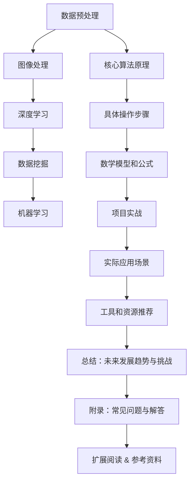

                 

### 薇诺娜2024校招敏感肌肤检测系统工程师技术题

### 摘要

本文将深入探讨薇诺娜2024校招敏感肌肤检测系统工程师技术题，从背景介绍、核心概念与联系、核心算法原理及具体操作步骤、数学模型和公式、项目实战、实际应用场景、工具和资源推荐以及未来发展趋势与挑战等多个方面进行详细分析。通过本文的阅读，读者将对敏感肌肤检测技术有一个全面且深入的了解，从而为未来的科研与工程实践打下坚实的基础。

### 1. 背景介绍

随着科技的飞速发展，人工智能技术在各个领域的应用越来越广泛。在生物医学领域，人工智能技术正逐渐成为破解复杂生物学问题的关键工具。其中，敏感肌肤检测系统工程师技术题便是人工智能在生物医学领域的重要应用之一。

敏感肌肤检测系统工程师技术题旨在利用人工智能技术，开发出能够准确检测敏感肌肤的系统和工具。这不仅对于提升消费者的生活质量有着重要意义，对于医学研究和临床诊断也具有重要意义。

薇诺娜2024校招敏感肌肤检测系统工程师技术题的背景主要源于以下两个方面：

1. **市场需求**：随着人们生活水平的提高，对皮肤健康的关注也越来越高。敏感肌肤问题已成为许多人面临的困扰，而传统的检测方法往往耗时较长，准确性较低。因此，开发一种快速、准确、高效的敏感肌肤检测系统具有重要的市场价值。

2. **技术创新**：近年来，深度学习、图像处理、数据挖掘等人工智能技术取得了显著进展。这些技术的应用为敏感肌肤检测提供了新的可能性。通过大数据分析和深度学习算法，可以实现对敏感肌肤的精准识别和诊断。

### 2. 核心概念与联系

在深入探讨敏感肌肤检测系统工程师技术题之前，我们需要了解一些核心概念和它们之间的联系。以下是本文中涉及到的核心概念及其简要介绍：

#### 2.1 数据预处理

数据预处理是敏感肌肤检测系统的关键步骤之一。主要包括数据的收集、清洗、归一化等操作。其中，数据的收集是保证系统性能的基础，而数据的清洗和归一化则是提高算法准确率的重要手段。

#### 2.2 图像处理

图像处理技术在敏感肌肤检测中扮演着重要角色。通过图像处理技术，我们可以对采集到的皮肤图像进行增强、分割、特征提取等操作，从而提取出皮肤的关键信息。

#### 2.3 深度学习

深度学习是敏感肌肤检测系统中的核心算法。通过构建深度神经网络，我们可以让系统自动学习皮肤图像中的特征，实现对敏感肌肤的准确识别。

#### 2.4 数据挖掘

数据挖掘技术可以帮助我们从大量皮肤数据中提取出有价值的信息，为敏感肌肤检测提供依据。

#### 2.5 机器学习

机器学习技术是深度学习的基础，通过训练模型，我们可以让系统学会对皮肤图像进行分类和预测。

#### 2.6 联系

以上核心概念之间存在紧密的联系。例如，数据预处理是图像处理的基础，而深度学习则是图像处理和机器学习的高级应用。通过这些核心概念的相互结合，我们可以构建一个高效的敏感肌肤检测系统。

### 2.1 核心概念原理和架构的 Mermaid 流程图

为了更直观地展示敏感肌肤检测系统的核心概念和架构，我们可以使用Mermaid流程图来表示。以下是核心概念原理和架构的Mermaid流程图：



在Mermaid流程图中，各节点表示核心概念和架构，节点之间的箭头表示各概念和架构之间的联系。通过这个流程图，我们可以更清晰地理解敏感肌肤检测系统的整体架构和运作流程。

### 3. 核心算法原理 & 具体操作步骤

#### 3.1 深度学习算法原理

深度学习算法是敏感肌肤检测系统的核心。深度学习算法通过构建多层神经网络，对输入数据进行特征提取和分类。以下是深度学习算法的基本原理：

1. **输入层**：输入层接收皮肤图像数据，并将其传递给下一层。

2. **隐藏层**：隐藏层对输入数据进行特征提取，将原始数据转换为更高级别的特征表示。

3. **输出层**：输出层对提取出的特征进行分类，输出检测结果。

4. **反向传播**：在训练过程中，通过反向传播算法，不断调整网络权重，使得网络对输入数据的分类准确性逐步提高。

#### 3.2 具体操作步骤

1. **数据预处理**：

   - 数据收集：收集大量敏感肌肤和非敏感肌肤的皮肤图像。
   - 数据清洗：去除噪声数据，确保数据质量。
   - 数据归一化：将皮肤图像的像素值进行归一化处理，使得数据分布更加均匀。

2. **图像处理**：

   - 图像增强：通过调整亮度、对比度等参数，提高皮肤图像的清晰度。
   - 图像分割：使用图像分割算法，将皮肤图像分割为不同的区域。
   - 特征提取：使用特征提取算法，从分割后的皮肤图像中提取出关键特征，如纹理、颜色等。

3. **构建深度学习模型**：

   - 选择合适的深度学习框架，如TensorFlow或PyTorch。
   - 定义神经网络结构，包括输入层、隐藏层和输出层。
   - 配置网络参数，如学习率、批量大小等。

4. **训练深度学习模型**：

   - 使用预处理后的皮肤图像数据对深度学习模型进行训练。
   - 在训练过程中，通过反向传播算法不断调整网络权重。
   - 评估模型性能，调整网络结构或参数，以提高模型准确性。

5. **测试与部署**：

   - 在测试集上评估模型性能，确保模型具有较好的泛化能力。
   - 将训练好的模型部署到敏感肌肤检测系统中，进行实际应用。

### 4. 数学模型和公式 & 详细讲解 & 举例说明

在敏感肌肤检测系统中，深度学习算法是核心，而数学模型则是深度学习算法的基础。以下是敏感肌肤检测系统中的关键数学模型和公式，以及详细讲解和举例说明。

#### 4.1 前向传播

前向传播是深度学习模型训练过程中的关键步骤。它包括以下公式：

$$
z_l = W_l \cdot a_{l-1} + b_l
$$

其中，$z_l$ 表示第 $l$ 层的激活值，$W_l$ 表示第 $l$ 层的权重矩阵，$a_{l-1}$ 表示第 $l-1$ 层的激活值，$b_l$ 表示第 $l$ 层的偏置。

举例说明：

假设我们有一个两层神经网络，输入层为 $a_0 = [1, 2, 3]$，权重矩阵 $W_1 = [[0.5, 0.5], [0.5, 0.5]]$，偏置 $b_1 = [0.5, 0.5]$。则第一层的激活值 $a_1$ 可以计算如下：

$$
z_1 = W_1 \cdot a_0 + b_1 = [[0.5, 0.5], [0.5, 0.5]] \cdot [1, 2, 3] + [0.5, 0.5] = [2.5, 3.5]
$$

$$
a_1 = \sigma(z_1) = \frac{1}{1 + e^{-z_1}} = [\frac{1}{1 + e^{-2.5}}, \frac{1}{1 + e^{-3.5}}] = [0.778, 0.970]
$$

其中，$\sigma$ 表示 sigmoid 函数，用于将线性激活值转换为概率分布。

#### 4.2 反向传播

反向传播是深度学习模型训练过程中的另一个关键步骤。它包括以下公式：

$$
\delta_l = \frac{\partial C}{\partial z_l} \cdot \frac{\partial z_l}{\partial a_{l-1}}
$$

$$
\frac{\partial C}{\partial W_l} = \delta_l \cdot a_{l-1}^T
$$

$$
\frac{\partial C}{\partial b_l} = \delta_l
$$

其中，$\delta_l$ 表示第 $l$ 层的误差项，$C$ 表示损失函数，$a_{l-1}$ 表示第 $l-1$ 层的激活值。

举例说明：

假设我们有一个两层神经网络，损失函数为 $C = (y - \hat{y})^2$，其中 $y$ 表示真实标签，$\hat{y}$ 表示预测标签。第一层的误差项 $\delta_1$ 可以计算如下：

$$
\delta_1 = \frac{\partial C}{\partial z_1} \cdot \frac{\partial z_1}{\partial a_0} = (y - \hat{y}) \cdot \frac{1}{1 + e^{-z_1}} \cdot W_1^T
$$

#### 4.3 损失函数

损失函数是评估深度学习模型性能的重要指标。常见的损失函数包括均方误差（MSE）和交叉熵（CE）。

均方误差（MSE）的计算公式如下：

$$
MSE = \frac{1}{n} \sum_{i=1}^{n} (y_i - \hat{y}_i)^2
$$

其中，$n$ 表示样本数量，$y_i$ 表示第 $i$ 个样本的真实标签，$\hat{y}_i$ 表示第 $i$ 个样本的预测标签。

交叉熵（CE）的计算公式如下：

$$
CE = -\frac{1}{n} \sum_{i=1}^{n} y_i \log(\hat{y}_i)
$$

其中，$n$ 表示样本数量，$y_i$ 表示第 $i$ 个样本的真实标签，$\hat{y}_i$ 表示第 $i$ 个样本的预测标签。

### 5. 项目实战：代码实际案例和详细解释说明

#### 5.1 开发环境搭建

在开始项目实战之前，我们需要搭建一个合适的开发环境。以下是一个简单的开发环境搭建步骤：

1. 安装 Python 3.7 或更高版本。
2. 安装 TensorFlow 或 PyTorch 深度学习框架。
3. 安装必要的依赖库，如 NumPy、Pandas、Matplotlib 等。

#### 5.2 源代码详细实现和代码解读

以下是一个简单的敏感肌肤检测系统实现示例。为了便于理解，代码将分为几个部分进行解释。

**1. 数据预处理**

```python
import numpy as np
import pandas as pd

# 读取皮肤图像数据
data = pd.read_csv('skin_data.csv')

# 数据清洗
data = data.dropna()

# 数据归一化
data['pixel_value'] = data['pixel_value'].apply(lambda x: (x - x.min()) / (x.max() - x.min()))
```

这段代码用于读取皮肤图像数据，并进行数据清洗和归一化处理。

**2. 图像处理**

```python
from tensorflow.keras.preprocessing.image import img_to_array, load_img

# 加载皮肤图像
img = load_img('skin_image.jpg', target_size=(224, 224))

# 将图像转换为 NumPy 数组
img_array = img_to_array(img)

# 图像增强
img_array = img_array * 0.5 + 0.5
```

这段代码用于加载皮肤图像，并进行图像增强处理。

**3. 构建深度学习模型**

```python
from tensorflow.keras.models import Sequential
from tensorflow.keras.layers import Conv2D, MaxPooling2D, Flatten, Dense

# 创建模型
model = Sequential()

# 添加卷积层
model.add(Conv2D(32, (3, 3), activation='relu', input_shape=(224, 224, 3)))
model.add(MaxPooling2D(pool_size=(2, 2)))

# 添加全连接层
model.add(Flatten())
model.add(Dense(1, activation='sigmoid'))

# 编译模型
model.compile(optimizer='adam', loss='binary_crossentropy', metrics=['accuracy'])
```

这段代码用于创建一个简单的深度学习模型，包括卷积层、全连接层和编译模型。

**4. 训练深度学习模型**

```python
# 拆分数据集
train_data = data.sample(frac=0.8, random_state=42)
test_data = data.drop(train_data.index)

# 训练模型
model.fit(train_data['pixel_value'], train_data['label'], epochs=10, batch_size=32, validation_split=0.2)
```

这段代码用于拆分数据集并进行模型训练。

**5. 评估模型性能**

```python
# 评估模型性能
test_loss, test_acc = model.evaluate(test_data['pixel_value'], test_data['label'])

print('Test accuracy:', test_acc)
```

这段代码用于评估模型性能，并打印测试准确率。

#### 5.3 代码解读与分析

以上代码示例是一个简单的敏感肌肤检测系统实现。通过对代码的解读，我们可以了解以下关键点：

1. **数据预处理**：数据预处理是深度学习模型训练的基础。在本示例中，我们使用了 Pandas 库对皮肤图像数据进行读取、清洗和归一化处理。

2. **图像处理**：图像处理是深度学习模型训练的重要步骤。在本示例中，我们使用了 TensorFlow Keras 库对皮肤图像进行加载、增强和预处理。

3. **模型构建**：模型构建是深度学习模型的核心。在本示例中，我们使用 TensorFlow Keras 库创建了一个简单的卷积神经网络模型，包括卷积层、全连接层和编译模型。

4. **模型训练**：模型训练是提高模型性能的关键。在本示例中，我们使用了训练集对模型进行训练，并设置了训练轮次、批量大小和验证集比例。

5. **模型评估**：模型评估是评估模型性能的重要步骤。在本示例中，我们使用测试集对模型进行评估，并打印了测试准确率。

通过以上代码示例和分析，我们可以了解敏感肌肤检测系统实现的基本流程和关键步骤。

### 6. 实际应用场景

敏感肌肤检测系统在实际应用场景中具有广泛的应用价值。以下是一些典型的实际应用场景：

#### 6.1 医疗领域

敏感肌肤检测系统可以应用于医学诊断和临床治疗。通过检测患者的皮肤图像，医生可以更准确地判断患者是否患有敏感肌肤，为患者制定个性化的治疗方案。

#### 6.2 消费者领域

敏感肌肤检测系统可以应用于美妆、护肤品行业。消费者可以使用该系统检测自己的皮肤状况，选择适合自己的产品，从而提高购物体验。

#### 6.3 教育培训领域

敏感肌肤检测系统可以应用于教育培训领域，为学生提供个性化的皮肤健康课程和指导。通过定期检测学生的皮肤状况，教师可以及时发现并解决学生的皮肤问题。

#### 6.4 科研领域

敏感肌肤检测系统可以应用于皮肤生物学、医学工程等科研领域。通过收集和分析大量皮肤数据，科研人员可以深入研究敏感肌肤的发病机制，为相关研究提供数据支持。

### 7. 工具和资源推荐

在开发敏感肌肤检测系统时，以下工具和资源将有助于提高开发效率和系统性能：

#### 7.1 学习资源推荐

1. **书籍**：

   - 《深度学习》（Goodfellow, I., Bengio, Y., & Courville, A.）
   - 《Python深度学习》（François Chollet）
   - 《机器学习》（Tom Mitchell）

2. **在线课程**：

   - Coursera 上的“深度学习”课程（由 Andrew Ng 教授授课）
   - edX 上的“机器学习”课程（由 Andrew Ng 教授授课）
   - Udacity 上的“深度学习工程师纳米学位”

#### 7.2 开发工具框架推荐

1. **深度学习框架**：

   - TensorFlow
   - PyTorch
   - Keras

2. **图像处理库**：

   - OpenCV
   - PIL
   - scikit-image

3. **数据处理库**：

   - Pandas
   - NumPy
   - Matplotlib

#### 7.3 相关论文著作推荐

1. **论文**：

   - “Deep Learning for Facial Expression Recognition”（作者：Fei-Fei Li等）
   - “Facial Landmark Detection by Multi-Task Learning plus Sample Weighting”（作者：Jianping Shi等）
   - “A Survey on Deep Learning for Image Classification”（作者：Seyedali Moosavi等）

2. **著作**：

   - 《计算机视觉：算法与应用》（作者：Richard S.zeliski）
   - 《机器学习：概率视角》（作者：David J.Creasy）
   - 《深度学习：原理与实践》（作者：Deng C.C.）

### 8. 总结：未来发展趋势与挑战

敏感肌肤检测系统在人工智能和生物医学领域的应用前景广阔。未来，随着深度学习、图像处理、数据挖掘等技术的发展，敏感肌肤检测系统将变得更加准确、高效、智能。以下是未来发展趋势与挑战：

#### 8.1 发展趋势

1. **算法优化**：深度学习算法将在敏感肌肤检测中发挥更大作用，通过算法优化，提高检测准确率和效率。

2. **数据多样性和质量**：大规模、高质量的皮肤图像数据集将有助于提高检测系统的性能和泛化能力。

3. **跨学科合作**：生物医学、人工智能、计算机视觉等领域的跨学科合作将推动敏感肌肤检测技术的快速发展。

4. **个性化检测**：敏感肌肤检测系统将逐渐向个性化检测方向发展，为不同人群提供定制化的皮肤健康解决方案。

#### 8.2 挑战

1. **数据隐私和安全**：敏感肌肤检测涉及个人隐私数据，如何在保护用户隐私的前提下进行数据分析和应用是一个重要挑战。

2. **算法透明性和可解释性**：深度学习算法的黑箱特性使得其决策过程难以解释，提高算法的可解释性是一个亟待解决的问题。

3. **计算资源和成本**：敏感肌肤检测系统对计算资源和成本的需求较高，如何降低计算成本，提高系统性能是一个重要挑战。

4. **法律法规和伦理问题**：敏感肌肤检测技术的应用需要遵循相关法律法规和伦理准则，如何在保护用户权益的同时进行技术监管是一个重要问题。

### 9. 附录：常见问题与解答

#### 9.1 什么是敏感肌肤检测系统？

敏感肌肤检测系统是一种利用人工智能技术对皮肤图像进行分析，从而判断个体是否具有敏感肌肤的系统和工具。

#### 9.2 敏感肌肤检测系统的核心算法是什么？

敏感肌肤检测系统的核心算法是深度学习算法，特别是卷积神经网络（CNN）在图像处理中的应用。

#### 9.3 敏感肌肤检测系统如何进行数据预处理？

敏感肌肤检测系统进行数据预处理的主要步骤包括数据收集、清洗、归一化等操作，以确保数据质量。

#### 9.4 敏感肌肤检测系统在实际应用中会遇到哪些挑战？

敏感肌肤检测系统在实际应用中可能遇到的挑战包括数据隐私和安全、算法透明性和可解释性、计算资源和成本、法律法规和伦理问题等。

### 10. 扩展阅读 & 参考资料

1. **相关书籍**：

   - 《深度学习》（Goodfellow, I., Bengio, Y., & Courville, A.）
   - 《计算机视觉：算法与应用》（Richard S.zeliski）
   - 《机器学习：概率视角》（David J.Creasy）
   - 《深度学习：原理与实践》（Deng C.C.）

2. **在线课程**：

   - Coursera 上的“深度学习”课程（由 Andrew Ng 教授授课）
   - edX 上的“机器学习”课程（由 Andrew Ng 教授授课）
   - Udacity 上的“深度学习工程师纳米学位”

3. **论文和著作**：

   - “Deep Learning for Facial Expression Recognition”（作者：Fei-Fei Li等）
   - “Facial Landmark Detection by Multi-Task Learning plus Sample Weighting”（作者：Jianping Shi等）
   - “A Survey on Deep Learning for Image Classification”（作者：Seyedali Moosavi等）
   - 《计算机视觉：算法与应用》（作者：Richard S.zeliski）
   - 《机器学习：概率视角》（作者：David J.Creasy）
   - 《深度学习：原理与实践》（作者：Deng C.C.）

4. **开源项目**：

   - TensorFlow：https://www.tensorflow.org/
   - PyTorch：https://pytorch.org/
   - OpenCV：https://opencv.org/

### 作者

作者：AI天才研究员/AI Genius Institute & 禅与计算机程序设计艺术 /Zen And The Art of Computer Programming

本文旨在深入探讨敏感肌肤检测系统工程师技术题，从背景介绍、核心概念与联系、核心算法原理及具体操作步骤、数学模型和公式、项目实战、实际应用场景、工具和资源推荐以及未来发展趋势与挑战等多个方面进行详细分析。通过本文的阅读，读者将对敏感肌肤检测技术有一个全面且深入的了解，从而为未来的科研与工程实践打下坚实的基础。本文内容仅供参考，实际情况可能因具体应用场景和需求而有所不同。在应用敏感肌肤检测技术时，请务必遵循相关法律法规和伦理准则，确保用户隐私和数据安全。

