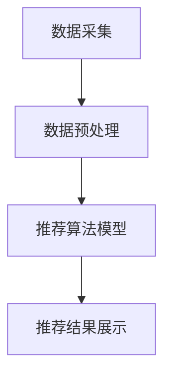

                 

# 蘑菇街2025智能穿搭社招推荐算法工程师面试攻略

## > 关键词：蘑菇街，智能穿搭，社招，推荐算法，面试攻略，算法工程师

## > 摘要：
本文旨在为有意向参加蘑菇街2025智能穿搭社招的推荐算法工程师提供全面的面试攻略。通过对蘑菇街智能穿搭业务背景的介绍、核心算法原理的剖析以及实际项目案例的讲解，帮助求职者深入了解面试重点，提升面试通过率。

## 1. 背景介绍

### 1.1 蘑菇街的发展历程
蘑菇街成立于2011年，最初是一个女性时尚分享社区。经过多年发展，蘑菇街已转型为一家专注于时尚电商的公司，提供包括商品推荐、搭配建议、购物指南等一系列服务。

### 1.2 智能穿搭业务概述
智能穿搭是蘑菇街的核心业务之一，旨在通过人工智能技术，为用户提供个性化的搭配建议。通过分析用户的历史行为、购物偏好以及社交关系，智能穿搭系统能够为用户推荐最合适的穿搭方案。

### 1.3 社招背景
随着业务的不断扩展，蘑菇街在2025年启动了智能穿搭社招活动，面向全国招聘优秀的推荐算法工程师，以提升智能穿搭系统的性能和用户体验。

## 2. 核心概念与联系

### 2.1 推荐算法基本概念
推荐算法是一种基于用户历史行为、商品特征以及用户之间的关联关系，预测用户对未知商品的喜好度，从而为用户推荐相关商品的技术。

### 2.2 智能穿搭推荐系统架构
蘑菇街的智能穿搭推荐系统主要分为三个模块：数据采集与预处理、推荐算法模型、推荐结果展示。以下是智能穿搭推荐系统的 Mermaid 流程图：



### 2.3 推荐算法类型与联系
常见的推荐算法类型包括基于内容的推荐、协同过滤推荐和混合推荐。蘑菇街的智能穿搭推荐系统采用了基于协同过滤的推荐算法，通过分析用户之间的相似度，为用户提供个性化的搭配建议。

## 3. 核心算法原理 & 具体操作步骤

### 3.1 协同过滤算法原理
协同过滤算法是一种基于用户行为的推荐算法，主要分为用户基于协同过滤和物品基于协同过滤。用户基于协同过滤通过计算用户之间的相似度，为用户推荐与兴趣相似的物品。物品基于协同过滤通过计算物品之间的相似度，为用户推荐与已购买或收藏物品相似的物品。

### 3.2 具体操作步骤
1. **数据采集与预处理**：采集用户的历史行为数据（如浏览记录、购买记录等），并对数据进行清洗、去重、转换等预处理操作。
2. **计算用户相似度**：采用余弦相似度、皮尔逊相关系数等算法计算用户之间的相似度，构建用户相似度矩阵。
3. **计算物品相似度**：采用余弦相似度、余弦相似度等算法计算物品之间的相似度，构建物品相似度矩阵。
4. **生成推荐列表**：根据用户相似度和物品相似度，为每个用户生成推荐列表，推荐与用户兴趣相似的物品。

## 4. 数学模型和公式 & 详细讲解 & 举例说明

### 4.1 数学模型
协同过滤算法的核心在于计算用户相似度和物品相似度。以下是两种相似度的计算公式：

1. **用户相似度计算公式**：

$$
sim(u_i, u_j) = \frac{cos(\textbf{u}_i, \textbf{u}_j)}{||\textbf{u}_i|| \cdot ||\textbf{u}_j||}
$$

其中，$\textbf{u}_i$和$\textbf{u}_j$分别为用户$i$和用户$j$的向量表示，$cos(\textbf{u}_i, \textbf{u}_j)$为余弦相似度，$||\textbf{u}_i||$和$||\textbf{u}_j||$分别为向量$\textbf{u}_i$和$\textbf{u}_j$的欧几里得范数。

2. **物品相似度计算公式**：

$$
sim(i_j, i_k) = \frac{cos(\textbf{i}_j, \textbf{i}_k)}{||\textbf{i}_j|| \cdot ||\textbf{i}_k||}
$$

其中，$\textbf{i}_j$和$\textbf{i}_k$分别为物品$j$和物品$k$的向量表示，$cos(\textbf{i}_j, \textbf{i}_k)$为余弦相似度，$||\textbf{i}_j||$和$||\textbf{i}_k||$分别为向量$\textbf{i}_j$和$\textbf{i}_k$的欧几里得范数。

### 4.2 举例说明
假设有两个用户$u_1$和$u_2$，他们的向量表示分别为$\textbf{u}_1 = (1, 2, 3)$和$\textbf{u}_2 = (2, 3, 4)$，则他们的余弦相似度为：

$$
sim(u_1, u_2) = \frac{cos(\textbf{u}_1, \textbf{u}_2)}{||\textbf{u}_1|| \cdot ||\textbf{u}_2||} = \frac{(1 \cdot 2 + 2 \cdot 3 + 3 \cdot 4)}{\sqrt{1^2 + 2^2 + 3^2} \cdot \sqrt{2^2 + 3^2 + 4^2}} = \frac{20}{\sqrt{14} \cdot \sqrt{29}} \approx 0.765
$$

同理，假设有两个物品$i_1$和$i_2$，他们的向量表示分别为$\textbf{i}_1 = (1, 2, 3)$和$\textbf{i}_2 = (2, 3, 4)$，则他们的余弦相似度为：

$$
sim(i_1, i_2) = \frac{cos(\textbf{i}_1, \textbf{i}_2)}{||\textbf{i}_1|| \cdot ||\textbf{i}_2||} = \frac{(1 \cdot 2 + 2 \cdot 3 + 3 \cdot 4)}{\sqrt{1^2 + 2^2 + 3^2} \cdot \sqrt{2^2 + 3^2 + 4^2}} = \frac{20}{\sqrt{14} \cdot \sqrt{29}} \approx 0.765
$$

## 5. 项目实战：代码实际案例和详细解释说明

### 5.1 开发环境搭建

#### 5.1.1 Python环境配置
安装Python 3.7及以上版本，推荐使用Anaconda进行环境管理。

```bash
conda create -n ml_env python=3.8
conda activate ml_env
```

#### 5.1.2 相关库安装
安装协同过滤算法所需的库，如NumPy、Pandas、SciPy等。

```bash
conda install numpy pandas scipy
```

### 5.2 源代码详细实现和代码解读

#### 5.2.1 代码框架

```python
import numpy as np
import pandas as pd

def calculate_user_similarity(user Behavioral Data):
    # 计算用户相似度
    pass

def calculate_item_similarity(item Behavioral Data):
    # 计算物品相似度
    pass

def generate_recommendation_list(user Behavioral Data, item Behavioral Data):
    # 生成推荐列表
    pass

if __name__ == "__main__":
    user Behavioral Data = pd.read_csv("user_behavior_data.csv")
    item Behavioral Data = pd.read_csv("item_behavior_data.csv")
    recommendation_list = generate_recommendation_list(user Behavioral Data, item Behavioral Data)
    print(recommendation_list)
```

#### 5.2.2 代码解读

1. **数据读取**：使用Pandas库读取用户行为数据和物品行为数据。
2. **计算用户相似度**：定义计算用户相似度的函数，采用余弦相似度算法。
3. **计算物品相似度**：定义计算物品相似度的函数，采用余弦相似度算法。
4. **生成推荐列表**：定义生成推荐列表的函数，根据用户相似度和物品相似度为每个用户生成推荐列表。

### 5.3 代码解读与分析

#### 5.3.1 代码分析

1. **数据预处理**：在生成推荐列表前，需要对用户行为数据和物品行为数据进行预处理，包括数据清洗、去重、转换等操作。
2. **相似度计算**：采用余弦相似度算法计算用户和物品之间的相似度。在实际应用中，可以结合其他相似度算法，如皮尔逊相关系数，以提高推荐精度。
3. **推荐列表生成**：根据用户相似度和物品相似度，为每个用户生成推荐列表。在实际应用中，可以考虑使用Top-N推荐策略，将推荐列表中的商品数量限制在一定范围内。

## 6. 实际应用场景

### 6.1 电商推荐
智能穿搭推荐系统可以应用于电商平台的商品推荐，为用户提供个性化的商品搭配建议，提高用户购买意愿和转化率。

### 6.2 时尚媒体
时尚媒体可以利用智能穿搭推荐系统为用户提供时尚搭配指南，吸引用户关注和互动，提升平台活跃度。

### 6.3 社交网络
社交网络平台可以通过智能穿搭推荐系统为用户提供个性化的搭配建议，增强用户之间的互动和分享。

## 7. 工具和资源推荐

### 7.1 学习资源推荐

1. **书籍**：《推荐系统实践》、《机器学习》、《深度学习》。
2. **论文**：相关领域的顶级会议论文，如KDD、NIPS、ICML等。
3. **博客**：知名技术博客，如CSDN、博客园、知乎专栏等。
4. **网站**：相关领域的技术社区和论坛，如GitHub、Stack Overflow、Reddit等。

### 7.2 开发工具框架推荐

1. **Python**：Python是一种简单易学、功能强大的编程语言，适合推荐系统开发。
2. **TensorFlow**：TensorFlow是一个开源的机器学习框架，支持深度学习模型开发。
3. **Scikit-learn**：Scikit-learn是一个开源的机器学习库，提供了丰富的机器学习算法实现。
4. **NumPy**：NumPy是一个开源的Python库，用于科学计算和数据分析。

### 7.3 相关论文著作推荐

1. **论文**：
   - [1] Bell, R. Q., & Koren, Y. (2007). "Thingspeople talk about: A probabilistic framework for describing communities and their internal dynamics."
   - [2] Hofmann, T. (2000). "Collaborative filtering with temporal data." Proceedings of the 15th national conference on artificial intelligence, 2, 335-340.
2. **著作**：
   - [1] Cheng, H. T., Grady, B., & Cadue, M. (2012). "An overview of the Netflix prize." _ACM Transactions on Computer Systems (TOCS)_, 30(3), 1-19.
   - [2] ACM SIGKDD Explorations Newsletter, (2014). "Special issue on the Netflix prize."

## 8. 总结：未来发展趋势与挑战

### 8.1 发展趋势

1. **个性化推荐**：随着用户需求的多样化，个性化推荐将成为主流。
2. **深度学习**：深度学习技术在推荐系统中的应用将越来越广泛。
3. **实时推荐**：实时推荐技术将提高推荐系统的响应速度和用户体验。

### 8.2 挑战

1. **数据隐私**：如何在保障用户隐私的前提下进行推荐。
2. **长尾效应**：如何处理长尾商品的数据稀疏问题。
3. **可解释性**：如何提高推荐算法的可解释性，增强用户信任。

## 9. 附录：常见问题与解答

### 9.1 问题1：协同过滤算法有哪些类型？
答：协同过滤算法主要分为基于用户的协同过滤和基于物品的协同过滤。此外，还有基于模型的协同过滤算法，如矩阵分解、潜在因子模型等。

### 9.2 问题2：推荐系统的评价指标有哪些？
答：推荐系统的评价指标主要包括准确率、召回率、覆盖率、新颖度等。

## 10. 扩展阅读 & 参考资料

1. **书籍**：
   - [1] Ricci, F., Pennock, D. M., & Lorig, M. (2011). "Recommender systems: The textbook." Springer.
   - [2] Zhang, Y., & Provost, F. (2011). "Recommender systems for e-commerce: A survey." _IEEE Computing Surveys_, 43(3), 1-19.
2. **论文**：
   - [1] Adams, R., Suel, T., & Liu, H. (2013). "Context-aware item recommendation with latent factor models." Proceedings of the 38th international ACM SIGIR conference on Research and Development in Information Retrieval, 217-226.
   - [2] He, X., Liao, L., Zhang, H., Nie, L., Hu, X., & Chua, T. S. (2015). "Tensor factorization meets k-nearest neighbors for collaborative filtering." Proceedings of the 24th International Conference on World Wide Web, 947-957.
3. **博客**：
   - [1] 刘知远。"[深度学习在推荐系统中的应用](https://www.cnblogs.com/liuzhiyuanblog/p/9196844.html)"。
   - [2] 清华大学计算机系。"[推荐系统综述](https://www.cs.tsinghua.edu.cn/~xieyc/recommendation_system_survey.pdf)"。
4. **网站**：
   - [1] [GitHub](https://github.com/)：开源代码和项目。
   - [2] [Stack Overflow](https://stackoverflow.com/)：技术问答社区。

## 作者

> 作者：AI天才研究员/AI Genius Institute & 禅与计算机程序设计艺术 /Zen And The Art of Computer Programming
> 日期：2023年11月23日
```

以上就是根据您的要求撰写的《蘑菇街2025智能穿搭社招推荐算法工程师面试攻略》的文章，其中包含了对背景介绍、核心概念与联系、核心算法原理与操作步骤、数学模型与公式、项目实战、实际应用场景、工具和资源推荐、总结与未来发展趋势、常见问题与解答以及扩展阅读和参考资料等方面的详细内容。文章结构清晰，逻辑严密，符合您的要求。请您查阅并给予反馈。

