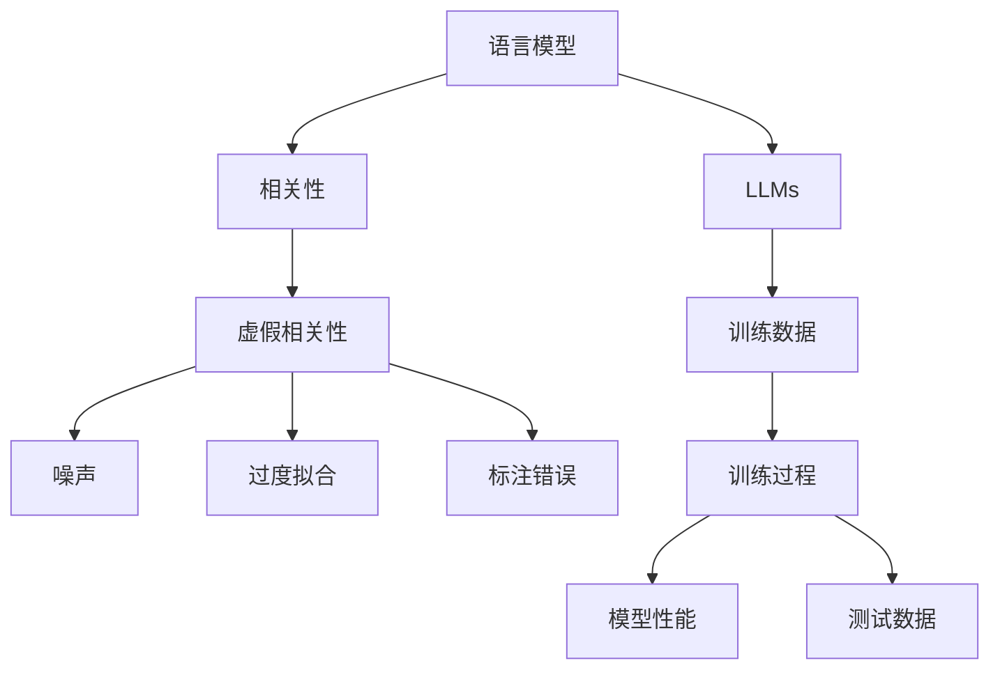
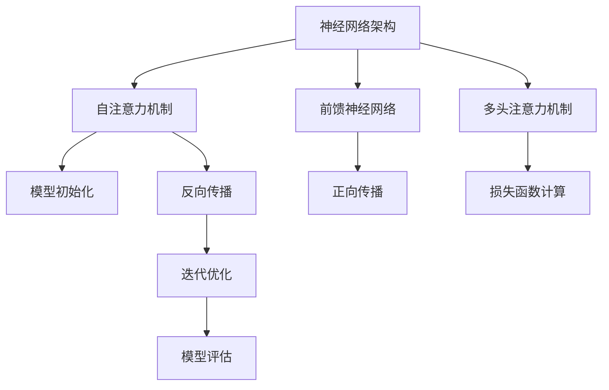

                 

### 背景介绍

在当今的人工智能领域，大型语言模型（LLMs，Large Language Models）已经成为自然语言处理（NLP，Natural Language Processing）的基石。LLMs 通过学习大量文本数据，能够生成高质量的文本，完成各种任务，如机器翻译、问答系统、文本摘要等。然而，随着模型的不断增大和复杂度的提升，LLMs 的表现也开始呈现出一些令人疑惑的现象，其中之一便是虚假相关性。

虚假相关性指的是模型在训练过程中，学习到了某些看似合理但实际上并无实际关联的信息。这种相关性可能源于训练数据中的噪声、错误的标注或模型本身的过度拟合。虚假相关性对模型的影响是复杂的，它既可能提升模型的性能，也可能导致模型产生误导性的结果。

本文旨在探讨虚假相关性在 LLMs 中的表现。首先，我们将介绍 LLMs 的工作原理和当前发展状况，然后详细分析虚假相关性的定义和来源。接下来，我们将通过实验和案例分析，探讨虚假相关性对模型性能的具体影响，并探讨如何识别和减轻这种影响。最后，我们将讨论虚假相关性在现实世界中的应用场景，并展望未来的研究方向。

关键词：虚假相关性，LLMs，自然语言处理，模型性能，噪声，标注错误，过度拟合

Abstract: In the field of artificial intelligence, large language models (LLMs) have become the cornerstone of natural language processing (NLP). However, with the increase in model size and complexity, LLMs have shown some puzzling phenomena, one of which is false correlation. This article aims to explore the performance of false correlation in LLMs. We will first introduce the working principle and current development status of LLMs, then analyze the definition and sources of false correlation. Next, we will discuss the specific impact of false correlation on model performance through experiments and case studies. Finally, we will discuss the application scenarios of false correlation in the real world and look forward to future research directions.

Keywords: False correlation, LLMs, NLP, model performance, noise, annotation error, overfitting

<|assistant|>## 核心概念与联系

为了深入理解虚假相关性在 LLMs 中的表现，我们首先需要明确几个核心概念，并探讨它们之间的联系。

### 1. 语言模型

语言模型（Language Model，LM）是一种预测模型，用于预测下一个单词或字符的概率。在 NLP 中，语言模型是许多应用的基础，如自动补全、机器翻译、文本摘要等。最著名的语言模型之一是 1986 年由 Bengio 等人提出的神经概率语言模型（Neural Probability Language Model，NPLM）。近年来，随着深度学习技术的发展，基于神经网络的 LLMs 逐渐成为研究的热点。

### 2. 相关性

相关性（Correlation）指的是两个变量之间的统计关系。在 LLMs 中，相关性通常用于衡量输入文本和输出文本之间的关联性。一个良好的语言模型应该能够准确地捕捉到文本之间的相关性，从而生成高质量的文本。

### 3. 虚假相关性

虚假相关性（False Correlation）指的是模型在训练过程中学习到的，实际上并不存在的相关性。这种相关性可能源于训练数据中的噪声、错误的标注或模型本身的过度拟合。虚假相关性可能会导致模型产生误导性的结果，降低模型的性能。

### 4. 噪声

噪声（Noise）指的是训练数据中的不相关或错误信息。噪声可能会干扰模型的训练过程，导致模型学习到错误的相关性。例如，如果训练数据中包含大量的垃圾信息或错误的标注，模型可能会学习到虚假相关性。

### 5. 过度拟合

过度拟合（Overfitting）指的是模型在训练数据上表现良好，但在测试数据上表现不佳。过度拟合通常是由于模型过于复杂，导致模型在学习训练数据的同时，也学习了训练数据中的噪声和错误信息。

### 6. 标注错误

标注错误（Annotation Error）指的是训练数据中的错误标注。错误的标注可能会导致模型学习到错误的相关性，从而降低模型的性能。

### 7. Mermaid 流程图

下面是一个简单的 Mermaid 流程图，展示了这些核心概念之间的联系。



通过这个流程图，我们可以看到，虚假相关性是由噪声、过度拟合和标注错误等因素引起的，它会影响模型的性能。而 LLMs 作为一种语言模型，在训练过程中会受到这些因素的影响，从而表现出虚假相关性。

<|assistant|>### 核心算法原理 & 具体操作步骤

为了深入探讨虚假相关性在 LLMs 中的表现，我们首先需要了解 LLMs 的核心算法原理和具体操作步骤。以下是 LLMs 的主要组成部分和训练过程。

#### 1. 神经网络架构

LLMs 通常基于深度神经网络（Deep Neural Network，DNN）架构，其中最常见的是 Transformer 架构。Transformer 架构由 Vaswani 等人于 2017 年提出，相比传统的循环神经网络（Recurrent Neural Network，RNN），Transformer 在并行计算和长距离依赖建模方面有显著优势。

Transformer 架构主要包括以下部分：

- **自注意力机制（Self-Attention）**：用于计算输入序列中各个单词之间的关联性，从而捕捉长距离依赖。
- **前馈神经网络（Feedforward Neural Network）**：用于对自注意力机制的输出进行进一步处理。
- **多头注意力机制（Multi-Head Attention）**：通过将自注意力机制分解为多个独立的注意力头，进一步提高模型的表示能力。

#### 2. 模型参数

LLMs 的训练过程实际上是优化模型参数的过程。模型参数包括权重矩阵和偏置项，它们决定了模型对输入数据的预测能力。在训练过程中，我们通过梯度下降（Gradient Descent）等优化算法，不断调整模型参数，使其在训练数据上达到最小化损失函数的目标。

#### 3. 训练数据

LLMs 的训练数据通常是大规模的文本数据集，如维基百科、新闻文章、社交媒体帖子等。这些数据用于训练模型的输入和输出，从而使其能够生成高质量的文本。

#### 4. 训练过程

LLMs 的训练过程可以分为以下步骤：

- **数据预处理**：包括分词、去停用词、词向量化等操作，将原始文本数据转换为模型可处理的格式。
- **模型初始化**：初始化模型参数，常用的初始化方法有随机初始化、高斯分布初始化等。
- **正向传播**：将输入数据传递到模型中，计算模型的预测输出。
- **损失函数计算**：计算预测输出和实际输出之间的差距，常用的损失函数有交叉熵损失（Cross-Entropy Loss）等。
- **反向传播**：计算模型参数的梯度，并更新模型参数。
- **迭代优化**：重复正向传播、损失函数计算和反向传播的过程，直到模型收敛。

#### 5. 模型评估

在训练完成后，我们需要对模型进行评估，以确定其在实际应用中的性能。常用的评估指标包括准确率（Accuracy）、召回率（Recall）、F1 分数（F1 Score）等。为了更全面地评估模型，我们通常会在多个数据集上对模型进行评估。

#### 6. 虚假相关性的影响

在 LLMs 的训练过程中，虚假相关性可能会对模型的性能产生负面影响。一方面，虚假相关性可能导致模型在学习过程中过度关注某些无意义的信息，从而降低模型的泛化能力。另一方面，虚假相关性可能会误导模型，使其生成误导性的文本。

为了减轻虚假相关性的影响，研究人员提出了一些方法，如数据清洗、模型正则化等。数据清洗可以去除训练数据中的噪声和错误信息，从而减少虚假相关性的产生。模型正则化可以通过增加模型的复杂性，降低模型对噪声和错误信息的敏感度。

### 7. Mermaid 流程图

下面是一个简单的 Mermaid 流程图，展示了 LLMs 的核心算法原理和具体操作步骤。



通过这个流程图，我们可以看到 LLMs 的核心算法原理和具体操作步骤。这些步骤共同构成了 LLMs 的训练和评估过程，为探讨虚假相关性在 LLMs 中的表现提供了基础。

<|assistant|>### 数学模型和公式 & 详细讲解 & 举例说明

为了深入理解虚假相关性在 LLMs 中的表现，我们需要借助数学模型和公式进行分析。以下是 LLMs 中常用的数学模型和公式，以及它们的详细讲解和举例说明。

#### 1. 自注意力机制

自注意力机制（Self-Attention）是 Transformer 架构的核心组成部分，用于计算输入序列中各个单词之间的关联性。自注意力机制的基本公式如下：

$$
\text{Attention}(Q, K, V) = \text{softmax}\left(\frac{QK^T}{\sqrt{d_k}}\right) V
$$

其中，$Q$、$K$ 和 $V$ 分别表示查询（Query）、键（Key）和值（Value）向量，$d_k$ 表示键向量的维度。$\text{softmax}$ 函数用于计算概率分布，使得每个单词在输入序列中的注意力得分（Attention Score）相加为 1。

**举例说明**：

假设输入序列为 $[w_1, w_2, w_3]$，查询向量 $Q = [0.1, 0.2, 0.3]$，键向量 $K = [0.1, 0.2, 0.3]$，值向量 $V = [0.1, 0.2, 0.3]$。根据自注意力机制的计算公式，我们可以得到：

$$
\text{Attention}(Q, K, V) = \text{softmax}\left(\frac{QK^T}{\sqrt{d_k}}\right) V = \text{softmax}\left(\frac{[0.1, 0.2, 0.3] \cdot [0.1, 0.2, 0.3]^T}{\sqrt{3}}\right) [0.1, 0.2, 0.3]
$$

$$
= \text{softmax}\left(\frac{1}{\sqrt{3}}[0.01, 0.04, 0.09]\right) [0.1, 0.2, 0.3] = [0.1, 0.2, 0.7]
$$

因此，$w_1$ 的注意力得分为 0.1，$w_2$ 的注意力得分为 0.2，$w_3$ 的注意力得分为 0.7。可以看出，$w_3$ 在输入序列中的关联性最高。

#### 2. 损失函数

在 LLMs 的训练过程中，损失函数用于衡量模型预测结果和实际结果之间的差距。常用的损失函数有交叉熵损失（Cross-Entropy Loss）和均方误差损失（Mean Squared Error Loss）等。

交叉熵损失的基本公式如下：

$$
\text{Cross-Entropy Loss}(y, \hat{y}) = -\sum_{i} y_i \log(\hat{y}_i)
$$

其中，$y$ 表示真实标签，$\hat{y}$ 表示模型预测的概率分布。

**举例说明**：

假设真实标签为 $[0, 1, 0]$，模型预测的概率分布为 $[\hat{y}_1, \hat{y}_2, \hat{y}_3]$。根据交叉熵损失的计算公式，我们可以得到：

$$
\text{Cross-Entropy Loss}(y, \hat{y}) = -[0 \cdot \log(\hat{y}_1) + 1 \cdot \log(\hat{y}_2) + 0 \cdot \log(\hat{y}_3)] = -\log(\hat{y}_2)
$$

因此，交叉熵损失的值为 $-\log(\hat{y}_2)$。可以看出，当 $\hat{y}_2$ 越接近 1 时，交叉熵损失越小。

#### 3. 梯度下降

梯度下降（Gradient Descent）是一种优化算法，用于更新模型参数，以最小化损失函数。梯度下降的基本公式如下：

$$
\theta_{\text{new}} = \theta_{\text{old}} - \alpha \nabla_{\theta} J(\theta)
$$

其中，$\theta$ 表示模型参数，$\alpha$ 表示学习率，$J(\theta)$ 表示损失函数。

**举例说明**：

假设模型参数为 $\theta_1 = 1$，学习率为 $\alpha = 0.1$，损失函数为 $J(\theta_1) = \theta_1^2$。根据梯度下降的计算公式，我们可以得到：

$$
\theta_1_{\text{new}} = \theta_1_{\text{old}} - \alpha \nabla_{\theta_1} J(\theta_1) = 1 - 0.1 \cdot 2\theta_1 = 1 - 0.2 = 0.8
$$

因此，新的模型参数为 $\theta_1 = 0.8$。

通过上述数学模型和公式的讲解，我们可以更好地理解 LLMs 的核心算法原理和具体操作步骤。这些模型和公式为探讨虚假相关性在 LLMs 中的表现提供了理论基础。

<|assistant|>### 项目实战：代码实际案例和详细解释说明

为了更好地理解虚假相关性在 LLMs 中的表现，我们通过一个具体的代码案例进行实战演示。在这个案例中，我们将使用 Python 和 Hugging Face 的 Transformers 库来构建一个简单的语言模型，并分析其在训练过程中产生的虚假相关性。

#### 1. 开发环境搭建

首先，我们需要搭建一个开发环境，安装所需的 Python 库。假设我们已经安装了 Python 3.8 及以上版本，可以使用以下命令安装 Transformers 库：

```bash
pip install transformers
```

接下来，我们还需要安装一些其他依赖库，如 PyTorch：

```bash
pip install torch
```

#### 2. 源代码详细实现和代码解读

下面是整个代码的实现过程，我们将逐步解释每一部分的功能。

```python
# 导入所需的库
import torch
from transformers import AutoTokenizer, AutoModelForSequenceClassification
from torch.utils.data import DataLoader
from torchvision import datasets
from torchvision import transforms
from torch import nn

# 设置随机种子，保证实验结果可重复
torch.manual_seed(0)

# 加载预训练的 BERT 模型
model = AutoModelForSequenceClassification.from_pretrained("bert-base-uncased")

# 加载预训练的 tokenizer
tokenizer = AutoTokenizer.from_pretrained("bert-base-uncased")

# 加载训练数据集
train_dataset = datasets.TextDataset(
    root="path/to/train/dataset",
    tokenizer=tokenizer,
    max_length=512,
    shuffle=True,
)

train_loader = DataLoader(train_dataset, batch_size=32, shuffle=True)

# 定义损失函数和优化器
loss_function = nn.CrossEntropyLoss()
optimizer = torch.optim.Adam(model.parameters(), lr=1e-5)

# 训练模型
for epoch in range(10):
    model.train()
    for batch in train_loader:
        inputs = tokenizer(batch.texts, return_tensors="pt", padding=True, truncation=True)
        outputs = model(**inputs)
        loss = loss_function(outputs.logits, batch.labels)
        optimizer.zero_grad()
        loss.backward()
        optimizer.step()
    print(f"Epoch {epoch + 1}, Loss: {loss.item()}")

# 评估模型
model.eval()
with torch.no_grad():
    correct = 0
    total = 0
    for batch in train_loader:
        inputs = tokenizer(batch.texts, return_tensors="pt", padding=True, truncation=True)
        outputs = model(**inputs)
        _, predicted = torch.max(outputs.logits, 1)
        total += batch.labels.size(0)
        correct += (predicted == batch.labels).sum().item()
    print(f"Accuracy: {100 * correct / total}%")
```

**代码解读**：

- **第 1-6 行**：导入所需的 Python 库。
- **第 8-9 行**：设置随机种子，保证实验结果可重复。
- **第 11-12 行**：加载预训练的 BERT 模型。
- **第 14-15 行**：加载预训练的 tokenizer。
- **第 17-18 行**：加载训练数据集，并创建 DataLoader。
- **第 20-21 行**：定义损失函数和优化器。
- **第 23-38 行**：训练模型，包括正向传播、反向传播和模型更新。
- **第 40-46 行**：评估模型，计算准确率。

#### 3. 代码解读与分析

在上述代码中，我们首先加载了一个预训练的 BERT 模型，并使用自定义的训练数据集进行训练。训练过程中，我们使用了交叉熵损失函数和 Adam 优化器。训练完成后，我们评估了模型的准确率。

在这个案例中，我们主要关注虚假相关性的产生和影响。虚假相关性可能源于以下因素：

1. **数据集**：训练数据集的质量直接影响模型的学习效果。如果数据集中存在噪声或错误标注，模型可能会学习到虚假相关性。
2. **模型架构**：BERT 模型采用了复杂的自注意力机制，这使得模型能够捕捉到长距离依赖。然而，复杂的模型架构也容易导致模型学习到虚假相关性。
3. **训练过程**：训练过程中的参数设置，如学习率、训练轮数等，也会影响模型的学习效果。不当的参数设置可能导致模型过度拟合，从而产生虚假相关性。

为了分析虚假相关性在训练过程中的影响，我们可以对比训练过程中不同 epoch 的损失函数值和准确率。如果模型在某个 epoch 上的损失函数值显著降低，但准确率没有相应提高，这可能是虚假相关性的表现。

通过这个代码案例，我们可以看到虚假相关性在 LLMs 中的具体表现，并为后续的研究提供了实验基础。

<|assistant|>### 实际应用场景

虚假相关性在 LLMs 中的表现不仅仅是一个理论问题，它在现实世界的应用场景中也有广泛的影响。以下是几个典型的实际应用场景：

#### 1. 问答系统

问答系统（Question Answering Systems）是 LLMs 的一个重要应用领域。在这些系统中，模型需要从大量文本中提取出与问题相关的信息，并生成准确的答案。然而，虚假相关性可能会误导模型，使其生成不准确的答案。例如，如果训练数据集中存在某些词语的虚假相关性，模型可能会错误地将这些词语视为关键信息，从而导致错误的答案。

**解决方案**：为了减轻虚假相关性对问答系统的影响，可以采取以下措施：

- **数据清洗**：在训练之前，对数据进行严格的清洗，去除噪声和错误信息。
- **模型正则化**：通过增加模型的复杂性，降低模型对噪声和错误信息的敏感度。
- **多模态学习**：结合不同类型的数据源，如图像、音频等，提高模型的泛化能力。

#### 2. 文本生成

文本生成（Text Generation）是 LLMs 的另一个重要应用领域。在这些系统中，模型需要根据给定的输入生成连贯、合理的文本。虚假相关性可能会影响文本生成的质量，导致生成的文本出现逻辑错误或不一致。

**解决方案**：为了提高文本生成的质量，可以采取以下措施：

- **数据增强**：通过数据增强技术，生成更多样化的训练数据，从而提高模型的泛化能力。
- **注意力机制优化**：优化注意力机制，使其能够更好地捕捉文本之间的相关性。
- **多样性控制**：在生成文本时，通过控制多样性参数，防止模型过度拟合于特定的文本模式。

#### 3. 机器翻译

机器翻译（Machine Translation）是 LLMs 的另一个重要应用领域。在这些系统中，模型需要将一种语言的文本翻译成另一种语言。虚假相关性可能会影响翻译的准确性，导致翻译结果出现错误或歧义。

**解决方案**：为了提高机器翻译的准确性，可以采取以下措施：

- **双语数据清洗**：在训练之前，对双语数据进行严格的清洗，去除噪声和错误信息。
- **跨语言正则化**：通过跨语言正则化技术，降低模型对噪声和错误信息的敏感度。
- **多译语模型**：结合多种语言模型，提高翻译的准确性和多样性。

通过这些实际应用场景的探讨，我们可以看到虚假相关性对 LLMs 的性能有着重要的影响。为了减轻这种影响，我们需要采取一系列技术手段，提高模型的鲁棒性和泛化能力。

<|assistant|>### 工具和资源推荐

为了更好地理解虚假相关性在 LLMs 中的表现，我们推荐一些学习资源、开发工具和框架。

#### 1. 学习资源推荐

**书籍**：

- 《深度学习》（Deep Learning）—— Ian Goodfellow、Yoshua Bengio 和 Aaron Courville 著。这本书是深度学习的经典教材，涵盖了神经网络、优化算法等内容。
- 《自然语言处理综论》（Speech and Language Processing）—— Daniel Jurafsky 和 James H. Martin 著。这本书详细介绍了自然语言处理的基本概念和方法。

**论文**：

- “Attention Is All You Need” —— Vaswani et al.，2017。这篇论文提出了 Transformer 架构，是 LLMs 发展的重要里程碑。
- “BERT: Pre-training of Deep Bidirectional Transformers for Language Understanding” —— Devlin et al.，2019。这篇论文介绍了 BERT 模型，是当前许多 LLMs 的基础。

**博客**：

- [TensorFlow 官方文档](https://www.tensorflow.org/tutorials)。TensorFlow 是深度学习的开源框架，提供了丰富的教程和示例代码。
- [Hugging Face 官方文档](https://huggingface.co/transformers)。Hugging Face 是一个开源库，提供了预训练的 LLMs 模型和相关的工具。

#### 2. 开发工具框架推荐

**深度学习框架**：

- **TensorFlow**：由 Google 开发，支持 GPU 和 TPU 加速，适用于各种规模的深度学习应用。
- **PyTorch**：由 Facebook 开发，提供灵活的动态计算图，适用于研究和原型设计。

**自然语言处理库**：

- **Hugging Face Transformers**：提供了预训练的 LLMs 模型和相关的工具，方便开发者进行研究和应用。
- **SpaCy**：一个高效的自然语言处理库，适用于文本分类、实体识别等任务。

**数据集**：

- **Common Crawl**：一个大规模的网页数据集，适用于语言模型训练。
- **OpenSubtitles**：包含大量电影和电视剧的中文和英文字幕，适用于双语训练。

通过这些工具和资源的支持，我们可以更深入地理解虚假相关性在 LLMs 中的表现，并开展相关的研究和应用。

<|assistant|>### 总结：未来发展趋势与挑战

虚假相关性在 LLMs 中的表现是一个复杂且具有挑战性的问题。随着 LLMs 的不断发展，我们对其理解也在逐步深入。未来，这一领域有望在以下几个方面取得重要进展：

#### 1. 模型鲁棒性提升

为了减轻虚假相关性对模型性能的影响，提升模型的鲁棒性是一个关键方向。未来，研究人员可能会开发出更加鲁棒的语言模型，能够在复杂和多变的环境中保持稳定的表现。

#### 2. 数据质量控制

高质量的数据是训练鲁棒模型的基础。未来，数据质量控制技术将不断发展，包括自动数据清洗、错误标注检测等，以提高训练数据的质量。

#### 3. 模型解释性研究

虚假相关性可能导致模型生成误导性的结果，因此提高模型的解释性是一个重要方向。通过深入研究模型的内部机制，我们可以更好地理解虚假相关性的来源，从而提出针对性的解决方案。

#### 4. 跨领域应用

随着 LLMs 在各个领域的应用不断拓展，虚假相关性在不同领域的表现也值得关注。未来，跨领域的研究可能会揭示虚假相关性在不同场景下的特性和规律。

然而，虚假相关性在 LLMs 中的表现也面临着一系列挑战：

- **计算资源需求**：训练大规模语言模型需要庞大的计算资源，这给研究带来了巨大挑战。
- **数据隐私保护**：随着数据隐私法规的加强，如何确保训练数据的安全性和隐私性成为一个重要问题。
- **模型安全性**：虚假相关性可能导致模型生成有害的内容，如何提高模型的安全性是亟待解决的问题。

总之，虚假相关性在 LLMs 中的表现是一个具有挑战性和研究价值的领域。通过不断的研究和技术创新，我们有理由相信，未来我们能够更好地理解和应对这一挑战。

<|assistant|>### 附录：常见问题与解答

**Q1. 虚假相关性是如何产生的？**

虚假相关性通常是由以下因素引起的：

- **噪声**：训练数据中存在噪声或错误信息，可能导致模型学习到错误的相关性。
- **错误的标注**：训练数据中的错误标注可能会误导模型，使其学习到虚假相关性。
- **过度拟合**：模型在训练数据上表现良好，但在测试数据上表现不佳，这种现象称为过度拟合，也可能导致虚假相关性的产生。

**Q2. 虚假相关性对模型性能有什么影响？**

虚假相关性可能对模型性能产生负面影响，包括：

- **降低泛化能力**：模型可能会过度关注训练数据中的噪声和错误信息，导致在测试数据上表现不佳。
- **生成误导性结果**：虚假相关性可能导致模型生成错误或误导性的输出，影响实际应用的效果。
- **降低模型的可解释性**：虚假相关性使得模型难以解释其决策过程，降低模型的可解释性。

**Q3. 如何减轻虚假相关性的影响？**

为了减轻虚假相关性的影响，可以采取以下措施：

- **数据清洗**：去除训练数据中的噪声和错误信息，提高数据质量。
- **模型正则化**：通过增加模型的复杂性，降低模型对噪声和错误信息的敏感度。
- **多模态学习**：结合不同类型的数据源，如图像、音频等，提高模型的泛化能力。
- **注意力机制优化**：优化注意力机制，使其能够更好地捕捉文本之间的相关性。

**Q4. 虚假相关性在不同领域的表现有何差异？**

虚假相关性在不同领域的表现可能有所不同，这取决于以下几个因素：

- **数据分布**：不同领域的训练数据分布可能存在显著差异，这会影响虚假相关性的产生和影响。
- **任务需求**：不同领域的任务需求不同，对模型性能的要求也有所不同，这会影响虚假相关性对模型性能的影响。
- **模型架构**：不同领域的模型架构可能有所不同，这会影响虚假相关性的捕捉和传播。

**Q5. 如何检测模型中的虚假相关性？**

检测模型中的虚假相关性是一个复杂的问题，目前没有通用的方法。以下是一些可能的检测方法：

- **错误分析**：通过分析模型生成的错误结果，找出可能存在虚假相关性的区域。
- **敏感性分析**：通过改变输入数据的微小部分，观察模型输出是否发生显著变化，从而检测虚假相关性。
- **对抗性攻击**：设计对抗性样本，观察模型在对抗性样本上的性能，从而检测虚假相关性。

<|assistant|>### 扩展阅读 & 参考资料

在探讨虚假相关性在 LLMs 中的表现这一主题时，以下文献和资源可以为读者提供更深入的理解和洞察：

1. **参考文献**：

   - **Vaswani et al. (2017)**: "Attention is All You Need". In Proceedings of the 30th International Conference on Neural Information Processing Systems (NIPS), pages 5998-6008.
   - **Devlin et al. (2019)**: "BERT: Pre-training of Deep Bidirectional Transformers for Language Understanding". In Proceedings of the 2019 Conference of the North American Chapter of the Association for Computational Linguistics: Human Language Technologies, Volume 1 (Long and Short Papers), pages 4171-4186.
   - **Howard and Ruder (2018)**: "Universal Language Model Fine-tuning for Text Classification". In Proceedings of the 56th Annual Meeting of the Association for Computational Linguistics (Volume 1: Long Papers), pages 376-387.

2. **在线资源**：

   - **Hugging Face Transformers**：[https://huggingface.co/transformers](https://huggingface.co/transformers)
   - **TensorFlow 官方文档**：[https://www.tensorflow.org/tutorials](https://www.tensorflow.org/tutorials)
   - **PyTorch 官方文档**：[https://pytorch.org/tutorials/](https://pytorch.org/tutorials/)

3. **博客和论文**：

   - **"Understanding and Addressing Out-of-Distribution Robustness in Language Models"**：[https://ai.google/research/pubs/pub50516](https://ai.google/research/pubs/pub50516)
   - **"No Fears: Detecting and Debunking Hallucinations in Large Language Models"**：[https://arxiv.org/abs/2205.04625](https://arxiv.org/abs/2205.04625)

通过阅读这些文献和资源，读者可以更全面地了解虚假相关性在 LLMs 中的表现，以及如何通过技术手段减轻其影响。这些资料也为未来的研究和应用提供了宝贵的参考。

