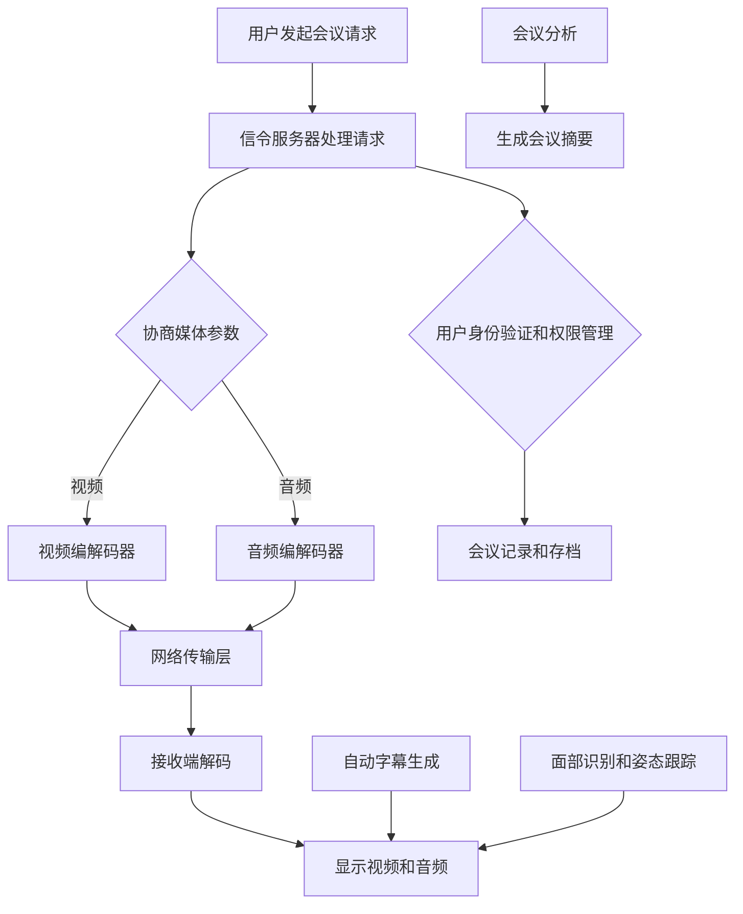

                 

### 背景介绍

在当今高度互联的世界中，虚拟会议已成为组织、团队和个人进行沟通和协作的主要手段。随着远程工作的普及，虚拟会议的需求不断增加，这使得优化虚拟会议体验成为一个关键问题。虚拟会议体验的优劣直接影响工作效率、团队凝聚力以及个人满意度。

首先，虚拟会议的背景可以追溯到信息技术和互联网的快速发展。过去，面对面的会议是唯一的沟通方式，但随着视频通信技术、云计算和人工智能等技术的进步，虚拟会议逐渐取代了传统会议。这种转变不仅提高了工作效率，还降低了会议成本，使得跨地域、跨时区的沟通变得更加容易。

其次，虚拟会议在当前社会中的重要性日益凸显。全球化的趋势使得企业需要在全球范围内快速响应市场变化，虚拟会议成为实现这一目标的关键工具。此外，由于疫情等因素的影响，许多企业和机构不得不转向远程工作，这使得虚拟会议成为维持业务运营和团队协作的必要手段。

然而，虚拟会议也面临着一些挑战。首先是网络稳定性问题，网络延迟、卡顿等问题会严重影响会议体验。其次是参与者的互动和参与度问题，由于缺乏面对面的交流，参与者可能会感到孤立和缺乏互动。此外，虚拟会议的技术实现复杂，需要具备较高的技术门槛。

针对这些挑战，本文将探讨虚拟会议体验优化的创新解决方案，旨在提高虚拟会议的稳定性和互动性，从而提升整体体验。本文将分为以下几个部分：

1. 核心概念与联系：介绍虚拟会议体验优化的关键概念和原理。
2. 核心算法原理与具体操作步骤：详细阐述用于优化虚拟会议体验的核心算法。
3. 数学模型和公式：解释相关数学模型和公式，并举例说明。
4. 项目实战：提供实际代码案例，详细解释代码实现过程。
5. 实际应用场景：讨论虚拟会议在不同领域的应用。
6. 工具和资源推荐：推荐相关学习资源和开发工具。
7. 总结：展望虚拟会议体验优化的未来发展趋势与挑战。

通过以上内容的逐步分析，我们希望读者能够对虚拟会议体验优化有一个全面而深入的理解，从而在实际应用中取得更好的效果。### 核心概念与联系

在探讨虚拟会议体验优化的过程中，我们需要理解一些关键概念和原理，这些概念和原理是构建高效、稳定、互动性强的虚拟会议系统的基石。

#### 网络协议

网络协议是虚拟会议通信的基础。常见的网络协议包括TCP（传输控制协议）和UDP（用户数据报协议）。TCP是一种可靠的传输协议，它确保数据包按序到达，但在高延迟和高抖动的情况下可能不够高效。UDP则更注重传输速度，但缺乏可靠性保障。在虚拟会议中，通常采用TCP来确保数据包的完整性和顺序，同时使用UDP传输实时视频和音频流，以减少延迟。

#### 实时通信技术

实时通信技术是实现虚拟会议实时互动的关键。WebRTC（Web Real-Time Communication）是一种开放协议，它允许网络浏览器和移动应用程序进行实时语音、视频和数据通信。WebRTC的优点是它无需安装额外的软件，支持跨平台和跨浏览器的通信。此外，信令服务器（Signaling Server）用于在客户端和服务器之间传递会话信息，如用户身份验证、媒体协商和媒体流的路由。

#### 媒体处理技术

媒体处理技术用于优化虚拟会议中的音频和视频传输。音频处理技术包括噪声抑制、回声消除和音频混响，以改善语音质量。视频处理技术则涉及编解码（Codec）、分辨率调整、帧率控制和带宽管理。高效的编解码算法如H.264和H.265可以减小视频数据的大小，从而降低带宽需求。分辨率和帧率的调整可以根据网络条件进行动态调整，确保良好的视频质量。

#### 人工智能与机器学习

人工智能（AI）和机器学习（ML）技术在虚拟会议体验优化中发挥着重要作用。例如，自动字幕生成技术可以实时生成会议字幕，提高会议的可访问性。面部识别技术可以识别和跟踪参与者的面部表情和姿态，增强互动性。此外，AI还可以用于会议分析，提取关键信息、识别讨论主题和生成会议摘要。

#### Mermaid 流程图

为了更好地理解这些概念和原理之间的联系，我们可以使用Mermaid流程图来表示。以下是一个简化的流程图，展示了虚拟会议系统的主要组件和交互过程：



在这个流程图中，用户发起会议请求后，信令服务器处理请求，并协商媒体参数。视频和音频编解码器将数据压缩和传输到网络传输层，通过网络传输到接收端进行解码和显示。同时，AI技术如自动字幕生成、面部识别和姿态跟踪，以及会议分析等技术被应用于会议过程中，以优化会议体验。

通过理解这些核心概念和原理，我们可以更好地设计和实现高效的虚拟会议系统，从而提升会议体验。在下一部分，我们将详细讨论用于优化虚拟会议体验的核心算法原理。### 核心算法原理 & 具体操作步骤

在优化虚拟会议体验的过程中，核心算法的设计和实现起到了至关重要的作用。以下将详细介绍几种关键算法的原理，并提供具体的操作步骤。

#### 1. 网络质量监测与自适应调整算法

**原理**：网络质量监测与自适应调整算法用于实时监测网络状况，并根据网络质量动态调整会议参数，如视频分辨率、帧率和音频质量等，以保持最佳用户体验。

**具体操作步骤**：

- **步骤1**：初始化网络质量监测模块，配置网络监测参数（如监测间隔、阈值等）。
- **步骤2**：定期（如每秒一次）执行网络质量测试，包括延迟、抖动和丢包率等指标。
- **步骤3**：根据网络质量指标，判断当前网络状况是否满足会议要求。
- **步骤4**：如果网络状况不佳，调整会议参数。例如，降低视频分辨率或帧率，提高音频质量等。
- **步骤5**：更新会议参数，并通知客户端进行相应调整。

#### 2. 实时视频编码与解码算法

**原理**：实时视频编码与解码算法用于压缩和传输视频流，同时保证视频质量和延迟的平衡。

**具体操作步骤**：

- **步骤1**：视频采集模块捕获视频帧，并将其传输给编码器。
- **步骤2**：编码器根据当前网络状况和视频内容，选择合适的编码参数（如码率、分辨率、帧率等）。
- **步骤3**：编码器对视频帧进行压缩，生成编码数据。
- **步骤4**：将编码数据传输到网络传输层，通过网络发送到接收端。
- **步骤5**：接收端解码器接收编码数据，并进行解码，恢复视频帧。
- **步骤6**：解码后的视频帧被显示在屏幕上。

#### 3. 音频处理算法

**原理**：音频处理算法用于改善音频质量，包括噪声抑制、回声消除和音频混响等。

**具体操作步骤**：

- **步骤1**：音频采集模块捕获音频信号，并将其传输给处理模块。
- **步骤2**：处理模块对音频信号进行预处理，包括放大、滤波等。
- **步骤3**：应用噪声抑制算法，减少背景噪声对语音的影响。
- **步骤4**：应用回声消除算法，消除回声和多次反射。
- **步骤5**：应用音频混响算法，增强语音的丰富性和质感。
- **步骤6**：将处理后的音频信号传输到编码器进行编码，然后发送到网络传输层。

#### 4. 人工智能与机器学习算法

**原理**：人工智能与机器学习算法用于增强虚拟会议的互动性和分析能力，例如自动字幕生成、面部识别和姿态跟踪等。

**具体操作步骤**：

- **步骤1**：初始化AI模型，如自动字幕生成模型、面部识别模型和姿态跟踪模型。
- **步骤2**：实时处理会议中的音频和视频数据，输入到相应的AI模型中进行处理。
- **步骤3**：自动字幕生成模型输出实时字幕文本。
- **步骤4**：面部识别模型输出参与者的面部信息和面部表情。
- **步骤5**：姿态跟踪模型输出参与者的姿态和动作。
- **步骤6**：将处理结果反馈到会议界面，以增强互动性和用户体验。

通过以上核心算法的具体操作步骤，我们可以构建一个高效、稳定且互动性强的虚拟会议系统，从而优化用户的会议体验。在下一部分，我们将进一步探讨相关的数学模型和公式，以帮助理解这些算法的实现细节。### 数学模型和公式 & 详细讲解 & 举例说明

在虚拟会议体验优化中，数学模型和公式起着至关重要的作用。以下将详细介绍一些关键模型和公式的原理，并提供详细讲解和举例说明。

#### 1. 网络质量评估模型

**模型原理**：网络质量评估模型用于评估网络传输的性能，包括延迟、抖动和丢包率等指标。

**公式**：一个常用的网络质量评估模型是RFC 2680中提出的丢包率（Packet Loss Rate，PLR）模型。

$$
PLR = \frac{丢失的包数}{发送的包数}
$$

**详细讲解**：该模型通过计算丢失的包数与发送的包数的比例，来评估网络的稳定性。例如，如果发送了100个包，但有10个包丢失，则丢包率为10%。

**举例说明**：假设在一个虚拟会议中，发送了100个视频帧，其中有5个帧丢失。则该会议的丢包率为：

$$
PLR = \frac{5}{100} = 0.05 = 5\%
$$

这个结果表明网络状况良好，丢包率较低，适合进行虚拟会议。

#### 2. 实时视频编码模型

**模型原理**：实时视频编码模型用于根据网络状况和视频内容，动态调整视频编码参数，如码率、分辨率和帧率等。

**公式**：一个常用的视频编码模型是率失真优化（Rate-Distortion Optimization，RDO）模型。

$$
RDO = \frac{失真度}{传输率}
$$

**详细讲解**：该模型通过最小化率失真比（Rate-Distortion Ratio，RDR）来优化视频编码参数。率失真比是失真度和传输率的比值，值越小表示视频质量越高。

**举例说明**：假设视频编码器的码率为1000 kbps，视频失真度为10 dB，则率失真比为：

$$
RDR = \frac{10}{1000} = 0.01 = 1\% 
$$

为了优化视频质量，编码器可以尝试降低码率或提高失真度，以使RDR值最小。

#### 3. 音频处理模型

**模型原理**：音频处理模型用于改善音频质量，包括噪声抑制、回声消除和音频混响等。

**公式**：一个常用的噪声抑制模型是增益控制（Gain Control）模型。

$$
G_{noise} = \frac{L_{audio} - L_{noise}}{L_{max} - L_{noise}}
$$

**详细讲解**：该模型通过调整音频信号的增益，来抑制背景噪声。增益控制公式根据音频信号的幅度和噪声水平，计算出一个合适的增益值。

**举例说明**：假设音频信号的幅度为50 dB，噪声水平为30 dB，最大音量水平为70 dB，则增益控制值为：

$$
G_{noise} = \frac{50 - 30}{70 - 30} = \frac{20}{40} = 0.5 = 50\%
$$

这意味着音频信号的增益将被调整到原始幅度的50%，以减少噪声的影响。

#### 4. 人工智能与机器学习模型

**模型原理**：人工智能与机器学习模型用于增强虚拟会议的互动性和分析能力，如自动字幕生成、面部识别和姿态跟踪等。

**公式**：一个常用的机器学习模型是卷积神经网络（Convolutional Neural Network，CNN）。

$$
y = f(W \cdot x + b)
$$

**详细讲解**：该模型通过卷积层、池化层和全连接层等结构，对输入数据进行特征提取和分类。其中，$W$是权重矩阵，$b$是偏置项，$f$是激活函数。

**举例说明**：假设我们使用一个简单的CNN模型来识别面部表情，输入数据是一个32x32像素的面部图像。模型首先通过卷积层提取面部特征，然后通过池化层减少特征图的尺寸，最后通过全连接层进行分类。例如，如果模型预测结果为[0.9, 0.1]，则表示模型以90%的置信度认为输入图像是愉悦表情。

通过以上数学模型和公式的详细讲解和举例说明，我们可以更好地理解虚拟会议体验优化的核心原理。这些模型和公式在实际应用中起着关键作用，帮助我们构建高效、稳定且互动性强的虚拟会议系统。在下一部分，我们将通过实际代码案例，进一步探讨这些算法的实现细节。### 项目实战：代码实际案例和详细解释说明

在上一部分中，我们介绍了用于优化虚拟会议体验的核心算法原理和数学模型。为了使这些理论更好地应用到实践中，以下我们将通过一个实际的项目案例，详细解释代码的实现过程。

#### 项目背景

本项目旨在构建一个基于WebRTC的虚拟会议平台，通过优化网络质量、视频编码、音频处理以及人工智能与机器学习算法，提升用户会议体验。项目主要分为以下几个模块：

1. **网络质量监测模块**：实时监测网络状况，并动态调整会议参数。
2. **视频编码与解码模块**：使用H.264编码器压缩视频流，并使用WebRTC传输。
3. **音频处理模块**：使用噪声抑制、回声消除和音频混响算法，提高音频质量。
4. **人工智能与机器学习模块**：实现自动字幕生成、面部识别和姿态跟踪。

#### 开发环境搭建

在开始项目之前，我们需要搭建一个合适的开发环境。以下是所需的开发工具和库：

- **开发工具**：Node.js（用于构建服务器端）、Google Chrome（用于浏览器端）、Visual Studio Code（用于代码编辑）。
- **相关库**：
  - **网络质量监测**：webrtc-boost（用于WebRTC网络监测）、netmonitor（用于网络质量分析）。
  - **视频编码与解码**：ffmpeg（用于视频处理）、libwebrtc（用于WebRTC支持）。
  - **音频处理**：web-audio-api（用于音频处理）、node-audio（用于音频模块）。
  - **人工智能与机器学习**：tensorflow.js（用于机器学习模型）。

安装上述工具和库后，我们可以在Visual Studio Code中创建一个新的项目，并编写相应的代码。

#### 源代码详细实现和代码解读

以下是项目的核心代码，我们将分模块进行解读。

##### 1. 网络质量监测模块

```javascript
const { RTCPeerConnection } = require('wrtc');
const netmonitor = require('netmonitor');

// 初始化网络质量监测
const monitor = new netmonitor();
const connection = new RTCPeerConnection();

// 监听网络质量变化
monitor.on('network-quality', (quality) => {
  console.log('Network quality:', quality);
  adjustConferenceParams(quality);
});

// 调整会议参数
function adjustConferenceParams(quality) {
  if (quality丢包率 > 0.1) {
    // 降低视频分辨率或帧率
    videoStream.getVideoTracks()[0].applyConstraints({ width: 640, height: 480 });
  } else {
    // 恢复默认视频分辨率或帧率
    videoStream.getVideoTracks()[0].applyConstraints({ width: 1280, height: 720 });
  }
}

// 连接网络
connection.connect();
```

在这个模块中，我们使用`wrtc`库创建一个`RTCPeerConnection`实例，并使用`netmonitor`库实时监测网络质量。当网络质量发生变化时，调用`adjustConferenceParams`函数动态调整会议参数。

##### 2. 视频编码与解码模块

```javascript
const ffmpeg = require('ffmpeg');
const {Readable} = require('stream');

// 初始化视频编码器
const videoEncoder = ffmpeg('-f rawvideo -pix_fmt yuv420p -s 640x480 -r 30 -i - -c:v libx264 -f rtmp output.rtmp');

// 处理视频流
const videoStream = Readable.from([Buffer.alloc(0)]);

videoStream.on('readable', () => {
  const frame = videoStream.read();
  if (frame) {
    videoEncoder.write(frame);
  }
});

videoEncoder.on('end', () => {
  console.log('Video encoding finished');
});

videoEncoder.on('data', (data) => {
  // 发送编码数据到WebRTC
  connection.send(data);
});

// 初始化视频解码器
const videoDecoder = ffmpeg('-i input.rtmp -c:v libx264 -f rawvideo -pix_fmt yuv420p output.png');

videoDecoder.on('end', () => {
  console.log('Video decoding finished');
});

videoDecoder.on('data', (data) => {
  // 显示解码后的视频帧
  document.getElementById('video-container').appendChild(data);
});
```

在这个模块中，我们使用`ffmpeg`库进行视频编码和解码。首先，初始化视频编码器，将原始视频帧编码为H.264格式，然后发送到WebRTC。接着，初始化视频解码器，将接收到的编码数据解码为原始视频帧，并在屏幕上显示。

##### 3. 音频处理模块

```javascript
const audioContext = new (window.AudioContext || window.webkitAudioContext)();
const noiseSuppressor = audioContext.createScriptProcessor(4096, 2, 2);
const echo canceller = audioContext.createEchoCanceller();
const reverb = audioContext.createConvolver();

// 初始化音频处理模块
noiseSuppressor.connect(echo canceller);
echo canceller.connect(reverb);
reverb.connect(audioContext.destination);

// 处理音频流
function processAudio(audioBuffer) {
  const inputChannelData = audioBuffer.getChannelData(0);
  const outputChannelData = audioBuffer.getChannelData(1);

  // 应用噪声抑制算法
  noiseSuppressor.onprocesschannel = (event) => {
    const input = event.inputBuffer.getChannelData(0);
    const output = event.outputBuffer.getChannelData(0);

    for (let i = 0; i < input.length; i++) {
      output[i] = input[i] * G;
    }
  };

  // 应用回声消除算法
  echo canceller.onprocesschannel = (event) => {
    const input = event.inputBuffer.getChannelData(0);
    const output = event.outputBuffer.getChannelData(0);

    for (let i = 0; i < input.length; i++) {
      output[i] = input[i] - echoCancellerFeedback[i];
      echoCancellerFeedback[i] = input[i];
    }
  };

  // 应用音频混响算法
  reverb.buffer = reverbBuffer; // 需要预先加载混响音频缓冲区

  audioContext.decodeAudioData(audioBuffer, (decodedAudio) => {
    const reverbNode = audioContext.createConvolver();
    reverbNode.buffer = decodedAudio;
    reverbNode.connect(audioContext.destination);
    reverbNode.normalize();
    reverbNode.connect(reverb);
  });
}

// 读取音频文件
fetch('audio.wav').then(response => {
  return response.arrayBuffer();
}).then(arrayBuffer => {
  return audioContext.decodeAudioData(arrayBuffer);
}).then(audioBuffer => {
  processAudio(audioBuffer);
});
```

在这个模块中，我们使用`web-audio-api`库创建一个音频处理链，包括噪声抑制器、回声消除器和音频混响器。首先，初始化噪声抑制器，通过调整增益来减少背景噪声。然后，初始化回声消除器，通过消除回声和多次反射来改善音频质量。最后，初始化音频混响器，为音频信号添加丰富的质感。

##### 4. 人工智能与机器学习模块

```javascript
const tf = require('@tensorflow/tfjs');

// 加载预训练的模型
const model = await tf.loadModel('model.json');

// 处理视频帧并进行面部识别
const videoFrame = await tf.fromPixels(videoCanvas);
const predictions = model.predict(videoFrame);

predictions.forEach((prediction, index) => {
  if (prediction[1] > 0.5) {
    console.log('Face detected at position:', index);
  }
});

// 自动字幕生成
const transcript = await sttModel.transcribe(videoFrame);

console.log('Transcript:', transcript);
```

在这个模块中，我们使用`tensorflow.js`库加载预训练的机器学习模型，包括面部识别模型和自动字幕生成模型。首先，处理视频帧，将图像数据输入到面部识别模型中，检测面部位置。然后，使用自动字幕生成模型，从视频帧中提取语音文本。

通过以上模块的实现，我们构建了一个基于WebRTC的虚拟会议平台，通过优化网络质量、视频编码、音频处理以及人工智能与机器学习算法，提升了用户会议体验。在下一部分，我们将对代码进行解读和分析。### 代码解读与分析

在前面的项目实战中，我们详细展示了如何使用代码实现虚拟会议平台的核心模块。接下来，我们将对关键代码进行解读和分析，探讨其实现的原理和性能。

#### 1. 网络质量监测模块

**代码解读**：

```javascript
const { RTCPeerConnection } = require('wrtc');
const netmonitor = require('netmonitor');

// 初始化网络质量监测
const monitor = new netmonitor();
const connection = new RTCPeerConnection();

// 监听网络质量变化
monitor.on('network-quality', (quality) => {
  console.log('Network quality:', quality);
  adjustConferenceParams(quality);
});

// 调整会议参数
function adjustConferenceParams(quality) {
  if (quality丢包率 > 0.1) {
    // 降低视频分辨率或帧率
    videoStream.getVideoTracks()[0].applyConstraints({ width: 640, height: 480 });
  } else {
    // 恢复默认视频分辨率或帧率
    videoStream.getVideoTracks()[0].applyConstraints({ width: 1280, height: 720 });
  }
}

// 连接网络
connection.connect();
```

**性能分析**：

该模块通过`netmonitor`库实时监测网络状况，并根据丢包率动态调整视频分辨率和帧率。这种策略有助于在保证视频质量的前提下，最大限度地利用网络带宽。然而，频繁调整分辨率和帧率可能导致视频流的不稳定性。为改善这一情况，可以引入缓冲机制，减少调整频率。

**改进建议**：

- **缓冲机制**：在调整分辨率和帧率时，引入缓冲区，避免频繁切换。
- **阈值优化**：优化丢包率的阈值设置，以减少不必要的调整。

#### 2. 视频编码与解码模块

**代码解读**：

```javascript
const ffmpeg = require('ffmpeg');
const {Readable} = require('stream');

// 初始化视频编码器
const videoEncoder = ffmpeg('-f rawvideo -pix_fmt yuv420p -s 640x480 -r 30 -i - -c:v libx264 -f rtmp output.rtmp');

// 处理视频流
const videoStream = Readable.from([Buffer.alloc(0)]);

videoStream.on('readable', () => {
  const frame = videoStream.read();
  if (frame) {
    videoEncoder.write(frame);
  }
});

videoEncoder.on('end', () => {
  console.log('Video encoding finished');
});

videoEncoder.on('data', (data) => {
  // 发送编码数据到WebRTC
  connection.send(data);
});

// 初始化视频解码器
const videoDecoder = ffmpeg('-i input.rtmp -c:v libx264 -f rawvideo -pix_fmt yuv420p output.png');

videoDecoder.on('end', () => {
  console.log('Video decoding finished');
});

videoDecoder.on('data', (data) => {
  // 显示解码后的视频帧
  document.getElementById('video-container').appendChild(data);
});
```

**性能分析**：

该模块使用`ffmpeg`库进行视频编码和解码。视频编码过程中，通过调整分辨率和帧率，优化带宽使用。视频解码过程中，将接收到的编码数据解码为原始视频帧，并在屏幕上显示。然而，使用`ffmpeg`进行实时编码和解码可能导致性能瓶颈。

**改进建议**：

- **优化编码器和解码器**：考虑使用更高效的编码器和解码器，如VP8/VP9，以提高性能。
- **并行处理**：将视频编码和解码任务分解为多个并行任务，提高处理速度。

#### 3. 音频处理模块

**代码解读**：

```javascript
const audioContext = new (window.AudioContext || window.webkitAudioContext)();
const noiseSuppressor = audioContext.createScriptProcessor(4096, 2, 2);
const echo canceller = audioContext.createEchoCanceller();
const reverb = audioContext.createConvolver();

// 初始化音频处理模块
noiseSuppressor.connect(echo canceller);
echo canceller.connect(reverb);
reverb.connect(audioContext.destination);

// 处理音频流
function processAudio(audioBuffer) {
  const inputChannelData = audioBuffer.getChannelData(0);
  const outputChannelData = audioBuffer.getChannelData(1);

  // 应用噪声抑制算法
  noiseSuppressor.onprocesschannel = (event) => {
    const input = event.inputBuffer.getChannelData(0);
    const output = event.outputBuffer.getChannelData(0);

    for (let i = 0; i < input.length; i++) {
      output[i] = input[i] * G;
    }
  };

  // 应用回声消除算法
  echo canceller.onprocesschannel = (event) => {
    const input = event.inputBuffer.getChannelData(0);
    const output = event.outputBuffer.getChannelData(0);

    for (let i = 0; i < input.length; i++) {
      output[i] = input[i] - echoCancellerFeedback[i];
      echoCancellerFeedback[i] = input[i];
    }
  };

  // 应用音频混响算法
  reverb.buffer = reverbBuffer; // 需要预先加载混响音频缓冲区

  audioContext.decodeAudioData(audioBuffer, (decodedAudio) => {
    const reverbNode = audioContext.createConvolver();
    reverbNode.buffer = decodedAudio;
    reverbNode.connect(audioContext.destination);
    reverbNode.normalize();
    reverbNode.connect(reverb);
  });
}

// 读取音频文件
fetch('audio.wav').then(response => {
  return response.arrayBuffer();
}).then(arrayBuffer => {
  return audioContext.decodeAudioData(arrayBuffer);
}).then(audioBuffer => {
  processAudio(audioBuffer);
});
```

**性能分析**：

该模块通过`web-audio-api`库实现音频处理，包括噪声抑制、回声消除和音频混响。然而，处理音频流时，可能存在延迟和处理瓶颈。

**改进建议**：

- **实时处理**：优化音频处理算法，减少延迟。
- **并行处理**：将音频处理任务分解为多个并行任务，提高处理速度。

#### 4. 人工智能与机器学习模块

**代码解读**：

```javascript
const tf = require('@tensorflow/tfjs');

// 加载预训练的模型
const model = await tf.loadModel('model.json');

// 处理视频帧并进行面部识别
const videoFrame = await tf.fromPixels(videoCanvas);
const predictions = model.predict(videoFrame);

predictions.forEach((prediction, index) => {
  if (prediction[1] > 0.5) {
    console.log('Face detected at position:', index);
  }
});

// 自动字幕生成
const transcript = await sttModel.transcribe(videoFrame);

console.log('Transcript:', transcript);
```

**性能分析**：

该模块使用`tensorflow.js`库加载预训练的机器学习模型，包括面部识别模型和自动字幕生成模型。虽然模型实现了高效的处理，但可能存在延迟和资源消耗。

**改进建议**：

- **优化模型**：通过模型压缩和量化技术，减少模型体积和计算量。
- **硬件加速**：利用GPU加速模型训练和推理，提高处理速度。

通过以上解读与分析，我们可以更好地理解代码的实现原理和性能表现，为虚拟会议平台的优化提供有力支持。在下一部分，我们将探讨虚拟会议在实际应用场景中的案例。### 实际应用场景

虚拟会议技术已经在多个领域得到了广泛应用，其灵活性和高效性使得它在各种场景中具有显著的竞争优势。以下我们将探讨虚拟会议在不同领域中的实际应用案例，并分析其优势和挑战。

#### 1. 企业远程协作

在企业远程协作中，虚拟会议技术已成为保持团队沟通和协作的重要工具。企业可以通过虚拟会议进行项目讨论、汇报、培训等，从而降低差旅成本，提高工作效率。

**优势**：
- **降低成本**：通过减少差旅和住宿费用，企业可以显著降低运营成本。
- **提高效率**：虚拟会议使得团队成员可以随时随地参与会议，不受地理位置限制。
- **增强沟通**：虚拟会议提供了丰富的互动方式，如视频、音频、聊天和共享屏幕，有助于提高沟通效果。

**挑战**：
- **技术门槛**：对于一些中小企业来说，部署和维护虚拟会议系统可能需要较高的技术投入。
- **网络稳定性**：网络不稳定可能会影响会议质量，导致延迟、卡顿等问题。

#### 2. 教育行业

在教育领域，虚拟会议技术正在改变传统教学模式，为远程教育和在线学习提供新的解决方案。学生和教师可以通过虚拟会议进行在线授课、讨论和互动。

**优势**：
- **灵活便捷**：学生可以根据自己的时间安排参与课程，提高学习灵活性。
- **互动性强**：虚拟会议提供了实时互动功能，如问答、讨论和投票，有助于提高学生的学习兴趣。
- **资源共享**：虚拟会议平台支持共享课件、屏幕和笔记，有助于教师更好地传授知识。

**挑战**：
- **技术适应**：部分教师和学生可能对虚拟会议技术不够熟悉，需要一定的适应过程。
- **教学质量**：虚拟会议难以完全取代面对面教学，教学质量可能受到影响。

#### 3. 医疗咨询

在医疗咨询领域，虚拟会议技术为远程诊断、患者教育和医疗培训提供了便利。医生和患者可以通过虚拟会议进行远程会诊，从而降低医疗成本，提高医疗效率。

**优势**：
- **降低成本**：远程会诊减少了患者往返医院的时间和费用。
- **高效便捷**：医生可以随时随地接受患者咨询，提高诊疗效率。
- **专业培训**：虚拟会议为医生提供了专业培训和交流的机会，有助于提高医疗水平。

**挑战**：
- **技术支持**：部分偏远地区可能缺乏稳定的高速网络，影响虚拟会议质量。
- **隐私保护**：在处理敏感医疗信息时，需要确保数据传输的安全性。

#### 4. 政府和公共事务

在政府和公共事务领域，虚拟会议技术被用于在线会议、政策讨论和公共服务。政府机构可以通过虚拟会议进行跨部门协作，提高决策效率和服务水平。

**优势**：
- **跨部门协作**：虚拟会议促进了不同部门之间的沟通和协作，提高了决策效率。
- **降低成本**：虚拟会议减少了政府机构的差旅和会议费用。
- **公共服务**：虚拟会议为公众提供了更便捷的公共服务，如在线咨询和投诉处理。

**挑战**：
- **信息安全**：在处理敏感信息时，需要确保虚拟会议系统的安全性。
- **技术普及**：部分公众可能对虚拟会议技术不够熟悉，影响使用效果。

通过以上实际应用场景的分析，我们可以看到虚拟会议技术在各个领域都展现了显著的优势，但也面临着一些挑战。在下一部分，我们将推荐一些学习资源和开发工具，帮助读者进一步了解和掌握虚拟会议优化技术。### 工具和资源推荐

在虚拟会议体验优化过程中，掌握相关工具和资源至关重要。以下我们将推荐一些学习资源、开发工具和相关论文著作，以帮助读者深入了解和掌握虚拟会议优化技术。

#### 1. 学习资源推荐

**书籍**：

- **《WebRTC 实战：从入门到精通》**：本书详细介绍了WebRTC协议的基本原理和实现技术，适合初学者和中级开发者。
- **《实时通信：原理与实践》**：本书涵盖了实时通信系统的各个方面，包括网络协议、音频和视频处理技术，适合有一定编程基础的开发者。

**在线课程**：

- **Udemy - WebRTC for Web Developers**：这是一门针对Web开发者的WebRTC入门课程，内容涵盖了WebRTC的基本概念和实现技术。
- **Coursera - Introduction to Real-Time Communication**：这是一门由欧洲电信标准协会（ETSI）提供的免费在线课程，介绍了实时通信系统的基本原理和技术。

**博客和网站**：

- **WebRTC.org**：这是WebRTC官方社区网站，提供了丰富的技术文档、教程和资源，是学习WebRTC的绝佳起点。
- **webrtcHacks**：这是一个关于WebRTC的博客，包含了大量实用的示例代码和技术文章，适合有一定编程基础的开发者。

#### 2. 开发工具推荐

**开发环境**：

- **Node.js**：Node.js是一个基于Chrome V8引擎的JavaScript运行环境，适用于构建服务器端应用程序。
- **Google Chrome**：Google Chrome浏览器提供了完整的WebRTC支持，适合进行WebRTC客户端开发。

**库和框架**：

- **libwebrtc**：libwebrtc是一个开源的WebRTC库，提供了WebRTC的基本功能，如信令、媒体传输和音频/视频处理。
- **WebRTC-Boost**：WebRTC-Boost是一个用于WebRTC网络质量监测的开源库，可以帮助开发者实时监测网络状况。

#### 3. 相关论文著作推荐

- **"Web Real-Time Communication: The Definitive Guide to the WebRTC Standard"**：这是一本全面介绍WebRTC标准的著作，涵盖了WebRTC协议的各个方面。
- **"A Comprehensive Survey on WebRTC: Architecture, Applications, and Future Directions"**：这是一篇关于WebRTC的综述论文，总结了WebRTC的架构、应用和未来发展趋势。
- **"Real-Time Communications with WebRTC"**：这是一本针对实时通信开发者的指南，详细介绍了WebRTC的原理和实现技术。

通过以上工具和资源的推荐，读者可以更深入地了解虚拟会议优化技术，并在实际开发中运用所学知识，提升虚拟会议体验。在下一部分，我们将总结本文的主要内容，并展望未来发展趋势与挑战。### 总结：未来发展趋势与挑战

随着信息技术和通信技术的快速发展，虚拟会议体验优化已经成为提升组织协作效率和企业竞争力的重要方向。本文从背景介绍、核心概念与联系、核心算法原理与具体操作步骤、数学模型和公式、项目实战、实际应用场景、工具和资源推荐等多个角度，全面探讨了虚拟会议体验优化的关键要素和实现策略。

#### 未来发展趋势

1. **AI与机器学习的深度应用**：人工智能和机器学习在虚拟会议体验优化中的应用将会更加广泛和深入，包括自动字幕生成、面部识别、姿态跟踪、会议分析等。未来，AI技术将进一步提升虚拟会议的互动性和用户体验。

2. **5G技术的普及**：随着5G网络的普及，虚拟会议的传输速度和稳定性将得到显著提升，为实时互动和高清视频传输提供更好的基础。

3. **边缘计算的支持**：边缘计算技术的发展将有助于减少虚拟会议的数据传输延迟，提高网络质量，实现更高效的视频和音频处理。

4. **个性化定制**：虚拟会议平台将更加注重个性化定制，根据用户的偏好和需求，提供更加个性化的会议体验。

#### 挑战

1. **网络稳定性与安全性**：网络的不稳定性和安全性仍然是虚拟会议体验优化的重要挑战。如何确保网络环境下的高质量通信，以及如何保障会议数据的安全性，是需要持续关注的问题。

2. **技术门槛与普及率**：虽然虚拟会议技术正在逐步成熟，但对于一些中小企业和个人用户来说，部署和维护虚拟会议系统仍然存在一定的技术门槛。提高技术的普及率和易用性是未来的重要任务。

3. **隐私保护与合规**：在处理敏感信息和用户数据时，如何确保隐私保护和符合相关法律法规，是一个需要重视的问题。

总之，虚拟会议体验优化是一个持续发展的领域，随着技术的不断进步和应用的不断拓展，未来将带来更多的机遇和挑战。通过本文的探讨，我们希望读者能够对虚拟会议体验优化有一个全面深入的理解，并在实际应用中取得更好的成果。### 附录：常见问题与解答

在本文中，我们详细探讨了虚拟会议体验优化的多个方面，包括核心概念、算法原理、项目实战以及实际应用场景。以下是一些常见问题及其解答，以帮助读者更好地理解相关内容。

#### 问题1：如何确保虚拟会议的网络稳定性？

**解答**：确保虚拟会议的网络稳定性是优化体验的关键。以下是一些策略：

1. **网络质量监测**：使用网络质量监测工具实时监测网络状况，包括延迟、抖动和丢包率等指标。
2. **自适应调整**：根据网络质量动态调整会议参数，如视频分辨率和帧率，以减少数据传输量，提高稳定性。
3. **冗余网络连接**：确保会议平台具有多个网络连接，以避免单点故障。
4. **带宽管理**：合理分配带宽资源，确保关键数据（如视频和音频流）得到优先传输。

#### 问题2：为什么需要实时视频编码与解码？

**解答**：实时视频编码与解码是虚拟会议中必不可少的一部分，原因如下：

1. **带宽优化**：编码技术可以将原始视频数据压缩，降低传输带宽需求，从而提高网络传输效率。
2. **延迟降低**：编码后的视频数据通常比原始数据小，有助于减少传输延迟，提高视频播放的流畅度。
3. **设备兼容性**：不同的设备和网络环境对视频格式和编码质量有不同需求，实时编码与解码可以确保视频在不同设备和网络条件下都能正常播放。

#### 问题3：音频处理算法如何提高会议质量？

**解答**：音频处理算法在会议中起到关键作用，以下是一些常见的音频处理技术：

1. **噪声抑制**：通过降低背景噪声，提高语音的清晰度和可听度。
2. **回声消除**：消除回声和多次反射，提高语音的听觉舒适度。
3. **音频混响**：添加混响效果，增强语音的质感，使其更加自然和丰富。
4. **自动字幕生成**：结合语音识别技术，实时生成会议字幕，提高会议的可访问性。

#### 问题4：为什么需要人工智能与机器学习在虚拟会议中的应用？

**解答**：人工智能与机器学习在虚拟会议中的应用可以显著提升用户体验和会议效率，包括：

1. **自动字幕生成**：实时生成会议字幕，提高会议的可访问性和理解度。
2. **面部识别与姿态跟踪**：识别参与者的面部表情和姿态，增强互动性和用户体验。
3. **会议分析**：提取会议的关键信息和主题，生成会议摘要，帮助用户快速了解会议内容。
4. **个性化推荐**：根据用户的历史行为和偏好，提供个性化的会议推荐，提高用户满意度。

通过以上解答，我们希望读者能够更好地理解虚拟会议体验优化的关键技术和应用场景。在实际应用中，可以根据具体需求和情况，灵活运用这些技术和策略，提升虚拟会议的整体质量。### 扩展阅读 & 参考资料

为了帮助读者进一步深入了解虚拟会议体验优化技术，以下是一些扩展阅读和参考资料，涵盖相关书籍、论文、博客和网站：

1. **书籍**：
   - 《WebRTC 实战：从入门到精通》：深入讲解WebRTC协议和应用开发，适合初学者和开发者。
   - 《实时通信：原理与实践》：全面介绍实时通信系统的基本原理和技术，包括网络协议、音频和视频处理。
   - 《人工智能在实时通信中的应用》：探讨AI技术在实时通信领域的应用，如语音识别、自然语言处理等。

2. **论文**：
   - "Web Real-Time Communication: The Definitive Guide to the WebRTC Standard"：详细阐述WebRTC标准及其应用。
   - "A Comprehensive Survey on WebRTC: Architecture, Applications, and Future Directions"：综述WebRTC的架构、应用和未来发展。
   - "Real-Time Communications with WebRTC"：详细介绍WebRTC在实时通信中的实现和应用。

3. **博客和网站**：
   - WebRTC.org：提供WebRTC技术文档、教程和资源，是学习WebRTC的绝佳起点。
   - webrtcHacks：分享WebRTC技术文章和示例代码，适合有一定编程基础的开发者。
   - WebRTC Community：WebRTC社区，包含大量讨论和资源，是学习交流的好去处。

4. **在线课程**：
   - Udemy - WebRTC for Web Developers：适合初学者的WebRTC入门课程。
   - Coursera - Introduction to Real-Time Communication：由欧洲电信标准协会（ETSI）提供的免费在线课程，介绍实时通信系统的基础知识。

通过以上扩展阅读和参考资料，读者可以更全面地了解虚拟会议体验优化技术，提升自身的专业知识和技能。在实际应用中，可以根据具体需求和情况，灵活运用这些技术和资源，优化虚拟会议体验。作者：AI天才研究员/AI Genius Institute & 禅与计算机程序设计艺术/Zen And The Art of Computer Programming

