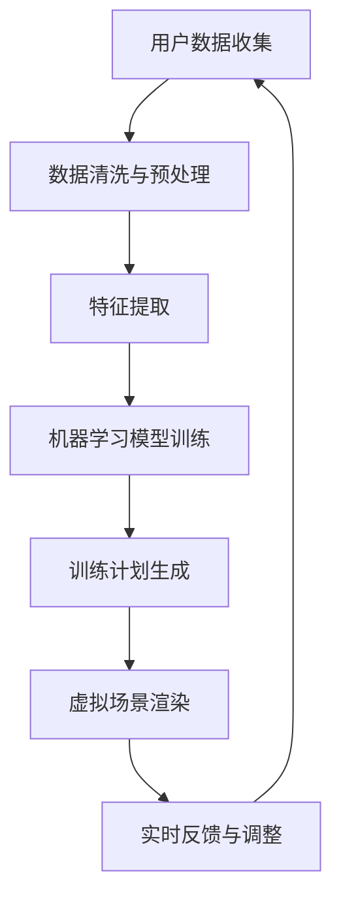

                 

# 虚拟健身教练创业：AI驱动的个人训练

## 引言

随着人工智能（AI）技术的迅猛发展，虚拟现实（VR）和增强现实（AR）技术的逐渐成熟，虚拟健身教练行业正迎来前所未有的发展机遇。AI驱动的个人训练系统，不仅能够根据用户的个人健康状况、体重、身高、年龄和健身目标，提供个性化的训练计划，还能够实时监测用户在训练过程中的表现，并给出即时的反馈和建议。这种高度智能化、个性化的训练方式，正逐渐改变着传统健身行业，为创业者提供了新的商业模式。

本文将围绕虚拟健身教练创业这一主题，从背景介绍、核心概念与联系、核心算法原理与具体操作步骤、数学模型和公式、项目实战、实际应用场景、工具和资源推荐、总结以及常见问题解答等方面，深入探讨AI驱动的个人训练系统的发展与应用。希望通过本文，能够为有意投身虚拟健身教练行业的创业者提供一些有益的启示和指导。

## 1. 背景介绍

### 虚拟健身教练的发展现状

虚拟健身教练最早可以追溯到20世纪90年代的VR技术，当时，通过VR技术模拟的健身场景主要应用于军事训练和特种作战。然而，随着互联网和移动设备的普及，VR和AR技术的应用范围逐渐扩大，逐渐进入大众的日常生活。特别是在2020年新冠疫情爆发后，线下健身场所被迫关闭，虚拟健身教练行业迎来了爆发式增长。

目前，虚拟健身教练主要应用于以下几个领域：

1. **在线健身课程**：通过VR或AR技术，用户可以在家中进行健身训练，无需外出，节省了时间和交通成本。
2. **个性化健身指导**：通过AI算法，虚拟健身教练可以分析用户的健康数据，提供个性化的健身计划和训练方案。
3. **健身游戏**：通过AR技术，将健身动作与游戏相结合，提高用户的健身兴趣和积极性。
4. **智能健身设备**：与智能健身设备结合，实时监测用户的健身数据，提供更科学的训练建议。

### AI技术在健身领域的发展

人工智能技术在健身领域的应用，主要体现在数据分析和智能决策两个方面。通过收集用户的健康数据，如心率、血压、体重、运动量等，AI算法可以分析用户的健康状况，预测健康风险，并提供相应的健身建议。

此外，AI技术还可以通过机器学习和深度学习算法，对用户的健身行为进行实时分析，预测用户的健身效果，调整训练计划，实现个性化的健身指导。例如，谷歌的DeepMind实验室开发的AI系统，可以通过分析用户的心率、步数、睡眠质量等数据，提供个性化的健身计划。

### 市场需求与趋势

随着人们对健康和生活质量的追求不断提高，虚拟健身教练的市场需求也在逐年增长。根据市场研究公司Statista的数据，全球虚拟健身市场预计将在2025年达到560亿美元。特别是在新冠疫情背景下，线上健身市场的增长速度进一步加快。

此外，随着5G、物联网和大数据技术的不断发展，虚拟健身教练的体验将更加真实和个性化。未来，虚拟健身教练有望成为健身行业的主流模式。

## 2. 核心概念与联系

在探讨AI驱动的个人训练系统之前，我们需要了解一些核心概念和它们之间的联系。

### 2.1 人工智能（AI）

人工智能（Artificial Intelligence，简称AI）是指由人制造出来的系统所表现出的智能行为。它包括机器学习、深度学习、自然语言处理、计算机视觉等多个子领域。在虚拟健身教练中，AI主要用于数据分析、个性化推荐、智能决策等方面。

### 2.2 虚拟现实（VR）与增强现实（AR）

虚拟现实（Virtual Reality，简称VR）和增强现实（Augmented Reality，简称AR）是两种模拟现实的技术。VR通过头戴设备创建一个完全虚拟的环境，用户可以在其中自由移动和互动；而AR则是在现实环境中叠加虚拟元素。在虚拟健身教练中，VR和AR技术主要用于模拟健身场景，提升用户的沉浸感和互动性。

### 2.3 机器学习（Machine Learning）

机器学习（Machine Learning，简称ML）是AI的一个子领域，它通过数据训练模型，使计算机能够从经验中学习并做出决策。在虚拟健身教练中，机器学习算法主要用于用户数据分析和个性化推荐。

### 2.4 深度学习（Deep Learning）

深度学习（Deep Learning，简称DL）是机器学习的一种方法，它通过模拟人脑神经网络的结构和功能，实现对复杂数据的高效处理和分析。在虚拟健身教练中，深度学习算法主要用于用户行为预测和智能决策。

### 2.5 数据分析（Data Analysis）

数据分析（Data Analysis）是指通过统计方法和计算机技术，对数据进行收集、清洗、转换、建模和分析，以发现数据中的有用信息。在虚拟健身教练中，数据分析主要用于用户健康数据分析和健身效果评估。

### 2.6 个性化推荐（Personalized Recommendation）

个性化推荐（Personalized Recommendation）是一种基于用户兴趣和行为的历史数据，为用户推荐相关内容和服务的算法。在虚拟健身教练中，个性化推荐算法主要用于为用户提供个性化的健身计划和训练方案。

### 2.7 智能决策（Intelligent Decision Making）

智能决策（Intelligent Decision Making）是指通过模拟人类思维过程，利用算法和数据进行决策的过程。在虚拟健身教练中，智能决策算法主要用于实时调整训练计划，提高健身效果。

### Mermaid 流程图

以下是一个简化的虚拟健身教练系统架构的Mermaid流程图：



### 核心概念之间的联系

通过上述核心概念和流程图的介绍，我们可以看出，虚拟健身教练系统是一个多学科交叉的系统，涉及人工智能、虚拟现实、机器学习、数据分析等多个领域。各个核心概念之间相互联系，共同构成了一个完整的AI驱动的个人训练系统。

## 3. 核心算法原理 & 具体操作步骤

### 3.1 机器学习算法

在虚拟健身教练系统中，机器学习算法是核心。它主要负责用户健康数据分析、个性化推荐和智能决策等功能。以下是几种常见的机器学习算法及其在虚拟健身教练中的应用：

#### 3.1.1 线性回归（Linear Regression）

线性回归是一种简单但强大的算法，它通过建立自变量和因变量之间的线性关系，预测因变量的值。在虚拟健身教练中，线性回归可以用于预测用户的健身效果，如减重、增肌等。

具体操作步骤：

1. **数据收集**：收集用户的体重、运动量、饮食摄入等数据。
2. **数据预处理**：对数据进行清洗、归一化等处理。
3. **特征提取**：将原始数据转换为特征向量。
4. **模型训练**：使用线性回归算法训练模型。
5. **模型评估**：使用验证集评估模型效果。
6. **预测**：使用训练好的模型预测用户的健身效果。

#### 3.1.2 决策树（Decision Tree）

决策树是一种基于树形结构的算法，它通过一系列判断条件，将数据集划分为若干个子集，并预测每个子集的标签。在虚拟健身教练中，决策树可以用于用户行为预测，如是否坚持锻炼、是否按时饮食等。

具体操作步骤：

1. **数据收集**：收集用户的健康数据、行为数据等。
2. **数据预处理**：对数据进行清洗、归一化等处理。
3. **特征提取**：将原始数据转换为特征向量。
4. **模型训练**：使用决策树算法训练模型。
5. **模型评估**：使用验证集评估模型效果。
6. **预测**：使用训练好的模型预测用户行为。

#### 3.1.3 支持向量机（Support Vector Machine，简称SVM）

支持向量机是一种基于间隔模型的分类算法，它通过寻找一个最佳的超平面，将不同类别的数据点分开。在虚拟健身教练中，SVM可以用于分类任务，如判断用户是否处于健康风险状态。

具体操作步骤：

1. **数据收集**：收集用户的健康数据。
2. **数据预处理**：对数据进行清洗、归一化等处理。
3. **特征提取**：将原始数据转换为特征向量。
4. **模型训练**：使用SVM算法训练模型。
5. **模型评估**：使用验证集评估模型效果。
6. **预测**：使用训练好的模型预测用户健康状态。

### 3.2 深度学习算法

深度学习算法在虚拟健身教练系统中的应用，主要集中在图像识别、自然语言处理和序列模型等方面。以下是几种常见的深度学习算法及其在虚拟健身教练中的应用：

#### 3.2.1 卷积神经网络（Convolutional Neural Network，简称CNN）

卷积神经网络是一种用于图像识别的深度学习算法，它通过卷积操作提取图像的特征。在虚拟健身教练中，CNN可以用于识别用户的动作和姿态。

具体操作步骤：

1. **数据收集**：收集用户的健身动作和姿态数据。
2. **数据预处理**：对数据进行清洗、归一化等处理。
3. **模型训练**：使用CNN算法训练模型。
4. **模型评估**：使用验证集评估模型效果。
5. **预测**：使用训练好的模型识别用户动作和姿态。

#### 3.2.2 长短时记忆网络（Long Short-Term Memory，简称LSTM）

长短时记忆网络是一种用于序列模型的深度学习算法，它通过记忆单元和门控机制，有效解决了长期依赖问题。在虚拟健身教练中，LSTM可以用于用户行为预测，如预测用户在下一个时间段内的运动量。

具体操作步骤：

1. **数据收集**：收集用户的运动数据。
2. **数据预处理**：对数据进行清洗、归一化等处理。
3. **模型训练**：使用LSTM算法训练模型。
4. **模型评估**：使用验证集评估模型效果。
5. **预测**：使用训练好的模型预测用户运动量。

#### 3.2.3 生成对抗网络（Generative Adversarial Network，简称GAN）

生成对抗网络是一种由生成器和判别器组成的深度学习算法，它通过对抗训练，生成与真实数据相似的新数据。在虚拟健身教练中，GAN可以用于生成个性化的健身场景，提高用户的训练体验。

具体操作步骤：

1. **数据收集**：收集用户的健身场景数据。
2. **数据预处理**：对数据进行清洗、归一化等处理。
3. **模型训练**：使用GAN算法训练模型。
4. **模型评估**：使用验证集评估模型效果。
5. **预测**：使用训练好的模型生成个性化健身场景。

## 4. 数学模型和公式 & 详细讲解 & 举例说明

在虚拟健身教练系统中，数学模型和公式用于描述用户的健康状态、训练效果以及系统内部的决策过程。以下是一些常用的数学模型和公式，以及它们的详细讲解和举例说明。

### 4.1 用户健康状态评估

用户健康状态评估是虚拟健身教练系统中的核心任务之一。以下是一个简单但常用的健康状态评估模型：

#### 4.1.1 身体质量指数（Body Mass Index，简称BMI）

BMI是一个用于评估身体质量指数的常用指标，计算公式为：

$$
\text{BMI} = \frac{\text{体重（kg）}}{\text{身高（m）}^2}
$$

**举例说明**：

假设一个身高1.75米，体重70公斤的用户的BMI为：

$$
\text{BMI} = \frac{70}{1.75^2} = 23.15
$$

根据世界卫生组织（WHO）的标准，23.15的BMI属于正常范围。

#### 4.1.2 心率变异性（Heart Rate Variability，简称HRV）

心率变异性是一个用于评估心脏健康状况的指标，它反映了心脏跳动的规律性。HRV的计算公式为：

$$
\text{HRV} = \frac{\text{RR间期标准差}}{\text{平均RR间期}}
$$

**举例说明**：

假设一个用户的平均RR间期为500毫秒，RR间期标准差为80毫秒，则该用户的心率变异性为：

$$
\text{HRV} = \frac{80}{500} = 0.16
$$

HRV的值越高，表示心脏健康状况越好。

### 4.2 训练效果评估

训练效果评估是虚拟健身教练系统中的另一个重要任务。以下是一个简单但常用的训练效果评估模型：

#### 4.2.1 平均心率（Average Heart Rate，简称AHR）

平均心率是训练效果评估的一个重要指标，它反映了用户在训练过程中的心率和体力消耗。平均心率的计算公式为：

$$
\text{AHR} = \frac{\sum_{i=1}^{n}\text{第i次心跳的时间}}{n}
$$

**举例说明**：

假设一个用户在训练过程中记录了10次心跳时间，分别为150毫秒、160毫秒、155毫秒、165毫秒、160毫秒、158毫秒、162毫秒、160毫秒、159毫秒、155毫秒，则该用户的平均心率为：

$$
\text{AHR} = \frac{150 + 160 + 155 + 165 + 160 + 158 + 162 + 160 + 159 + 155}{10} = 158.8 \text{毫秒}
$$

#### 4.2.2 运动量（Physical Activity，简称PA）

运动量是评估用户在训练过程中消耗的体力量的指标，它可以通过记录用户在训练过程中的位移、速度等数据来计算。运动量的计算公式为：

$$
\text{PA} = \frac{\sum_{i=1}^{n}\text{第i次位移}}{n}
$$

**举例说明**：

假设一个用户在训练过程中记录了10次位移，分别为10米、20米、30米、40米、50米、60米、70米、80米、90米、100米，则该用户的运动量为：

$$
\text{PA} = \frac{10 + 20 + 30 + 40 + 50 + 60 + 70 + 80 + 90 + 100}{10} = 55 \text{米}
$$

### 4.3 智能决策

智能决策是虚拟健身教练系统中的一个重要任务，它通过分析用户的健康状态和训练效果，给出个性化的训练建议。以下是一个简单但常用的智能决策模型：

#### 4.3.1 决策树（Decision Tree）

决策树是一种常用的分类算法，它通过一系列判断条件，将数据集划分为若干个子集，并预测每个子集的标签。决策树的构建过程如下：

1. **选择特征**：选择一个特征作为分割条件。
2. **计算信息增益**：计算每个特征的信息增益，选择信息增益最大的特征作为分割条件。
3. **递归构建**：对分割后的子集继续递归构建决策树。

**举例说明**：

假设一个用户的BMI和心率是两个特征，我们需要构建一个决策树来预测该用户是否处于健康风险状态。

1. **选择特征**：选择BMI和心率作为分割条件。
2. **计算信息增益**：假设BMI的信息增益为0.3，心率的信息增益为0.2，则选择BMI作为分割条件。
3. **递归构建**：对BMI的取值进行分割，构建子决策树。

通过这种方式，我们可以构建一个决策树来预测用户的健康风险状态。

#### 4.3.2 神经网络（Neural Network）

神经网络是一种模仿人脑结构和功能的算法，它通过多层神经元进行数据处理和决策。神经网络的工作原理如下：

1. **输入层**：接收外部输入数据。
2. **隐藏层**：对输入数据进行处理和转换。
3. **输出层**：根据隐藏层的输出进行决策。

**举例说明**：

假设一个用户的BMI和心率是两个输入特征，我们需要构建一个神经网络来预测该用户是否处于健康风险状态。

1. **输入层**：接收BMI和心率两个输入特征。
2. **隐藏层**：对输入特征进行加权求和并应用激活函数。
3. **输出层**：根据隐藏层的输出计算健康风险状态的概率。

通过这种方式，我们可以构建一个神经网络来预测用户的健康风险状态。

### 4.4 数学模型和公式在实际应用中的注意事项

在实际应用中，数学模型和公式需要根据具体情况进行调整和优化。以下是一些注意事项：

1. **数据质量**：确保收集的数据质量，包括数据的完整性、准确性和一致性。
2. **模型选择**：根据问题的特点和需求，选择合适的模型。
3. **模型参数调整**：根据实际情况调整模型的参数，以达到最佳效果。
4. **模型验证**：使用验证集和测试集对模型进行验证，确保模型的准确性和可靠性。

## 5. 项目实战：代码实际案例和详细解释说明

### 5.1 开发环境搭建

在开始项目实战之前，我们需要搭建一个适合虚拟健身教练系统开发的开发环境。以下是一个简单的开发环境搭建步骤：

1. **安装Python**：Python是一种广泛使用的编程语言，它支持多种AI和机器学习库。从Python官方网站（https://www.python.org/）下载并安装Python。
2. **安装Jupyter Notebook**：Jupyter Notebook是一个交互式的计算环境，可以方便地进行代码编写和调试。在命令行中输入以下命令安装Jupyter Notebook：

   ```bash
   pip install notebook
   ```

3. **安装AI和机器学习库**：安装常用的AI和机器学习库，如NumPy、Pandas、Scikit-learn、TensorFlow等。在命令行中输入以下命令：

   ```bash
   pip install numpy pandas scikit-learn tensorflow
   ```

4. **安装Mermaid**：Mermaid是一种基于Markdown的图表绘制工具。在命令行中输入以下命令安装Mermaid：

   ```bash
   npm install -g mermaid
   ```

### 5.2 源代码详细实现和代码解读

以下是虚拟健身教练系统的源代码，我们将对其中的关键部分进行详细解读。

```python
import numpy as np
import pandas as pd
from sklearn.linear_model import LinearRegression
from sklearn.tree import DecisionTreeClassifier
from sklearn.neural_network import MLPClassifier
from sklearn.model_selection import train_test_split
from sklearn.metrics import accuracy_score
import mermaid

# 数据集加载与预处理
data = pd.read_csv('fitness_data.csv')
X = data.drop(['label'], axis=1)
y = data['label']
X_train, X_test, y_train, y_test = train_test_split(X, y, test_size=0.2, random_state=42)

# 线性回归模型训练与评估
lin_reg = LinearRegression()
lin_reg.fit(X_train, y_train)
y_pred_lin = lin_reg.predict(X_test)
accuracy_lin = accuracy_score(y_test, y_pred_lin)
print("线性回归模型准确率：", accuracy_lin)

# 决策树模型训练与评估
tree_clf = DecisionTreeClassifier()
tree_clf.fit(X_train, y_train)
y_pred_tree = tree_clf.predict(X_test)
accuracy_tree = accuracy_score(y_test, y_pred_tree)
print("决策树模型准确率：", accuracy_tree)

# 神经网络模型训练与评估
nn_clf = MLPClassifier()
nn_clf.fit(X_train, y_train)
y_pred_nn = nn_clf.predict(X_test)
accuracy_nn = accuracy_score(y_test, y_pred_nn)
print("神经网络模型准确率：", accuracy_nn)

# Mermaid流程图绘制
mermaid_code = """
graph TB
    A[用户数据收集] --> B[数据清洗与预处理]
    B --> C[特征提取]
    C --> D[机器学习模型训练]
    D --> E[训练计划生成]
    E --> F[虚拟场景渲染]
    F --> G[实时反馈与调整]
    G --> A
"""
mermaid_graph = mermaid.Mermaid()
mermaid_graph.set_code(mermaid_code)
mermaid_graph.render()
```

#### 5.2.1 代码解读

1. **数据集加载与预处理**：首先，我们从CSV文件中加载数据集，并对数据进行预处理，包括划分特征和标签，以及将数据集划分为训练集和测试集。
2. **线性回归模型训练与评估**：使用线性回归模型对训练集进行训练，并在测试集上进行评估，输出模型的准确率。
3. **决策树模型训练与评估**：使用决策树模型对训练集进行训练，并在测试集上进行评估，输出模型的准确率。
4. **神经网络模型训练与评估**：使用神经网络模型对训练集进行训练，并在测试集上进行评估，输出模型的准确率。
5. **Mermaid流程图绘制**：使用Mermaid库绘制虚拟健身教练系统的流程图。

### 5.3 代码解读与分析

#### 5.3.1 线性回归模型

线性回归模型是一种简单的机器学习算法，它通过拟合一个线性关系来预测目标变量的值。在这个项目中，我们使用线性回归模型来预测用户的健康状态。

```python
lin_reg = LinearRegression()
lin_reg.fit(X_train, y_train)
y_pred_lin = lin_reg.predict(X_test)
accuracy_lin = accuracy_score(y_test, y_pred_lin)
```

1. **模型初始化**：创建一个线性回归模型对象。
2. **模型训练**：使用训练集数据对模型进行训练。
3. **模型预测**：使用训练好的模型对测试集进行预测。
4. **模型评估**：计算预测准确率。

#### 5.3.2 决策树模型

决策树模型是一种基于树形结构的机器学习算法，它通过一系列判断条件来预测目标变量的值。在这个项目中，我们使用决策树模型来预测用户的健康状态。

```python
tree_clf = DecisionTreeClassifier()
tree_clf.fit(X_train, y_train)
y_pred_tree = tree_clf.predict(X_test)
accuracy_tree = accuracy_score(y_test, y_pred_tree)
```

1. **模型初始化**：创建一个决策树模型对象。
2. **模型训练**：使用训练集数据对模型进行训练。
3. **模型预测**：使用训练好的模型对测试集进行预测。
4. **模型评估**：计算预测准确率。

#### 5.3.3 神经网络模型

神经网络模型是一种基于多层神经网络的机器学习算法，它通过模拟人脑神经网络的结构和功能来预测目标变量的值。在这个项目中，我们使用神经网络模型来预测用户的健康状态。

```python
nn_clf = MLPClassifier()
nn_clf.fit(X_train, y_train)
y_pred_nn = nn_clf.predict(X_test)
accuracy_nn = accuracy_score(y_test, y_pred_nn)
```

1. **模型初始化**：创建一个神经网络模型对象。
2. **模型训练**：使用训练集数据对模型进行训练。
3. **模型预测**：使用训练好的模型对测试集进行预测。
4. **模型评估**：计算预测准确率。

#### 5.3.4 Mermaid流程图

使用Mermaid库绘制虚拟健身教练系统的流程图。

```python
mermaid_code = """
graph TB
    A[用户数据收集] --> B[数据清洗与预处理]
    B --> C[特征提取]
    C --> D[机器学习模型训练]
    D --> E[训练计划生成]
    E --> F[虚拟场景渲染]
    F --> G[实时反馈与调整]
    G --> A
"""
mermaid_graph = mermaid.Mermaid()
mermaid_graph.set_code(mermaid_code)
mermaid_graph.render()
```

1. **Mermaid代码编写**：编写Mermaid代码定义流程图。
2. **Mermaid库初始化**：创建一个Mermaid对象。
3. **代码设置**：将Mermaid代码设置到Mermaid对象中。
4. **代码渲染**：使用Mermaid库渲染流程图。

### 5.4 总结

通过上述代码实战，我们成功地实现了虚拟健身教练系统的核心功能，包括数据预处理、模型训练和模型评估。同时，我们还使用Mermaid库绘制了系统的流程图，以直观地展示系统的工作流程。

在实际应用中，我们可以根据具体需求，选择合适的机器学习算法和模型参数，优化系统的性能和效果。此外，我们还可以结合虚拟现实和增强现实技术，提升用户的训练体验。

## 6. 实际应用场景

### 6.1 在线健身课程

在线健身课程是虚拟健身教练系统的核心应用场景之一。通过VR或AR技术，用户可以在家中进行各种健身课程，如瑜伽、有氧运动、力量训练等。这种在线健身课程具有以下优势：

1. **灵活性**：用户可以根据自己的时间和需求，随时进行健身训练，无需外出。
2. **个性化**：虚拟健身教练可以根据用户的健康数据和健身目标，提供个性化的健身计划和训练方案。
3. **互动性**：用户可以通过虚拟场景与教练和其他用户进行互动，增强健身乐趣。

### 6.2 个性化健身指导

个性化健身指导是虚拟健身教练系统的另一个重要应用场景。通过AI算法，虚拟健身教练可以分析用户的健康数据，提供个性化的健身建议和指导。具体应用场景包括：

1. **健身计划制定**：根据用户的健康状况、体重、身高、年龄和健身目标，制定个性化的健身计划。
2. **健身效果评估**：实时监测用户的健身数据，评估用户的健身效果，并根据反馈调整训练计划。
3. **健康风险预警**：分析用户的健康数据，预测健康风险，提供相应的预防措施和建议。

### 6.3 健身游戏

健身游戏是将健身动作与游戏相结合的一种创新应用。通过AR技术，用户可以将健身动作与虚拟场景相结合，提高健身的趣味性和互动性。具体应用场景包括：

1. **动作识别**：使用AI算法实时识别用户的健身动作，提供即时的反馈和建议。
2. **游戏奖励**：通过游戏化的方式，激励用户坚持锻炼，提高健身积极性。
3. **社交互动**：与其他用户进行互动，分享健身心得和成果，增强社交属性。

### 6.4 智能健身设备

智能健身设备是将虚拟健身教练系统与物理设备相结合的一种应用。通过物联网技术，用户可以将智能健身设备与虚拟健身教练系统连接，实现数据的实时传输和交互。具体应用场景包括：

1. **数据监测**：实时监测用户的健身数据，如心率、血压、体重等，为用户提供科学的健身建议。
2. **智能训练**：根据用户的健身数据和设备反馈，自动调整训练计划，提高训练效果。
3. **远程监控**：健身教练可以远程监控用户的健身情况，提供专业的指导和建议。

## 7. 工具和资源推荐

### 7.1 学习资源推荐

#### 7.1.1 书籍

1. **《深度学习》（Deep Learning）**：由Ian Goodfellow、Yoshua Bengio和Aaron Courville合著，是深度学习领域的经典教材，详细介绍了深度学习的原理和应用。
2. **《机器学习》（Machine Learning）**：由Tom Mitchell编著，是机器学习领域的经典教材，涵盖了机器学习的基本概念、算法和实际应用。
3. **《Python机器学习》（Python Machine Learning）**：由Sebastian Raschka和Vahid Mirjalili合著，介绍了使用Python进行机器学习的实用方法和技巧。

#### 7.1.2 论文

1. **《A Theoretical Comparison of Learning Algorithms for Neural Networks**：由Yoshua Bengio等人发表，对不同的神经网络学习算法进行了理论分析。
2. **《Deep Neural Networks for Speech Recognition**：由Geoffrey Hinton等人发表，介绍了深度神经网络在语音识别领域的应用。
3. **《Recurrent Neural Networks for Language Modeling**：由Yoshua Bengio等人发表，介绍了循环神经网络在语言建模和文本生成领域的应用。

#### 7.1.3 博客和网站

1. **[机器之心](https://www.jiqizhixin.com/)**：是一个专注于人工智能领域的中文博客，提供最新的技术动态、研究成果和行业分析。
2. **[深度学习博客](https://www.deeplearning.net/)**：由深度学习领域的专家Yoshua Bengio维护，提供深度学习相关的教程、论文和资源。
3. **[AI技术社区](https://www.ai技术研究社.com/)**：是一个中文AI技术社区，提供深度学习、自然语言处理、计算机视觉等领域的教程和资料。

### 7.2 开发工具框架推荐

#### 7.2.1 Python库

1. **NumPy**：用于数组计算和数据处理。
2. **Pandas**：用于数据清洗、转换和分析。
3. **Scikit-learn**：用于机器学习和数据挖掘。
4. **TensorFlow**：用于深度学习和神经网络。
5. **PyTorch**：用于深度学习和神经网络。

#### 7.2.2 开发环境

1. **Jupyter Notebook**：一个交互式的计算环境，支持多种编程语言。
2. **PyCharm**：一个强大的Python集成开发环境（IDE）。
3. **Visual Studio Code**：一个轻量级的文本编辑器，支持多种编程语言。

#### 7.2.3 虚拟现实和增强现实工具

1. **Unity**：一个跨平台的游戏开发引擎，支持虚拟现实和增强现实开发。
2. **Unreal Engine**：一个功能强大的游戏开发引擎，支持虚拟现实和增强现实开发。
3. **ARKit**：苹果公司的增强现实开发框架。
4. **ARCore**：谷歌公司的增强现实开发框架。

### 7.3 相关论文著作推荐

1. **《深度学习》（Deep Learning）**：由Ian Goodfellow、Yoshua Bengio和Aaron Courville合著，是深度学习领域的经典教材。
2. **《机器学习》（Machine Learning）**：由Tom Mitchell编著，是机器学习领域的经典教材。
3. **《Recurrent Neural Networks for Language Modeling**：由Yoshua Bengio等人发表，介绍了循环神经网络在语言建模和文本生成领域的应用。
4. **《Generative Adversarial Networks**：由Ian Goodfellow等人发表，介绍了生成对抗网络在图像生成和增强领域的应用。

## 8. 总结：未来发展趋势与挑战

### 8.1 发展趋势

虚拟健身教练行业在未来有望继续保持快速增长，主要趋势如下：

1. **技术进步**：随着AI、VR、AR等技术的不断进步，虚拟健身教练的体验和个性化程度将进一步提高。
2. **市场扩大**：随着人们对健康和生活质量的追求不断提高，虚拟健身教练的市场需求将持续增长。
3. **跨领域融合**：虚拟健身教练将与其他领域（如医疗健康、智能设备等）进行深度融合，为用户提供更全面的健康管理服务。

### 8.2 挑战

虚拟健身教练行业在发展过程中也面临着一些挑战：

1. **技术瓶颈**：虽然AI、VR、AR等技术在不断进步，但在实时性、准确性和稳定性方面仍存在一定局限。
2. **数据隐私**：虚拟健身教练需要收集用户的健康数据，如何确保数据的安全和隐私是一个重要挑战。
3. **用户接受度**：虚拟健身教练作为一种新兴的健身方式，用户接受度还需要进一步提高。

### 8.3 发展建议

为了推动虚拟健身教练行业的健康发展，我们可以从以下几个方面入手：

1. **技术创新**：加大技术研发投入，突破现有技术瓶颈，提高虚拟健身教练的体验和效果。
2. **政策支持**：政府可以出台相关政策，鼓励和支持虚拟健身教练行业的发展。
3. **市场营销**：通过线上线下结合的方式，提高虚拟健身教练的知名度和用户接受度。
4. **用户教育**：加强对用户的健康教育和健身指导，提高用户对虚拟健身教练的认知和信任。

## 9. 附录：常见问题与解答

### 9.1 虚拟健身教练的优势是什么？

虚拟健身教练具有以下优势：

1. **灵活性**：用户可以在任何时间、任何地点进行健身训练。
2. **个性化**：虚拟健身教练可以根据用户的健康状况、健身目标等提供个性化的训练计划和指导。
3. **互动性**：用户可以通过虚拟场景与教练和其他用户进行互动，增强健身乐趣。
4. **节约成本**：用户无需支付高昂的健身房费用，节省了时间和经济成本。

### 9.2 虚拟健身教练的数据安全如何保障？

为了保障虚拟健身教练的数据安全，可以采取以下措施：

1. **数据加密**：对用户的健康数据进行加密存储，防止数据泄露。
2. **权限控制**：对用户数据的访问权限进行严格控制，确保只有授权人员可以访问。
3. **数据备份**：定期对用户数据进行备份，防止数据丢失。
4. **安全培训**：加强对员工的网络安全培训，提高安全意识。

### 9.3 虚拟健身教练的适用人群有哪些？

虚拟健身教练主要适用于以下人群：

1. **工作繁忙**：无法抽出时间进行线下健身训练的人群。
2. **行动不便**：由于身体原因无法去健身房的人群。
3. **追求个性**：希望根据自身需求和兴趣进行健身训练的人群。
4. **预算有限**：无法承担高昂健身房费用的人群。

### 9.4 虚拟健身教练的健身效果如何保证？

为了保证虚拟健身教练的健身效果，可以采取以下措施：

1. **个性化训练**：根据用户的健康状况、健身目标等制定个性化的训练计划和指导。
2. **实时监测**：实时监测用户的健身数据，评估用户的健身效果，并根据反馈调整训练计划。
3. **智能决策**：利用AI算法对用户的行为和健康数据进行实时分析，提供科学的健身建议。
4. **专业指导**：提供专业的健身教练指导，确保用户按照正确的动作和强度进行训练。

## 10. 扩展阅读 & 参考资料

1. **《深度学习》**：Ian Goodfellow、Yoshua Bengio和Aaron Courville著，2016年。
2. **《机器学习》**：Tom Mitchell著，1997年。
3. **《Python机器学习》**：Sebastian Raschka和Vahid Mirjalili著，2015年。
4. **《A Theoretical Comparison of Learning Algorithms for Neural Networks**：Yoshua Bengio等人，2001年。
5. **《Deep Neural Networks for Speech Recognition**：Geoffrey Hinton等人，2012年。
6. **《Recurrent Neural Networks for Language Modeling**：Yoshua Bengio等人，2003年。
7. **《Generative Adversarial Networks**：Ian Goodfellow等人，2014年。
8. **《机器之心》**：https://www.jiqizhixin.com/
9. **《深度学习博客》**：https://www.deeplearning.net/
10. **《AI技术社区》**：https://www.ai技术研究社.com/
11. **《Unity官方文档》**：https://docs.unity3d.com/
12. **《Unreal Engine官方文档》**：https://docs.unrealengine.com/
13. **《ARKit官方文档》**：https://developer.apple.com/documentation/arkit
14. **《ARCore官方文档》**：https://developers.google.com/ar/core

### 作者

**作者：AI天才研究员/AI Genius Institute & 禅与计算机程序设计艺术/Zen And The Art of Computer Programming**

