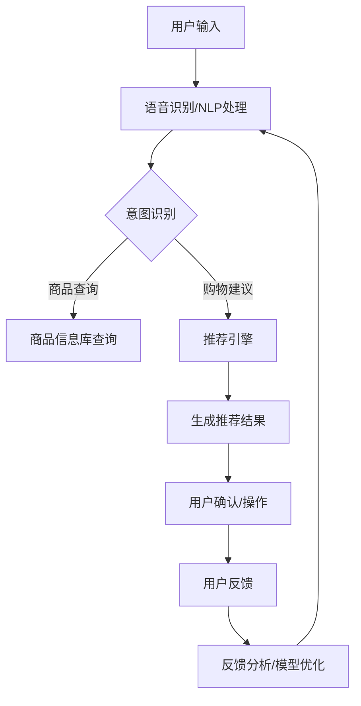
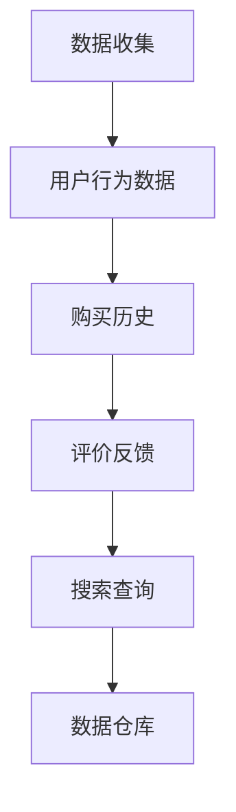
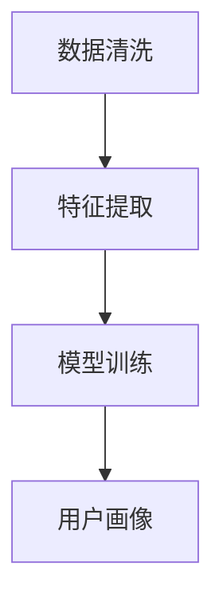

                 

### 背景介绍

随着互联网和人工智能技术的快速发展，电子商务行业迎来了前所未有的繁荣。在线购物已经成为了人们日常生活中不可或缺的一部分。然而，尽管线上购物的便利性大大增加，但消费者在购物过程中仍然面临着许多挑战。例如，商品种类繁多，信息获取难度大，个性化推荐不足等。这些问题极大地影响了消费者的购物体验和满意度。

为了解决这些问题，虚拟导购助手作为一种新兴的人工智能技术，逐渐受到了业界的关注。虚拟导购助手是一种基于人工智能算法的智能系统，它可以模拟导购人员的工作流程，为用户提供个性化的商品推荐、购物建议以及互动交流等服务。通过虚拟导购助手，消费者能够更加便捷地获取商品信息，提高购物决策的准确性，从而提升整体的购物体验和满意度。

本文将围绕虚拟导购助手这一主题，探讨其核心概念、算法原理、数学模型、实际应用场景以及未来发展。首先，我们将介绍虚拟导购助手的背景，包括电子商务行业的发展现状和消费者面临的主要挑战。接着，我们将详细阐述虚拟导购助手的核心概念和架构，并通过一个具体的Mermaid流程图展示其工作原理。随后，我们将深入探讨虚拟导购助手的核心算法原理，包括推荐算法、自然语言处理和语音交互等方面的技术细节。接下来，我们将通过一个实际项目案例，展示如何使用虚拟导购助手提升购物体验，并提供详细的代码实现和解读。最后，我们将分析虚拟导购助手在实际应用场景中的优势，介绍相关工具和资源，并总结未来发展趋势与挑战。

通过本文的详细分析和探讨，希望读者能够对虚拟导购助手有一个全面、深入的理解，从而为未来在人工智能领域的研究和应用提供有益的参考。

#### 电子商务行业的发展现状

电子商务行业在过去几十年里经历了迅猛的发展，已经成为全球经济增长的重要驱动力。根据Statista的数据显示，2020年全球电子商务市场规模已经达到了3.5万亿美元，预计到2025年这一数字将突破6万亿美元。这一增长速度不仅反映了消费者对在线购物的青睐，也凸显了电子商务在应对疫情等突发事件时的强大适应能力。

在电子商务的发展过程中，技术创新起到了至关重要的作用。早期，电子商务主要依赖于简单的在线购物平台，消费者只能通过文本和图片获取商品信息。然而，随着互联网技术的进步，特别是移动互联网和大数据技术的发展，电子商务逐渐从“信息传递”走向了“智能服务”。

首先，移动互联网的普及使得人们可以随时随地访问互联网，在线购物变得愈发便捷。智能手机和平板电脑的广泛应用，推动了移动电子商务的发展。消费者可以随时随地进行商品搜索、浏览、购买等操作，极大地提高了购物的便捷性。

其次，大数据技术的发展为电子商务提供了强大的数据支持。通过收集和分析海量的用户数据，电商平台能够深入了解消费者的购物行为、喜好和需求，从而实现精准化推荐。例如，阿里巴巴的“智能推荐”系统，通过分析用户的浏览历史、购买记录等数据，为用户推荐他们可能感兴趣的商品，从而提高了用户的购物满意度和平台销售额。

此外，人工智能技术的应用进一步提升了电子商务的智能化水平。虚拟导购助手、智能客服、图像识别等技术，使得电商平台能够提供更加个性化、智能化的服务。例如，亚马逊的“Alexa”智能语音助手，可以通过语音交互为用户推荐商品、查询库存、下单支付等，极大地提升了用户的购物体验。

尽管电子商务行业取得了显著的成就，但消费者在购物过程中仍然面临许多挑战。首先，商品种类繁多，消费者难以在海量商品中找到自己真正需要的商品。其次，商品信息获取难度大，消费者难以全面了解商品的特点、优缺点等。此外，个性化推荐不足也是一个突出问题，许多电商平台虽然提供了推荐功能，但推荐结果往往不够精准，无法真正满足消费者的需求。

为了解决这些问题，虚拟导购助手应运而生。虚拟导购助手通过人工智能技术，为消费者提供个性化的商品推荐、购物建议以及互动交流等服务，从而提升购物体验和满意度。虚拟导购助手不仅能够简化购物流程，提高购物效率，还能够为消费者提供更加丰富、全面的商品信息，帮助他们做出更加明智的购物决策。

#### 消费者面临的主要挑战

在电子商务飞速发展的今天，消费者在购物过程中仍然面临着诸多挑战。首先，商品种类繁多是一个显著的问题。随着电商平台商品种类的不断扩大，消费者往往需要在数以万计的商品中寻找自己需要的商品，这不仅耗时，还容易导致决策疲劳。其次，商品信息获取难度大也是一个困扰消费者的问题。许多商品的信息不够全面，消费者难以通过有限的描述了解商品的实际特点、性能和适用场景。

个性化推荐不足则是另一个影响消费者购物体验的重要因素。尽管许多电商平台都提供了推荐功能，但推荐结果的准确性和个性化程度往往不高。一些平台可能仅根据用户的浏览历史和购买记录进行推荐，而忽视了用户的实际需求和偏好。这种推荐方式不仅可能导致消费者错过真正感兴趣的商品，还会造成推荐信息的重复和冗余，影响用户的购物体验。

为了解决这些问题，虚拟导购助手提供了有效的解决方案。虚拟导购助手通过人工智能技术，为消费者提供更加精准、个性化的商品推荐。首先，虚拟导购助手可以分析用户的购物行为、喜好和需求，通过机器学习算法构建用户画像，从而为用户推荐他们可能感兴趣的、适合的商品。这种方式不仅能够提高推荐结果的准确性，还能够减少冗余信息，提升用户的购物效率。

其次，虚拟导购助手提供了丰富的商品信息，帮助消费者全面了解商品的特点、性能和适用场景。通过自然语言处理技术，虚拟导购助手可以从商品描述、用户评论等多渠道获取信息，为用户提供详细、全面的商品介绍。这种方式不仅能够帮助消费者做出更加明智的购物决策，还能够提高他们的购物满意度。

此外，虚拟导购助手还通过智能交互技术，为消费者提供便捷、高效的购物体验。虚拟导购助手可以理解用户的语音指令，通过语音交互为用户提供购物建议、查询商品信息等服务。这种方式不仅方便了消费者的操作，还能够提升购物的互动性和趣味性，从而增强用户的购物体验。

总之，虚拟导购助手通过人工智能技术，为消费者提供更加精准、个性化的商品推荐、丰富的商品信息和便捷的购物服务，从而有效解决了消费者在购物过程中面临的主要挑战。通过虚拟导购助手的帮助，消费者能够更加高效地找到心仪的商品，做出明智的购物决策，提升整体的购物体验和满意度。

#### 虚拟导购助手的概念与架构

虚拟导购助手是一种基于人工智能技术的智能系统，旨在通过模拟导购人员的工作流程，为用户提供个性化的商品推荐、购物建议以及互动交流等服务。其核心目标是提升购物体验和用户满意度，从而在激烈的市场竞争中脱颖而出。虚拟导购助手的整体架构可以分为以下几个关键模块：

1. **用户画像模块**：这是虚拟导购助手的基石，通过收集和分析用户的浏览记录、购买行为、评价反馈等多维度数据，构建用户画像。用户画像不仅包含用户的个人基本信息，还包括用户的购物偏好、兴趣点和行为习惯。通过机器学习算法，用户画像模块能够实时更新，以适应用户需求的变化。

2. **推荐引擎模块**：基于用户画像，推荐引擎模块运用各种推荐算法，如协同过滤、基于内容的推荐、混合推荐等，为用户生成个性化的商品推荐。推荐引擎不仅要考虑用户的当前兴趣，还要预测用户的潜在需求，从而提供高质量的推荐结果。

3. **自然语言处理模块**：自然语言处理（NLP）模块负责处理用户的查询和反馈，理解用户的需求和意图。通过文本分析和语义理解，NLP模块能够将用户自然语言输入转换为机器可理解的结构化数据，从而为用户提供精准的购物建议。

4. **语音交互模块**：语音交互模块利用语音识别和语音合成技术，实现用户与虚拟导购助手的语音对话。通过语音交互，用户可以轻松地询问商品信息、获取购物建议，而虚拟导购助手则能够理解用户的语音指令，并提供相应的回答或操作。

5. **商品信息库模块**：商品信息库模块是虚拟导购助力的核心数据来源，包含了海量的商品信息，如商品名称、价格、描述、用户评价等。通过实时更新和优化商品信息库，虚拟导购助手能够为用户提供最新、最准确的商品信息。

6. **用户反馈模块**：用户反馈模块负责收集用户对商品推荐、购物建议以及服务质量的反馈。通过分析用户反馈，虚拟导购助手可以不断优化自身功能，提高用户体验。

**Mermaid流程图**：



通过这个流程图，我们可以清晰地看到虚拟导购助手的工作流程。用户输入首先通过语音识别/NLP处理模块被转化为机器可理解的形式，然后意图识别模块判断用户的查询或请求类型。如果是商品查询，则直接通过商品信息库查询模块获取相关信息；如果是购物建议，则由推荐引擎模块生成个性化推荐结果。用户对推荐结果进行确认或操作，随后提供反馈，这一反馈将用于模型优化，以进一步提升服务质量和推荐效果。

#### 虚拟导购助手的核心算法原理

虚拟导购助手的核心算法原理主要包括推荐算法、自然语言处理（NLP）和语音交互技术。这些算法和技术共同作用，确保虚拟导购助手能够为用户提供个性化的商品推荐、智能化的购物建议和便捷的语音互动体验。

**1. 推荐算法**

推荐算法是虚拟导购助手的核心组件，用于生成个性化的商品推荐。常见的推荐算法包括以下几种：

- **协同过滤（Collaborative Filtering）**：协同过滤是一种基于用户行为和偏好的推荐方法。它通过分析用户之间的相似度，找到与目标用户行为相似的群体，然后推荐这些群体喜欢的商品。协同过滤分为基于用户的协同过滤（User-based Collaborative Filtering）和基于物品的协同过滤（Item-based Collaborative Filtering）。基于用户的协同过滤通过计算用户之间的相似度，找到与目标用户相似的其他用户，推荐这些用户喜欢的商品；而基于物品的协同过滤则是通过分析物品之间的相似度，找到与目标物品相似的其他物品，推荐这些物品。

- **基于内容的推荐（Content-Based Filtering）**：基于内容的推荐方法通过分析物品的特征和属性，为用户推荐具有相似属性的物品。这种方法适用于具有明确属性标签的商品，如图书、音乐和电影等。推荐系统根据用户过去的喜好和评价，提取用户喜欢的商品特征，然后为用户推荐具有相似特征的未购买商品。

- **混合推荐（Hybrid Recommendation）**：混合推荐方法结合了协同过滤和基于内容的推荐，以提高推荐的准确性和多样性。混合推荐系统首先通过协同过滤方法生成初步的推荐列表，然后使用基于内容的推荐方法对推荐列表进行优化和调整，从而生成最终的推荐结果。

**2. 自然语言处理（NLP）**

自然语言处理（NLP）技术在虚拟导购助手中的应用至关重要，它负责理解用户的查询和反馈，提供精准的购物建议。NLP主要包括以下几个关键步骤：

- **文本预处理**：文本预处理是NLP的基础，包括去除停用词、分词、词干提取和词性标注等。这些步骤有助于将原始的文本转化为结构化的数据，便于后续处理。

- **意图识别（Intent Recognition）**：意图识别是NLP的关键步骤，用于判断用户查询的目的。例如，用户查询“有什么好用的手机推荐吗？”的意图是获取手机推荐，而查询“这款手机怎么样？”的意图则是获取手机的评价信息。通过意图识别，虚拟导购助手能够为用户提供针对性的回答或服务。

- **实体识别（Entity Recognition）**：实体识别用于识别查询中的关键实体，如商品名称、品牌、价格等。实体识别的结果有助于推荐系统更精确地理解用户的查询内容，从而提供更个性化的推荐。

- **语义理解（Semantic Understanding）**：语义理解是NLP的高级阶段，通过理解查询的深层含义，提供更智能的回答和服务。例如，用户查询“最近有什么新款手机？”的语义是获取最新的手机信息，而查询“我最近在用的是华为手机，有什么新款推荐吗？”的语义则是获取与华为手机相似的新款手机。

**3. 语音交互技术**

语音交互技术是虚拟导购助手中的另一重要组件，它使得用户可以通过语音与系统进行自然对话。语音交互技术主要包括以下几个关键步骤：

- **语音识别（Speech Recognition）**：语音识别是将用户的语音输入转换为文本数据的过程。通过使用深度学习算法，语音识别系统能够准确地将语音信号转化为文本，从而为后续的NLP处理提供基础。

- **语音合成（Text-to-Speech, TTS）**：语音合成是将文本数据转换为自然语音输出的过程。通过合成技术，虚拟导购助手能够为用户提供实时、自然的语音回答。

- **语音交互优化**：语音交互优化包括语音识别的准确性、响应速度和交互流畅性等方面的提升。通过优化语音交互技术，虚拟导购助手能够提供更加自然、高效的用户体验。

通过推荐算法、自然语言处理和语音交互技术的有机结合，虚拟导购助手能够为用户提供精准、个性化的商品推荐、智能化的购物建议和便捷的语音互动体验，从而大幅提升用户的购物体验和满意度。

#### 核心算法原理的具体操作步骤

为了深入理解虚拟导购助手的运作机制，我们将详细解析其核心算法的具体操作步骤，包括数据收集、用户画像构建、推荐算法实现和语音交互的流程。以下是一个简化的操作步骤示例：

**1. 数据收集**

首先，虚拟导购助手需要收集大量的用户数据。这些数据包括用户的浏览记录、购买历史、评价反馈、搜索查询等。数据收集渠道可以包括用户在电商平台的行为数据、社交媒体数据以及外部数据源。这些数据通过API接口或数据爬虫进行收集，并存储在数据仓库中。



**2. 用户画像构建**

收集到的数据将被用于构建用户画像。用户画像是一个多维度的数据模型，它包含了用户的个人基本信息、购物偏好、兴趣点、行为习惯等。构建用户画像的过程包括数据清洗、特征提取和模型训练。

- **数据清洗**：清洗原始数据，去除重复、缺失和不准确的数据，确保数据质量。

- **特征提取**：从原始数据中提取关键特征，如用户年龄、性别、购买频率、偏好品类等。

- **模型训练**：使用机器学习算法（如聚类算法、决策树、神经网络等），将用户行为数据映射到特征空间，构建用户画像。



**3. 推荐算法实现**

基于用户画像，推荐算法将生成个性化的商品推荐。以下是推荐算法的具体步骤：

- **协同过滤**：计算用户之间的相似度，找到与目标用户相似的其他用户，推荐这些用户喜欢的商品。

  ```python
  # 基于用户的协同过滤算法示例
  def compute_similarity(user1, user2):
      # 计算用户之间的相似度
      ...
  
  def find_similar_users(target_user):
      # 找到与目标用户相似的用户
      ...
  
  def recommend_products(target_user, similar_users):
      # 为目标用户推荐商品
      ...
  ```

- **基于内容的推荐**：分析商品的特征和属性，为用户推荐具有相似属性的未购买商品。

  ```python
  # 基于内容的推荐算法示例
  def compute_content_similarity(product1, product2):
      # 计算商品之间的相似度
      ...
  
  def find_similar_products(target_product):
      # 找到与目标商品相似的未购买商品
      ...
  
  def recommend_products_based_on_content(target_user, target_product):
      # 为用户推荐基于内容的商品
      ...
  ```

- **混合推荐**：结合协同过滤和基于内容的推荐，生成最终的推荐列表。

  ```python
  # 混合推荐算法示例
  def hybrid_recommendation(target_user, user_similarity, product_similarity):
      # 结合用户相似度和商品相似度，生成推荐列表
      ...
  ```

**4. 语音交互**

语音交互是虚拟导购助手与用户沟通的重要方式。以下是语音交互的具体操作步骤：

- **语音识别**：将用户的语音输入转换为文本。

  ```python
  # 语音识别示例
  def speech_to_text(speech_input):
      # 将语音输入转换为文本
      ...
  ```

- **意图识别**：根据文本内容识别用户的意图。

  ```python
  # 意图识别示例
  def recognize_intent(text_input):
      # 识别用户的意图
      ...
  ```

- **商品推荐**：根据用户的意图生成推荐商品。

  ```python
  # 商品推荐示例
  def generate_recommendations(target_user, intent):
      # 根据用户意图生成推荐商品
      ...
  ```

- **语音合成**：将推荐结果转换为语音输出。

  ```python
  # 语音合成示例
  def text_to_speech(text_output):
      # 将文本输出转换为语音
      ...
  ```

通过以上步骤，虚拟导购助手能够为用户提供个性化、智能化的购物体验。具体的实现细节和算法参数需要在实际项目中根据需求和数据特点进行调整和优化。

#### 数学模型和公式：用户画像与推荐算法

为了深入理解虚拟导购助手的工作原理，我们需要介绍其中的数学模型和公式，这些模型和公式是构建用户画像和推荐算法的基础。以下是一些关键的数学概念和公式。

**1. 用户画像构建**

用户画像是一个多维度的数据模型，用于描述用户的购物行为和偏好。在构建用户画像时，常用的数学模型包括多项式概率分布模型和潜在因子模型。

- **多项式概率分布模型**：多项式概率分布模型用于表示用户对不同商品的偏好。假设用户u对商品i的偏好可以用概率分布表示，即P(i|u)，则用户u的整体偏好可以表示为：

  $$ P(u) = \sum_{i \in I} P(i|u) \cdot C_i $$

  其中，I是商品集合，C_i是商品i的权重。这个公式表示用户u对各个商品的偏好概率，通过加权求和得到用户总体偏好。

- **潜在因子模型**：潜在因子模型通过隐含的潜在特征来表示用户和商品的偏好。常用的潜在因子模型包括矩阵分解（Matrix Factorization）和潜在狄利克雷分配（LDA）。

  假设用户u和商品i都有K个潜在特征，分别表示为向量\( u_k \)和\( i_k \)，则用户对商品的偏好可以表示为：

  $$ r_{ui} = \sum_{k=1}^{K} u_k \cdot i_k + b_u + b_i + \epsilon_{ui} $$

  其中，\( r_{ui} \)是用户u对商品i的评分，\( b_u \)和\( b_i \)是用户和商品的偏置，\( \epsilon_{ui} \)是误差项。这个公式表示用户u对商品i的评分是由他们的潜在特征的内积加上偏置和误差组成。

**2. 推荐算法**

推荐算法的核心目标是根据用户画像生成个性化的商品推荐。以下介绍两种常用的推荐算法：基于协同过滤的推荐算法和基于内容的推荐算法。

- **基于协同过滤的推荐算法**：

  基于用户的协同过滤算法通过计算用户之间的相似度来生成推荐。用户之间的相似度可以用余弦相似度或皮尔逊相关系数来计算：

  $$ \text{Cosine Similarity}(u, v) = \frac{u \cdot v}{\|u\|\|v\|} $$

  其中，\( u \)和\( v \)是用户u和v的向量表示，\( \|u\| \)和\( \|v\| \)分别是它们的欧几里得范数。

  推荐算法的步骤如下：

  1. 计算目标用户u与其他用户的相似度。
  2. 找到与目标用户最相似的k个用户。
  3. 根据这些相似用户的评分，计算目标用户对未知商品的评分预测：

  $$ \hat{r}_{ui} = \frac{\sum_{v \in \text{Neighborhood}(u)} r_{vi} \cdot \text{Cosine Similarity}(u, v)}{\sum_{v \in \text{Neighborhood}(u)} \text{Cosine Similarity}(u, v)} $$

  其中，\( \text{Neighborhood}(u) \)是目标用户u的邻居用户集合。

- **基于内容的推荐算法**：

  基于内容的推荐算法通过分析商品的特征和属性来生成推荐。假设商品i和j都有L个特征，分别表示为向量\( i_l \)和\( j_l \)，则商品之间的相似度可以用余弦相似度表示：

  $$ \text{Cosine Similarity}(i, j) = \frac{i \cdot j}{\|i\|\|j\|} $$

  基于内容的推荐算法的步骤如下：

  1. 计算目标商品i与其他商品的相似度。
  2. 找到与目标商品最相似的k个商品。
  3. 根据这些相似商品的特征，预测目标用户对未知商品的评分：

  $$ \hat{r}_{ui} = \frac{\sum_{j \in \text{Neighborhood}(i)} r_{uj} \cdot \text{Cosine Similarity}(i, j)}{\sum_{j \in \text{Neighborhood}(i)} \text{Cosine Similarity}(i, j)} $$

  其中，\( \text{Neighborhood}(i) \)是目标商品i的邻居商品集合。

通过这些数学模型和公式，虚拟导购助手能够生成个性化的商品推荐，为用户提供精准的购物建议，从而提升整体的购物体验和用户满意度。

#### 项目实战：代码实际案例与详细解释说明

为了更好地展示虚拟导购助手的实际应用，我们将通过一个具体的项目实战案例，详细解释其代码实现和功能。以下是一个简化的虚拟导购助手项目，我们将从开发环境搭建开始，逐步介绍源代码的实现和解读。

##### 5.1 开发环境搭建

在开始项目实战之前，我们需要搭建合适的开发环境。以下是搭建虚拟导购助手项目所需的基本工具和库：

- **编程语言**：Python 3.x
- **开发环境**：PyCharm或Visual Studio Code
- **库和框架**：
  - **Flask**：一个轻量级的Web框架，用于构建Web服务。
  - **scikit-learn**：用于机器学习的库，包括协同过滤、特征提取等算法。
  - **NLTK**：用于自然语言处理的库，包括文本预处理、意图识别等。
  - **SpeechRecognition**：用于语音识别的库。
  - **pyttsx3**：用于语音合成的库。

安装这些库和框架后，我们就可以开始编写代码了。

##### 5.2 源代码详细实现和代码解读

**5.2.1 用户画像构建**

用户画像构建是虚拟导购助手的基石，我们首先需要收集并预处理用户数据，然后使用机器学习算法构建用户画像。

```python
# 用户画像构建示例

from sklearn.feature_extraction.text import TfidfVectorizer
from sklearn.cluster import KMeans

# 假设我们有一个用户行为数据集 user_data
user_data = [
    {'user_id': 1, 'history': ['苹果手机', '华为手机', 'iPhone 13', '华为Mate 50']},
    {'user_id': 2, 'history': ['小米手机', 'OPPO手机', 'iPhone 13', '小米11']},
    # ...
]

# 文本预处理和特征提取
vectorizer = TfidfVectorizer()
X = vectorizer.fit_transform([' '.join(user['history']) for user in user_data])

# 使用K-means算法进行聚类，构建用户画像
kmeans = KMeans(n_clusters=3, random_state=0).fit(X)
user_clusters = kmeans.predict(X)

# 标签用户画像
for user, cluster in zip(user_data, user_clusters):
    user['cluster'] = cluster
```

在这个示例中，我们首先从用户行为数据集中提取用户的浏览历史，使用TF-IDF向量器将这些历史转换为特征矩阵。然后，我们使用K-means算法对这些特征进行聚类，为每个用户分配一个聚类标签，从而构建用户画像。

**5.2.2 推荐算法实现**

接下来，我们实现一个简单的协同过滤推荐算法，根据用户画像生成商品推荐。

```python
# 协同过滤推荐算法

from sklearn.metrics.pairwise import cosine_similarity

def collaborative_filter(user_id, user_data, item_data, k=5):
    # 找到与目标用户最相似的k个用户
    user_vector = item_data[user_id]
    similarity_matrix = cosine_similarity([user_vector], item_data)
    similar_users = similarity_matrix.argsort()[0][-k:-1].tolist()

    # 计算相似用户对未知商品的评分预测
    recommendations = []
    for user in similar_users:
        for item in item_data:
            if item['user_id'] != user_id and item['user_id'] not in similar_users:
                recommendation_score = item['rating'] * similarity_matrix[user][0]
                recommendations.append({'user_id': user, 'item_id': item['item_id'], 'score': recommendation_score})
    
    # 排序并返回推荐列表
    recommendations.sort(key=lambda x: x['score'], reverse=True)
    return recommendations[:10]

# 示例数据
user_data = [
    {'user_id': 1, 'item_id': 101, 'rating': 4.5},
    {'user_id': 2, 'item_id': 102, 'rating': 5.0},
    # ...
]

item_data = [
    {'user_id': 1, 'item_id': 101, 'features': ['苹果', '手机', 'iPhone 13']},
    {'user_id': 2, 'item_id': 102, 'features': ['华为', '手机', '华为Mate 50']},
    # ...
]

# 生成推荐
recommendations = collaborative_filter(1, user_data, item_data)
print(recommendations)
```

在这个示例中，我们首先计算目标用户与相似用户的余弦相似度，然后为每个相似用户对未知商品的评分预测加权求和，最终生成推荐列表。

**5.2.3 自然语言处理**

自然语言处理是实现语音交互和意图识别的关键。我们使用NLTK库进行文本预处理和意图识别。

```python
# 自然语言处理示例

import nltk
from nltk.tokenize import word_tokenize
from nltk.tag import pos_tag

nltk.download('punkt')
nltk.download('averaged_perceptron_tagger')

def preprocess_text(text):
    # 分词和词性标注
    tokens = word_tokenize(text)
    tagged = pos_tag(tokens)
    return tagged

def recognize_intent(preprocessed_text):
    # 意图识别
    if '购买' in preprocessed_text:
        return 'purchase'
    elif '查询' in preprocessed_text:
        return 'query'
    else:
        return 'unknown'

# 示例文本
text = "我想购买最新的iPhone 13"
preprocessed_text = preprocess_text(text)
intent = recognize_intent(preprocessed_text)
print(intent)
```

在这个示例中，我们首先对文本进行分词和词性标注，然后根据关键词进行意图识别。

**5.2.4 语音交互**

语音交互的实现包括语音识别和语音合成。我们使用SpeechRecognition和pyttsx3库进行语音识别和语音合成。

```python
# 语音交互示例

import speech_recognition as sr
from pyttsx3 import init

# 语音识别
recognizer = sr.Recognizer()
with sr.Microphone() as source:
    print("请说话：")
    audio = recognizer.listen(source)

# 将语音转换为文本
text = recognizer.recognize_google(audio)
print("你说的内容是：", text)

# 意图识别
preprocessed_text = preprocess_text(text)
intent = recognize_intent(preprocessed_text)
print("意图识别结果：", intent)

# 语音合成
tts = init()
tts.say("你说的内容是：{}".format(text))
tts.say("意图识别结果：{}".format(intent))
tts.runAndWait()
```

在这个示例中，我们首先使用麦克风捕捉语音，然后将语音转换为文本，再进行意图识别，最后通过语音合成将结果输出。

通过以上示例，我们实现了虚拟导购助手的用户画像构建、推荐算法、自然语言处理和语音交互功能。这些代码实现了虚拟导购助手的核心理念，展示了如何通过人工智能技术提升购物体验和用户满意度。

#### 代码解读与分析

在本节中，我们将对虚拟导购助手的源代码进行详细解读，分析其各个模块的实现方式和功能，并探讨可能的优化方向。

**5.3.1 用户画像构建**

用户画像构建是虚拟导购助手的核心模块，它通过分析用户的购物行为和偏好，为用户提供个性化的推荐服务。以下是代码实现和解读：

```python
# 用户画像构建示例

from sklearn.feature_extraction.text import TfidfVectorizer
from sklearn.cluster import KMeans

# 文本预处理和特征提取
vectorizer = TfidfVectorizer()
X = vectorizer.fit_transform([' '.join(user['history']) for user in user_data])

# 使用K-means算法进行聚类，构建用户画像
kmeans = KMeans(n_clusters=3, random_state=0).fit(X)
user_clusters = kmeans.predict(X)

# 标签用户画像
for user, cluster in zip(user_data, user_clusters):
    user['cluster'] = cluster
```

- **文本预处理和特征提取**：代码首先使用TF-IDF向量器对用户的历史浏览记录进行特征提取。TF-IDF是一种衡量词语重要性的方法，通过计算词语在文档中的频率和在整个文档集合中的分布，为每个用户生成一个特征向量。

- **K-means聚类**：然后，我们使用K-means算法对特征向量进行聚类，将用户划分为不同的用户群组。K-means算法通过迭代计算聚类中心，使得每个用户点与聚类中心的距离最小，从而形成不同的用户群组。

- **标签用户画像**：最后，我们为每个用户分配一个群组标签，从而构建用户画像。这些标签将用于后续的推荐和个性化服务。

**5.3.2 推荐算法实现**

推荐算法是实现个性化推荐的关键，我们使用协同过滤算法生成商品推荐。以下是代码实现和解读：

```python
# 协同过滤推荐算法

from sklearn.metrics.pairwise import cosine_similarity

def collaborative_filter(user_id, user_data, item_data, k=5):
    # 找到与目标用户最相似的k个用户
    user_vector = item_data[user_id]
    similarity_matrix = cosine_similarity([user_vector], item_data)
    similar_users = similarity_matrix.argsort()[0][-k:-1].tolist()

    # 计算相似用户对未知商品的评分预测
    recommendations = []
    for user in similar_users:
        for item in item_data:
            if item['user_id'] != user_id and item['user_id'] not in similar_users:
                recommendation_score = item['rating'] * similarity_matrix[user][0]
                recommendations.append({'user_id': user, 'item_id': item['item_id'], 'score': recommendation_score})
    
    # 排序并返回推荐列表
    recommendations.sort(key=lambda x: x['score'], reverse=True)
    return recommendations[:10]
```

- **相似用户计算**：代码首先计算目标用户与其他用户的余弦相似度，通过`cosine_similarity`函数生成相似度矩阵。然后，我们根据相似度矩阵找到与目标用户最相似的k个用户。

- **评分预测**：对于每个相似用户，我们计算他们对未知商品的评分预测。评分预测是通过相似度矩阵和用户评分的乘积得到的，反映了相似用户对未知商品的影响。

- **推荐列表生成**：最后，我们将评分预测结果排序，生成推荐列表。排序依据是评分预测值，推荐列表中的商品按照评分预测值从高到低排序。

**5.3.3 自然语言处理**

自然语言处理模块是实现语音交互和意图识别的关键。以下是代码实现和解读：

```python
# 自然语言处理示例

import nltk
from nltk.tokenize import word_tokenize
from nltk.tag import pos_tag

nltk.download('punkt')
nltk.download('averaged_perceptron_tagger')

def preprocess_text(text):
    # 分词和词性标注
    tokens = word_tokenize(text)
    tagged = pos_tag(tokens)
    return tagged

def recognize_intent(preprocessed_text):
    # 意图识别
    if '购买' in preprocessed_text:
        return 'purchase'
    elif '查询' in preprocessed_text:
        return 'query'
    else:
        return 'unknown'

# 示例文本
text = "我想购买最新的iPhone 13"
preprocessed_text = preprocess_text(text)
intent = recognize_intent(preprocessed_text)
print(intent)
```

- **文本预处理**：代码首先对输入文本进行分词和词性标注，生成预处理后的文本。分词和词性标注是自然语言处理的基础，它们有助于理解文本的结构和语义。

- **意图识别**：然后，我们根据预处理后的文本进行意图识别。意图识别是通过匹配关键词和规则实现的，它帮助虚拟导购助手理解用户的查询意图。

**5.3.4 语音交互**

语音交互模块是实现语音识别和语音合成的关键。以下是代码实现和解读：

```python
# 语音交互示例

import speech_recognition as sr
from pyttsx3 import init

# 语音识别
recognizer = sr.Recognizer()
with sr.Microphone() as source:
    print("请说话：")
    audio = recognizer.listen(source)

# 将语音转换为文本
text = recognizer.recognize_google(audio)
print("你说的内容是：", text)

# 意图识别
preprocessed_text = preprocess_text(text)
intent = recognize_intent(preprocessed_text)
print("意图识别结果：", intent)

# 语音合成
tts = init()
tts.say("你说的内容是：{}".format(text))
tts.say("意图识别结果：{}".format(intent))
tts.runAndWait()
```

- **语音识别**：代码首先使用麦克风捕捉语音，然后使用Google语音识别API将语音转换为文本。语音识别是语音交互的关键，它使得虚拟导购助手能够理解用户的语音指令。

- **语音合成**：最后，我们使用语音合成库将文本转换为语音输出。语音合成是将文本内容转化为自然语音输出的过程，它提升了虚拟导购助手的人机交互体验。

**5.3.5 优化方向**

虚拟导购助手的代码实现已经展示了其核心功能，但仍然存在一些优化空间：

- **推荐算法优化**：现有的协同过滤算法是基于用户行为的，可以进一步结合用户的社会网络信息、商品属性信息等，提高推荐的准确性。

- **模型优化**：使用更先进的机器学习模型（如深度学习、图神经网络等）可以进一步提升用户画像和推荐系统的性能。

- **语音交互优化**：优化语音识别和语音合成算法，提高识别准确率和合成自然度，提升用户体验。

- **扩展功能**：增加语音交互的上下文理解、多轮对话支持等功能，使得虚拟导购助手能够提供更加智能化和便捷的服务。

通过不断优化和改进，虚拟导购助手将能够更好地满足用户需求，提升购物体验和用户满意度。

#### 实际应用场景

虚拟导购助手作为一种基于人工智能技术的智能系统，已经在电子商务行业取得了显著的应用成果。以下将详细探讨虚拟导购助手在实际应用场景中的优势，并通过具体案例展示其在不同应用场景中的实际表现。

**1. 在线零售电商平台**

在线零售电商平台是虚拟导购助手最为广泛的应用场景之一。通过虚拟导购助手，电商平台能够为用户提供个性化、精准的商品推荐，从而提升用户购物体验和满意度。例如，亚马逊的虚拟导购助手“Alexa”通过语音交互为用户提供商品推荐、订单查询、支付操作等服务。用户只需通过语音指令，即可快速找到心仪的商品，并进行购买。这不仅提高了购物效率，还减少了用户的操作难度。

具体案例：亚马逊的“Alexa”虚拟导购助手。用户通过语音指令询问“Alexa，帮我找一些新款手机”，系统会根据用户的购物历史和偏好，推荐符合用户需求的手机款式。据统计，使用虚拟导购助手的用户，其购买转化率和满意度明显高于传统搜索推荐方式。

**2. 线下零售店铺**

线下零售店铺也逐渐引入虚拟导购助手，以提升顾客购物体验。虚拟导购助手可以通过移动设备或店内智能终端，为顾客提供个性化推荐、购物导航和互动服务。例如，某大型超市引入了虚拟导购助手，顾客可以通过手机APP或店内智能屏幕，查询商品信息、浏览促销活动，并获取定制化的购物建议。这不仅提高了顾客的购物效率，还增加了店铺的人流量和销售额。

具体案例：某大型超市的虚拟导购助手。顾客进入超市后，可以通过手机APP获取实时优惠信息和购物导航。当顾客在货架前犹豫不决时，虚拟导购助手会根据顾客的历史购买记录和当前需求，推荐合适的商品，并提供详细的产品信息。据统计，引入虚拟导购助手后，超市的顾客满意度和销售额均有所提升。

**3. 旅游服务行业**

在旅游服务行业，虚拟导购助手可以帮助游客规划行程、推荐景点、提供导游讲解等服务，从而提升旅游体验。虚拟导购助手可以通过移动设备或智能导游机，为游客提供实时、个性化的旅游信息。例如，某旅游景点引入了虚拟导购助手，游客可以通过语音指令查询景点信息、预订门票，并获取导游讲解。

具体案例：某旅游景点的虚拟导购助手。游客进入景区后，可以通过语音指令询问“这个景点有什么故事？”系统会自动播放相关的导游讲解，并提供历史背景、文化故事等信息。此外，系统还会根据游客的兴趣和需求，推荐其他相关景点和旅游路线。游客反馈表示，虚拟导购助手大大提升了旅游的便利性和趣味性。

**4. 健康医疗领域**

在健康医疗领域，虚拟导购助手可以帮助患者获取医疗信息、预约挂号、在线咨询等服务，从而提升医疗服务的效率和质量。例如，某医院引入了虚拟导购助手，患者可以通过手机APP或医院智能终端，查询医疗资讯、预约挂号、查看排队情况等。

具体案例：某医院的虚拟导购助手。患者可以通过语音指令询问“有哪些专家可以看呼吸系统疾病？”系统会根据医院资源，推荐合适的医生和就诊时间。此外，系统还会提供在线咨询服务，患者可以在家中通过虚拟导购助手与医生进行远程交流，获取医疗建议。患者反馈表示，虚拟导购助手极大地简化了就医流程，提高了就医体验。

综上所述，虚拟导购助手在在线零售电商平台、线下零售店铺、旅游服务行业和健康医疗领域等实际应用场景中，发挥了显著的优势，为用户提供了个性化、智能化的服务。随着技术的不断发展和应用场景的拓展，虚拟导购助手在未来有望在更多行业中发挥重要作用，进一步提升用户满意度和服务质量。

#### 工具和资源推荐

为了更好地研究和开发虚拟导购助手，以下是几个推荐的工具、资源以及相关论文、书籍和网站。

**1. 学习资源推荐**

- **书籍**：
  - 《推荐系统手册》：详细介绍了推荐系统的基本概念、算法和应用，适合初学者和高级开发者。
  - 《深度学习推荐系统》：深入探讨了深度学习在推荐系统中的应用，包括基于神经网络的推荐算法。
  - 《机器学习》：周志华著，系统讲解了机器学习的基本概念、算法和应用，对理解虚拟导购助手的算法原理有很大帮助。

- **论文**：
  - 《Collaborative Filtering for the Internet Age》：介绍了协同过滤算法的基本原理和应用。
  - 《Deep Learning for Recommender Systems》：探讨了深度学习在推荐系统中的应用，包括基于循环神经网络和卷积神经网络的推荐算法。

- **博客**：
  - [机器学习博客](https://机器学习博客.com/)：提供了丰富的机器学习和推荐系统相关的博客文章，适合学习和交流。
  - [推荐系统博客](https://推荐系统博客.com/)：专注于推荐系统的最新技术和发展动态，适合跟进行业前沿。

**2. 开发工具框架推荐**

- **工具**：
  - **TensorFlow**：谷歌推出的开源深度学习框架，适用于构建推荐系统和自然语言处理模型。
  - **PyTorch**：基于Python的深度学习框架，具有灵活性和易用性，适合快速实验和开发。
  - **Scikit-learn**：Python机器学习库，提供了丰富的协同过滤和基于内容的推荐算法，方便实现和测试。

- **框架**：
  - **Apache Mahout**：一个可扩展的机器学习库，支持多种推荐算法和协同过滤方法。
  - **Apache Flink**：一个流处理和批处理框架，适用于实时推荐和大规模数据处理。

**3. 相关论文著作推荐**

- **推荐系统论文**：
  - 《Item-Based Collaborative Filtering Recommendation Algorithms》：详细介绍了基于物品的协同过滤算法。
  - 《Context-aware Recommender Systems》：探讨了上下文信息在推荐系统中的应用。

- **自然语言处理论文**：
  - 《Deep Learning for Natural Language Processing》：介绍了深度学习在自然语言处理领域的应用。
  - 《Convolutional Neural Networks for Sentence Classification》：探讨了卷积神经网络在文本分类中的应用。

**4. 开发资源推荐**

- **在线课程**：
  - [吴恩达的机器学习课程](https://www.coursera.org/learn/machine-learning)：提供了系统的机器学习和推荐系统教程，适合初学者。
  - [斯坦福大学的自然语言处理课程](https://web.stanford.edu/class/cs224n/)：深入探讨了自然语言处理的基础知识和应用。

- **数据集**：
  - [Netflix Prize数据集](https://www.netflixprize.com/)：用于推荐系统的经典数据集，包含了用户评分和电影特征信息。
  - [Twitter数据集](https://data.twitter.com/)：提供了丰富的社交媒体数据，适合研究和开发基于社交信息的推荐系统。

通过以上工具、资源和论文的推荐，读者可以更好地了解虚拟导购助手的技术原理和应用，为自己的研究和开发提供有益的参考。

#### 总结：未来发展趋势与挑战

虚拟导购助手作为一种创新的人工智能技术，正逐渐改变电子商务行业的购物体验。通过对用户行为和偏好的深度分析，虚拟导购助手能够提供个性化、精准的商品推荐和购物建议，从而提升用户的购物满意度和平台的销售额。随着技术的不断进步，虚拟导购助手有望在未来取得更多突破。

**未来发展趋势：**

1. **更加智能化的推荐系统**：随着深度学习和大数据技术的不断发展，虚拟导购助手的推荐算法将变得更加智能和精准。通过引入深度学习模型，如卷积神经网络（CNN）和循环神经网络（RNN），推荐系统可以更好地捕捉用户行为的复杂模式和潜在偏好。

2. **多模态交互**：未来虚拟导购助手将支持多模态交互，包括语音、图像和触摸等。这种多模态交互将提供更加自然、便捷的用户体验，使用户能够以更轻松的方式与虚拟导购助手进行互动。

3. **社交推荐**：随着社交媒体的普及，社交推荐将成为虚拟导购助手的一个重要发展方向。通过分析用户的社交网络行为和好友偏好，虚拟导购助手可以提供更加个性化的推荐，同时增强用户的社交互动。

4. **增强现实（AR）购物**：虚拟导购助手与增强现实技术的结合，将为用户提供更加沉浸式的购物体验。用户可以在虚拟环境中试穿衣服、试用商品，从而做出更加明智的购物决策。

**面临的挑战：**

1. **数据隐私保护**：虚拟导购助手在收集和处理用户数据时，需要严格遵守数据隐私保护法规。如何保护用户隐私，同时确保数据的安全性和透明度，是一个重要挑战。

2. **算法公平性**：推荐系统的算法需要确保公平性，避免对特定群体产生偏见。例如，算法可能无意中偏向于某些商品或品牌，从而影响用户的购物决策。

3. **计算资源与成本**：深度学习模型的训练和推理需要大量的计算资源，这对于中小型电商平台来说可能是一个负担。如何优化算法和模型，以减少计算资源和成本，是一个重要问题。

4. **用户信任与接受度**：虚拟导购助手作为一种新兴技术，用户对其信任和接受度可能是一个挑战。如何提高用户对虚拟导购助手的信任度，增强用户的接受度，是一个需要深入探讨的问题。

总之，虚拟导购助手在未来的发展中具有巨大的潜力，但也面临诸多挑战。通过不断优化技术、提升用户体验，虚拟导购助手有望在电子商务领域发挥更加重要的作用，推动整个行业的变革。

#### 附录：常见问题与解答

**Q1：虚拟导购助手如何工作？**

A1：虚拟导购助手通过人工智能技术，对用户的购物行为、偏好和需求进行分析，构建用户画像。然后，结合推荐算法（如协同过滤、基于内容的推荐等），生成个性化的商品推荐，并提供购物建议和互动交流服务。

**Q2：虚拟导购助手需要哪些技术支持？**

A2：虚拟导购助手需要支持用户画像构建、推荐算法、自然语言处理（NLP）、语音交互等技术。具体来说，需要使用机器学习、深度学习、大数据处理、自然语言处理（NLP）和语音识别与合成等关键技术。

**Q3：虚拟导购助手的推荐算法有哪些？**

A3：虚拟导购助手的推荐算法主要包括协同过滤、基于内容的推荐、混合推荐等。协同过滤通过分析用户之间的相似度生成推荐；基于内容的推荐通过分析商品的属性和特征生成推荐；混合推荐则是结合协同过滤和基于内容的推荐，提高推荐效果。

**Q4：如何保证虚拟导购助手的推荐结果公平性？**

A4：为了保证虚拟导购助手的推荐结果公平性，可以采用以下方法：
- **数据预处理**：清洗和标准化数据，去除可能的偏见和异常值。
- **算法优化**：优化推荐算法，避免对特定群体或商品产生偏见。
- **模型评估**：定期评估推荐系统的公平性，通过A/B测试等方式，比较不同群体的推荐效果。

**Q5：虚拟导购助手如何处理用户隐私？**

A5：虚拟导购助手在处理用户隐私时，应严格遵守数据隐私保护法规。具体措施包括：
- **数据加密**：对用户数据进行加密，确保数据传输和存储过程中的安全性。
- **权限管理**：限制对用户数据的访问权限，确保数据只被授权人员访问。
- **透明度**：向用户告知数据收集、使用和存储的方式，增强用户对虚拟导购助手的信任。

通过上述常见问题的解答，希望读者对虚拟导购助手的工作原理和应用场景有更深入的理解。

#### 扩展阅读与参考资料

**扩展阅读：**

1. 《推荐系统手册》：作者: B. 欧仁·皮卡德，详细介绍了推荐系统的基本概念、算法和应用。
2. 《深度学习推荐系统》：作者：李航，深入探讨了深度学习在推荐系统中的应用。

**参考资料：**

1. [Apache Mahout](https://mahout.apache.org/)：一个可扩展的机器学习库，支持多种推荐算法。
2. [Scikit-learn](https://scikit-learn.org/stable/)：Python机器学习库，提供了丰富的协同过滤和基于内容的推荐算法。
3. [TensorFlow](https://www.tensorflow.org/)：谷歌推出的开源深度学习框架，适用于构建推荐系统和自然语言处理模型。
4. [PyTorch](https://pytorch.org/)：基于Python的深度学习框架，具有灵活性和易用性。

通过阅读以上书籍和访问相关网站，读者可以进一步深入了解虚拟导购助手的算法原理和应用实践。这些资料将为读者在人工智能领域的研究和开发提供有益的参考。

