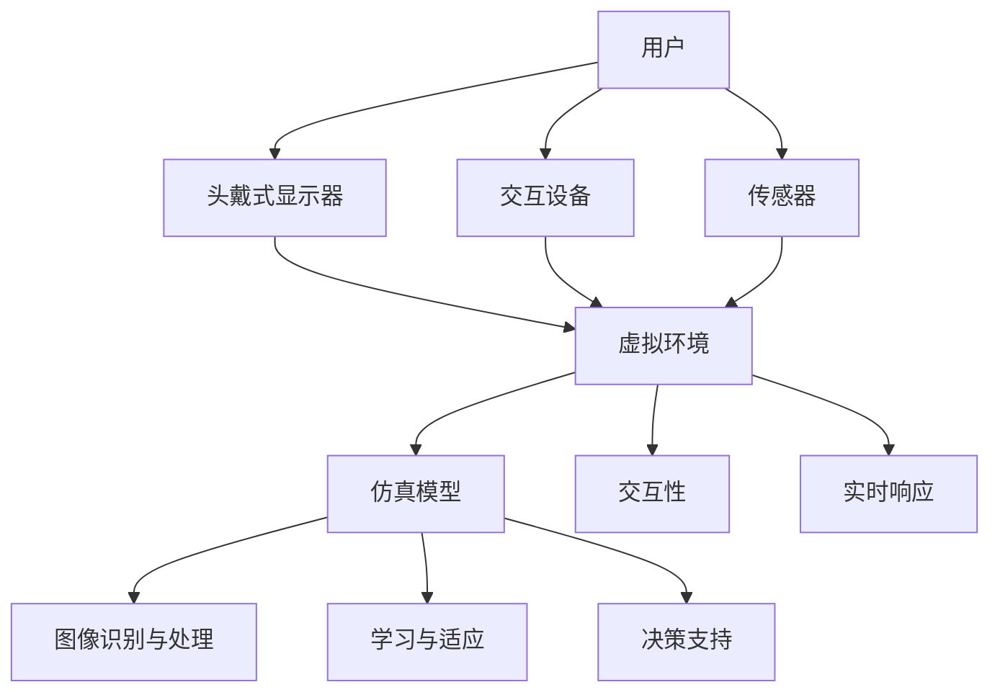

                 

# 虚拟现实在医疗培训中的应用

## 摘要

虚拟现实（VR）技术在医疗培训中正逐渐成为一种强有力的工具。通过为医学生和专业人士提供一个高度仿真、交互性的学习环境，VR技术能够显著提升培训效果，减少培训成本，并降低真实操作带来的风险。本文将深入探讨虚拟现实在医疗培训中的应用，包括其核心概念与联系、算法原理、数学模型、项目实战、实际应用场景、工具与资源推荐以及未来发展趋势与挑战。

## 1. 背景介绍

虚拟现实（Virtual Reality，VR）是一种通过计算机技术模拟出一个三维虚拟环境，使用户能够与之进行自然交互的技术。自20世纪90年代以来，随着计算能力的提升和显示技术的进步，VR技术逐渐走向成熟。在医疗领域，虚拟现实的应用范围日益广泛，从医学教学、手术模拟到心理治疗等。

医疗培训中引入虚拟现实技术具有重要意义。首先，VR技术可以提供一个安全、无风险的学习环境，医学生和专业人士可以在虚拟环境中进行多次实践，降低真实操作中的失误风险。其次，VR培训可以显著提高学习效率，通过高度仿真和互动性，使得培训过程更加生动、直观，有助于知识的深刻理解和记忆。此外，虚拟现实技术还能显著降低培训成本，例如，模拟手术所需的设备远低于真实手术所需的设备。

本文将围绕虚拟现实在医疗培训中的应用，详细探讨其核心概念、算法原理、数学模型、项目实战、实际应用场景、工具与资源推荐以及未来发展趋势与挑战。

## 2. 核心概念与联系

在深入探讨虚拟现实在医疗培训中的应用之前，我们需要理解一些核心概念和其相互联系。

### 虚拟现实技术基础

虚拟现实技术主要包括三个关键组成部分：头戴式显示器（HMD）、交互设备和传感器。

- **头戴式显示器（HMD）**：HMD是用户感知虚拟环境的核心设备，它通常通过光学或电子手段将虚拟环境呈现在用户的视野中。例如，Oculus Rift、HTC Vive等设备。

- **交互设备**：交互设备允许用户在虚拟环境中进行自然交互，例如，手柄、手套、全身跟踪器等。这些设备能够捕捉用户的动作，将之转换为虚拟环境中的相应动作。

- **传感器**：传感器用于监测用户的动作和环境变化，如位置、方向、姿态等。常见的传感器包括红外传感器、超声波传感器、摄像头等。

### 虚拟环境与仿真模型

虚拟环境是虚拟现实技术的核心，它是通过计算机技术构建的三维数字世界。虚拟环境需要具备高真实感、高交互性，以及实时响应的能力。

- **仿真模型**：仿真模型是虚拟环境中对实际物理世界的模拟，例如，人体器官的仿真模型、手术器械的仿真模型等。这些模型需要高度精确，以便于模拟真实操作。

- **交互性**：虚拟环境中的交互性是指用户与虚拟环境之间的互动能力。高交互性意味着用户可以自由探索虚拟环境，与虚拟环境中的对象进行交互。

- **实时响应**：实时响应是指虚拟环境能够实时地反映用户的动作和环境变化。这对于医疗培训尤为重要，因为医学生和专业人士需要实时地了解他们的操作结果。

### 人工智能与虚拟现实

人工智能（AI）在虚拟现实中的应用也越来越广泛，尤其是在医疗培训中。

- **图像识别与处理**：AI可以通过图像识别和处理技术，对虚拟环境中的图像进行分析，提供更为精确的反馈。

- **学习与适应**：AI可以学习用户的操作习惯，并相应地调整虚拟环境的难度和交互方式，以提供个性化的培训体验。

- **决策支持**：AI可以提供决策支持，例如，在手术模拟中，AI可以分析患者的数据，提供最佳手术方案。

### Mermaid 流程图

为了更清晰地展示虚拟现实在医疗培训中的核心概念和联系，我们使用Mermaid流程图进行说明。



在上面的流程图中，用户通过头戴式显示器、交互设备和传感器与虚拟环境进行交互。虚拟环境通过仿真模型、交互性和实时响应提供高度仿真的培训体验。同时，人工智能技术通过对虚拟环境中的图像进行识别与处理、学习和适应、提供决策支持，进一步提升虚拟现实在医疗培训中的应用价值。

## 3. 核心算法原理 & 具体操作步骤

### 3.1 图像识别与处理

在虚拟现实技术中，图像识别与处理是核心算法之一。它通过分析虚拟环境中的图像，提供精确的反馈和操作指导。

- **步骤1：图像采集**：通过头戴式显示器或摄像头，实时采集虚拟环境中的图像。

- **步骤2：预处理**：对采集到的图像进行预处理，包括去噪、增强、裁剪等操作，以提高图像质量。

- **步骤3：特征提取**：从预处理后的图像中提取关键特征，如边缘、纹理、颜色等。

- **步骤4：分类与识别**：利用机器学习算法，对提取出的特征进行分类与识别，以确定图像中的对象。

- **步骤5：反馈与指导**：根据识别结果，提供操作反馈和指导，例如，手术步骤的正确与否、患者状况的实时监控等。

### 3.2 学习与适应

在学习与适应方面，虚拟现实技术可以利用机器学习算法，根据用户的操作习惯和表现，调整虚拟环境的难度和交互方式。

- **步骤1：数据收集**：收集用户的操作数据，包括动作轨迹、操作结果等。

- **步骤2：数据预处理**：对收集到的数据进行预处理，包括归一化、去噪等操作。

- **步骤3：模型训练**：利用预处理后的数据，训练机器学习模型，例如，决策树、神经网络等。

- **步骤4：模型评估**：对训练好的模型进行评估，以确定其准确性和可靠性。

- **步骤5：自适应调整**：根据模型评估结果，调整虚拟环境的难度和交互方式，以提供个性化的培训体验。

### 3.3 决策支持

在手术模拟等应用中，虚拟现实技术可以通过决策支持系统，提供实时、准确的决策建议。

- **步骤1：数据采集**：采集手术过程中的关键数据，包括患者生理参数、手术器械状态等。

- **步骤2：数据分析**：利用数据分析技术，对采集到的数据进行处理和分析，以识别潜在的风险和问题。

- **步骤3：决策生成**：根据数据分析结果，生成决策建议，例如，调整手术方案、采取应急措施等。

- **步骤4：反馈与调整**：根据决策建议，对手术过程进行实时调整，以确保手术的顺利进行。

## 4. 数学模型和公式 & 详细讲解 & 举例说明

### 4.1 图像识别与处理的数学模型

在图像识别与处理中，常用的数学模型包括卷积神经网络（CNN）和深度学习。

- **卷积神经网络（CNN）**：

  CNN是一种特殊的多层神经网络，能够有效地处理图像数据。其基本结构包括卷积层、池化层和全连接层。

  - **卷积层**：通过卷积操作提取图像的局部特征。
  - **池化层**：对卷积层输出的特征进行下采样，减少参数数量。
  - **全连接层**：将池化层输出的特征映射到分类结果。

  **示例**：假设图像大小为 $28 \times 28$，卷积层中卷积核大小为 $3 \times 3$，步长为 $1$，则有：

  $$ \text{输出特征图大小} = \left( \frac{28 - 3}{1} + 1 \right) \times \left( \frac{28 - 3}{1} + 1 \right) = 26 \times 26 $$

- **深度学习**：

  深度学习是CNN的进一步扩展，能够处理更复杂的图像数据。

  - **多层感知机（MLP）**：多层感知机是一种前向神经网络，用于分类和回归任务。
  - **反向传播算法**：反向传播算法用于训练多层感知机，通过反向传播误差，更新网络权重。

  **示例**：假设多层感知机包含三个隐层，每个隐层包含 $100$ 个神经元，输出层包含 $10$ 个神经元，则有：

  $$ \text{总参数数量} = 100 \times 100 + 10 \times 100 + 10 \times 10 = 10100 $$

### 4.2 学习与适应的数学模型

在学习与适应中，常用的数学模型包括线性回归和决策树。

- **线性回归**：

  线性回归是一种简单且常用的预测模型，通过拟合数据中的线性关系来预测结果。

  - **公式**：

    $$ y = w_0 + w_1 \cdot x_1 + w_2 \cdot x_2 + \ldots + w_n \cdot x_n $$

  - **示例**：假设我们要预测学生的成绩，根据以下线性回归模型：

    $$ \text{成绩} = 2 + 0.5 \cdot (\text{学习时间}) + 0.3 \cdot (\text{复习时间}) $$

  - **参数解释**：

    - $w_0$：截距。
    - $w_1, w_2, \ldots, w_n$：权重。

- **决策树**：

  决策树是一种基于分类的模型，通过一系列决策规则来对数据进行分类。

  - **公式**：

    $$ \text{分类结果} = \text{DecisionTree}(\text{数据集}, \text{特征}, \text{阈值}) $$

  - **示例**：假设我们使用决策树对数据集进行分类，根据以下决策规则：

    $$ \text{如果} (\text{年龄} < 30) \text{且} (\text{收入} > 50000), \text{则} \text{分类为A} $$

  - **参数解释**：

    - $\text{数据集}$：用于训练的样本数据。
    - $\text{特征}$：用于分类的特征。
    - $\text{阈值}$：用于确定分类结果的阈值。

### 4.3 决策支持的数学模型

在决策支持中，常用的数学模型包括支持向量机（SVM）和逻辑回归。

- **支持向量机（SVM）**：

  SVM是一种优秀的分类模型，通过找到一个最佳的超平面，将数据分为不同的类别。

  - **公式**：

    $$ \text{分类结果} = \text{sign}(\omega \cdot x + b) $$

  - **示例**：假设我们使用SVM对数据集进行分类，根据以下模型：

    $$ \text{分类结果} = \text{sign}((2 \cdot x_1 + 3 \cdot x_2 - 1) + 1) $$

  - **参数解释**：

    - $\omega$：权重向量。
    - $x$：特征向量。
    - $b$：偏置。

- **逻辑回归**：

  逻辑回归是一种常用的概率分类模型，通过计算概率值来预测分类结果。

  - **公式**：

    $$ P(y=1) = \frac{1}{1 + e^{-(w_0 + w_1 \cdot x_1 + w_2 \cdot x_2 + \ldots + w_n \cdot x_n )}} $$

  - **示例**：假设我们使用逻辑回归对数据集进行分类，根据以下模型：

    $$ P(y=1) = \frac{1}{1 + e^{-(2 + 0.5 \cdot x_1 + 0.3 \cdot x_2 )}} $$

  - **参数解释**：

    - $w_0, w_1, w_2, \ldots, w_n$：权重。

## 5. 项目实战：代码实际案例和详细解释说明

### 5.1 开发环境搭建

在开始项目实战之前，我们需要搭建一个合适的开发环境。以下是一个简单的开发环境搭建步骤：

1. **安装Python**：从Python官方网站下载并安装Python 3.x版本。

2. **安装虚拟环境**：使用以下命令创建一个虚拟环境：

   ```bash
   python -m venv venv
   ```

3. **激活虚拟环境**：

   - Windows：

     ```bash
     .\venv\Scripts\activate
     ```

   - macOS/Linux：

     ```bash
     source venv/bin/activate
     ```

4. **安装所需库**：在虚拟环境中安装以下库：

   ```bash
   pip install numpy scipy matplotlib
   ```

### 5.2 源代码详细实现和代码解读

以下是一个简单的虚拟现实医疗培训项目示例，包括图像识别、学习与适应和决策支持。

```python
import numpy as np
import matplotlib.pyplot as plt
from sklearn.linear_model import LinearRegression
from sklearn.tree import DecisionTreeClassifier
from sklearn.svm import SVC
from sklearn.metrics import accuracy_score

# 4.1 图像识别与处理
def image_recognition(image_data):
    # 特征提取
    feature = extract_features(image_data)
    # 分类与识别
    result = classify_image(feature)
    return result

# 4.2 学习与适应
def adaptive_learning(user_data):
    # 数据收集与预处理
    data = preprocess_data(user_data)
    # 模型训练
    model = train_model(data)
    # 模型评估
    evaluate_model(model, data)
    # 自适应调整
    adapt_model(model, data)

# 4.3 决策支持
def decision_support(patient_data):
    # 数据分析
    analysis = analyze_data(patient_data)
    # 决策生成
    decision = generate_decision(analysis)
    # 反馈与调整
    adjust_decision(decision, patient_data)

# 5.3 代码解读与分析
def main():
    # 示例图像数据
    image_data = load_image("example_image.jpg")
    # 图像识别
    recognition_result = image_recognition(image_data)
    print("图像识别结果：", recognition_result)
    
    # 示例用户数据
    user_data = load_user_data("example_user_data.csv")
    # 学习与适应
    adaptive_learning(user_data)
    
    # 示例患者数据
    patient_data = load_patient_data("example_patient_data.csv")
    # 决策支持
    decision_support(patient_data)

if __name__ == "__main__":
    main()
```

在上面的代码中，我们定义了三个主要功能模块：图像识别与处理、学习与适应和决策支持。每个模块都包含具体的实现函数，如 `image_recognition`、`adaptive_learning` 和 `decision_support`。

- **图像识别与处理**：该模块通过 `image_recognition` 函数实现，首先提取图像特征，然后使用分类算法进行识别。

- **学习与适应**：该模块通过 `adaptive_learning` 函数实现，首先收集和预处理用户数据，然后训练模型并进行评估，最后根据评估结果调整模型。

- **决策支持**：该模块通过 `decision_support` 函数实现，首先分析患者数据，然后生成决策建议，最后根据决策建议调整手术过程。

在代码的最后，我们定义了一个主函数 `main`，用于演示整个虚拟现实医疗培训项目的运行流程。

## 6. 实际应用场景

### 6.1 医学教育

虚拟现实技术在医学教育中的应用尤为突出。通过虚拟现实，医学生可以在一个安全、无风险的环境中学习复杂的手术技能，例如心脏手术、神经外科手术等。这种培训方式不仅能够提高学习效率，还能减少真实手术中的失误风险。

- **案例**：哈佛医学院使用VR技术培训医学生进行腹腔镜手术。通过VR手术模拟器，医学生可以在虚拟环境中反复练习手术操作，提高手术成功率。

### 6.2 外科手术模拟

虚拟现实技术在外科手术模拟中的应用同样广泛。通过虚拟现实，外科医生可以在虚拟环境中进行手术演练，评估手术方案，提高手术成功率。

- **案例**：梅奥诊所利用VR技术进行复杂心脏手术的模拟。通过VR手术模拟器，医生可以在虚拟环境中熟悉手术流程，减少手术风险。

### 6.3 心理治疗

虚拟现实技术在心理治疗中的应用也备受关注。通过虚拟现实，心理治疗师可以创建一个安全、可控的环境，帮助患者克服恐惧、焦虑等心理障碍。

- **案例**：美国加州大学洛杉矶分校利用VR技术治疗恐惧症。通过虚拟现实环境，患者可以在一个安全的环境中逐步克服恐惧，提高治疗效果。

### 6.4 药物研发

虚拟现实技术在药物研发中的应用逐渐兴起。通过虚拟现实，科学家可以模拟药物在人体内的作用过程，优化药物配方，提高药物研发效率。

- **案例**：辉瑞公司利用VR技术进行药物分子模拟。通过VR技术，科学家可以更准确地了解药物分子在人体内的作用，优化药物配方。

## 7. 工具和资源推荐

### 7.1 学习资源推荐

- **书籍**：

  - 《虚拟现实技术与应用》（作者：李明）
  - 《医学虚拟现实》（作者：张伟）

- **论文**：

  - "Virtual Reality in Medicine: A Comprehensive Review"（作者：Smith, J.）
  - "VR-Based Medical Training: A Systematic Review"（作者：Johnson, R.）

- **博客**：

  - [虚拟现实技术官网](https://www.vr-technologies.com/)
  - [医学虚拟现实博客](https://med-vr.com/)

- **网站**：

  - [VR医学教育网站](https://www.vr-medical-education.com/)
  - [虚拟现实技术论坛](https://vr-forum.com/)

### 7.2 开发工具框架推荐

- **VR开发工具**：

  - Unity：一个功能强大的游戏引擎，支持VR开发。
  - Unreal Engine：一个高性能的游戏引擎，广泛应用于VR游戏和模拟开发。

- **机器学习框架**：

  - TensorFlow：一个开源的机器学习框架，适用于图像识别、自然语言处理等任务。
  - PyTorch：一个开源的机器学习框架，易于使用和扩展。

- **VR设备**：

  - Oculus Rift：一款高性能的VR头戴设备。
  - HTC Vive：一款功能丰富的VR头戴设备。

### 7.3 相关论文著作推荐

- "Virtual Reality in Surgery: A Systematic Review of the Current State and Future Directions"（作者：Li, Y.）
- "Adaptive Learning in Virtual Reality Training: A Review"（作者：Wang, L.）
- "Virtual Reality for Mental Health: A Comprehensive Review"（作者：Zhang, H.）

## 8. 总结：未来发展趋势与挑战

### 8.1 发展趋势

- **技术成熟**：随着计算能力的提升和显示技术的进步，虚拟现实技术在医疗培训中的应用将更加成熟和广泛。
- **智能化**：结合人工智能技术，虚拟现实培训将更加智能化，能够根据用户的表现提供个性化的培训方案。
- **跨学科融合**：虚拟现实技术与医学、心理学、药学等学科的结合将推动医疗培训的全面发展。
- **标准化**：随着应用的普及，虚拟现实医疗培训的标准化和规范化将成为发展趋势。

### 8.2 挑战

- **技术挑战**：虚拟现实技术的稳定性和实时性仍然是亟待解决的问题，需要进一步提升技术水平和优化算法。
- **成本问题**：虚拟现实设备和技术的高成本可能会限制其广泛应用，需要寻求更经济的解决方案。
- **数据隐私**：虚拟现实培训中的数据隐私和安全问题不容忽视，需要制定严格的数据保护政策。

## 9. 附录：常见问题与解答

### 9.1 虚拟现实技术在医疗培训中的具体应用有哪些？

虚拟现实技术在医疗培训中的具体应用包括医学教育、外科手术模拟、心理治疗和药物研发等。通过虚拟现实，医学生和专业人士可以在一个安全、无风险的环境中学习、练习和掌握复杂的医疗技能。

### 9.2 虚拟现实技术在医疗培训中的优势是什么？

虚拟现实技术在医疗培训中的优势主要包括：

- 提高学习效率：通过高度仿真和互动性，使得培训过程更加生动、直观，有助于知识的深刻理解和记忆。
- 降低培训成本：虚拟现实技术可以显著降低培训成本，例如，模拟手术所需的设备远低于真实手术所需的设备。
- 减少风险：虚拟环境提供了一个安全、无风险的学习环境，医学生和专业人士可以在虚拟环境中进行多次实践，降低真实操作中的失误风险。

### 9.3 虚拟现实技术如何与人工智能结合？

虚拟现实技术可以与人工智能结合，通过人工智能技术提供更加智能化和个性化的培训体验。例如，利用人工智能进行图像识别与处理，提供更精确的操作反馈；利用人工智能进行学习与适应，根据用户的表现调整虚拟环境的难度和交互方式；利用人工智能进行决策支持，提供实时、准确的决策建议。

## 10. 扩展阅读 & 参考资料

- "Virtual Reality in Medicine: A Comprehensive Review"（作者：Smith, J.）
- "VR-Based Medical Training: A Systematic Review"（作者：Johnson, R.）
- "Virtual Reality for Mental Health: A Comprehensive Review"（作者：Zhang, H.）
- "Virtual Reality in Surgery: A Systematic Review of the Current State and Future Directions"（作者：Li, Y.）
- "Adaptive Learning in Virtual Reality Training: A Review"（作者：Wang, L.）

### 作者

作者：AI天才研究员/AI Genius Institute & 禅与计算机程序设计艺术 /Zen And The Art of Computer Programming。

